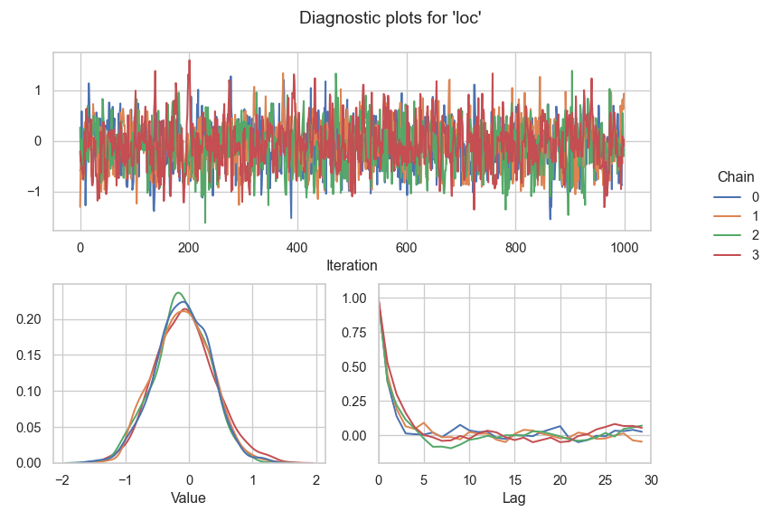

<!-- README.md is generated from README.qmd. Please edit that file -->

# Liesel: A Probabilistic Programming Framework

[](https://pypi.org/project/liesel)
[](https://docs.liesel-project.org/en/latest)
[](https://github.com/liesel-devs/liesel/actions/workflows/pre-commit.yml)
[](https://github.com/liesel-devs/liesel/actions/workflows/pytest.yml)
[](https://github.com/liesel-devs/liesel/actions/workflows/pytest.yml)


Liesel is a probabilistic programming framework with a focus on
semi-parametric regression. It includes:

- **Liesel**, a library to express statistical models as Probabilistic
  Graphical Models (PGMs). Through the PGM representation, the user can
  build and update models in a natural way.
- **Goose**, a library to build custom MCMC algorithms with several
  parameter blocks and MCMC kernels such as the No U-Turn Sampler
  (NUTS), the Iteratively Weighted Least Squares (IWLS) sampler, or
  different Gibbs samplers. Goose also takes care of the MCMC
  bookkeeping and the chain post-processing.
- [**Liesel-GAM**](https://github.com/liesel-devs/liesel_gam), a
  modeling library built on Liesel which assists the user with the
  configuration of semi-parametric regression models such as Generalized
  Additive Models for Location, Scale and Shape (GAMLSS) with different
  response distributions, spline-based smooth terms and shrinkage
  priors.

The name “Liesel” is an homage to the [Gänseliesel
fountain](https://en.wikipedia.org/wiki/G%C3%A4nseliesel), landmark of
Liesel’s birth city
[Göttingen](https://en.wikipedia.org/wiki/G%C3%B6ttingen).

## Resources

- :newspaper: [Paper on arXiv](https://arxiv.org/abs/2209.10975)
- :girl::swan::computer: [Liesel & Goose
  repo](https://github.com/liesel-devs/liesel)
- :girl::swan::book: [Liesel & Goose API
  docs](https://docs.liesel-project.org)
- :registered::computer: [RLiesel
  repo](https://github.com/liesel-devs/rliesel)
- :book:
  [Tutorials](https://docs.liesel-project.org/en/latest/tutorials_overview.html)

## Usage

The following example shows how to build a simple i.i.d. normal model
with Liesel. We set up two parameters and one observed variable, and
combine them in a model.

``` python
import jax.numpy as jnp
import tensorflow_probability.substrates.jax.distributions as tfd
import liesel.model as lsl

loc = lsl.Var.new_param(0.0, name="loc", inference=gs.MCMCSpec(gs.NUTSKernel))
scale = lsl.Var.new_param(1.0, name="scale")

y = lsl.Var.new_obs(
    value=jnp.array([1.314, 0.861, -1.813, 0.587, -1.408]),
    distribution=lsl.Dist(tfd.Normal, loc=loc, scale=scale),
    name="y",
)

model = lsl.Model([y])
```

The model allows us to evaluate the log-probability through a property,
which is updated automatically if the value of a node is modified.

``` python
model.log_prob
```

    Array(-8.635652, dtype=float32)

``` python
model.vars["loc"].value = -0.5
model.log_prob
```

    Array(-9.031153, dtype=float32)

We can estimate the mean parameter with Goose and a NUTS sampler.
Goose’s workhorse to run an MCMC algorithm is the `Engine`, which can be
constructed with the `EngineBuilder`. The builder allows us to assign
different MCMC kernels to one or more parameters. We also need to
specify the model, the initial values, and the sampling duration, before
we can run the sampler.

``` python
import liesel.goose as gs

builder = gs.LieselMCMC(model).get_engine_builder(seed=42, num_chains=4)

 # we disable the progress bar for a nicer display here in the readme
builder.show_progress = False

builder.add_adaptation(1000)
builder.add_posterior(1000)

engine = builder.build()
engine.sample_all_epochs()
```

Finally, we can print a summary table and view some diagnostic plots.

``` python
results = engine.get_results()
gs.Summary(results)
```

<p>
<strong>Parameter summary:</strong>
</p>
<table border="0" class="dataframe">
<thead>
<tr style="text-align: right;">
<th>
</th>
<th>
</th>
<th>
kernel
</th>
<th>
mean
</th>
<th>
sd
</th>
<th>
q_0.05
</th>
<th>
q_0.5
</th>
<th>
q_0.95
</th>
<th>
sample_size
</th>
<th>
ess_bulk
</th>
<th>
ess_tail
</th>
<th>
rhat
</th>
</tr>
<tr>
<th>
parameter
</th>
<th>
index
</th>
<th>
</th>
<th>
</th>
<th>
</th>
<th>
</th>
<th>
</th>
<th>
</th>
<th>
</th>
<th>
</th>
<th>
</th>
<th>
</th>
</tr>
</thead>
<tbody>
<tr>
<th>
loc
</th>
<th>
()
</th>
<td>
kernel_00
</td>
<td>
-0.116
</td>
<td>
0.444
</td>
<td>
-0.828
</td>
<td>
-0.137
</td>
<td>
0.634
</td>
<td>
4000
</td>
<td>
1272.391
</td>
<td>
2643.513
</td>
<td>
1.002
</td>
</tr>
</tbody>
</table>
<p>
<strong>Error summary:</strong>
</p>
<table border="0" class="dataframe">
<thead>
<tr style="text-align: right;">
<th>
</th>
<th>
</th>
<th>
</th>
<th>
</th>
<th>
count
</th>
<th>
sample_size
</th>
<th>
sample_size_total
</th>
<th>
relative
</th>
</tr>
<tr>
<th>
kernel
</th>
<th>
error_code
</th>
<th>
error_msg
</th>
<th>
phase
</th>
<th>
</th>
<th>
</th>
<th>
</th>
<th>
</th>
</tr>
</thead>
<tbody>
<tr>
<th rowspan="2" valign="top">
kernel_00
</th>
<th rowspan="2" valign="top">
1
</th>
<th rowspan="2" valign="top">
divergent transition
</th>
<th>
warmup
</th>
<td>
45
</td>
<td>
4000
</td>
<td>
4000
</td>
<td>
0.011
</td>
</tr>
<tr>
<th>
posterior
</th>
<td>
0
</td>
<td>
4000
</td>
<td>
4000
</td>
<td>
0.000
</td>
</tr>
</tbody>
</table>

``` python
gs.plot_param(results, param="loc")
```



## Installation

Liesel requires Python ≥ 3.13. Create and activate a virtual
environment, and install the latest release from PyPI:

    pip install liesel

You can also install the development version from GitHub. Liesel uses
`uv` for the project management so make sure the tool is installed.

    git clone https://github.com/liesel-devs/liesel.git
    cd liesel
    uv sync
    # or `uv sync --dev` for an editable install including the dev dependencies
    # or `uv sync --locked` for an installation using the dependencies locked in the uv.lock file

Liesel depends on JAX and `jaxlib`. As of now, there are no official
`jaxlib` wheels for Windows. If you are on Windows, the JAX developers
recommend using the [Windows Subsystem for
Linux](https://docs.microsoft.com/en-us/windows/wsl/about).
Alternatively, you can [build `jaxlib` from
source](https://jax.readthedocs.io/en/latest/developer.html#additional-notes-for-building-jaxlib-from-source-on-windows)
or try the unofficial `jaxlib` wheels from
<https://github.com/cloudhan/jax-windows-builder>.

If you are using the `lsl.plot_model()` function, installing
[Graphviz](https://graphviz.org) will greatly improve the layout of the
model graphs.

## Development

Please run

1.  `pre-commit run -a` before committing your work,
2.  make sure the tests don’t fail with `pytest --run-mcmc`, and
3.  make sure the examples in your docstrings are up-to-date with
    `pytest --doctest-modules liesel`.

when you are using `uv` to manage the project, you can run these
commends in the virtual environment by prepending `uv run` to the
commands, e.g., `uv run pre-commit run -a`.

## Acknowledgements

Liesel is being developed by Paul Wiemann, Hannes Riebl, Johannes
Brachem and Gianmarco Callegher with support from Thomas Kneib.
Important contributions were made by Joel Beck and Alex Afanasev. We are
grateful to the German Research Foundation (DFG) for funding the
development through grant KN 922/11-1.
