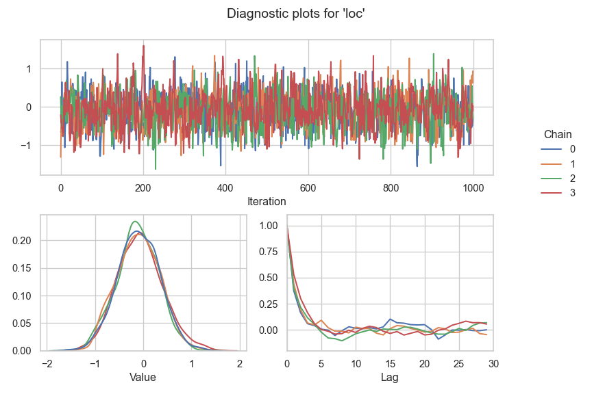

# Liesel: A Probabilistic Programming Framework


Liesel is a probabilistic programming framework with a focus on
semi-parametric regression. It includes:

-   **Liesel**, a library to express statistical models as Probabilistic
    Graphical Models (PGMs). Through the PGM representation, the user
    can build and update models in a natural way.
-   **Goose**, a library to build custom MCMC algorithms with several
    parameter blocks and MCMC kernels such as the No U-Turn Sampler
    (NUTS), the Iteratively Weighted Least Squares (IWLS) sampler, or
    different Gibbs samplers. Goose also takes care of the MCMC
    bookkeeping and the chain post-processing.
-   [**RLiesel**](https://github.com/liesel-devs/rliesel), an R
    interface for Liesel which assists the user with the configuration
    of semi-parametric regression models such as Generalized Additive
    Models for Location, Scale and Shape (GAMLSS) with different
    response distributions, spline-based smooth terms and shrinkage
    priors.

The name “Liesel” is an homage to the [Gänseliesel
fountain](https://en.wikipedia.org/wiki/G%C3%A4nseliesel), landmark of
Liesel’s birth city
[Göttingen](https://en.wikipedia.org/wiki/G%C3%B6ttingen).

## Usage

The following example shows how to build a simple i.i.d. normal model
with Liesel. We set up two parameter and one data node, and combine them
in a model.

``` python
import numpy as np

import liesel.liesel as lsl

n_loc = lsl.Parameter(0.0, name="loc")
n_scale = lsl.Parameter(1.0, name="scale")

n_y = lsl.Node(
    value=np.array([1.314, 0.861, -1.813, 0.587, -1.408]),
    distribution=lsl.NodeDistribution("Normal", loc=n_loc, scale=n_scale),
    name="y",
)

model = lsl.Model([n_loc, n_scale, n_y])
```

The model allows us to evaluate the log-probability through a property,
which is updated automatically if the value of a node is modified.

``` python
model.log_prob
```

    ## -8.635652087852478

``` python
n_loc.value = -0.5
model.log_prob
```

    ## -9.031152087852478

We can estimate the mean parameter with Goose and a NUTS sampler.
Goose’s workhorse to run an MCMC algorithm is the `Engine`, which can be
constructed with the `EngineBuilder`. The builder allows us to assign
different MCMC kernels to one or more parameters. We also need to
specify the model, the initial values, and the sampling duration, before
we can run the sampler.

``` python
import liesel.goose as gs

builder = gs.EngineBuilder(seed=42, num_chains=4)

builder.add_kernel(gs.NUTSKernel(["loc"]))
builder.set_model(lsl.GooseModel(model))
builder.set_initial_values(model.state)

builder.set_duration(warmup_duration=1000, posterior_duration=1000)

engine = builder.build()
engine.sample_all_epochs()
```

    ## INFO - Starting epoch: FAST_ADAPTATION, 75 transitions, 25 jitted together
    ## WARNING - Errors per chain for kernel_00: 1, 2, 2, 2 / 75 transitions
    ## INFO - Finished epoch
    ## INFO - Starting epoch: SLOW_ADAPTATION, 25 transitions, 25 jitted together
    ## WARNING - Errors per chain for kernel_00: 1, 1, 1, 1 / 25 transitions
    ## INFO - Finished epoch
    ## INFO - Starting epoch: SLOW_ADAPTATION, 50 transitions, 25 jitted together
    ## WARNING - Errors per chain for kernel_00: 2, 1, 1, 2 / 50 transitions
    ## INFO - Finished epoch
    ## INFO - Starting epoch: SLOW_ADAPTATION, 100 transitions, 25 jitted together
    ## WARNING - Errors per chain for kernel_00: 2, 2, 1, 2 / 100 transitions
    ## INFO - Finished epoch
    ## INFO - Starting epoch: SLOW_ADAPTATION, 200 transitions, 25 jitted together
    ## WARNING - Errors per chain for kernel_00: 2, 2, 2, 1 / 200 transitions
    ## INFO - Finished epoch
    ## INFO - Starting epoch: SLOW_ADAPTATION, 500 transitions, 25 jitted together
    ## WARNING - Errors per chain for kernel_00: 1, 1, 2, 1 / 500 transitions
    ## INFO - Finished epoch
    ## INFO - Starting epoch: FAST_ADAPTATION, 50 transitions, 25 jitted together
    ## WARNING - Errors per chain for kernel_00: 1, 2, 1, 1 / 50 transitions
    ## INFO - Finished epoch
    ## INFO - Finished warmup
    ## INFO - Starting epoch: POSTERIOR, 1000 transitions, 25 jitted together
    ## INFO - Finished epoch

Finally, we can print a summary table and view some diagnostic plots.

``` python
results = engine.get_results()
gs.summary(results)
```

|     | param_index | chain_index | num_samples | num_effective |   mean |    sd |  rhat |    q_5 |   q_50 |  q_95 | hdi_90_low | hdi_90_high |
|:----|------------:|------------:|------------:|--------------:|-------:|------:|------:|-------:|-------:|------:|-----------:|------------:|
| loc |           0 |           0 |        1000 |       399.549 |   -0.1 | 0.438 | 1.001 | -0.817 |   -0.1 | 0.612 |     -0.783 |        0.63 |
| loc |           0 |           1 |        1000 |       373.287 | -0.099 |  0.44 | 1.001 | -0.838 | -0.096 | 0.624 |     -0.878 |       0.544 |
| loc |           0 |           2 |        1000 |       395.392 | -0.116 | 0.434 | 1.001 | -0.883 | -0.117 | 0.585 |       -0.8 |       0.627 |
| loc |           0 |           3 |        1000 |       322.511 | -0.062 | 0.472 | 1.001 | -0.794 | -0.074 | 0.741 |     -0.816 |       0.709 |

``` python
gs.plot_param(results, param="loc")
```



## Paper, tutorials and API documentation

For a scientific discussion of the software, see our paper on arXiv (in
preparation). If you want to try out Liesel yourself, take a look at the
[tutorials](https://liesel-devs.github.io/liesel-tutorials) and the [API
documentation](https://liesel-devs.github.io/liesel).

## Installation

Liesel requires Python ≥ 3.10. Create and activate a virtual
environment, and run these commands to install Liesel:

    git clone https://github.com/liesel-devs/liesel.git
    cd liesel
    pip install .
    # or `pip install -e .[dev]` for an editable install including the dev utils

Liesel depends on JAX and `jaxlib`. As of now, there are no official
`jaxlib` wheels for Windows. If you are on Windows, the JAX developers
recommend using the [Windows Subsystem for
Linux](https://docs.microsoft.com/en-us/windows/wsl/about).
Alternatively, you can [build `jaxlib` from
source](https://jax.readthedocs.io/en/latest/developer.html#additional-notes-for-building-jaxlib-from-source-on-windows)
or try the unofficial `jaxlib` wheels from
<https://github.com/cloudhan/jax-windows-builder>.

If you are using the `lsl.plot_model()` function, installing
`pygraphviz` will greatly improve the layout of the model graphs. Make
sure you have the [Graphviz](https://graphviz.org) development headers
on your system and run:

    pip install pygraphviz

Again, the installation is a bit more challenging on Windows, but there
are [instructions on the `pygraphviz`
website](https://pygraphviz.github.io/documentation/stable/install.html#windows).

## Development

Please run `pre-commit run -a` before committing your work, and make
sure the tests don’t fail with `pytest --run-mcmc`.

## Acknowledgements

Liesel is being developed by Paul Wiemann and Hannes Riebl with support
from Thomas Kneib. Important contributions were made by Joel Beck, Alex
Afanasev, Gianmarco Callegher and Johannes Brachem. We are grateful to
the German Research Foundation (DFG) for funding the development through
grant 443179956.
