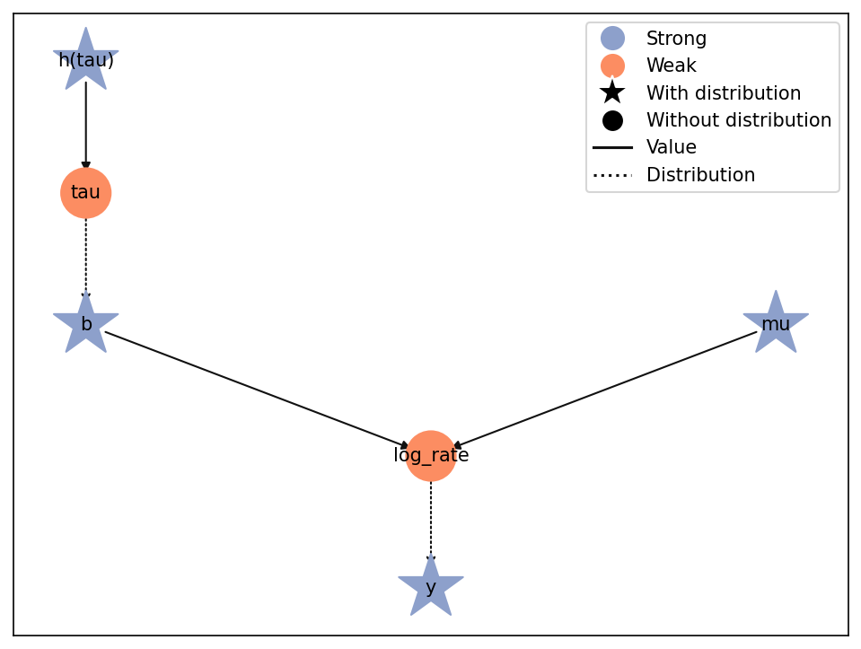
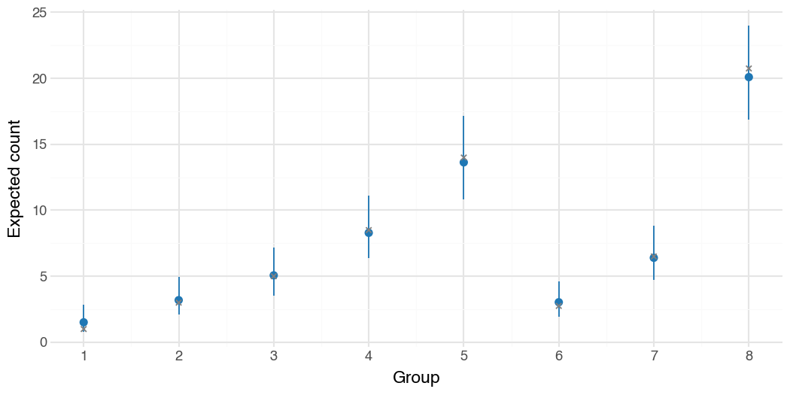

Laplace approximation and REML
==============================

:class:`liesel.optim.LaplaceLoss` integrates selected continuous parameters out
of the model's joint density, then fits the remaining parameters. Here we fit a
Poisson model's mean and random-effect scale while integrating eight group effects.

.. note::

   **Relation to REML.** ``LaplaceLoss`` approximates integration over selected
   parameters in smooth models, including non-Gaussian and nonlinear models.
   The integrated coordinates, priors, and Jacobians determine the target. Here
   we integrate the group effects and retain parameter priors, yielding a
   marginal posterior.

   Classical restricted maximum likelihood (REML) is a special case: integrate
   both random effects and fixed-effect coefficients in a Gaussian linear mixed
   model, with flat priors on the latter and no additional prior or Jacobian terms
   on the remaining parameters. Laplace integration is then exact; see
   `Bates et al., Section 3.4
   <https://lme4.github.io/lme4/articles/lmer.pdf#page=16>`__.

Build and inspect the model
---------------------------

Use float64 for this example: enable it before creating arrays and pass
``to_float32=False`` to the model.

.. code-block:: python

   import jax
   import jax.numpy as jnp
   import tensorflow_probability.substrates.jax.bijectors as tfb
   import tensorflow_probability.substrates.jax.distributions as tfd

   import liesel.model as lsl
   import liesel.optim as opt

   jax.config.update("jax_enable_x64", True)

   counts = jnp.array(
       [
           [1.0, 2.0, 1.0, 0.0],
           [3.0, 2.0, 4.0, 3.0],
           [6.0, 5.0, 4.0, 5.0],
           [9.0, 7.0, 10.0, 8.0],
           [13.0, 16.0, 12.0, 15.0],
           [2.0, 4.0, 3.0, 2.0],
           [5.0, 8.0, 6.0, 7.0],
           [20.0, 23.0, 19.0, 21.0],
       ]
   )
   group = jnp.repeat(jnp.arange(8), 4)

   mu = lsl.Var.new_param(1.0, lsl.Dist(tfd.Normal, 0.0, 2.0), name="mu")
   tau = lsl.Var.new_param(
       0.5,
       lsl.Dist(tfd.LogNormal, jnp.log(0.5), 0.7),
       bijector=tfb.Exp(),
       name="tau",
   )
   b = lsl.Var.new_param(jnp.zeros(8), lsl.Dist(tfd.Normal, 0.0, tau), name="b")
   log_rate = lsl.Var.new_calc(lambda mu, b: mu + b[group], mu, b, name="log_rate")
   y = lsl.Var.new_obs(counts.ravel(), lsl.Dist(tfd.Poisson, log_rate=log_rate), name="y")

   model = lsl.Model(y, to_float32=False)
   model.plot(width=8, height=6)

   The group effects ``b`` enter the log rate; ``tau`` controls their prior scale.

Fit the marginal posterior
--------------------------

.. code-block:: python

   loss = opt.LaplaceLoss(model, latent=["b"])
   stopper = opt.Stopper(epochs=60, patience=10, rtol=1e-10)
   result = opt.LieselOptim(
       model,
       loss=loss,
       optimizers="lbfgs",
       loss_monitor="train_full_data",
       stopper=stopper,
       show_progress=False,
   ).fit()
   print(result.status)

.. code-block:: text

   early_stopping

Use full-data batches and ``"train_full_data"`` monitoring. The outer coordinates
are ``mu`` and ``h(tau)``; ``b`` keeps its prior. The unscaled loss includes priors,
Jacobians, and normalization constants; see :doc:`optimizer-loss-scaling`.

Inspect the conditional mode
----------------------------

The fit retains the group effects at their conditional mode, together with the
outer parameters that produced them. Recover both from the best recorded fit:

.. code-block:: python

   outer = result.position_min_monitor
   state = result.loss_state_min_monitor
   b_mode = state.latent_position["b"]

   print(f"mu = {outer['mu']:.3f}, log(tau) = {outer['h(tau)']:.3f}")
   print(b_mode.round(3))

.. code-block:: text

   mu = 1.679, log(tau) = -0.229
   [-1.272 -0.514 -0.064  0.441  0.934 -0.586  0.182  1.328]

Each effect multiplies the baseline rate ``exp(mu)`` by ``exp(b)``.
For the first group, the multiplier is about ``exp(-1.272) = 0.28``;
for the last group, it is about ``exp(1.328) = 3.77``.

For the final snapshot, pair ``position_final`` with ``loss_state_final``.
See :class:`~liesel.optim.LaplaceState` for convergence diagnostics, coordinate
ordering, and the saved curvature in ``latent_precision_cholesky``.

Construct joint uncertainty on request
--------------------------------------

Turn the completed fit into a joint Gaussian approximation for ``mu``, ``h(tau)``,
and all eight group effects. It includes their correlations, so each draw is a
complete parameter set that can be passed directly to ``Model.predict``:

.. code-block:: python

   posterior = loss.approximate_joint_posterior(result)
   draws = posterior.sample(jax.random.key(42), sample_shape=(1000,))
   predicted = model.predict(draws, predict=["tau", "log_rate"])
   tau_draws = predicted["tau"]
   rate_draws = jnp.exp(predicted["log_rate"])

``Model.predict`` transforms draws back to the positive ``tau`` scale and evaluates
the log rates. For example, summarize the between-group scale with its 5th, 50th,
and 95th percentiles:

.. code-block:: python

   quantiles = jnp.array([0.05, 0.5, 0.95])
   print(jnp.quantile(tau_draws, quantiles).round(3))

.. code-block:: text

   [0.516 0.787 1.194]

The approximate posterior median is 0.79, with a 90% credible interval of
0.52 to 1.19. The same draws give intervals for each group's expected count:

.. code-block:: python

   import pandas as pd
   import plotnine as p9

   group_rates = rate_draws[:, ::4]  # Four observations share each group's rate.
   lower, median, upper = jnp.quantile(group_rates, quantiles, axis=0)
   rate_summary = pd.DataFrame(
       {
           "group": range(1, 9),
           "median": median,
           "lower": lower,
           "upper": upper,
           "observed": counts.mean(axis=1),
       }
   )
   rate_plot = (
       p9.ggplot(rate_summary, p9.aes(x="group", y="median"))
       + p9.geom_pointrange(p9.aes(ymin="lower", ymax="upper"), color="#1f77b4")
       + p9.geom_point(
           p9.aes(y="observed"),
           shape="x",
           color="black",
           size=2.5,
           stroke=0.8,
           position=p9.position_nudge(x=0.15),
       )
       + p9.scale_x_continuous(breaks=range(1, 9))
       + p9.labs(x="Group", y="Expected count")
       + p9.theme_minimal()
       + p9.theme(figure_size=(7, 3.5))
   )
   rate_plot.show()

   Blue points and bars show posterior medians and 90% credible intervals;
   black crosses mark observed means, shifted slightly to the right for clarity.
   The intervals carry uncertainty in the mean, scale, and group effects through
   to expected counts. New observations also vary according to the Poisson
   distribution.

For matrix calculations, ``posterior.covariance()`` constructs the full covariance
on request. ``posterior.names`` and ``posterior.shapes`` describe its ordering.

The helper adds curvature work once per call and checks stationarity and positive
definiteness. It selects ``at="best"`` by default; use ``at="final"`` for the final
snapshot. Keep the model, data, and fixed parameters unchanged between fitting and
this call. See :meth:`~liesel.optim.LaplaceLoss.approximate_joint_posterior` for controls.

Inspect a failure deliberately
------------------------------

An insufficient inner budget makes a useful diagnostic example:

.. code-block:: python

   short_loss = opt.LaplaceLoss(model, latent=["b"], inner_max_iter=1)
   failed = opt.LieselOptim(
       model,
       loss=short_loss,
       optimizers="lbfgs",
       loss_monitor="train_full_data",
       show_progress=False,
   ).fit()
   print(failed.status)
   print(failed.failure_reason)
   print((int(failed.failed_loss_state.status), int(failed.failed_loss_state.n_iter)))

.. code-block:: text

   numerical_failure
   Inner Laplace optimization failed: iteration limit.
   (2, 1)

Failures preserve the last valid snapshot; without one, the loss state is ``None``.
Failed fits cannot resume; earlier saved checkpoints remain available.

The posterior helper raises on failure by default. ``raise_on_failure=False`` returns
an invalid diagnostic object with available gradients, curvature, and the failure
reason:

.. code-block:: python

   diagnostic = short_loss.approximate_joint_posterior(failed, raise_on_failure=False)
   print(diagnostic.valid)

.. code-block:: text

   False

Its ``sample`` and ``covariance`` methods raise.

Control inner warm starts
-------------------------

By default, each inner solve starts from the latent mode committed at the end of
the previous epoch. Set ``warm_start=False`` to start from the model's latent values:

.. code-block:: python

   cold_loss = opt.LaplaceLoss(model, latent=["b"], warm_start=False)

Pass ``cold_loss`` to a new fit to compare. Resuming an interrupted fit is a separate
operation: :doc:`optimizer-checkpointing` explains how to resume with saved states.

Choose numerical controls
-------------------------

``inner_max_iter`` defaults to 100. ``inner_tol`` bounds half the inner squared
Newton decrement: ``None`` chooses ``1e-6`` for float32 or ``1e-10`` for float64.

The solver finds a local mode; warm and cold starts can find different modes.
Dense curvature uses O(d²) storage and O(d³) linear algebra for d latent coordinates.
This version targets a few hundred latents with a modest outer dimension.
