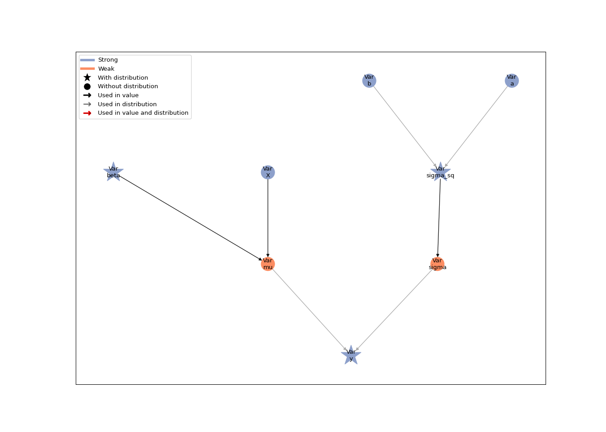
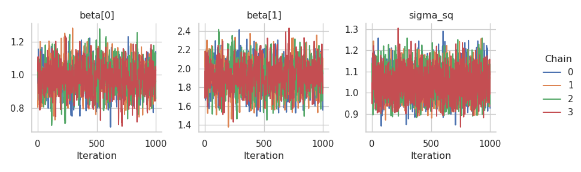
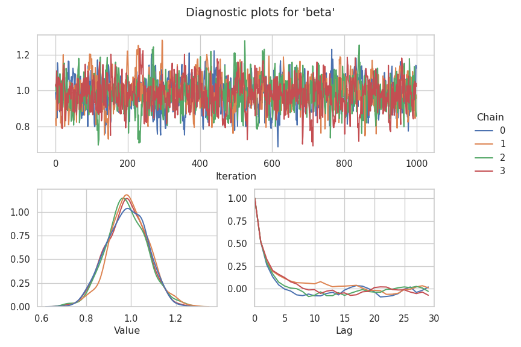

# Linear regression

In this tutorial, we build a linear regression model with Liesel and
estimate it with Goose. Our goal is to illustrate the most important
features of the software in a straightforward context.

## Model building with Liesel

Liesel is based on the concept of probabilistic graphical models (PGMs)
to represent (primarily Bayesian) statistical models, so let us start
with a very brief look at what PGMs are and how they are implemented in
Liesel.

### Probabilistic graphical models

In a PGM, each variable is represented as a node. There are two basic
types of nodes in Liesel: strong and weak nodes. A strong node is a node
whose value is defined “outside” of the model, for example, if the node
represents some observed data or a parameter (parameters are usually set
by an inference algorithm such as an optimizer or sampler). In contrast,
a weak node is a node whose value is defined “within” the model, that
is, it is a deterministic function of some other nodes. An
exp-transformation mapping a real-valued parameter to a positive number,
for example, would be a weak node.

In addition, each node can have an optional probability distribution.
The probability density or mass function of the distribution evaluated
at the value of the node gives its log-probability. In a typical
Bayesian regression model, the response node would have a normal
distribution and the parameter nodes would have some prior distribution
(for example, a normal-inverse-gamma prior). The following table shows
the different node types and some examples of their use cases.

|                          | **Strong node**              | **Weak node**                                      |
|--------------------------|------------------------------|----------------------------------------------------|
| **With distribution**    | Response, parameter, …       | Copula, …                                          |
| **Without distribution** | Covariate, hyperparameter, … | Inverse link function, parameter transformation, … |

A PGM is essentially a collection of connected nodes. Two nodes can be
connected through a directed edge, meaning that the first node is an
input for the value or the distribution of the second node. Nodes
*without* an edge between them are assumed to be conditionally
independent, allowing us to factorize the model log-probability as

$$
\log p(\text{Model}) = \sum_{\text{Node $\in$ Model}} \log p(\text{Node} \mid \text{Inputs}(\text{Node})).
$$

### Imports

Before we can generate the data and build the model graph, we need to
load Liesel and a number of other packages. We usually import the model
building library `liesel.model` as `lsl`, and the MCMC library
`liesel.goose` as `gs`.

``` python
import jax
import jax.numpy as jnp
import numpy as np
import matplotlib.pyplot as plt

# We use distributions and bijectors from tensorflow probability
import tensorflow_probability.substrates.jax.distributions as tfd
import tensorflow_probability.substrates.jax.bijectors as tfb

import liesel.goose as gs
import liesel.model as lsl

rng = np.random.default_rng(42)
```

### Generating the data

Now we can simulate 500 observations from the linear regression model
$y_i \sim \mathcal{N}(\beta_0 + \beta_1 x_i, \;\sigma^2)$ with the true
parameters $\boldsymbol{\beta} = (\beta_0, \beta_1)' = (1, 2)'$ and
$\sigma = 1$. The relationship between the response $y_i$ and the
covariate $x_i$ is visualized in the following scatterplot.

``` python
# sample size and true parameters

n = 500
true_beta = np.array([1.0, 2.0])
true_sigma = 1.0

# data-generating process

x0 = rng.uniform(size=n)
X_mat = np.column_stack([np.ones(n), x0])
eps = rng.normal(scale=true_sigma, size=n)
y_vec = X_mat @ true_beta + eps

# plot the simulated data

plt.scatter(x0, y_vec)
plt.title("Simulated data from the linear regression model")
plt.xlabel("Covariate x")
plt.ylabel("Response y")
plt.show()
```


### Building the model graph

The graph of a Bayesian linear regression model is a tree, where the
hyperparameters of the prior are the leaves and the response is the
root. To build this tree in Liesel, we need to start from the leaves and
work our way down to the root. As the most basic building blocks of a
model, Liesel provides the {class}`.Var` class for instantiating
variables and the {class}`.Dist`, class for wrapping probability
distributions. The {class}`.Var` class comes with four constructors,
namely {meth}`.Var.new_param` for parameters, {meth}`.Var.new_obs` for
observed data, {meth}`.Var.new_calc` for variables that are
deterministic functions of other variables in the model, and
{meth}`.Var.new_value` for fixed values. See also [Model Building
(liesel.model)](model_overview).

#### The regression coefficients

Let’s assume the weakly informative prior
$\beta_0, \beta_1 \sim \mathcal{N}(0, 100^2)$ for the regression
coefficients. Now, let us create the node for the regression
coefficients.

To do so, we need to define its initial value and its node distribution
using the {class}`.Dist` class. This class wraps distribution classes
with the TensorFlow Probability (TFP) API to connect them to our node
classes. Here, the node distribution is initialized with three
arguments: the TFP distribution object
[(`tfd.Normal`)](https://www.tensorflow.org/probability/api_docs/python/tfp/distributions/Normal),
and the two hyperparameter nodes representing the parameters of the
distribution. TFP uses the names `loc` for the mean and `scale` for the
standard deviation, so we have to use the same names here. This is a
general feature of {class}`.Dist`, you can always use the parameter
names from TFP to refer to the parameters of your distribution.

``` python
beta_prior = lsl.Dist(tfd.Normal, loc=0.0, scale=100.0)
```

Note that you could also provide a {class}`.Node` or {class}`.Var`
instance for the `loc` and `scale` argument - this fact allows you to
build hierarchical models. If you provide floats like we do here, Liesel
will turn them into {class}`.Value` nodes under the hood.

With this distribution object, we can now create the node for our
regression coefficient with the {meth}`.Var.new_param` constructor:

``` python
beta = lsl.Var.new_param(value=np.array([0.0, 0.0]), distribution=beta_prior, name="beta")
```

#### The standard deviation

The second branch of the tree contains the residual standard deviation.
We build it in a similar way, now using the weakly informative prior
$\sigma^2 \sim \text{InverseGamme}(a, b)$ with $a = b = 0.01$ on the
squared standard deviation, i.e. the variance. Again, we use the
parameter names based on TFP. This time, we supply the hyperparameters
as {class}`.Var` instances.

``` python
a = lsl.Var.new_param(0.01, name="a")
b = lsl.Var.new_param(0.01, name="b")
sigma_sq_prior = lsl.Dist(tfd.InverseGamma, concentration=a, scale=b)
sigma_sq = lsl.Var.new_param(value=10.0, distribution=sigma_sq_prior, name="sigma_sq")
```

Since we need to work not only with the variance, but with the scale, we
initialize the scale using {meth}`.Var.new_calc`, to compute the square
root.

We can use this variable constructor to include computations based on
our nodes. It always takes a function as its first argument, and the
nodes to be used as function inputs as the following arguments. This is
the first weak node that we are setting up - all previous nodes have
been strong.

``` python
sigma = lsl.Var.new_calc(jnp.sqrt, sigma_sq, name="sigma").update()
```

#### Design matrix, fitted values, and response

To compute the matrix-vector product $\mathbf{X}\boldsymbol{\beta}$, we
use another variable instantiated via {meth}`.Var.new_calc`. We can view
our model as $y_i \sim \mathcal{N}(\mu_i, \;\sigma^2)$ with
$\mu_i = \beta_0 + \beta_1 x_i$, so we use the name `mu` for this
product.

``` python
X = lsl.Var.new_obs(X_mat, name="X")
mu = lsl.Var.new_calc(jnp.dot, X, beta, name="mu")
```

Finally, we can connect the branches of the tree in a response node. The
value of the node are our observed response values. And since we assumed
the model $y_i \sim \mathcal{N}(\beta_0 + \beta_1 x_i, \;\sigma^2)$, we
also need to specify the response’s distribution. We use our previously
created nodes `sigma` and `mu` to specify this distribution:

``` python
y_dist = lsl.Dist(tfd.Normal, loc=mu, scale=sigma)
y = lsl.Var.new_obs(y_vec, distribution=y_dist, name="y")
```

#### Bringing the model together

Now, to construct a full-fledged Liesel model from our individual node
objects, we can set up the {class}`.Model`. Here, we will only add the
response node.

``` python
model = lsl.Model([y])
model
```

    Model(24 nodes, 8 vars)

Since all other nodes are directly or indirectly connected to this node,
the Model will add those nodes automatically when it builds the model.
The model provides a couple of convenience features, for example, to
evaluate the model log-probability, or to update the nodes in a
topological order.

The {func}`.plot_vars()` function visualizes the graph of a model.
Strong nodes are shown in blue, weak nodes in red. Nodes with a
probability distribution are highlighted with a star. In the figure
below, we can see the tree-like structure of the graph and identify the
two branches for the mean and the standard deviation of the response. If
the layout of the graph looks messy for you, please make sure you have
the `pygraphviz` package installed.

``` python
lsl.plot_vars(model)
```



### Node and model log-probabilities

The log-probability of the model, which can be interpreted as the
(unnormalized) log-posterior in a Bayesian context, can be accessed with
the `log_prob` property.

``` python
model.log_prob
```

    Array(-1179.6559, dtype=float32)

The individual nodes also have a `log_prob` property. In fact, because
of the conditional independence assumption of the model, the
log-probability of the model is given by the sum of the
log-probabilities of the nodes with probability distributions. We take
the sum for the `.log_prob` attributes of `beta` and `y` because, per
default, the attributes return the individual log-probability
contributions of each element in the values of the nodes. So for `beta`
we would get two log-probability values, and for `y` we would get 500.

``` python
beta.log_prob.sum() + sigma_sq.log_prob + y.log_prob.sum()
```

    Array(-1179.6559, dtype=float32)

Nodes without a probability distribution return a log-probability of
zero.

``` python
sigma.log_prob
```

    0.0

The log-probability of a node depends on its value and its inputs. Thus,
if we change the variance of the response from 10 to 1, the
log-probability of the corresponding node, the log-probability of the
response node, and the log-probability of the model change as well. Note
that, since the actual input to the response distribution is the
standard deviation $\sigma$, we have to update its value after changing
the value of $\sigma^2$.

``` python
print(f"Old value of sigma_sq: {sigma_sq.value}")
```

    Old value of sigma_sq: 10.0

``` python
print(f"Old log-prob of sigma_sq: {sigma_sq.log_prob}")
```

    Old log-prob of sigma_sq: -6.972140312194824

``` python
print(f"Old log-prob of y: {y.log_prob.sum()}\n")
```

    Old log-prob of y: -1161.635498046875

``` python
sigma_sq.value = 1.0
sigma.update()
```

    Var(name="sigma")

``` python
print(f"New value of sigma_sq: {sigma_sq.value}")
```

    New value of sigma_sq: 1.0

``` python
print(f"New log-prob of sigma_sq: {sigma_sq.log_prob}")
```

    New log-prob of sigma_sq: -4.655529975891113

``` python
print(f"New log-prob of y: {y.log_prob.sum()}\n")
```

    New log-prob of y: -1724.6702880859375

``` python
print(f"New model log-prob: {model.log_prob}")
```

    New model log-prob: -1740.3740234375

For most inference algorithms, we need the gradient of the model
log-probability with respect to the parameters. Liesel uses [the JAX
library for numerical computing and machine
learning](https://github.com/google/jax) to compute gradients using
automatic differentiation.

## MCMC inference with Goose

This section illustrates the key features of Liesel’s MCMC framework
Goose. To use Goose, the user needs to select one or more sampling
algorithms, called (transition) kernels, for the model parameters. Goose
comes with a number of standard kernels such as Hamiltonian Monte Carlo
({class}`~.goose.HMCKernel`) or the No U-Turn Sampler
({class}`~.goose.NUTSKernel`). Multiple kernels can be combined in one
sampling scheme and assigned to different parameters, and the user can
implement their own problem-specific kernels, as long as they are
compatible with the {class}`.Kernel` protocol. In any case, the user is
responsible for constructing a mathematically valid algorithm. Refer to
[MCMC Sampling (liesel.goose)](goose_overview) for an overview of
important Goose functionality.

We start with a very simple sampling scheme, keeping $\sigma^2$ fixed at
the true value and using a NUTS sampler for $\boldsymbol{\beta}$. The
kernels are added to a {class}`~.goose.Engine`, which coordinates the
sampling, including the kernel tuning during the warmup, and the MCMC
bookkeeping. The engine can be configured step by step with a
{class}`.EngineBuilder`. We need to inform the builder about the model,
the initial values, the kernels, and the sampling duration. Finally, we
can call the {meth}`.EngineBuilder.build` method, which returns a fully
configured engine.

``` python
sigma_sq.value = true_sigma**2 # setting sigma_sq to the true value

builder = gs.EngineBuilder(seed=1337, num_chains=4)

interface = gs.LieselInterface(model)
builder.set_model(interface)
builder.set_initial_values(model.state)

builder.add_kernel(gs.NUTSKernel(["beta"]))

builder.set_duration(warmup_duration=1000, posterior_duration=1000)

engine = builder.build()
```

Now we can run the MCMC algorithm for the specified duration by calling
the {meth}`~.goose.Engine.sample_all_epochs` method. In a first step,
the model and the sampling algorithm are compiled, so don’t worry if you
don’t see an output right away. The subsequent samples will be generated
much faster. Finally, we can extract the results and print a summary
table.

``` python
engine.sample_all_epochs()
```


      0%|                                                  | 0/3 [00:00<?, ?chunk/s]
     33%|##############                            | 1/3 [00:03<00:06,  3.13s/chunk]
    100%|##########################################| 3/3 [00:03<00:00,  1.05s/chunk]

      0%|                                                  | 0/1 [00:00<?, ?chunk/s]
    100%|#########################################| 1/1 [00:00<00:00, 217.06chunk/s]

      0%|                                                  | 0/2 [00:00<?, ?chunk/s]
    100%|#########################################| 2/2 [00:00<00:00, 231.81chunk/s]

      0%|                                                  | 0/4 [00:00<?, ?chunk/s]
    100%|#########################################| 4/4 [00:00<00:00, 319.67chunk/s]

      0%|                                                  | 0/8 [00:00<?, ?chunk/s]
    100%|#########################################| 8/8 [00:00<00:00, 361.27chunk/s]

      0%|                                                 | 0/20 [00:00<?, ?chunk/s]
    100%|#######################################| 20/20 [00:00<00:00, 375.12chunk/s]

      0%|                                                  | 0/2 [00:00<?, ?chunk/s]
    100%|#########################################| 2/2 [00:00<00:00, 298.16chunk/s]

      0%|                                                 | 0/40 [00:00<?, ?chunk/s]
     95%|#####################################  | 38/40 [00:00<00:00, 374.17chunk/s]
    100%|#######################################| 40/40 [00:00<00:00, 372.34chunk/s]

``` python
results = engine.get_results()
summary = gs.Summary(results)
summary
```

<p>
<strong>Parameter summary:</strong>
</p>
<table border="0" class="dataframe">
<thead>
<tr style="text-align: right;">
<th>
</th>
<th>
</th>
<th>
kernel
</th>
<th>
mean
</th>
<th>
sd
</th>
<th>
q_0.05
</th>
<th>
q_0.5
</th>
<th>
q_0.95
</th>
<th>
sample_size
</th>
<th>
ess_bulk
</th>
<th>
ess_tail
</th>
<th>
rhat
</th>
</tr>
<tr>
<th>
parameter
</th>
<th>
index
</th>
<th>
</th>
<th>
</th>
<th>
</th>
<th>
</th>
<th>
</th>
<th>
</th>
<th>
</th>
<th>
</th>
<th>
</th>
<th>
</th>
</tr>
</thead>
<tbody>
<tr>
<th rowspan="2" valign="top">
beta
</th>
<th>
(0,)
</th>
<td>
kernel_00
</td>
<td>
0.987
</td>
<td>
0.085
</td>
<td>
0.847
</td>
<td>
0.986
</td>
<td>
1.129
</td>
<td>
4000
</td>
<td>
1153.472
</td>
<td>
1302.443
</td>
<td>
1.005
</td>
</tr>
<tr>
<th>
(1,)
</th>
<td>
kernel_00
</td>
<td>
1.905
</td>
<td>
0.149
</td>
<td>
1.652
</td>
<td>
1.908
</td>
<td>
2.147
</td>
<td>
4000
</td>
<td>
1082.958
</td>
<td>
1175.095
</td>
<td>
1.004
</td>
</tr>
</tbody>
</table>
<p>
<strong>Error summary:</strong>
</p>
<table border="0" class="dataframe">
<thead>
<tr style="text-align: right;">
<th>
</th>
<th>
</th>
<th>
</th>
<th>
</th>
<th>
count
</th>
<th>
relative
</th>
</tr>
<tr>
<th>
kernel
</th>
<th>
error_code
</th>
<th>
error_msg
</th>
<th>
phase
</th>
<th>
</th>
<th>
</th>
</tr>
</thead>
<tbody>
<tr>
<th rowspan="2" valign="top">
kernel_00
</th>
<th rowspan="2" valign="top">
1
</th>
<th rowspan="2" valign="top">
divergent transition
</th>
<th>
warmup
</th>
<td>
60
</td>
<td>
0.015
</td>
</tr>
<tr>
<th>
posterior
</th>
<td>
0
</td>
<td>
0.000
</td>
</tr>
</tbody>
</table>

If we need more samples, we can append another epoch to the engine and
sample it by calling either the {meth}`~.goose.Engine.sample_next_epoch`
or the {meth}`~.goose.Engine.sample_all_epochs` method. The epochs are
described by {class}`.EpochConfig` objects.

``` python
engine.append_epoch(
    gs.EpochConfig(gs.EpochType.POSTERIOR, duration=1000, thinning=1, optional=None)
)

engine.sample_next_epoch()
```


      0%|                                                 | 0/40 [00:00<?, ?chunk/s]
     95%|#####################################  | 38/40 [00:00<00:00, 371.35chunk/s]
    100%|#######################################| 40/40 [00:00<00:00, 371.79chunk/s]

No compilation is required at this point, so this is pretty fast.

### Using a Gibbs kernel

So far, we have not sampled our variance parameter `sigma_sq`; we simply
fixed it to the true value of one. Now we extend our model with a Gibbs
sampler for `sigma_sq`. Using a Gibbs kernel is a bit more complicated,
because Goose doesn’t automatically derive the full conditional from the
model graph. Hence, the user needs to provide a function to sample from
the full conditional. The function needs to accept a PRNG state and a
model state as arguments, and it needs to return a dictionary with the
node name as the key and the new node value as the value. We could also
update multiple parameters with one Gibbs kernel if we returned a
dictionary of length two or more.

To retrieve the relevant values of our nodes from the `model_state`, we
use the method
{meth}`~.goose.interface.LieselInterface.extract_position` of the
{class}`~.goose.interface.LieselInterface`.

``` python
def draw_sigma_sq(prng_key, model_state):

    # extract relevant values from model state
    pos = interface.extract_position(
      position_keys=["y", "mu", "sigma_sq", "a", "b"],
      model_state=model_state
    )

    # calculate relevant intermediate quantities
    n = len(pos["y"])
    resid = pos["y"] - pos["mu"]
    a_gibbs = pos["a"] + n / 2
    b_gibbs = pos["b"] + jnp.sum(resid**2) / 2

    # draw new value from full conditional
    draw = b_gibbs / jax.random.gamma(prng_key, a_gibbs)

    # return key-value pair of variable name and new value
    return {"sigma_sq": draw}
```

We build the engine in a similar way as before, but this time adding the
Gibbs kernel as well.

``` python
builder = gs.EngineBuilder(seed=1338, num_chains=4)

builder.set_model(gs.LieselInterface(model))
builder.set_initial_values(model.state)

builder.add_kernel(gs.NUTSKernel(["beta"]))
builder.add_kernel(gs.GibbsKernel(["sigma_sq"], draw_sigma_sq))

builder.set_duration(warmup_duration=1000, posterior_duration=1000)

engine = builder.build()
engine.sample_all_epochs()
```


      0%|                                                  | 0/3 [00:00<?, ?chunk/s]
     33%|##############                            | 1/3 [00:03<00:07,  3.86s/chunk]
    100%|##########################################| 3/3 [00:03<00:00,  1.29s/chunk]

      0%|                                                  | 0/1 [00:00<?, ?chunk/s]
    100%|#########################################| 1/1 [00:00<00:00, 221.83chunk/s]

      0%|                                                  | 0/2 [00:00<?, ?chunk/s]
    100%|#########################################| 2/2 [00:00<00:00, 241.16chunk/s]

      0%|                                                  | 0/4 [00:00<?, ?chunk/s]
    100%|#########################################| 4/4 [00:00<00:00, 287.26chunk/s]

      0%|                                                  | 0/8 [00:00<?, ?chunk/s]
    100%|#########################################| 8/8 [00:00<00:00, 327.43chunk/s]

      0%|                                                 | 0/20 [00:00<?, ?chunk/s]
    100%|#######################################| 20/20 [00:00<00:00, 384.92chunk/s]

      0%|                                                  | 0/2 [00:00<?, ?chunk/s]
    100%|#########################################| 2/2 [00:00<00:00, 233.62chunk/s]

      0%|                                                 | 0/40 [00:00<?, ?chunk/s]
     90%|###################################1   | 36/40 [00:00<00:00, 354.57chunk/s]
    100%|#######################################| 40/40 [00:00<00:00, 355.12chunk/s]

Goose provides a couple of convenient numerical and graphical summary
tools. The {class}`~.goose~.goose.Summary` class computes several
summary statistics that can be either accessed programmatically or
displayed as a summary table.

``` python
results = engine.get_results()
summary = gs.Summary(results)
summary
```

<div class="cell-output-display">

<p>
<strong>Parameter summary:</strong>
</p>
<table border="0" class="dataframe">
<thead>
<tr style="text-align: right;">
<th>
</th>
<th>
</th>
<th>
kernel
</th>
<th>
mean
</th>
<th>
sd
</th>
<th>
q_0.05
</th>
<th>
q_0.5
</th>
<th>
q_0.95
</th>
<th>
sample_size
</th>
<th>
ess_bulk
</th>
<th>
ess_tail
</th>
<th>
rhat
</th>
</tr>
<tr>
<th>
parameter
</th>
<th>
index
</th>
<th>
</th>
<th>
</th>
<th>
</th>
<th>
</th>
<th>
</th>
<th>
</th>
<th>
</th>
<th>
</th>
<th>
</th>
<th>
</th>
</tr>
</thead>
<tbody>
<tr>
<th rowspan="2" valign="top">
beta
</th>
<th>
(0,)
</th>
<td>
kernel_00
</td>
<td>
0.985
</td>
<td>
0.090
</td>
<td>
0.840
</td>
<td>
0.986
</td>
<td>
1.136
</td>
<td>
4000
</td>
<td>
1025.905
</td>
<td>
1187.025
</td>
<td>
1.003
</td>
</tr>
<tr>
<th>
(1,)
</th>
<td>
kernel_00
</td>
<td>
1.906
</td>
<td>
0.158
</td>
<td>
1.645
</td>
<td>
1.908
</td>
<td>
2.168
</td>
<td>
4000
</td>
<td>
992.115
</td>
<td>
1241.340
</td>
<td>
1.001
</td>
</tr>
<tr>
<th>
sigma_sq
</th>
<th>
()
</th>
<td>
kernel_01
</td>
<td>
1.044
</td>
<td>
0.066
</td>
<td>
0.940
</td>
<td>
1.042
</td>
<td>
1.156
</td>
<td>
4000
</td>
<td>
3661.012
</td>
<td>
3511.835
</td>
<td>
1.000
</td>
</tr>
</tbody>
</table>
<p>
<strong>Error summary:</strong>
</p>
<table border="0" class="dataframe">
<thead>
<tr style="text-align: right;">
<th>
</th>
<th>
</th>
<th>
</th>
<th>
</th>
<th>
count
</th>
<th>
relative
</th>
</tr>
<tr>
<th>
kernel
</th>
<th>
error_code
</th>
<th>
error_msg
</th>
<th>
phase
</th>
<th>
</th>
<th>
</th>
</tr>
</thead>
<tbody>
<tr>
<th rowspan="2" valign="top">
kernel_00
</th>
<th rowspan="2" valign="top">
1
</th>
<th rowspan="2" valign="top">
divergent transition
</th>
<th>
warmup
</th>
<td>
50
</td>
<td>
0.012
</td>
</tr>
<tr>
<th>
posterior
</th>
<td>
0
</td>
<td>
0.000
</td>
</tr>
</tbody>
</table>

</div>

We can plot the trace plots of the chains with
{func}`~.goose.plot_trace()`.

``` python
g = gs.plot_trace(results)
```



We could also take a look at a kernel density estimator with
{func}`~.goose.plot_density()` and the estimated autocorrelation with
{func}`~.goose.plot_cor()`. Alternatively, we can output all three
diagnostic plots together with {func}`~.goose.plot_param()`. The
following plot shows the parameter $\beta_0$.

``` python
gs.plot_param(results, param="beta", param_index=0)
```



Here, we end this first tutorial. We have learned about a lot of
different classes and we have seen how we can flexibly use different
Kernels for drawing MCMC samples - that is quite a bit for the start.
Now, have fun modelling with Liesel!
