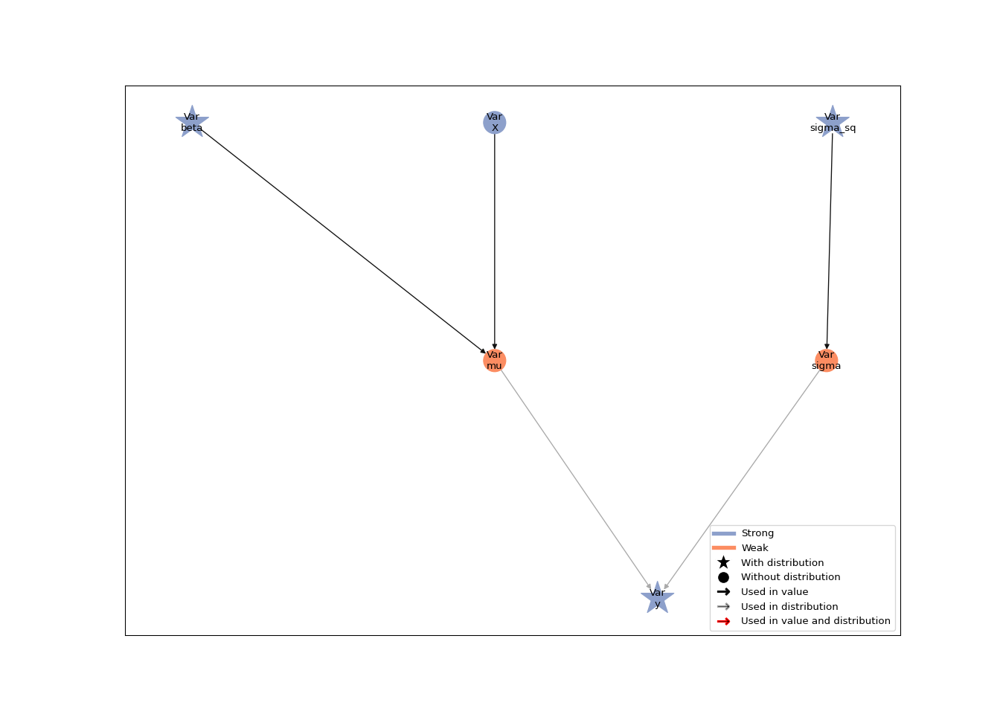
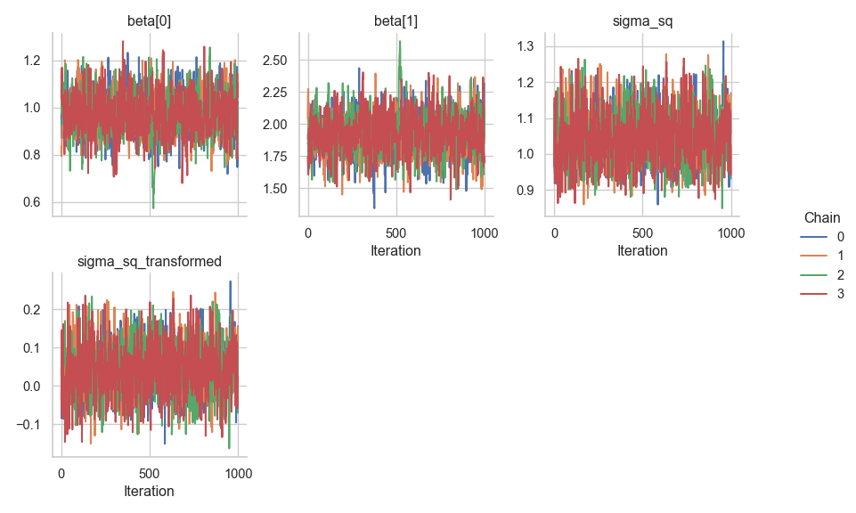
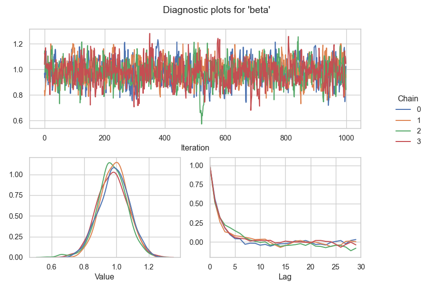

# Linear Regression

In this tutorial, we build a linear regression model with Liesel and
estimate it with Goose. Our goal is to illustrate the most fundamtenal
features of the software in a straightforward context.

# Imports

Before we can generate the data and build the model, we need to load
Liesel and a number of other packages. We usually import the model
building library `liesel.model` as `lsl`, and the MCMC library
`liesel.goose` as `gs`.

``` python
# | label: imports
import jax
import jax.numpy as jnp
import numpy as np

# We use distributions and bijectors from tensorflow probability
import tensorflow_probability.substrates.jax.distributions as tfd
import tensorflow_probability.substrates.jax.bijectors as tfb

import liesel.goose as gs
import liesel.model as lsl

import matplotlib.pyplot as plt
```

### Generating the data

Now we can simulate 500 observations from the linear regression model
$y_i \sim \mathcal{N}(\beta_0 + \beta_1 x_i, \;\sigma^2)$ with the true
parameters $\boldsymbol{\beta} = (\beta_0, \beta_1)' = (1, 2)'$ and
$\sigma = 1$. The relationship between the response $y_i$ and the
covariate $x_i$ is visualized in the following scatterplot.

``` python
# | label: generate-data

rng = np.random.default_rng(42)

# sample size and true parameters
n = 500
true_beta = np.array([1.0, 2.0])
true_sigma = 1.0

# data-generating process
x0 = rng.uniform(size=n)
X_mat = np.column_stack([np.ones(n), x0])
eps = rng.normal(scale=true_sigma, size=n)
y_vec = X_mat @ true_beta + eps

# plot the simulated data
plt.scatter(x0, y_vec)
plt.title("Simulated data from the linear regression model")
plt.xlabel("Covariate x")
plt.ylabel("Response y")
plt.show()
```


### Building the Model

As the most basic building blocks of a model, Liesel provides the
{class}`.Var` class for instantiating variables and the {class}`.Dist`
class for wrapping probability distributions. The {class}`.Var` class
comes with four constructors, namely {meth}`.Var.new_param` for
parameters, {meth}`.Var.new_obs` for observed data,
{meth}`.Var.new_calc` for variables that are deterministic functions of
other variables in the model, and {meth}`.Var.new_value` for fixed
values. See also [Model Building (liesel.model)](model_overview).

#### The regression coefficients

Let’s assume the weakly informative prior
$\beta_0, \beta_1 \sim \mathcal{N}(0, 100^2)$ for the regression
coefficients. To define this in Liesel, we will be using the
{class}`.Dist` class. This class wraps distribution classes with the
TensorFlow Probability (TFP) API. Here, we use the TFP distribution
object
[(`tfd.Normal`)](https://www.tensorflow.org/probability/api_docs/python/tfp/distributions/Normal),
and the two hyperparameters representing the parameters of the
distribution. TFP uses the names `loc` for the mean and `scale` for the
standard deviation, so we have to use the same names here. This is a
general feature of {class}`.Dist`, you should always use the parameter
names from TFP to refer to the parameters of your distribution.

``` python
beta_prior = lsl.Dist(tfd.Normal, loc=0.0, scale=100.0)
```

Now we can create our regression coefficient with the
{meth}`.Var.new_param` constructor:

``` python
# | label: beta-parameter
beta = lsl.Var.new_param(
    value=jnp.array([0.0, 0.0]), distribution=beta_prior, name="beta"
)
```

#### The standard deviation

We define the standard deviation using the weakly informative prior
$\sigma^2 \sim \text{InverseGamma}(a, b)$ with $a = b = 0.01$.

``` python
# | label: standard-deviation-node
sigma_sq_prior = lsl.Dist(tfd.InverseGamma, concentration=0.01, scale=0.01)
sigma_sq = lsl.Var.new_param(value=1.0, distribution=sigma_sq_prior, name="sigma_sq")
```

Since we need to work not only with the variance, but with the scale, we
initialize the scale using {meth}`.Var.new_calc`, to compute the square
root.

``` python
sigma = lsl.Var.new_calc(jnp.sqrt, sigma_sq, name="sigma")
```

The variable constructor {meth}`.Var.new_calc` always takes a function
as its first argument, and the nodes to be used as function inputs as
the following arguments.

#### Design matrix, fitted values, and response

To compute the matrix-vector product $\mathbf{X}\boldsymbol{\beta}$, we
use another variable instantiated via {meth}`.Var.new_calc`. We can view
our model as $y_i \sim \mathcal{N}(\mu_i, \;\sigma^2)$ with
$\mu_i = \beta_0 + \beta_1 x_i$, so we use the name `mu` for this
product.

``` python
X = lsl.Var.new_obs(X_mat, name="X")
mu = lsl.Var.new_calc(jnp.dot, X, beta, name="mu")
```

At last we can define our response, using our observed response values.
And since we assumed the model
$y_i \sim \mathcal{N}(\beta_0 + \beta_1 x_i, \;\sigma^2)$, we also need
to specify the response’s distribution. We use our `sigma` and `mu` to
specify this distribution:

``` python
y_dist = lsl.Dist(tfd.Normal, loc=mu, scale=sigma)
y = lsl.Var.new_obs(y_vec, distribution=y_dist, name="y")
```

#### Bringing the model together

Now, we can set up the {class}`.Model`. Here, we will only add the
response.

``` python
model = lsl.Model([y])
```

The {func}`.plot_vars()` function visualizes the model. More on that in
the [Model building with Liesel
tutorial](01-alt-model.md#model-building-with-liesel) If the layout of
the graph looks messy for you, please make sure you have the
`pygraphviz` package installed.

``` python
lsl.plot_vars(model)
```



## MCMC inference with Goose

This section illustrates the basics of Liesel’s MCMC framework Goose. To
use Goose, the user needs to select one or more sampling algorithms,
called (transition) kernels, for the model parameters. Goose comes with
a number of standard kernels such as Hamiltonian Monte Carlo
({class}`~.goose.HMCKernel`) or the No U-Turn Sampler
({class}`~.goose.NUTSKernel`). Multiple kernels can be combined in one
sampling scheme and assigned to different parameters, and the user can
implement their own problem-specific kernels, as long as they are
compatible with the {class}`.Kernel` protocol. In any case, the user is
responsible for constructing a mathematically valid algorithm. Refer to
[MCMC Sampling (liesel.goose)](goose_overview) for an overview of
important Goose functionality.

We start with a very simple sampling scheme, keeping $\sigma^2$ fixed at
the true value and using a NUTS sampler for $\boldsymbol{\beta}$. The
kernels are added to a {class}`~.goose.Engine`, which coordinates the
sampling, including the kernel tuning during the warmup, and the MCMC
bookkeeping. The engine can be configured step by step with a
{class}`.EngineBuilder`. Starting from a Liesel model, it is
straight-forward to obtain an engine builder using the
{class}`.LieselMCMC` helper. We then need to define the kernels, and the
sampling duration. Finally, we can call the {meth}`.EngineBuilder.build`
method, which returns a fully configured MCMC engine.

``` python
# | label: goose-MCMC-engine-setup
builder = gs.LieselMCMC(model).get_engine_builder(seed=1337, num_chains=4)

builder.add_kernel(gs.NUTSKernel(["beta"]))
builder.set_duration(warmup_duration=1000, posterior_duration=1000)

engine = builder.build()
```

Now we can run the MCMC algorithm for the specified duration by calling
the {meth}`~.goose.Engine.sample_all_epochs` method. In a first step,
the model and the sampling algorithm are compiled, so don’t worry if you
don’t see an output right away. The subsequent samples will be generated
much faster.

``` python
engine.sample_all_epochs()
```


      0%|                                                  | 0/3 [00:00<?, ?chunk/s]
     33%|##############                            | 1/3 [00:01<00:02,  1.34s/chunk]
    100%|##########################################| 3/3 [00:01<00:00,  2.23chunk/s]

      0%|                                                  | 0/1 [00:00<?, ?chunk/s]
    100%|########################################| 1/1 [00:00<00:00, 2874.78chunk/s]

      0%|                                                  | 0/2 [00:00<?, ?chunk/s]
    100%|########################################| 2/2 [00:00<00:00, 3943.87chunk/s]

      0%|                                                  | 0/4 [00:00<?, ?chunk/s]
    100%|########################################| 4/4 [00:00<00:00, 4464.40chunk/s]

      0%|                                                  | 0/8 [00:00<?, ?chunk/s]
    100%|########################################| 8/8 [00:00<00:00, 1411.63chunk/s]

      0%|                                                 | 0/20 [00:00<?, ?chunk/s]
    100%|#######################################| 20/20 [00:00<00:00, 386.29chunk/s]

      0%|                                                  | 0/2 [00:00<?, ?chunk/s]
    100%|########################################| 2/2 [00:00<00:00, 3839.18chunk/s]

      0%|                                                 | 0/40 [00:00<?, ?chunk/s]
     80%|###############################2       | 32/40 [00:00<00:00, 311.47chunk/s]
    100%|#######################################| 40/40 [00:00<00:00, 293.99chunk/s]

Finally, we can extract the results and print a summary table.

``` python
results = engine.get_results()
summary = gs.Summary(results)
summary
```

<p>
<strong>Parameter summary:</strong>
</p>
<table border="0" class="dataframe">
<thead>
<tr style="text-align: right;">
<th>
</th>
<th>
</th>
<th>
kernel
</th>
<th>
mean
</th>
<th>
sd
</th>
<th>
q_0.05
</th>
<th>
q_0.5
</th>
<th>
q_0.95
</th>
<th>
sample_size
</th>
<th>
ess_bulk
</th>
<th>
ess_tail
</th>
<th>
rhat
</th>
</tr>
<tr>
<th>
parameter
</th>
<th>
index
</th>
<th>
</th>
<th>
</th>
<th>
</th>
<th>
</th>
<th>
</th>
<th>
</th>
<th>
</th>
<th>
</th>
<th>
</th>
<th>
</th>
</tr>
</thead>
<tbody>
<tr>
<th rowspan="2" valign="top">
beta
</th>
<th>
(0,)
</th>
<td>
kernel_00
</td>
<td>
0.981
</td>
<td>
0.087
</td>
<td>
0.842
</td>
<td>
0.980
</td>
<td>
1.127
</td>
<td>
4000
</td>
<td>
887.081
</td>
<td>
1154.253
</td>
<td>
1.003
</td>
</tr>
<tr>
<th>
(1,)
</th>
<td>
kernel_00
</td>
<td>
1.914
</td>
<td>
0.152
</td>
<td>
1.658
</td>
<td>
1.915
</td>
<td>
2.163
</td>
<td>
4000
</td>
<td>
883.961
</td>
<td>
1324.823
</td>
<td>
1.001
</td>
</tr>
</tbody>
</table>
<p>
<strong>Error summary:</strong>
</p>
<table border="0" class="dataframe">
<thead>
<tr style="text-align: right;">
<th>
</th>
<th>
</th>
<th>
</th>
<th>
</th>
<th>
count
</th>
<th>
relative
</th>
</tr>
<tr>
<th>
kernel
</th>
<th>
error_code
</th>
<th>
error_msg
</th>
<th>
phase
</th>
<th>
</th>
<th>
</th>
</tr>
</thead>
<tbody>
<tr>
<th rowspan="2" valign="top">
kernel_00
</th>
<th rowspan="2" valign="top">
1
</th>
<th rowspan="2" valign="top">
divergent transition
</th>
<th>
warmup
</th>
<td>
52
</td>
<td>
0.013
</td>
</tr>
<tr>
<th>
posterior
</th>
<td>
0
</td>
<td>
0.000
</td>
</tr>
</tbody>
</table>

If we need more samples, we can append another epoch to the engine and
sample it by calling either the {meth}`~.goose.Engine.sample_next_epoch`
or the {meth}`~.goose.Engine.sample_all_epochs` method. The epochs are
described by {class}`.EpochConfig` objects.

``` python
engine.append_epoch(
    gs.EpochConfig(gs.EpochType.POSTERIOR, duration=1000, thinning=1, optional=None)
)
engine.sample_next_epoch()
```


      0%|                                                 | 0/40 [00:00<?, ?chunk/s]
     82%|################################1      | 33/40 [00:00<00:00, 322.15chunk/s]
    100%|#######################################| 40/40 [00:00<00:00, 307.99chunk/s]

No compilation is required at this point, so this is pretty fast.

### Sampling Sigma

So far, we have not sampled our variance parameter `sigma_sq`; we simply
fixed it to the true value of one. Now we also want to use a NUTS
sampler for `sigma_sq`. Since the variance is restrictive to the
positive domain and NUTS works best for parameters on the whole real
line, we now log-transform `sigma_sq` using the {meth}`.Var.transform()`
method. This method takes a tensorflow bijector instance
([(`tfb.bijectors`)](https://www.tensorflow.org/probability/api_docs/python/tfp/substrates/jax/bijectors/Bijector))
and automatically conducts an appropriate transformation of the
transformed parameter’s distribution according to the change of
variables theorem. Tensorflow bijectors are always named after the
*forward* transformation, so we need to use the `tfb.Exp()` bijector.
More on that in the [Parameter transformations
tutorial](01a-transform.md#parameter-transformation) and
{meth}`.Var.transform()`.

``` python
nodes_, vars_ = model.pop_nodes_and_vars() #this allows us to manipulate the model
log_sigma = sigma_sq.transform(tfb.Exp())
model2 = lsl.Model([y]) #create new model
```

Because we don’t just want samples of our transformed paramter, we also
tell the engine builder to save samples of `sigma_sq`.

``` python
# | label: engine-setup-with-transformed-parameter
builder = gs.LieselMCMC(model2).get_engine_builder(seed=1338, num_chains=4)

builder.add_kernel(gs.NUTSKernel(["beta"]))
builder.add_kernel(gs.NUTSKernel(["sigma_sq_transformed"]))

builder.set_duration(warmup_duration=1000, posterior_duration=1000)
builder.positions_included = ["sigma_sq"]

engine = builder.build()
engine.sample_all_epochs()
```


      0%|                                                  | 0/3 [00:00<?, ?chunk/s]
     33%|##############                            | 1/3 [00:02<00:04,  2.17s/chunk]
    100%|##########################################| 3/3 [00:02<00:00,  1.38chunk/s]

      0%|                                                  | 0/1 [00:00<?, ?chunk/s]
    100%|########################################| 1/1 [00:00<00:00, 2725.34chunk/s]

      0%|                                                  | 0/2 [00:00<?, ?chunk/s]
    100%|########################################| 2/2 [00:00<00:00, 3257.71chunk/s]

      0%|                                                  | 0/4 [00:00<?, ?chunk/s]
    100%|########################################| 4/4 [00:00<00:00, 3603.35chunk/s]

      0%|                                                  | 0/8 [00:00<?, ?chunk/s]
    100%|########################################| 8/8 [00:00<00:00, 1081.77chunk/s]

      0%|                                                 | 0/20 [00:00<?, ?chunk/s]
    100%|#######################################| 20/20 [00:00<00:00, 295.51chunk/s]

      0%|                                                  | 0/2 [00:00<?, ?chunk/s]
    100%|########################################| 2/2 [00:00<00:00, 3501.09chunk/s]

      0%|                                                 | 0/40 [00:00<?, ?chunk/s]
     68%|##########################3            | 27/40 [00:00<00:00, 266.31chunk/s]
    100%|#######################################| 40/40 [00:00<00:00, 242.75chunk/s]

Note that it would also be possible to sample both paramters using the
same {class}`~.goose.NUTSKernel` Kernel. Goose provides a couple of
convenient numerical and graphical summary tools. The
{class}`~.goose~.goose.Summary` class computes several summary
statistics that can be either accessed programmatically or displayed as
a summary table.

``` python
results = engine.get_results()
summary = gs.Summary(results)
summary
```

<div class="cell-output-display">

<p>
<strong>Parameter summary:</strong>
</p>
<table border="0" class="dataframe">
<thead>
<tr style="text-align: right;">
<th>
</th>
<th>
</th>
<th>
kernel
</th>
<th>
mean
</th>
<th>
sd
</th>
<th>
q_0.05
</th>
<th>
q_0.5
</th>
<th>
q_0.95
</th>
<th>
sample_size
</th>
<th>
ess_bulk
</th>
<th>
ess_tail
</th>
<th>
rhat
</th>
</tr>
<tr>
<th>
parameter
</th>
<th>
index
</th>
<th>
</th>
<th>
</th>
<th>
</th>
<th>
</th>
<th>
</th>
<th>
</th>
<th>
</th>
<th>
</th>
<th>
</th>
<th>
</th>
</tr>
</thead>
<tbody>
<tr>
<th rowspan="2" valign="top">
beta
</th>
<th>
(0,)
</th>
<td>
kernel_00
</td>
<td>
0.981
</td>
<td>
0.090
</td>
<td>
0.835
</td>
<td>
0.982
</td>
<td>
1.130
</td>
<td>
4000
</td>
<td>
1086.422
</td>
<td>
1151.939
</td>
<td>
1.002
</td>
</tr>
<tr>
<th>
(1,)
</th>
<td>
kernel_00
</td>
<td>
1.915
</td>
<td>
0.158
</td>
<td>
1.664
</td>
<td>
1.913
</td>
<td>
2.171
</td>
<td>
4000
</td>
<td>
1111.205
</td>
<td>
1255.130
</td>
<td>
1.004
</td>
</tr>
<tr>
<th>
sigma_sq
</th>
<th>
()
</th>
<td>
\-
</td>
<td>
1.046
</td>
<td>
0.067
</td>
<td>
0.942
</td>
<td>
1.043
</td>
<td>
1.163
</td>
<td>
4000
</td>
<td>
1513.939
</td>
<td>
1898.469
</td>
<td>
1.002
</td>
</tr>
<tr>
<th>
sigma_sq_transformed
</th>
<th>
()
</th>
<td>
kernel_01
</td>
<td>
0.043
</td>
<td>
0.064
</td>
<td>
-0.060
</td>
<td>
0.042
</td>
<td>
0.151
</td>
<td>
4000
</td>
<td>
1513.940
</td>
<td>
1898.469
</td>
<td>
1.002
</td>
</tr>
</tbody>
</table>
<p>
<strong>Error summary:</strong>
</p>
<table border="0" class="dataframe">
<thead>
<tr style="text-align: right;">
<th>
</th>
<th>
</th>
<th>
</th>
<th>
</th>
<th>
count
</th>
<th>
relative
</th>
</tr>
<tr>
<th>
kernel
</th>
<th>
error_code
</th>
<th>
error_msg
</th>
<th>
phase
</th>
<th>
</th>
<th>
</th>
</tr>
</thead>
<tbody>
<tr>
<th rowspan="2" valign="top">
kernel_00
</th>
<th rowspan="2" valign="top">
1
</th>
<th rowspan="2" valign="top">
divergent transition
</th>
<th>
warmup
</th>
<td>
49
</td>
<td>
0.012
</td>
</tr>
<tr>
<th>
posterior
</th>
<td>
0
</td>
<td>
0.000
</td>
</tr>
<tr>
<th rowspan="2" valign="top">
kernel_01
</th>
<th rowspan="2" valign="top">
1
</th>
<th rowspan="2" valign="top">
divergent transition
</th>
<th>
warmup
</th>
<td>
48
</td>
<td>
0.012
</td>
</tr>
<tr>
<th>
posterior
</th>
<td>
0
</td>
<td>
0.000
</td>
</tr>
</tbody>
</table>

</div>

We can plot the trace plots of the chains with
{func}`~.goose.plot_trace()`.

``` python
g = gs.plot_trace(results)
```



We could also take a look at a kernel density estimator with
{func}`~.goose.plot_density()` and the estimated autocorrelation with
{func}`~.goose.plot_cor()`. Alternatively, we can output all three
diagnostic plots together with {func}`~.goose.plot_param()`. The
following plot shows the parameter $\beta_0$.

``` python
gs.plot_param(results, param="beta", param_index=0)
```



Here, we end this first tutorial. We have learned how to build a linear
regression model and seen how we can use Kernels for drawing MCMC
samples - that is quite a bit for the start. Now, have fun modelling
with Liesel!
