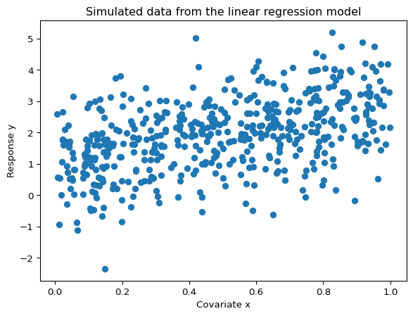
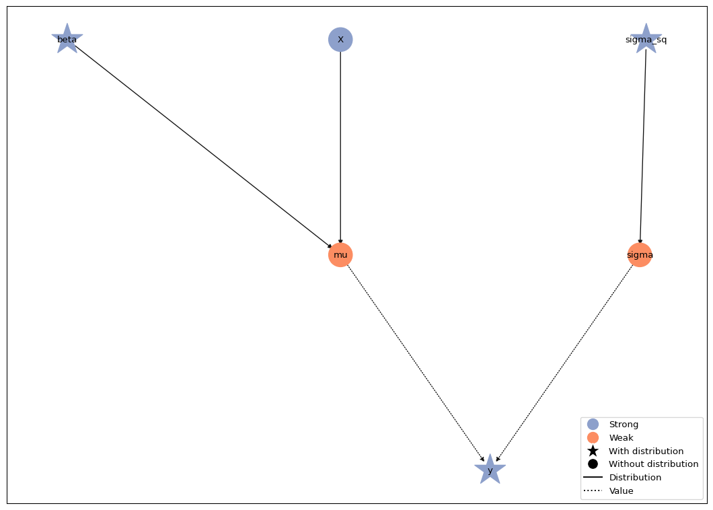

# Linear Regression

In this tutorial, we build a linear regression model with Liesel and
estimate it with Goose. Our goal is to illustrate the most fundamental
features of the software in a straight-forward context.

## Imports

Before we can generate the data and build the model, we need to load
Liesel and a number of other packages. We usually import the model
building library `liesel.model` as `lsl`, and the MCMC library
`liesel.goose` as `gs`.

``` python
import jax
import jax.numpy as jnp
import numpy as np

# We use distributions and bijectors from tensorflow probability
import tensorflow_probability.substrates.jax.distributions as tfd
import tensorflow_probability.substrates.jax.bijectors as tfb

import liesel.goose as gs
import liesel.model as lsl

import matplotlib.pyplot as plt
```

## Generating the data

Now we can simulate 500 observations from the linear regression model
$y_i \sim \mathcal{N}(\beta_0 + \beta_1 x_i, \;\sigma^2)$ with the true
parameters $\boldsymbol{\beta} = (\beta_0, \beta_1)' = (1, 2)'$ and
$\sigma = 1$. The relationship between the response $y_i$ and the
covariate $x_i$ is visualized in the following scatterplot.

``` python
rng = np.random.default_rng(42)

# sample size and true parameters
n = 500
true_beta = np.array([1.0, 2.0])
true_sigma = 1.0

# data-generating process
x0 = rng.uniform(size=n)
X_mat = np.column_stack([np.ones(n), x0])
eps = rng.normal(scale=true_sigma, size=n)
y_vec = X_mat @ true_beta + eps

# plot the simulated data
plt.scatter(x0, y_vec)
plt.title("Simulated data from the linear regression model")
plt.xlabel("Covariate x")
plt.ylabel("Response y")
plt.show()
```



## Building the Model

As the most basic building blocks of a model, Liesel provides the
{class}`.Var` class for instantiating variables and the {class}`.Dist`
class for wrapping probability distributions. The {class}`.Var` class
comes with four constructors, namely {meth}`.Var.new_param` for
parameters, {meth}`.Var.new_obs` for observed data,
{meth}`.Var.new_calc` for variables that are deterministic functions of
other variables in the model, and {meth}`.Var.new_value` for fixed
values.

### The regression coefficients

Let’s assume the weakly informative prior
$\beta_0, \beta_1 \sim \mathcal{N}(0, 100^2)$ for the regression
coefficients. To define this in Liesel, we will be using the
{class}`.Dist` class. This class wraps distribution classes with the
TensorFlow Probability (TFP) API. Here, we use the TFP distribution
object
[(`tfd.Normal`)](https://www.tensorflow.org/probability/api_docs/python/tfp/distributions/Normal),
and the two hyperparameters representing the parameters of the
distribution. TFP uses the names `loc` for the mean and `scale` for the
standard deviation, so we have to use the same names here. This is a
general feature of {class}`.Dist`, you should always use the parameter
names from TFP to refer to the parameters of your distribution.

``` python
beta_prior = lsl.Dist(tfd.Normal, loc=0.0, scale=100.0)
```

Now we can create our regression coefficient with the
{meth}`.Var.new_param` constructor. We also attach an
{class}`~.goose.MCMCSpec` to `beta`, which tells Goose to sample this
parameter with a NUTS kernel later on:

``` python
beta = lsl.Var.new_param(
    value=jnp.array([0.0, 0.0]),
    dist=beta_prior,
    name="beta",
    inference=gs.MCMCSpec(gs.NUTSKernel),
)
```

### The variance and standard deviation

We define the variance using the weakly informative prior
$\sigma^2 \sim \text{InverseGamma}(a, b)$ with $a = b = 0.01$. In this
introductory model, we do not attach an MCMC kernel to `sigma_sq`, so it
remains fixed at its initial value during sampling.

``` python
sigma_sq_prior = lsl.Dist(tfd.InverseGamma, concentration=0.01, scale=0.01)
sigma_sq = lsl.Var.new_param(value=1.0, dist=sigma_sq_prior, name="sigma_sq")
```

Since we need to work not only with the variance, but with the scale, we
initialize the scale using {meth}`.Var.new_calc`, to compute the square
root.

``` python
sigma = lsl.Var.new_calc(jnp.sqrt, sigma_sq, name="sigma")
```

### Design matrix, fitted values, and response

To compute the matrix-vector product $\mathbf{X}\boldsymbol{\beta}$, we
use another variable instantiated via {meth}`.Var.new_calc`. We can view
our model as $y_i \sim \mathcal{N}(\mu_i, \;\sigma^2)$ with
$\mu_i = \beta_0 + \beta_1 x_i$, so we use the name `mu` for this
product.

``` python
X = lsl.Var.new_obs(X_mat, name="X")
mu = lsl.Var.new_calc(jnp.dot, X, beta, name="mu")
```

At last we can define our response, using our observed response values.
And since we assumed the model
$y_i \sim \mathcal{N}(\beta_0 + \beta_1 x_i, \;\sigma^2)$, we also need
to specify the response’s distribution. We use our `sigma` and `mu` to
specify this distribution:

``` python
y_dist = lsl.Dist(tfd.Normal, loc=mu, scale=sigma)
y = lsl.Var.new_obs(y_vec, dist=y_dist, name="y")
```

### Bringing the model together

Now, we can set up the {class}`.Model`. Here, we will only add the
response.

``` python
model = lsl.Model(y)
```

The {meth}`.Model.plot()` method visualizes the model. If the layout of
the graph looks messy for you, please make sure you have the
`pygraphviz` package installed.

``` python
model.plot()
```



## MCMC inference with Goose

This section illustrates the basics of Liesel’s MCMC framework Goose. To
use Goose, the user needs to select one or more sampling algorithms,
called (transition) kernels, for the model parameters. Goose comes with
a number of standard kernels such as Hamiltonian Monte Carlo
({class}`~.goose.HMCKernel`) or the No U-Turn Sampler
({class}`~.goose.NUTSKernel`). Multiple kernels can be combined in one
sampling scheme and assigned to different parameters, and the user can
implement their own problem-specific kernels, as long as they are
compatible with the {class}`.Kernel` protocol. In any case, the user is
responsible for constructing a mathematically valid algorithm.

We start with a very simple sampling scheme, keeping $\sigma^2$ fixed at
its initial value and using a NUTS sampler for $\boldsymbol{\beta}$.
More on sampling $\sigma^2$ can be found in the [Parameter
transformations tutorial](01c-transform.md) and the [Gibbs sampling
tutorial](01d-gibbs-sampling.md). The NUTS kernel for `beta` was
specified above through the variable’s `inference` attribute. The
{class}`.LieselMCMC` helper reads these inference specifications from
the model and can run the sampler directly with
{meth}`~.goose.LieselMCMC.run_for_epochs`. Here we request 1000
adaptation iterations and 1000 posterior draws per chain.

``` python
results = gs.LieselMCMC(model).run_for_epochs(
    seed=1337, num_chains=4, adaptation=1000, posterior=1000
)
```

    liesel.goose.mcmc_spec - WARNING - No inference specification defined for Var(name="sigma_sq"). If you do not add a kernel for this parameter manually to an EngineBuilder, it will not be sampled.
    liesel.goose.builder - WARNING - No jitter functions provided for position keys 'beta'. The initial values for these keys won't be jittered
    liesel.goose.engine - INFO - Initializing kernels...
    liesel.goose.engine - INFO - Done
    liesel.goose.engine - INFO - Starting epoch: FAST_ADAPTATION, 100 transitions, 25 jitted together
      0%|                                                  | 0/4 [00:00<?, ?chunk/s] 25%|██████████▌                               | 1/4 [00:01<00:03,  1.27s/chunk]100%|██████████████████████████████████████████| 4/4 [00:01<00:00,  3.15chunk/s]
    liesel.goose.engine - WARNING - Errors per chain for kernel_00: 2, 2, 5, 4 / 100 transitions
    liesel.goose.engine - INFO - Finished epoch
    liesel.goose.engine - INFO - Starting epoch: SLOW_ADAPTATION, 25 transitions, 25 jitted together
      0%|                                                  | 0/1 [00:00<?, ?chunk/s]100%|████████████████████████████████████████| 1/1 [00:00<00:00, 1300.16chunk/s]
    liesel.goose.engine - WARNING - Errors per chain for kernel_00: 3, 1, 2, 2 / 25 transitions
    liesel.goose.engine - INFO - Finished epoch
    liesel.goose.engine - INFO - Starting epoch: SLOW_ADAPTATION, 50 transitions, 25 jitted together
      0%|                                                  | 0/2 [00:00<?, ?chunk/s]100%|████████████████████████████████████████| 2/2 [00:00<00:00, 1932.41chunk/s]
    liesel.goose.engine - WARNING - Errors per chain for kernel_00: 1, 1, 1, 2 / 50 transitions
    liesel.goose.engine - INFO - Finished epoch
    liesel.goose.engine - INFO - Starting epoch: SLOW_ADAPTATION, 100 transitions, 25 jitted together
      0%|                                                  | 0/4 [00:00<?, ?chunk/s]100%|████████████████████████████████████████| 4/4 [00:00<00:00, 2713.44chunk/s]
    liesel.goose.engine - WARNING - Errors per chain for kernel_00: 2, 1, 1, 3 / 100 transitions
    liesel.goose.engine - INFO - Finished epoch
    liesel.goose.engine - INFO - Starting epoch: SLOW_ADAPTATION, 525 transitions, 25 jitted together
      0%|                                                 | 0/21 [00:00<?, ?chunk/s]100%|███████████████████████████████████████| 21/21 [00:00<00:00, 455.04chunk/s]
    liesel.goose.engine - WARNING - Errors per chain for kernel_00: 4, 2, 1, 3 / 525 transitions
    liesel.goose.engine - INFO - Finished epoch
    liesel.goose.engine - INFO - Starting epoch: FAST_ADAPTATION, 200 transitions, 25 jitted together
      0%|                                                  | 0/8 [00:00<?, ?chunk/s]100%|████████████████████████████████████████| 8/8 [00:00<00:00, 1650.49chunk/s]
    liesel.goose.engine - WARNING - Errors per chain for kernel_00: 3, 3, 4, 3 / 200 transitions
    liesel.goose.engine - INFO - Finished epoch
    liesel.goose.engine - INFO - Finished warmup
    liesel.goose.engine - INFO - Starting epoch: POSTERIOR, 1000 transitions, 25 jitted together
      0%|                                                 | 0/40 [00:00<?, ?chunk/s]100%|███████████████████████████████████████| 40/40 [00:00<00:00, 440.10chunk/s]
    liesel.goose.engine - INFO - Finished epoch

The call to {meth}`~.goose.LieselMCMC.run_for_epochs` builds the engine,
compiles the model and sampling algorithm, runs all epochs, and returns
the sampling results. Finally, we print a summary table.

``` python
summary = gs.Summary(results)
summary
```

<p>
<strong>Parameter summary:</strong>
</p>
<table border="0" class="dataframe">
<thead>
<tr style="text-align: right;">
<th>
</th>
<th>
</th>
<th>
kernel
</th>
<th>
mean
</th>
<th>
sd
</th>
<th>
q_0.05
</th>
<th>
q_0.5
</th>
<th>
q_0.95
</th>
<th>
sample_size
</th>
<th>
ess_bulk
</th>
<th>
ess_tail
</th>
<th>
rhat
</th>
</tr>
<tr>
<th>
parameter
</th>
<th>
index
</th>
<th>
</th>
<th>
</th>
<th>
</th>
<th>
</th>
<th>
</th>
<th>
</th>
<th>
</th>
<th>
</th>
<th>
</th>
<th>
</th>
</tr>
</thead>
<tbody>
<tr>
<th rowspan="2" valign="top">
beta
</th>
<th>
(0,)
</th>
<td>
kernel_00
</td>
<td>
0.984
</td>
<td>
0.088
</td>
<td>
0.838
</td>
<td>
0.985
</td>
<td>
1.126
</td>
<td>
4000
</td>
<td>
1151.201
</td>
<td>
1385.802
</td>
<td>
1.002
</td>
</tr>
<tr>
<th>
(1,)
</th>
<td>
kernel_00
</td>
<td>
1.906
</td>
<td>
0.154
</td>
<td>
1.648
</td>
<td>
1.907
</td>
<td>
2.156
</td>
<td>
4000
</td>
<td>
1199.216
</td>
<td>
1432.785
</td>
<td>
1.003
</td>
</tr>
</tbody>
</table>
<p>
<strong>Acceptance probabilities:</strong>
</p>
<table border="0" class="dataframe">
<thead>
<tr style="text-align: right;">
<th>
</th>
<th>
</th>
<th>
</th>
<th>
acceptance_probability
</th>
<th>
position_moved
</th>
</tr>
<tr>
<th>
kernel
</th>
<th>
positions
</th>
<th>
phase
</th>
<th>
</th>
<th>
</th>
</tr>
</thead>
<tbody>
<tr>
<th rowspan="2" valign="top">
kernel_00
</th>
<th rowspan="2" valign="top">
beta
</th>
<th>
posterior
</th>
<td>
0.877
</td>
<td>
NaN
</td>
</tr>
<tr>
<th>
warmup
</th>
<td>
0.791
</td>
<td>
NaN
</td>
</tr>
</tbody>
</table>
<p>
<strong>Error summary:</strong>
</p>
<table border="0" class="dataframe">
<thead>
<tr style="text-align: right;">
<th>
</th>
<th>
</th>
<th>
</th>
<th>
</th>
<th>
</th>
<th>
count
</th>
<th>
sample_size
</th>
<th>
sample_size_total
</th>
<th>
relative
</th>
</tr>
<tr>
<th>
kernel
</th>
<th>
positions
</th>
<th>
error_code
</th>
<th>
error_msg
</th>
<th>
phase
</th>
<th>
</th>
<th>
</th>
<th>
</th>
<th>
</th>
</tr>
</thead>
<tbody>
<tr>
<th rowspan="2" valign="top">
kernel_00
</th>
<th rowspan="2" valign="top">
beta
</th>
<th rowspan="2" valign="top">
1
</th>
<th rowspan="2" valign="top">
divergent transition
</th>
<th>
warmup
</th>
<td>
56
</td>
<td>
4000
</td>
<td>
4000
</td>
<td>
0.014
</td>
</tr>
<tr>
<th>
posterior
</th>
<td>
0
</td>
<td>
4000
</td>
<td>
4000
</td>
<td>
0.000
</td>
</tr>
</tbody>
</table>

Here, we end this first tutorial. We have learned how to build a linear
regression model, attach a NUTS kernel through an inference
specification, and draw MCMC samples - that is quite a bit for the
start. Now, have fun modelling with Liesel!
