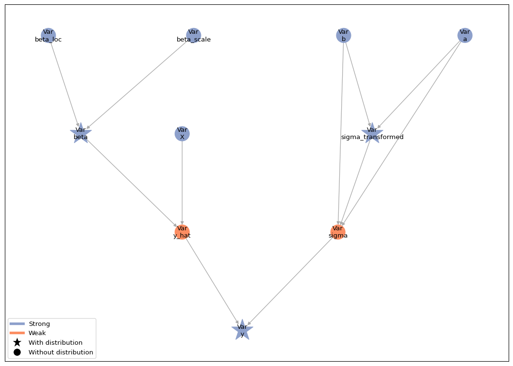
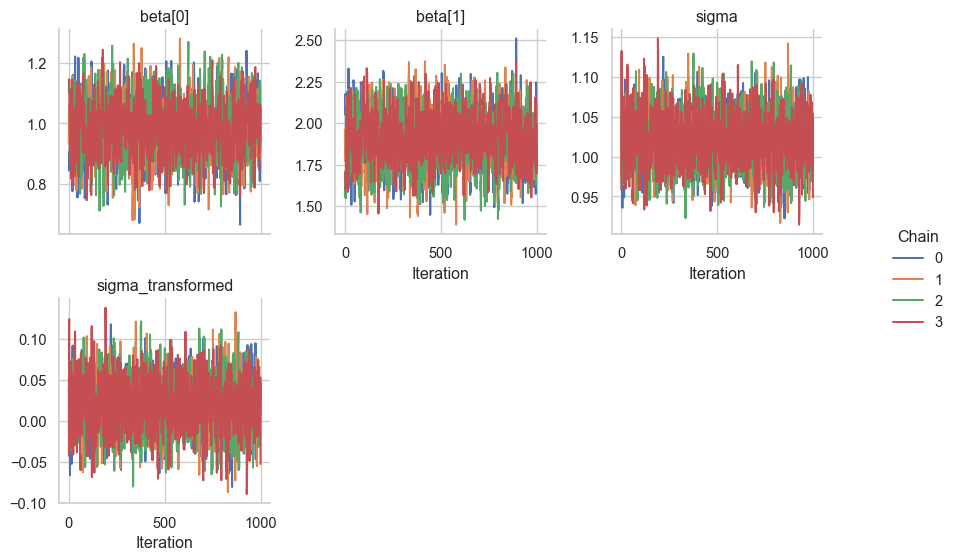
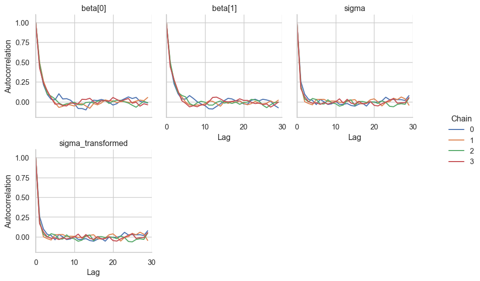

# Parameter transformations

This tutorial builds on the [linear regression
tutorial](01-lin-reg.md#linear-regression). Here, we demonstrate how we
can easily transform a parameter in our model to sample it with NUTS
instead of a Gibbs Kernel.

First, let’s set up our model again. This is the same model as in the
[linear regression tutorial](01-lin-reg.md#linear-regression), so we
will not go into the details here.

``` python
import jax
import jax.numpy as jnp
import liesel.goose as gs
import liesel.model as lsl
import matplotlib.pyplot as plt
import numpy as np

# We use distributions and bijectors from tensorflow probability
import tensorflow_probability.substrates.jax.distributions as tfd
import tensorflow_probability.substrates.jax.bijectors as tfb

rng = np.random.default_rng(42)

# data-generating process
n = 500
true_beta = np.array([1.0, 2.0])
true_sigma = 1.0
x0 = rng.uniform(size=n)
X_mat = np.column_stack([np.ones(n), x0])
eps = rng.normal(scale=true_sigma, size=n)
y_vec = X_mat @ true_beta + eps

# Model
# Part 1: Model for the mean
beta_loc = lsl.Var(0.0, name="beta_loc")
beta_scale = lsl.Var(100.0, name="beta_scale") # scale = sqrt(100^2)
beta_dist = lsl.Dist(tfd.Normal, loc=beta_loc, scale=beta_scale)
beta = lsl.Param(value=np.array([0.0, 0.0]), distribution=beta_dist,name="beta")

X = lsl.Obs(X_mat, name="X")
calc = lsl.Calc(lambda x, beta: jnp.dot(x, beta), x=X, beta=beta)
y_hat = lsl.Var(calc, name="y_hat")

# Part 2: Model for the standard deviation
sigma_a = lsl.Var(0.01, name="a")
sigma_b = lsl.Var(0.01, name="b")
sigma_dist = lsl.Dist(tfd.InverseGamma, concentration=sigma_a, scale=sigma_b)
sigma = lsl.Param(value=10.0, distribution=sigma_dist, name="sigma")

# Observation model
y_dist = lsl.Dist(tfd.Normal, loc=y_hat, scale=sigma)
y = lsl.Var(y_vec, distribution=y_dist, name="y")
```

Now let’s try to sample the full parameter vector
$(\boldsymbol{\beta}', \sigma)'$ with a single NUTS kernel instead of
using a NUTS kernel for $\boldsymbol{\beta}$ and a Gibbs kernel for
$\sigma$. Since the standard deviation is a positive-valued parameter,
we need to log-transform it to sample it with a NUTS kernel. The
{class}`.GraphBuilder` class provides the {meth}`.transform`
method for this purpose.

``` python
gb = lsl.GraphBuilder().add(y)
gb.transform(sigma, tfb.Exp)

model = gb.build_model()
lsl.plot_vars(model)
```



The response distribution still requires the standard deviation on the
original scale. The model graph shows that the back-transformation from
the logarithmic to the original scale is performed by a inserting the
`sigma_transformed` and turning the `sigma` node into a weak node. This
weak node deterministically depends on `sigma_transformed`: its value is
the back-transformed standard deviation.

Now we can set up and run an MCMC algorithm with a NUTS kernel for all
parameters.

``` python
builder = gs.EngineBuilder(seed=1339, num_chains=4)

builder.set_model(lsl.GooseModel(model))
builder.set_initial_values(model.state)

builder.add_kernel(gs.NUTSKernel(["beta", "sigma_transformed"]))

builder.set_duration(warmup_duration=1000, posterior_duration=1000)

# by default, goose only stores the parameters specified in the kernels.
# let's also store the standard deviation on the original scale.
builder.positions_included = ["sigma"]

engine = builder.build()
engine.sample_all_epochs()
```

    liesel.goose.engine - INFO - Starting epoch: FAST_ADAPTATION, 75 transitions, 25 jitted together

    liesel.goose.engine - WARNING - Errors per chain for kernel_00: 2, 2, 2, 4 / 75 transitions

    liesel.goose.engine - INFO - Finished epoch

    liesel.goose.engine - INFO - Starting epoch: SLOW_ADAPTATION, 25 transitions, 25 jitted together

    liesel.goose.engine - WARNING - Errors per chain for kernel_00: 2, 1, 2, 1 / 25 transitions

    liesel.goose.engine - INFO - Finished epoch

    liesel.goose.engine - INFO - Starting epoch: SLOW_ADAPTATION, 50 transitions, 25 jitted together

    liesel.goose.engine - WARNING - Errors per chain for kernel_00: 1, 1, 1, 2 / 50 transitions

    liesel.goose.engine - INFO - Finished epoch

    liesel.goose.engine - INFO - Starting epoch: SLOW_ADAPTATION, 100 transitions, 25 jitted together

    liesel.goose.engine - WARNING - Errors per chain for kernel_00: 2, 3, 2, 1 / 100 transitions

    liesel.goose.engine - INFO - Finished epoch

    liesel.goose.engine - INFO - Starting epoch: SLOW_ADAPTATION, 200 transitions, 25 jitted together

    liesel.goose.engine - WARNING - Errors per chain for kernel_00: 2, 3, 3, 2 / 200 transitions

    liesel.goose.engine - INFO - Finished epoch

    liesel.goose.engine - INFO - Starting epoch: SLOW_ADAPTATION, 500 transitions, 25 jitted together

    liesel.goose.engine - WARNING - Errors per chain for kernel_00: 3, 3, 2, 3 / 500 transitions

    liesel.goose.engine - INFO - Finished epoch

    liesel.goose.engine - INFO - Starting epoch: FAST_ADAPTATION, 50 transitions, 25 jitted together

    liesel.goose.engine - WARNING - Errors per chain for kernel_00: 1, 3, 2, 3 / 50 transitions

    liesel.goose.engine - INFO - Finished epoch

    liesel.goose.engine - INFO - Finished warmup

    liesel.goose.engine - INFO - Starting epoch: POSTERIOR, 1000 transitions, 25 jitted together

    liesel.goose.engine - INFO - Finished epoch

Judging from the trace plots, it seems that all chains have converged.

``` python
results = engine.get_results()
gs.plot_trace(results)
```



    <seaborn.axisgrid.FacetGrid at 0x172073b20>

We can also take a look at the summary table, which includes the
original $\sigma$ and the transformed $\log(\sigma)$.

``` python
gs.Summary.from_result(results)
```

    /var/folders/tn/j33340q16z763d6xp7mlcw4m0000gn/T/ipykernel_39611/2697970077.py:1: DeprecationWarning: Call to deprecated class method from_result. (Functionality moved directly to the __init__.) -- Deprecated since version 0.1.4.
      gs.Summary.from_result(results)

**Parameter summary:**

|                           | kernel    |      mean |        sd |     q_0.05 |     q_0.5 |    q_0.95 | sample_size | ess_bulk | ess_tail |     rhat |
|:--------------------------|:----------|----------:|----------:|-----------:|----------:|----------:|------------:|---------:|---------:|---------:|
| (‘beta’, (0,))            | kernel_00 |  0.985689 | 0.0916551 |    0.83466 |  0.986229 |   1.13938 |        4000 |  1461.79 |  1877.94 |  1.00143 |
| (‘beta’, (1,))            | kernel_00 |   1.90624 |  0.161431 |    1.63923 |   1.90426 |   2.17451 |        4000 |  1410.96 |  1782.14 |  1.00158 |
| (‘sigma’, ())             | \-        |   1.02065 |  0.032938 |   0.967396 |   1.02027 |   1.07567 |        4000 |  2700.11 |  2462.77 | 0.999834 |
| (‘sigma_transformed’, ()) | kernel_00 | 0.0199161 | 0.0322623 | -0.0331476 | 0.0200678 | 0.0729471 |        4000 |  2700.12 |  2462.77 | 0.999834 |

**Error summary:**

|                                                       | count | relative |
|:------------------------------------------------------|------:|---------:|
| (‘kernel_00’, 1, ‘divergent transition’, ‘warmup’)    |    59 |  0.01475 |
| (‘kernel_00’, 1, ‘divergent transition’, ‘posterior’) |     0 |        0 |

The effective sample size is higher for $\sigma$ than for
$\boldsymbol{\beta}$. Finally, let’s check the autocorrelation of the
samples.

``` python
g = gs.plot_cor(results)
```


