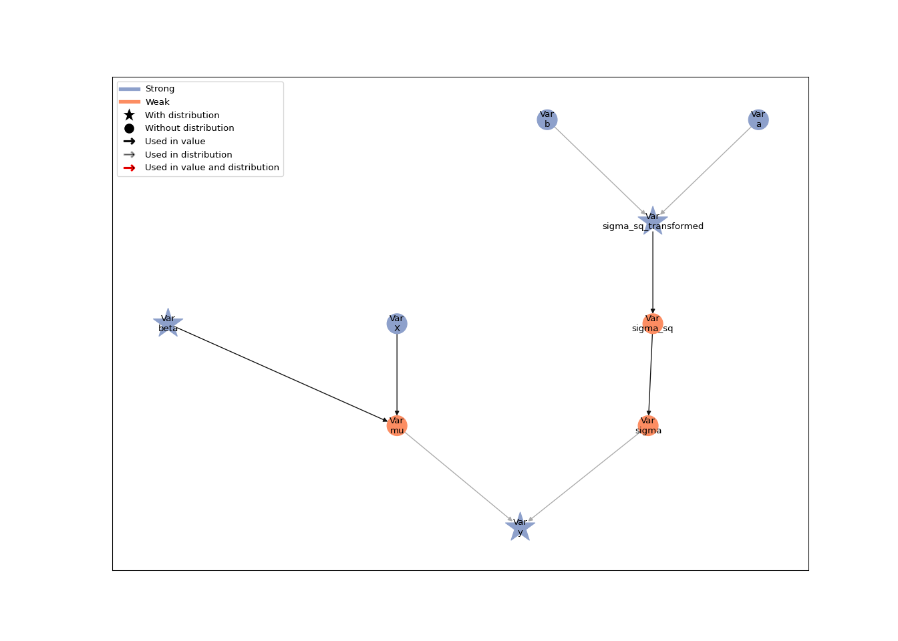
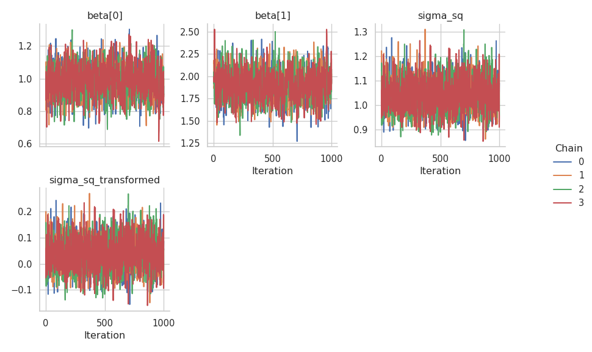
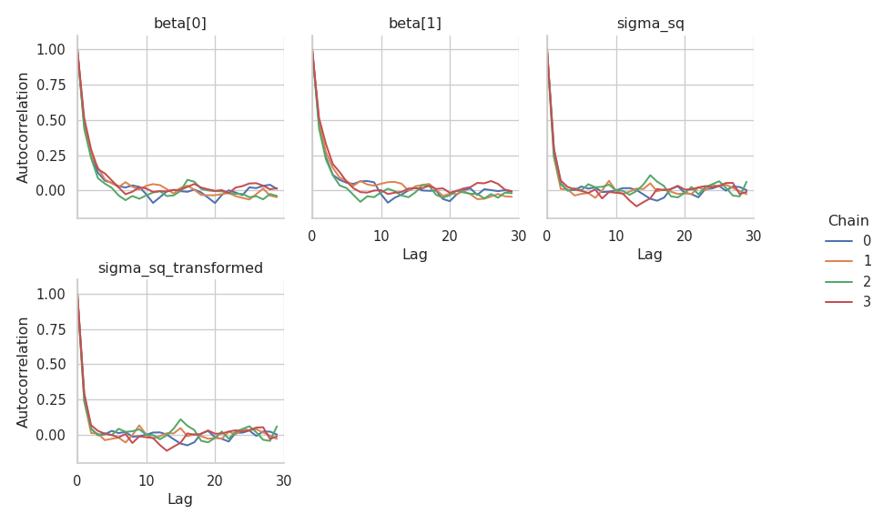

# Parameter transformations

This tutorial builds on the [linear regression
tutorial](01-lin-reg.md#linear-regression). Here, we demonstrate how we
can easily transform a parameter in our model to sample it with NUTS
instead of a Gibbs Kernel.

First, let’s set up our model again. This is the same model as in the
[linear regression tutorial](01-lin-reg.md#linear-regression), so we
will not go into the details here.

``` python
import jax
import jax.numpy as jnp
import numpy as np
import matplotlib.pyplot as plt

# We use distributions and bijectors from tensorflow probability
import tensorflow_probability.substrates.jax.distributions as tfd
import tensorflow_probability.substrates.jax.bijectors as tfb

import liesel.goose as gs
import liesel.model as lsl

rng = np.random.default_rng(42)

# data-generating process
n = 500
true_beta = np.array([1.0, 2.0])
true_sigma = 1.0
x0 = rng.uniform(size=n)
X_mat = np.c_[np.ones(n), x0]
y_vec = X_mat @ true_beta + rng.normal(scale=true_sigma, size=n)

# Model
# Part 1: Model for the mean
beta_prior = lsl.Dist(tfd.Normal, loc=0.0, scale=100.0)
beta = lsl.Var.new_param(value=np.array([0.0, 0.0]), distribution=beta_prior,name="beta")

X = lsl.Var.new_obs(X_mat, name="X")
mu = lsl.Var(lsl.Calc(jnp.dot, X, beta), name="mu")

# Part 2: Model for the standard deviation
a = lsl.Var(0.01, name="a")
b = lsl.Var(0.01, name="b")
sigma_sq_prior = lsl.Dist(tfd.InverseGamma, concentration=a, scale=b)
sigma_sq = lsl.Var.new_param(value=10.0, distribution=sigma_sq_prior, name="sigma_sq")

sigma = lsl.Var(lsl.Calc(jnp.sqrt, sigma_sq), name="sigma")

# Observation model
y_dist = lsl.Dist(tfd.Normal, loc=mu, scale=sigma)
y = lsl.Var(y_vec, distribution=y_dist, name="y")
```

Now let’s try to sample the full parameter vector
$(\boldsymbol{\beta}', \sigma)'$ with a single NUTS kernel instead of
using a NUTS kernel for $\boldsymbol{\beta}$ and a Gibbs kernel for
$\sigma^2$. Since the standard deviation is a positive-valued parameter,
we need to log-transform it to sample it with a NUTS kernel. The
{class}`.Var` class provides the method {meth}`.Var.transform` for this
purpose.

``` python
sigma_sq.transform(tfb.Exp())
```

    Var(name="sigma_sq_transformed")

``` python
gb = lsl.GraphBuilder().add(y)
model = gb.build_model()
lsl.plot_vars(model)
```



The response distribution still requires the standard deviation on the
original scale. The model graph shows that the back-transformation from
the logarithmic to the original scale is performed by a inserting the
`sigma_sq_transformed` node and turning the `sigma_sq` node into a weak
node. This weak node now deterministically depends on
`sigma_sq_transformed`: its value is the back-transformed variance.

Now we can set up and run an MCMC algorithm with a NUTS kernel for all
parameters.

``` python
builder = gs.EngineBuilder(seed=1339, num_chains=4)

builder.set_model(gs.LieselInterface(model))
builder.set_initial_values(model.state)

builder.add_kernel(gs.NUTSKernel(["beta", "sigma_sq_transformed"]))

builder.set_duration(warmup_duration=1000, posterior_duration=1000)

# by default, goose only stores the parameters specified in the kernels.
# let's also store the standard deviation on the original scale.
builder.positions_included = ["sigma_sq"]

engine = builder.build()
engine.sample_all_epochs()
```


      0%|                                                  | 0/3 [00:00<?, ?chunk/s]
     33%|##############                            | 1/3 [00:04<00:08,  4.30s/chunk]
    100%|##########################################| 3/3 [00:04<00:00,  1.43s/chunk]

      0%|                                                  | 0/1 [00:00<?, ?chunk/s]
    100%|########################################| 1/1 [00:00<00:00, 1170.61chunk/s]

      0%|                                                  | 0/2 [00:00<?, ?chunk/s]
    100%|########################################| 2/2 [00:00<00:00, 1558.64chunk/s]

      0%|                                                  | 0/4 [00:00<?, ?chunk/s]
    100%|########################################| 4/4 [00:00<00:00, 1303.08chunk/s]

      0%|                                                  | 0/8 [00:00<?, ?chunk/s]
    100%|#########################################| 8/8 [00:00<00:00, 565.93chunk/s]

      0%|                                                 | 0/20 [00:00<?, ?chunk/s]
    100%|#######################################| 20/20 [00:00<00:00, 194.57chunk/s]
    100%|#######################################| 20/20 [00:00<00:00, 194.21chunk/s]

      0%|                                                  | 0/2 [00:00<?, ?chunk/s]
    100%|########################################| 2/2 [00:00<00:00, 1559.22chunk/s]

      0%|                                                 | 0/40 [00:00<?, ?chunk/s]
     50%|###################5                   | 20/40 [00:00<00:00, 193.76chunk/s]
    100%|#######################################| 40/40 [00:00<00:00, 147.09chunk/s]
    100%|#######################################| 40/40 [00:00<00:00, 152.49chunk/s]

Judging from the trace plots, it seems that all chains have converged.

``` python
results = engine.get_results()
g = gs.plot_trace(results)
```



We can also take a look at the summary table, which includes the
original $\sigma^2$ and the transformed $\log(\sigma^2)$.

``` python
gs.Summary(results)
```

<p>

<strong>Parameter summary:</strong>
</p>

<table border="0" class="dataframe">

<thead>

<tr style="text-align: right;">

<th>

</th>

<th>

</th>

<th>

kernel
</th>

<th>

mean
</th>

<th>

sd
</th>

<th>

q_0.05
</th>

<th>

q_0.5
</th>

<th>

q_0.95
</th>

<th>

sample_size
</th>

<th>

ess_bulk
</th>

<th>

ess_tail
</th>

<th>

rhat
</th>

</tr>

<tr>

<th>

parameter
</th>

<th>

index
</th>

<th>

</th>

<th>

</th>

<th>

</th>

<th>

</th>

<th>

</th>

<th>

</th>

<th>

</th>

<th>

</th>

<th>

</th>

<th>

</th>

</tr>

</thead>

<tbody>

<tr>

<th rowspan="2" valign="top">

beta
</th>

<th>

(0,)
</th>

<td>

kernel_00
</td>

<td>

0.988
</td>

<td>

0.094
</td>

<td>

0.833
</td>

<td>

0.988
</td>

<td>

1.141
</td>

<td>

4000
</td>

<td>

1409.292
</td>

<td>

1585.927
</td>

<td>

1.004
</td>

</tr>

<tr>

<th>

(1,)
</th>

<td>

kernel_00
</td>

<td>

1.904
</td>

<td>

0.165
</td>

<td>

1.636
</td>

<td>

1.903
</td>

<td>

2.175
</td>

<td>

4000
</td>

<td>

1438.270
</td>

<td>

1443.092
</td>

<td>

1.004
</td>

</tr>

<tr>

<th>

sigma_sq
</th>

<th>

()
</th>

<td>

\-
</td>

<td>

1.044
</td>

<td>

0.066
</td>

<td>

0.943
</td>

<td>

1.041
</td>

<td>

1.156
</td>

<td>

4000
</td>

<td>

2253.519
</td>

<td>

2078.838
</td>

<td>

1.001
</td>

</tr>

<tr>

<th>

sigma_sq_transformed
</th>

<th>

()
</th>

<td>

kernel_00
</td>

<td>

0.041
</td>

<td>

0.063
</td>

<td>

-0.059
</td>

<td>

0.040
</td>

<td>

0.145
</td>

<td>

4000
</td>

<td>

2253.519
</td>

<td>

2078.838
</td>

<td>

1.001
</td>

</tr>

</tbody>

</table>

<p>

<strong>Error summary:</strong>
</p>

<table border="0" class="dataframe">

<thead>

<tr style="text-align: right;">

<th>

</th>

<th>

</th>

<th>

</th>

<th>

</th>

<th>

count
</th>

<th>

relative
</th>

</tr>

<tr>

<th>

kernel
</th>

<th>

error_code
</th>

<th>

error_msg
</th>

<th>

phase
</th>

<th>

</th>

<th>

</th>

</tr>

</thead>

<tbody>

<tr>

<th rowspan="2" valign="top">

kernel_00
</th>

<th rowspan="2" valign="top">

1
</th>

<th rowspan="2" valign="top">

divergent transition
</th>

<th>

warmup
</th>

<td>

61
</td>

<td>

0.015
</td>

</tr>

<tr>

<th>

posterior
</th>

<td>

0
</td>

<td>

0.000
</td>

</tr>

</tbody>

</table>

Finally, let’s check the autocorrelation of the samples.

``` python
g = gs.plot_cor(results)
```


