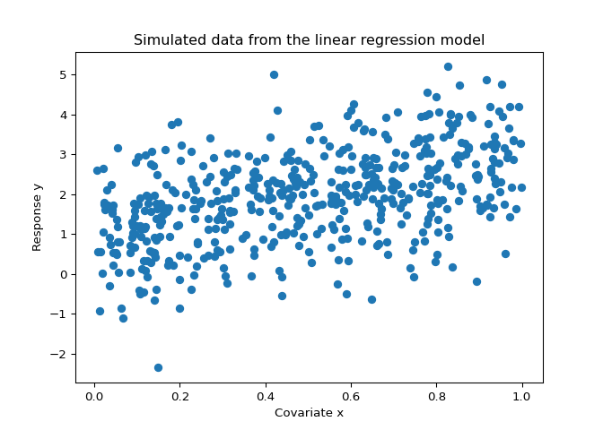
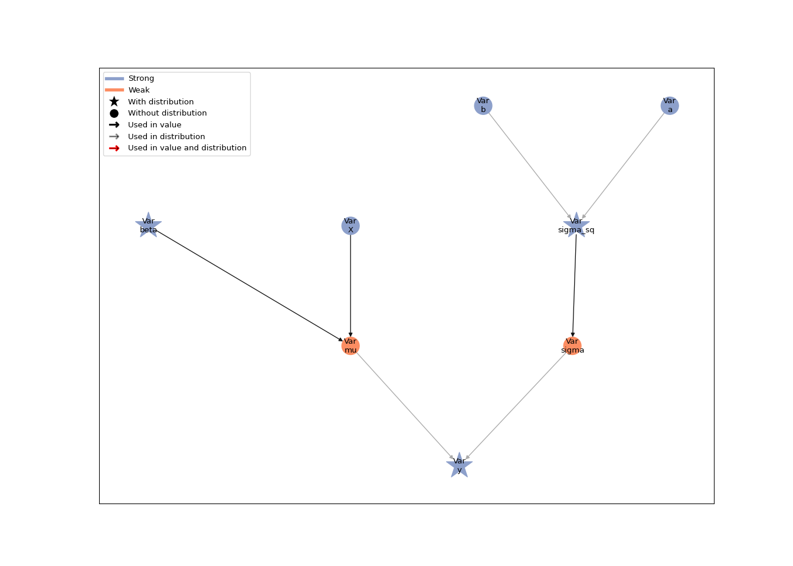

# Model building with Liesel

In this tutorial, we go into more depth regarding the model building
functionality in Liesel.

Liesel is based on the concept of probabilistic graphical models (PGMs)
to represent (primarily Bayesian) statistical models, so let us start
with a very brief look at what PGMs are and how they are implemented in
Liesel.

## Probabilistic graphical models

In a PGM, each variable is represented as a node. There are two basic
types of nodes in Liesel: strong and weak nodes. A strong node is a node
whose value is defined “outside” of the model, for example, if the node
represents some observed data or a parameter (parameters are usually set
by an inference algorithm such as an optimizer or sampler). In contrast,
a weak node is a node whose value is defined “within” the model, that
is, it is a deterministic function of some other nodes. An
exp-transformation mapping a real-valued parameter to a positive number,
for example, would be a weak node.

In addition, each node can have an optional probability distribution.
The probability density or mass function of the distribution evaluated
at the value of the node gives its log-probability. In a typical
Bayesian regression model, the response node would have a normal
distribution and the parameter nodes would have some prior distribution
(for example, a normal-inverse-gamma prior). The following table shows
the different node types and some examples of their use cases.

|                          | **Strong node**              | **Weak node**                                      |
|--------------------------|------------------------------|----------------------------------------------------|
| **With distribution**    | Response, parameter, …       | Copula, …                                          |
| **Without distribution** | Covariate, hyperparameter, … | Inverse link function, parameter transformation, … |

A PGM is a collection of connected nodes. Two nodes can be connected
through a directed edge, meaning that the first node is an input for the
value or the distribution of the second node. Nodes *without* an edge
between them are assumed to be conditionally independent, allowing us to
factorize the model log-probability as

$$
\log p(\text{Model}) = \sum_{\text{Node $\in$ Model}} \log p(\text{Node} \mid \text{Inputs}(\text{Node})).
$$

So let us consider the same model and data from the [linear regression
tutorial](01a-lin-reg.md), where we had the underlying model
$y_i \sim \mathcal{N}(\beta_0 + \beta_1 x_i, \;\sigma^2)$ with the true
parameters $\boldsymbol{\beta} = (\beta_0, \beta_1)' = (1, 2)'$ and
$\sigma = 1$.

``` python
import jax
import jax.numpy as jnp
import numpy as np
import matplotlib.pyplot as plt

# We use distributions and bijectors from tensorflow probability
import tensorflow_probability.substrates.jax.distributions as tfd
import tensorflow_probability.substrates.jax.bijectors as tfb

import liesel.goose as gs
import liesel.model as lsl

rng = np.random.default_rng(42)


# sample size and true parameters

n = 500
true_beta = np.array([1.0, 2.0])
true_sigma = 1.0

# data-generating process

x0 = rng.uniform(size=n)
X_mat = np.column_stack([np.ones(n), x0])
eps = rng.normal(scale=true_sigma, size=n)
y_vec = X_mat @ true_beta + eps

# plot the simulated data

plt.scatter(x0, y_vec)
plt.title("Simulated data from the linear regression model")
plt.xlabel("Covariate x")
plt.ylabel("Response y")
plt.show()
```



### Building the model graph

The graph of a Bayesian linear regression model is a tree, where the
hyperparameters of the prior are the leaves and the response is the
root. To build this tree in Liesel, we need to start from the leaves and
work our way down to the root.

In the linear regression tutorial, we assumed the weakly informative
prior $\beta_0, \beta_1 \sim \mathcal{N}(0, 100^2)$, so we start from
there and then work our way down. To do so, we need to define its
initial value and its node distribution using the {class}`.Dist` class.

``` python
beta_prior = lsl.Dist(tfd.Normal, loc=0.0, scale=100.0)
```

Note that you could also provide a {class}`.Var` instance for the `loc`
and `scale` argument - this fact allows you to build hierarchical
models. If you provide floats like we do here, Liesel will turn them
into {class}`.Value` nodes under the hood.

With this distribution object, we can now create the node for our
regression coefficient with the {meth}`.Var.new_param` constructor:

``` python
beta = lsl.Var.new_param(value=np.array([0.0, 0.0]), distribution=beta_prior, name="beta")
```

The second branch of the tree contains the residual standard deviation,
which we again build using the weakly informative prior
$\sigma^2 \sim \text{InverseGamma}(a, b)$ with $a = b = 0.01$ on the
squared standard deviation. This time, we supply the hyperparameters as
{class}`.Var` instances.

``` python
a = lsl.Var.new_param(0.01, name="a")
b = lsl.Var.new_param(0.01, name="b")
sigma_sq_prior = lsl.Dist(tfd.InverseGamma, concentration=a, scale=b)
sigma_sq = lsl.Var.new_param(value=10.0, distribution=sigma_sq_prior, name="sigma_sq")
```

The variable constructor {meth}`.Var.new_calc` always takes a function
as its first argument, and the nodes to be used as function inputs as
the following arguments. We use it to compute the square root of our
variance, since we again also need to work with the scale. This is the
first weak node that we are setting up - all previous nodes have been
strong.

``` python
sigma = lsl.Var.new_calc(jnp.sqrt, sigma_sq, name="sigma").update()
```

We do the same to compute the matrix-vector product after constructing
the design matrix

``` python
X = lsl.Var.new_obs(X_mat, name="X")
mu = lsl.Var.new_calc(jnp.dot, X, beta, name="mu")
```

Finally, we can connect the branches of the tree in a response node. The
node values are our observed response values, and as before, we must
specify the response distribution.

``` python
y_dist = lsl.Dist(tfd.Normal, loc=mu, scale=sigma)
y = lsl.Var.new_obs(y_vec, distribution=y_dist, name="y")
```

Now, to construct a full-fledged Liesel model from our individual node
objects, we only add the response node.

``` python
model = lsl.Model([y])
model
```

    Model(24 nodes, 8 vars)

Since all other nodes are directly or indirectly connected to this node,
the Model has collected those nodes automatically.

To visualize the statistical graph of a model we call the
{func}`.plot_vars()` function. Strong nodes are shown in blue, weak
nodes in red. Nodes with a probability distribution are highlighted with
a star. In the figure below, we can see the tree-like structure of the
graph and identify the two branches for the mean and the standard
deviation of the response.

``` python
lsl.plot_vars(model)
```



### Node and model log-probabilities

The log-probability of the model, which can be interpreted as the
unnormalized log-posterior in a Bayesian context, can be accessed with
the `log_prob` property.

``` python
model.log_prob
```

    Array(-1179.6559, dtype=float32)

The individual nodes also have a `log_prob` property. In fact, because
of the conditional independence assumption of the model, the
log-probability of the model is given by the sum of the
log-probabilities of the nodes with probability distributions. We take
the sum for the `.log_prob` attributes of `beta` and `y` because, per
default, the attributes return the individual log-probability
contributions of each element in the values of the nodes. So for `beta`
we would get two log-probability values, and for `y` we would get 500.

``` python
beta.log_prob.sum() + sigma_sq.log_prob + y.log_prob.sum()
```

    Array(-1179.6559, dtype=float32)

Nodes without a probability distribution return a log-probability of
zero.

``` python
sigma.log_prob
```

    0.0

The log-probability of a node depends on its value and its inputs. Thus,
if we change the variance of the response from 10 to 1, the
log-probability of the corresponding node, the log-probability of the
response node, and the log-probability of the model change as well.

``` python
print(f"Old value of sigma_sq: {sigma_sq.value}")
```

    Old value of sigma_sq: 10.0

``` python
print(f"Old log-prob of sigma_sq: {sigma_sq.log_prob}")
```

    Old log-prob of sigma_sq: -6.972140312194824

``` python
print(f"Old log-prob of y: {y.log_prob.sum()}\n")
```

    Old log-prob of y: -1161.635498046875

``` python
sigma_sq.value = 1.0

print(f"New value of sigma_sq: {sigma_sq.value}")
```

    New value of sigma_sq: 1.0

``` python
print(f"New log-prob of sigma_sq: {sigma_sq.log_prob}")
```

    New log-prob of sigma_sq: -4.655529975891113

``` python
print(f"New log-prob of y: {y.log_prob.sum()}\n")
```

    New log-prob of y: -1724.6702880859375

``` python
print(f"New model log-prob: {model.log_prob}")
```

    New model log-prob: -1740.3740234375

For most inference algorithms, we need the gradient of the model
log-probability with respect to the parameters. Liesel uses [the JAX
library for numerical computing and machine
learning](https://github.com/google/jax) to compute gradients using
automatic differentiation.
