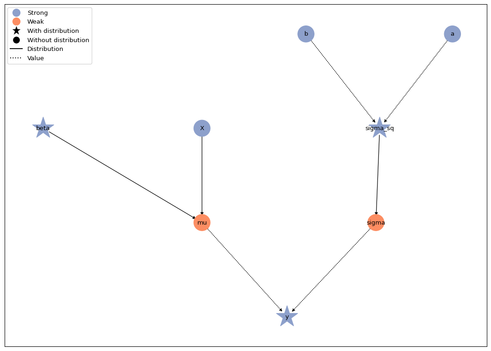

# Model building with Liesel

In this tutorial, we go into more depth regarding the model building
functionality in Liesel.

Liesel is based on the concept of probabilistic graphical models (PGMs)
to represent (primarily Bayesian) statistical models, so let us start
with a very brief look at what PGMs are and how they are implemented in
Liesel.

## Probabilistic graphical models

In a Liesel model, each model variable is represented as a
{class}`.Var`. There are two basic types of variables: strong and weak
variables. A strong variable has its value supplied externally, for
example observed data, a fixed hyperparameter, or a model parameter
whose value is changed by an inference algorithm. A weak variable has
its value computed inside the graph as a deterministic function of other
variables. A transformed parameter, a linear predictor, or an inverse
link function would typically be weak variables.

In addition, each variable can have an optional probability
distribution, represented by the {class}`.Dist` class. The probability
density or mass function of this distribution evaluated at the current
value of the variable gives the variable’s log-probability contribution.
In a typical Bayesian regression model, the response variable has a
likelihood and the parameter variables have prior distributions.
Variables without a distribution, such as covariates or fixed
hyperparameters, contribute zero to the model log-probability. The
following table shows the different variable types and some examples of
their use cases.

|                          | **Strong variable**          | **Weak variable**                                  |
|--------------------------|------------------------------|----------------------------------------------------|
| **With distribution**    | Response, parameter, …       | Copula, …                                          |
| **Without distribution** | Covariate, hyperparameter, … | Inverse link function, parameter transformation, … |

A PGM is a directed acyclic graph of connected variables. Two variables
can be connected through a directed edge, meaning that the first
variable is an input for either the value or the distribution of the
second variable. Variables *without* an edge between them are assumed to
be conditionally independent, allowing us to factorize the model
log-probability as

$$
\log p(\text{Model}) = \sum_{\text{Var $\in$ Model}} \log p(\text{Var} \mid \text{Inputs}(\text{Var})).
$$

So let us consider the same model and data from the [linear regression
tutorial](01a-lin-reg.md), where we had the underlying model
$y_i \sim \mathcal{N}(\beta_0 + \beta_1 x_i, \;\sigma^2)$ with the true
parameters $\boldsymbol{\beta} = (\beta_0, \beta_1)' = (1, 2)'$ and
$\sigma = 1$.

``` python
import jax.numpy as jnp
import numpy as np
import matplotlib.pyplot as plt

import tensorflow_probability.substrates.jax.distributions as tfd

import liesel.model as lsl

rng = np.random.default_rng(42)


# sample size and true parameters

n = 500
true_beta = np.array([1.0, 2.0])
true_sigma = 1.0

# data-generating process

x0 = rng.uniform(size=n)
X_mat = np.column_stack([np.ones(n), x0])
eps = rng.normal(scale=true_sigma, size=n)
y_vec = X_mat @ true_beta + eps

# plot the simulated data

plt.scatter(x0, y_vec)
plt.title("Simulated data from the linear regression model")
plt.xlabel("Covariate x")
plt.ylabel("Response y")
plt.show()
```


### Building the model graph

The graph of this Bayesian linear regression model is a tree-like
directed acyclic graph: the fixed hyperparameters and covariates are
leaves, the response is the final observed variable, and deterministic
quantities such as $\mu$ and $\sigma$ connect the prior and likelihood
parts of the graph. To build this graph in Liesel, we start with the
inputs and work our way toward the response.

In the linear regression tutorial, we assumed the weakly informative
prior $\beta_0, \beta_1 \sim \mathcal{N}(0, 100^2)$, so we start from
there. First, we define the prior distribution using the {class}`.Dist`
class.

``` python
beta_prior = lsl.Dist(tfd.Normal, loc=0.0, scale=100.0)
```

Note that you could also provide {class}`.Var` instances for the `loc`
and `scale` arguments; this is how hierarchical dependencies between
distributions are expressed. If you provide floats like we do here,
Liesel turns them into constant inputs under the hood.

With this distribution object, we can now create the variable for our
regression coefficient with the {meth}`.Var.new_param` constructor. A
parameter variable is a strong variable, and its distribution is counted
as part of the model’s log prior.

``` python
beta = lsl.Var.new_param(value=np.array([0.0, 0.0]), dist=beta_prior, name="beta")
```

The second branch of the graph contains the residual standard deviation,
which we build using the weakly informative prior
$\sigma^2 \sim \text{InverseGamma}(a, b)$ with $a = b = 0.01$ on the
squared standard deviation. This time, we supply the fixed
hyperparameters as constant variables. They are strong variables without
distributions, so they are part of the graph but do not contribute to
the log prior.

``` python
a = lsl.Var.new_value(0.01, name="a")
b = lsl.Var.new_value(0.01, name="b")
sigma_sq_prior = lsl.Dist(tfd.InverseGamma, concentration=a, scale=b)
sigma_sq = lsl.Var.new_param(value=10.0, dist=sigma_sq_prior, name="sigma_sq")
```

The variable constructor {meth}`.Var.new_calc` creates a weak variable.
It takes a function as its first argument and the variables to be used
as function inputs as the following arguments. Here we compute the
square root of the variance because the normal likelihood is
parameterized by a scale rather than by a variance. This is the first
weak variable in the model; all previous variables have been strong.

``` python
sigma = lsl.Var.new_calc(jnp.sqrt, sigma_sq, name="sigma")
```

We do the same for the linear predictor. The design matrix `X` is
observed input data without a distribution, and `mu` is a weak variable
that computes the matrix-vector product $X\beta$.

``` python
X = lsl.Var.new_obs(X_mat, name="X")
mu = lsl.Var.new_calc(jnp.dot, X, beta, name="mu")
```

Finally, we connect both branches of the graph in the response variable.
The value of `y` is fixed to our observed response vector, while its
distribution defines the likelihood.

``` python
y_dist = lsl.Dist(tfd.Normal, loc=mu, scale=sigma)
y = lsl.Var.new_obs(y_vec, dist=y_dist, name="y")
```

Now, to construct a full Liesel model from our individual variables, we
only need to pass the response variable.

``` python
model = lsl.Model([y])
model
```

    Model(24 nodes, 8 vars)

Since all other variables are directly or indirectly connected to `y`,
the model collects the full graph automatically by following the inputs
of the response variable.

The resulting {class}`.Model` object stores dictionaries of all
variables, parameter variables, and observed variables.

``` python
list(model.vars), list(model.parameters), list(model.observed)
```

    (['b', 'a', 'beta', 'X', 'sigma_sq', 'mu', 'sigma', 'y'],
     ['beta', 'sigma_sq'],
     ['X', 'y'])

To visualize the statistical graph of a model we call
{meth}`.Model.plot`. Strong variables are shown in blue, weak variables
in red. Variables with a probability distribution are highlighted with a
star. In the figure below, we can see the tree-like structure of the
graph and identify the two branches for the mean and the standard
deviation of the response.

``` python
model.plot()
```



### Variable and model log-probabilities

The log-probability of the model, which can be interpreted as the
unnormalized log-posterior in a Bayesian context, can be accessed with
the `log_prob` property. The model also provides `log_prior` and
`log_lik`, which sum the log-probability contributions of parameter
variables and observed variables, respectively.

``` python
model.log_prob
```

    Array(-1179.656, dtype=float32)

``` python
model.log_prior, model.log_lik
```

    (Array(-18.020359, dtype=float32), Array(-1161.6356, dtype=float32))

The individual variables also have a `log_prob` property. In fact,
because of the conditional independence assumption of the model, the
log-probability of the model is given by the sum of the
log-probabilities of the variables with probability distributions. We
take the sum for the `.log_prob` attributes of `beta` and `y` because
these attributes return the individual log-probability contributions of
each element in the variable values. So for `beta` we would get two
log-probability values, and for `y` we would get 500.

``` python
beta.log_prob.sum() + sigma_sq.log_prob + y.log_prob.sum()
```

    Array(-1179.656, dtype=float32)

Variables without a probability distribution return a log-probability of
zero.

``` python
sigma.log_prob
```

    0.0

The log-probability of a variable depends on its value and its
distribution inputs. Thus, if we change the variance of the response
from 10 to 1, the log-probability of the corresponding parameter
variable, the log-probability of the response variable, and the
log-probability of the model change as well.

``` python
print(f"Old value of sigma_sq: {sigma_sq.value}")
print(f"Old log-prob of sigma_sq: {sigma_sq.log_prob}")
print(f"Old log-prob of y: {y.log_prob.sum()}\n")

sigma_sq.value = 1.0

print(f"New value of sigma_sq: {sigma_sq.value}")
print(f"New log-prob of sigma_sq: {sigma_sq.log_prob}")
print(f"New log-prob of y: {y.log_prob.sum()}\n")

print(f"New model log-prob: {model.log_prob}")
```

    Old value of sigma_sq: 10.0
    Old log-prob of sigma_sq: -6.972140312194824
    Old log-prob of y: -1161.6356201171875

    New value of sigma_sq: 1.0
    New log-prob of sigma_sq: -4.655529975891113
    New log-prob of y: -1724.6702880859375

    New model log-prob: -1740.3740234375

For most inference algorithms, we need the gradient of the model
log-probability with respect to the parameters. Liesel uses [the JAX
library for numerical computing and machine
learning](https://github.com/google/jax) to compute these gradients
using automatic differentiation, and the graph representation keeps the
corresponding log-probability calculations explicit and inspectable.
