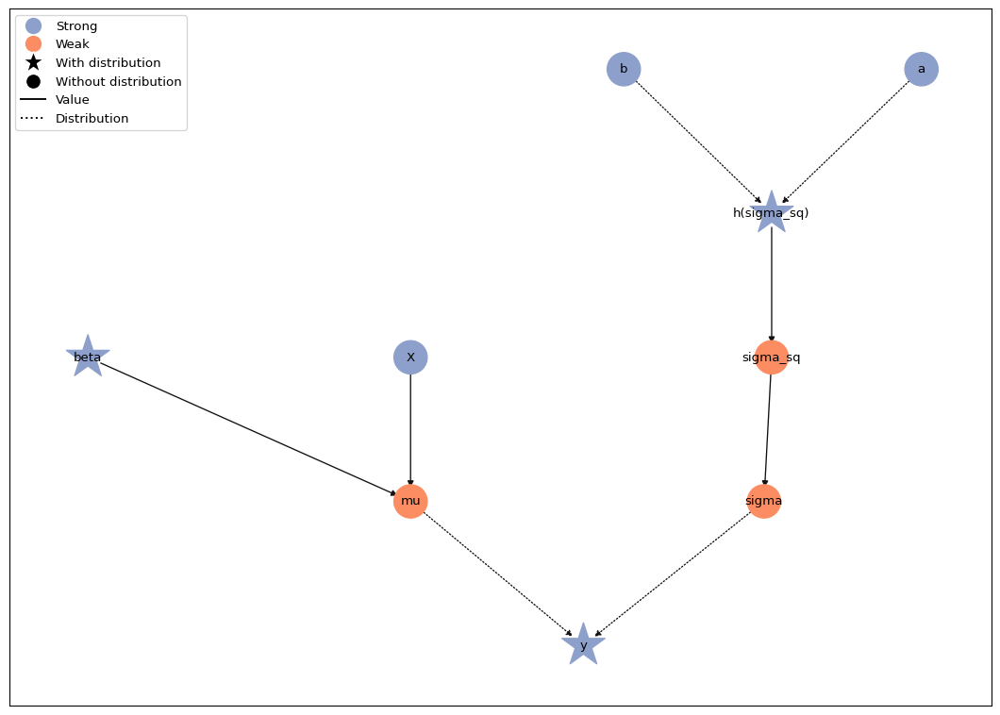
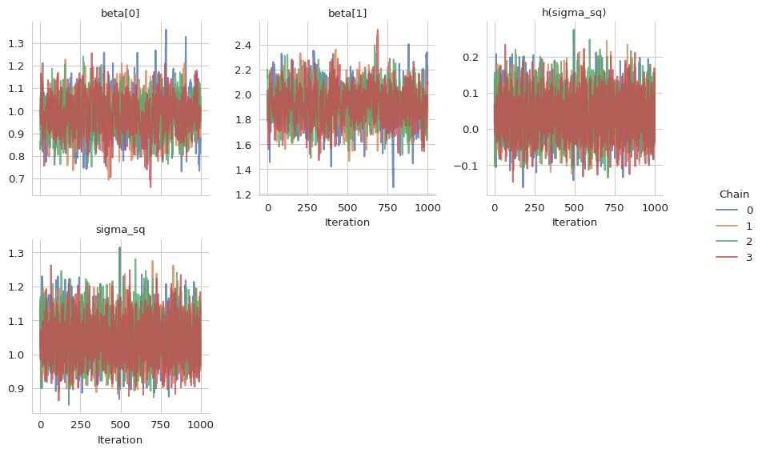
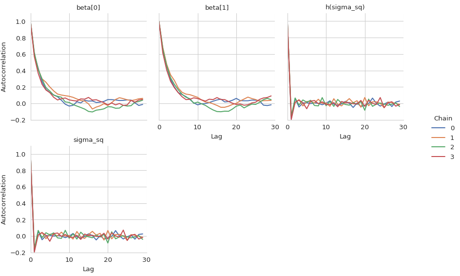

# Parameter transformations


This tutorial builds on the [linear regression
tutorial](01a-lin-reg.md#linear-regression). Here, we demonstrate how to
transform a positive-valued parameter so that it can be sampled with a
NUTS kernel on an unconstrained scale.

First, let’s set up the linear regression model again. The
data-generating process and the model structure are the same as in the
[linear regression tutorial](01a-lin-reg.md#linear-regression), but this
time we prepare the model for joint NUTS sampling of the regression
coefficients and the error variance.

``` python
import jax
import jax.numpy as jnp
import numpy as np
import matplotlib.pyplot as plt

# We use distributions and bijectors from tensorflow probability
import tensorflow_probability.substrates.jax.distributions as tfd
import tensorflow_probability.substrates.jax.bijectors as tfb

import liesel.goose as gs
import liesel.model as lsl

rng = np.random.default_rng(42)

# data-generating process
n = 500
true_beta = np.array([1.0, 2.0])
true_sigma = 1.0
x0 = rng.uniform(size=n)
X_mat = np.c_[np.ones(n), x0]
y_vec = X_mat @ true_beta + rng.normal(scale=true_sigma, size=n)

# Model
# Part 1: Model for the mean
beta_prior = lsl.Dist(tfd.Normal, loc=0.0, scale=100.0)
beta = lsl.Var.new_param(
    value=np.array([0.0, 0.0]),
    dist=beta_prior,
    name="beta",
    inference=gs.MCMCSpec(gs.NUTSKernel, kernel_group="1"),
)

X = lsl.Var.new_obs(X_mat, name="X")
mu = lsl.Var(lsl.Calc(jnp.dot, X, beta), name="mu")

# Part 2: Model for the standard deviation
a = lsl.Var(0.01, name="a")
b = lsl.Var(0.01, name="b")
sigma_sq_prior = lsl.Dist(tfd.InverseGamma, concentration=a, scale=b)
sigma_sq = lsl.Var.new_param(value=10.0, dist=sigma_sq_prior, name="sigma_sq")

sigma = lsl.Var(lsl.Calc(jnp.sqrt, sigma_sq), name="sigma")

# Observation model
y_dist = lsl.Dist(tfd.Normal, loc=mu, scale=sigma)
y = lsl.Var(y_vec, dist=y_dist, name="y")
```

Now let’s try to sample the regression coefficients $\boldsymbol{\beta}$
and the variance $\sigma^2$ with a single NUTS kernel. NUTS operates on
unconstrained real-valued parameters, whereas $\sigma^2$ must remain
positive. We therefore biject `sigma_sq` with an exponential bijector.
This creates an unconstrained latent variable representing
$\log(\sigma^2)$ and keeps `sigma_sq` as the positive back-transformed
value. Both `beta` and the transformed variance receive NUTS inference
specifications with the same `kernel_group`, so Goose samples them
jointly in one NUTS block.

``` python
sigma_sq.biject(tfb.Exp(), inference=gs.MCMCSpec(gs.NUTSKernel, kernel_group="1"))

model = lsl.Model(y)
model.plot()
```

    liesel.model.model - WARNING - Inconsistent log prob decomposition: Model.log_prob=-1177.35 ≠ (Model.log_lik=0.00 + Model.log_prior=-15.72).
    liesel.model.model - WARNING - Var(name="y") has a distribution but Var.parameter=False and Var.observed=False.



The response distribution still requires the standard deviation on the
original scale. The model graph shows that `sigma_sq` is now a
deterministic, positive-valued transformation of its unconstrained
latent variable. The standard deviation `sigma` is then computed as
`sqrt(sigma_sq)`, so the likelihood continues to receive a valid scale
parameter.

Now we can set up and run the MCMC algorithm directly from the
`MCMCSpec` objects stored in the model. We also include `sigma_sq` in
the stored positions, because the NUTS kernel itself samples the
transformed variable, while `sigma_sq` is the easier quantity to
interpret.

``` python
results = gs.LieselMCMC(model).run_for_epochs(
    seed=1,
    num_chains=4,
    adaptation=1000,
    posterior=1000,
    positions_included=["sigma_sq"],
)
```

    liesel.goose.builder - WARNING - No jitter functions provided for position keys 'h(sigma_sq)', 'beta'. The initial values for these keys won't be jittered
    liesel.goose.engine - INFO - Initializing kernels...
    liesel.goose.engine - INFO - Done
    liesel.goose.engine - INFO - Starting epoch: FAST_ADAPTATION, 100 transitions, 25 jitted together

      0%|                                                  | 0/4 [00:00<?, ?chunk/s]
     25%|██████████▌                               | 1/4 [00:03<00:11,  3.77s/chunk]
    100%|██████████████████████████████████████████| 4/4 [00:03<00:00,  1.06chunk/s]
    liesel.goose.engine - WARNING - Errors per chain for kernel_00: 1, 3, 3, 3 / 100 transitions
    liesel.goose.engine - INFO - Finished epoch
    liesel.goose.engine - INFO - Starting epoch: SLOW_ADAPTATION, 25 transitions, 25 jitted together

      0%|                                                  | 0/1 [00:00<?, ?chunk/s]
    100%|█████████████████████████████████████████| 1/1 [00:00<00:00, 691.22chunk/s]
    liesel.goose.engine - WARNING - Errors per chain for kernel_00: 1, 1, 1, 1 / 25 transitions
    liesel.goose.engine - INFO - Finished epoch
    liesel.goose.engine - INFO - Starting epoch: SLOW_ADAPTATION, 50 transitions, 25 jitted together

      0%|                                                  | 0/2 [00:00<?, ?chunk/s]
    100%|████████████████████████████████████████| 2/2 [00:00<00:00, 1458.38chunk/s]
    liesel.goose.engine - WARNING - Errors per chain for kernel_00: 1, 1, 4, 2 / 50 transitions
    liesel.goose.engine - INFO - Finished epoch
    liesel.goose.engine - INFO - Starting epoch: SLOW_ADAPTATION, 100 transitions, 25 jitted together

      0%|                                                  | 0/4 [00:00<?, ?chunk/s]
    100%|████████████████████████████████████████| 4/4 [00:00<00:00, 1215.04chunk/s]
    liesel.goose.engine - WARNING - Errors per chain for kernel_00: 1, 3, 1, 2 / 100 transitions
    liesel.goose.engine - INFO - Finished epoch
    liesel.goose.engine - INFO - Starting epoch: SLOW_ADAPTATION, 525 transitions, 25 jitted together

      0%|                                                 | 0/21 [00:00<?, ?chunk/s]
    100%|███████████████████████████████████████| 21/21 [00:00<00:00, 215.74chunk/s]
    liesel.goose.engine - WARNING - Errors per chain for kernel_00: 2, 3, 1, 2 / 525 transitions
    liesel.goose.engine - INFO - Finished epoch
    liesel.goose.engine - INFO - Starting epoch: FAST_ADAPTATION, 200 transitions, 25 jitted together

      0%|                                                  | 0/8 [00:00<?, ?chunk/s]
    100%|█████████████████████████████████████████| 8/8 [00:00<00:00, 588.58chunk/s]
    liesel.goose.engine - WARNING - Errors per chain for kernel_00: 3, 2, 2, 3 / 200 transitions
    liesel.goose.engine - INFO - Finished epoch
    liesel.goose.engine - INFO - Finished warmup
    liesel.goose.engine - INFO - Starting epoch: POSTERIOR, 1000 transitions, 25 jitted together

      0%|                                                 | 0/40 [00:00<?, ?chunk/s]
     62%|████████████████████████▍              | 25/40 [00:00<00:00, 243.33chunk/s]
    100%|███████████████████████████████████████| 40/40 [00:00<00:00, 212.13chunk/s]
    liesel.goose.engine - INFO - Finished epoch

Judging from the trace plots, it seems that all chains have converged.

``` python
gs.plot_trace(results)
```



We can also take a look at the summary table, which includes both the
original $\sigma^2$ and the transformed $\log(\sigma^2)$.

``` python
gs.Summary(results)
```

<p>

<strong>Parameter summary:</strong>
</p>

<table border="0" class="dataframe">

<thead>

<tr style="text-align: right;">

<th>

</th>

<th>

</th>

<th>

kernel
</th>

<th>

mean
</th>

<th>

sd
</th>

<th>

q_0.05
</th>

<th>

q_0.5
</th>

<th>

q_0.95
</th>

<th>

sample_size
</th>

<th>

ess_bulk
</th>

<th>

ess_tail
</th>

<th>

rhat
</th>

</tr>

<tr>

<th>

parameter
</th>

<th>

index
</th>

<th>

</th>

<th>

</th>

<th>

</th>

<th>

</th>

<th>

</th>

<th>

</th>

<th>

</th>

<th>

</th>

<th>

</th>

<th>

</th>

</tr>

</thead>

<tbody>

<tr>

<th rowspan="2" valign="top">

beta
</th>

<th>

(0,)
</th>

<td>

kernel_00
</td>

<td>

0.980
</td>

<td>

0.090
</td>

<td>

0.830
</td>

<td>

0.982
</td>

<td>

1.127
</td>

<td>

4000
</td>

<td>

841.545
</td>

<td>

986.330
</td>

<td>

1.002
</td>

</tr>

<tr>

<th>

(1,)
</th>

<td>

kernel_00
</td>

<td>

1.915
</td>

<td>

0.158
</td>

<td>

1.661
</td>

<td>

1.915
</td>

<td>

2.178
</td>

<td>

4000
</td>

<td>

750.169
</td>

<td>

986.009
</td>

<td>

1.002
</td>

</tr>

<tr>

<th>

h(sigma_sq)
</th>

<th>

()
</th>

<td>

kernel_00
</td>

<td>

0.040
</td>

<td>

0.063
</td>

<td>

-0.060
</td>

<td>

0.039
</td>

<td>

0.145
</td>

<td>

4000
</td>

<td>

5414.602
</td>

<td>

3247.635
</td>

<td>

1.001
</td>

</tr>

<tr>

<th>

sigma_sq
</th>

<th>

()
</th>

<td>

\-
</td>

<td>

1.043
</td>

<td>

0.066
</td>

<td>

0.941
</td>

<td>

1.040
</td>

<td>

1.156
</td>

<td>

4000
</td>

<td>

5414.611
</td>

<td>

3247.635
</td>

<td>

1.001
</td>

</tr>

</tbody>

</table>

<p>

<strong>Acceptance probabilities:</strong>
</p>

<table border="0" class="dataframe">

<thead>

<tr style="text-align: right;">

<th>

</th>

<th>

</th>

<th>

</th>

<th>

acceptance_probability
</th>

<th>

position_moved
</th>

</tr>

<tr>

<th>

kernel
</th>

<th>

positions
</th>

<th>

phase
</th>

<th>

</th>

<th>

</th>

</tr>

</thead>

<tbody>

<tr>

<th rowspan="2" valign="top">

kernel_00
</th>

<th rowspan="2" valign="top">

h(sigma_sq), beta
</th>

<th>

posterior
</th>

<td>

0.868
</td>

<td>

NaN
</td>

</tr>

<tr>

<th>

warmup
</th>

<td>

0.792
</td>

<td>

NaN
</td>

</tr>

</tbody>

</table>

<p>

<strong>Error summary:</strong>
</p>

<table border="0" class="dataframe">

<thead>

<tr style="text-align: right;">

<th>

</th>

<th>

</th>

<th>

</th>

<th>

</th>

<th>

</th>

<th>

count
</th>

<th>

sample_size
</th>

<th>

sample_size_total
</th>

<th>

relative
</th>

</tr>

<tr>

<th>

kernel
</th>

<th>

positions
</th>

<th>

error_code
</th>

<th>

error_msg
</th>

<th>

phase
</th>

<th>

</th>

<th>

</th>

<th>

</th>

<th>

</th>

</tr>

</thead>

<tbody>

<tr>

<th rowspan="2" valign="top">

kernel_00
</th>

<th rowspan="2" valign="top">

h(sigma_sq), beta
</th>

<th rowspan="2" valign="top">

1
</th>

<th rowspan="2" valign="top">

divergent transition
</th>

<th>

warmup
</th>

<td>

47
</td>

<td>

4000
</td>

<td>

4000
</td>

<td>

0.012
</td>

</tr>

<tr>

<th>

posterior
</th>

<td>

0
</td>

<td>

4000
</td>

<td>

4000
</td>

<td>

0.000
</td>

</tr>

</tbody>

</table>

Finally, let’s check the autocorrelation of the samples.

``` python
gs.plot_cor(results)
```


