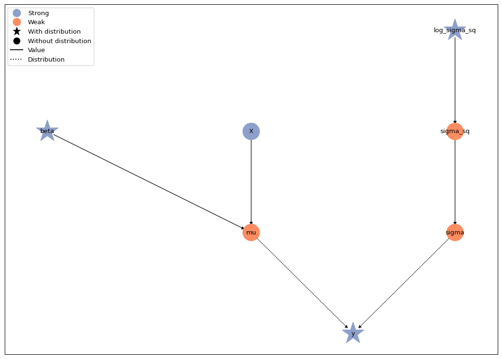
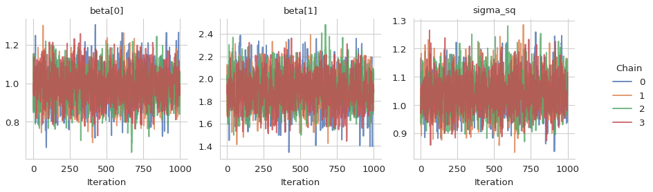
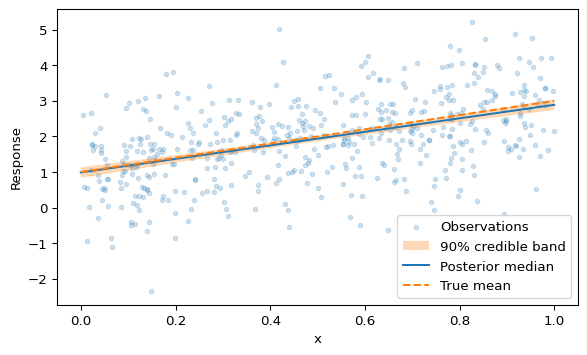

# Sample your first posterior

<a id="parameter-transformations"></a>

Fit a Gaussian regression with NUTS, inspect the chains, and use the
draws to estimate the regression mean. You should already know how to
{doc}`build a Liesel model <01a-lin-reg>`. This page includes the
complete setup and samples both the coefficients and the noise variance.

## Build a small regression model

We simulate 500 observations with intercept 1, slope 2, and noise
standard deviation 1. Independent normal priors describe the two
coefficients, and an inverse-gamma prior keeps the variance positive.

``` python
import jax
import jax.numpy as jnp
import matplotlib.pyplot as plt
import numpy as np
import pandas as pd
import tensorflow_probability.substrates.jax.bijectors as tfb
import tensorflow_probability.substrates.jax.distributions as tfd

import liesel.goose as gs
import liesel.model as lsl

rng = np.random.default_rng(42)
n = 500
true_beta = np.array([1.0, 2.0])
true_sigma = 1.0
x = rng.uniform(size=n)
X_mat = np.column_stack([np.ones(n), x])
y_vec = X_mat @ true_beta + rng.normal(scale=true_sigma, size=n)

beta = lsl.Var.new_param(
    jnp.zeros(2), lsl.Dist(tfd.Normal, 0.0, 5.0), name="beta"
)
sigma_sq = lsl.Var.new_param(
    1.0, lsl.Dist(tfd.InverseGamma, concentration=3.0, scale=2.0), name="sigma_sq"
)
sigma = lsl.Var.new_calc(jnp.sqrt, sigma_sq, name="sigma")
X = lsl.Var.new_obs(X_mat, name="X")
mu = lsl.Var.new_calc(jnp.dot, X, beta, name="mu")
y = lsl.Var.new_obs(y_vec, lsl.Dist(tfd.Normal, mu, sigma), name="y")
```

## Prepare the variance for NUTS

NUTS uses gradients in unconstrained coordinates. Transform the positive
variance with an exponential bijector and name its unconstrained
counterpart `log_sigma_sq`:

``` python
sigma_sq.biject(tfb.Exp(), name="log_sigma_sq")
log_sigma_sq = sigma_sq.bijected_var
```

The model still describes the same prior on the variance. If
$\eta=\log(\sigma^2)$, the transformed density is
$p_\eta(\eta)=p_{\sigma^2}(e^\eta)e^\eta$.
{meth}`~liesel.model.Var.biject` includes this change-of-variables
factor. Choosing a new normal prior on $\eta$ and exponentiating it
would instead define a different prior on $\sigma^2$.

## Choose a joint update

Give the coefficients and log variance the same explicit `kernel_group`:

``` python
joint = gs.MCMCSpec(
    gs.NUTSKernel,
    kernel_group="regression",
    jitter_dist=tfd.Normal(0.0, 0.2),
)
beta.inference = joint
log_sigma_sq.inference = joint
model = lsl.Model([y])
```

One NUTS kernel now updates both coefficients and the log variance
together. The jitter distribution perturbs each chain’s initial values
on these unconstrained scales. Without a configured jitter distribution,
Goose uses the model’s starting values for every chain.

``` python
model.plot()
```



The graph separates the sampled `log_sigma_sq` from its deterministic
transformation `sigma_sq`. The likelihood receives the standard
deviation `sigma`, computed as the square root of the variance.

## Run several chains

``` python
results = gs.LieselMCMC(model).run_for_epochs(
    seed=1,
    num_chains=4,
    adaptation=1000,
    posterior=1000,
    positions_included=["sigma_sq"],
    show_progress=False,
)
```

    liesel.goose.engine - INFO - Initializing kernels...
    liesel.goose.engine - INFO - Done
    liesel.goose.engine - INFO - Finished warmup

Each chain runs 1,000 adaptation iterations followed by 1,000 posterior
iterations. Adaptation tunes the kernel; only the posterior phase
supplies draws for inference. These are example settings, not a
guarantee of adequate sampling. `positions_included` records the
variance on its original scale as well as the parameters updated by
NUTS.

## Inspect the chains

``` python
summary = gs.Summary(results, selected=["beta", "sigma_sq"])
summary.to_dataframe().set_index("var_fqn")[
    ["mean", "sd", "q_0.05", "q_0.95", "mcse_mean"]
].round(3)
```

<div>
<style scoped>
    .dataframe tbody tr th:only-of-type {
        vertical-align: middle;
    }
&#10;    .dataframe tbody tr th {
        vertical-align: top;
    }
&#10;    .dataframe thead th {
        text-align: right;
    }
</style>

|           | mean  | sd    | q_0.05 | q_0.95 | mcse_mean |
|-----------|-------|-------|--------|--------|-----------|
| var_fqn   |       |       |        |        |           |
| beta\[0\] | 0.988 | 0.092 | 0.836  | 1.137  | 0.002     |
| beta\[1\] | 1.903 | 0.159 | 1.646  | 2.171  | 0.004     |
| sigma_sq  | 1.041 | 0.065 | 0.940  | 1.154  | 0.001     |

</div>

The posterior means are about 0.99 for the intercept, 1.90 for the
slope, and 1.04 for the variance, compared with generating values of 1,
2, and 1. Finite data and the priors mean the estimates need not equal
the generating values. Posterior standard deviations describe
uncertainty in the parameters; Monte Carlo standard errors describe the
numerical precision of the estimates.

``` python
summary.aggregate_diagnostics().round(3)
```

<div>
<style scoped>
    .dataframe tbody tr th:only-of-type {
        vertical-align: middle;
    }
&#10;    .dataframe tbody tr th {
        vertical-align: top;
    }
&#10;    .dataframe thead th {
        text-align: right;
    }
</style>

|           | ess_bulk | ess_tail | rhat  | aggregated_by         |
|-----------|----------|----------|-------|-----------------------|
| parameter |          |          |       |                       |
| beta      | 1682.258 | 1899.951 | 1.004 | min (ess); max (rhat) |
| sigma_sq  | 2308.120 | 2138.040 | 1.001 | min (ess); max (rhat) |

</div>

In this run, the largest R-hat is about 1.004 and the smallest bulk ESS
is about 1,680 across the displayed parameters. For a vector such as
`beta`, this table reports its lowest bulk/tail ESS and largest R-hat.
Check all the parameters, not only one well-behaved coefficient.

``` python
summary.error_df().reset_index()[["error_msg", "phase", "count"]]
```

<div>
<style scoped>
    .dataframe tbody tr th:only-of-type {
        vertical-align: middle;
    }
&#10;    .dataframe tbody tr th {
        vertical-align: top;
    }
&#10;    .dataframe thead th {
        text-align: right;
    }
</style>

|     | error_msg            | phase     | count |
|-----|----------------------|-----------|-------|
| 0   | divergent transition | warmup    | 46    |
| 1   | divergent transition | posterior | 0     |

</div>

This run records divergences during warmup and none in the posterior
phase. The error table separates warmup from posterior sampling. An
error while the sampler is adapting has a different context from one
persisting in the posterior phase; inspect the message and phase before
deciding what to change.

``` python
gs.plot_trace(results, params=["beta", "sigma_sq"])
```



Look for overlap, drift, and long periods without movement. The traces
must be read alongside the numerical diagnostics; appearance alone
cannot establish convergence. See {doc}`../../goose-diagnostics` for
interpreting sampler errors, ESS, R-hat, and MCSE.

## Use the draws

``` python
samples = results.get_posterior_samples()
print(samples["beta"].shape)
print(samples["sigma_sq"].shape)
```

    (4, 1000, 2)
    (4, 1000)

The first two axes are chains and posterior draws. The coefficient
array’s last axis contains the intercept and slope. Warmup is excluded.

Predict the mean at new covariate values, retaining the design matrix’s
intercept column:

``` python
x_grid = jnp.linspace(0.0, 1.0, 100)
X_grid = jnp.column_stack([jnp.ones_like(x_grid), x_grid])
pred = model.predict(samples, predict=["mu"], newdata={"X": X_grid})
lower, median, upper = jnp.quantile(pred["mu"], jnp.array([0.05, 0.5, 0.95]), axis=(0, 1))

fig, ax = plt.subplots(figsize=(7, 4))
ax.scatter(x, y_vec, s=10, alpha=0.2, label="Observations")
ax.fill_between(x_grid, lower, upper, alpha=0.3, label="90% credible band")
ax.plot(x_grid, median, label="Posterior median")
ax.plot(x_grid, 1.0 + 2.0 * x_grid, "--", label="True mean")
ax.set(xlabel="x", ylabel="Response")
ax.legend()
plt.show()
```



The band describes pointwise uncertainty in the **mean**. It does not
describe the spread of individual observations. See
{doc}`../../goose-results` to simulate responses and obtain predictive
intervals.

Next, {doc}`combine NUTS and Gibbs updates <01d-gibbs-sampling>` for the
same statistical model, or
{doc}`choose different parameter blocks <../../goose-kernels>`.
