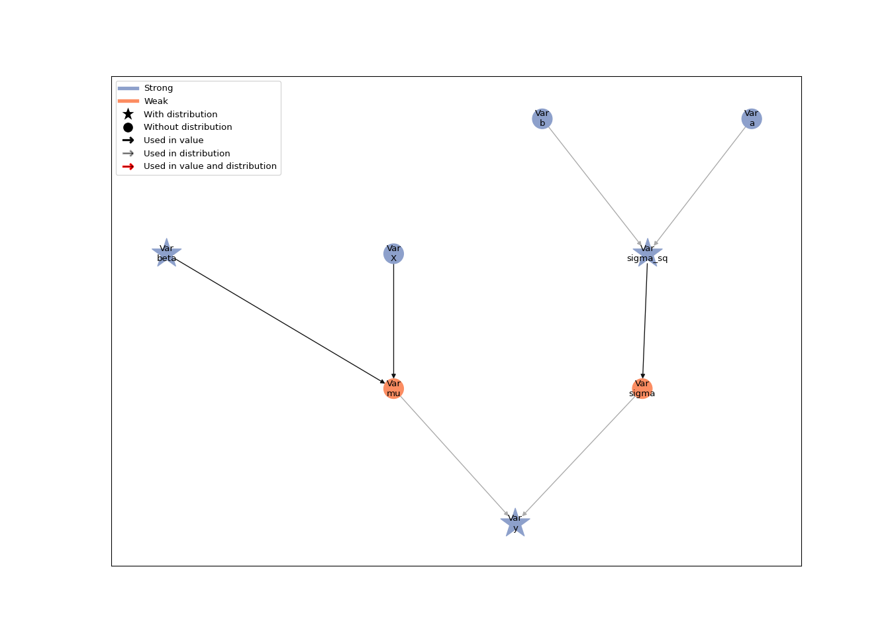
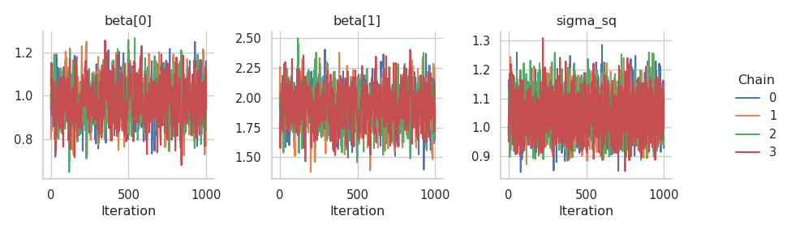
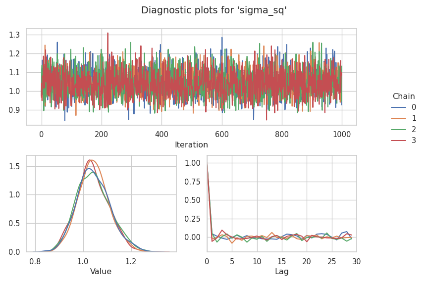

# Gibbs Sampling

This tutorial extends the [linear regression
tutorial](01a-lin-reg.md#linear-regression). Here, we show how to sample
model parameters using a Gibbs kernel.

As this tutorial is a continuation of the previous tutorials, we will
use the same model and data assumed there.

## Data and imports

``` python
import jax
import jax.numpy as jnp
import numpy as np

# We use distributions and bijectors from tensorflow probability
import tensorflow_probability.substrates.jax.distributions as tfd
import tensorflow_probability.substrates.jax.bijectors as tfb

import liesel.goose as gs
import liesel.model as lsl

import matplotlib.pyplot as plt
```

``` python
# Generate data
rng = np.random.default_rng(42)

# sample size and true parameters
n = 500
true_beta = np.array([1.0, 2.0])
true_sigma = 1.0

# data-generating process
x0 = rng.uniform(size=n)
X_mat = np.column_stack([np.ones(n), x0])
eps = rng.normal(scale=true_sigma, size=n)
y_vec = X_mat @ true_beta + eps

# define beta
beta_prior = lsl.Dist(tfd.Normal, loc=0.0, scale=100.0)

beta = lsl.Var.new_param(
    value=jnp.array([0.0, 0.0]), distribution=beta_prior, name="beta"
)

# define the variance and the scale
a = lsl.Var.new_param(0.01, name="a")
b = lsl.Var.new_param(0.01, name="b")
sigma_sq_prior = lsl.Dist(tfd.InverseGamma, concentration=a, scale=b)
sigma_sq = lsl.Var.new_param(value=1.0, distribution=sigma_sq_prior, name="sigma_sq")

# Define sigma as a transformation of sigma_sq for the likelihood
sigma = lsl.Var.new_calc(jnp.sqrt, sigma_sq, name="sigma")

# calculator-setup
X = lsl.Var.new_obs(X_mat, name="X")
mu = lsl.Var.new_calc(jnp.dot, X, beta, name="mu")

# Build response
y_dist = lsl.Dist(tfd.Normal, loc=mu, scale=sigma)
y = lsl.Var.new_obs(y_vec, distribution=y_dist, name="y")

# Plot model
model = lsl.Model([y])
lsl.plot_vars(model)
```



## MCMC inference

### Using a Gibbs kernel

This time we want to sample the previously fixed `sigma_sq` with a Gibbs
sampler. Using a Gibbs kernel is a bit more complicated, because Goose
doesn’t automatically derive the full conditional from the model graph.
Hence, the user needs to provide a function to sample from the full
conditional. The function needs to accept a PRNG state and a model state
as arguments, and it needs to return a dictionary with the node name as
the key and the new node value as the value. We could also update
multiple parameters with one Gibbs kernel if we returned a dictionary of
length two or more. To retrieve the relevant values of our nodes from
the `model_state`, we use the method
{meth}`~.goose.interface.LieselInterface.extract_position` of the
{class}`~.goose.interface.LieselInterface`.

``` python
def draw_sigma_sq(prng_key, model_state):
    # extract relevant values from model state
    pos = interface.extract_position(
      position_keys=["y", "mu", "sigma_sq", "a", "b"],
      model_state=model_state
    )
    # calculate relevant intermediate quantities
    n = len(pos["y"])
    resid = pos["y"] - pos["mu"]
    a_gibbs = pos["a"] + n / 2
    b_gibbs = pos["b"] + jnp.sum(resid**2) / 2
    # draw new value from full conditional
    draw = b_gibbs / jax.random.gamma(prng_key, a_gibbs)
    # return key-value pair of variable name and new value
    return {"sigma_sq": draw}
```

After constructing the Gibbs sampler, we can build our engine.

``` python
interface = gs.LieselInterface(model)
builder = gs.EngineBuilder(seed=1338, num_chains=4)
builder.set_model(gs.LieselInterface(model))
builder.set_initial_values(model.state)
builder.add_kernel(gs.NUTSKernel(["beta"]))
builder.add_kernel(gs.GibbsKernel(["sigma_sq"], draw_sigma_sq)) # add gibbs sampler
builder.set_duration(warmup_duration=1000, posterior_duration=1000)
engine = builder.build()
engine.sample_all_epochs()
```


      0%|                                                  | 0/3 [00:00<?, ?chunk/s]
     33%|##############                            | 1/3 [00:01<00:03,  1.60s/chunk]
    100%|##########################################| 3/3 [00:01<00:00,  1.87chunk/s]

      0%|                                                  | 0/1 [00:00<?, ?chunk/s]
    100%|########################################| 1/1 [00:00<00:00, 2066.16chunk/s]

      0%|                                                  | 0/2 [00:00<?, ?chunk/s]
    100%|########################################| 2/2 [00:00<00:00, 3623.59chunk/s]

      0%|                                                  | 0/4 [00:00<?, ?chunk/s]
    100%|########################################| 4/4 [00:00<00:00, 3964.37chunk/s]

      0%|                                                  | 0/8 [00:00<?, ?chunk/s]
    100%|########################################| 8/8 [00:00<00:00, 1318.19chunk/s]

      0%|                                                 | 0/20 [00:00<?, ?chunk/s]
    100%|#######################################| 20/20 [00:00<00:00, 379.48chunk/s]

      0%|                                                  | 0/2 [00:00<?, ?chunk/s]
    100%|########################################| 2/2 [00:00<00:00, 3546.98chunk/s]

      0%|                                                 | 0/40 [00:00<?, ?chunk/s]
     82%|################################1      | 33/40 [00:00<00:00, 317.62chunk/s]
    100%|#######################################| 40/40 [00:00<00:00, 304.37chunk/s]

Finally, we can take a look at our results

``` python
results = engine.get_results()
summary = gs.Summary(results)
summary
```

<p>
<strong>Parameter summary:</strong>
</p>
<table border="0" class="dataframe">
<thead>
<tr style="text-align: right;">
<th>
</th>
<th>
</th>
<th>
kernel
</th>
<th>
mean
</th>
<th>
sd
</th>
<th>
q_0.05
</th>
<th>
q_0.5
</th>
<th>
q_0.95
</th>
<th>
sample_size
</th>
<th>
ess_bulk
</th>
<th>
ess_tail
</th>
<th>
rhat
</th>
</tr>
<tr>
<th>
parameter
</th>
<th>
index
</th>
<th>
</th>
<th>
</th>
<th>
</th>
<th>
</th>
<th>
</th>
<th>
</th>
<th>
</th>
<th>
</th>
<th>
</th>
<th>
</th>
</tr>
</thead>
<tbody>
<tr>
<th rowspan="2" valign="top">
beta
</th>
<th>
(0,)
</th>
<td>
kernel_00
</td>
<td>
0.984
</td>
<td>
0.091
</td>
<td>
0.837
</td>
<td>
0.984
</td>
<td>
1.135
</td>
<td>
4000
</td>
<td>
1101.340
</td>
<td>
1252.702
</td>
<td>
1.005
</td>
</tr>
<tr>
<th>
(1,)
</th>
<td>
kernel_00
</td>
<td>
1.911
</td>
<td>
0.161
</td>
<td>
1.649
</td>
<td>
1.912
</td>
<td>
2.171
</td>
<td>
4000
</td>
<td>
1130.029
</td>
<td>
1237.464
</td>
<td>
1.006
</td>
</tr>
<tr>
<th>
sigma_sq
</th>
<th>
()
</th>
<td>
kernel_01
</td>
<td>
1.044
</td>
<td>
0.067
</td>
<td>
0.939
</td>
<td>
1.040
</td>
<td>
1.161
</td>
<td>
4000
</td>
<td>
3859.015
</td>
<td>
3732.136
</td>
<td>
1.000
</td>
</tr>
</tbody>
</table>
<p>
<strong>Error summary:</strong>
</p>
<table border="0" class="dataframe">
<thead>
<tr style="text-align: right;">
<th>
</th>
<th>
</th>
<th>
</th>
<th>
</th>
<th>
count
</th>
<th>
sample_size
</th>
<th>
sample_size_total
</th>
<th>
relative
</th>
</tr>
<tr>
<th>
kernel
</th>
<th>
error_code
</th>
<th>
error_msg
</th>
<th>
phase
</th>
<th>
</th>
<th>
</th>
<th>
</th>
<th>
</th>
</tr>
</thead>
<tbody>
<tr>
<th rowspan="2" valign="top">
kernel_00
</th>
<th rowspan="2" valign="top">
1
</th>
<th rowspan="2" valign="top">
divergent transition
</th>
<th>
warmup
</th>
<td>
62
</td>
<td>
4000
</td>
<td>
4000
</td>
<td>
0.016
</td>
</tr>
<tr>
<th>
posterior
</th>
<td>
0
</td>
<td>
4000
</td>
<td>
4000
</td>
<td>
0.000
</td>
</tr>
</tbody>
</table>

And plot these

``` python
g = gs.plot_trace(results)
```



``` python
gs.plot_param(results, param="sigma_sq", param_index=0)
```



With that we end the tutorial on Gibbs sampling.
