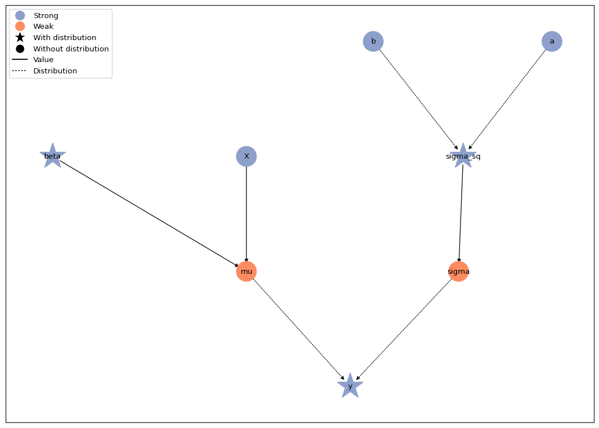
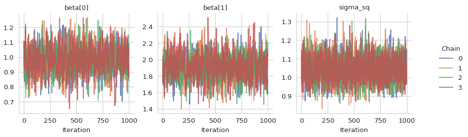

# Gibbs Sampling


This tutorial extends the [linear regression
tutorial](01a-lin-reg.md#linear-regression). Here, we show how to sample
model parameters using a Gibbs kernel.

As this tutorial is a continuation of the previous tutorials, we will
use the same model and data assumed there.

## Data and imports

``` python
import jax
import jax.numpy as jnp
import numpy as np

# We use distributions and bijectors from tensorflow probability
import tensorflow_probability.substrates.jax.distributions as tfd
import tensorflow_probability.substrates.jax.bijectors as tfb

import liesel.goose as gs
import liesel.model as lsl

import matplotlib.pyplot as plt
```

``` python
# Generate data
rng = np.random.default_rng(42)

# sample size and true parameters
n = 500
true_beta = np.array([1.0, 2.0])
true_sigma = 1.0

# data-generating process
x0 = rng.uniform(size=n)
X_mat = np.column_stack([np.ones(n), x0])
eps = rng.normal(scale=true_sigma, size=n)
y_vec = X_mat @ true_beta + eps

# define beta
beta_prior = lsl.Dist(tfd.Normal, loc=0.0, scale=100.0)

beta = lsl.Var.new_param(value=jnp.array([0.0, 0.0]), dist=beta_prior, name="beta")

# define the variance and the scale
a = lsl.Var.new_param(0.01, name="a")
b = lsl.Var.new_param(0.01, name="b")
sigma_sq_prior = lsl.Dist(tfd.InverseGamma, concentration=a, scale=b)
sigma_sq = lsl.Var.new_param(value=1.0, dist=sigma_sq_prior, name="sigma_sq")

# Define sigma as a transformation of sigma_sq for the likelihood
sigma = lsl.Var.new_calc(jnp.sqrt, sigma_sq, name="sigma")

# calculator-setup
X = lsl.Var.new_obs(X_mat, name="X")
mu = lsl.Var.new_calc(jnp.dot, X, beta, name="mu")

# Build response
y_dist = lsl.Dist(tfd.Normal, loc=mu, scale=sigma)
y = lsl.Var.new_obs(y_vec, dist=y_dist, name="y")

# Plot model
model = lsl.Model([y])
model.plot()
```



## MCMC inference

### Using a Gibbs kernel

This time we want to sample the previously fixed `sigma_sq` with a Gibbs
sampler. Using a Gibbs kernel is a bit more complicated, because Goose
doesn’t automatically derive the full conditional from the model graph.
Hence, the user needs to provide a function to sample from the full
conditional. The function needs to accept a PRNG key and a model state
as arguments, and it needs to return a dictionary with the variable name
as the key and the new variable value as the value. We could also update
multiple parameters with one Gibbs kernel by returning a dictionary with
several entries.

For this normal-inverse-gamma model, the full conditional of $\sigma^2$
is again an inverse-gamma distribution. To retrieve the relevant values
from the `model_state`, we use {meth}`.Model.extract_position`.

``` python
def draw_sigma_sq(prng_key, model_state):
    # extract relevant values from model state
    pos = model.extract_position(
        position_keys=["y", "mu", "sigma_sq", "a", "b"], model_state=model_state
    )
    # calculate relevant intermediate quantities
    n = len(pos["y"])
    resid = pos["y"] - pos["mu"]
    a_gibbs = pos["a"] + n / 2
    b_gibbs = pos["b"] + jnp.sum(resid**2) / 2
    # draw new value from full conditional
    draw = b_gibbs / jax.random.gamma(prng_key, a_gibbs)
    # return key-value pair of variable name and new value
    return {"sigma_sq": draw}
```

The regression coefficients `beta` are still sampled with NUTS. For
`sigma_sq`, we attach an {class}`~.goose.MCMCSpec` with
{meth}`~.goose.GibbsKernel.with_transition_fn`, which turns our custom
transition function into a kernel factory that {class}`.LieselMCMC` can
use. The Gibbs kernel itself does not need adaptation, but the NUTS
kernel for `beta` does, so we still run an adaptation phase before
drawing posterior samples.

``` python
beta.inference = gs.MCMCSpec(gs.NUTSKernel)
sigma_sq.inference = gs.MCMCSpec(gs.GibbsKernel.with_transition_fn(draw_sigma_sq))

results = gs.LieselMCMC(model).run_for_epochs(
    seed=1, num_chains=4, adaptation=1000, posterior=1000
)
```

    liesel.goose.mcmc_spec - WARNING - No inference specification defined for Var(name="b"). If you do not add a kernel for this parameter manually to an EngineBuilder, it will not be sampled.
    liesel.goose.mcmc_spec - WARNING - No inference specification defined for Var(name="a"). If you do not add a kernel for this parameter manually to an EngineBuilder, it will not be sampled.
    liesel.goose.builder - WARNING - No jitter functions provided for position keys 'sigma_sq', 'beta'. The initial values for these keys won't be jittered
    liesel.goose.engine - INFO - Initializing kernels...
    liesel.goose.engine - INFO - Done
    liesel.goose.engine - INFO - Starting epoch: FAST_ADAPTATION, 100 transitions, 25 jitted together

      0%|                                                  | 0/4 [00:00<?, ?chunk/s]
     25%|██████████▌                               | 1/4 [00:03<00:10,  3.49s/chunk]
    100%|██████████████████████████████████████████| 4/4 [00:03<00:00,  1.14chunk/s]
    liesel.goose.engine - WARNING - Errors per chain for kernel_01: 2, 4, 4, 2 / 100 transitions
    liesel.goose.engine - INFO - Finished epoch
    liesel.goose.engine - INFO - Starting epoch: SLOW_ADAPTATION, 25 transitions, 25 jitted together

      0%|                                                  | 0/1 [00:00<?, ?chunk/s]
    100%|████████████████████████████████████████| 1/1 [00:00<00:00, 1007.76chunk/s]
    liesel.goose.engine - WARNING - Errors per chain for kernel_01: 1, 2, 1, 1 / 25 transitions
    liesel.goose.engine - INFO - Finished epoch
    liesel.goose.engine - INFO - Starting epoch: SLOW_ADAPTATION, 50 transitions, 25 jitted together

      0%|                                                  | 0/2 [00:00<?, ?chunk/s]
    100%|████████████████████████████████████████| 2/2 [00:00<00:00, 1002.34chunk/s]
    liesel.goose.engine - WARNING - Errors per chain for kernel_01: 1, 3, 1, 1 / 50 transitions
    liesel.goose.engine - INFO - Finished epoch
    liesel.goose.engine - INFO - Starting epoch: SLOW_ADAPTATION, 100 transitions, 25 jitted together

      0%|                                                  | 0/4 [00:00<?, ?chunk/s]
    100%|████████████████████████████████████████| 4/4 [00:00<00:00, 1659.96chunk/s]
    liesel.goose.engine - WARNING - Errors per chain for kernel_01: 1, 2, 1, 1 / 100 transitions
    liesel.goose.engine - INFO - Finished epoch
    liesel.goose.engine - INFO - Starting epoch: SLOW_ADAPTATION, 525 transitions, 25 jitted together

      0%|                                                 | 0/21 [00:00<?, ?chunk/s]
    100%|███████████████████████████████████████| 21/21 [00:00<00:00, 298.33chunk/s]
    liesel.goose.engine - WARNING - Errors per chain for kernel_01: 4, 3, 2, 3 / 525 transitions
    liesel.goose.engine - INFO - Finished epoch
    liesel.goose.engine - INFO - Starting epoch: FAST_ADAPTATION, 200 transitions, 25 jitted together

      0%|                                                  | 0/8 [00:00<?, ?chunk/s]
    100%|████████████████████████████████████████| 8/8 [00:00<00:00, 1142.08chunk/s]
    liesel.goose.engine - WARNING - Errors per chain for kernel_01: 3, 1, 2, 4 / 200 transitions
    liesel.goose.engine - INFO - Finished epoch
    liesel.goose.engine - INFO - Finished warmup
    liesel.goose.engine - INFO - Starting epoch: POSTERIOR, 1000 transitions, 25 jitted together

      0%|                                                 | 0/40 [00:00<?, ?chunk/s]
     75%|█████████████████████████████▎         | 30/40 [00:00<00:00, 293.62chunk/s]
    100%|███████████████████████████████████████| 40/40 [00:00<00:00, 274.01chunk/s]
    liesel.goose.engine - INFO - Finished epoch

Finally, we can take a look at our results.

``` python
summary = gs.Summary(results)
summary
```

<p>

<strong>Parameter summary:</strong>
</p>

<table border="0" class="dataframe">

<thead>

<tr style="text-align: right;">

<th>

</th>

<th>

</th>

<th>

kernel
</th>

<th>

mean
</th>

<th>

sd
</th>

<th>

q_0.05
</th>

<th>

q_0.5
</th>

<th>

q_0.95
</th>

<th>

sample_size
</th>

<th>

ess_bulk
</th>

<th>

ess_tail
</th>

<th>

rhat
</th>

</tr>

<tr>

<th>

parameter
</th>

<th>

index
</th>

<th>

</th>

<th>

</th>

<th>

</th>

<th>

</th>

<th>

</th>

<th>

</th>

<th>

</th>

<th>

</th>

<th>

</th>

<th>

</th>

</tr>

</thead>

<tbody>

<tr>

<th rowspan="2" valign="top">

beta
</th>

<th>

(0,)
</th>

<td>

kernel_01
</td>

<td>

0.983
</td>

<td>

0.090
</td>

<td>

0.837
</td>

<td>

0.984
</td>

<td>

1.128
</td>

<td>

4000
</td>

<td>

946.958
</td>

<td>

1138.096
</td>

<td>

1.007
</td>

</tr>

<tr>

<th>

(1,)
</th>

<td>

kernel_01
</td>

<td>

1.912
</td>

<td>

0.154
</td>

<td>

1.661
</td>

<td>

1.913
</td>

<td>

2.158
</td>

<td>

4000
</td>

<td>

933.683
</td>

<td>

1052.928
</td>

<td>

1.007
</td>

</tr>

<tr>

<th>

sigma_sq
</th>

<th>

()
</th>

<td>

kernel_00
</td>

<td>

1.043
</td>

<td>

0.066
</td>

<td>

0.939
</td>

<td>

1.040
</td>

<td>

1.154
</td>

<td>

4000
</td>

<td>

4091.178
</td>

<td>

3815.673
</td>

<td>

1.000
</td>

</tr>

</tbody>

</table>

<p>

<strong>Acceptance probabilities:</strong>
</p>

<table border="0" class="dataframe">

<thead>

<tr style="text-align: right;">

<th>

</th>

<th>

</th>

<th>

</th>

<th>

acceptance_probability
</th>

<th>

position_moved
</th>

</tr>

<tr>

<th>

kernel
</th>

<th>

positions
</th>

<th>

phase
</th>

<th>

</th>

<th>

</th>

</tr>

</thead>

<tbody>

<tr>

<th rowspan="2" valign="top">

kernel_00
</th>

<th rowspan="2" valign="top">

sigma_sq
</th>

<th>

posterior
</th>

<td>

1.000
</td>

<td>

1.000
</td>

</tr>

<tr>

<th>

warmup
</th>

<td>

1.000
</td>

<td>

1.000
</td>

</tr>

<tr>

<th rowspan="2" valign="top">

kernel_01
</th>

<th rowspan="2" valign="top">

beta
</th>

<th>

posterior
</th>

<td>

0.885
</td>

<td>

NaN
</td>

</tr>

<tr>

<th>

warmup
</th>

<td>

0.791
</td>

<td>

NaN
</td>

</tr>

</tbody>

</table>

<p>

<strong>Error summary:</strong>
</p>

<table border="0" class="dataframe">

<thead>

<tr style="text-align: right;">

<th>

</th>

<th>

</th>

<th>

</th>

<th>

</th>

<th>

</th>

<th>

count
</th>

<th>

sample_size
</th>

<th>

sample_size_total
</th>

<th>

relative
</th>

</tr>

<tr>

<th>

kernel
</th>

<th>

positions
</th>

<th>

error_code
</th>

<th>

error_msg
</th>

<th>

phase
</th>

<th>

</th>

<th>

</th>

<th>

</th>

<th>

</th>

</tr>

</thead>

<tbody>

<tr>

<th rowspan="2" valign="top">

kernel_01
</th>

<th rowspan="2" valign="top">

beta
</th>

<th rowspan="2" valign="top">

1
</th>

<th rowspan="2" valign="top">

divergent transition
</th>

<th>

warmup
</th>

<td>

50
</td>

<td>

4000
</td>

<td>

4000
</td>

<td>

0.012
</td>

</tr>

<tr>

<th>

posterior
</th>

<td>

0
</td>

<td>

4000
</td>

<td>

4000
</td>

<td>

0.000
</td>

</tr>

</tbody>

</table>

And plot them.

``` python
gs.plot_trace(results)
```


