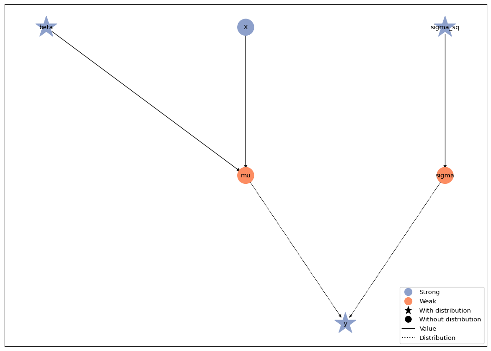
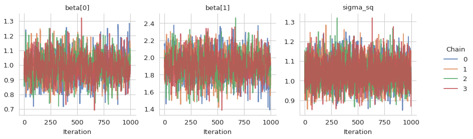

# Combine NUTS and Gibbs updates

<a id="gibbs-sampling"></a>

Sample the same regression posterior as in {doc}`01c-transform`, now
updating the coefficients with NUTS and the variance with an exact Gibbs
step. The prior and likelihood stay the same; only the sampling strategy
changes.

## Build the regression model

This repeats the setup so the tutorial runs on its own.

``` python
import jax
import jax.numpy as jnp
import matplotlib.pyplot as plt
import numpy as np
import pandas as pd
import tensorflow_probability.substrates.jax.bijectors as tfb
import tensorflow_probability.substrates.jax.distributions as tfd

import liesel.goose as gs
import liesel.model as lsl

rng = np.random.default_rng(42)
n = 500
true_beta = np.array([1.0, 2.0])
true_sigma = 1.0
x = rng.uniform(size=n)
X_mat = np.column_stack([np.ones(n), x])
y_vec = X_mat @ true_beta + rng.normal(scale=true_sigma, size=n)

beta = lsl.Var.new_param(
    jnp.zeros(2), lsl.Dist(tfd.Normal, 0.0, 5.0), name="beta"
)
sigma_sq = lsl.Var.new_param(
    1.0, lsl.Dist(tfd.InverseGamma, concentration=3.0, scale=2.0), name="sigma_sq"
)
sigma = lsl.Var.new_calc(jnp.sqrt, sigma_sq, name="sigma")
X = lsl.Var.new_obs(X_mat, name="X")
mu = lsl.Var.new_calc(jnp.dot, X, beta, name="mu")
y = lsl.Var.new_obs(y_vec, lsl.Dist(tfd.Normal, mu, sigma), name="y")
model = lsl.Model([y])
```

The inverse-gamma prior has concentration $a=3$ and scale $b=2$. These
are fixed hyperparameters, not parameters to be sampled.

<a id="using-a-gibbs-kernel"></a>

## Write the full conditional

For coefficients $\boldsymbol\beta$, the residual sum of squares is
$S=\sum_i(y_i-\mathbf{x}_i^\top\boldsymbol\beta)^2$. Because the
coefficient prior is independent of the variance, its full conditional
is

$$
\sigma^2 \mid \boldsymbol\beta,\mathbf y
\sim \operatorname{InverseGamma}\left(a+\frac{n}{2},\ b+\frac{S}{2}\right).
$$

Goose does not derive this distribution. Supply a transition function
that uses the **current** state and draws from it:

``` python
def draw_sigma_sq(prng_key, model_state):
    pos = model.extract_position(["y", "mu"], model_state)
    resid = pos["y"] - pos["mu"]
    conditional = tfd.InverseGamma(
        concentration=3.0 + resid.size / 2,
        scale=2.0 + jnp.sum(resid**2) / 2,
    )
    return {"sigma_sq": conditional.sample(seed=prng_key)}
```

The prior’s fixed hyperparameters may be constants here. The mean must
be read from `model_state` so the update uses the current coefficients,
rather than their initial values. Use the supplied random key,
JAX-compatible calculations, and a position dictionary with the sampled
variable’s name.

## Choose the update order

``` python
model.vars["beta"].inference = gs.MCMCSpec(
    gs.NUTSKernel, order=1, jitter_dist=tfd.Normal(0.0, 0.2)
)
model.vars["sigma_sq"].inference = gs.MCMCSpec(
    gs.GibbsKernel.with_transition_fn(draw_sigma_sq),
    order=2,
    jitter_dist=tfd.LogNormal(0.0, 0.1),
    jitter_method="multiplicative",
)
```

Within each iteration:

| Step | Update                                    | Values used                     |
|------|-------------------------------------------|---------------------------------|
| 1    | NUTS proposes both coefficients together. | The current variance.           |
| 2    | Gibbs draws a new variance.               | The newly updated coefficients. |
| 3    | Goose stores the iteration.               | Both updated blocks.            |

The positive multiplicative jitter keeps the initial variance on its
support. The Gibbs kernel has no tuning, but the NUTS kernel still needs
adaptation.

``` python
model.plot()
```



## Run and inspect the chains

``` python
results = gs.LieselMCMC(model).run_for_epochs(
    seed=1, num_chains=4, adaptation=1000, posterior=1000,
    show_progress=False,
)
summary = gs.Summary(results)
summary.to_dataframe().set_index("var_fqn")[
    ["mean", "sd", "q_0.05", "q_0.95", "mcse_mean"]
].round(3)
```

    liesel.goose.engine - INFO - Initializing kernels...
    liesel.goose.engine - INFO - Done
    liesel.goose.engine - INFO - Finished warmup

<div>
<style scoped>
    .dataframe tbody tr th:only-of-type {
        vertical-align: middle;
    }
&#10;    .dataframe tbody tr th {
        vertical-align: top;
    }
&#10;    .dataframe thead th {
        text-align: right;
    }
</style>

|           | mean  | sd    | q_0.05 | q_0.95 | mcse_mean |
|-----------|-------|-------|--------|--------|-----------|
| var_fqn   |       |       |        |        |           |
| beta\[0\] | 0.986 | 0.091 | 0.837  | 1.133  | 0.003     |
| beta\[1\] | 1.906 | 0.158 | 1.648  | 2.167  | 0.005     |
| sigma_sq  | 1.039 | 0.066 | 0.936  | 1.152  | 0.001     |

</div>

``` python
summary.aggregate_diagnostics().round(3)
```

<div>
<style scoped>
    .dataframe tbody tr th:only-of-type {
        vertical-align: middle;
    }
&#10;    .dataframe tbody tr th {
        vertical-align: top;
    }
&#10;    .dataframe thead th {
        text-align: right;
    }
</style>

|           | ess_bulk | ess_tail | rhat  | aggregated_by         |
|-----------|----------|----------|-------|-----------------------|
| parameter |          |          |       |                       |
| beta      | 1098.965 | 1315.129 | 1.005 | min (ess); max (rhat) |
| sigma_sq  | 3957.058 | 3964.626 | 1.001 | min (ess); max (rhat) |

</div>

``` python
summary.error_df().reset_index()[["error_msg", "phase", "count"]]
```

<div>
<style scoped>
    .dataframe tbody tr th:only-of-type {
        vertical-align: middle;
    }
&#10;    .dataframe tbody tr th {
        vertical-align: top;
    }
&#10;    .dataframe thead th {
        text-align: right;
    }
</style>

|     | error_msg            | phase     | count |
|-----|----------------------|-----------|-------|
| 0   | divergent transition | warmup    | 45    |
| 1   | divergent transition | posterior | 0     |

</div>

``` python
gs.plot_trace(results, params=["beta", "sigma_sq"])
```



Inspect the overlap of the chains together with ESS, R-hat, and reported
errors. An exact Gibbs draw is always accepted, but the sequence of
alternating block updates can still mix slowly. See
{doc}`../../goose-diagnostics`.

## Compare with joint NUTS

Build a fresh model with the same data and priors, then transform its
variance. The repeated setup keeps both sampling strategies independent.

``` python
beta_joint = lsl.Var.new_param(
    jnp.zeros(2), lsl.Dist(tfd.Normal, 0.0, 5.0), name="beta"
)
variance_joint = lsl.Var.new_param(
    1.0, lsl.Dist(tfd.InverseGamma, concentration=3.0, scale=2.0), name="sigma_sq"
)
sigma_joint = lsl.Var.new_calc(jnp.sqrt, variance_joint, name="sigma")
X_joint = lsl.Var.new_obs(X_mat, name="X")
mu_joint = lsl.Var.new_calc(jnp.dot, X_joint, beta_joint, name="mu")
y_joint = lsl.Var.new_obs(
    y_vec, lsl.Dist(tfd.Normal, mu_joint, sigma_joint), name="y"
)
joint = gs.MCMCSpec(
    gs.NUTSKernel, kernel_group="regression", jitter_dist=tfd.Normal(0.0, 0.2)
)
beta_joint.inference = joint
variance_joint.biject(tfb.Exp(), name="log_sigma_sq", inference=joint)
joint_model = lsl.Model([y_joint])
joint_results = gs.LieselMCMC(joint_model).run_for_epochs(
    seed=1, num_chains=4, adaptation=1000, posterior=1000,
    positions_included=["sigma_sq"], show_progress=False,
)
```

    liesel.goose.engine - INFO - Initializing kernels...
    liesel.goose.engine - INFO - Done
    liesel.goose.engine - INFO - Finished warmup

Compare both methods on the original variance scale, including Monte
Carlo precision and diagnostics:

``` python
comparison = pd.concat(
    {
        "NUTS + Gibbs": gs.Summary(results, selected=["beta", "sigma_sq"]).to_dataframe(),
        "Joint NUTS": gs.Summary(
            joint_results, selected=["beta", "sigma_sq"]
        ).to_dataframe(),
    },
    names=["Sampler"],
)
comparison.set_index("var_fqn", append=True)[
    ["mean", "sd", "mcse_mean", "ess_bulk", "rhat"]
].round(3)
```

<div>
<style scoped>
    .dataframe tbody tr th:only-of-type {
        vertical-align: middle;
    }
&#10;    .dataframe tbody tr th {
        vertical-align: top;
    }
&#10;    .dataframe thead th {
        text-align: right;
    }
</style>

|              |          |           | mean  | sd    | mcse_mean | ess_bulk | rhat  |
|--------------|----------|-----------|-------|-------|-----------|----------|-------|
| Sampler      | variable | var_fqn   |       |       |           |          |       |
| NUTS + Gibbs | beta     | beta\[0\] | 0.986 | 0.091 | 0.003     | 1098.965 | 1.005 |
|              |          | beta\[1\] | 1.906 | 0.158 | 0.005     | 1120.864 | 1.004 |
|              | sigma_sq | sigma_sq  | 1.039 | 0.066 | 0.001     | 3957.058 | 1.001 |
| Joint NUTS   | beta     | beta\[0\] | 0.988 | 0.092 | 0.002     | 1682.258 | 1.004 |
|              |          | beta\[1\] | 1.903 | 0.159 | 0.004     | 1741.269 | 1.004 |
|              | sigma_sq | sigma_sq  | 1.041 | 0.065 | 0.001     | 2308.120 | 1.001 |

</div>

The posterior means agree within a few thousandths in this run. Gibbs
gives more effective draws for the variance here, while joint NUTS gives
more for the coefficients. Both runs have R-hat below 1.01 for these
quantities. This comparison uses two actual runs, not stored reference
values. It does not establish a universally faster strategy: the value
of blocking depends on the posterior and the cost of each update.
Inspect errors for the comparison run too:

``` python
gs.Summary(joint_results).error_df().reset_index()[["error_msg", "phase", "count"]]
```

<div>
<style scoped>
    .dataframe tbody tr th:only-of-type {
        vertical-align: middle;
    }
&#10;    .dataframe tbody tr th {
        vertical-align: top;
    }
&#10;    .dataframe thead th {
        text-align: right;
    }
</style>

|     | error_msg            | phase     | count |
|-----|----------------------|-----------|-------|
| 0   | divergent transition | warmup    | 46    |
| 1   | divergent transition | posterior | 0     |

</div>

Next, {doc}`choose other kernels and blocks <../../goose-kernels>` or
{doc}`supply a custom Metropolis-Hastings proposal <08-custom-kernel>`.
