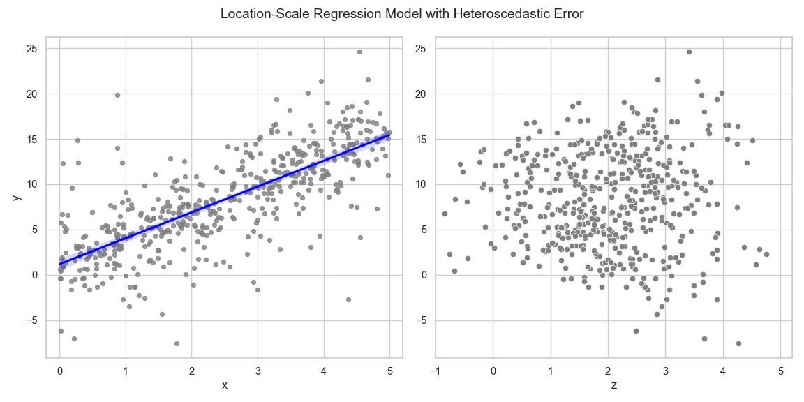
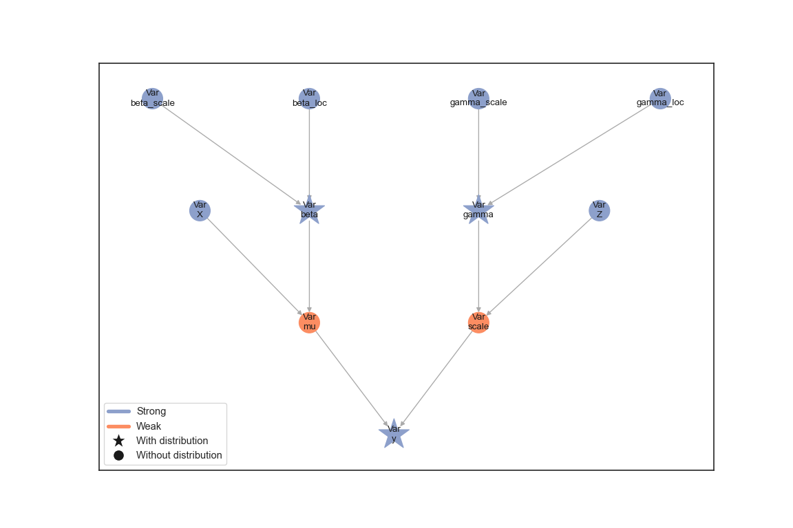
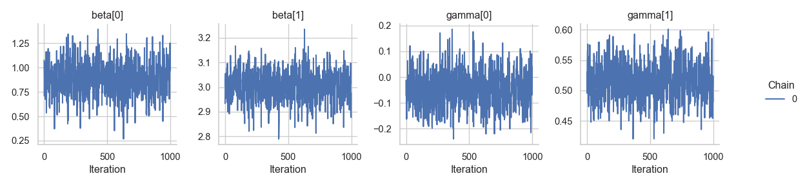

# Location-scale regression

This tutorial implements a Bayesian location-scale regression model
within the Liesel framework. In contrast to the standard linear model
with constant variance, the location-scale model allows for
heteroscedasticity such that both the mean of the response variable as
well as its variance depend on (possibly) different covariates.

This tutorial assumes a linear relationship between the expected value
of the response and the regressors, whereas a logarithmic link is chosen
for the standard deviation. More specifically, we choose the model

$$
\begin{aligned}
y_i \sim \mathcal{N}_{} \left( \mathbf{x}_i^T \boldsymbol{\beta}, \exp \left( \mathbf{ z}_i^T \boldsymbol{\gamma} \right)^2 \right)
\end{aligned}
$$

in which the single observation are conditionally independent.

From the equation we see that *location* covariates are collected in the
design matrix $\mathbf{X}$ and *scale* covariates are contained in the
design matrix $\mathbf{ Z}$. Both matrices can, but generally do not
have to, share common regressors. We refer to $\boldsymbol{\beta}$ as
location parameter and to $\boldsymbol{\gamma}$ as scale parameter.

In this notebook, both design matrices only contain one intercept and
one regressor column. However, the model design naturally generalizes to
any (reasonable) number of covariates.

``` python
import jax
import jax.numpy as jnp
import liesel.goose as gs
import liesel.model as lsl
import matplotlib.pyplot as plt
import seaborn as sns
import tensorflow_probability.substrates.jax.distributions as tfd

sns.set_theme(style="whitegrid")
```

First lets generate the data according to the model

``` python
key = jax.random.PRNGKey(13)
```

``` python
n = 500

key, key_X, key_Z = jax.random.split(key, 3)

true_beta = jnp.array([1.0, 3.0])
true_gamma = jnp.array([0.0, 0.5])

X_mat = jnp.column_stack([jnp.ones(n), tfd.Uniform(low=0., high=5.).sample(n, seed=key_X)])
Z_mat = jnp.column_stack([jnp.ones(n), tfd.Normal(loc=2., scale=1.).sample(n, seed=key_Z)])

y_vec = jnp.zeros(n)
key_y = jax.random.split(key, n)

y_vec = jax.vmap(
    lambda x, beta, z, gamma, key: tfd.Normal(loc=x @ beta, scale=jnp.exp(z @ gamma)).sample(seed=key),
    (0, None, 0, None, 0))(X_mat, true_beta, Z_mat, true_gamma, key_y)
```

The simulated data displays a linear relationship between the response
$\mathbf{y}$ and the covariate $\mathbf{x}$. The slope of the estimated
regression line is close to the true $\beta_1 = 3$. The right plot shows
the relationship between $\mathbf{y}$ and the scale covariate vector
$\mathbf{z}$. Larger values of $\mathbf{ z}$ lead to a larger variance
of the response.

``` python
fig, (ax1, ax2) = plt.subplots(nrows=1, ncols=2, figsize=(12, 6))
sns.regplot(
    x=X_mat[:, 1],
    y=y_vec,
    fit_reg=True,
    scatter_kws=dict(color="grey", s=20),
    line_kws=dict(color="blue"),
    ax=ax1,
).set(xlabel="x", ylabel="y", xlim=[-0.2, 5.2])

sns.scatterplot(
    x=Z_mat[:, 1],
    y=y_vec,
    color="grey",
    s=40,
    ax=ax2,
).set(xlabel="z", xlim=[-1, 5.2])

fig.suptitle("Location-Scale Regression Model with Heteroscedastic Error")
fig.tight_layout()
plt.show()
```



Since positivity of the variance is ensured by the exponential function,
the linear part $\mathbf{z}_i^T \boldsymbol{\gamma}$ is not restricted
to the positive real line. Hence, setting a normal prior distribution
for $\gamma$ is feasible, leading to an almost symmetric specification
of the location and scale parts of the model. The variables `beta` and
`gamma` are initialized with values far away from zero to support a
stable sampling process:

``` python
beta_loc = lsl.Var(0.0, name="beta_loc")
beta_scale = lsl.Var(100.0, name="beta_scale")

dist_beta = lsl.Dist(
    distribution=tfd.Normal, loc=beta_loc, scale=beta_scale
)
dist_beta = lsl.Dist(tfd.Normal, loc=beta_loc, scale=beta_scale)

beta = lsl.Param(
    value=jnp.array([10., 10.]), distribution=dist_beta, name="beta"
)
```

``` python
gamma_loc = lsl.Var(0.0, name="gamma_loc")
gamma_scale = lsl.Var(3.0, name="gamma_scale")

dist_gamma = lsl.Dist(
    distribution=tfd.Normal, loc=gamma_loc, scale=gamma_scale
)
gamma = lsl.Param(
    value=jnp.array([5.0, 5.0]), distribution=dist_gamma, name="gamma"
)
```

The additional complexity of the location-scale model compared to the
standard linear model is handled in the next step. Since `gamma` takes
values on the whole real line, but the response variable `y` expects a
positive scale input, we need to apply the exponential function to the
linear predictor to ensure positivity.

``` python
X = lsl.Obs(value=X_mat, name="X")
Z = lsl.Obs(value=Z_mat, name="Z")

mu = lsl.Var(lsl.Calc(lambda X, beta: X @ beta, X, beta), name="mu")
scale = lsl.Var(lsl.Calc(lambda Z, gamma: jnp.exp(Z @ gamma), Z, gamma), name="scale")

dist_y = lsl.Dist(distribution=tfd.Normal, loc=mu, scale=scale)
y = lsl.Obs(value=y_vec, distribution=dist_y, name="y")
```

We can now combine the nodes in a model and visualize it

``` python
sns.set_theme(style="white")

gb = lsl.GraphBuilder()
gb.add(y)
```

    GraphBuilder<0 nodes, 1 vars>

``` python
model = gb.build_model() # builds the model from the graph (PGMs)

lsl.plot_vars(model=model, width=12, height=8)
```



We choose the No U-Turn sampler for generating posterior samples.
Therefore the location and scale parameters can be drawn by separate
NUTS kernels, or, if all remaining inputs to the kernel coincide, by one
common kernel. The latter option might lead to better estimation results
but lacks the flexibility to e.g. choose different step sizes during the
sampling process.

However, we will just fuse everything into one kernel do not use any
specific arguments and hope that the default warmup scheme (similar to
the warmup used in STAN) will do the trick.

``` python
builder = gs.EngineBuilder(seed=73, num_chains=4)

# connects the engine with the model
builder.set_model(lsl.GooseModel(model))

# we use the same initial values for all chains
builder.set_initial_values(model.state)

# add the kernel
builder.add_kernel(gs.NUTSKernel(["beta", "gamma"]))

# set number of iterations in warmup and posterior
builder.set_duration(warmup_duration=1500, posterior_duration=1000, term_duration=500)

# create the engine
engine = builder.build()

# generate samples
engine.sample_all_epochs()
```

    liesel.goose.engine - INFO - Starting epoch: FAST_ADAPTATION, 75 transitions, 25 jitted together
    liesel.goose.engine - WARNING - Errors per chain for kernel_00: 4, 9, 7, 9 / 75 transitions
    liesel.goose.engine - INFO - Finished epoch
    liesel.goose.engine - INFO - Starting epoch: SLOW_ADAPTATION, 25 transitions, 25 jitted together
    liesel.goose.engine - WARNING - Errors per chain for kernel_00: 3, 1, 1, 1 / 25 transitions
    liesel.goose.engine - INFO - Finished epoch
    liesel.goose.engine - INFO - Starting epoch: SLOW_ADAPTATION, 50 transitions, 25 jitted together
    liesel.goose.engine - WARNING - Errors per chain for kernel_00: 1, 1, 1, 1 / 50 transitions
    liesel.goose.engine - INFO - Finished epoch
    liesel.goose.engine - INFO - Starting epoch: SLOW_ADAPTATION, 100 transitions, 25 jitted together
    liesel.goose.engine - WARNING - Errors per chain for kernel_00: 1, 3, 0, 2 / 100 transitions
    liesel.goose.engine - INFO - Finished epoch
    liesel.goose.engine - INFO - Starting epoch: SLOW_ADAPTATION, 200 transitions, 25 jitted together
    liesel.goose.engine - WARNING - Errors per chain for kernel_00: 5, 3, 2, 4 / 200 transitions
    liesel.goose.engine - INFO - Finished epoch
    liesel.goose.engine - INFO - Starting epoch: SLOW_ADAPTATION, 550 transitions, 25 jitted together
    liesel.goose.engine - WARNING - Errors per chain for kernel_00: 6, 1, 3, 3 / 550 transitions
    liesel.goose.engine - INFO - Finished epoch
    liesel.goose.engine - INFO - Starting epoch: FAST_ADAPTATION, 500 transitions, 25 jitted together
    liesel.goose.engine - WARNING - Errors per chain for kernel_00: 4, 4, 9, 6 / 500 transitions
    liesel.goose.engine - INFO - Finished epoch
    liesel.goose.engine - INFO - Finished warmup
    liesel.goose.engine - INFO - Starting epoch: POSTERIOR, 1000 transitions, 25 jitted together
    liesel.goose.engine - INFO - Finished epoch

Now that we have 1000 posterior samples per chain, we can check the
results. Starting with the trace plots just using one chain.

``` python
results = engine.get_results()
g = gs.plot_trace(results, chain_indices=0, ncol=4)
```


Looks decent although we can see some correlation in the tracplots.
Let’s check at the combined summary:

``` python
gs.summary_m.Summary(results, per_chain=False)
```

<div class="cell-output-display">

<p><strong>Parameter summary:</strong></p>
<table border="1" class="dataframe">
  <thead>
    <tr style="text-align: right;">
      <th></th>
      <th></th>
      <th>kernel</th>
      <th>mean</th>
      <th>sd</th>
      <th>q_0.05</th>
      <th>q_0.5</th>
      <th>q_0.95</th>
      <th>sample_size</th>
      <th>ess_bulk</th>
      <th>ess_tail</th>
      <th>rhat</th>
    </tr>
    <tr>
      <th>parameter</th>
      <th>index</th>
      <th></th>
      <th></th>
      <th></th>
      <th></th>
      <th></th>
      <th></th>
      <th></th>
      <th></th>
      <th></th>
      <th></th>
    </tr>
  </thead>
  <tbody>
    <tr>
      <th rowspan="2" valign="top">beta</th>
      <th>(0,)</th>
      <td>kernel_00</td>
      <td>0.880827</td>
      <td>0.181844</td>
      <td>0.586429</td>
      <td>0.879604</td>
      <td>1.186712</td>
      <td>4000</td>
      <td>1458.215371</td>
      <td>1427.327347</td>
      <td>1.001138</td>
    </tr>
    <tr>
      <th>(1,)</th>
      <td>kernel_00</td>
      <td>3.001686</td>
      <td>0.063852</td>
      <td>2.896273</td>
      <td>3.002595</td>
      <td>3.107005</td>
      <td>4000</td>
      <td>1566.206586</td>
      <td>1619.828620</td>
      <td>1.001328</td>
    </tr>
    <tr>
      <th rowspan="2" valign="top">gamma</th>
      <th>(0,)</th>
      <td>kernel_00</td>
      <td>-0.046905</td>
      <td>0.070704</td>
      <td>-0.159413</td>
      <td>-0.047429</td>
      <td>0.069147</td>
      <td>4000</td>
      <td>1772.183521</td>
      <td>1827.114792</td>
      <td>1.002009</td>
    </tr>
    <tr>
      <th>(1,)</th>
      <td>kernel_00</td>
      <td>0.516919</td>
      <td>0.031528</td>
      <td>0.464696</td>
      <td>0.517133</td>
      <td>0.566490</td>
      <td>4000</td>
      <td>1939.874645</td>
      <td>1900.458898</td>
      <td>1.000565</td>
    </tr>
  </tbody>
</table>
<p><strong>Error summary:</strong></p>
<table border="1" class="dataframe">
  <thead>
    <tr style="text-align: right;">
      <th></th>
      <th></th>
      <th></th>
      <th></th>
      <th>count</th>
      <th>relative</th>
    </tr>
    <tr>
      <th>kernel</th>
      <th>error_code</th>
      <th>error_msg</th>
      <th>phase</th>
      <th></th>
      <th></th>
    </tr>
  </thead>
  <tbody>
    <tr>
      <th rowspan="2" valign="top">kernel_00</th>
      <th rowspan="2" valign="top">1</th>
      <th rowspan="2" valign="top">divergent transition</th>
      <th>warmup</th>
      <td>95</td>
      <td>0.015833</td>
    </tr>
    <tr>
      <th>posterior</th>
      <td>0</td>
      <td>0.000000</td>
    </tr>
  </tbody>
</table>

</div>

Maybe a longer warm-up would give us better samples.

``` python
builder = gs.EngineBuilder(seed=3, num_chains=4)

# connects the engine with the model
builder.set_model(lsl.GooseModel(model))

# we use the same initial values for all chains
builder.set_initial_values(model.state)

# add the kernel
builder.add_kernel(gs.NUTSKernel(["beta", "gamma"]))

# set number of iterations in warmup and posterior
builder.set_duration(warmup_duration=4000, posterior_duration=1000, term_duration=1000)

# create the engine
engine = builder.build()

# generate samples
engine.sample_all_epochs()
```

    liesel.goose.engine - INFO - Starting epoch: FAST_ADAPTATION, 75 transitions, 25 jitted together
    liesel.goose.engine - WARNING - Errors per chain for kernel_00: 7, 8, 8, 11 / 75 transitions
    liesel.goose.engine - INFO - Finished epoch
    liesel.goose.engine - INFO - Starting epoch: SLOW_ADAPTATION, 25 transitions, 25 jitted together
    liesel.goose.engine - WARNING - Errors per chain for kernel_00: 2, 2, 2, 1 / 25 transitions
    liesel.goose.engine - INFO - Finished epoch
    liesel.goose.engine - INFO - Starting epoch: SLOW_ADAPTATION, 50 transitions, 25 jitted together
    liesel.goose.engine - WARNING - Errors per chain for kernel_00: 2, 2, 2, 1 / 50 transitions
    liesel.goose.engine - INFO - Finished epoch
    liesel.goose.engine - INFO - Starting epoch: SLOW_ADAPTATION, 100 transitions, 25 jitted together
    liesel.goose.engine - WARNING - Errors per chain for kernel_00: 1, 3, 6, 1 / 100 transitions
    liesel.goose.engine - INFO - Finished epoch
    liesel.goose.engine - INFO - Starting epoch: SLOW_ADAPTATION, 200 transitions, 25 jitted together
    liesel.goose.engine - WARNING - Errors per chain for kernel_00: 5, 5, 4, 1 / 200 transitions
    liesel.goose.engine - INFO - Finished epoch
    liesel.goose.engine - INFO - Starting epoch: SLOW_ADAPTATION, 400 transitions, 25 jitted together
    liesel.goose.engine - WARNING - Errors per chain for kernel_00: 5, 6, 2, 7 / 400 transitions
    liesel.goose.engine - INFO - Finished epoch
    liesel.goose.engine - INFO - Starting epoch: SLOW_ADAPTATION, 2150 transitions, 25 jitted together
    liesel.goose.engine - WARNING - Errors per chain for kernel_00: 6, 6, 5, 3 / 2150 transitions
    liesel.goose.engine - INFO - Finished epoch
    liesel.goose.engine - INFO - Starting epoch: FAST_ADAPTATION, 1000 transitions, 25 jitted together
    liesel.goose.engine - WARNING - Errors per chain for kernel_00: 4, 4, 5, 4 / 1000 transitions
    liesel.goose.engine - INFO - Finished epoch
    liesel.goose.engine - INFO - Finished warmup
    liesel.goose.engine - INFO - Starting epoch: POSTERIOR, 1000 transitions, 25 jitted together
    liesel.goose.engine - INFO - Finished epoch

``` python
results = engine.get_results()
g = gs.plot_trace(results, chain_indices=0, ncol=4)
```



``` python
gs.summary_m.Summary(results, per_chain=False)
```

<div class="cell-output-display">

<p><strong>Parameter summary:</strong></p>
<table border="1" class="dataframe">
  <thead>
    <tr style="text-align: right;">
      <th></th>
      <th></th>
      <th>kernel</th>
      <th>mean</th>
      <th>sd</th>
      <th>q_0.05</th>
      <th>q_0.5</th>
      <th>q_0.95</th>
      <th>sample_size</th>
      <th>ess_bulk</th>
      <th>ess_tail</th>
      <th>rhat</th>
    </tr>
    <tr>
      <th>parameter</th>
      <th>index</th>
      <th></th>
      <th></th>
      <th></th>
      <th></th>
      <th></th>
      <th></th>
      <th></th>
      <th></th>
      <th></th>
      <th></th>
    </tr>
  </thead>
  <tbody>
    <tr>
      <th rowspan="2" valign="top">beta</th>
      <th>(0,)</th>
      <td>kernel_00</td>
      <td>0.881393</td>
      <td>0.172589</td>
      <td>0.601376</td>
      <td>0.883111</td>
      <td>1.171452</td>
      <td>4000</td>
      <td>2003.047033</td>
      <td>1879.327013</td>
      <td>1.002681</td>
    </tr>
    <tr>
      <th>(1,)</th>
      <td>kernel_00</td>
      <td>3.001631</td>
      <td>0.061357</td>
      <td>2.898357</td>
      <td>3.002792</td>
      <td>3.099864</td>
      <td>4000</td>
      <td>2010.142089</td>
      <td>2067.774295</td>
      <td>1.003066</td>
    </tr>
    <tr>
      <th rowspan="2" valign="top">gamma</th>
      <th>(0,)</th>
      <td>kernel_00</td>
      <td>-0.042988</td>
      <td>0.071926</td>
      <td>-0.160567</td>
      <td>-0.041593</td>
      <td>0.074112</td>
      <td>4000</td>
      <td>1759.715287</td>
      <td>1818.225243</td>
      <td>1.001614</td>
    </tr>
    <tr>
      <th>(1,)</th>
      <td>kernel_00</td>
      <td>0.515210</td>
      <td>0.031500</td>
      <td>0.464253</td>
      <td>0.515299</td>
      <td>0.567202</td>
      <td>4000</td>
      <td>1733.247684</td>
      <td>1788.459497</td>
      <td>1.001245</td>
    </tr>
  </tbody>
</table>
<p><strong>Error summary:</strong></p>
<table border="1" class="dataframe">
  <thead>
    <tr style="text-align: right;">
      <th></th>
      <th></th>
      <th></th>
      <th></th>
      <th>count</th>
      <th>relative</th>
    </tr>
    <tr>
      <th>kernel</th>
      <th>error_code</th>
      <th>error_msg</th>
      <th>phase</th>
      <th></th>
      <th></th>
    </tr>
  </thead>
  <tbody>
    <tr>
      <th rowspan="2" valign="top">kernel_00</th>
      <th rowspan="2" valign="top">1</th>
      <th rowspan="2" valign="top">divergent transition</th>
      <th>warmup</th>
      <td>131</td>
      <td>0.008188</td>
    </tr>
    <tr>
      <th>posterior</th>
      <td>0</td>
      <td>0.000000</td>
    </tr>
  </tbody>
</table>

</div>

The trace plots for $\boldsymbol{\gamma}$ improved but those for
$\boldsymbol{\beta}$ still show some corelation.
