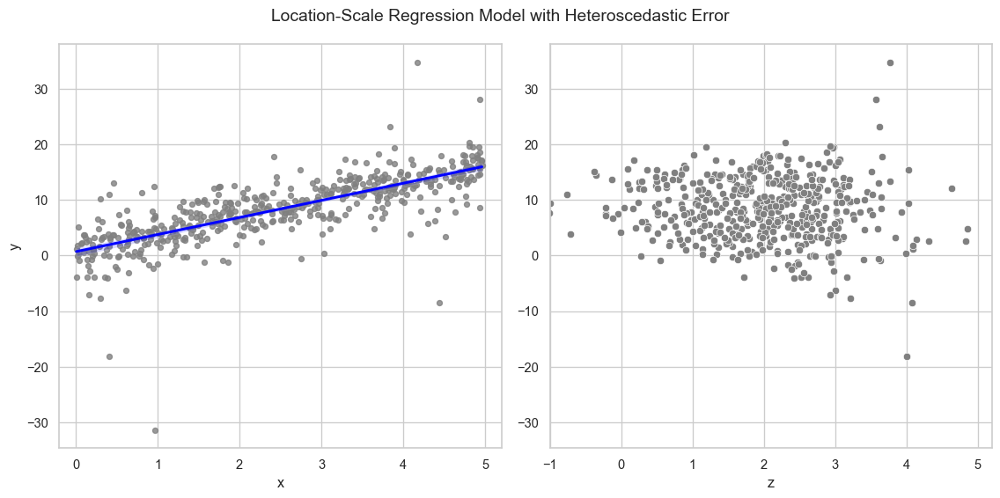
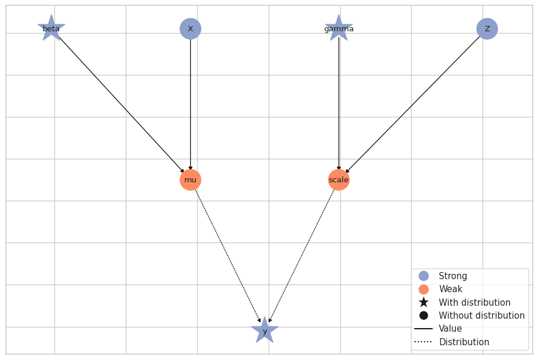
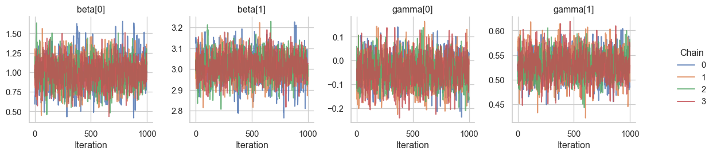

# Location-scale regression


This tutorial implements a Bayesian location-scale regression model
within the Liesel framework. In contrast to the standard linear model
with constant variance, the location-scale model allows for
heteroscedasticity by letting both the mean and the scale of the
response distribution depend on covariates.

This tutorial assumes a linear relationship between the expected value
of the response and the regressors, whereas a logarithmic link is chosen
for the standard deviation. More specifically, we choose the model

$$\begin{aligned}
y_i \sim \mathcal{N}_{} \left( \mathbf{x}_i^T \boldsymbol{\beta}, \exp \left( \mathbf{ z}_i^T \boldsymbol{\gamma} \right)^2 \right)
\end{aligned}$$
in which the observations are conditionally independent.

From the equation we see that *location* covariates are collected in the
design matrix $\mathbf{X}$ and *scale* covariates are contained in the
design matrix $\mathbf{Z}$. Both matrices can, but generally do not have
to, share common regressors. We refer to $\boldsymbol{\beta}$ as the
location parameter vector and to $\boldsymbol{\gamma}$ as the scale
parameter vector.

In this notebook, both design matrices only contain one intercept and
one regressor column. However, the model design naturally generalizes to
any (reasonable) number of covariates.

``` python
import jax
import jax.numpy as jnp
import tensorflow_probability.substrates.jax.distributions as tfd

import matplotlib.pyplot as plt
import seaborn as sns

import liesel.goose as gs
import liesel.model as lsl

sns.set_theme(style="whitegrid")
```

First let’s generate the data according to the model.

``` python
key = jax.random.PRNGKey(13)
n = 500

key, key_X, key_Z, key_y = jax.random.split(key, 4)

true_beta = jnp.array([1.0, 3.0])
true_gamma = jnp.array([0.0, 0.5])

X_mat = jnp.column_stack([
    jnp.ones(n),
    tfd.Uniform(low=0.0, high=5.0).sample(n, seed=key_X),
])
Z_mat = jnp.column_stack([
    jnp.ones(n),
    tfd.Normal(loc=2.0, scale=1.0).sample(n, seed=key_Z),
])

true_mean = X_mat @ true_beta
true_scale = jnp.exp(Z_mat @ true_gamma)
y_vec = tfd.Normal(loc=true_mean, scale=true_scale).sample(seed=key_y)
```

The simulated data displays a linear relationship between the response
$\mathbf{y}$ and the covariate $\mathbf{x}$. The slope of the estimated
regression line is close to the true $\beta_1 = 3$. The right plot shows
the relationship between $\mathbf{y}$ and the scale covariate vector
$\mathbf{z}$. Larger values of $\mathbf{ z}$ lead to a larger variance
of the response.

``` python
fig, (ax1, ax2) = plt.subplots(nrows=1, ncols=2, figsize=(12, 6))
sns.regplot(
    x=X_mat[:, 1],
    y=y_vec,
    fit_reg=True,
    scatter_kws=dict(color="grey", s=20),
    line_kws=dict(color="blue"),
    ax=ax1,
).set(xlabel="x", ylabel="y", xlim=[-0.2, 5.2])

sns.scatterplot(
    x=Z_mat[:, 1],
    y=y_vec,
    color="grey",
    s=40,
    ax=ax2,
).set(xlabel="z", xlim=[-1, 5.2])

fig.suptitle("Location-Scale Regression Model with Heteroscedastic Error")
fig.tight_layout()
plt.show()
```



Since positivity of the scale is ensured by the exponential function,
the linear part $\mathbf{z}_i^T \boldsymbol{\gamma}$ is not restricted
to the positive real line. Hence, setting a normal prior distribution
for $\gamma$ is feasible, leading to an almost symmetric specification
of the location and scale parts of the model. The variables `beta` and
`gamma` are initialized as parameter variables with weakly informative
normal priors. We also attach {class}`~.goose.MCMCSpec` objects that
tell {class}`.LieselMCMC` to sample each parameter block with a NUTS
kernel:

``` python
dist_beta = lsl.Dist(tfd.Normal, loc=0.0, scale=100.0)
beta = lsl.Var.new_param(
    jnp.array([10.0, 10.0]),
    dist_beta,
    name="beta",
    inference=gs.MCMCSpec(gs.NUTSKernel),
)

dist_gamma = lsl.Dist(tfd.Normal, loc=0.0, scale=100.0)
gamma = lsl.Var.new_param(
    jnp.array([5.0, 5.0]),
    dist_gamma,
    name="gamma",
    inference=gs.MCMCSpec(gs.NUTSKernel),
)
```

The additional complexity of the location-scale model compared to the
standard linear model is handled in the next step. Since `gamma` takes
values on the whole real line, but the response variable `y` expects a
positive scale input, we apply the exponential function to the scale
predictor. The mean predictor `mu` and the positive `scale` are then
passed to the normal likelihood of `y`.

``` python
X = lsl.Var.new_obs(X_mat, name="X")
Z = lsl.Var.new_obs(Z_mat, name="Z")

mu = lsl.Var(lsl.Calc(jnp.dot, X, beta), name="mu")

log_scale = lsl.Calc(jnp.dot, Z, gamma)
scale = lsl.Var(lsl.Calc(jnp.exp, log_scale), name="scale")

dist_y = lsl.Dist(tfd.Normal, loc=mu, scale=scale)
y = lsl.Var.new_obs(y_vec, dist_y, name="y")
```

We can now initialize the model from the response variable and visualize
the resulting graph. All other variables are collected automatically
because they are inputs to `y`, directly or indirectly.

``` python
model = lsl.Model(y)

model.plot(width=12, height=8)
```



We generate posterior samples with the No-U-Turn sampler. The sampler
setup is taken from the inference specifications on `beta` and `gamma`,
so {class}`.LieselMCMC` can construct the two NUTS kernels directly from
the model. We run 1000 adaptation iterations and then draw 1000
posterior samples per chain.

``` python
results = gs.LieselMCMC(model).run_for_epochs(
    seed=1, num_chains=4, adaptation=1000, posterior=1000
)
```

    liesel.goose.builder - WARNING - No jitter functions provided for position keys 'beta', 'gamma'. The initial values for these keys won't be jittered
    liesel.goose.engine - INFO - Initializing kernels...
    liesel.goose.engine - INFO - Done
    liesel.goose.engine - INFO - Starting epoch: FAST_ADAPTATION, 100 transitions, 25 jitted together

      0%|                                                  | 0/4 [00:00<?, ?chunk/s]
     25%|██████████▌                               | 1/4 [00:04<00:14,  4.92s/chunk]
    100%|██████████████████████████████████████████| 4/4 [00:04<00:00,  1.23s/chunk]
    liesel.goose.engine - WARNING - Errors per chain for kernel_00: 5, 5, 3, 4 / 100 transitions
    liesel.goose.engine - WARNING - Errors per chain for kernel_01: 5, 6, 5, 7 / 100 transitions
    liesel.goose.engine - INFO - Finished epoch
    liesel.goose.engine - INFO - Starting epoch: SLOW_ADAPTATION, 25 transitions, 25 jitted together

      0%|                                                  | 0/1 [00:00<?, ?chunk/s]
    100%|█████████████████████████████████████████| 1/1 [00:00<00:00, 614.91chunk/s]
    liesel.goose.engine - WARNING - Errors per chain for kernel_00: 1, 1, 2, 1 / 25 transitions
    liesel.goose.engine - WARNING - Errors per chain for kernel_01: 2, 1, 2, 1 / 25 transitions
    liesel.goose.engine - INFO - Finished epoch
    liesel.goose.engine - INFO - Starting epoch: SLOW_ADAPTATION, 50 transitions, 25 jitted together

      0%|                                                  | 0/2 [00:00<?, ?chunk/s]
    100%|████████████████████████████████████████| 2/2 [00:00<00:00, 1233.62chunk/s]
    liesel.goose.engine - WARNING - Errors per chain for kernel_00: 1, 2, 3, 2 / 50 transitions
    liesel.goose.engine - WARNING - Errors per chain for kernel_01: 2, 3, 1, 2 / 50 transitions
    liesel.goose.engine - INFO - Finished epoch
    liesel.goose.engine - INFO - Starting epoch: SLOW_ADAPTATION, 100 transitions, 25 jitted together

      0%|                                                  | 0/4 [00:00<?, ?chunk/s]
    100%|████████████████████████████████████████| 4/4 [00:00<00:00, 1136.82chunk/s]
    liesel.goose.engine - WARNING - Errors per chain for kernel_00: 2, 2, 0, 1 / 100 transitions
    liesel.goose.engine - WARNING - Errors per chain for kernel_01: 2, 2, 1, 2 / 100 transitions
    liesel.goose.engine - INFO - Finished epoch
    liesel.goose.engine - INFO - Starting epoch: SLOW_ADAPTATION, 525 transitions, 25 jitted together

      0%|                                                 | 0/21 [00:00<?, ?chunk/s]
     76%|█████████████████████████████▋         | 16/21 [00:00<00:00, 148.20chunk/s]
    100%|███████████████████████████████████████| 21/21 [00:00<00:00, 137.08chunk/s]
    liesel.goose.engine - WARNING - Errors per chain for kernel_00: 2, 5, 6, 2 / 525 transitions
    liesel.goose.engine - WARNING - Errors per chain for kernel_01: 4, 5, 3, 3 / 525 transitions
    liesel.goose.engine - INFO - Finished epoch
    liesel.goose.engine - INFO - Starting epoch: FAST_ADAPTATION, 200 transitions, 25 jitted together

      0%|                                                  | 0/8 [00:00<?, ?chunk/s]
    100%|█████████████████████████████████████████| 8/8 [00:00<00:00, 424.61chunk/s]
    liesel.goose.engine - WARNING - Errors per chain for kernel_00: 0, 2, 4, 3 / 200 transitions
    liesel.goose.engine - WARNING - Errors per chain for kernel_01: 3, 6, 4, 1 / 200 transitions
    liesel.goose.engine - INFO - Finished epoch
    liesel.goose.engine - INFO - Finished warmup
    liesel.goose.engine - INFO - Starting epoch: POSTERIOR, 1000 transitions, 25 jitted together

      0%|                                                 | 0/40 [00:00<?, ?chunk/s]
     45%|█████████████████▌                     | 18/40 [00:00<00:00, 174.41chunk/s]
     90%|███████████████████████████████████    | 36/40 [00:00<00:00, 126.30chunk/s]
    100%|███████████████████████████████████████| 40/40 [00:00<00:00, 129.15chunk/s]
    liesel.goose.engine - INFO - Finished epoch

Now that we have 1000 posterior samples per chain, we can check the
results, starting with trace plots for the sampled parameters.

``` python
gs.plot_trace(results, ncol=4)
```


