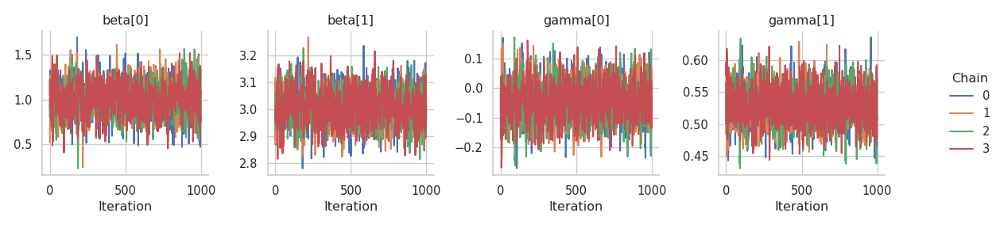

# Location-scale regression

This tutorial implements a Bayesian location-scale regression model
within the Liesel framework. In contrast to the standard linear model
with constant variance, the location-scale model allows for
heteroscedasticity such that both the mean of the response variable as
well as its variance depend on (possibly) different covariates.

This tutorial assumes a linear relationship between the expected value
of the response and the regressors, whereas a logarithmic link is chosen
for the standard deviation. More specifically, we choose the model

$$
\begin{aligned}
y_i \sim \mathcal{N}_{} \left( \mathbf{x}_i^T \boldsymbol{\beta}, \exp \left( \mathbf{ z}_i^T \boldsymbol{\gamma} \right)^2 \right)
\end{aligned}
$$ in which the single observation are conditionally independent.

From the equation we see that *location* covariates are collected in the
design matrix $\mathbf{X}$ and *scale* covariates are contained in the
design matrix $\mathbf{Z}$. Both matrices can, but generally do not have
to, share common regressors. We refer to $\boldsymbol{\beta}$ as
location parameter and to $\boldsymbol{\gamma}$ as scale parameter.

In this notebook, both design matrices only contain one intercept and
one regressor column. However, the model design naturally generalizes to
any (reasonable) number of covariates.

``` python
import jax
import jax.numpy as jnp
import tensorflow_probability.substrates.jax.distributions as tfd

import matplotlib.pyplot as plt
import seaborn as sns

import liesel.goose as gs
import liesel.model as lsl

sns.set_theme(style="whitegrid")
```

First lets generate the data according to the model

``` python
key = jax.random.PRNGKey(13)
n = 500

key, key_X, key_Z, key_y = jax.random.split(key, 4)

true_beta = jnp.array([1.0, 3.0])
true_gamma = jnp.array([0.0, 0.5])

X_mat = jnp.column_stack([jnp.ones(n), tfd.Uniform(low=0., high=5.).sample(n, seed=key_X)])
Z_mat = jnp.column_stack([jnp.ones(n), tfd.Normal(loc=2., scale=1.).sample(n, seed=key_Z)])

true_mean = X_mat @ true_beta
true_scale = jnp.exp(Z_mat @ true_gamma)
y_vec = tfd.Normal(loc=true_mean, scale=true_scale).sample(seed=key_y)
```

The simulated data displays a linear relationship between the response
$\mathbf{y}$ and the covariate $\mathbf{x}$. The slope of the estimated
regression line is close to the true $\beta_1 = 3$. The right plot shows
the relationship between $\mathbf{y}$ and the scale covariate vector
$\mathbf{z}$. Larger values of $\mathbf{ z}$ lead to a larger variance
of the response.

``` python
fig, (ax1, ax2) = plt.subplots(nrows=1, ncols=2, figsize=(12, 6))
sns.regplot(
    x=X_mat[:, 1],
    y=y_vec,
    fit_reg=True,
    scatter_kws=dict(color="grey", s=20),
    line_kws=dict(color="blue"),
    ax=ax1,
).set(xlabel="x", ylabel="y", xlim=[-0.2, 5.2])

sns.scatterplot(
    x=Z_mat[:, 1],
    y=y_vec,
    color="grey",
    s=40,
    ax=ax2,
).set(xlabel="z", xlim=[-1, 5.2])

fig.suptitle("Location-Scale Regression Model with Heteroscedastic Error")
fig.tight_layout()
plt.show()
```


Since positivity of the variance is ensured by the exponential function,
the linear part $\mathbf{z}_i^T \boldsymbol{\gamma}$ is not restricted
to the positive real line. Hence, setting a normal prior distribution
for $\gamma$ is feasible, leading to an almost symmetric specification
of the location and scale parts of the model. The variables `beta` and
`gamma` are initialized with values far away from zero to support a
stable sampling process:

``` python
dist_beta = lsl.Dist(tfd.Normal, loc=0.0, scale=100.0)
beta = lsl.Var.new_param(jnp.array([10., 10.]), dist_beta, name="beta")

dist_gamma = lsl.Dist(tfd.Normal, loc=0.0, scale=100.0)
gamma = lsl.Var.new_param(jnp.array([5., 5.]), dist_gamma, name="gamma")
```

The additional complexity of the location-scale model compared to the
standard linear model is handled in the next step. Since `gamma` takes
values on the whole real line, but the response variable `y` expects a
positive scale input, we need to apply the exponential function to the
linear predictor to ensure positivity.

``` python
X = lsl.Var.new_obs(X_mat, name="X")
Z = lsl.Var.new_obs(Z_mat, name="Z")

mu = lsl.Var(lsl.Calc(jnp.dot, X, beta), name="mu")

log_scale = lsl.Calc(jnp.dot, Z, gamma)
scale = lsl.Var(lsl.Calc(jnp.exp, log_scale), name="scale")

dist_y = lsl.Dist(tfd.Normal, loc=mu, scale=scale)
y = lsl.Var.new_obs(y_vec, dist_y, name="y")
```

We can now combine the nodes in a model and visualize it

``` python
sns.set_theme(style="white")

gb = lsl.GraphBuilder()
gb.add(y)
```

    GraphBuilder(0 nodes, 1 vars)

``` python
model = gb.build_model() # builds the model from the graph (PGMs)

lsl.plot_vars(model=model, width=12, height=8)
```


We choose the No U-Turn sampler for generating posterior samples.
Therefore the location and scale parameters can be drawn by separate
NUTS kernels, or, if all remaining inputs to the kernel coincide, by one
common kernel. The latter option might lead to better estimation results
but lacks the flexibility to e.g. choose different step sizes during the
sampling process.

However, we will just fuse everything into one kernel, do not use any
specific arguments and hope that the default warmup scheme (similar to
the warmup used in STAN) will do the trick.

``` python
builder = gs.EngineBuilder(seed=73, num_chains=4)

builder.set_model(gs.LieselInterface(model))
builder.set_initial_values(model.state)

builder.add_kernel(gs.NUTSKernel(["beta", "gamma"]))
builder.set_duration(warmup_duration=1500, posterior_duration=1000, term_duration=500)

engine = builder.build()
engine.sample_all_epochs()
```


      0%|                                                  | 0/3 [00:00<?, ?chunk/s]
     33%|##############                            | 1/3 [00:04<00:08,  4.36s/chunk]
    100%|##########################################| 3/3 [00:04<00:00,  1.45s/chunk]

      0%|                                                  | 0/1 [00:00<?, ?chunk/s]
    100%|########################################| 1/1 [00:00<00:00, 1137.59chunk/s]

      0%|                                                  | 0/2 [00:00<?, ?chunk/s]
    100%|########################################| 2/2 [00:00<00:00, 1254.47chunk/s]

      0%|                                                  | 0/4 [00:00<?, ?chunk/s]
    100%|########################################| 4/4 [00:00<00:00, 1804.78chunk/s]

      0%|                                                  | 0/8 [00:00<?, ?chunk/s]
    100%|#########################################| 8/8 [00:00<00:00, 346.42chunk/s]

      0%|                                                 | 0/22 [00:00<?, ?chunk/s]
     64%|########################8              | 14/22 [00:00<00:00, 134.81chunk/s]
    100%|#######################################| 22/22 [00:00<00:00, 114.13chunk/s]

      0%|                                                 | 0/20 [00:00<?, ?chunk/s]
     70%|###########################3           | 14/20 [00:00<00:00, 132.76chunk/s]
    100%|#######################################| 20/20 [00:00<00:00, 116.02chunk/s]

      0%|                                                 | 0/40 [00:00<?, ?chunk/s]
     42%|################5                      | 17/40 [00:00<00:00, 161.70chunk/s]
     85%|#################################1     | 34/40 [00:00<00:00, 115.85chunk/s]
    100%|#######################################| 40/40 [00:00<00:00, 116.60chunk/s]

Now that we have 1000 posterior samples per chain, we can check the
results. Starting with the trace plots just using one chain.

``` python
results = engine.get_results()
g = gs.plot_trace(results, ncol=4)
```


