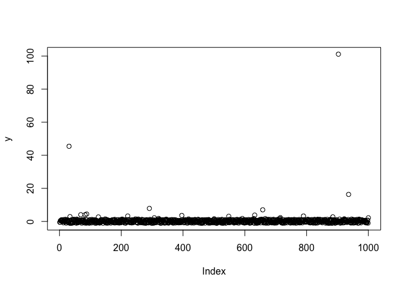
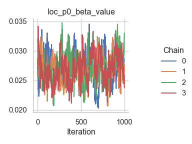
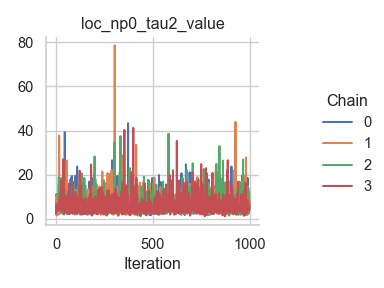
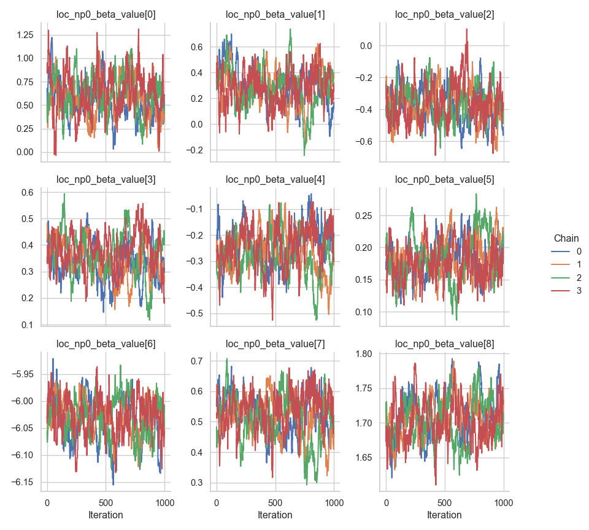
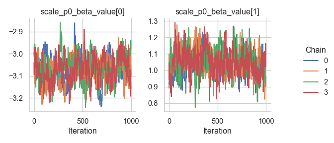
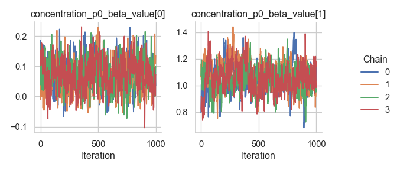
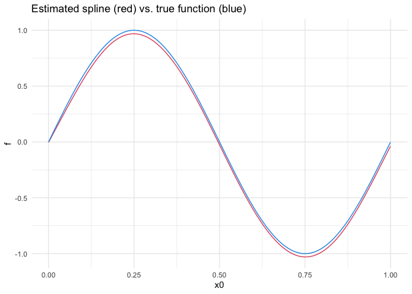

# GEV responses

In this tutorial, we illustrate how to set up a distributional
regression model with the generalized extreme value distribution as a
response distribution. First, we simulate some data in R:

-   The location parameter ($\mu$) is a function of an intercept and a
    non-linear covariate effect.
-   The scale parameter ($\sigma$) is a function of an intercept and a
    linear effect and uses a log-link.
-   The shape or concentration parameter ($\xi$) is a function of an
    intercept and a linear effect.

After simulating the data, we can configure the model with a single call
to the `rliesel::liesel()` function.

``` r
library(rliesel)
```

    Please set your Liesel venv, e.g. with use_liesel_venv()

``` r
library(VGAM)
```

    Lade nötiges Paket: stats4

    Lade nötiges Paket: splines

``` r
set.seed(1337)

n <- 1000

x0 <- runif(n)
x1 <- runif(n)
x2 <- runif(n)

y <- rgev(
  n,
  location = 0 + sin(2 * pi * x0),
  scale = exp(-3 + x1),
  shape = 0.1 + x2
)

plot(y)
```



``` r
model <- liesel(
  response = y,
  distribution = "GeneralizedExtremeValue",
  predictors = list(
    loc = predictor(~ s(x0)),
    scale = predictor(~ x1, inverse_link = "Exp"),
    concentration = predictor(~ x2)
  )
)
```

Now, we can continue in Python and use the `lsl.dist_reg_mcmc()`
function to set up a sampling algorithm with IWLS kernels for the
regression coefficients ($\boldsymbol{\beta}$) and a Gibbs kernel for
the smoothing parameter ($\tau^2$) of the spline. Note that we need to
set $\beta_0$ for $\xi$ to 0.1 manually, because $\xi = 0$ breaks the
sampler.

``` python
import liesel.model as lsl
import jax.numpy as jnp

model = r.model

# concentration == 0.0 seems to break the sampler
model.vars["concentration_p0_beta"].value = jnp.array([0.1, 0.0])

builder = lsl.dist_reg_mcmc(model, seed=42, num_chains=4)
builder.set_duration(warmup_duration=1000, posterior_duration=1000)

engine = builder.build()
engine.sample_all_epochs()
```

    liesel.goose.engine - INFO - Starting epoch: FAST_ADAPTATION, 75 transitions, 25 jitted together
    liesel.goose.engine - WARNING - Errors per chain for kernel_03: 9, 5, 8, 10 / 75 transitions
    liesel.goose.engine - INFO - Finished epoch
    liesel.goose.engine - INFO - Starting epoch: SLOW_ADAPTATION, 25 transitions, 25 jitted together
    liesel.goose.engine - WARNING - Errors per chain for kernel_00: 1, 1, 1, 0 / 25 transitions
    liesel.goose.engine - WARNING - Errors per chain for kernel_02: 1, 1, 1, 1 / 25 transitions
    liesel.goose.engine - WARNING - Errors per chain for kernel_03: 3, 1, 1, 0 / 25 transitions
    liesel.goose.engine - WARNING - Errors per chain for kernel_04: 1, 2, 1, 1 / 25 transitions
    liesel.goose.engine - INFO - Finished epoch
    liesel.goose.engine - INFO - Starting epoch: SLOW_ADAPTATION, 50 transitions, 25 jitted together
    liesel.goose.engine - WARNING - Errors per chain for kernel_00: 1, 1, 2, 0 / 50 transitions
    liesel.goose.engine - WARNING - Errors per chain for kernel_02: 2, 1, 1, 0 / 50 transitions
    liesel.goose.engine - WARNING - Errors per chain for kernel_03: 2, 1, 1, 1 / 50 transitions
    liesel.goose.engine - WARNING - Errors per chain for kernel_04: 1, 2, 2, 2 / 50 transitions
    liesel.goose.engine - INFO - Finished epoch
    liesel.goose.engine - INFO - Starting epoch: SLOW_ADAPTATION, 100 transitions, 25 jitted together
    liesel.goose.engine - WARNING - Errors per chain for kernel_00: 1, 2, 0, 1 / 100 transitions
    liesel.goose.engine - WARNING - Errors per chain for kernel_02: 2, 1, 1, 1 / 100 transitions
    liesel.goose.engine - WARNING - Errors per chain for kernel_03: 2, 3, 4, 2 / 100 transitions
    liesel.goose.engine - WARNING - Errors per chain for kernel_04: 0, 2, 1, 2 / 100 transitions
    liesel.goose.engine - INFO - Finished epoch
    liesel.goose.engine - INFO - Starting epoch: SLOW_ADAPTATION, 200 transitions, 25 jitted together
    liesel.goose.engine - WARNING - Errors per chain for kernel_00: 1, 0, 1, 2 / 200 transitions
    liesel.goose.engine - WARNING - Errors per chain for kernel_02: 0, 1, 1, 2 / 200 transitions
    liesel.goose.engine - WARNING - Errors per chain for kernel_03: 1, 2, 1, 1 / 200 transitions
    liesel.goose.engine - WARNING - Errors per chain for kernel_04: 1, 1, 2, 0 / 200 transitions
    liesel.goose.engine - INFO - Finished epoch
    liesel.goose.engine - INFO - Starting epoch: SLOW_ADAPTATION, 500 transitions, 25 jitted together
    liesel.goose.engine - WARNING - Errors per chain for kernel_00: 2, 1, 1, 2 / 500 transitions
    liesel.goose.engine - WARNING - Errors per chain for kernel_02: 3, 1, 0, 1 / 500 transitions
    liesel.goose.engine - WARNING - Errors per chain for kernel_03: 2, 8, 4, 4 / 500 transitions
    liesel.goose.engine - WARNING - Errors per chain for kernel_04: 1, 1, 1, 1 / 500 transitions
    liesel.goose.engine - INFO - Finished epoch
    liesel.goose.engine - INFO - Starting epoch: FAST_ADAPTATION, 50 transitions, 25 jitted together
    liesel.goose.engine - WARNING - Errors per chain for kernel_00: 1, 2, 2, 0 / 50 transitions
    liesel.goose.engine - WARNING - Errors per chain for kernel_02: 1, 1, 1, 0 / 50 transitions
    liesel.goose.engine - WARNING - Errors per chain for kernel_03: 3, 2, 1, 1 / 50 transitions
    liesel.goose.engine - WARNING - Errors per chain for kernel_04: 2, 1, 1, 0 / 50 transitions
    liesel.goose.engine - INFO - Finished epoch
    liesel.goose.engine - INFO - Finished warmup
    liesel.goose.engine - INFO - Starting epoch: POSTERIOR, 1000 transitions, 25 jitted together
    liesel.goose.engine - WARNING - Errors per chain for kernel_03: 1, 2, 0, 0 / 1000 transitions
    liesel.goose.engine - INFO - Finished epoch

Some tabular summary statistics of the posterior samples:

``` python
import liesel.goose as gs

results = engine.get_results()
gs.Summary(results)
```

<p><strong>Parameter summary:</strong></p>
<table border="0" class="dataframe">
  <thead>
    <tr style="text-align: right;">
      <th></th>
      <th></th>
      <th>kernel</th>
      <th>mean</th>
      <th>sd</th>
      <th>q_0.05</th>
      <th>q_0.5</th>
      <th>q_0.95</th>
      <th>sample_size</th>
      <th>ess_bulk</th>
      <th>ess_tail</th>
      <th>rhat</th>
    </tr>
    <tr>
      <th>parameter</th>
      <th>index</th>
      <th></th>
      <th></th>
      <th></th>
      <th></th>
      <th></th>
      <th></th>
      <th></th>
      <th></th>
      <th></th>
      <th></th>
    </tr>
  </thead>
  <tbody>
    <tr>
      <th rowspan="2" valign="top">concentration_p0_beta_value</th>
      <th>(0,)</th>
      <td>kernel_03</td>
      <td>0.071979</td>
      <td>0.051309</td>
      <td>-0.012369</td>
      <td>0.070278</td>
      <td>0.160412</td>
      <td>4000</td>
      <td>413.494369</td>
      <td>1016.913763</td>
      <td>1.010872</td>
    </tr>
    <tr>
      <th>(1,)</th>
      <td>kernel_03</td>
      <td>1.062648</td>
      <td>0.104276</td>
      <td>0.892764</td>
      <td>1.057525</td>
      <td>1.238397</td>
      <td>4000</td>
      <td>191.908305</td>
      <td>325.530475</td>
      <td>1.025558</td>
    </tr>
    <tr>
      <th rowspan="9" valign="top">loc_np0_beta_value</th>
      <th>(0,)</th>
      <td>kernel_02</td>
      <td>0.589809</td>
      <td>0.199460</td>
      <td>0.270324</td>
      <td>0.584491</td>
      <td>0.924557</td>
      <td>4000</td>
      <td>114.415775</td>
      <td>297.252782</td>
      <td>1.042597</td>
    </tr>
    <tr>
      <th>(1,)</th>
      <td>kernel_02</td>
      <td>0.292094</td>
      <td>0.142684</td>
      <td>0.058731</td>
      <td>0.294800</td>
      <td>0.526360</td>
      <td>4000</td>
      <td>68.804541</td>
      <td>118.014228</td>
      <td>1.027072</td>
    </tr>
    <tr>
      <th>(2,)</th>
      <td>kernel_02</td>
      <td>-0.369753</td>
      <td>0.108283</td>
      <td>-0.538234</td>
      <td>-0.371440</td>
      <td>-0.184035</td>
      <td>4000</td>
      <td>142.018702</td>
      <td>228.585582</td>
      <td>1.020487</td>
    </tr>
    <tr>
      <th>(3,)</th>
      <td>kernel_02</td>
      <td>0.352721</td>
      <td>0.074443</td>
      <td>0.221762</td>
      <td>0.352453</td>
      <td>0.470087</td>
      <td>4000</td>
      <td>50.472711</td>
      <td>133.067574</td>
      <td>1.084638</td>
    </tr>
    <tr>
      <th>(4,)</th>
      <td>kernel_02</td>
      <td>-0.258056</td>
      <td>0.076800</td>
      <td>-0.386842</td>
      <td>-0.255828</td>
      <td>-0.138147</td>
      <td>4000</td>
      <td>45.073350</td>
      <td>175.195327</td>
      <td>1.066049</td>
    </tr>
    <tr>
      <th>(5,)</th>
      <td>kernel_02</td>
      <td>0.181237</td>
      <td>0.029606</td>
      <td>0.134447</td>
      <td>0.179435</td>
      <td>0.234794</td>
      <td>4000</td>
      <td>75.744300</td>
      <td>104.544980</td>
      <td>1.047809</td>
    </tr>
    <tr>
      <th>(6,)</th>
      <td>kernel_02</td>
      <td>-6.031193</td>
      <td>0.035905</td>
      <td>-6.096666</td>
      <td>-6.027754</td>
      <td>-5.978226</td>
      <td>4000</td>
      <td>87.415085</td>
      <td>163.429621</td>
      <td>1.043115</td>
    </tr>
    <tr>
      <th>(7,)</th>
      <td>kernel_02</td>
      <td>0.519240</td>
      <td>0.067104</td>
      <td>0.399927</td>
      <td>0.524076</td>
      <td>0.621463</td>
      <td>4000</td>
      <td>63.253396</td>
      <td>94.503409</td>
      <td>1.058416</td>
    </tr>
    <tr>
      <th>(8,)</th>
      <td>kernel_02</td>
      <td>1.705195</td>
      <td>0.029685</td>
      <td>1.658962</td>
      <td>1.704425</td>
      <td>1.756656</td>
      <td>4000</td>
      <td>80.623575</td>
      <td>197.459709</td>
      <td>1.041782</td>
    </tr>
    <tr>
      <th>loc_np0_tau2_value</th>
      <th>()</th>
      <td>kernel_01</td>
      <td>6.358341</td>
      <td>4.305175</td>
      <td>2.453810</td>
      <td>5.163912</td>
      <td>14.087748</td>
      <td>4000</td>
      <td>3629.212181</td>
      <td>3661.314728</td>
      <td>0.999645</td>
    </tr>
    <tr>
      <th>loc_p0_beta_value</th>
      <th>(0,)</th>
      <td>kernel_00</td>
      <td>0.027111</td>
      <td>0.002358</td>
      <td>0.023388</td>
      <td>0.027007</td>
      <td>0.031136</td>
      <td>4000</td>
      <td>139.402550</td>
      <td>272.721972</td>
      <td>1.017199</td>
    </tr>
    <tr>
      <th rowspan="2" valign="top">scale_p0_beta_value</th>
      <th>(0,)</th>
      <td>kernel_04</td>
      <td>-3.070958</td>
      <td>0.057479</td>
      <td>-3.167684</td>
      <td>-3.069962</td>
      <td>-2.977218</td>
      <td>4000</td>
      <td>134.579632</td>
      <td>307.875235</td>
      <td>1.020881</td>
    </tr>
    <tr>
      <th>(1,)</th>
      <td>kernel_04</td>
      <td>1.050534</td>
      <td>0.074093</td>
      <td>0.927708</td>
      <td>1.049240</td>
      <td>1.176087</td>
      <td>4000</td>
      <td>173.608648</td>
      <td>384.538775</td>
      <td>1.024508</td>
    </tr>
  </tbody>
</table>
<p><strong>Error summary:</strong></p>
<table border="0" class="dataframe">
  <thead>
    <tr style="text-align: right;">
      <th></th>
      <th></th>
      <th></th>
      <th></th>
      <th>count</th>
      <th>relative</th>
    </tr>
    <tr>
      <th>kernel</th>
      <th>error_code</th>
      <th>error_msg</th>
      <th>phase</th>
      <th></th>
      <th></th>
    </tr>
  </thead>
  <tbody>
    <tr>
      <th rowspan="2" valign="top">kernel_00</th>
      <th rowspan="2" valign="top">90</th>
      <th rowspan="2" valign="top">nan acceptance prob</th>
      <th>warmup</th>
      <td>26</td>
      <td>0.00650</td>
    </tr>
    <tr>
      <th>posterior</th>
      <td>0</td>
      <td>0.00000</td>
    </tr>
    <tr>
      <th rowspan="2" valign="top">kernel_02</th>
      <th rowspan="2" valign="top">90</th>
      <th rowspan="2" valign="top">nan acceptance prob</th>
      <th>warmup</th>
      <td>25</td>
      <td>0.00625</td>
    </tr>
    <tr>
      <th>posterior</th>
      <td>0</td>
      <td>0.00000</td>
    </tr>
    <tr>
      <th rowspan="2" valign="top">kernel_03</th>
      <th rowspan="2" valign="top">90</th>
      <th rowspan="2" valign="top">nan acceptance prob</th>
      <th>warmup</th>
      <td>83</td>
      <td>0.02075</td>
    </tr>
    <tr>
      <th>posterior</th>
      <td>3</td>
      <td>0.00075</td>
    </tr>
    <tr>
      <th rowspan="2" valign="top">kernel_04</th>
      <th rowspan="2" valign="top">90</th>
      <th rowspan="2" valign="top">nan acceptance prob</th>
      <th>warmup</th>
      <td>29</td>
      <td>0.00725</td>
    </tr>
    <tr>
      <th>posterior</th>
      <td>0</td>
      <td>0.00000</td>
    </tr>
  </tbody>
</table>

And the corresponding trace plots:

``` python
fig = gs.plot_trace(results, "loc_p0_beta_value")
```



``` python
fig = gs.plot_trace(results, "loc_np0_tau2_value")
```



``` python
fig = gs.plot_trace(results, "loc_np0_beta_value")
```



``` python
fig = gs.plot_trace(results, "scale_p0_beta_value")
```



``` python
fig = gs.plot_trace(results, "concentration_p0_beta_value")
```



We need to reset the index of the summary data frame before we can
transfer it to R.

``` python
summary = gs.Summary(results).to_dataframe().reset_index()
```

After transferring the summary data frame to R, we can process it with
packages like dplyr and ggplot2. Here is a visualization of the
estimated spline vs. the true function:

``` r
library(dplyr)
```


    Attache Paket: 'dplyr'

    Die folgenden Objekte sind maskiert von 'package:stats':

        filter, lag

    Die folgenden Objekte sind maskiert von 'package:base':

        intersect, setdiff, setequal, union

``` r
library(ggplot2)
library(reticulate)

summary <- py$summary

beta <- summary %>%
  filter(variable == "loc_np0_beta_value") %>%
  group_by(var_index) %>%
  summarize(mean = mean(mean)) %>%
  ungroup()

beta <- beta$mean
X <- py_to_r(model$vars["loc_np0_X"]$value)
estimate <- X %*% beta

true <- sin(2 * pi * x0)

ggplot(data.frame(x0 = x0, estimate = estimate, true = true)) +
  geom_line(aes(x0, estimate), color = palette()[2]) +
  geom_line(aes(x0, true), color = palette()[4]) +
  ggtitle("Estimated spline (red) vs. true function (blue)") +
  ylab("f") +
  theme_minimal()
```


