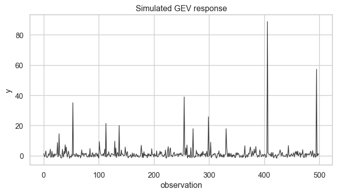
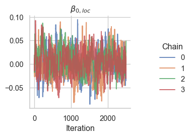
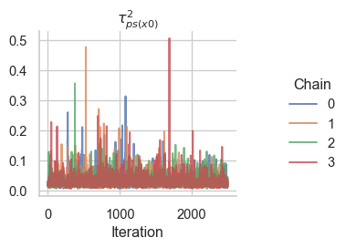
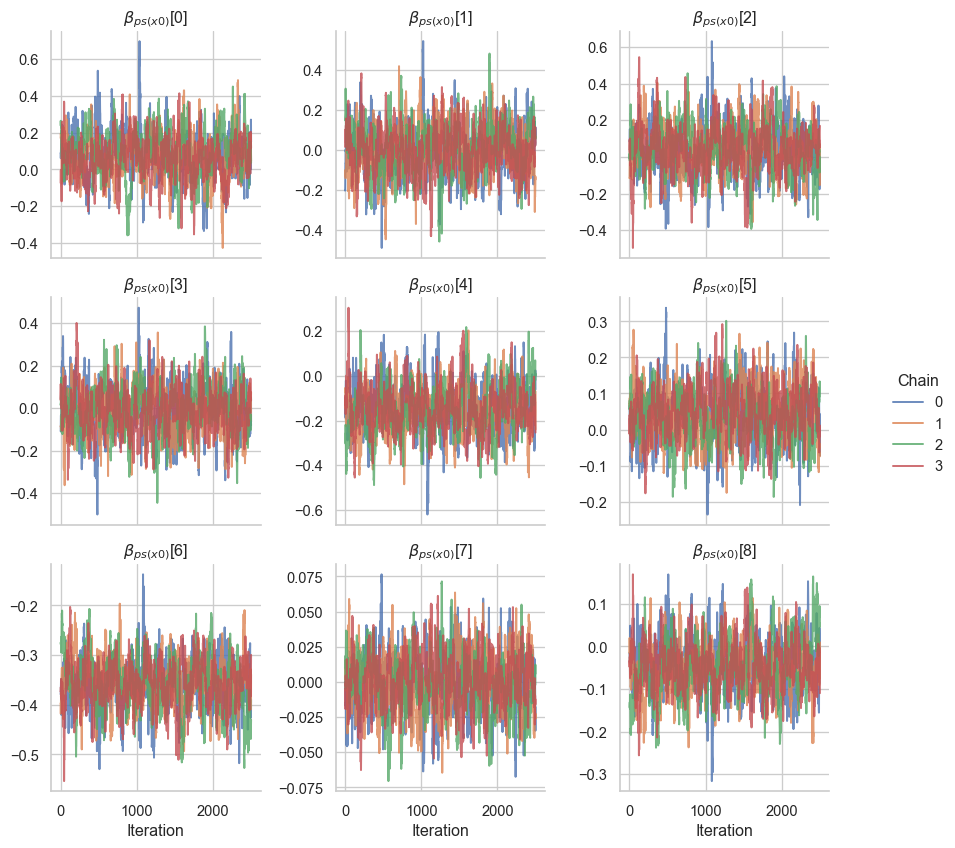
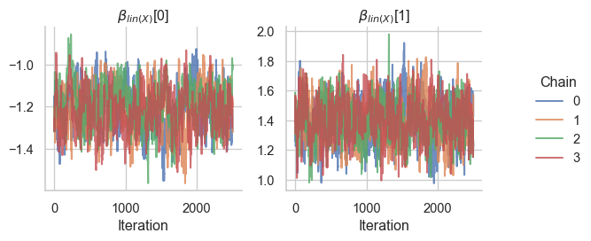
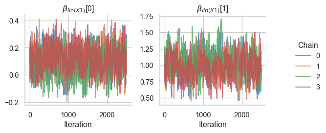
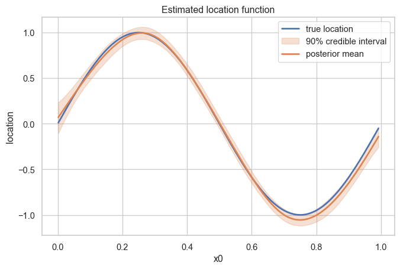

# GEV responses

In this tutorial, we illustrate how to set up a distributional
regression model with the generalized extreme value distribution as a
response distribution. We configure the model in Python with
[Liesel-GAM](https://github.com/liesel-devs/liesel_gam), using
{class}`liesel_gam.TermBuilder` for linear terms and P-splines. See the
[Liesel-GAM documentation and
examples](https://github.com/liesel-devs/liesel_gam#readme) for a
broader overview of the available term types.

We simulate data from a GEV model with three distributional parameters:

- The location parameter ($\mu$) is a function of an intercept and a
  non-linear covariate effect.
- The scale parameter ($\sigma$) is a function of an intercept and a
  linear effect and uses a log-link.
- The shape or concentration parameter ($\xi$) is a function of an
  intercept and a linear effect.

``` python
import jax
import jax.numpy as jnp
import matplotlib.pyplot as plt
import numpy as np
import seaborn as sns
import tensorflow_probability.substrates.jax.distributions as tfd

import liesel.goose as gs
import liesel.model as lsl
import liesel_gam as gam

sns.set_theme(style="whitegrid")
```

    Warning message:
    package ‘arrow’ was built under R version 4.5.2 

``` python
key = jax.random.PRNGKey(13)
n = 500

key, key_x0, key_x1, key_x2, key_y = jax.random.split(key, 5)

x0 = jax.random.uniform(key_x0, (n,))
x1 = jax.random.uniform(key_x1, (n,))
x2 = jax.random.uniform(key_x2, (n,))

true_loc = jnp.sin(2 * jnp.pi * x0)
true_scale = jnp.exp(-1.0 + x1)
true_concentration = 0.1 + x2

y = tfd.GeneralizedExtremeValue(
    loc=true_loc,
    scale=true_scale,
    concentration=true_concentration,
).sample(seed=key_y)

data = pd.DataFrame({
    "y": np.asarray(y),
    "intercept": np.ones_like(y),
    "x0": np.asarray(x0),
    "x1": np.asarray(x1),
    "x2": np.asarray(x2),
    "true_loc": np.asarray(true_loc),
    "true_scale": np.asarray(true_scale),
    "true_concentration": np.asarray(true_concentration),
})
```

Here is the simulated response:

``` python
fig, ax = plt.subplots(figsize=(8, 4))
sns.lineplot(x=data.index, y=data["y"], ax=ax, color="0.25", linewidth=1)
ax.set(xlabel="observation", ylabel="y", title="Simulated GEV response")
plt.show()
```



We now construct the distributional regression model. The `TermBuilder`
reads the covariates from a pandas data frame and creates Liesel
variables for the corresponding model terms. The additive predictors are
passed directly to `tfd.GeneralizedExtremeValue`.

``` python
tb = gam.TermBuilder.from_df(data, default_inference=gs.MCMCSpec(gs.IWLSKernel))

loc = gam.AdditivePredictor("loc", intercept=True)
scale = gam.AdditivePredictor("scale", inv_link=jnp.exp, intercept=False)
concentration = gam.AdditivePredictor("concentration", intercept=False)

loc_smooth = tb.ps("x0", k=10)
scale_x1 = tb.lin("intercept + x1")
concentration_x2 = tb.lin("intercept + x2")

loc += loc_smooth
scale += scale_x1
concentration += concentration_x2

# The GEV distribution is numerically delicate around xi = 0, so we start away
# from the Gumbel case while keeping the linear effect initialized at zero.
concentration_x2.coef.value = jnp.array([0.1, 0.0])
concentration.update()

response_dist = lsl.Dist(
    tfd.GeneralizedExtremeValue,
    loc=loc,
    scale=scale,
    concentration=concentration,
)
y_var = lsl.Var.new_obs(data["y"].to_numpy(), response_dist, name="y")

model = lsl.Model([y_var])

# ScaleIG represents tau = sqrt(tau2). The Gibbs kernel samples tau2.
loc_smooth_tau2_name = loc_smooth.scale.value_node[0].name
```

We use Liesel’s `MCMCSpec` objects, which are added automatically by
Liesel-GAM, to set up the sampler. The default Liesel-GAM setup uses
IWLS kernels for regression coefficients and a Gibbs kernel for the
smoothing variance of the P-spline.

The support of the GEV distribution changes with the parameter values
(compare
[Wikipedia](https://en.wikipedia.org/wiki/Generalized_extreme_value_distribution)).

``` python
results = gs.LieselMCMC(model).run_for_epochs(
    seed=1, num_chains=4, adaptation=1000, posterior=2500
)
gs.Summary(results)
```

    liesel.goose.builder - WARNING - No jitter functions provided for position keys '$\\beta_{ps(x0)}$', '$\\tau_{ps(x0)}^2$', '$\\beta_{0,loc}$', '$\\beta_{lin(X)}$', '$\\beta_{lin(X1)}$'. The initial values for these keys won't be jittered
    liesel.goose.engine - INFO - Initializing kernels...
    liesel.goose.engine - INFO - Done
    liesel.goose.engine - INFO - Starting epoch: FAST_ADAPTATION, 100 transitions, 25 jitted together
      0%|                                                  | 0/4 [00:00<?, ?chunk/s] 25%|██████████▌                               | 1/4 [00:03<00:10,  3.62s/chunk]100%|██████████████████████████████████████████| 4/4 [00:03<00:00,  1.10chunk/s]
    liesel.goose.engine - WARNING - Errors per chain for kernel_00: 1, 1, 1, 1 / 100 transitions
    liesel.goose.engine - WARNING - Errors per chain for kernel_03: 2, 0, 0, 2 / 100 transitions
    liesel.goose.engine - WARNING - Errors per chain for kernel_04: 3, 4, 2, 2 / 100 transitions
    liesel.goose.engine - INFO - Finished epoch
    liesel.goose.engine - INFO - Starting epoch: SLOW_ADAPTATION, 25 transitions, 25 jitted together
      0%|                                                  | 0/1 [00:00<?, ?chunk/s]100%|████████████████████████████████████████| 1/1 [00:00<00:00, 1217.86chunk/s]
    liesel.goose.engine - WARNING - Errors per chain for kernel_00: 1, 2, 1, 1 / 25 transitions
    liesel.goose.engine - WARNING - Errors per chain for kernel_03: 1, 1, 0, 1 / 25 transitions
    liesel.goose.engine - WARNING - Errors per chain for kernel_04: 1, 1, 1, 1 / 25 transitions
    liesel.goose.engine - INFO - Finished epoch
    liesel.goose.engine - INFO - Starting epoch: SLOW_ADAPTATION, 50 transitions, 25 jitted together
      0%|                                                  | 0/2 [00:00<?, ?chunk/s]100%|████████████████████████████████████████| 2/2 [00:00<00:00, 1455.85chunk/s]
    liesel.goose.engine - WARNING - Errors per chain for kernel_00: 1, 1, 1, 0 / 50 transitions
    liesel.goose.engine - WARNING - Errors per chain for kernel_03: 2, 0, 0, 3 / 50 transitions
    liesel.goose.engine - WARNING - Errors per chain for kernel_04: 1, 1, 1, 2 / 50 transitions
    liesel.goose.engine - INFO - Finished epoch
    liesel.goose.engine - INFO - Starting epoch: SLOW_ADAPTATION, 100 transitions, 25 jitted together
      0%|                                                  | 0/4 [00:00<?, ?chunk/s]100%|████████████████████████████████████████| 4/4 [00:00<00:00, 1801.87chunk/s]
    liesel.goose.engine - WARNING - Errors per chain for kernel_00: 1, 1, 2, 0 / 100 transitions
    liesel.goose.engine - WARNING - Errors per chain for kernel_03: 2, 1, 0, 1 / 100 transitions
    liesel.goose.engine - WARNING - Errors per chain for kernel_04: 3, 1, 2, 1 / 100 transitions
    liesel.goose.engine - INFO - Finished epoch
    liesel.goose.engine - INFO - Starting epoch: SLOW_ADAPTATION, 525 transitions, 25 jitted together
      0%|                                                 | 0/21 [00:00<?, ?chunk/s] 76%|█████████████████████████████▋         | 16/21 [00:00<00:00, 157.53chunk/s]100%|███████████████████████████████████████| 21/21 [00:00<00:00, 131.69chunk/s]
    liesel.goose.engine - WARNING - Errors per chain for kernel_00: 1, 2, 1, 1 / 525 transitions
    liesel.goose.engine - WARNING - Errors per chain for kernel_03: 4, 1, 2, 1 / 525 transitions
    liesel.goose.engine - WARNING - Errors per chain for kernel_04: 7, 6, 8, 4 / 525 transitions
    liesel.goose.engine - INFO - Finished epoch
    liesel.goose.engine - INFO - Starting epoch: FAST_ADAPTATION, 200 transitions, 25 jitted together
      0%|                                                  | 0/8 [00:00<?, ?chunk/s]100%|█████████████████████████████████████████| 8/8 [00:00<00:00, 623.89chunk/s]
    liesel.goose.engine - WARNING - Errors per chain for kernel_00: 2, 1, 1, 3 / 200 transitions
    liesel.goose.engine - WARNING - Errors per chain for kernel_03: 1, 3, 3, 2 / 200 transitions
    liesel.goose.engine - WARNING - Errors per chain for kernel_04: 2, 4, 84, 2 / 200 transitions
    liesel.goose.engine - INFO - Finished epoch
    liesel.goose.engine - INFO - Finished warmup
    liesel.goose.engine - INFO - Starting epoch: POSTERIOR, 2500 transitions, 25 jitted together
      0%|                                                | 0/100 [00:00<?, ?chunk/s] 17%|██████▍                               | 17/100 [00:00<00:00, 156.17chunk/s] 33%|████████████▌                         | 33/100 [00:00<00:00, 103.29chunk/s] 45%|█████████████████▌                     | 45/100 [00:00<00:00, 95.92chunk/s] 56%|█████████████████████▊                 | 56/100 [00:00<00:00, 70.69chunk/s] 66%|█████████████████████████▋             | 66/100 [00:00<00:00, 75.90chunk/s] 76%|█████████████████████████████▋         | 76/100 [00:00<00:00, 81.03chunk/s] 85%|█████████████████████████████████▏     | 85/100 [00:00<00:00, 82.51chunk/s] 94%|████████████████████████████████████▋  | 94/100 [00:01<00:00, 83.47chunk/s]100%|██████████████████████████████████████| 100/100 [00:01<00:00, 85.17chunk/s]
    liesel.goose.engine - WARNING - Errors per chain for kernel_04: 8, 4, 872, 2 / 2500 transitions
    liesel.goose.engine - INFO - Finished epoch

<p>
<strong>Parameter summary:</strong>
</p>
<table border="0" class="dataframe">
<thead>
<tr style="text-align: right;">
<th>
</th>
<th>
</th>
<th>
kernel
</th>
<th>
mean
</th>
<th>
sd
</th>
<th>
q_0.05
</th>
<th>
q_0.5
</th>
<th>
q_0.95
</th>
<th>
sample_size
</th>
<th>
ess_bulk
</th>
<th>
ess_tail
</th>
<th>
rhat
</th>
</tr>
<tr>
<th>
parameter
</th>
<th>
index
</th>
<th>
</th>
<th>
</th>
<th>
</th>
<th>
</th>
<th>
</th>
<th>
</th>
<th>
</th>
<th>
</th>
<th>
</th>
<th>
</th>
</tr>
</thead>
<tbody>
<tr>
<th>
$\beta_{0,loc}$
</th>
<th>
()
</th>
<td>
kernel_02
</td>
<td>
0.003
</td>
<td>
0.026
</td>
<td>
-0.037
</td>
<td>
0.002
</td>
<td>
0.047
</td>
<td>
10000
</td>
<td>
177.883
</td>
<td>
457.979
</td>
<td>
1.021
</td>
</tr>
<tr>
<th rowspan="2" valign="top">
$\beta_{lin(X)}$
</th>
<th>
(0,)
</th>
<td>
kernel_03
</td>
<td>
-1.218
</td>
<td>
0.099
</td>
<td>
-1.378
</td>
<td>
-1.219
</td>
<td>
-1.054
</td>
<td>
10000
</td>
<td>
202.379
</td>
<td>
508.367
</td>
<td>
1.018
</td>
</tr>
<tr>
<th>
(1,)
</th>
<td>
kernel_03
</td>
<td>
1.400
</td>
<td>
0.137
</td>
<td>
1.172
</td>
<td>
1.399
</td>
<td>
1.623
</td>
<td>
10000
</td>
<td>
307.969
</td>
<td>
865.843
</td>
<td>
1.006
</td>
</tr>
<tr>
<th rowspan="2" valign="top">
$\beta_{lin(X1)}$
</th>
<th>
(0,)
</th>
<td>
kernel_04
</td>
<td>
0.071
</td>
<td>
0.110
</td>
<td>
-0.061
</td>
<td>
0.074
</td>
<td>
0.255
</td>
<td>
10000
</td>
<td>
8.659
</td>
<td>
50.997
</td>
<td>
1.406
</td>
</tr>
<tr>
<th>
(1,)
</th>
<td>
kernel_04
</td>
<td>
1.070
</td>
<td>
0.201
</td>
<td>
0.724
</td>
<td>
1.075
</td>
<td>
1.296
</td>
<td>
10000
</td>
<td>
10.591
</td>
<td>
678.843
</td>
<td>
1.320
</td>
</tr>
<tr>
<th rowspan="9" valign="top">
$\beta_{ps(x0)}$
</th>
<th>
(0,)
</th>
<td>
kernel_00
</td>
<td>
0.081
</td>
<td>
0.117
</td>
<td>
-0.112
</td>
<td>
0.082
</td>
<td>
0.271
</td>
<td>
10000
</td>
<td>
256.969
</td>
<td>
495.439
</td>
<td>
1.029
</td>
</tr>
<tr>
<th>
(1,)
</th>
<td>
kernel_00
</td>
<td>
0.002
</td>
<td>
0.119
</td>
<td>
-0.194
</td>
<td>
0.006
</td>
<td>
0.187
</td>
<td>
10000
</td>
<td>
373.587
</td>
<td>
726.253
</td>
<td>
1.009
</td>
</tr>
<tr>
<th>
(2,)
</th>
<td>
kernel_00
</td>
<td>
0.048
</td>
<td>
0.125
</td>
<td>
-0.161
</td>
<td>
0.047
</td>
<td>
0.256
</td>
<td>
10000
</td>
<td>
309.323
</td>
<td>
560.738
</td>
<td>
1.005
</td>
</tr>
<tr>
<th>
(3,)
</th>
<td>
kernel_00
</td>
<td>
-0.008
</td>
<td>
0.110
</td>
<td>
-0.185
</td>
<td>
-0.005
</td>
<td>
0.163
</td>
<td>
10000
</td>
<td>
328.177
</td>
<td>
556.151
</td>
<td>
1.008
</td>
</tr>
<tr>
<th>
(4,)
</th>
<td>
kernel_00
</td>
<td>
-0.149
</td>
<td>
0.102
</td>
<td>
-0.314
</td>
<td>
-0.149
</td>
<td>
0.021
</td>
<td>
10000
</td>
<td>
300.963
</td>
<td>
548.966
</td>
<td>
1.019
</td>
</tr>
<tr>
<th>
(5,)
</th>
<td>
kernel_00
</td>
<td>
0.042
</td>
<td>
0.072
</td>
<td>
-0.076
</td>
<td>
0.041
</td>
<td>
0.157
</td>
<td>
10000
</td>
<td>
296.677
</td>
<td>
530.711
</td>
<td>
1.021
</td>
</tr>
<tr>
<th>
(6,)
</th>
<td>
kernel_00
</td>
<td>
-0.357
</td>
<td>
0.048
</td>
<td>
-0.437
</td>
<td>
-0.356
</td>
<td>
-0.281
</td>
<td>
10000
</td>
<td>
303.546
</td>
<td>
527.516
</td>
<td>
1.019
</td>
</tr>
<tr>
<th>
(7,)
</th>
<td>
kernel_00
</td>
<td>
-0.000
</td>
<td>
0.020
</td>
<td>
-0.034
</td>
<td>
0.000
</td>
<td>
0.032
</td>
<td>
10000
</td>
<td>
312.715
</td>
<td>
543.417
</td>
<td>
1.006
</td>
</tr>
<tr>
<th>
(8,)
</th>
<td>
kernel_00
</td>
<td>
-0.050
</td>
<td>
0.060
</td>
<td>
-0.145
</td>
<td>
-0.050
</td>
<td>
0.050
</td>
<td>
10000
</td>
<td>
296.621
</td>
<td>
421.972
</td>
<td>
1.025
</td>
</tr>
<tr>
<th>
$\tau_{ps(x0)}^2$
</th>
<th>
()
</th>
<td>
kernel_01
</td>
<td>
0.031
</td>
<td>
0.022
</td>
<td>
0.012
</td>
<td>
0.025
</td>
<td>
0.068
</td>
<td>
10000
</td>
<td>
1540.702
</td>
<td>
2724.639
</td>
<td>
1.003
</td>
</tr>
</tbody>
</table>
<p>
<strong>Acceptance probabilities:</strong>
</p>
<table border="0" class="dataframe">
<thead>
<tr style="text-align: right;">
<th>
</th>
<th>
</th>
<th>
</th>
<th>
acceptance_probability
</th>
<th>
position_moved
</th>
</tr>
<tr>
<th>
kernel
</th>
<th>
positions
</th>
<th>
phase
</th>
<th>
</th>
<th>
</th>
</tr>
</thead>
<tbody>
<tr>
<th rowspan="2" valign="top">
kernel_00
</th>
<th rowspan="2" valign="top">
$\beta_{ps(x0)}$
</th>
<th>
posterior
</th>
<td>
0.828
</td>
<td>
0.823
</td>
</tr>
<tr>
<th>
warmup
</th>
<td>
0.793
</td>
<td>
0.792
</td>
</tr>
<tr>
<th rowspan="2" valign="top">
kernel_01
</th>
<th rowspan="2" valign="top">
$\tau_{ps(x0)}^2$
</th>
<th>
posterior
</th>
<td>
1.000
</td>
<td>
1.000
</td>
</tr>
<tr>
<th>
warmup
</th>
<td>
1.000
</td>
<td>
1.000
</td>
</tr>
<tr>
<th rowspan="2" valign="top">
kernel_02
</th>
<th rowspan="2" valign="top">
$\beta_{0,loc}$
</th>
<th>
posterior
</th>
<td>
0.882
</td>
<td>
0.882
</td>
</tr>
<tr>
<th>
warmup
</th>
<td>
0.888
</td>
<td>
0.886
</td>
</tr>
<tr>
<th rowspan="2" valign="top">
kernel_03
</th>
<th rowspan="2" valign="top">
$\beta_{lin(X)}$
</th>
<th>
posterior
</th>
<td>
0.867
</td>
<td>
0.866
</td>
</tr>
<tr>
<th>
warmup
</th>
<td>
0.793
</td>
<td>
0.790
</td>
</tr>
<tr>
<th rowspan="2" valign="top">
kernel_04
</th>
<th rowspan="2" valign="top">
$\beta_{lin(X1)}$
</th>
<th>
posterior
</th>
<td>
0.848
</td>
<td>
0.848
</td>
</tr>
<tr>
<th>
warmup
</th>
<td>
0.791
</td>
<td>
0.793
</td>
</tr>
</tbody>
</table>
<p>
<strong>Error summary:</strong>
</p>
<table border="0" class="dataframe">
<thead>
<tr style="text-align: right;">
<th>
</th>
<th>
</th>
<th>
</th>
<th>
</th>
<th>
</th>
<th>
count
</th>
<th>
sample_size
</th>
<th>
sample_size_total
</th>
<th>
relative
</th>
</tr>
<tr>
<th>
kernel
</th>
<th>
positions
</th>
<th>
error_code
</th>
<th>
error_msg
</th>
<th>
phase
</th>
<th>
</th>
<th>
</th>
<th>
</th>
<th>
</th>
</tr>
</thead>
<tbody>
<tr>
<th rowspan="2" valign="top">
kernel_00
</th>
<th rowspan="2" valign="top">
$\beta_{ps(x0)}$
</th>
<th rowspan="2" valign="top">
90
</th>
<th rowspan="2" valign="top">
nan acceptance prob
</th>
<th>
warmup
</th>
<td>
28
</td>
<td>
4000
</td>
<td>
4000
</td>
<td>
0.007
</td>
</tr>
<tr>
<th>
posterior
</th>
<td>
0
</td>
<td>
10000
</td>
<td>
10000
</td>
<td>
0.000
</td>
</tr>
<tr>
<th rowspan="2" valign="top">
kernel_03
</th>
<th rowspan="2" valign="top">
$\beta_{lin(X)}$
</th>
<th rowspan="2" valign="top">
90
</th>
<th rowspan="2" valign="top">
nan acceptance prob
</th>
<th>
warmup
</th>
<td>
33
</td>
<td>
4000
</td>
<td>
4000
</td>
<td>
0.008
</td>
</tr>
<tr>
<th>
posterior
</th>
<td>
0
</td>
<td>
10000
</td>
<td>
10000
</td>
<td>
0.000
</td>
</tr>
<tr>
<th rowspan="6" valign="top">
kernel_04
</th>
<th rowspan="6" valign="top">
$\beta_{lin(X1)}$
</th>
<th rowspan="2" valign="top">
2
</th>
<th rowspan="2" valign="top">
indefinite information matrix (fallback to identity)
</th>
<th>
warmup
</th>
<td>
84
</td>
<td>
4000
</td>
<td>
4000
</td>
<td>
0.021
</td>
</tr>
<tr>
<th>
posterior
</th>
<td>
872
</td>
<td>
10000
</td>
<td>
10000
</td>
<td>
0.087
</td>
</tr>
<tr>
<th rowspan="2" valign="top">
90
</th>
<th rowspan="2" valign="top">
nan acceptance prob
</th>
<th>
warmup
</th>
<td>
58
</td>
<td>
4000
</td>
<td>
4000
</td>
<td>
0.014
</td>
</tr>
<tr>
<th>
posterior
</th>
<td>
0
</td>
<td>
10000
</td>
<td>
10000
</td>
<td>
0.000
</td>
</tr>
<tr>
<th rowspan="2" valign="top">
92
</th>
<th rowspan="2" valign="top">
indefinite information matrix (fallback to identity) + nan acceptance
prob
</th>
<th>
warmup
</th>
<td>
2
</td>
<td>
4000
</td>
<td>
4000
</td>
<td>
0.001
</td>
</tr>
<tr>
<th>
posterior
</th>
<td>
14
</td>
<td>
10000
</td>
<td>
10000
</td>
<td>
0.001
</td>
</tr>
</tbody>
</table>

The corresponding trace plots:

``` python
gs.plot_trace(results, loc.intercept.name)
gs.plot_trace(results, loc_smooth_tau2_name)
gs.plot_trace(results, loc_smooth.coef.name)
gs.plot_trace(results, scale_x1.coef.name)
gs.plot_trace(results, concentration_x2.coef.name)
```











Finally, we can evaluate the posterior samples of the location predictor
and compare the posterior mean with the true function used in the
simulation.

``` python
samples = results.get_posterior_samples()
loc_samples = model.vars["loc"].predict(samples)
loc_summary = gs.SamplesSummary.from_array(
    loc_samples,
    name="loc",
    which=["mean", "quantiles"],
)
loc_summary_df = loc_summary.to_dataframe().reset_index()

loc_summary_df["x0"] = data["x0"].to_numpy()
loc_summary_df["true_loc"] = data["true_loc"].to_numpy()
loc_summary_df = loc_summary_df.sort_values("x0")

fig, ax = plt.subplots(figsize=(8, 5))
sns.lineplot(
    data=loc_summary_df,
    x="x0",
    y="true_loc",
    color=sns.color_palette()[0],
    linewidth=2,
    label="true location",
    ax=ax,
)
ax.fill_between(
    loc_summary_df["x0"],
    loc_summary_df["q_0.05"],
    loc_summary_df["q_0.95"],
    color=sns.color_palette()[1],
    alpha=0.25,
    label="90% credible interval",
)
sns.lineplot(
    data=loc_summary_df,
    x="x0",
    y="mean",
    color=sns.color_palette()[1],
    linewidth=2,
    label="posterior mean",
    ax=ax,
)

ax.set(xlabel="x0", ylabel="location", title="Estimated location function")
plt.show()
```


