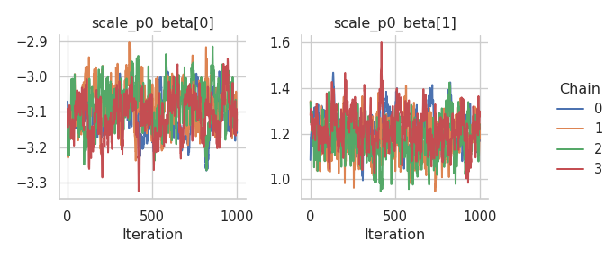

# GEV responses

In this tutorial, we illustrate how to set up a distributional
regression model with the generalized extreme value distribution as a
response distribution. First, we simulate some data in R:

- The location parameter ($\mu$) is a function of an intercept and a
  non-linear covariate effect.
- The scale parameter ($\sigma$) is a function of an intercept and a
  linear effect and uses a log-link.
- The shape or concentration parameter ($\xi$) is a function of an
  intercept and a linear effect.

After simulating the data, we can configure the model with a single call
to the `rliesel::liesel()` function.

``` r
library(rliesel)
```

    Please set your Liesel venv, e.g. with use_liesel_venv()

``` r
library(VGAM)
```

    Loading required package: stats4

    Loading required package: splines

``` r
set.seed(1337)

n <- 1000

x0 <- runif(n)
x1 <- runif(n)
x2 <- runif(n)

y <- rgev(
  n,
  location = 0 + sin(2 * pi * x0),
  scale = exp(-3 + x1),
  shape = 0.1 + x2
)

plot(y)
```


``` r
model <- liesel(
  response = y,
  distribution = "GeneralizedExtremeValue",
  predictors = list(
    loc = predictor(~ s(x0)),
    scale = predictor(~ x1, inverse_link = "Exp"),
    concentration = predictor(~ x2)
  )
)
```

Now, we can continue in Python and use the `lsl.dist_reg_mcmc()`
function to set up a sampling algorithm with IWLS kernels for the
regression coefficients ($\boldsymbol{\beta}$) and a Gibbs kernel for
the smoothing parameter ($\tau^2$) of the spline. Note that we need to
set $\beta_0$ for $\xi$ to 0.1 manually, because $\xi = 0$ breaks the
sampler.

``` python
import liesel.model as lsl
import jax.numpy as jnp

model = r.model

# concentration == 0.0 seems to break the sampler
model.vars["concentration_p0_beta"].value = jnp.array([0.1, 0.0])

builder = lsl.dist_reg_mcmc(model, seed=42, num_chains=4)
builder.set_duration(warmup_duration=1000, posterior_duration=1000)

engine = builder.build()
engine.sample_all_epochs()
```

    liesel.goose.engine - INFO - Starting epoch: FAST_ADAPTATION, 75 transitions, 25 jitted together
    liesel.goose.engine - WARNING - Errors per chain for kernel_00: 1, 2, 0, 0 / 75 transitions
    liesel.goose.engine - WARNING - Errors per chain for kernel_01: 7, 4, 8, 5 / 75 transitions
    liesel.goose.engine - WARNING - Errors per chain for kernel_02: 0, 1, 0, 0 / 75 transitions
    liesel.goose.engine - WARNING - Errors per chain for kernel_04: 0, 1, 0, 0 / 75 transitions
    liesel.goose.engine - INFO - Finished epoch
    liesel.goose.engine - INFO - Starting epoch: SLOW_ADAPTATION, 25 transitions, 25 jitted together
    liesel.goose.engine - WARNING - Errors per chain for kernel_00: 1, 1, 1, 1 / 25 transitions
    liesel.goose.engine - WARNING - Errors per chain for kernel_01: 1, 1, 1, 2 / 25 transitions
    liesel.goose.engine - WARNING - Errors per chain for kernel_02: 1, 1, 0, 1 / 25 transitions
    liesel.goose.engine - WARNING - Errors per chain for kernel_04: 1, 0, 1, 1 / 25 transitions
    liesel.goose.engine - INFO - Finished epoch
    liesel.goose.engine - INFO - Starting epoch: SLOW_ADAPTATION, 50 transitions, 25 jitted together
    liesel.goose.engine - WARNING - Errors per chain for kernel_00: 0, 2, 0, 2 / 50 transitions
    liesel.goose.engine - WARNING - Errors per chain for kernel_01: 1, 4, 2, 5 / 50 transitions
    liesel.goose.engine - WARNING - Errors per chain for kernel_02: 0, 1, 1, 1 / 50 transitions
    liesel.goose.engine - WARNING - Errors per chain for kernel_04: 1, 1, 1, 0 / 50 transitions
    liesel.goose.engine - INFO - Finished epoch
    liesel.goose.engine - INFO - Starting epoch: SLOW_ADAPTATION, 100 transitions, 25 jitted together
    liesel.goose.engine - WARNING - Errors per chain for kernel_00: 1, 1, 2, 4 / 100 transitions
    liesel.goose.engine - WARNING - Errors per chain for kernel_01: 3, 1, 1, 3 / 100 transitions
    liesel.goose.engine - WARNING - Errors per chain for kernel_02: 1, 1, 1, 0 / 100 transitions
    liesel.goose.engine - WARNING - Errors per chain for kernel_04: 0, 1, 0, 1 / 100 transitions
    liesel.goose.engine - INFO - Finished epoch
    liesel.goose.engine - INFO - Starting epoch: SLOW_ADAPTATION, 200 transitions, 25 jitted together
    liesel.goose.engine - WARNING - Errors per chain for kernel_00: 1, 3, 1, 1 / 200 transitions
    liesel.goose.engine - WARNING - Errors per chain for kernel_01: 2, 1, 3, 2 / 200 transitions
    liesel.goose.engine - WARNING - Errors per chain for kernel_02: 1, 0, 0, 1 / 200 transitions
    liesel.goose.engine - WARNING - Errors per chain for kernel_04: 1, 1, 1, 1 / 200 transitions
    liesel.goose.engine - INFO - Finished epoch
    liesel.goose.engine - INFO - Starting epoch: SLOW_ADAPTATION, 500 transitions, 25 jitted together
    liesel.goose.engine - WARNING - Errors per chain for kernel_00: 1, 2, 0, 0 / 500 transitions
    liesel.goose.engine - WARNING - Errors per chain for kernel_01: 5, 3, 2, 3 / 500 transitions
    liesel.goose.engine - WARNING - Errors per chain for kernel_02: 2, 3, 1, 0 / 500 transitions
    liesel.goose.engine - WARNING - Errors per chain for kernel_04: 2, 1, 1, 1 / 500 transitions
    liesel.goose.engine - INFO - Finished epoch
    liesel.goose.engine - INFO - Starting epoch: FAST_ADAPTATION, 50 transitions, 25 jitted together
    liesel.goose.engine - WARNING - Errors per chain for kernel_00: 1, 2, 1, 1 / 50 transitions
    liesel.goose.engine - WARNING - Errors per chain for kernel_01: 3, 2, 1, 2 / 50 transitions
    liesel.goose.engine - WARNING - Errors per chain for kernel_02: 1, 2, 1, 0 / 50 transitions
    liesel.goose.engine - WARNING - Errors per chain for kernel_04: 2, 1, 2, 1 / 50 transitions
    liesel.goose.engine - INFO - Finished epoch
    liesel.goose.engine - INFO - Finished warmup
    liesel.goose.engine - INFO - Starting epoch: POSTERIOR, 1000 transitions, 25 jitted together
    liesel.goose.engine - WARNING - Errors per chain for kernel_01: 1, 1, 2, 7 / 1000 transitions
    liesel.goose.engine - INFO - Finished epoch

Some tabular summary statistics of the posterior samples:

``` python
import liesel.goose as gs

results = engine.get_results()
gs.Summary(results)
```

<p>
<strong>Parameter summary:</strong>
</p>
<table border="0" class="dataframe">
<thead>
<tr style="text-align: right;">
<th>
</th>
<th>
</th>
<th>
kernel
</th>
<th>
mean
</th>
<th>
sd
</th>
<th>
q_0.05
</th>
<th>
q_0.5
</th>
<th>
q_0.95
</th>
<th>
sample_size
</th>
<th>
ess_bulk
</th>
<th>
ess_tail
</th>
<th>
rhat
</th>
</tr>
<tr>
<th>
parameter
</th>
<th>
index
</th>
<th>
</th>
<th>
</th>
<th>
</th>
<th>
</th>
<th>
</th>
<th>
</th>
<th>
</th>
<th>
</th>
<th>
</th>
<th>
</th>
</tr>
</thead>
<tbody>
<tr>
<th rowspan="2" valign="top">
concentration_p0_beta_value
</th>
<th>
(0,)
</th>
<td>
kernel_01
</td>
<td>
0.071929
</td>
<td>
0.050662
</td>
<td>
-0.012284
</td>
<td>
0.072689
</td>
<td>
0.154067
</td>
<td>
4000
</td>
<td>
229.601721
</td>
<td>
450.782270
</td>
<td>
1.012629
</td>
</tr>
<tr>
<th>
(1,)
</th>
<td>
kernel_01
</td>
<td>
1.053301
</td>
<td>
0.098821
</td>
<td>
0.896774
</td>
<td>
1.051851
</td>
<td>
1.220642
</td>
<td>
4000
</td>
<td>
163.502460
</td>
<td>
391.837453
</td>
<td>
1.017340
</td>
</tr>
<tr>
<th rowspan="9" valign="top">
loc_np0_beta_value
</th>
<th>
(0,)
</th>
<td>
kernel_04
</td>
<td>
-0.662148
</td>
<td>
0.228588
</td>
<td>
-1.035122
</td>
<td>
-0.659905
</td>
<td>
-0.278453
</td>
<td>
4000
</td>
<td>
75.283260
</td>
<td>
98.782550
</td>
<td>
1.033056
</td>
</tr>
<tr>
<th>
(1,)
</th>
<td>
kernel_04
</td>
<td>
0.254665
</td>
<td>
0.139748
</td>
<td>
0.037655
</td>
<td>
0.250840
</td>
<td>
0.486503
</td>
<td>
4000
</td>
<td>
69.278639
</td>
<td>
137.883314
</td>
<td>
1.079087
</td>
</tr>
<tr>
<th>
(2,)
</th>
<td>
kernel_04
</td>
<td>
-0.367144
</td>
<td>
0.121138
</td>
<td>
-0.558089
</td>
<td>
-0.371216
</td>
<td>
-0.165012
</td>
<td>
4000
</td>
<td>
86.158873
</td>
<td>
242.143096
</td>
<td>
1.052514
</td>
</tr>
<tr>
<th>
(3,)
</th>
<td>
kernel_04
</td>
<td>
0.352353
</td>
<td>
0.067407
</td>
<td>
0.249027
</td>
<td>
0.346939
</td>
<td>
0.463017
</td>
<td>
4000
</td>
<td>
58.484567
</td>
<td>
211.182183
</td>
<td>
1.078897
</td>
</tr>
<tr>
<th>
(4,)
</th>
<td>
kernel_04
</td>
<td>
-0.274668
</td>
<td>
0.077465
</td>
<td>
-0.412347
</td>
<td>
-0.271379
</td>
<td>
-0.150645
</td>
<td>
4000
</td>
<td>
101.371062
</td>
<td>
131.721037
</td>
<td>
1.023710
</td>
</tr>
<tr>
<th>
(5,)
</th>
<td>
kernel_04
</td>
<td>
0.186852
</td>
<td>
0.029385
</td>
<td>
0.139048
</td>
<td>
0.186926
</td>
<td>
0.234933
</td>
<td>
4000
</td>
<td>
89.490829
</td>
<td>
149.752467
</td>
<td>
1.039903
</td>
</tr>
<tr>
<th>
(6,)
</th>
<td>
kernel_04
</td>
<td>
6.027935
</td>
<td>
0.041793
</td>
<td>
5.962661
</td>
<td>
6.029110
</td>
<td>
6.093887
</td>
<td>
4000
</td>
<td>
73.308958
</td>
<td>
99.846003
</td>
<td>
1.056005
</td>
</tr>
<tr>
<th>
(7,)
</th>
<td>
kernel_04
</td>
<td>
0.504504
</td>
<td>
0.066260
</td>
<td>
0.387907
</td>
<td>
0.507414
</td>
<td>
0.608501
</td>
<td>
4000
</td>
<td>
108.702939
</td>
<td>
86.838309
</td>
<td>
1.035320
</td>
</tr>
<tr>
<th>
(8,)
</th>
<td>
kernel_04
</td>
<td>
1.700647
</td>
<td>
0.032794
</td>
<td>
1.645609
</td>
<td>
1.701911
</td>
<td>
1.752994
</td>
<td>
4000
</td>
<td>
69.300625
</td>
<td>
102.917906
</td>
<td>
1.062150
</td>
</tr>
<tr>
<th>
loc_np0_tau2_value
</th>
<th>
()
</th>
<td>
kernel_03
</td>
<td>
6.236151
</td>
<td>
4.841145
</td>
<td>
2.405942
</td>
<td>
5.022253
</td>
<td>
13.351084
</td>
<td>
4000
</td>
<td>
4097.518292
</td>
<td>
3813.411946
</td>
<td>
1.000166
</td>
</tr>
<tr>
<th>
loc_p0_beta_value
</th>
<th>
(0,)
</th>
<td>
kernel_02
</td>
<td>
0.027340
</td>
<td>
0.002396
</td>
<td>
0.023527
</td>
<td>
0.027236
</td>
<td>
0.031503
</td>
<td>
4000
</td>
<td>
119.931447
</td>
<td>
287.589999
</td>
<td>
1.033240
</td>
</tr>
<tr>
<th rowspan="2" valign="top">
scale_p0_beta_value
</th>
<th>
(0,)
</th>
<td>
kernel_00
</td>
<td>
-3.068542
</td>
<td>
0.057307
</td>
<td>
-3.164250
</td>
<td>
-3.068539
</td>
<td>
-2.973352
</td>
<td>
4000
</td>
<td>
159.608254
</td>
<td>
364.631986
</td>
<td>
1.029662
</td>
</tr>
<tr>
<th>
(1,)
</th>
<td>
kernel_00
</td>
<td>
1.047303
</td>
<td>
0.069941
</td>
<td>
0.931457
</td>
<td>
1.046729
</td>
<td>
1.164785
</td>
<td>
4000
</td>
<td>
212.258838
</td>
<td>
487.939493
</td>
<td>
1.020230
</td>
</tr>
</tbody>
</table>
<p>
<strong>Error summary:</strong>
</p>
<table border="0" class="dataframe">
<thead>
<tr style="text-align: right;">
<th>
</th>
<th>
</th>
<th>
</th>
<th>
</th>
<th>
count
</th>
<th>
relative
</th>
</tr>
<tr>
<th>
kernel
</th>
<th>
error_code
</th>
<th>
error_msg
</th>
<th>
phase
</th>
<th>
</th>
<th>
</th>
</tr>
</thead>
<tbody>
<tr>
<th rowspan="2" valign="top">
kernel_00
</th>
<th rowspan="2" valign="top">
90
</th>
<th rowspan="2" valign="top">
nan acceptance prob
</th>
<th>
warmup
</th>
<td>
33
</td>
<td>
0.00825
</td>
</tr>
<tr>
<th>
posterior
</th>
<td>
0
</td>
<td>
0.00000
</td>
</tr>
<tr>
<th rowspan="2" valign="top">
kernel_01
</th>
<th rowspan="2" valign="top">
90
</th>
<th rowspan="2" valign="top">
nan acceptance prob
</th>
<th>
warmup
</th>
<td>
78
</td>
<td>
0.01950
</td>
</tr>
<tr>
<th>
posterior
</th>
<td>
11
</td>
<td>
0.00275
</td>
</tr>
<tr>
<th rowspan="2" valign="top">
kernel_02
</th>
<th rowspan="2" valign="top">
90
</th>
<th rowspan="2" valign="top">
nan acceptance prob
</th>
<th>
warmup
</th>
<td>
22
</td>
<td>
0.00550
</td>
</tr>
<tr>
<th>
posterior
</th>
<td>
0
</td>
<td>
0.00000
</td>
</tr>
<tr>
<th rowspan="2" valign="top">
kernel_04
</th>
<th rowspan="2" valign="top">
90
</th>
<th rowspan="2" valign="top">
nan acceptance prob
</th>
<th>
warmup
</th>
<td>
24
</td>
<td>
0.00600
</td>
</tr>
<tr>
<th>
posterior
</th>
<td>
0
</td>
<td>
0.00000
</td>
</tr>
</tbody>
</table>

And the corresponding trace plots:

``` python
fig = gs.plot_trace(results, "loc_p0_beta_value")
```


``` python
fig = gs.plot_trace(results, "loc_np0_tau2_value")
```


``` python
fig = gs.plot_trace(results, "loc_np0_beta_value")
```


``` python
fig = gs.plot_trace(results, "scale_p0_beta_value")
```



``` python
fig = gs.plot_trace(results, "concentration_p0_beta_value")
```


We need to reset the index of the summary data frame before we can
transfer it to R.

``` python
summary = gs.Summary(results).to_dataframe().reset_index()
```

After transferring the summary data frame to R, we can process it with
packages like dplyr and ggplot2. Here is a visualization of the
estimated spline vs. the true function:

``` r
library(dplyr)
```


    Attaching package: 'dplyr'

    The following objects are masked from 'package:stats':

        filter, lag

    The following objects are masked from 'package:base':

        intersect, setdiff, setequal, union

``` r
library(ggplot2)
library(reticulate)

summary <- py$summary

beta <- summary %>%
  filter(variable == "loc_np0_beta_value") %>%
  group_by(var_index) %>%
  summarize(mean = mean(mean)) %>%
  ungroup()

beta <- beta$mean
X <- py_to_r(model$vars["loc_np0_X"]$value)
estimate <- X %*% beta

true <- sin(2 * pi * x0)

ggplot(data.frame(x0 = x0, estimate = estimate, true = true)) +
  geom_line(aes(x0, estimate), color = palette()[2]) +
  geom_line(aes(x0, true), color = palette()[4]) +
  ggtitle("Estimated spline (red) vs. true function (blue)") +
  ylab("f") +
  theme_minimal()
```


