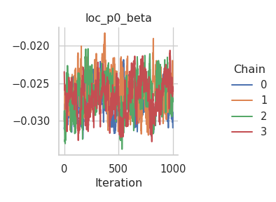
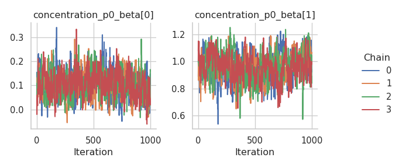

# GEV responses

In this tutorial, we illustrate how to set up a distributional
regression model with the generalized extreme value distribution as a
response distribution. First, we simulate some data in R:

- The location parameter ($\mu$) is a function of an intercept and a
  non-linear covariate effect.
- The scale parameter ($\sigma$) is a function of an intercept and a
  linear effect and uses a log-link.
- The shape or concentration parameter ($\xi$) is a function of an
  intercept and a linear effect.

After simulating the data, we can configure the model with a single call
to the `rliesel::liesel()` function.

``` r
library(rliesel)
```

    Please set your Liesel venv, e.g. with use_liesel_venv()

``` r
library(VGAM)
```

    Loading required package: stats4

    Loading required package: splines

``` r
set.seed(1337)

n <- 1000

x0 <- runif(n)
x1 <- runif(n)
x2 <- runif(n)

y <- rgev(
  n,
  location = 0 + sin(2 * pi * x0),
  scale = exp(-3 + x1),
  shape = 0.1 + x2
)

plot(y)
```


``` r
model <- liesel(
  response = y,
  distribution = "GeneralizedExtremeValue",
  predictors = list(
    loc = predictor(~ s(x0)),
    scale = predictor(~ x1, inverse_link = "Exp"),
    concentration = predictor(~ x2)
  )
)
```

Now, we can continue in Python and use the `lsl.dist_reg_mcmc()`
function to set up a sampling algorithm with IWLS kernels for the
regression coefficients ($\boldsymbol{\beta}$) and a Gibbs kernel for
the smoothing parameter ($\tau^2$) of the spline. Note that we need to
set $\beta_0$ for $\xi$ to 0.1 manually, because $\xi = 0$ breaks the
sampler.

``` python
import liesel.model as lsl
import jax.numpy as jnp

model = r.model

# concentration == 0.0 seems to break the sampler
model.vars["concentration_p0_beta"].value = jnp.array([0.1, 0.0])

builder = lsl.dist_reg_mcmc(model, seed=42, num_chains=4)
builder.set_duration(warmup_duration=1000, posterior_duration=1000)

engine = builder.build()
engine.sample_all_epochs()
```

    liesel.goose.engine - INFO - Starting epoch: FAST_ADAPTATION, 75 transitions, 25 jitted together
    liesel.goose.engine - WARNING - Errors per chain for kernel_00: 0, 1, 0, 0 / 75 transitions
    liesel.goose.engine - WARNING - Errors per chain for kernel_01: 6, 2, 6, 6 / 75 transitions
    liesel.goose.engine - WARNING - Errors per chain for kernel_02: 1, 0, 0, 0 / 75 transitions
    liesel.goose.engine - WARNING - Errors per chain for kernel_04: 0, 1, 0, 0 / 75 transitions
    liesel.goose.engine - INFO - Finished epoch
    liesel.goose.engine - INFO - Starting epoch: SLOW_ADAPTATION, 25 transitions, 25 jitted together
    liesel.goose.engine - WARNING - Errors per chain for kernel_00: 1, 1, 0, 2 / 25 transitions
    liesel.goose.engine - WARNING - Errors per chain for kernel_01: 1, 1, 1, 2 / 25 transitions
    liesel.goose.engine - WARNING - Errors per chain for kernel_02: 0, 0, 0, 2 / 25 transitions
    liesel.goose.engine - WARNING - Errors per chain for kernel_04: 2, 0, 1, 1 / 25 transitions
    liesel.goose.engine - INFO - Finished epoch
    liesel.goose.engine - INFO - Starting epoch: SLOW_ADAPTATION, 50 transitions, 25 jitted together
    liesel.goose.engine - WARNING - Errors per chain for kernel_00: 2, 2, 0, 2 / 50 transitions
    liesel.goose.engine - WARNING - Errors per chain for kernel_01: 2, 1, 1, 3 / 50 transitions
    liesel.goose.engine - WARNING - Errors per chain for kernel_02: 0, 1, 1, 1 / 50 transitions
    liesel.goose.engine - WARNING - Errors per chain for kernel_04: 1, 1, 1, 1 / 50 transitions
    liesel.goose.engine - INFO - Finished epoch
    liesel.goose.engine - INFO - Starting epoch: SLOW_ADAPTATION, 100 transitions, 25 jitted together
    liesel.goose.engine - WARNING - Errors per chain for kernel_00: 1, 2, 2, 4 / 100 transitions
    liesel.goose.engine - WARNING - Errors per chain for kernel_01: 1, 2, 1, 1 / 100 transitions
    liesel.goose.engine - WARNING - Errors per chain for kernel_02: 1, 1, 3, 1 / 100 transitions
    liesel.goose.engine - WARNING - Errors per chain for kernel_04: 1, 1, 0, 1 / 100 transitions
    liesel.goose.engine - INFO - Finished epoch
    liesel.goose.engine - INFO - Starting epoch: SLOW_ADAPTATION, 200 transitions, 25 jitted together
    liesel.goose.engine - WARNING - Errors per chain for kernel_00: 1, 2, 2, 1 / 200 transitions
    liesel.goose.engine - WARNING - Errors per chain for kernel_01: 3, 2, 2, 1 / 200 transitions
    liesel.goose.engine - WARNING - Errors per chain for kernel_02: 1, 0, 1, 0 / 200 transitions
    liesel.goose.engine - WARNING - Errors per chain for kernel_04: 0, 1, 1, 1 / 200 transitions
    liesel.goose.engine - INFO - Finished epoch
    liesel.goose.engine - INFO - Starting epoch: SLOW_ADAPTATION, 500 transitions, 25 jitted together
    liesel.goose.engine - WARNING - Errors per chain for kernel_00: 1, 1, 1, 1 / 500 transitions
    liesel.goose.engine - WARNING - Errors per chain for kernel_01: 7, 3, 2, 4 / 500 transitions
    liesel.goose.engine - WARNING - Errors per chain for kernel_02: 2, 1, 1, 3 / 500 transitions
    liesel.goose.engine - WARNING - Errors per chain for kernel_04: 2, 1, 1, 0 / 500 transitions
    liesel.goose.engine - INFO - Finished epoch
    liesel.goose.engine - INFO - Starting epoch: FAST_ADAPTATION, 50 transitions, 25 jitted together
    liesel.goose.engine - WARNING - Errors per chain for kernel_00: 0, 2, 1, 1 / 50 transitions
    liesel.goose.engine - WARNING - Errors per chain for kernel_01: 1, 4, 2, 2 / 50 transitions
    liesel.goose.engine - WARNING - Errors per chain for kernel_02: 1, 1, 1, 0 / 50 transitions
    liesel.goose.engine - WARNING - Errors per chain for kernel_04: 1, 1, 1, 2 / 50 transitions
    liesel.goose.engine - INFO - Finished epoch
    liesel.goose.engine - INFO - Finished warmup
    liesel.goose.engine - INFO - Starting epoch: POSTERIOR, 1000 transitions, 25 jitted together
    liesel.goose.engine - WARNING - Errors per chain for kernel_01: 1, 14, 3, 1 / 1000 transitions
    liesel.goose.engine - INFO - Finished epoch

Some tabular summary statistics of the posterior samples:

``` python
import liesel.goose as gs

results = engine.get_results()
gs.Summary(results)
```

<p>
<strong>Parameter summary:</strong>
</p>
<table border="0" class="dataframe">
<thead>
<tr style="text-align: right;">
<th>
</th>
<th>
</th>
<th>
kernel
</th>
<th>
mean
</th>
<th>
sd
</th>
<th>
q_0.05
</th>
<th>
q_0.5
</th>
<th>
q_0.95
</th>
<th>
sample_size
</th>
<th>
ess_bulk
</th>
<th>
ess_tail
</th>
<th>
rhat
</th>
</tr>
<tr>
<th>
parameter
</th>
<th>
index
</th>
<th>
</th>
<th>
</th>
<th>
</th>
<th>
</th>
<th>
</th>
<th>
</th>
<th>
</th>
<th>
</th>
<th>
</th>
<th>
</th>
</tr>
</thead>
<tbody>
<tr>
<th rowspan="2" valign="top">
concentration_p0_beta_value
</th>
<th>
(0,)
</th>
<td>
kernel_01
</td>
<td>
0.071993
</td>
<td>
0.051352
</td>
<td>
-0.013058
</td>
<td>
0.071705
</td>
<td>
0.155210
</td>
<td>
4000
</td>
<td>
250.831700
</td>
<td>
356.316319
</td>
<td>
1.009466
</td>
</tr>
<tr>
<th>
(1,)
</th>
<td>
kernel_01
</td>
<td>
1.054316
</td>
<td>
0.097614
</td>
<td>
0.898787
</td>
<td>
1.053928
</td>
<td>
1.218901
</td>
<td>
4000
</td>
<td>
206.111655
</td>
<td>
455.822939
</td>
<td>
1.010808
</td>
</tr>
<tr>
<th rowspan="9" valign="top">
loc_np0_beta_value
</th>
<th>
(0,)
</th>
<td>
kernel_04
</td>
<td>
-0.652974
</td>
<td>
0.220410
</td>
<td>
-1.028853
</td>
<td>
-0.646163
</td>
<td>
-0.286393
</td>
<td>
4000
</td>
<td>
79.106947
</td>
<td>
139.258230
</td>
<td>
1.040685
</td>
</tr>
<tr>
<th>
(1,)
</th>
<td>
kernel_04
</td>
<td>
0.254544
</td>
<td>
0.141074
</td>
<td>
0.036443
</td>
<td>
0.249052
</td>
<td>
0.494999
</td>
<td>
4000
</td>
<td>
77.532999
</td>
<td>
168.696569
</td>
<td>
1.063268
</td>
</tr>
<tr>
<th>
(2,)
</th>
<td>
kernel_04
</td>
<td>
-0.366811
</td>
<td>
0.121113
</td>
<td>
-0.558224
</td>
<td>
-0.372471
</td>
<td>
-0.160642
</td>
<td>
4000
</td>
<td>
94.805122
</td>
<td>
214.073557
</td>
<td>
1.031691
</td>
</tr>
<tr>
<th>
(3,)
</th>
<td>
kernel_04
</td>
<td>
0.352369
</td>
<td>
0.067043
</td>
<td>
0.250923
</td>
<td>
0.348736
</td>
<td>
0.463282
</td>
<td>
4000
</td>
<td>
62.061700
</td>
<td>
195.541319
</td>
<td>
1.064831
</td>
</tr>
<tr>
<th>
(4,)
</th>
<td>
kernel_04
</td>
<td>
-0.274696
</td>
<td>
0.078039
</td>
<td>
-0.411015
</td>
<td>
-0.271549
</td>
<td>
-0.146270
</td>
<td>
4000
</td>
<td>
103.400299
</td>
<td>
134.313903
</td>
<td>
1.029629
</td>
</tr>
<tr>
<th>
(5,)
</th>
<td>
kernel_04
</td>
<td>
0.186187
</td>
<td>
0.030172
</td>
<td>
0.137061
</td>
<td>
0.186186
</td>
<td>
0.236039
</td>
<td>
4000
</td>
<td>
94.910332
</td>
<td>
154.257955
</td>
<td>
1.031386
</td>
</tr>
<tr>
<th>
(6,)
</th>
<td>
kernel_04
</td>
<td>
6.028614
</td>
<td>
0.040931
</td>
<td>
5.963211
</td>
<td>
6.029814
</td>
<td>
6.094273
</td>
<td>
4000
</td>
<td>
78.271456
</td>
<td>
114.571708
</td>
<td>
1.048154
</td>
</tr>
<tr>
<th>
(7,)
</th>
<td>
kernel_04
</td>
<td>
0.505121
</td>
<td>
0.068425
</td>
<td>
0.383137
</td>
<td>
0.506564
</td>
<td>
0.613517
</td>
<td>
4000
</td>
<td>
110.687004
</td>
<td>
90.614715
</td>
<td>
1.036857
</td>
</tr>
<tr>
<th>
(8,)
</th>
<td>
kernel_04
</td>
<td>
1.701420
</td>
<td>
0.031872
</td>
<td>
1.648584
</td>
<td>
1.702949
</td>
<td>
1.753082
</td>
<td>
4000
</td>
<td>
74.042521
</td>
<td>
118.788710
</td>
<td>
1.052139
</td>
</tr>
<tr>
<th>
loc_np0_tau2_value
</th>
<th>
()
</th>
<td>
kernel_03
</td>
<td>
6.235142
</td>
<td>
4.843397
</td>
<td>
2.402602
</td>
<td>
5.021657
</td>
<td>
13.356608
</td>
<td>
4000
</td>
<td>
4098.642902
</td>
<td>
3775.387836
</td>
<td>
1.000162
</td>
</tr>
<tr>
<th>
loc_p0_beta_value
</th>
<th>
(0,)
</th>
<td>
kernel_02
</td>
<td>
0.027236
</td>
<td>
0.002409
</td>
<td>
0.023466
</td>
<td>
0.027138
</td>
<td>
0.031448
</td>
<td>
4000
</td>
<td>
98.266051
</td>
<td>
258.847353
</td>
<td>
1.046911
</td>
</tr>
<tr>
<th rowspan="2" valign="top">
scale_p0_beta_value
</th>
<th>
(0,)
</th>
<td>
kernel_00
</td>
<td>
-3.070870
</td>
<td>
0.057120
</td>
<td>
-3.165909
</td>
<td>
-3.071187
</td>
<td>
-2.975000
</td>
<td>
4000
</td>
<td>
149.314757
</td>
<td>
387.990397
</td>
<td>
1.040043
</td>
</tr>
<tr>
<th>
(1,)
</th>
<td>
kernel_00
</td>
<td>
1.049156
</td>
<td>
0.070363
</td>
<td>
0.932488
</td>
<td>
1.047827
</td>
<td>
1.168402
</td>
<td>
4000
</td>
<td>
220.887675
</td>
<td>
434.337572
</td>
<td>
1.020869
</td>
</tr>
</tbody>
</table>
<p>
<strong>Error summary:</strong>
</p>
<table border="0" class="dataframe">
<thead>
<tr style="text-align: right;">
<th>
</th>
<th>
</th>
<th>
</th>
<th>
</th>
<th>
count
</th>
<th>
relative
</th>
</tr>
<tr>
<th>
kernel
</th>
<th>
error_code
</th>
<th>
error_msg
</th>
<th>
phase
</th>
<th>
</th>
<th>
</th>
</tr>
</thead>
<tbody>
<tr>
<th rowspan="2" valign="top">
kernel_00
</th>
<th rowspan="2" valign="top">
90
</th>
<th rowspan="2" valign="top">
nan acceptance prob
</th>
<th>
warmup
</th>
<td>
34
</td>
<td>
0.00850
</td>
</tr>
<tr>
<th>
posterior
</th>
<td>
0
</td>
<td>
0.00000
</td>
</tr>
<tr>
<th rowspan="2" valign="top">
kernel_01
</th>
<th rowspan="2" valign="top">
90
</th>
<th rowspan="2" valign="top">
nan acceptance prob
</th>
<th>
warmup
</th>
<td>
70
</td>
<td>
0.01750
</td>
</tr>
<tr>
<th>
posterior
</th>
<td>
19
</td>
<td>
0.00475
</td>
</tr>
<tr>
<th rowspan="2" valign="top">
kernel_02
</th>
<th rowspan="2" valign="top">
90
</th>
<th rowspan="2" valign="top">
nan acceptance prob
</th>
<th>
warmup
</th>
<td>
24
</td>
<td>
0.00600
</td>
</tr>
<tr>
<th>
posterior
</th>
<td>
0
</td>
<td>
0.00000
</td>
</tr>
<tr>
<th rowspan="2" valign="top">
kernel_04
</th>
<th rowspan="2" valign="top">
90
</th>
<th rowspan="2" valign="top">
nan acceptance prob
</th>
<th>
warmup
</th>
<td>
24
</td>
<td>
0.00600
</td>
</tr>
<tr>
<th>
posterior
</th>
<td>
0
</td>
<td>
0.00000
</td>
</tr>
</tbody>
</table>

And the corresponding trace plots:

``` python
fig = gs.plot_trace(results, "loc_p0_beta_value")
```



``` python
fig = gs.plot_trace(results, "loc_np0_tau2_value")
```


``` python
fig = gs.plot_trace(results, "loc_np0_beta_value")
```


``` python
fig = gs.plot_trace(results, "scale_p0_beta_value")
```


``` python
fig = gs.plot_trace(results, "concentration_p0_beta_value")
```



We need to reset the index of the summary data frame before we can
transfer it to R.

``` python
summary = gs.Summary(results).to_dataframe().reset_index()
```

After transferring the summary data frame to R, we can process it with
packages like dplyr and ggplot2. Here is a visualization of the
estimated spline vs. the true function:

``` r
library(dplyr)
```


    Attaching package: 'dplyr'

    The following objects are masked from 'package:stats':

        filter, lag

    The following objects are masked from 'package:base':

        intersect, setdiff, setequal, union

``` r
library(ggplot2)
library(reticulate)

summary <- py$summary

beta <- summary %>%
  filter(variable == "loc_np0_beta_value") %>%
  group_by(var_index) %>%
  summarize(mean = mean(mean)) %>%
  ungroup()

beta <- beta$mean
X <- py_to_r(model$vars["loc_np0_X"]$value)
estimate <- X %*% beta

true <- sin(2 * pi * x0)

ggplot(data.frame(x0 = x0, estimate = estimate, true = true)) +
  geom_line(aes(x0, estimate), color = palette()[2]) +
  geom_line(aes(x0, true), color = palette()[4]) +
  ggtitle("Estimated spline (red) vs. true function (blue)") +
  ylab("f") +
  theme_minimal()
```


