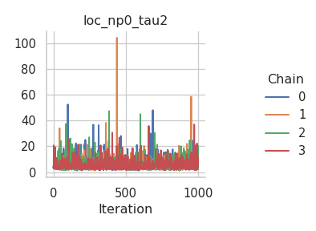
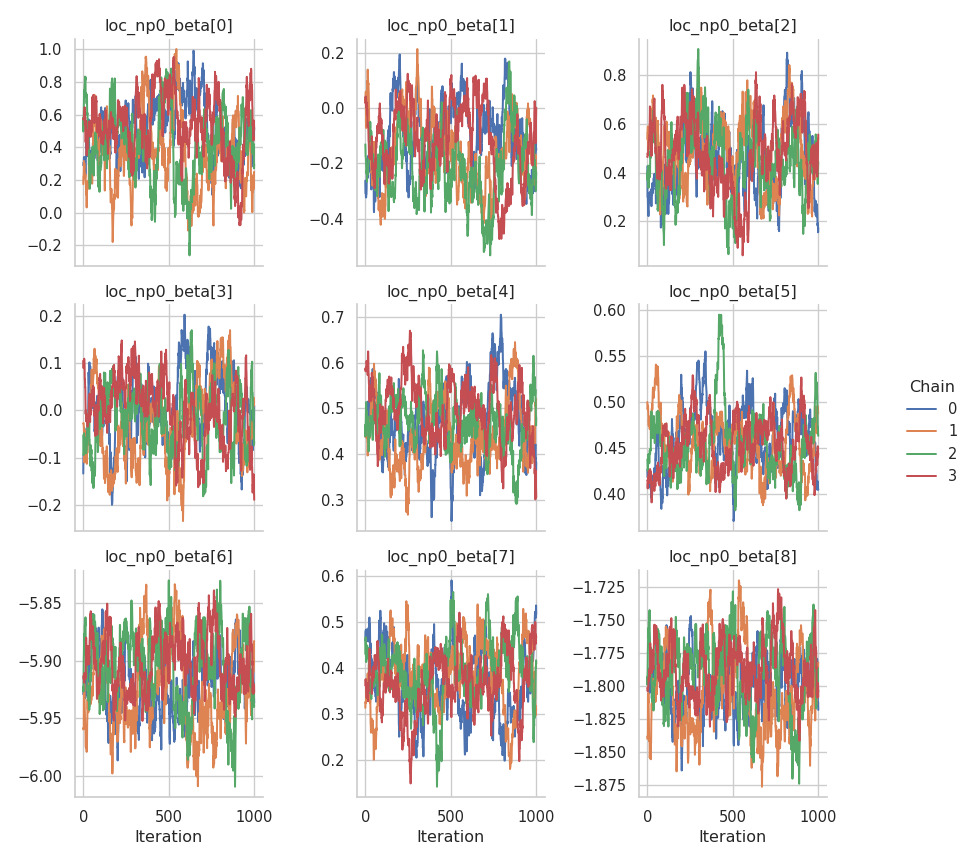

# GEV responses

In this tutorial, we illustrate how to set up a distributional
regression model with the generalized extreme value distribution as a
response distribution. First, we simulate some data in R:

- The location parameter ($\mu$) is a function of an intercept and a
  non-linear covariate effect.
- The scale parameter ($\sigma$) is a function of an intercept and a
  linear effect and uses a log-link.
- The shape or concentration parameter ($\xi$) is a function of an
  intercept and a linear effect.

After simulating the data, we can configure the model with a single call
to the `rliesel::liesel()` function.

``` r
library(rliesel)
library(VGAM)
```

    Loading required package: stats4

    Loading required package: splines

``` r
set.seed(13)

n <- 1000

x0 <- runif(n)
x1 <- runif(n)
x2 <- runif(n)

y <- rgev(
  n,
  location = 0 + sin(2 * pi * x0),
  scale = exp(-3 + x1),
  shape = 0.1 + x2
)

plot(y)
```


``` r
model <- liesel(
  response = y,
  distribution = "GeneralizedExtremeValue",
  predictors = list(
    loc = predictor(~ s(x0)),
    scale = predictor(~ x1, inverse_link = "Exp"),
    concentration = predictor(~ x2)
  )
)
```

    Response 'y' found in environment, but not data, using environment.

Now, we can continue in Python and use the `lsl.dist_reg_mcmc()`
function to set up a sampling algorithm with IWLS kernels for the
regression coefficients ($\boldsymbol{\beta}$) and a Gibbs kernel for
the smoothing parameter ($\tau^2$) of the spline.

The support of the GEV distribution changes with the parameter values
(compare
[Wikipedia](https://en.wikipedia.org/wiki/Generalized_extreme_value_distribution)).
To ensure that the initial parameters support the observed data we set
$xi = 0.1$ and disable jittering of the variance and regression
parameters.

``` python
import liesel.model as lsl
import jax.numpy as jnp

model = r.model

# concentration == 0.0 seems to break the sampler
model.vars["concentration_p0_beta"].value = jnp.array([0.1, 0.0])

builder = lsl.dist_reg_mcmc(model, seed=42, num_chains=4, apply_jitter=False)
builder.set_duration(warmup_duration=1000, posterior_duration=1000)

engine = builder.build()
engine.sample_all_epochs()
```


      0%|                                                  | 0/3 [00:00<?, ?chunk/s]
     33%|##############                            | 1/3 [00:10<00:21, 10.96s/chunk]
    100%|##########################################| 3/3 [00:10<00:00,  3.66s/chunk]

      0%|                                                  | 0/1 [00:00<?, ?chunk/s]
    100%|#########################################| 1/1 [00:00<00:00, 741.83chunk/s]

      0%|                                                  | 0/2 [00:00<?, ?chunk/s]
    100%|#########################################| 2/2 [00:00<00:00, 813.40chunk/s]

      0%|                                                  | 0/4 [00:00<?, ?chunk/s]
    100%|#########################################| 4/4 [00:00<00:00, 914.04chunk/s]

      0%|                                                  | 0/8 [00:00<?, ?chunk/s]
    100%|#########################################| 8/8 [00:00<00:00, 218.63chunk/s]

      0%|                                                 | 0/20 [00:00<?, ?chunk/s]
     50%|####################                    | 10/20 [00:00<00:00, 98.72chunk/s]
    100%|########################################| 20/20 [00:00<00:00, 42.93chunk/s]
    100%|########################################| 20/20 [00:00<00:00, 46.88chunk/s]

      0%|                                                  | 0/2 [00:00<?, ?chunk/s]
    100%|#########################################| 2/2 [00:00<00:00, 872.54chunk/s]

      0%|                                                 | 0/40 [00:00<?, ?chunk/s]
     25%|##########                              | 10/40 [00:00<00:00, 97.11chunk/s]
     50%|####################                    | 20/40 [00:00<00:00, 42.14chunk/s]
     65%|##########################              | 26/40 [00:00<00:00, 37.27chunk/s]
     78%|###############################         | 31/40 [00:00<00:00, 34.95chunk/s]
     88%|###################################     | 35/40 [00:00<00:00, 33.73chunk/s]
     98%|####################################### | 39/40 [00:01<00:00, 32.85chunk/s]
    100%|########################################| 40/40 [00:01<00:00, 36.61chunk/s]

Some tabular summary statistics of the posterior samples:

``` python
import liesel.goose as gs

results = engine.get_results()
gs.Summary(results)
```

<p>

<strong>Parameter summary:</strong>
</p>

<table border="0" class="dataframe">

<thead>

<tr style="text-align: right;">

<th>

</th>

<th>

</th>

<th>

kernel
</th>

<th>

mean
</th>

<th>

sd
</th>

<th>

q_0.05
</th>

<th>

q_0.5
</th>

<th>

q_0.95
</th>

<th>

sample_size
</th>

<th>

ess_bulk
</th>

<th>

ess_tail
</th>

<th>

rhat
</th>

</tr>

<tr>

<th>

parameter
</th>

<th>

index
</th>

<th>

</th>

<th>

</th>

<th>

</th>

<th>

</th>

<th>

</th>

<th>

</th>

<th>

</th>

<th>

</th>

<th>

</th>

<th>

</th>

</tr>

</thead>

<tbody>

<tr>

<th rowspan="2" valign="top">

concentration_p0_beta
</th>

<th>

(0,)
</th>

<td>

kernel_00
</td>

<td>

0.104
</td>

<td>

0.054
</td>

<td>

0.017
</td>

<td>

0.103
</td>

<td>

0.192
</td>

<td>

4000
</td>

<td>

341.243
</td>

<td>

889.891
</td>

<td>

1.003
</td>

</tr>

<tr>

<th>

(1,)
</th>

<td>

kernel_00
</td>

<td>

0.963
</td>

<td>

0.100
</td>

<td>

0.794
</td>

<td>

0.967
</td>

<td>

1.125
</td>

<td>

4000
</td>

<td>

194.785
</td>

<td>

586.639
</td>

<td>

1.013
</td>

</tr>

<tr>

<th rowspan="9" valign="top">

loc_np0_beta
</th>

<th>

(0,)
</th>

<td>

kernel_03
</td>

<td>

0.457
</td>

<td>

0.208
</td>

<td>

0.089
</td>

<td>

0.458
</td>

<td>

0.800
</td>

<td>

4000
</td>

<td>

38.319
</td>

<td>

135.561
</td>

<td>

1.086
</td>

</tr>

<tr>

<th>

(1,)
</th>

<td>

kernel_03
</td>

<td>

-0.146
</td>

<td>

0.131
</td>

<td>

-0.356
</td>

<td>

-0.150
</td>

<td>

0.068
</td>

<td>

4000
</td>

<td>

49.800
</td>

<td>

102.754
</td>

<td>

1.090
</td>

</tr>

<tr>

<th>

(2,)
</th>

<td>

kernel_03
</td>

<td>

0.469
</td>

<td>

0.141
</td>

<td>

0.234
</td>

<td>

0.470
</td>

<td>

0.695
</td>

<td>

4000
</td>

<td>

79.906
</td>

<td>

136.404
</td>

<td>

1.029
</td>

</tr>

<tr>

<th>

(3,)
</th>

<td>

kernel_03
</td>

<td>

-0.009
</td>

<td>

0.073
</td>

<td>

-0.133
</td>

<td>

-0.006
</td>

<td>

0.108
</td>

<td>

4000
</td>

<td>

43.256
</td>

<td>

142.002
</td>

<td>

1.103
</td>

</tr>

<tr>

<th>

(4,)
</th>

<td>

kernel_03
</td>

<td>

0.471
</td>

<td>

0.070
</td>

<td>

0.360
</td>

<td>

0.470
</td>

<td>

0.589
</td>

<td>

4000
</td>

<td>

60.153
</td>

<td>

108.895
</td>

<td>

1.077
</td>

</tr>

<tr>

<th>

(5,)
</th>

<td>

kernel_03
</td>

<td>

0.457
</td>

<td>

0.031
</td>

<td>

0.411
</td>

<td>

0.456
</td>

<td>

0.512
</td>

<td>

4000
</td>

<td>

80.812
</td>

<td>

133.592
</td>

<td>

1.027
</td>

</tr>

<tr>

<th>

(6,)
</th>

<td>

kernel_03
</td>

<td>

-5.913
</td>

<td>

0.031
</td>

<td>

-5.965
</td>

<td>

-5.914
</td>

<td>

-5.863
</td>

<td>

4000
</td>

<td>

80.313
</td>

<td>

150.120
</td>

<td>

1.069
</td>

</tr>

<tr>

<th>

(7,)
</th>

<td>

kernel_03
</td>

<td>

0.378
</td>

<td>

0.070
</td>

<td>

0.251
</td>

<td>

0.380
</td>

<td>

0.488
</td>

<td>

4000
</td>

<td>

80.528
</td>

<td>

174.632
</td>

<td>

1.046
</td>

</tr>

<tr>

<th>

(8,)
</th>

<td>

kernel_03
</td>

<td>

-1.795
</td>

<td>

0.026
</td>

<td>

-1.839
</td>

<td>

-1.796
</td>

<td>

-1.754
</td>

<td>

4000
</td>

<td>

83.554
</td>

<td>

167.150
</td>

<td>

1.064
</td>

</tr>

<tr>

<th>

loc_np0_tau2
</th>

<th>

()
</th>

<td>

kernel_02
</td>

<td>

5.968
</td>

<td>

4.376
</td>

<td>

2.278
</td>

<td>

4.943
</td>

<td>

12.870
</td>

<td>

4000
</td>

<td>

3613.099
</td>

<td>

3848.888
</td>

<td>

1.001
</td>

</tr>

<tr>

<th>

loc_p0_beta
</th>

<th>

(0,)
</th>

<td>

kernel_04
</td>

<td>

-0.027
</td>

<td>

0.002
</td>

<td>

-0.030
</td>

<td>

-0.027
</td>

<td>

-0.023
</td>

<td>

4000
</td>

<td>

107.037
</td>

<td>

423.009
</td>

<td>

1.045
</td>

</tr>

<tr>

<th rowspan="2" valign="top">

scale_p0_beta
</th>

<th>

(0,)
</th>

<td>

kernel_01
</td>

<td>

-3.093
</td>

<td>

0.058
</td>

<td>

-3.190
</td>

<td>

-3.090
</td>

<td>

-3.001
</td>

<td>

4000
</td>

<td>

167.919
</td>

<td>

416.025
</td>

<td>

1.050
</td>

</tr>

<tr>

<th>

(1,)
</th>

<td>

kernel_01
</td>

<td>

1.197
</td>

<td>

0.081
</td>

<td>

1.066
</td>

<td>

1.194
</td>

<td>

1.333
</td>

<td>

4000
</td>

<td>

157.310
</td>

<td>

413.216
</td>

<td>

1.041
</td>

</tr>

</tbody>

</table>

<p>

<strong>Error summary:</strong>
</p>

<table border="0" class="dataframe">

<thead>

<tr style="text-align: right;">

<th>

</th>

<th>

</th>

<th>

</th>

<th>

</th>

<th>

count
</th>

<th>

relative
</th>

</tr>

<tr>

<th>

kernel
</th>

<th>

error_code
</th>

<th>

error_msg
</th>

<th>

phase
</th>

<th>

</th>

<th>

</th>

</tr>

</thead>

<tbody>

<tr>

<th rowspan="2" valign="top">

kernel_00
</th>

<th rowspan="2" valign="top">

90
</th>

<th rowspan="2" valign="top">

nan acceptance prob
</th>

<th>

warmup
</th>

<td>

72
</td>

<td>

0.018
</td>

</tr>

<tr>

<th>

posterior
</th>

<td>

2
</td>

<td>

0.001
</td>

</tr>

<tr>

<th rowspan="2" valign="top">

kernel_01
</th>

<th rowspan="2" valign="top">

90
</th>

<th rowspan="2" valign="top">

nan acceptance prob
</th>

<th>

warmup
</th>

<td>

40
</td>

<td>

0.010
</td>

</tr>

<tr>

<th>

posterior
</th>

<td>

0
</td>

<td>

0.000
</td>

</tr>

<tr>

<th rowspan="2" valign="top">

kernel_03
</th>

<th rowspan="2" valign="top">

90
</th>

<th rowspan="2" valign="top">

nan acceptance prob
</th>

<th>

warmup
</th>

<td>

25
</td>

<td>

0.006
</td>

</tr>

<tr>

<th>

posterior
</th>

<td>

0
</td>

<td>

0.000
</td>

</tr>

<tr>

<th rowspan="2" valign="top">

kernel_04
</th>

<th rowspan="2" valign="top">

90
</th>

<th rowspan="2" valign="top">

nan acceptance prob
</th>

<th>

warmup
</th>

<td>

21
</td>

<td>

0.005
</td>

</tr>

<tr>

<th>

posterior
</th>

<td>

0
</td>

<td>

0.000
</td>

</tr>

</tbody>

</table>

And the corresponding trace plots:

``` python
fig = gs.plot_trace(results, "loc_p0_beta")
```


``` python
fig = gs.plot_trace(results, "loc_np0_tau2")
```



``` python
fig = gs.plot_trace(results, "loc_np0_beta")
```



``` python
fig = gs.plot_trace(results, "scale_p0_beta")
```


``` python
fig = gs.plot_trace(results, "concentration_p0_beta")
```


We need to reset the index of the summary data frame before we can
transfer it to R.

``` python
summary = gs.Summary(results).to_dataframe().reset_index()
```

After transferring the summary data frame to R, we can process it with
packages like dplyr and ggplot2. Here is a visualization of the
estimated spline vs. the true function:

``` r
library(dplyr)
```


    Attaching package: 'dplyr'

    The following objects are masked from 'package:stats':

        filter, lag

    The following objects are masked from 'package:base':

        intersect, setdiff, setequal, union

``` r
library(ggplot2)
library(reticulate)

summary <- py$summary

beta <- summary %>%
  filter(variable == "loc_np0_beta") %>%
  group_by(var_index) %>%
  summarize(mean = mean(mean)) %>%
  ungroup()

beta <- beta$mean
X <- py_to_r(model$vars["loc_np0_X"]$value)
estimate <- X %*% beta

true <- sin(2 * pi * x0)

ggplot(data.frame(x0 = x0, estimate = estimate, true = true)) +
  geom_line(aes(x0, estimate), color = palette()[2]) +
  geom_line(aes(x0, true), color = palette()[4]) +
  ggtitle("Estimated spline (red) vs. true function (blue)") +
  ylab("f") +
  theme_minimal()
```


