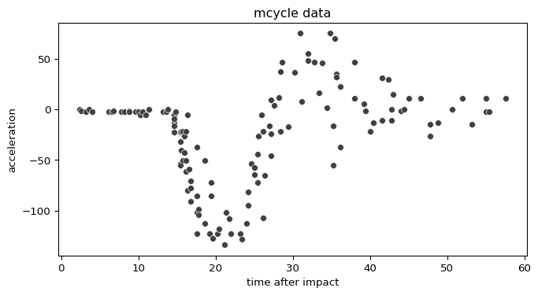
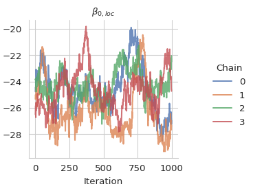
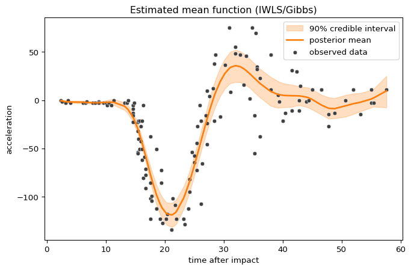
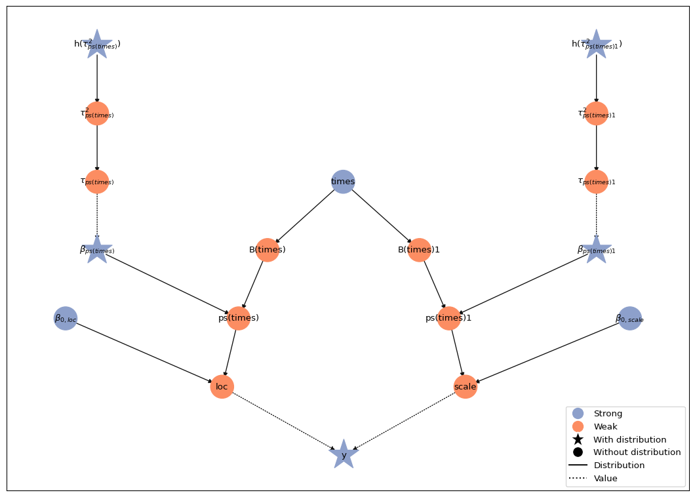
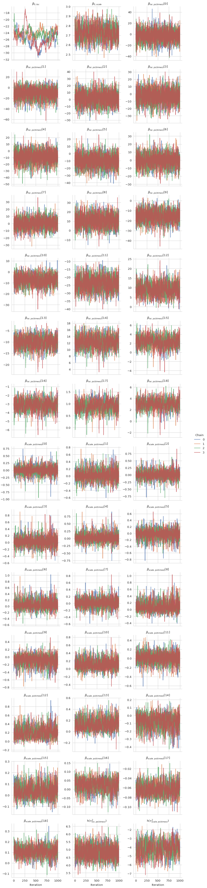

# Comparing samplers


In this tutorial, we compare two different sampling schemes on the
`mcycle` dataset with a Gaussian location-scale regression model and two
splines for the mean and the standard deviation. The `mcycle` dataset is
a “data frame giving a series of measurements of head acceleration in a
simulated motorcycle accident, used to test crash helmets” (from the
help page). It contains the following two variables:

- `times`: in milliseconds after impact
- `accel`: in g

We set up the model in Python with
[Liesel-GAM](https://github.com/liesel-devs/liesel_gam), using
{class}`liesel_gam.TermBuilder` for the P-spline terms. See the
[Liesel-GAM documentation and
examples](https://github.com/liesel-devs/liesel_gam#readme) for more
information about additive terms and predictors. We load the data set
from R with [ryp](https://github.com/Wainberg/ryp) and then continue
with a pure Python model specification and sampling workflow.

``` python
from pathlib import Path

import jax.numpy as jnp
import matplotlib.pyplot as plt
import numpy as np
import seaborn as sns
import tensorflow_probability.substrates.jax.bijectors as tfb
import tensorflow_probability.substrates.jax.distributions as tfd

import liesel.goose as gs
import liesel.model as lsl
import liesel_gam as gam
from ryp import r, to_py
```

We start by loading the data set from the R package `MASS` and
converting it to a pandas data frame.

``` python
r("library(MASS)")
r("data(mcycle); mcycle <- as.data.frame(mcycle)")

mcycle = to_py("mcycle", format="pandas")
```

``` python
fig, ax = plt.subplots(figsize=(8, 4))
sns.scatterplot(data=mcycle, x="times", y="accel", color="0.25", s=35, ax=ax)
ax.set(xlabel="time after impact", ylabel="acceleration", title="mcycle data")
plt.show()
```



Next, we build the Gaussian location-scale model. Both distributional
parameters use an additive predictor with an intercept and a P-spline in
`times`. The scale predictor uses an exponential inverse link to keep
the standard deviation positive. The `TermBuilder` is initialized with
an IWLS MCMC specification, so the P-spline regression coefficients are
sampled with IWLS kernels by default. The additive predictor intercepts
also use their default IWLS inference specification. The smoothing
variances of the P-splines receive Gibbs kernels automatically.

``` python
tb = gam.TermBuilder.from_df(mcycle, default_inference=gs.MCMCSpec(gs.IWLSKernel))

loc = gam.AdditivePredictor("loc")
scale = gam.AdditivePredictor("scale", inv_link=jnp.exp)

loc_smooth = tb.ps("times", k=20, prefix="loc.")
scale_smooth = tb.ps("times", k=20, prefix="scale.")

loc += loc_smooth
scale += scale_smooth

response_dist = lsl.Dist(tfd.Normal, loc=loc, scale=scale)
y = lsl.Var.new_obs(mcycle["accel"], response_dist, name="y")
model = lsl.Model(y)
```

## Metropolis-in-Gibbs

First, we run the model with the inference specifications attached
during model construction. This gives a Metropolis-in-Gibbs sampling
scheme with IWLS kernels for the regression coefficients
($\boldsymbol{\beta}$) and Gibbs kernels for the smoothing variances
($\tau^2$) of the splines.

``` python
iwls_results = gs.LieselMCMC(model).run_for_epochs(
    seed=1, num_chains=4, adaptation=1000, posterior=10000, posterior_thinning=10, show_progress=False
)
```

    liesel.goose.builder - WARNING - No jitter functions provided for position keys '$\\beta_{loc.ps(times)}$', '$\\beta_{scale.ps(times)}$', '$\\tau_{loc.ps(times)}^2$', '$\\beta_{0,loc}$', '$\\tau_{scale.ps(times)}^2$', '$\\beta_{0,scale}$'. The initial values for these keys won't be jittered
    liesel.goose.engine - INFO - Initializing kernels...
    liesel.goose.engine - INFO - Done
    liesel.goose.engine - INFO - Finished warmup

Clearly, the performance of the sampler could be better, especially for
the intercept of the mean. The corresponding chain exhibits a very
strong autocorrelation.

``` python
gs.Summary(iwls_results)
```

<p>

<strong>Parameter summary:</strong>
</p>

<table border="0" class="dataframe">

<thead>

<tr style="text-align: right;">

<th>

</th>

<th>

</th>

<th>

kernel
</th>

<th>

mean
</th>

<th>

sd
</th>

<th>

q_0.05
</th>

<th>

q_0.5
</th>

<th>

q_0.95
</th>

<th>

sample_size
</th>

<th>

ess_bulk
</th>

<th>

ess_tail
</th>

<th>

rhat
</th>

</tr>

<tr>

<th>

parameter
</th>

<th>

index
</th>

<th>

</th>

<th>

</th>

<th>

</th>

<th>

</th>

<th>

</th>

<th>

</th>

<th>

</th>

<th>

</th>

<th>

</th>

<th>

</th>

</tr>

</thead>

<tbody>

<tr>

<th>

$\beta_{0,loc}$
</th>

<th>

()
</th>

<td>

kernel_03
</td>

<td>

-25.231
</td>

<td>

1.982
</td>

<td>

-28.440
</td>

<td>

-25.266
</td>

<td>

-21.932
</td>

<td>

4000
</td>

<td>

91.735
</td>

<td>

99.749
</td>

<td>

1.043
</td>

</tr>

<tr>

<th>

$\beta_{0,scale}$
</th>

<th>

()
</th>

<td>

kernel_05
</td>

<td>

2.724
</td>

<td>

0.075
</td>

<td>

2.601
</td>

<td>

2.723
</td>

<td>

2.853
</td>

<td>

4000
</td>

<td>

1240.162
</td>

<td>

2309.053
</td>

<td>

1.002
</td>

</tr>

<tr>

<th rowspan="19" valign="top">

$\beta_{loc.ps(times)}$
</th>

<th>

(0,)
</th>

<td>

kernel_00
</td>

<td>

2.389
</td>

<td>

10.804
</td>

<td>

-15.710
</td>

<td>

2.433
</td>

<td>

19.814
</td>

<td>

4000
</td>

<td>

2745.445
</td>

<td>

3217.044
</td>

<td>

1.000
</td>

</tr>

<tr>

<th>

(1,)
</th>

<td>

kernel_00
</td>

<td>

11.079
</td>

<td>

10.199
</td>

<td>

-4.826
</td>

<td>

10.582
</td>

<td>

28.691
</td>

<td>

4000
</td>

<td>

2502.842
</td>

<td>

3212.205
</td>

<td>

1.000
</td>

</tr>

<tr>

<th>

(2,)
</th>

<td>

kernel_00
</td>

<td>

1.566
</td>

<td>

9.327
</td>

<td>

-13.700
</td>

<td>

1.507
</td>

<td>

17.078
</td>

<td>

4000
</td>

<td>

2734.069
</td>

<td>

3514.793
</td>

<td>

1.000
</td>

</tr>

<tr>

<th>

(3,)
</th>

<td>

kernel_00
</td>

<td>

-3.259
</td>

<td>

8.896
</td>

<td>

-18.092
</td>

<td>

-3.024
</td>

<td>

10.990
</td>

<td>

4000
</td>

<td>

3171.874
</td>

<td>

3456.306
</td>

<td>

1.001
</td>

</tr>

<tr>

<th>

(4,)
</th>

<td>

kernel_00
</td>

<td>

-9.310
</td>

<td>

8.856
</td>

<td>

-24.442
</td>

<td>

-9.072
</td>

<td>

4.528
</td>

<td>

4000
</td>

<td>

3452.395
</td>

<td>

3637.538
</td>

<td>

1.001
</td>

</tr>

<tr>

<th>

(5,)
</th>

<td>

kernel_00
</td>

<td>

-10.120
</td>

<td>

8.434
</td>

<td>

-24.343
</td>

<td>

-9.852
</td>

<td>

3.212
</td>

<td>

4000
</td>

<td>

2684.143
</td>

<td>

3569.892
</td>

<td>

1.001
</td>

</tr>

<tr>

<th>

(6,)
</th>

<td>

kernel_00
</td>

<td>

0.110
</td>

<td>

7.682
</td>

<td>

-12.099
</td>

<td>

-0.028
</td>

<td>

12.989
</td>

<td>

4000
</td>

<td>

2973.361
</td>

<td>

2888.397
</td>

<td>

1.003
</td>

</tr>

<tr>

<th>

(7,)
</th>

<td>

kernel_00
</td>

<td>

-0.425
</td>

<td>

7.055
</td>

<td>

-12.029
</td>

<td>

-0.529
</td>

<td>

11.258
</td>

<td>

4000
</td>

<td>

3317.425
</td>

<td>

3522.206
</td>

<td>

1.000
</td>

</tr>

<tr>

<th>

(8,)
</th>

<td>

kernel_00
</td>

<td>

10.682
</td>

<td>

6.637
</td>

<td>

-0.434
</td>

<td>

10.657
</td>

<td>

21.660
</td>

<td>

4000
</td>

<td>

3410.736
</td>

<td>

3716.644
</td>

<td>

1.000
</td>

</tr>

<tr>

<th>

(9,)
</th>

<td>

kernel_00
</td>

<td>

-15.615
</td>

<td>

5.729
</td>

<td>

-25.140
</td>

<td>

-15.519
</td>

<td>

-6.263
</td>

<td>

4000
</td>

<td>

2888.242
</td>

<td>

2849.860
</td>

<td>

1.001
</td>

</tr>

<tr>

<th>

(10,)
</th>

<td>

kernel_00
</td>

<td>

7.597
</td>

<td>

4.886
</td>

<td>

-0.181
</td>

<td>

7.516
</td>

<td>

15.832
</td>

<td>

4000
</td>

<td>

2699.041
</td>

<td>

3273.765
</td>

<td>

1.001
</td>

</tr>

<tr>

<th>

(11,)
</th>

<td>

kernel_00
</td>

<td>

-23.715
</td>

<td>

4.428
</td>

<td>

-31.150
</td>

<td>

-23.687
</td>

<td>

-16.500
</td>

<td>

4000
</td>

<td>

3119.502
</td>

<td>

3535.451
</td>

<td>

1.000
</td>

</tr>

<tr>

<th>

(12,)
</th>

<td>

kernel_00
</td>

<td>

9.336
</td>

<td>

3.280
</td>

<td>

4.172
</td>

<td>

9.334
</td>

<td>

14.651
</td>

<td>

4000
</td>

<td>

3325.456
</td>

<td>

3589.285
</td>

<td>

1.001
</td>

</tr>

<tr>

<th>

(13,)
</th>

<td>

kernel_00
</td>

<td>

-10.207
</td>

<td>

2.583
</td>

<td>

-14.431
</td>

<td>

-10.168
</td>

<td>

-6.068
</td>

<td>

4000
</td>

<td>

3216.028
</td>

<td>

3244.630
</td>

<td>

1.001
</td>

</tr>

<tr>

<th>

(14,)
</th>

<td>

kernel_00
</td>

<td>

12.242
</td>

<td>

1.877
</td>

<td>

9.184
</td>

<td>

12.259
</td>

<td>

15.173
</td>

<td>

4000
</td>

<td>

3356.569
</td>

<td>

3364.785
</td>

<td>

1.001
</td>

</tr>

<tr>

<th>

(15,)
</th>

<td>

kernel_00
</td>

<td>

2.242
</td>

<td>

1.235
</td>

<td>

0.189
</td>

<td>

2.249
</td>

<td>

4.188
</td>

<td>

4000
</td>

<td>

1827.116
</td>

<td>

2513.063
</td>

<td>

1.003
</td>

</tr>

<tr>

<th>

(16,)
</th>

<td>

kernel_00
</td>

<td>

-3.139
</td>

<td>

0.646
</td>

<td>

-4.195
</td>

<td>

-3.124
</td>

<td>

-2.139
</td>

<td>

4000
</td>

<td>

3279.625
</td>

<td>

3283.467
</td>

<td>

1.001
</td>

</tr>

<tr>

<th>

(17,)
</th>

<td>

kernel_00
</td>

<td>

0.912
</td>

<td>

0.242
</td>

<td>

0.524
</td>

<td>

0.919
</td>

<td>

1.291
</td>

<td>

4000
</td>

<td>

943.454
</td>

<td>

2046.986
</td>

<td>

1.004
</td>

</tr>

<tr>

<th>

(18,)
</th>

<td>

kernel_00
</td>

<td>

2.983
</td>

<td>

0.925
</td>

<td>

1.523
</td>

<td>

3.007
</td>

<td>

4.375
</td>

<td>

4000
</td>

<td>

3234.198
</td>

<td>

2806.174
</td>

<td>

1.002
</td>

</tr>

<tr>

<th rowspan="19" valign="top">

$\beta_{scale.ps(times)}$
</th>

<th>

(0,)
</th>

<td>

kernel_01
</td>

<td>

0.011
</td>

<td>

0.145
</td>

<td>

-0.213
</td>

<td>

0.005
</td>

<td>

0.256
</td>

<td>

4000
</td>

<td>

1157.099
</td>

<td>

1448.394
</td>

<td>

1.005
</td>

</tr>

<tr>

<th>

(1,)
</th>

<td>

kernel_01
</td>

<td>

-0.024
</td>

<td>

0.149
</td>

<td>

-0.280
</td>

<td>

-0.016
</td>

<td>

0.198
</td>

<td>

4000
</td>

<td>

1200.021
</td>

<td>

1000.396
</td>

<td>

1.005
</td>

</tr>

<tr>

<th>

(2,)
</th>

<td>

kernel_01
</td>

<td>

0.006
</td>

<td>

0.142
</td>

<td>

-0.215
</td>

<td>

0.002
</td>

<td>

0.238
</td>

<td>

4000
</td>

<td>

1351.423
</td>

<td>

1157.364
</td>

<td>

1.005
</td>

</tr>

<tr>

<th>

(3,)
</th>

<td>

kernel_01
</td>

<td>

0.026
</td>

<td>

0.142
</td>

<td>

-0.194
</td>

<td>

0.022
</td>

<td>

0.264
</td>

<td>

4000
</td>

<td>

1183.395
</td>

<td>

1030.918
</td>

<td>

1.006
</td>

</tr>

<tr>

<th>

(4,)
</th>

<td>

kernel_01
</td>

<td>

0.031
</td>

<td>

0.146
</td>

<td>

-0.191
</td>

<td>

0.022
</td>

<td>

0.284
</td>

<td>

4000
</td>

<td>

1099.421
</td>

<td>

722.438
</td>

<td>

1.007
</td>

</tr>

<tr>

<th>

(5,)
</th>

<td>

kernel_01
</td>

<td>

-0.033
</td>

<td>

0.144
</td>

<td>

-0.272
</td>

<td>

-0.025
</td>

<td>

0.191
</td>

<td>

4000
</td>

<td>

1001.900
</td>

<td>

985.622
</td>

<td>

1.005
</td>

</tr>

<tr>

<th>

(6,)
</th>

<td>

kernel_01
</td>

<td>

-0.056
</td>

<td>

0.145
</td>

<td>

-0.309
</td>

<td>

-0.043
</td>

<td>

0.159
</td>

<td>

4000
</td>

<td>

1086.999
</td>

<td>

1004.761
</td>

<td>

1.003
</td>

</tr>

<tr>

<th>

(7,)
</th>

<td>

kernel_01
</td>

<td>

-0.017
</td>

<td>

0.133
</td>

<td>

-0.238
</td>

<td>

-0.015
</td>

<td>

0.196
</td>

<td>

4000
</td>

<td>

1058.990
</td>

<td>

1067.830
</td>

<td>

1.007
</td>

</tr>

<tr>

<th>

(8,)
</th>

<td>

kernel_01
</td>

<td>

0.103
</td>

<td>

0.147
</td>

<td>

-0.100
</td>

<td>

0.080
</td>

<td>

0.374
</td>

<td>

4000
</td>

<td>

664.293
</td>

<td>

1027.972
</td>

<td>

1.011
</td>

</tr>

<tr>

<th>

(9,)
</th>

<td>

kernel_01
</td>

<td>

-0.094
</td>

<td>

0.133
</td>

<td>

-0.324
</td>

<td>

-0.081
</td>

<td>

0.095
</td>

<td>

4000
</td>

<td>

870.111
</td>

<td>

1235.133
</td>

<td>

1.005
</td>

</tr>

<tr>

<th>

(10,)
</th>

<td>

kernel_01
</td>

<td>

-0.116
</td>

<td>

0.120
</td>

<td>

-0.323
</td>

<td>

-0.108
</td>

<td>

0.059
</td>

<td>

4000
</td>

<td>

1030.726
</td>

<td>

1390.782
</td>

<td>

1.004
</td>

</tr>

<tr>

<th>

(11,)
</th>

<td>

kernel_01
</td>

<td>

0.008
</td>

<td>

0.112
</td>

<td>

-0.169
</td>

<td>

0.011
</td>

<td>

0.185
</td>

<td>

4000
</td>

<td>

1044.794
</td>

<td>

1269.849
</td>

<td>

1.004
</td>

</tr>

<tr>

<th>

(12,)
</th>

<td>

kernel_01
</td>

<td>

0.202
</td>

<td>

0.126
</td>

<td>

0.027
</td>

<td>

0.185
</td>

<td>

0.432
</td>

<td>

4000
</td>

<td>

435.379
</td>

<td>

606.760
</td>

<td>

1.011
</td>

</tr>

<tr>

<th>

(13,)
</th>

<td>

kernel_01
</td>

<td>

0.138
</td>

<td>

0.099
</td>

<td>

-0.009
</td>

<td>

0.131
</td>

<td>

0.306
</td>

<td>

4000
</td>

<td>

625.898
</td>

<td>

1139.024
</td>

<td>

1.003
</td>

</tr>

<tr>

<th>

(14,)
</th>

<td>

kernel_01
</td>

<td>

-0.079
</td>

<td>

0.085
</td>

<td>

-0.228
</td>

<td>

-0.072
</td>

<td>

0.046
</td>

<td>

4000
</td>

<td>

569.673
</td>

<td>

851.310
</td>

<td>

1.006
</td>

</tr>

<tr>

<th>

(15,)
</th>

<td>

kernel_01
</td>

<td>

0.044
</td>

<td>

0.056
</td>

<td>

-0.039
</td>

<td>

0.039
</td>

<td>

0.138
</td>

<td>

4000
</td>

<td>

676.537
</td>

<td>

1207.682
</td>

<td>

1.005
</td>

</tr>

<tr>

<th>

(16,)
</th>

<td>

kernel_01
</td>

<td>

0.026
</td>

<td>

0.032
</td>

<td>

-0.027
</td>

<td>

0.028
</td>

<td>

0.074
</td>

<td>

4000
</td>

<td>

582.852
</td>

<td>

778.132
</td>

<td>

1.014
</td>

</tr>

<tr>

<th>

(17,)
</th>

<td>

kernel_01
</td>

<td>

-0.063
</td>

<td>

0.012
</td>

<td>

-0.081
</td>

<td>

-0.064
</td>

<td>

-0.042
</td>

<td>

4000
</td>

<td>

657.701
</td>

<td>

1249.209
</td>

<td>

1.007
</td>

</tr>

<tr>

<th>

(18,)
</th>

<td>

kernel_01
</td>

<td>

0.111
</td>

<td>

0.048
</td>

<td>

0.033
</td>

<td>

0.111
</td>

<td>

0.191
</td>

<td>

4000
</td>

<td>

735.290
</td>

<td>

1102.061
</td>

<td>

1.013
</td>

</tr>

<tr>

<th>

$\tau_{loc.ps(times)}^2$
</th>

<th>

()
</th>

<td>

kernel_02
</td>

<td>

137.231
</td>

<td>

66.379
</td>

<td>

61.990
</td>

<td>

122.915
</td>

<td>

262.839
</td>

<td>

4000
</td>

<td>

2799.840
</td>

<td>

3249.357
</td>

<td>

1.000
</td>

</tr>

<tr>

<th>

$\tau_{scale.ps(times)}^2$
</th>

<th>

()
</th>

<td>

kernel_04
</td>

<td>

0.022
</td>

<td>

0.021
</td>

<td>

0.003
</td>

<td>

0.016
</td>

<td>

0.060
</td>

<td>

4000
</td>

<td>

303.019
</td>

<td>

492.178
</td>

<td>

1.021
</td>

</tr>

</tbody>

</table>

<p>

<strong>Acceptance probabilities:</strong>
</p>

<table border="0" class="dataframe">

<thead>

<tr style="text-align: right;">

<th>

</th>

<th>

</th>

<th>

</th>

<th>

acceptance_probability
</th>

<th>

position_moved
</th>

</tr>

<tr>

<th>

kernel
</th>

<th>

positions
</th>

<th>

phase
</th>

<th>

</th>

<th>

</th>

</tr>

</thead>

<tbody>

<tr>

<th rowspan="2" valign="top">

kernel_00
</th>

<th rowspan="2" valign="top">

$\beta_{loc.ps(times)}$
</th>

<th>

posterior
</th>

<td>

0.863
</td>

<td>

0.863
</td>

</tr>

<tr>

<th>

warmup
</th>

<td>

0.794
</td>

<td>

0.793
</td>

</tr>

<tr>

<th rowspan="2" valign="top">

kernel_01
</th>

<th rowspan="2" valign="top">

$\beta_{scale.ps(times)}$
</th>

<th>

posterior
</th>

<td>

0.847
</td>

<td>

0.848
</td>

</tr>

<tr>

<th>

warmup
</th>

<td>

0.793
</td>

<td>

0.790
</td>

</tr>

<tr>

<th rowspan="2" valign="top">

kernel_02
</th>

<th rowspan="2" valign="top">

$\tau_{loc.ps(times)}^2$
</th>

<th>

posterior
</th>

<td>

1.000
</td>

<td>

1.000
</td>

</tr>

<tr>

<th>

warmup
</th>

<td>

1.000
</td>

<td>

1.000
</td>

</tr>

<tr>

<th rowspan="2" valign="top">

kernel_03
</th>

<th rowspan="2" valign="top">

$\beta_{0,loc}$
</th>

<th>

posterior
</th>

<td>

0.922
</td>

<td>

0.923
</td>

</tr>

<tr>

<th>

warmup
</th>

<td>

0.923
</td>

<td>

0.927
</td>

</tr>

<tr>

<th rowspan="2" valign="top">

kernel_04
</th>

<th rowspan="2" valign="top">

$\tau_{scale.ps(times)}^2$
</th>

<th>

posterior
</th>

<td>

1.000
</td>

<td>

1.000
</td>

</tr>

<tr>

<th>

warmup
</th>

<td>

1.000
</td>

<td>

1.000
</td>

</tr>

<tr>

<th rowspan="2" valign="top">

kernel_05
</th>

<th rowspan="2" valign="top">

$\beta_{0,scale}$
</th>

<th>

posterior
</th>

<td>

0.906
</td>

<td>

0.905
</td>

</tr>

<tr>

<th>

warmup
</th>

<td>

0.912
</td>

<td>

0.909
</td>

</tr>

</tbody>

</table>

``` python
gs.plot_trace(iwls_results)
```



To confirm that the chains have converged to reasonable values, we plot
the posterior mean of the location predictor together with a 90%
credible interval:

``` python
def plot_loc_estimate(results, model, title):
    samples = results.get_posterior_samples()
    loc_samples = model.vars["loc"].predict(samples)
    loc_summary = gs.SamplesSummary.from_array(
        loc_samples,
        name="loc",
        which=["mean", "quantiles"],
    )
    loc_summary_df = loc_summary.to_dataframe().reset_index()

    loc_summary_df["times"] = mcycle["times"].to_numpy()
    plot_data = (
        loc_summary_df[["times", "mean", "q_0.05", "q_0.95"]]
        .groupby("times", as_index=False)
        .mean()
        .sort_values("times")
    )

    fig, ax = plt.subplots(figsize=(8, 5))
    ax.fill_between(
        plot_data["times"],
        plot_data["q_0.05"],
        plot_data["q_0.95"],
        color=sns.color_palette()[1],
        alpha=0.25,
        label="90% credible interval",
    )
    sns.lineplot(
        data=plot_data,
        x="times",
        y="mean",
        color=sns.color_palette()[1],
        linewidth=2,
        label="posterior mean",
        ax=ax,
    )
    sns.scatterplot(
        data=mcycle,
        x="times",
        y="accel",
        color="0.25",
        s=25,
        ax=ax,
        label="observed data",
    )
    ax.set(xlabel="time after impact", ylabel="acceleration", title=title)
    plt.show()


plot_loc_estimate(iwls_results, model, "Estimated mean function (IWLS/Gibbs)")
```



## NUTS sampler

As an alternative, we use NUTS kernels for the spline-specific parameter
blocks. The helper below copies the model graph, log-transforms the
smoothing variances by bijecting them with an exponential bijector, and
assigns one NUTS kernel group per additive term.

``` python
def strategy_term_blocked(
    model: lsl.Model, predictors: list[str], kernel_constructor, **kwargs
):
    model = model.copy()
    for k, v in model.parameters.items():
        if "tau" in k:
            v.biject(tfb.Exp(), inference="drop")

    for predictor_name in predictors:
        predictor = model.vars[predictor_name]
        if predictor.intercept:
            predictor.intercept.inference = gs.MCMCSpec(
                kernel_constructor, kernel_kwargs=kwargs
            )

        for term in predictor.terms.values():
            for param in model.parental_submodel(term).parameters.values():
                model.parameters[param.name].inference = gs.MCMCSpec(
                    kernel_constructor, kernel_group=term.name, kernel_kwargs=kwargs
                )

    return model
```

``` python
nuts_model = strategy_term_blocked(model, ["loc", "scale"], gs.NUTSKernel)
```

The resulting model contains transformed smoothing variances on the
unconstrained log scale. Here is the transformed model graph:

``` python
nuts_model.plot()
```



Now we can run the sampler from the `MCMCSpec` objects stored in the
model. In complex models like this one, it can be beneficial to sample
the parameters of each additive term in a separate NUTS block.

``` python
nuts_results = gs.LieselMCMC(nuts_model).run_for_epochs(
    seed=1, num_chains=4, adaptation=1000, posterior=1000, show_progress=False
)
```

    liesel.goose.builder - WARNING - No jitter functions provided for position keys '$\\beta_{loc.ps(times)}$', 'h($\\tau_{loc.ps(times)}^2$)', '$\\beta_{scale.ps(times)}$', 'h($\\tau_{scale.ps(times)}^2$)', '$\\beta_{0,loc}$', '$\\beta_{0,scale}$'. The initial values for these keys won't be jittered
    liesel.goose.engine - INFO - Initializing kernels...
    liesel.goose.engine - INFO - Done
    liesel.goose.engine - INFO - Finished warmup

The blocked NUTS strategy overall seems to do a good job and can yield
higher effective sample sizes than the IWLS sampler, especially for the
spline coefficients of the scale model.

``` python
gs.Summary(nuts_results)
```

<p>

<strong>Parameter summary:</strong>
</p>

<table border="0" class="dataframe">

<thead>

<tr style="text-align: right;">

<th>

</th>

<th>

</th>

<th>

kernel
</th>

<th>

mean
</th>

<th>

sd
</th>

<th>

q_0.05
</th>

<th>

q_0.5
</th>

<th>

q_0.95
</th>

<th>

sample_size
</th>

<th>

ess_bulk
</th>

<th>

ess_tail
</th>

<th>

rhat
</th>

</tr>

<tr>

<th>

parameter
</th>

<th>

index
</th>

<th>

</th>

<th>

</th>

<th>

</th>

<th>

</th>

<th>

</th>

<th>

</th>

<th>

</th>

<th>

</th>

<th>

</th>

<th>

</th>

</tr>

</thead>

<tbody>

<tr>

<th>

$\beta_{0,loc}$
</th>

<th>

()
</th>

<td>

kernel_02
</td>

<td>

-25.157
</td>

<td>

2.255
</td>

<td>

-29.277
</td>

<td>

-25.095
</td>

<td>

-21.618
</td>

<td>

4000
</td>

<td>

13.116
</td>

<td>

15.298
</td>

<td>

1.240
</td>

</tr>

<tr>

<th>

$\beta_{0,scale}$
</th>

<th>

()
</th>

<td>

kernel_03
</td>

<td>

2.723
</td>

<td>

0.076
</td>

<td>

2.603
</td>

<td>

2.720
</td>

<td>

2.851
</td>

<td>

4000
</td>

<td>

675.615
</td>

<td>

1260.077
</td>

<td>

1.004
</td>

</tr>

<tr>

<th rowspan="19" valign="top">

$\beta_{loc.ps(times)}$
</th>

<th>

(0,)
</th>

<td>

kernel_00
</td>

<td>

2.682
</td>

<td>

10.627
</td>

<td>

-14.695
</td>

<td>

2.687
</td>

<td>

19.847
</td>

<td>

4000
</td>

<td>

4064.084
</td>

<td>

2753.618
</td>

<td>

1.001
</td>

</tr>

<tr>

<th>

(1,)
</th>

<td>

kernel_00
</td>

<td>

11.372
</td>

<td>

10.339
</td>

<td>

-4.712
</td>

<td>

10.733
</td>

<td>

29.440
</td>

<td>

4000
</td>

<td>

2718.144
</td>

<td>

2039.869
</td>

<td>

1.003
</td>

</tr>

<tr>

<th>

(2,)
</th>

<td>

kernel_00
</td>

<td>

1.461
</td>

<td>

9.325
</td>

<td>

-14.031
</td>

<td>

1.412
</td>

<td>

16.753
</td>

<td>

4000
</td>

<td>

3319.317
</td>

<td>

2426.635
</td>

<td>

1.002
</td>

</tr>

<tr>

<th>

(3,)
</th>

<td>

kernel_00
</td>

<td>

-3.353
</td>

<td>

8.916
</td>

<td>

-17.948
</td>

<td>

-3.249
</td>

<td>

11.335
</td>

<td>

4000
</td>

<td>

3185.618
</td>

<td>

2749.068
</td>

<td>

1.002
</td>

</tr>

<tr>

<th>

(4,)
</th>

<td>

kernel_00
</td>

<td>

-9.362
</td>

<td>

8.880
</td>

<td>

-24.667
</td>

<td>

-9.085
</td>

<td>

4.699
</td>

<td>

4000
</td>

<td>

3058.779
</td>

<td>

2325.766
</td>

<td>

1.001
</td>

</tr>

<tr>

<th>

(5,)
</th>

<td>

kernel_00
</td>

<td>

-10.313
</td>

<td>

8.543
</td>

<td>

-24.531
</td>

<td>

-10.120
</td>

<td>

3.330
</td>

<td>

4000
</td>

<td>

2856.079
</td>

<td>

2586.780
</td>

<td>

1.001
</td>

</tr>

<tr>

<th>

(6,)
</th>

<td>

kernel_00
</td>

<td>

0.566
</td>

<td>

7.934
</td>

<td>

-12.275
</td>

<td>

0.369
</td>

<td>

13.514
</td>

<td>

4000
</td>

<td>

2530.758
</td>

<td>

2844.444
</td>

<td>

1.002
</td>

</tr>

<tr>

<th>

(7,)
</th>

<td>

kernel_00
</td>

<td>

-0.235
</td>

<td>

7.445
</td>

<td>

-12.426
</td>

<td>

-0.319
</td>

<td>

12.225
</td>

<td>

4000
</td>

<td>

2481.104
</td>

<td>

2443.635
</td>

<td>

1.001
</td>

</tr>

<tr>

<th>

(8,)
</th>

<td>

kernel_00
</td>

<td>

10.731
</td>

<td>

6.754
</td>

<td>

-0.296
</td>

<td>

10.691
</td>

<td>

22.074
</td>

<td>

4000
</td>

<td>

2269.861
</td>

<td>

2242.519
</td>

<td>

1.002
</td>

</tr>

<tr>

<th>

(9,)
</th>

<td>

kernel_00
</td>

<td>

-15.589
</td>

<td>

5.883
</td>

<td>

-25.395
</td>

<td>

-15.445
</td>

<td>

-6.031
</td>

<td>

4000
</td>

<td>

1590.324
</td>

<td>

2105.093
</td>

<td>

1.003
</td>

</tr>

<tr>

<th>

(10,)
</th>

<td>

kernel_00
</td>

<td>

7.504
</td>

<td>

4.913
</td>

<td>

-0.469
</td>

<td>

7.489
</td>

<td>

15.721
</td>

<td>

4000
</td>

<td>

1014.294
</td>

<td>

1676.991
</td>

<td>

1.004
</td>

</tr>

<tr>

<th>

(11,)
</th>

<td>

kernel_00
</td>

<td>

-23.858
</td>

<td>

4.530
</td>

<td>

-31.420
</td>

<td>

-23.791
</td>

<td>

-16.633
</td>

<td>

4000
</td>

<td>

1352.847
</td>

<td>

1894.121
</td>

<td>

1.002
</td>

</tr>

<tr>

<th>

(12,)
</th>

<td>

kernel_00
</td>

<td>

9.164
</td>

<td>

3.213
</td>

<td>

3.938
</td>

<td>

9.161
</td>

<td>

14.466
</td>

<td>

4000
</td>

<td>

1170.496
</td>

<td>

1725.139
</td>

<td>

1.006
</td>

</tr>

<tr>

<th>

(13,)
</th>

<td>

kernel_00
</td>

<td>

-10.156
</td>

<td>

2.535
</td>

<td>

-14.347
</td>

<td>

-10.178
</td>

<td>

-6.043
</td>

<td>

4000
</td>

<td>

1191.233
</td>

<td>

1847.846
</td>

<td>

1.005
</td>

</tr>

<tr>

<th>

(14,)
</th>

<td>

kernel_00
</td>

<td>

12.291
</td>

<td>

1.875
</td>

<td>

9.226
</td>

<td>

12.301
</td>

<td>

15.349
</td>

<td>

4000
</td>

<td>

1192.178
</td>

<td>

1541.098
</td>

<td>

1.004
</td>

</tr>

<tr>

<th>

(15,)
</th>

<td>

kernel_00
</td>

<td>

2.294
</td>

<td>

1.234
</td>

<td>

0.292
</td>

<td>

2.276
</td>

<td>

4.301
</td>

<td>

4000
</td>

<td>

522.760
</td>

<td>

1089.537
</td>

<td>

1.012
</td>

</tr>

<tr>

<th>

(16,)
</th>

<td>

kernel_00
</td>

<td>

-3.120
</td>

<td>

0.627
</td>

<td>

-4.142
</td>

<td>

-3.120
</td>

<td>

-2.098
</td>

<td>

4000
</td>

<td>

989.886
</td>

<td>

1481.136
</td>

<td>

1.005
</td>

</tr>

<tr>

<th>

(17,)
</th>

<td>

kernel_00
</td>

<td>

0.914
</td>

<td>

0.246
</td>

<td>

0.510
</td>

<td>

0.917
</td>

<td>

1.307
</td>

<td>

4000
</td>

<td>

96.340
</td>

<td>

863.558
</td>

<td>

1.037
</td>

</tr>

<tr>

<th>

(18,)
</th>

<td>

kernel_00
</td>

<td>

3.011
</td>

<td>

0.907
</td>

<td>

1.557
</td>

<td>

3.008
</td>

<td>

4.498
</td>

<td>

4000
</td>

<td>

928.757
</td>

<td>

1363.198
</td>

<td>

1.004
</td>

</tr>

<tr>

<th rowspan="19" valign="top">

$\beta_{scale.ps(times)}$
</th>

<th>

(0,)
</th>

<td>

kernel_01
</td>

<td>

0.001
</td>

<td>

0.141
</td>

<td>

-0.219
</td>

<td>

0.001
</td>

<td>

0.217
</td>

<td>

4000
</td>

<td>

4692.991
</td>

<td>

1962.539
</td>

<td>

1.002
</td>

</tr>

<tr>

<th>

(1,)
</th>

<td>

kernel_01
</td>

<td>

-0.024
</td>

<td>

0.143
</td>

<td>

-0.273
</td>

<td>

-0.016
</td>

<td>

0.192
</td>

<td>

4000
</td>

<td>

4934.493
</td>

<td>

1801.269
</td>

<td>

1.003
</td>

</tr>

<tr>

<th>

(2,)
</th>

<td>

kernel_01
</td>

<td>

0.011
</td>

<td>

0.146
</td>

<td>

-0.211
</td>

<td>

0.007
</td>

<td>

0.251
</td>

<td>

4000
</td>

<td>

5073.525
</td>

<td>

1989.663
</td>

<td>

1.005
</td>

</tr>

<tr>

<th>

(3,)
</th>

<td>

kernel_01
</td>

<td>

0.029
</td>

<td>

0.142
</td>

<td>

-0.186
</td>

<td>

0.022
</td>

<td>

0.264
</td>

<td>

4000
</td>

<td>

4361.999
</td>

<td>

1997.520
</td>

<td>

1.001
</td>

</tr>

<tr>

<th>

(4,)
</th>

<td>

kernel_01
</td>

<td>

0.026
</td>

<td>

0.144
</td>

<td>

-0.192
</td>

<td>

0.020
</td>

<td>

0.257
</td>

<td>

4000
</td>

<td>

4809.598
</td>

<td>

1909.172
</td>

<td>

1.003
</td>

</tr>

<tr>

<th>

(5,)
</th>

<td>

kernel_01
</td>

<td>

-0.032
</td>

<td>

0.144
</td>

<td>

-0.281
</td>

<td>

-0.026
</td>

<td>

0.188
</td>

<td>

4000
</td>

<td>

5427.737
</td>

<td>

1621.686
</td>

<td>

1.003
</td>

</tr>

<tr>

<th>

(6,)
</th>

<td>

kernel_01
</td>

<td>

-0.056
</td>

<td>

0.143
</td>

<td>

-0.302
</td>

<td>

-0.046
</td>

<td>

0.156
</td>

<td>

4000
</td>

<td>

3333.762
</td>

<td>

1551.118
</td>

<td>

1.000
</td>

</tr>

<tr>

<th>

(7,)
</th>

<td>

kernel_01
</td>

<td>

-0.012
</td>

<td>

0.132
</td>

<td>

-0.225
</td>

<td>

-0.009
</td>

<td>

0.196
</td>

<td>

4000
</td>

<td>

4524.246
</td>

<td>

2200.880
</td>

<td>

1.003
</td>

</tr>

<tr>

<th>

(8,)
</th>

<td>

kernel_01
</td>

<td>

0.093
</td>

<td>

0.145
</td>

<td>

-0.109
</td>

<td>

0.075
</td>

<td>

0.361
</td>

<td>

4000
</td>

<td>

1907.307
</td>

<td>

1375.404
</td>

<td>

1.002
</td>

</tr>

<tr>

<th>

(9,)
</th>

<td>

kernel_01
</td>

<td>

-0.090
</td>

<td>

0.125
</td>

<td>

-0.308
</td>

<td>

-0.076
</td>

<td>

0.090
</td>

<td>

4000
</td>

<td>

2468.683
</td>

<td>

2047.995
</td>

<td>

1.003
</td>

</tr>

<tr>

<th>

(10,)
</th>

<td>

kernel_01
</td>

<td>

-0.120
</td>

<td>

0.122
</td>

<td>

-0.337
</td>

<td>

-0.107
</td>

<td>

0.057
</td>

<td>

4000
</td>

<td>

2564.739
</td>

<td>

2204.354
</td>

<td>

1.002
</td>

</tr>

<tr>

<th>

(11,)
</th>

<td>

kernel_01
</td>

<td>

0.009
</td>

<td>

0.114
</td>

<td>

-0.181
</td>

<td>

0.009
</td>

<td>

0.195
</td>

<td>

4000
</td>

<td>

3307.058
</td>

<td>

2243.883
</td>

<td>

1.002
</td>

</tr>

<tr>

<th>

(12,)
</th>

<td>

kernel_01
</td>

<td>

0.204
</td>

<td>

0.122
</td>

<td>

0.028
</td>

<td>

0.193
</td>

<td>

0.421
</td>

<td>

4000
</td>

<td>

814.724
</td>

<td>

1340.109
</td>

<td>

1.003
</td>

</tr>

<tr>

<th>

(13,)
</th>

<td>

kernel_01
</td>

<td>

0.138
</td>

<td>

0.100
</td>

<td>

-0.009
</td>

<td>

0.133
</td>

<td>

0.309
</td>

<td>

4000
</td>

<td>

1246.340
</td>

<td>

1565.672
</td>

<td>

1.002
</td>

</tr>

<tr>

<th>

(14,)
</th>

<td>

kernel_01
</td>

<td>

-0.083
</td>

<td>

0.085
</td>

<td>

-0.231
</td>

<td>

-0.078
</td>

<td>

0.043
</td>

<td>

4000
</td>

<td>

971.161
</td>

<td>

1790.243
</td>

<td>

1.002
</td>

</tr>

<tr>

<th>

(15,)
</th>

<td>

kernel_01
</td>

<td>

0.044
</td>

<td>

0.058
</td>

<td>

-0.044
</td>

<td>

0.040
</td>

<td>

0.145
</td>

<td>

4000
</td>

<td>

1184.525
</td>

<td>

1425.558
</td>

<td>

1.004
</td>

</tr>

<tr>

<th>

(16,)
</th>

<td>

kernel_01
</td>

<td>

0.024
</td>

<td>

0.033
</td>

<td>

-0.033
</td>

<td>

0.026
</td>

<td>

0.074
</td>

<td>

4000
</td>

<td>

1052.191
</td>

<td>

1817.478
</td>

<td>

1.004
</td>

</tr>

<tr>

<th>

(17,)
</th>

<td>

kernel_01
</td>

<td>

-0.063
</td>

<td>

0.013
</td>

<td>

-0.083
</td>

<td>

-0.063
</td>

<td>

-0.040
</td>

<td>

4000
</td>

<td>

1309.675
</td>

<td>

1534.598
</td>

<td>

1.001
</td>

</tr>

<tr>

<th>

(18,)
</th>

<td>

kernel_01
</td>

<td>

0.108
</td>

<td>

0.049
</td>

<td>

0.026
</td>

<td>

0.109
</td>

<td>

0.187
</td>

<td>

4000
</td>

<td>

1391.988
</td>

<td>

1917.419
</td>

<td>

1.004
</td>

</tr>

<tr>

<th>

h($\tau_{loc.ps(times)}^2$)
</th>

<th>

()
</th>

<td>

kernel_00
</td>

<td>

4.835
</td>

<td>

0.440
</td>

<td>

4.135
</td>

<td>

4.827
</td>

<td>

5.593
</td>

<td>

4000
</td>

<td>

1654.489
</td>

<td>

1923.113
</td>

<td>

1.001
</td>

</tr>

<tr>

<th>

h($\tau_{scale.ps(times)}^2$)
</th>

<th>

()
</th>

<td>

kernel_01
</td>

<td>

-4.184
</td>

<td>

0.841
</td>

<td>

-5.620
</td>

<td>

-4.138
</td>

<td>

-2.859
</td>

<td>

4000
</td>

<td>

363.985
</td>

<td>

693.435
</td>

<td>

1.006
</td>

</tr>

</tbody>

</table>

<p>

<strong>Acceptance probabilities:</strong>
</p>

<table border="0" class="dataframe">

<thead>

<tr style="text-align: right;">

<th>

</th>

<th>

</th>

<th>

</th>

<th>

acceptance_probability
</th>

<th>

position_moved
</th>

</tr>

<tr>

<th>

kernel
</th>

<th>

positions
</th>

<th>

phase
</th>

<th>

</th>

<th>

</th>

</tr>

</thead>

<tbody>

<tr>

<th rowspan="2" valign="top">

kernel_00
</th>

<th rowspan="2" valign="top">

$\beta_{loc.ps(times)}$, h($\tau_{loc.ps(times)}^2$)
</th>

<th>

posterior
</th>

<td>

0.892
</td>

<td>

NaN
</td>

</tr>

<tr>

<th>

warmup
</th>

<td>

0.793
</td>

<td>

NaN
</td>

</tr>

<tr>

<th rowspan="2" valign="top">

kernel_01
</th>

<th rowspan="2" valign="top">

$\beta_{scale.ps(times)}$, h($\tau_{scale.ps(times)}^2$)
</th>

<th>

posterior
</th>

<td>

0.876
</td>

<td>

NaN
</td>

</tr>

<tr>

<th>

warmup
</th>

<td>

0.794
</td>

<td>

NaN
</td>

</tr>

<tr>

<th rowspan="2" valign="top">

kernel_02
</th>

<th rowspan="2" valign="top">

$\beta_{0,loc}$
</th>

<th>

posterior
</th>

<td>

0.862
</td>

<td>

NaN
</td>

</tr>

<tr>

<th>

warmup
</th>

<td>

0.791
</td>

<td>

NaN
</td>

</tr>

<tr>

<th rowspan="2" valign="top">

kernel_03
</th>

<th rowspan="2" valign="top">

$\beta_{0,scale}$
</th>

<th>

posterior
</th>

<td>

0.875
</td>

<td>

NaN
</td>

</tr>

<tr>

<th>

warmup
</th>

<td>

0.793
</td>

<td>

NaN
</td>

</tr>

</tbody>

</table>

<p>

<strong>Error summary:</strong>
</p>

<table border="0" class="dataframe">

<thead>

<tr style="text-align: right;">

<th>

</th>

<th>

</th>

<th>

</th>

<th>

</th>

<th>

</th>

<th>

count
</th>

<th>

sample_size
</th>

<th>

sample_size_total
</th>

<th>

relative
</th>

</tr>

<tr>

<th>

kernel
</th>

<th>

positions
</th>

<th>

error_code
</th>

<th>

error_msg
</th>

<th>

phase
</th>

<th>

</th>

<th>

</th>

<th>

</th>

<th>

</th>

</tr>

</thead>

<tbody>

<tr>

<th rowspan="4" valign="top">

kernel_00
</th>

<th rowspan="4" valign="top">

$\beta_{loc.ps(times)}$, h($\tau_{loc.ps(times)}^2$)
</th>

<th rowspan="2" valign="top">

1
</th>

<th rowspan="2" valign="top">

divergent transition
</th>

<th>

warmup
</th>

<td>

364
</td>

<td>

4000
</td>

<td>

4000
</td>

<td>

0.091
</td>

</tr>

<tr>

<th>

posterior
</th>

<td>

18
</td>

<td>

4000
</td>

<td>

4000
</td>

<td>

0.004
</td>

</tr>

<tr>

<th rowspan="2" valign="top">

2
</th>

<th rowspan="2" valign="top">

maximum tree depth
</th>

<th>

warmup
</th>

<td>

393
</td>

<td>

4000
</td>

<td>

4000
</td>

<td>

0.098
</td>

</tr>

<tr>

<th>

posterior
</th>

<td>

0
</td>

<td>

4000
</td>

<td>

4000
</td>

<td>

0.000
</td>

</tr>

<tr>

<th rowspan="4" valign="top">

kernel_01
</th>

<th rowspan="4" valign="top">

$\beta_{scale.ps(times)}$, h($\tau_{scale.ps(times)}^2$)
</th>

<th rowspan="2" valign="top">

1
</th>

<th rowspan="2" valign="top">

divergent transition
</th>

<th>

warmup
</th>

<td>

272
</td>

<td>

4000
</td>

<td>

4000
</td>

<td>

0.068
</td>

</tr>

<tr>

<th>

posterior
</th>

<td>

0
</td>

<td>

4000
</td>

<td>

4000
</td>

<td>

0.000
</td>

</tr>

<tr>

<th rowspan="2" valign="top">

2
</th>

<th rowspan="2" valign="top">

maximum tree depth
</th>

<th>

warmup
</th>

<td>

8
</td>

<td>

4000
</td>

<td>

4000
</td>

<td>

0.002
</td>

</tr>

<tr>

<th>

posterior
</th>

<td>

0
</td>

<td>

4000
</td>

<td>

4000
</td>

<td>

0.000
</td>

</tr>

<tr>

<th rowspan="2" valign="top">

kernel_02
</th>

<th rowspan="2" valign="top">

$\beta_{0,loc}$
</th>

<th rowspan="2" valign="top">

1
</th>

<th rowspan="2" valign="top">

divergent transition
</th>

<th>

warmup
</th>

<td>

75
</td>

<td>

4000
</td>

<td>

4000
</td>

<td>

0.019
</td>

</tr>

<tr>

<th>

posterior
</th>

<td>

0
</td>

<td>

4000
</td>

<td>

4000
</td>

<td>

0.000
</td>

</tr>

<tr>

<th rowspan="2" valign="top">

kernel_03
</th>

<th rowspan="2" valign="top">

$\beta_{0,scale}$
</th>

<th rowspan="2" valign="top">

1
</th>

<th rowspan="2" valign="top">

divergent transition
</th>

<th>

warmup
</th>

<td>

36
</td>

<td>

4000
</td>

<td>

4000
</td>

<td>

0.009
</td>

</tr>

<tr>

<th>

posterior
</th>

<td>

0
</td>

<td>

4000
</td>

<td>

4000
</td>

<td>

0.000
</td>

</tr>

</tbody>

</table>

``` python
gs.plot_trace(nuts_results)
```



Again, here is the posterior mean function with a 90% credible interval:

``` python
plot_loc_estimate(nuts_results, nuts_model, "Estimated mean function (NUTS)")
```


