# Comparing samplers

In this tutorial, we are comparing two different sampling schemes on the
`mcycle` dataset with a Gaussian location-scale regression model and two
splines for the mean and the standard deviation. The `mcycle` dataset is
a “data frame giving a series of measurements of head acceleration in a
simulated motorcycle accident, used to test crash helmets” (from the
help page). It contains the following two variables:

- `times`: in milliseconds after impact
- `accel`: in g

We start off in R by loading the dataset and setting up the model with
the `rliesel::liesel()` function.

``` r
library(MASS)
library(rliesel)

data(mcycle)
with(mcycle, plot(times, accel))
```

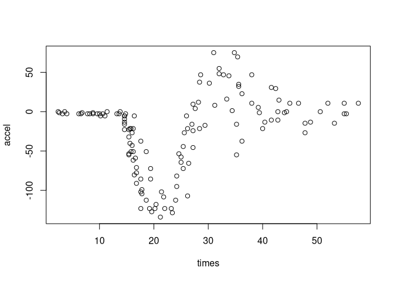

``` r
model <- liesel(
  response = mcycle$accel,
  distribution = "Normal",
  predictors = list(
    loc = predictor(~ s(times)),
    scale = predictor(~ s(times), inverse_link = "Exp")
  ),
  data = mcycle
)
```

## Metropolis-in-Gibbs

First, we try a Metropolis-in-Gibbs sampling scheme with IWLS kernels
for the regression coefficients ($\boldsymbol{\beta}$) and Gibbs kernels
for the smoothing parameters ($\tau^2$) of the splines.

``` python
import liesel.model as lsl

model = r.model

builder = lsl.dist_reg_mcmc(model, seed=42, num_chains=4)
builder.set_duration(warmup_duration=5000, posterior_duration=1000)
builder.show_progress = False

engine = builder.build()
engine.sample_all_epochs()
```

Clearly, the performance of the sampler could be better, especially for
the intercept of the mean. The corresponding chain exhibits a very
strong autocorrelation.

``` python
import liesel.goose as gs

results = engine.get_results()
gs.Summary(results)
```

<p>

<strong>Parameter summary:</strong>
</p>

<table border="0" class="dataframe">

<thead>

<tr style="text-align: right;">

<th>

</th>

<th>

</th>

<th>

kernel
</th>

<th>

mean
</th>

<th>

sd
</th>

<th>

q_0.05
</th>

<th>

q_0.5
</th>

<th>

q_0.95
</th>

<th>

sample_size
</th>

<th>

ess_bulk
</th>

<th>

ess_tail
</th>

<th>

rhat
</th>

</tr>

<tr>

<th>

parameter
</th>

<th>

index
</th>

<th>

</th>

<th>

</th>

<th>

</th>

<th>

</th>

<th>

</th>

<th>

</th>

<th>

</th>

<th>

</th>

<th>

</th>

<th>

</th>

</tr>

</thead>

<tbody>

<tr>

<th rowspan="9" valign="top">

loc_np0_beta
</th>

<th>

(0,)
</th>

<td>

kernel_04
</td>

<td>

-91.804
</td>

<td>

246.358
</td>

<td>

-487.191
</td>

<td>

-93.701
</td>

<td>

320.379
</td>

<td>

4000
</td>

<td>

32.286
</td>

<td>

287.857
</td>

<td>

1.105
</td>

</tr>

<tr>

<th>

(1,)
</th>

<td>

kernel_04
</td>

<td>

-1450.969
</td>

<td>

251.351
</td>

<td>

-1877.545
</td>

<td>

-1441.344
</td>

<td>

-1054.337
</td>

<td>

4000
</td>

<td>

245.513
</td>

<td>

517.626
</td>

<td>

1.019
</td>

</tr>

<tr>

<th>

(2,)
</th>

<td>

kernel_04
</td>

<td>

-688.988
</td>

<td>

170.417
</td>

<td>

-968.462
</td>

<td>

-687.547
</td>

<td>

-414.266
</td>

<td>

4000
</td>

<td>

201.535
</td>

<td>

246.609
</td>

<td>

1.021
</td>

</tr>

<tr>

<th>

(3,)
</th>

<td>

kernel_04
</td>

<td>

-566.455
</td>

<td>

114.350
</td>

<td>

-750.965
</td>

<td>

-568.637
</td>

<td>

-381.049
</td>

<td>

4000
</td>

<td>

203.869
</td>

<td>

486.270
</td>

<td>

1.024
</td>

</tr>

<tr>

<th>

(4,)
</th>

<td>

kernel_04
</td>

<td>

1118.235
</td>

<td>

95.187
</td>

<td>

962.315
</td>

<td>

1118.281
</td>

<td>

1272.825
</td>

<td>

4000
</td>

<td>

256.929
</td>

<td>

674.613
</td>

<td>

1.018
</td>

</tr>

<tr>

<th>

(5,)
</th>

<td>

kernel_04
</td>

<td>

-64.739
</td>

<td>

35.044
</td>

<td>

-122.833
</td>

<td>

-63.353
</td>

<td>

-8.802
</td>

<td>

4000
</td>

<td>

70.030
</td>

<td>

203.802
</td>

<td>

1.053
</td>

</tr>

<tr>

<th>

(6,)
</th>

<td>

kernel_04
</td>

<td>

-210.729
</td>

<td>

21.398
</td>

<td>

-245.188
</td>

<td>

-211.329
</td>

<td>

-173.968
</td>

<td>

4000
</td>

<td>

120.358
</td>

<td>

439.328
</td>

<td>

1.041
</td>

</tr>

<tr>

<th>

(7,)
</th>

<td>

kernel_04
</td>

<td>

115.713
</td>

<td>

68.791
</td>

<td>

15.763
</td>

<td>

107.486
</td>

<td>

237.699
</td>

<td>

4000
</td>

<td>

170.216
</td>

<td>

285.860
</td>

<td>

1.015
</td>

</tr>

<tr>

<th>

(8,)
</th>

<td>

kernel_04
</td>

<td>

30.125
</td>

<td>

17.749
</td>

<td>

4.209
</td>

<td>

27.998
</td>

<td>

61.683
</td>

<td>

4000
</td>

<td>

156.672
</td>

<td>

256.266
</td>

<td>

1.019
</td>

</tr>

<tr>

<th>

loc_np0_tau2
</th>

<th>

()
</th>

<td>

kernel_03
</td>

<td>

737663.750
</td>

<td>

575954.625
</td>

<td>

253926.699
</td>

<td>

589956.125
</td>

<td>

1715413.837
</td>

<td>

4000
</td>

<td>

1363.587
</td>

<td>

2140.804
</td>

<td>

1.001
</td>

</tr>

<tr>

<th>

loc_p0_beta
</th>

<th>

(0,)
</th>

<td>

kernel_05
</td>

<td>

-24.836
</td>

<td>

2.503
</td>

<td>

-28.530
</td>

<td>

-25.006
</td>

<td>

-19.735
</td>

<td>

4000
</td>

<td>

9.228
</td>

<td>

13.968
</td>

<td>

1.388
</td>

</tr>

<tr>

<th rowspan="9" valign="top">

scale_np0_beta
</th>

<th>

(0,)
</th>

<td>

kernel_01
</td>

<td>

6.784
</td>

<td>

9.349
</td>

<td>

-5.264
</td>

<td>

4.936
</td>

<td>

24.327
</td>

<td>

4000
</td>

<td>

22.696
</td>

<td>

117.474
</td>

<td>

1.153
</td>

</tr>

<tr>

<th>

(1,)
</th>

<td>

kernel_01
</td>

<td>

-1.717
</td>

<td>

6.189
</td>

<td>

-12.991
</td>

<td>

-1.248
</td>

<td>

7.937
</td>

<td>

4000
</td>

<td>

47.902
</td>

<td>

71.274
</td>

<td>

1.080
</td>

</tr>

<tr>

<th>

(2,)
</th>

<td>

kernel_01
</td>

<td>

-16.314
</td>

<td>

9.845
</td>

<td>

-33.081
</td>

<td>

-15.758
</td>

<td>

-2.053
</td>

<td>

4000
</td>

<td>

13.454
</td>

<td>

64.246
</td>

<td>

1.268
</td>

</tr>

<tr>

<th>

(3,)
</th>

<td>

kernel_01
</td>

<td>

9.599
</td>

<td>

4.739
</td>

<td>

2.620
</td>

<td>

9.302
</td>

<td>

18.122
</td>

<td>

4000
</td>

<td>

15.433
</td>

<td>

116.924
</td>

<td>

1.227
</td>

</tr>

<tr>

<th>

(4,)
</th>

<td>

kernel_01
</td>

<td>

-2.108
</td>

<td>

3.904
</td>

<td>

-9.311
</td>

<td>

-1.713
</td>

<td>

3.669
</td>

<td>

4000
</td>

<td>

22.951
</td>

<td>

59.843
</td>

<td>

1.123
</td>

</tr>

<tr>

<th>

(5,)
</th>

<td>

kernel_01
</td>

<td>

3.788
</td>

<td>

2.006
</td>

<td>

0.662
</td>

<td>

3.668
</td>

<td>

7.092
</td>

<td>

4000
</td>

<td>

18.131
</td>

<td>

47.375
</td>

<td>

1.178
</td>

</tr>

<tr>

<th>

(6,)
</th>

<td>

kernel_01
</td>

<td>

-0.080
</td>

<td>

2.916
</td>

<td>

-5.338
</td>

<td>

0.364
</td>

<td>

3.998
</td>

<td>

4000
</td>

<td>

11.680
</td>

<td>

67.926
</td>

<td>

1.256
</td>

</tr>

<tr>

<th>

(7,)
</th>

<td>

kernel_01
</td>

<td>

-0.810
</td>

<td>

3.408
</td>

<td>

-5.915
</td>

<td>

-1.079
</td>

<td>

5.040
</td>

<td>

4000
</td>

<td>

52.893
</td>

<td>

196.317
</td>

<td>

1.065
</td>

</tr>

<tr>

<th>

(8,)
</th>

<td>

kernel_01
</td>

<td>

-0.940
</td>

<td>

1.772
</td>

<td>

-4.205
</td>

<td>

-0.651
</td>

<td>

1.464
</td>

<td>

4000
</td>

<td>

13.292
</td>

<td>

86.681
</td>

<td>

1.227
</td>

</tr>

<tr>

<th>

scale_np0_tau2
</th>

<th>

()
</th>

<td>

kernel_00
</td>

<td>

120.799
</td>

<td>

179.209
</td>

<td>

8.100
</td>

<td>

70.817
</td>

<td>

384.699
</td>

<td>

4000
</td>

<td>

14.541
</td>

<td>

116.566
</td>

<td>

1.237
</td>

</tr>

<tr>

<th>

scale_p0_beta
</th>

<th>

(0,)
</th>

<td>

kernel_02
</td>

<td>

2.773
</td>

<td>

0.069
</td>

<td>

2.661
</td>

<td>

2.772
</td>

<td>

2.889
</td>

<td>

4000
</td>

<td>

269.503
</td>

<td>

930.779
</td>

<td>

1.034
</td>

</tr>

</tbody>

</table>

<p>

<strong>Error summary:</strong>
</p>

<table border="0" class="dataframe">

<thead>

<tr style="text-align: right;">

<th>

</th>

<th>

</th>

<th>

</th>

<th>

</th>

<th>

count
</th>

<th>

sample_size
</th>

<th>

sample_size_total
</th>

<th>

relative
</th>

</tr>

<tr>

<th>

kernel
</th>

<th>

error_code
</th>

<th>

error_msg
</th>

<th>

phase
</th>

<th>

</th>

<th>

</th>

<th>

</th>

<th>

</th>

</tr>

</thead>

<tbody>

<tr>

<th rowspan="2" valign="top">

kernel_01
</th>

<th rowspan="2" valign="top">

90
</th>

<th rowspan="2" valign="top">

nan acceptance prob
</th>

<th>

warmup
</th>

<td>

3
</td>

<td>

20000
</td>

<td>

20000
</td>

<td>

0.000
</td>

</tr>

<tr>

<th>

posterior
</th>

<td>

0
</td>

<td>

4000
</td>

<td>

4000
</td>

<td>

0.000
</td>

</tr>

</tbody>

</table>

``` python
fig = gs.plot_trace(results, "loc_p0_beta")
```

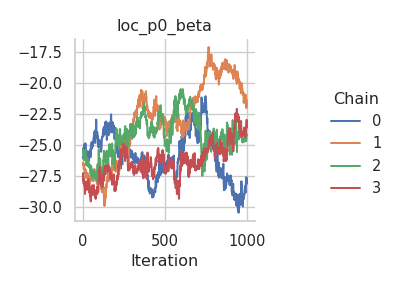

``` python
fig = gs.plot_trace(results, "loc_np0_tau2")
```

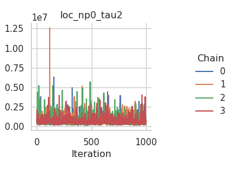

``` python
fig = gs.plot_trace(results, "loc_np0_beta")
```

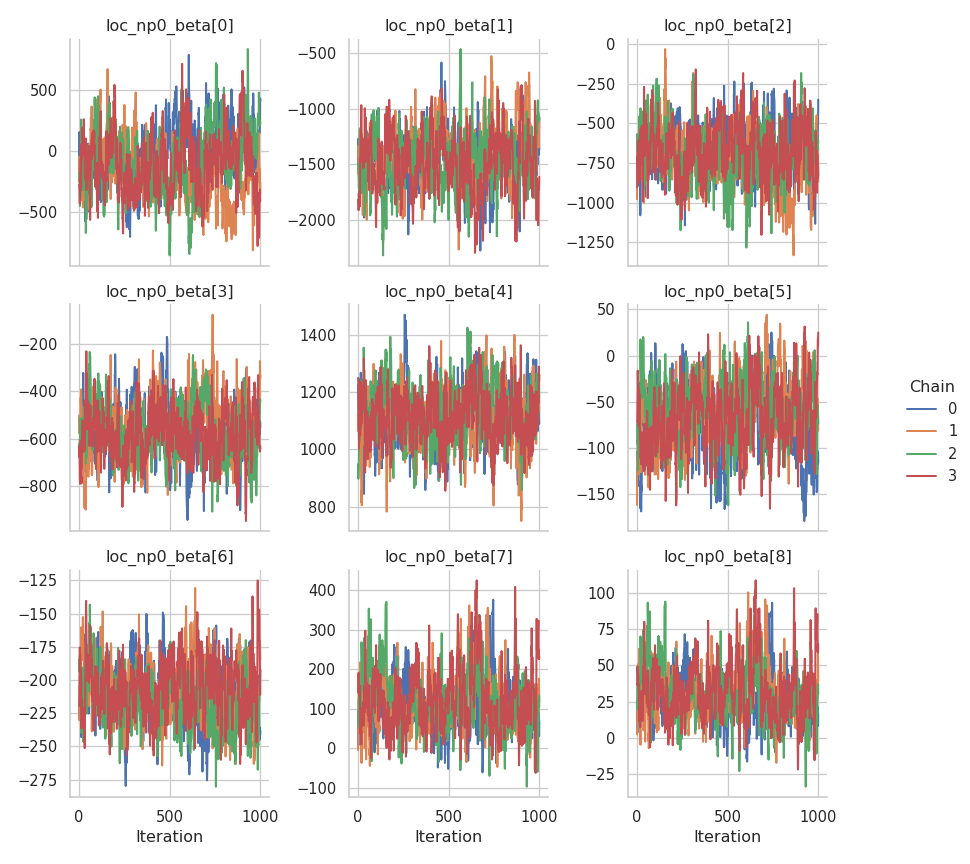

``` python
fig = gs.plot_trace(results, "scale_p0_beta")
```

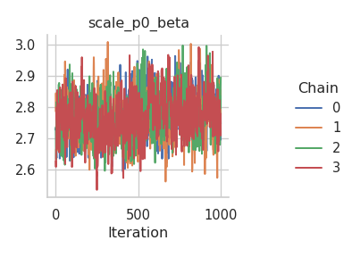

``` python
fig = gs.plot_trace(results, "scale_np0_tau2")
```

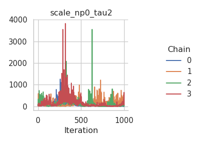

``` python
fig = gs.plot_trace(results, "scale_np0_beta")
```

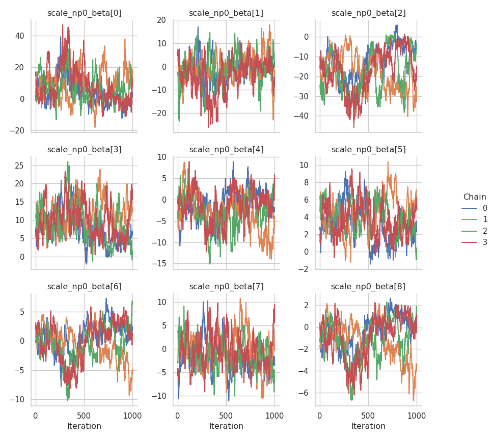

To confirm that the chains have converged to reasonable values, here is
a plot of the estimated mean function:

``` python
summary = gs.Summary(results).to_dataframe().reset_index()
```

``` r
library(dplyr)
```


    Attaching package: 'dplyr'

    The following object is masked from 'package:MASS':

        select

    The following objects are masked from 'package:stats':

        filter, lag

    The following objects are masked from 'package:base':

        intersect, setdiff, setequal, union

``` r
library(ggplot2)
library(reticulate)

summary <- py$summary

beta <- summary %>%
  filter(variable == "loc_np0_beta") %>%
  group_by(var_index) %>%
  summarize(mean = mean(mean)) %>%
  ungroup()

beta <- beta$mean
X <- py_to_r(model$vars["loc_np0_X"]$value)
f <- X %*% beta

beta0 <- summary %>%
  filter(variable == "loc_p0_beta") %>%
  group_by(var_index) %>%
  summarize(mean = mean(mean)) %>%
  ungroup()

beta0 <- beta0$mean

ggplot(data.frame(times = mcycle$times, mean = beta0 + f)) +
  geom_line(aes(times, mean), color = palette()[2], size = 1) +
  geom_point(aes(times, accel), data = mcycle) +
  ggtitle("Estimated mean function") +
  theme_minimal()
```

    Warning: Using `size` aesthetic for lines was deprecated in ggplot2 3.4.0.
    ℹ Please use `linewidth` instead.


## NUTS sampler

As an alternative, we try using NUTS kernels for all parameters. To do
so, we first need to log-transform the smoothing parameters. This is the
model graph before the transformation:

``` python
lsl.plot_vars(model)
```

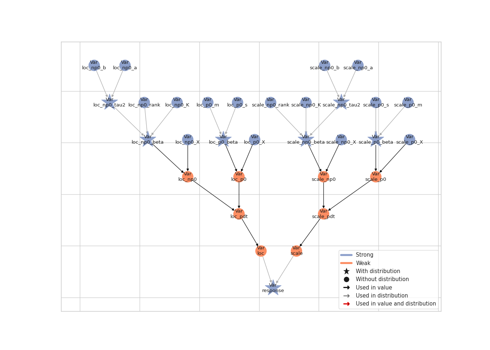

To transform the smoothing parameters with the method
{meth}`.Var.transform`, we need to retrieve the nodes and vars form the
model. This is necessary, because while they are part of a model, the
inputs and outputs of nodes and vars cannot be changed. We retrieve the
nodes and vars using {meth}`.Model.pop_nodes_and_vars`, which renders
the model empty.

Note, RLiesel automatically populates the parameter variables with
intormation how to conduct the MCMC inference. To trasform the
variables, we can drop it. We setup the MCMC sampler in the next chunk.

After transformation, there are two additional nodes in the new model
graph.

``` python
import tensorflow_probability.substrates.jax.bijectors as tfb

nodes, _vars = model.pop_nodes_and_vars()

_vars["loc_np0_tau2"].transform(tfb.Exp(), inference='drop')
```

    Var(name="loc_np0_tau2_transformed")

``` python
_vars["scale_np0_tau2"].transform(tfb.Exp(), inference='drop')
```

    Var(name="scale_np0_tau2_transformed")

``` python
gb = lsl.GraphBuilder().add(_vars["response"])

model = gb.build_model()
lsl.plot_vars(model)
```

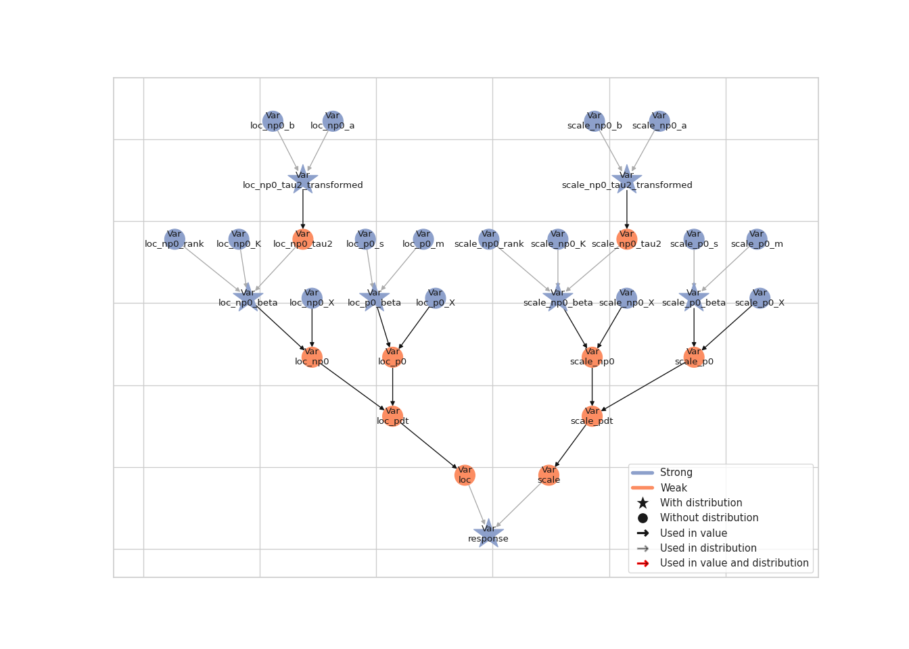

Now we can set up the NUTS sampler. In complex models like this one it
can be very beneficial to use individual NUTS samplers for blocks of
parameters. This is pretty much the same strategy that we apply to the
IWLS sampler, too.

``` python
builder = gs.EngineBuilder(seed=42, num_chains=4)

builder.set_model(gs.LieselInterface(model))

# add NUTS kernels
parameters = [name for name, var in model.vars.items() if var.parameter]

for parameter in parameters:
  builder.add_kernel(gs.NUTSKernel([parameter]))


builder.set_initial_values(model.state)

builder.set_epochs(
  gs.stan_epochs(warmup_duration=5000, posterior_duration=1000, init_duration=750, term_duration=500)
)

builder.show_progress = False

engine = builder.build()
engine.sample_all_epochs()
```

The NUTS sampler overall seems to do a good job - and even yields higher
effective sample sizes than the IWLS sampler, especially for the spline
coefficients of the scale model.

``` python
results = engine.get_results()
gs.Summary(results)
```

<p>

<strong>Parameter summary:</strong>
</p>

<table border="0" class="dataframe">

<thead>

<tr style="text-align: right;">

<th>

</th>

<th>

</th>

<th>

kernel
</th>

<th>

mean
</th>

<th>

sd
</th>

<th>

q_0.05
</th>

<th>

q_0.5
</th>

<th>

q_0.95
</th>

<th>

sample_size
</th>

<th>

ess_bulk
</th>

<th>

ess_tail
</th>

<th>

rhat
</th>

</tr>

<tr>

<th>

parameter
</th>

<th>

index
</th>

<th>

</th>

<th>

</th>

<th>

</th>

<th>

</th>

<th>

</th>

<th>

</th>

<th>

</th>

<th>

</th>

<th>

</th>

<th>

</th>

</tr>

</thead>

<tbody>

<tr>

<th rowspan="9" valign="top">

loc_np0_beta
</th>

<th>

(0,)
</th>

<td>

kernel_03
</td>

<td>

-70.832
</td>

<td>

245.508
</td>

<td>

-464.860
</td>

<td>

-73.498
</td>

<td>

337.953
</td>

<td>

4000
</td>

<td>

475.185
</td>

<td>

1366.164
</td>

<td>

1.010
</td>

</tr>

<tr>

<th>

(1,)
</th>

<td>

kernel_03
</td>

<td>

-1453.866
</td>

<td>

240.227
</td>

<td>

-1855.334
</td>

<td>

-1450.833
</td>

<td>

-1051.159
</td>

<td>

4000
</td>

<td>

1293.738
</td>

<td>

1851.445
</td>

<td>

1.001
</td>

</tr>

<tr>

<th>

(2,)
</th>

<td>

kernel_03
</td>

<td>

-675.715
</td>

<td>

174.894
</td>

<td>

-961.820
</td>

<td>

-671.786
</td>

<td>

-389.642
</td>

<td>

4000
</td>

<td>

1068.544
</td>

<td>

1659.401
</td>

<td>

1.002
</td>

</tr>

<tr>

<th>

(3,)
</th>

<td>

kernel_03
</td>

<td>

-560.881
</td>

<td>

113.379
</td>

<td>

-748.973
</td>

<td>

-559.743
</td>

<td>

-369.236
</td>

<td>

4000
</td>

<td>

1137.743
</td>

<td>

1323.875
</td>

<td>

1.003
</td>

</tr>

<tr>

<th>

(4,)
</th>

<td>

kernel_03
</td>

<td>

1125.381
</td>

<td>

92.427
</td>

<td>

971.627
</td>

<td>

1126.511
</td>

<td>

1275.955
</td>

<td>

4000
</td>

<td>

1492.207
</td>

<td>

1737.533
</td>

<td>

1.002
</td>

</tr>

<tr>

<th>

(5,)
</th>

<td>

kernel_03
</td>

<td>

-68.246
</td>

<td>

33.780
</td>

<td>

-122.764
</td>

<td>

-69.070
</td>

<td>

-12.832
</td>

<td>

4000
</td>

<td>

402.483
</td>

<td>

1619.120
</td>

<td>

1.012
</td>

</tr>

<tr>

<th>

(6,)
</th>

<td>

kernel_03
</td>

<td>

-210.993
</td>

<td>

22.021
</td>

<td>

-245.030
</td>

<td>

-211.661
</td>

<td>

-173.713
</td>

<td>

4000
</td>

<td>

1057.176
</td>

<td>

1257.369
</td>

<td>

1.002
</td>

</tr>

<tr>

<th>

(7,)
</th>

<td>

kernel_03
</td>

<td>

118.367
</td>

<td>

75.321
</td>

<td>

14.262
</td>

<td>

108.482
</td>

<td>

258.002
</td>

<td>

4000
</td>

<td>

814.802
</td>

<td>

691.986
</td>

<td>

1.002
</td>

</tr>

<tr>

<th>

(8,)
</th>

<td>

kernel_03
</td>

<td>

30.882
</td>

<td>

19.794
</td>

<td>

3.831
</td>

<td>

28.112
</td>

<td>

67.859
</td>

<td>

4000
</td>

<td>

716.367
</td>

<td>

761.762
</td>

<td>

1.004
</td>

</tr>

<tr>

<th>

loc_np0_tau2_transformed
</th>

<th>

()
</th>

<td>

kernel_04
</td>

<td>

13.308
</td>

<td>

0.573
</td>

<td>

12.425
</td>

<td>

13.291
</td>

<td>

14.289
</td>

<td>

4000
</td>

<td>

1412.805
</td>

<td>

1441.007
</td>

<td>

1.002
</td>

</tr>

<tr>

<th>

loc_p0_beta
</th>

<th>

(0,)
</th>

<td>

kernel_05
</td>

<td>

-25.287
</td>

<td>

1.688
</td>

<td>

-27.898
</td>

<td>

-25.300
</td>

<td>

-22.427
</td>

<td>

4000
</td>

<td>

37.312
</td>

<td>

41.358
</td>

<td>

1.094
</td>

</tr>

<tr>

<th rowspan="9" valign="top">

scale_np0_beta
</th>

<th>

(0,)
</th>

<td>

kernel_00
</td>

<td>

6.957
</td>

<td>

9.587
</td>

<td>

-5.102
</td>

<td>

4.990
</td>

<td>

25.658
</td>

<td>

4000
</td>

<td>

386.409
</td>

<td>

627.474
</td>

<td>

1.011
</td>

</tr>

<tr>

<th>

(1,)
</th>

<td>

kernel_00
</td>

<td>

-1.885
</td>

<td>

6.324
</td>

<td>

-13.567
</td>

<td>

-1.246
</td>

<td>

7.481
</td>

<td>

4000
</td>

<td>

799.663
</td>

<td>

1157.969
</td>

<td>

1.006
</td>

</tr>

<tr>

<th>

(2,)
</th>

<td>

kernel_00
</td>

<td>

-14.987
</td>

<td>

8.953
</td>

<td>

-30.618
</td>

<td>

-14.150
</td>

<td>

-2.051
</td>

<td>

4000
</td>

<td>

227.988
</td>

<td>

574.125
</td>

<td>

1.021
</td>

</tr>

<tr>

<th>

(3,)
</th>

<td>

kernel_00
</td>

<td>

9.790
</td>

<td>

4.953
</td>

<td>

2.312
</td>

<td>

9.397
</td>

<td>

18.513
</td>

<td>

4000
</td>

<td>

319.101
</td>

<td>

1318.401
</td>

<td>

1.020
</td>

</tr>

<tr>

<th>

(4,)
</th>

<td>

kernel_00
</td>

<td>

-1.600
</td>

<td>

3.910
</td>

<td>

-8.317
</td>

<td>

-1.374
</td>

<td>

4.385
</td>

<td>

4000
</td>

<td>

471.078
</td>

<td>

602.164
</td>

<td>

1.005
</td>

</tr>

<tr>

<th>

(5,)
</th>

<td>

kernel_00
</td>

<td>

3.963
</td>

<td>

1.999
</td>

<td>

0.839
</td>

<td>

3.852
</td>

<td>

7.355
</td>

<td>

4000
</td>

<td>

355.758
</td>

<td>

1088.726
</td>

<td>

1.017
</td>

</tr>

<tr>

<th>

(6,)
</th>

<td>

kernel_00
</td>

<td>

0.242
</td>

<td>

2.726
</td>

<td>

-4.585
</td>

<td>

0.614
</td>

<td>

4.004
</td>

<td>

4000
</td>

<td>

243.050
</td>

<td>

568.534
</td>

<td>

1.017
</td>

</tr>

<tr>

<th>

(7,)
</th>

<td>

kernel_00
</td>

<td>

-0.224
</td>

<td>

3.979
</td>

<td>

-6.181
</td>

<td>

-0.584
</td>

<td>

6.773
</td>

<td>

4000
</td>

<td>

591.355
</td>

<td>

900.004
</td>

<td>

1.008
</td>

</tr>

<tr>

<th>

(8,)
</th>

<td>

kernel_00
</td>

<td>

-0.688
</td>

<td>

1.681
</td>

<td>

-3.609
</td>

<td>

-0.436
</td>

<td>

1.552
</td>

<td>

4000
</td>

<td>

263.875
</td>

<td>

474.022
</td>

<td>

1.012
</td>

</tr>

<tr>

<th>

scale_np0_tau2_transformed
</th>

<th>

()
</th>

<td>

kernel_01
</td>

<td>

4.115
</td>

<td>

1.103
</td>

<td>

2.205
</td>

<td>

4.184
</td>

<td>

5.821
</td>

<td>

4000
</td>

<td>

179.326
</td>

<td>

485.307
</td>

<td>

1.033
</td>

</tr>

<tr>

<th>

scale_p0_beta
</th>

<th>

(0,)
</th>

<td>

kernel_02
</td>

<td>

2.771
</td>

<td>

0.068
</td>

<td>

2.661
</td>

<td>

2.770
</td>

<td>

2.884
</td>

<td>

4000
</td>

<td>

776.615
</td>

<td>

1855.409
</td>

<td>

1.004
</td>

</tr>

</tbody>

</table>

<p>

<strong>Error summary:</strong>
</p>

<table border="0" class="dataframe">

<thead>

<tr style="text-align: right;">

<th>

</th>

<th>

</th>

<th>

</th>

<th>

</th>

<th>

count
</th>

<th>

sample_size
</th>

<th>

sample_size_total
</th>

<th>

relative
</th>

</tr>

<tr>

<th>

kernel
</th>

<th>

error_code
</th>

<th>

error_msg
</th>

<th>

phase
</th>

<th>

</th>

<th>

</th>

<th>

</th>

<th>

</th>

</tr>

</thead>

<tbody>

<tr>

<th rowspan="4" valign="top">

kernel_00
</th>

<th rowspan="2" valign="top">

1
</th>

<th rowspan="2" valign="top">

divergent transition
</th>

<th>

warmup
</th>

<td>

1675
</td>

<td>

20000
</td>

<td>

20000
</td>

<td>

0.084
</td>

</tr>

<tr>

<th>

posterior
</th>

<td>

3
</td>

<td>

4000
</td>

<td>

4000
</td>

<td>

0.001
</td>

</tr>

<tr>

<th rowspan="2" valign="top">

2
</th>

<th rowspan="2" valign="top">

maximum tree depth
</th>

<th>

warmup
</th>

<td>

84
</td>

<td>

20000
</td>

<td>

20000
</td>

<td>

0.004
</td>

</tr>

<tr>

<th>

posterior
</th>

<td>

0
</td>

<td>

4000
</td>

<td>

4000
</td>

<td>

0.000
</td>

</tr>

<tr>

<th rowspan="2" valign="top">

kernel_01
</th>

<th rowspan="2" valign="top">

1
</th>

<th rowspan="2" valign="top">

divergent transition
</th>

<th>

warmup
</th>

<td>

95
</td>

<td>

20000
</td>

<td>

20000
</td>

<td>

0.005
</td>

</tr>

<tr>

<th>

posterior
</th>

<td>

0
</td>

<td>

4000
</td>

<td>

4000
</td>

<td>

0.000
</td>

</tr>

<tr>

<th rowspan="2" valign="top">

kernel_02
</th>

<th rowspan="2" valign="top">

1
</th>

<th rowspan="2" valign="top">

divergent transition
</th>

<th>

warmup
</th>

<td>

68
</td>

<td>

20000
</td>

<td>

20000
</td>

<td>

0.003
</td>

</tr>

<tr>

<th>

posterior
</th>

<td>

0
</td>

<td>

4000
</td>

<td>

4000
</td>

<td>

0.000
</td>

</tr>

<tr>

<th rowspan="4" valign="top">

kernel_03
</th>

<th rowspan="2" valign="top">

1
</th>

<th rowspan="2" valign="top">

divergent transition
</th>

<th>

warmup
</th>

<td>

1179
</td>

<td>

20000
</td>

<td>

20000
</td>

<td>

0.059
</td>

</tr>

<tr>

<th>

posterior
</th>

<td>

134
</td>

<td>

4000
</td>

<td>

4000
</td>

<td>

0.033
</td>

</tr>

<tr>

<th rowspan="2" valign="top">

2
</th>

<th rowspan="2" valign="top">

maximum tree depth
</th>

<th>

warmup
</th>

<td>

3333
</td>

<td>

20000
</td>

<td>

20000
</td>

<td>

0.167
</td>

</tr>

<tr>

<th>

posterior
</th>

<td>

87
</td>

<td>

4000
</td>

<td>

4000
</td>

<td>

0.022
</td>

</tr>

<tr>

<th rowspan="2" valign="top">

kernel_04
</th>

<th rowspan="2" valign="top">

1
</th>

<th rowspan="2" valign="top">

divergent transition
</th>

<th>

warmup
</th>

<td>

116
</td>

<td>

20000
</td>

<td>

20000
</td>

<td>

0.006
</td>

</tr>

<tr>

<th>

posterior
</th>

<td>

0
</td>

<td>

4000
</td>

<td>

4000
</td>

<td>

0.000
</td>

</tr>

<tr>

<th rowspan="2" valign="top">

kernel_05
</th>

<th rowspan="2" valign="top">

1
</th>

<th rowspan="2" valign="top">

divergent transition
</th>

<th>

warmup
</th>

<td>

135
</td>

<td>

20000
</td>

<td>

20000
</td>

<td>

0.007
</td>

</tr>

<tr>

<th>

posterior
</th>

<td>

2
</td>

<td>

4000
</td>

<td>

4000
</td>

<td>

0.001
</td>

</tr>

</tbody>

</table>

``` python
fig = gs.plot_trace(results, "loc_p0_beta")
```

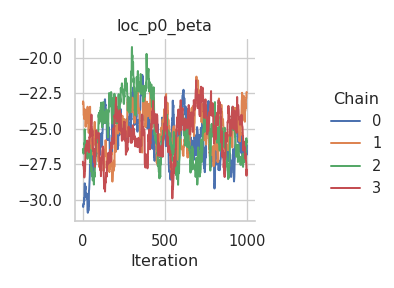

``` python
fig = gs.plot_trace(results, "loc_np0_tau2_transformed")
```

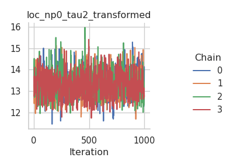

``` python
fig = gs.plot_trace(results, "loc_np0_beta")
```

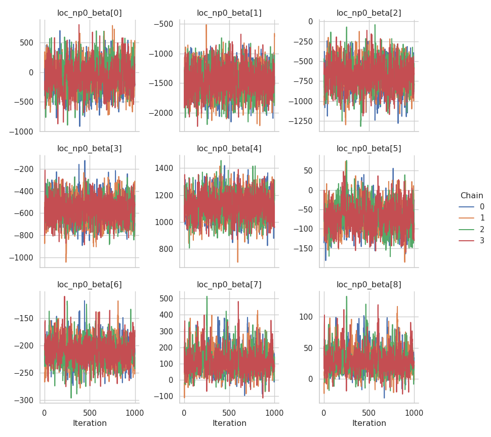

``` python
fig = gs.plot_trace(results, "scale_p0_beta")
```

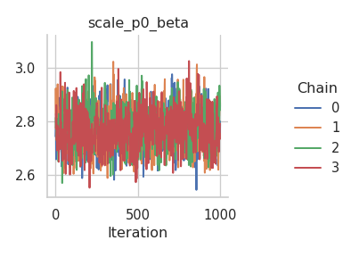

``` python
fig = gs.plot_trace(results, "scale_np0_tau2_transformed")
```

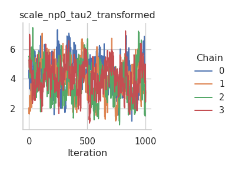

``` python
fig = gs.plot_trace(results, "scale_np0_beta")
```

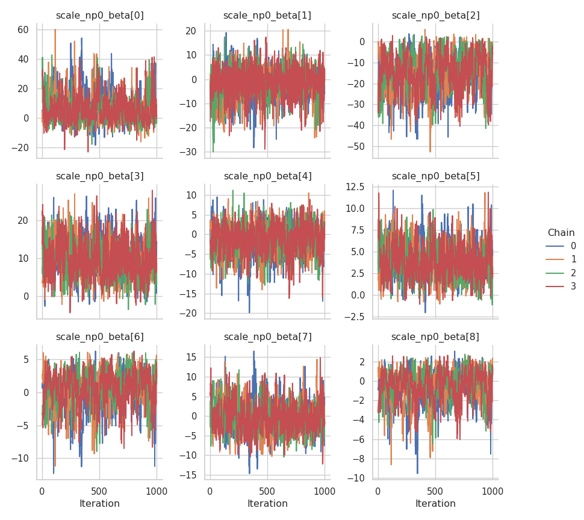

Again, here is a plot of the estimated mean function:

``` python
summary = gs.Summary(results).to_dataframe().reset_index()
```

``` r
library(dplyr)
library(ggplot2)
library(reticulate)

summary <- py$summary
model <- py$model

beta <- summary %>%
  filter(variable == "loc_np0_beta") %>%
  group_by(var_index) %>%
  summarize(mean = mean(mean)) %>%
  ungroup()

beta <- beta$mean
X <- model$vars["loc_np0_X"]$value
f <- X %*% beta

beta0 <- summary %>%
  filter(variable == "loc_p0_beta") %>%
  group_by(var_index) %>%
  summarize(mean = mean(mean)) %>%
  ungroup()

beta0 <- beta0$mean

ggplot(data.frame(times = mcycle$times, mean = beta0 + f)) +
  geom_line(aes(times, mean), color = palette()[2], size = 1) +
  geom_point(aes(times, accel), data = mcycle) +
  ggtitle("Estimated mean function") +
  theme_minimal()
```

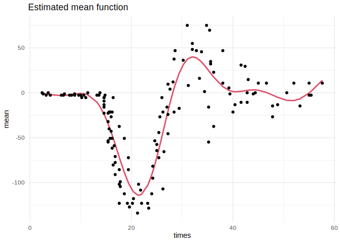
