# Comparing samplers

In this tutorial, we compare two different sampling schemes on the
`mcycle` dataset with a Gaussian location-scale regression model and two
splines for the mean and the standard deviation. The `mcycle` dataset is
a “data frame giving a series of measurements of head acceleration in a
simulated motorcycle accident, used to test crash helmets” (from the
help page). It contains the following two variables:

- `times`: in milliseconds after impact
- `accel`: in g

We set up the model in Python with
[Liesel-GAM](https://github.com/liesel-devs/liesel_gam), using
{class}`liesel_gam.TermBuilder` for the P-spline terms. See the
[Liesel-GAM documentation and
examples](https://github.com/liesel-devs/liesel_gam#readme) for more
information about additive terms and predictors. The tutorial reads a
small CSV copy of the `MASS::mcycle` data set, so no R code is needed
during rendering.

``` python
from pathlib import Path

import jax.numpy as jnp
import matplotlib.pyplot as plt
import numpy as np
import seaborn as sns
import tensorflow_probability.substrates.jax.bijectors as tfb
import tensorflow_probability.substrates.jax.distributions as tfd

import liesel.goose as gs
import liesel.model as lsl
import liesel_gam as gam
from ryp import r, to_py
```

    Warning message:
    package ‘arrow’ was built under R version 4.5.2 

``` python
r("library(MASS)")
r("data(mcycle); mcycle <- as.data.frame(mcycle)")

mcycle = to_py("mcycle", format="pandas")
```

``` python
fig, ax = plt.subplots(figsize=(8, 4))
sns.scatterplot(data=mcycle, x="times", y="accel", color="0.25", s=35, ax=ax)
ax.set(xlabel="time after impact", ylabel="acceleration", title="mcycle data")
plt.show()
```


The following helper builds the Gaussian location-scale model. Both
distributional parameters use an additive predictor with an intercept
and a P-spline in `times`. The scale predictor uses an exponential
inverse link to keep the standard deviation positive. The
`default_inference` argument determines which MCMC kernel Liesel-GAM
attaches to the regression coefficients.

``` python
def build_mcycle_model(default_inference):
    tb = gam.TermBuilder.from_df(mcycle, default_inference=default_inference)

    loc_intercept = lsl.Var.new_param(
        jnp.array(float(mcycle["accel"].mean())),
        distribution=None,
        inference=default_inference,
        name="$\\beta_{0,loc}$",
    )
    scale_intercept = lsl.Var.new_param(
        jnp.array(float(np.log(mcycle["accel"].std()))),
        distribution=None,
        inference=default_inference,
        name="$\\beta_{0,scale}$",
    )

    loc = gam.AdditivePredictor("loc", intercept=loc_intercept)
    scale = gam.AdditivePredictor(
        "scale",
        inv_link=jnp.exp,
        intercept=scale_intercept,
    )

    loc_smooth = tb.ps("times", k=20)
    scale_smooth = tb.ps("times", k=20)

    loc += loc_smooth
    scale += scale_smooth

    response_dist = lsl.Dist(tfd.Normal, loc=loc, scale=scale)
    y = lsl.Var.new_obs(mcycle["accel"].to_numpy(), response_dist, name="y")
    model = lsl.Model([y])

    return {
        "model": model,
        "loc": loc,
        "scale": scale,
        "loc_smooth": loc_smooth,
        "scale_smooth": scale_smooth,
        "loc_tau2_name": loc_smooth.scale.value_node[0].name,
        "scale_tau2_name": scale_smooth.scale.value_node[0].name,
    }


def plot_loc_estimate(results, model, title):
    samples = results.get_posterior_samples()
    loc_samples = model.vars["loc"].predict(samples)
    loc_summary = gs.SamplesSummary.from_array(
        loc_samples,
        name="loc",
        which=["mean", "quantiles"],
    )
    loc_summary_df = loc_summary.to_dataframe().reset_index()

    loc_summary_df["times"] = mcycle["times"].to_numpy()
    plot_data = (
        loc_summary_df[["times", "mean", "q_0.05", "q_0.95"]]
        .groupby("times", as_index=False)
        .mean()
        .sort_values("times")
    )

    fig, ax = plt.subplots(figsize=(8, 5))
    ax.fill_between(
        plot_data["times"],
        plot_data["q_0.05"],
        plot_data["q_0.95"],
        color=sns.color_palette()[1],
        alpha=0.25,
        label="90% credible interval",
    )
    sns.lineplot(
        data=plot_data,
        x="times",
        y="mean",
        color=sns.color_palette()[1],
        linewidth=2,
        label="posterior mean",
        ax=ax,
    )
    sns.scatterplot(
        data=mcycle,
        x="times",
        y="accel",
        color="0.25",
        s=25,
        ax=ax,
        label="observed data",
    )
    ax.set(xlabel="time after impact", ylabel="acceleration", title=title)
    plt.show()
```

## Metropolis-in-Gibbs

First, we try a Metropolis-in-Gibbs sampling scheme with IWLS kernels
for the regression coefficients ($\boldsymbol{\beta}$) and Gibbs kernels
for the smoothing variances ($\tau^2$) of the splines. The Gibbs kernels
for $\tau^2$ are added automatically by the P-spline terms.

``` python
iwls_parts = build_mcycle_model(gs.MCMCSpec(gs.IWLSKernel.untuned))
iwls_model = iwls_parts["model"]

builder = gs.LieselMCMC(iwls_model).get_engine_builder(seed=42, num_chains=4)
builder.set_duration(warmup_duration=5000, posterior_duration=1000)
builder.show_progress = False

engine = builder.build()
engine.sample_all_epochs()
iwls_results = engine.get_results()
```

    liesel.goose.builder - WARNING - No jitter functions provided for position keys '$\\beta_{ps(times)}$', '$\\beta_{ps(times)1}$', '$\\tau_{ps(times)}^2$', '$\\beta_{0,loc}$', '$\\tau_{ps(times)1}^2$', '$\\beta_{0,scale}$'. The initial values for these keys won't be jittered
    liesel.goose.engine - INFO - Initializing kernels...
    liesel.goose.engine - INFO - Done
    liesel.goose.engine - INFO - Finished warmup

Clearly, the performance of the sampler could be better, especially for
the intercept of the mean. The corresponding chain exhibits a very
strong autocorrelation.

``` python
gs.Summary(iwls_results)
```

<p>
<strong>Parameter summary:</strong>
</p>
<table border="0" class="dataframe">
<thead>
<tr style="text-align: right;">
<th>
</th>
<th>
</th>
<th>
kernel
</th>
<th>
mean
</th>
<th>
sd
</th>
<th>
q_0.05
</th>
<th>
q_0.5
</th>
<th>
q_0.95
</th>
<th>
sample_size
</th>
<th>
ess_bulk
</th>
<th>
ess_tail
</th>
<th>
rhat
</th>
</tr>
<tr>
<th>
parameter
</th>
<th>
index
</th>
<th>
</th>
<th>
</th>
<th>
</th>
<th>
</th>
<th>
</th>
<th>
</th>
<th>
</th>
<th>
</th>
<th>
</th>
<th>
</th>
</tr>
</thead>
<tbody>
<tr>
<th>
$\beta_{0,loc}$
</th>
<th>
()
</th>
<td>
kernel_03
</td>
<td>
-24.910
</td>
<td>
1.747
</td>
<td>
-27.803
</td>
<td>
-24.925
</td>
<td>
-21.913
</td>
<td>
4000
</td>
<td>
30.574
</td>
<td>
28.526
</td>
<td>
1.148
</td>
</tr>
<tr>
<th>
$\beta_{0,scale}$
</th>
<th>
()
</th>
<td>
kernel_05
</td>
<td>
2.726
</td>
<td>
0.073
</td>
<td>
2.608
</td>
<td>
2.725
</td>
<td>
2.847
</td>
<td>
4000
</td>
<td>
305.438
</td>
<td>
1200.355
</td>
<td>
1.016
</td>
</tr>
<tr>
<th rowspan="19" valign="top">
$\beta_{ps(times)1}$
</th>
<th>
(0,)
</th>
<td>
kernel_01
</td>
<td>
-0.003
</td>
<td>
0.138
</td>
<td>
-0.231
</td>
<td>
-0.001
</td>
<td>
0.219
</td>
<td>
4000
</td>
<td>
489.045
</td>
<td>
522.089
</td>
<td>
1.013
</td>
</tr>
<tr>
<th>
(1,)
</th>
<td>
kernel_01
</td>
<td>
0.017
</td>
<td>
0.143
</td>
<td>
-0.194
</td>
<td>
0.008
</td>
<td>
0.251
</td>
<td>
4000
</td>
<td>
593.156
</td>
<td>
610.800
</td>
<td>
1.013
</td>
</tr>
<tr>
<th>
(2,)
</th>
<td>
kernel_01
</td>
<td>
0.004
</td>
<td>
0.140
</td>
<td>
-0.211
</td>
<td>
0.005
</td>
<td>
0.231
</td>
<td>
4000
</td>
<td>
588.577
</td>
<td>
531.941
</td>
<td>
1.010
</td>
</tr>
<tr>
<th>
(3,)
</th>
<td>
kernel_01
</td>
<td>
0.029
</td>
<td>
0.143
</td>
<td>
-0.194
</td>
<td>
0.025
</td>
<td>
0.262
</td>
<td>
4000
</td>
<td>
457.969
</td>
<td>
559.436
</td>
<td>
1.007
</td>
</tr>
<tr>
<th>
(4,)
</th>
<td>
kernel_01
</td>
<td>
0.026
</td>
<td>
0.139
</td>
<td>
-0.195
</td>
<td>
0.019
</td>
<td>
0.260
</td>
<td>
4000
</td>
<td>
608.695
</td>
<td>
389.265
</td>
<td>
1.011
</td>
</tr>
<tr>
<th>
(5,)
</th>
<td>
kernel_01
</td>
<td>
-0.039
</td>
<td>
0.151
</td>
<td>
-0.290
</td>
<td>
-0.032
</td>
<td>
0.170
</td>
<td>
4000
</td>
<td>
437.680
</td>
<td>
504.303
</td>
<td>
1.016
</td>
</tr>
<tr>
<th>
(6,)
</th>
<td>
kernel_01
</td>
<td>
0.062
</td>
<td>
0.150
</td>
<td>
-0.161
</td>
<td>
0.047
</td>
<td>
0.341
</td>
<td>
4000
</td>
<td>
462.601
</td>
<td>
301.090
</td>
<td>
1.019
</td>
</tr>
<tr>
<th>
(7,)
</th>
<td>
kernel_01
</td>
<td>
0.009
</td>
<td>
0.129
</td>
<td>
-0.189
</td>
<td>
0.001
</td>
<td>
0.233
</td>
<td>
4000
</td>
<td>
541.647
</td>
<td>
650.310
</td>
<td>
1.008
</td>
</tr>
<tr>
<th>
(8,)
</th>
<td>
kernel_01
</td>
<td>
0.089
</td>
<td>
0.143
</td>
<td>
-0.103
</td>
<td>
0.069
</td>
<td>
0.363
</td>
<td>
4000
</td>
<td>
262.137
</td>
<td>
320.196
</td>
<td>
1.020
</td>
</tr>
<tr>
<th>
(9,)
</th>
<td>
kernel_01
</td>
<td>
-0.082
</td>
<td>
0.124
</td>
<td>
-0.283
</td>
<td>
-0.072
</td>
<td>
0.105
</td>
<td>
4000
</td>
<td>
477.883
</td>
<td>
595.435
</td>
<td>
1.008
</td>
</tr>
<tr>
<th>
(10,)
</th>
<td>
kernel_01
</td>
<td>
0.123
</td>
<td>
0.114
</td>
<td>
-0.046
</td>
<td>
0.117
</td>
<td>
0.317
</td>
<td>
4000
</td>
<td>
430.334
</td>
<td>
770.002
</td>
<td>
1.010
</td>
</tr>
<tr>
<th>
(11,)
</th>
<td>
kernel_01
</td>
<td>
0.008
</td>
<td>
0.105
</td>
<td>
-0.169
</td>
<td>
0.013
</td>
<td>
0.179
</td>
<td>
4000
</td>
<td>
530.890
</td>
<td>
664.621
</td>
<td>
1.006
</td>
</tr>
<tr>
<th>
(12,)
</th>
<td>
kernel_01
</td>
<td>
0.202
</td>
<td>
0.116
</td>
<td>
0.041
</td>
<td>
0.182
</td>
<td>
0.417
</td>
<td>
4000
</td>
<td>
125.432
</td>
<td>
371.652
</td>
<td>
1.040
</td>
</tr>
<tr>
<th>
(13,)
</th>
<td>
kernel_01
</td>
<td>
0.136
</td>
<td>
0.097
</td>
<td>
-0.009
</td>
<td>
0.125
</td>
<td>
0.313
</td>
<td>
4000
</td>
<td>
185.684
</td>
<td>
364.844
</td>
<td>
1.016
</td>
</tr>
<tr>
<th>
(14,)
</th>
<td>
kernel_01
</td>
<td>
-0.081
</td>
<td>
0.082
</td>
<td>
-0.230
</td>
<td>
-0.074
</td>
<td>
0.040
</td>
<td>
4000
</td>
<td>
150.863
</td>
<td>
462.045
</td>
<td>
1.024
</td>
</tr>
<tr>
<th>
(15,)
</th>
<td>
kernel_01
</td>
<td>
0.041
</td>
<td>
0.056
</td>
<td>
-0.044
</td>
<td>
0.036
</td>
<td>
0.136
</td>
<td>
4000
</td>
<td>
258.346
</td>
<td>
459.441
</td>
<td>
1.016
</td>
</tr>
<tr>
<th>
(16,)
</th>
<td>
kernel_01
</td>
<td>
0.024
</td>
<td>
0.033
</td>
<td>
-0.033
</td>
<td>
0.026
</td>
<td>
0.076
</td>
<td>
4000
</td>
<td>
170.649
</td>
<td>
376.682
</td>
<td>
1.015
</td>
</tr>
<tr>
<th>
(17,)
</th>
<td>
kernel_01
</td>
<td>
-0.063
</td>
<td>
0.013
</td>
<td>
-0.083
</td>
<td>
-0.064
</td>
<td>
-0.043
</td>
<td>
4000
</td>
<td>
254.981
</td>
<td>
404.432
</td>
<td>
1.019
</td>
</tr>
<tr>
<th>
(18,)
</th>
<td>
kernel_01
</td>
<td>
0.108
</td>
<td>
0.052
</td>
<td>
0.028
</td>
<td>
0.107
</td>
<td>
0.194
</td>
<td>
4000
</td>
<td>
219.708
</td>
<td>
309.781
</td>
<td>
1.014
</td>
</tr>
<tr>
<th rowspan="19" valign="top">
$\beta_{ps(times)}$
</th>
<th>
(0,)
</th>
<td>
kernel_00
</td>
<td>
-2.732
</td>
<td>
10.483
</td>
<td>
-19.865
</td>
<td>
-2.450
</td>
<td>
14.323
</td>
<td>
4000
</td>
<td>
713.961
</td>
<td>
899.471
</td>
<td>
1.008
</td>
</tr>
<tr>
<th>
(1,)
</th>
<td>
kernel_00
</td>
<td>
-10.715
</td>
<td>
9.951
</td>
<td>
-28.084
</td>
<td>
-10.512
</td>
<td>
5.542
</td>
<td>
4000
</td>
<td>
540.994
</td>
<td>
859.774
</td>
<td>
1.005
</td>
</tr>
<tr>
<th>
(2,)
</th>
<td>
kernel_00
</td>
<td>
0.888
</td>
<td>
9.320
</td>
<td>
-14.424
</td>
<td>
0.710
</td>
<td>
16.260
</td>
<td>
4000
</td>
<td>
698.991
</td>
<td>
812.920
</td>
<td>
1.006
</td>
</tr>
<tr>
<th>
(3,)
</th>
<td>
kernel_00
</td>
<td>
-4.075
</td>
<td>
9.227
</td>
<td>
-19.007
</td>
<td>
-4.512
</td>
<td>
11.730
</td>
<td>
4000
</td>
<td>
630.985
</td>
<td>
890.362
</td>
<td>
1.008
</td>
</tr>
<tr>
<th>
(4,)
</th>
<td>
kernel_00
</td>
<td>
-9.288
</td>
<td>
9.014
</td>
<td>
-24.461
</td>
<td>
-8.682
</td>
<td>
4.624
</td>
<td>
4000
</td>
<td>
596.041
</td>
<td>
1391.095
</td>
<td>
1.002
</td>
</tr>
<tr>
<th>
(5,)
</th>
<td>
kernel_00
</td>
<td>
-9.903
</td>
<td>
8.389
</td>
<td>
-24.204
</td>
<td>
-9.645
</td>
<td>
3.448
</td>
<td>
4000
</td>
<td>
796.095
</td>
<td>
1163.362
</td>
<td>
1.003
</td>
</tr>
<tr>
<th>
(6,)
</th>
<td>
kernel_00
</td>
<td>
-0.095
</td>
<td>
7.701
</td>
<td>
-12.768
</td>
<td>
-0.097
</td>
<td>
12.513
</td>
<td>
4000
</td>
<td>
896.380
</td>
<td>
927.114
</td>
<td>
1.001
</td>
</tr>
<tr>
<th>
(7,)
</th>
<td>
kernel_00
</td>
<td>
0.435
</td>
<td>
7.433
</td>
<td>
-12.099
</td>
<td>
0.682
</td>
<td>
12.595
</td>
<td>
4000
</td>
<td>
866.687
</td>
<td>
1232.600
</td>
<td>
1.004
</td>
</tr>
<tr>
<th>
(8,)
</th>
<td>
kernel_00
</td>
<td>
10.705
</td>
<td>
6.615
</td>
<td>
0.051
</td>
<td>
10.642
</td>
<td>
21.293
</td>
<td>
4000
</td>
<td>
827.099
</td>
<td>
1352.644
</td>
<td>
1.009
</td>
</tr>
<tr>
<th>
(9,)
</th>
<td>
kernel_00
</td>
<td>
-15.538
</td>
<td>
5.947
</td>
<td>
-25.842
</td>
<td>
-15.325
</td>
<td>
-5.869
</td>
<td>
4000
</td>
<td>
581.717
</td>
<td>
939.400
</td>
<td>
1.006
</td>
</tr>
<tr>
<th>
(10,)
</th>
<td>
kernel_00
</td>
<td>
-7.652
</td>
<td>
4.995
</td>
<td>
-15.790
</td>
<td>
-7.628
</td>
<td>
0.507
</td>
<td>
4000
</td>
<td>
558.099
</td>
<td>
1073.579
</td>
<td>
1.003
</td>
</tr>
<tr>
<th>
(11,)
</th>
<td>
kernel_00
</td>
<td>
-23.730
</td>
<td>
4.415
</td>
<td>
-31.292
</td>
<td>
-23.565
</td>
<td>
-16.776
</td>
<td>
4000
</td>
<td>
666.083
</td>
<td>
1011.282
</td>
<td>
1.005
</td>
</tr>
<tr>
<th>
(12,)
</th>
<td>
kernel_00
</td>
<td>
9.275
</td>
<td>
3.370
</td>
<td>
3.832
</td>
<td>
9.179
</td>
<td>
14.693
</td>
<td>
4000
</td>
<td>
637.836
</td>
<td>
791.635
</td>
<td>
1.005
</td>
</tr>
<tr>
<th>
(13,)
</th>
<td>
kernel_00
</td>
<td>
-10.215
</td>
<td>
2.685
</td>
<td>
-14.670
</td>
<td>
-10.052
</td>
<td>
-5.978
</td>
<td>
4000
</td>
<td>
563.973
</td>
<td>
852.673
</td>
<td>
1.005
</td>
</tr>
<tr>
<th>
(14,)
</th>
<td>
kernel_00
</td>
<td>
12.250
</td>
<td>
2.007
</td>
<td>
9.058
</td>
<td>
12.266
</td>
<td>
15.598
</td>
<td>
4000
</td>
<td>
851.110
</td>
<td>
1067.349
</td>
<td>
1.005
</td>
</tr>
<tr>
<th>
(15,)
</th>
<td>
kernel_00
</td>
<td>
2.293
</td>
<td>
1.252
</td>
<td>
0.376
</td>
<td>
2.300
</td>
<td>
4.382
</td>
<td>
4000
</td>
<td>
822.039
</td>
<td>
834.812
</td>
<td>
1.006
</td>
</tr>
<tr>
<th>
(16,)
</th>
<td>
kernel_00
</td>
<td>
-3.161
</td>
<td>
0.669
</td>
<td>
-4.212
</td>
<td>
-3.168
</td>
<td>
-2.136
</td>
<td>
4000
</td>
<td>
708.511
</td>
<td>
845.892
</td>
<td>
1.006
</td>
</tr>
<tr>
<th>
(17,)
</th>
<td>
kernel_00
</td>
<td>
0.896
</td>
<td>
0.246
</td>
<td>
0.528
</td>
<td>
0.896
</td>
<td>
1.288
</td>
<td>
4000
</td>
<td>
352.140
</td>
<td>
699.838
</td>
<td>
1.016
</td>
</tr>
<tr>
<th>
(18,)
</th>
<td>
kernel_00
</td>
<td>
2.984
</td>
<td>
0.956
</td>
<td>
1.506
</td>
<td>
2.995
</td>
<td>
4.445
</td>
<td>
4000
</td>
<td>
830.011
</td>
<td>
757.008
</td>
<td>
1.010
</td>
</tr>
<tr>
<th>
$\tau_{ps(times)1}^2$
</th>
<th>
()
</th>
<td>
kernel_04
</td>
<td>
0.021
</td>
<td>
0.020
</td>
<td>
0.004
</td>
<td>
0.015
</td>
<td>
0.057
</td>
<td>
4000
</td>
<td>
81.590
</td>
<td>
227.193
</td>
<td>
1.051
</td>
</tr>
<tr>
<th>
$\tau_{ps(times)}^2$
</th>
<th>
()
</th>
<td>
kernel_02
</td>
<td>
135.771
</td>
<td>
62.629
</td>
<td>
62.848
</td>
<td>
122.247
</td>
<td>
257.854
</td>
<td>
4000
</td>
<td>
656.147
</td>
<td>
1712.164
</td>
<td>
1.003
</td>
</tr>
</tbody>
</table>
<p>
<strong>Acceptance probabilities:</strong>
</p>
<table border="0" class="dataframe">
<thead>
<tr style="text-align: right;">
<th>
</th>
<th>
</th>
<th>
</th>
<th>
acceptance_probability
</th>
<th>
position_moved
</th>
</tr>
<tr>
<th>
kernel
</th>
<th>
positions
</th>
<th>
phase
</th>
<th>
</th>
<th>
</th>
</tr>
</thead>
<tbody>
<tr>
<th rowspan="2" valign="top">
kernel_00
</th>
<th rowspan="2" valign="top">
$\beta_{ps(times)}$
</th>
<th>
posterior
</th>
<td>
0.596
</td>
<td>
0.593
</td>
</tr>
<tr>
<th>
warmup
</th>
<td>
0.597
</td>
<td>
0.596
</td>
</tr>
<tr>
<th rowspan="2" valign="top">
kernel_01
</th>
<th rowspan="2" valign="top">
$\beta_{ps(times)1}$
</th>
<th>
posterior
</th>
<td>
0.434
</td>
<td>
0.443
</td>
</tr>
<tr>
<th>
warmup
</th>
<td>
0.425
</td>
<td>
0.422
</td>
</tr>
<tr>
<th rowspan="2" valign="top">
kernel_02
</th>
<th rowspan="2" valign="top">
$\tau_{ps(times)}^2$
</th>
<th>
posterior
</th>
<td>
1.000
</td>
<td>
1.000
</td>
</tr>
<tr>
<th>
warmup
</th>
<td>
1.000
</td>
<td>
1.000
</td>
</tr>
<tr>
<th rowspan="2" valign="top">
kernel_03
</th>
<th rowspan="2" valign="top">
$\beta_{0,loc}$
</th>
<th>
posterior
</th>
<td>
0.920
</td>
<td>
0.925
</td>
</tr>
<tr>
<th>
warmup
</th>
<td>
0.921
</td>
<td>
0.919
</td>
</tr>
<tr>
<th rowspan="2" valign="top">
kernel_04
</th>
<th rowspan="2" valign="top">
$\tau_{ps(times)1}^2$
</th>
<th>
posterior
</th>
<td>
1.000
</td>
<td>
1.000
</td>
</tr>
<tr>
<th>
warmup
</th>
<td>
1.000
</td>
<td>
1.000
</td>
</tr>
<tr>
<th rowspan="2" valign="top">
kernel_05
</th>
<th rowspan="2" valign="top">
$\beta_{0,scale}$
</th>
<th>
posterior
</th>
<td>
0.911
</td>
<td>
0.912
</td>
</tr>
<tr>
<th>
warmup
</th>
<td>
0.909
</td>
<td>
0.909
</td>
</tr>
</tbody>
</table>

``` python
fig = gs.plot_trace(iwls_results, iwls_parts["loc"].intercept.name)
fig = gs.plot_trace(iwls_results, iwls_parts["loc_tau2_name"])
fig = gs.plot_trace(iwls_results, iwls_parts["loc_smooth"].coef.name)

fig = gs.plot_trace(iwls_results, iwls_parts["scale"].intercept.name)
fig = gs.plot_trace(iwls_results, iwls_parts["scale_tau2_name"])
fig = gs.plot_trace(iwls_results, iwls_parts["scale_smooth"].coef.name)
```


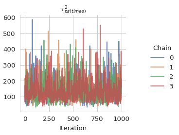

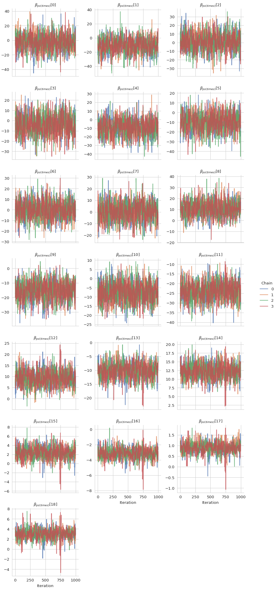

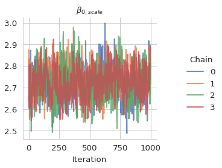

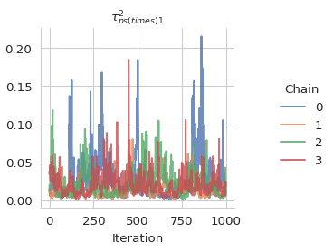

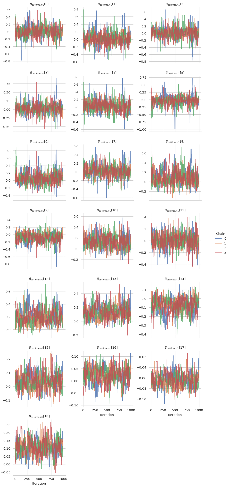

To confirm that the chains have converged to reasonable values, here is
a plot of the estimated mean function:

``` python
plot_loc_estimate(iwls_results, iwls_model, "Estimated mean function (IWLS/Gibbs)")
```


## NUTS sampler

As an alternative, we try using NUTS kernels for all parameters. To do
so, we first build a fresh model with NUTS inference for the regression
coefficients and then log-transform the smoothing variances. This is the
model graph before the transformation:

``` python
nuts_parts = build_mcycle_model(gs.MCMCSpec(gs.NUTSKernel))
nuts_model = nuts_parts["model"]
lsl.plot_vars(nuts_model)
```

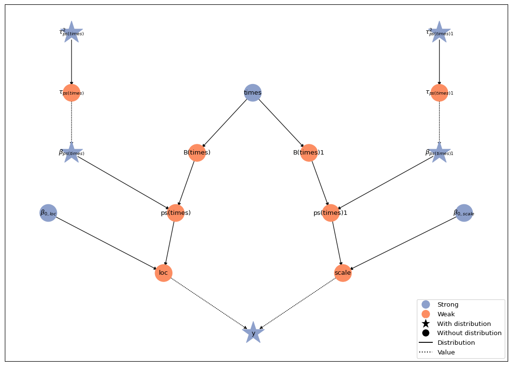

To transform the smoothing variances with the method
{meth}`.Var.transform`, we need to retrieve the nodes and variables from
the model. This is necessary because, while they are part of a model,
the inputs and outputs of nodes and variables cannot be changed. We
retrieve the nodes and variables using
{meth}`.Model.pop_nodes_and_vars`, which renders the model empty.

After transformation, there are two additional variables on the
unconstrained log scale. These transformed smoothing variances receive
NUTS kernels as well.

``` python
nodes, _vars = nuts_model.pop_nodes_and_vars()

loc_tau2_transformed = _vars[nuts_parts["loc_tau2_name"]].transform(
    tfb.Exp(),
    inference=gs.MCMCSpec(gs.NUTSKernel),
)
scale_tau2_transformed = _vars[nuts_parts["scale_tau2_name"]].transform(
    tfb.Exp(),
    inference=gs.MCMCSpec(gs.NUTSKernel),
)

nuts_model = lsl.Model([_vars["y"]])
nuts_parts["model"] = nuts_model
nuts_parts["loc_tau2_transformed_name"] = loc_tau2_transformed.name
nuts_parts["scale_tau2_transformed_name"] = scale_tau2_transformed.name

lsl.plot_vars(nuts_model)
```


Now we can set up the NUTS sampler. In complex models like this one, it
can be beneficial to use individual NUTS samplers for blocks of
parameters. Here, each parameter has its own NUTS kernel through its
`MCMCSpec`.

``` python
builder = gs.LieselMCMC(nuts_model).get_engine_builder(seed=42, num_chains=4)
builder.set_epochs(
    gs.stan_epochs(
        warmup_duration=5000,
        posterior_duration=1000,
        init_duration=750,
        term_duration=500,
    )
)
builder.show_progress = False

engine = builder.build()
engine.sample_all_epochs()
nuts_results = engine.get_results()
```

    liesel.goose.builder - WARNING - No jitter functions provided for position keys '$\\beta_{ps(times)}$', '$\\beta_{ps(times)1}$', '$\\tau_{ps(times)}^2$_transformed', '$\\beta_{0,loc}$', '$\\tau_{ps(times)1}^2$_transformed', '$\\beta_{0,scale}$'. The initial values for these keys won't be jittered
    liesel.goose.engine - INFO - Initializing kernels...
    liesel.goose.engine - INFO - Done
    liesel.goose.engine - INFO - Finished warmup

The NUTS sampler overall seems to do a good job and even yields higher
effective sample sizes than the IWLS sampler, especially for the spline
coefficients of the scale model.

``` python
gs.Summary(nuts_results)
```

<p>
<strong>Parameter summary:</strong>
</p>
<table border="0" class="dataframe">
<thead>
<tr style="text-align: right;">
<th>
</th>
<th>
</th>
<th>
kernel
</th>
<th>
mean
</th>
<th>
sd
</th>
<th>
q_0.05
</th>
<th>
q_0.5
</th>
<th>
q_0.95
</th>
<th>
sample_size
</th>
<th>
ess_bulk
</th>
<th>
ess_tail
</th>
<th>
rhat
</th>
</tr>
<tr>
<th>
parameter
</th>
<th>
index
</th>
<th>
</th>
<th>
</th>
<th>
</th>
<th>
</th>
<th>
</th>
<th>
</th>
<th>
</th>
<th>
</th>
<th>
</th>
<th>
</th>
</tr>
</thead>
<tbody>
<tr>
<th>
$\beta_{0,loc}$
</th>
<th>
()
</th>
<td>
kernel_03
</td>
<td>
-25.369
</td>
<td>
2.006
</td>
<td>
-29.010
</td>
<td>
-25.166
</td>
<td>
-22.577
</td>
<td>
4000
</td>
<td>
43.613
</td>
<td>
52.705
</td>
<td>
1.092
</td>
</tr>
<tr>
<th>
$\beta_{0,scale}$
</th>
<th>
()
</th>
<td>
kernel_05
</td>
<td>
2.724
</td>
<td>
0.073
</td>
<td>
2.608
</td>
<td>
2.720
</td>
<td>
2.844
</td>
<td>
4000
</td>
<td>
821.547
</td>
<td>
1974.596
</td>
<td>
1.004
</td>
</tr>
<tr>
<th rowspan="19" valign="top">
$\beta_{ps(times)1}$
</th>
<th>
(0,)
</th>
<td>
kernel_01
</td>
<td>
-0.004
</td>
<td>
0.144
</td>
<td>
-0.248
</td>
<td>
-0.002
</td>
<td>
0.220
</td>
<td>
4000
</td>
<td>
4842.105
</td>
<td>
1565.868
</td>
<td>
1.008
</td>
</tr>
<tr>
<th>
(1,)
</th>
<td>
kernel_01
</td>
<td>
0.023
</td>
<td>
0.144
</td>
<td>
-0.197
</td>
<td>
0.016
</td>
<td>
0.258
</td>
<td>
4000
</td>
<td>
4832.726
</td>
<td>
1395.071
</td>
<td>
1.004
</td>
</tr>
<tr>
<th>
(2,)
</th>
<td>
kernel_01
</td>
<td>
0.007
</td>
<td>
0.134
</td>
<td>
-0.206
</td>
<td>
0.007
</td>
<td>
0.222
</td>
<td>
4000
</td>
<td>
4905.377
</td>
<td>
1585.187
</td>
<td>
1.011
</td>
</tr>
<tr>
<th>
(3,)
</th>
<td>
kernel_01
</td>
<td>
0.030
</td>
<td>
0.136
</td>
<td>
-0.175
</td>
<td>
0.022
</td>
<td>
0.263
</td>
<td>
4000
</td>
<td>
3397.991
</td>
<td>
1396.298
</td>
<td>
1.008
</td>
</tr>
<tr>
<th>
(4,)
</th>
<td>
kernel_01
</td>
<td>
0.024
</td>
<td>
0.137
</td>
<td>
-0.184
</td>
<td>
0.018
</td>
<td>
0.262
</td>
<td>
4000
</td>
<td>
4286.639
</td>
<td>
1784.165
</td>
<td>
1.005
</td>
</tr>
<tr>
<th>
(5,)
</th>
<td>
kernel_01
</td>
<td>
-0.026
</td>
<td>
0.137
</td>
<td>
-0.266
</td>
<td>
-0.020
</td>
<td>
0.184
</td>
<td>
4000
</td>
<td>
4922.653
</td>
<td>
1172.641
</td>
<td>
1.003
</td>
</tr>
<tr>
<th>
(6,)
</th>
<td>
kernel_01
</td>
<td>
0.053
</td>
<td>
0.141
</td>
<td>
-0.149
</td>
<td>
0.042
</td>
<td>
0.297
</td>
<td>
4000
</td>
<td>
2438.733
</td>
<td>
1255.639
</td>
<td>
1.008
</td>
</tr>
<tr>
<th>
(7,)
</th>
<td>
kernel_01
</td>
<td>
0.010
</td>
<td>
0.124
</td>
<td>
-0.184
</td>
<td>
0.007
</td>
<td>
0.217
</td>
<td>
4000
</td>
<td>
4900.594
</td>
<td>
1824.634
</td>
<td>
1.002
</td>
</tr>
<tr>
<th>
(8,)
</th>
<td>
kernel_01
</td>
<td>
0.089
</td>
<td>
0.139
</td>
<td>
-0.108
</td>
<td>
0.069
</td>
<td>
0.331
</td>
<td>
4000
</td>
<td>
849.349
</td>
<td>
1181.744
</td>
<td>
1.006
</td>
</tr>
<tr>
<th>
(9,)
</th>
<td>
kernel_01
</td>
<td>
-0.084
</td>
<td>
0.123
</td>
<td>
-0.300
</td>
<td>
-0.073
</td>
<td>
0.093
</td>
<td>
4000
</td>
<td>
1116.770
</td>
<td>
1583.504
</td>
<td>
1.003
</td>
</tr>
<tr>
<th>
(10,)
</th>
<td>
kernel_01
</td>
<td>
0.116
</td>
<td>
0.116
</td>
<td>
-0.058
</td>
<td>
0.105
</td>
<td>
0.322
</td>
<td>
4000
</td>
<td>
1196.035
</td>
<td>
2208.095
</td>
<td>
1.003
</td>
</tr>
<tr>
<th>
(11,)
</th>
<td>
kernel_01
</td>
<td>
0.008
</td>
<td>
0.111
</td>
<td>
-0.179
</td>
<td>
0.009
</td>
<td>
0.186
</td>
<td>
4000
</td>
<td>
3149.319
</td>
<td>
2429.953
</td>
<td>
1.010
</td>
</tr>
<tr>
<th>
(12,)
</th>
<td>
kernel_01
</td>
<td>
0.197
</td>
<td>
0.118
</td>
<td>
0.033
</td>
<td>
0.181
</td>
<td>
0.413
</td>
<td>
4000
</td>
<td>
335.780
</td>
<td>
1195.854
</td>
<td>
1.009
</td>
</tr>
<tr>
<th>
(13,)
</th>
<td>
kernel_01
</td>
<td>
0.134
</td>
<td>
0.097
</td>
<td>
-0.009
</td>
<td>
0.126
</td>
<td>
0.305
</td>
<td>
4000
</td>
<td>
701.704
</td>
<td>
1948.889
</td>
<td>
1.006
</td>
</tr>
<tr>
<th>
(14,)
</th>
<td>
kernel_01
</td>
<td>
-0.079
</td>
<td>
0.082
</td>
<td>
-0.228
</td>
<td>
-0.069
</td>
<td>
0.042
</td>
<td>
4000
</td>
<td>
538.975
</td>
<td>
1663.924
</td>
<td>
1.009
</td>
</tr>
<tr>
<th>
(15,)
</th>
<td>
kernel_01
</td>
<td>
0.041
</td>
<td>
0.056
</td>
<td>
-0.041
</td>
<td>
0.038
</td>
<td>
0.139
</td>
<td>
4000
</td>
<td>
752.307
</td>
<td>
1779.916
</td>
<td>
1.004
</td>
</tr>
<tr>
<th>
(16,)
</th>
<td>
kernel_01
</td>
<td>
0.026
</td>
<td>
0.032
</td>
<td>
-0.029
</td>
<td>
0.028
</td>
<td>
0.074
</td>
<td>
4000
</td>
<td>
719.412
</td>
<td>
1919.841
</td>
<td>
1.004
</td>
</tr>
<tr>
<th>
(17,)
</th>
<td>
kernel_01
</td>
<td>
-0.063
</td>
<td>
0.012
</td>
<td>
-0.082
</td>
<td>
-0.064
</td>
<td>
-0.041
</td>
<td>
4000
</td>
<td>
1221.315
</td>
<td>
1430.333
</td>
<td>
1.001
</td>
</tr>
<tr>
<th>
(18,)
</th>
<td>
kernel_01
</td>
<td>
0.109
</td>
<td>
0.048
</td>
<td>
0.031
</td>
<td>
0.109
</td>
<td>
0.190
</td>
<td>
4000
</td>
<td>
1062.062
</td>
<td>
2014.278
</td>
<td>
1.002
</td>
</tr>
<tr>
<th rowspan="19" valign="top">
$\beta_{ps(times)}$
</th>
<th>
(0,)
</th>
<td>
kernel_00
</td>
<td>
-2.607
</td>
<td>
10.849
</td>
<td>
-20.241
</td>
<td>
-2.425
</td>
<td>
15.274
</td>
<td>
4000
</td>
<td>
3303.347
</td>
<td>
2353.446
</td>
<td>
1.001
</td>
</tr>
<tr>
<th>
(1,)
</th>
<td>
kernel_00
</td>
<td>
-11.456
</td>
<td>
10.296
</td>
<td>
-29.047
</td>
<td>
-10.868
</td>
<td>
4.520
</td>
<td>
4000
</td>
<td>
1710.492
</td>
<td>
2147.822
</td>
<td>
1.003
</td>
</tr>
<tr>
<th>
(2,)
</th>
<td>
kernel_00
</td>
<td>
1.716
</td>
<td>
9.298
</td>
<td>
-13.051
</td>
<td>
1.462
</td>
<td>
17.932
</td>
<td>
4000
</td>
<td>
2064.857
</td>
<td>
1521.513
</td>
<td>
1.002
</td>
</tr>
<tr>
<th>
(3,)
</th>
<td>
kernel_00
</td>
<td>
-3.419
</td>
<td>
9.286
</td>
<td>
-18.964
</td>
<td>
-3.347
</td>
<td>
11.909
</td>
<td>
4000
</td>
<td>
2886.417
</td>
<td>
2722.851
</td>
<td>
1.001
</td>
</tr>
<tr>
<th>
(4,)
</th>
<td>
kernel_00
</td>
<td>
-9.347
</td>
<td>
8.932
</td>
<td>
-24.367
</td>
<td>
-9.022
</td>
<td>
4.849
</td>
<td>
4000
</td>
<td>
2358.204
</td>
<td>
2487.737
</td>
<td>
1.002
</td>
</tr>
<tr>
<th>
(5,)
</th>
<td>
kernel_00
</td>
<td>
-10.265
</td>
<td>
8.665
</td>
<td>
-24.618
</td>
<td>
-10.170
</td>
<td>
3.831
</td>
<td>
4000
</td>
<td>
2122.979
</td>
<td>
2195.173
</td>
<td>
1.001
</td>
</tr>
<tr>
<th>
(6,)
</th>
<td>
kernel_00
</td>
<td>
-0.459
</td>
<td>
7.809
</td>
<td>
-13.418
</td>
<td>
-0.307
</td>
<td>
12.276
</td>
<td>
4000
</td>
<td>
2064.042
</td>
<td>
2289.534
</td>
<td>
1.002
</td>
</tr>
<tr>
<th>
(7,)
</th>
<td>
kernel_00
</td>
<td>
0.411
</td>
<td>
7.387
</td>
<td>
-11.625
</td>
<td>
0.415
</td>
<td>
12.450
</td>
<td>
4000
</td>
<td>
2142.239
</td>
<td>
2466.506
</td>
<td>
1.001
</td>
</tr>
<tr>
<th>
(8,)
</th>
<td>
kernel_00
</td>
<td>
10.613
</td>
<td>
6.696
</td>
<td>
-0.013
</td>
<td>
10.596
</td>
<td>
21.887
</td>
<td>
4000
</td>
<td>
1801.249
</td>
<td>
2594.161
</td>
<td>
1.000
</td>
</tr>
<tr>
<th>
(9,)
</th>
<td>
kernel_00
</td>
<td>
-15.575
</td>
<td>
5.949
</td>
<td>
-25.488
</td>
<td>
-15.482
</td>
<td>
-5.976
</td>
<td>
4000
</td>
<td>
1602.088
</td>
<td>
1817.710
</td>
<td>
1.001
</td>
</tr>
<tr>
<th>
(10,)
</th>
<td>
kernel_00
</td>
<td>
-7.663
</td>
<td>
4.899
</td>
<td>
-15.917
</td>
<td>
-7.486
</td>
<td>
0.052
</td>
<td>
4000
</td>
<td>
1351.925
</td>
<td>
2002.459
</td>
<td>
1.001
</td>
</tr>
<tr>
<th>
(11,)
</th>
<td>
kernel_00
</td>
<td>
-23.864
</td>
<td>
4.463
</td>
<td>
-31.348
</td>
<td>
-23.866
</td>
<td>
-16.695
</td>
<td>
4000
</td>
<td>
1272.300
</td>
<td>
1802.697
</td>
<td>
1.002
</td>
</tr>
<tr>
<th>
(12,)
</th>
<td>
kernel_00
</td>
<td>
9.127
</td>
<td>
3.288
</td>
<td>
3.762
</td>
<td>
9.133
</td>
<td>
14.573
</td>
<td>
4000
</td>
<td>
1156.104
</td>
<td>
1553.037
</td>
<td>
1.001
</td>
</tr>
<tr>
<th>
(13,)
</th>
<td>
kernel_00
</td>
<td>
-10.157
</td>
<td>
2.627
</td>
<td>
-14.455
</td>
<td>
-10.171
</td>
<td>
-5.880
</td>
<td>
4000
</td>
<td>
1176.906
</td>
<td>
1469.207
</td>
<td>
1.000
</td>
</tr>
<tr>
<th>
(14,)
</th>
<td>
kernel_00
</td>
<td>
12.255
</td>
<td>
1.916
</td>
<td>
9.134
</td>
<td>
12.233
</td>
<td>
15.346
</td>
<td>
4000
</td>
<td>
1076.985
</td>
<td>
1519.308
</td>
<td>
1.002
</td>
</tr>
<tr>
<th>
(15,)
</th>
<td>
kernel_00
</td>
<td>
2.269
</td>
<td>
1.254
</td>
<td>
0.183
</td>
<td>
2.283
</td>
<td>
4.248
</td>
<td>
4000
</td>
<td>
798.258
</td>
<td>
971.386
</td>
<td>
1.003
</td>
</tr>
<tr>
<th>
(16,)
</th>
<td>
kernel_00
</td>
<td>
-3.121
</td>
<td>
0.646
</td>
<td>
-4.205
</td>
<td>
-3.108
</td>
<td>
-2.115
</td>
<td>
4000
</td>
<td>
971.773
</td>
<td>
1289.352
</td>
<td>
1.000
</td>
</tr>
<tr>
<th>
(17,)
</th>
<td>
kernel_00
</td>
<td>
0.926
</td>
<td>
0.249
</td>
<td>
0.503
</td>
<td>
0.928
</td>
<td>
1.323
</td>
<td>
4000
</td>
<td>
564.444
</td>
<td>
1053.286
</td>
<td>
1.014
</td>
</tr>
<tr>
<th>
(18,)
</th>
<td>
kernel_00
</td>
<td>
3.019
</td>
<td>
0.946
</td>
<td>
1.495
</td>
<td>
3.008
</td>
<td>
4.531
</td>
<td>
4000
</td>
<td>
904.776
</td>
<td>
1093.781
</td>
<td>
1.003
</td>
</tr>
<tr>
<th>
$\tau_{ps(times)1}^2$\_transformed
</th>
<th>
()
</th>
<td>
kernel_04
</td>
<td>
-4.264
</td>
<td>
0.846
</td>
<td>
-5.706
</td>
<td>
-4.236
</td>
<td>
-2.891
</td>
<td>
4000
</td>
<td>
117.647
</td>
<td>
336.641
</td>
<td>
1.034
</td>
</tr>
<tr>
<th>
$\tau_{ps(times)}^2$\_transformed
</th>
<th>
()
</th>
<td>
kernel_02
</td>
<td>
4.835
</td>
<td>
0.432
</td>
<td>
4.154
</td>
<td>
4.834
</td>
<td>
5.562
</td>
<td>
4000
</td>
<td>
715.566
</td>
<td>
1295.437
</td>
<td>
1.001
</td>
</tr>
</tbody>
</table>
<p>
<strong>Acceptance probabilities:</strong>
</p>
<table border="0" class="dataframe">
<thead>
<tr style="text-align: right;">
<th>
</th>
<th>
</th>
<th>
</th>
<th>
acceptance_probability
</th>
<th>
position_moved
</th>
</tr>
<tr>
<th>
kernel
</th>
<th>
positions
</th>
<th>
phase
</th>
<th>
</th>
<th>
</th>
</tr>
</thead>
<tbody>
<tr>
<th rowspan="2" valign="top">
kernel_00
</th>
<th rowspan="2" valign="top">
$\beta_{ps(times)}$
</th>
<th>
posterior
</th>
<td>
0.840
</td>
<td>
NaN
</td>
</tr>
<tr>
<th>
warmup
</th>
<td>
0.795
</td>
<td>
NaN
</td>
</tr>
<tr>
<th rowspan="2" valign="top">
kernel_01
</th>
<th rowspan="2" valign="top">
$\beta_{ps(times)1}$
</th>
<th>
posterior
</th>
<td>
0.846
</td>
<td>
NaN
</td>
</tr>
<tr>
<th>
warmup
</th>
<td>
0.796
</td>
<td>
NaN
</td>
</tr>
<tr>
<th rowspan="2" valign="top">
kernel_02
</th>
<th rowspan="2" valign="top">
$\tau_{ps(times)}^2$\_transformed
</th>
<th>
posterior
</th>
<td>
0.839
</td>
<td>
NaN
</td>
</tr>
<tr>
<th>
warmup
</th>
<td>
0.796
</td>
<td>
NaN
</td>
</tr>
<tr>
<th rowspan="2" valign="top">
kernel_03
</th>
<th rowspan="2" valign="top">
$\beta_{0,loc}$
</th>
<th>
posterior
</th>
<td>
0.831
</td>
<td>
NaN
</td>
</tr>
<tr>
<th>
warmup
</th>
<td>
0.795
</td>
<td>
NaN
</td>
</tr>
<tr>
<th rowspan="2" valign="top">
kernel_04
</th>
<th rowspan="2" valign="top">
$\tau_{ps(times)1}^2$\_transformed
</th>
<th>
posterior
</th>
<td>
0.858
</td>
<td>
NaN
</td>
</tr>
<tr>
<th>
warmup
</th>
<td>
0.795
</td>
<td>
NaN
</td>
</tr>
<tr>
<th rowspan="2" valign="top">
kernel_05
</th>
<th rowspan="2" valign="top">
$\beta_{0,scale}$
</th>
<th>
posterior
</th>
<td>
0.846
</td>
<td>
NaN
</td>
</tr>
<tr>
<th>
warmup
</th>
<td>
0.796
</td>
<td>
NaN
</td>
</tr>
</tbody>
</table>
<p>
<strong>Error summary:</strong>
</p>
<table border="0" class="dataframe">
<thead>
<tr style="text-align: right;">
<th>
</th>
<th>
</th>
<th>
</th>
<th>
</th>
<th>
</th>
<th>
count
</th>
<th>
sample_size
</th>
<th>
sample_size_total
</th>
<th>
relative
</th>
</tr>
<tr>
<th>
kernel
</th>
<th>
positions
</th>
<th>
error_code
</th>
<th>
error_msg
</th>
<th>
phase
</th>
<th>
</th>
<th>
</th>
<th>
</th>
<th>
</th>
</tr>
</thead>
<tbody>
<tr>
<th rowspan="4" valign="top">
kernel_00
</th>
<th rowspan="4" valign="top">
$\beta_{ps(times)}$
</th>
<th rowspan="2" valign="top">
1
</th>
<th rowspan="2" valign="top">
divergent transition
</th>
<th>
warmup
</th>
<td>
1552
</td>
<td>
20000
</td>
<td>
20000
</td>
<td>
0.078
</td>
</tr>
<tr>
<th>
posterior
</th>
<td>
96
</td>
<td>
4000
</td>
<td>
4000
</td>
<td>
0.024
</td>
</tr>
<tr>
<th rowspan="2" valign="top">
2
</th>
<th rowspan="2" valign="top">
maximum tree depth
</th>
<th>
warmup
</th>
<td>
2660
</td>
<td>
20000
</td>
<td>
20000
</td>
<td>
0.133
</td>
</tr>
<tr>
<th>
posterior
</th>
<td>
0
</td>
<td>
4000
</td>
<td>
4000
</td>
<td>
0.000
</td>
</tr>
<tr>
<th rowspan="4" valign="top">
kernel_01
</th>
<th rowspan="4" valign="top">
$\beta_{ps(times)1}$
</th>
<th rowspan="2" valign="top">
1
</th>
<th rowspan="2" valign="top">
divergent transition
</th>
<th>
warmup
</th>
<td>
889
</td>
<td>
20000
</td>
<td>
20000
</td>
<td>
0.044
</td>
</tr>
<tr>
<th>
posterior
</th>
<td>
0
</td>
<td>
4000
</td>
<td>
4000
</td>
<td>
0.000
</td>
</tr>
<tr>
<th rowspan="2" valign="top">
2
</th>
<th rowspan="2" valign="top">
maximum tree depth
</th>
<th>
warmup
</th>
<td>
1
</td>
<td>
20000
</td>
<td>
20000
</td>
<td>
0.000
</td>
</tr>
<tr>
<th>
posterior
</th>
<td>
0
</td>
<td>
4000
</td>
<td>
4000
</td>
<td>
0.000
</td>
</tr>
<tr>
<th rowspan="2" valign="top">
kernel_02
</th>
<th rowspan="2" valign="top">
$\tau_{ps(times)}^2$\_transformed
</th>
<th rowspan="2" valign="top">
1
</th>
<th rowspan="2" valign="top">
divergent transition
</th>
<th>
warmup
</th>
<td>
88
</td>
<td>
20000
</td>
<td>
20000
</td>
<td>
0.004
</td>
</tr>
<tr>
<th>
posterior
</th>
<td>
0
</td>
<td>
4000
</td>
<td>
4000
</td>
<td>
0.000
</td>
</tr>
<tr>
<th rowspan="2" valign="top">
kernel_03
</th>
<th rowspan="2" valign="top">
$\beta_{0,loc}$
</th>
<th rowspan="2" valign="top">
1
</th>
<th rowspan="2" valign="top">
divergent transition
</th>
<th>
warmup
</th>
<td>
138
</td>
<td>
20000
</td>
<td>
20000
</td>
<td>
0.007
</td>
</tr>
<tr>
<th>
posterior
</th>
<td>
0
</td>
<td>
4000
</td>
<td>
4000
</td>
<td>
0.000
</td>
</tr>
<tr>
<th rowspan="2" valign="top">
kernel_04
</th>
<th rowspan="2" valign="top">
$\tau_{ps(times)1}^2$\_transformed
</th>
<th rowspan="2" valign="top">
1
</th>
<th rowspan="2" valign="top">
divergent transition
</th>
<th>
warmup
</th>
<td>
96
</td>
<td>
20000
</td>
<td>
20000
</td>
<td>
0.005
</td>
</tr>
<tr>
<th>
posterior
</th>
<td>
0
</td>
<td>
4000
</td>
<td>
4000
</td>
<td>
0.000
</td>
</tr>
<tr>
<th rowspan="2" valign="top">
kernel_05
</th>
<th rowspan="2" valign="top">
$\beta_{0,scale}$
</th>
<th rowspan="2" valign="top">
1
</th>
<th rowspan="2" valign="top">
divergent transition
</th>
<th>
warmup
</th>
<td>
68
</td>
<td>
20000
</td>
<td>
20000
</td>
<td>
0.003
</td>
</tr>
<tr>
<th>
posterior
</th>
<td>
0
</td>
<td>
4000
</td>
<td>
4000
</td>
<td>
0.000
</td>
</tr>
</tbody>
</table>

``` python
fig = gs.plot_trace(nuts_results, nuts_parts["loc"].intercept.name)
fig = gs.plot_trace(nuts_results, nuts_parts["loc_tau2_transformed_name"])
fig = gs.plot_trace(nuts_results, nuts_parts["loc_smooth"].coef.name)

fig = gs.plot_trace(nuts_results, nuts_parts["scale"].intercept.name)
fig = gs.plot_trace(nuts_results, nuts_parts["scale_tau2_transformed_name"])
fig = gs.plot_trace(nuts_results, nuts_parts["scale_smooth"].coef.name)
```


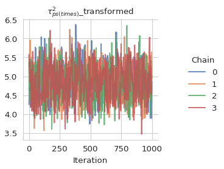

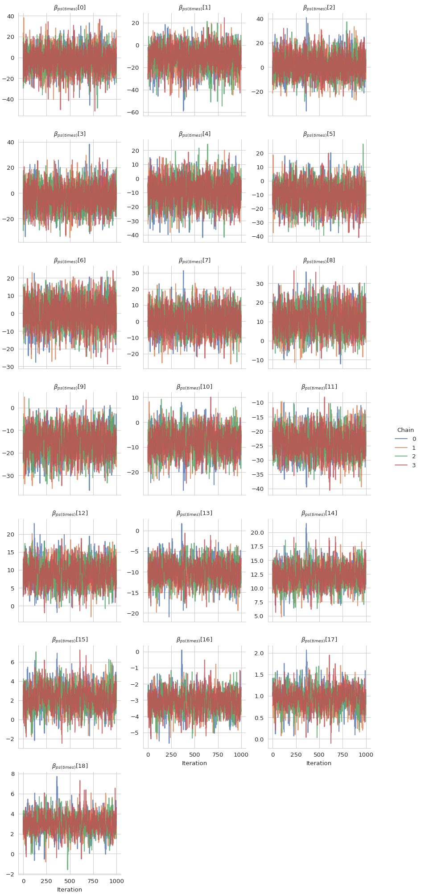

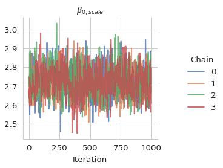

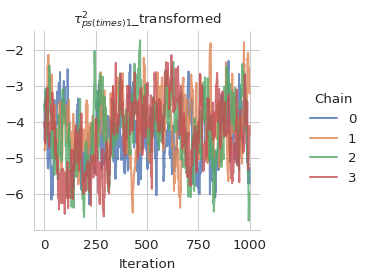

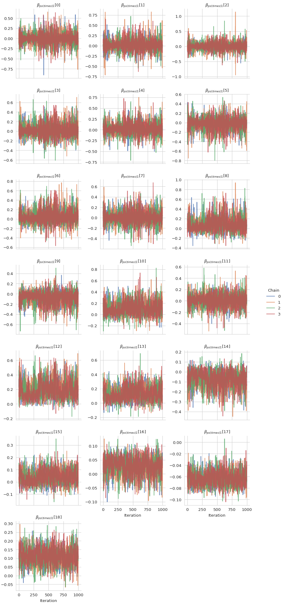

Again, here is a plot of the estimated mean function:

``` python
plot_loc_estimate(nuts_results, nuts_model, "Estimated mean function (NUTS)")
```


