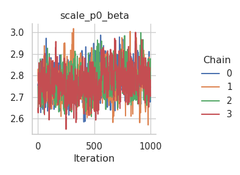
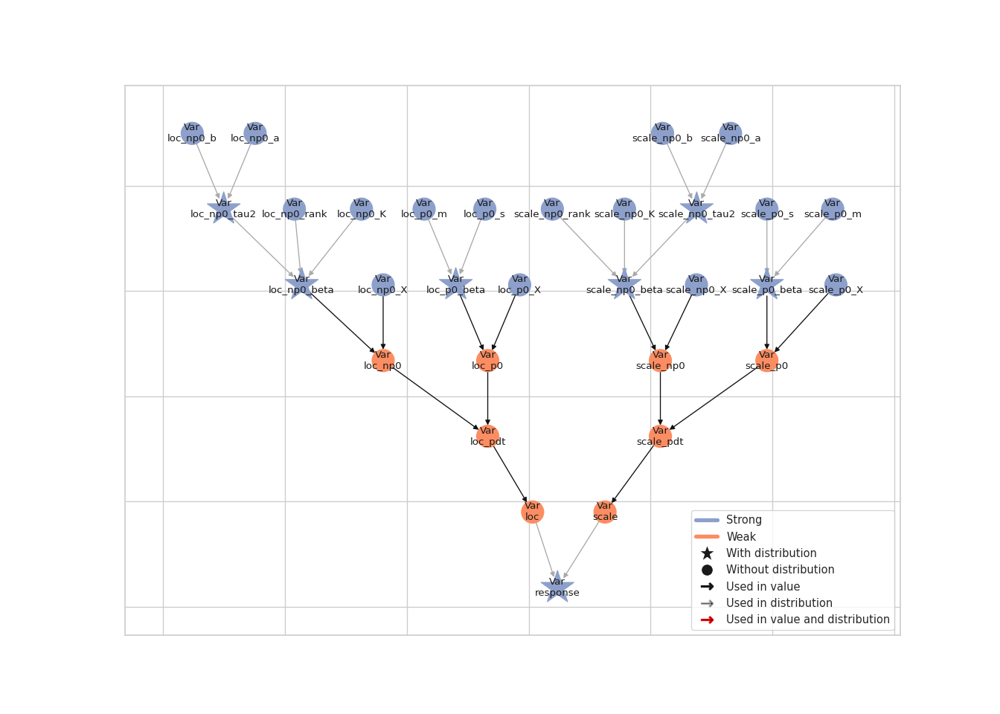
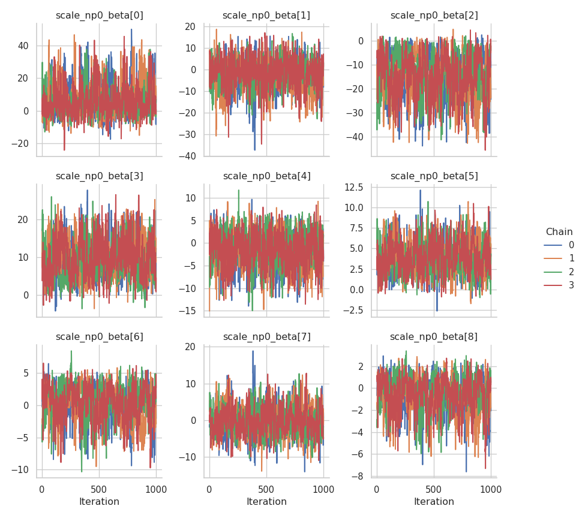

# Comparing samplers

In this tutorial, we are comparing two different sampling schemes on the
`mcycle` dataset with a Gaussian location-scale regression model and two
splines for the mean and the standard deviation. The `mcycle` dataset is
a “data frame giving a series of measurements of head acceleration in a
simulated motorcycle accident, used to test crash helmets” (from the
help page). It contains the following two variables:

- `times`: in milliseconds after impact
- `accel`: in g

We start off in R by loading the dataset and setting up the model with
the `rliesel::liesel()` function.

``` r
library(MASS)
library(rliesel)
```

    Please set your Liesel venv, e.g. with use_liesel_venv()

``` r
data(mcycle)
with(mcycle, plot(times, accel))
```


``` r
model <- liesel(
  response = mcycle$accel,
  distribution = "Normal",
  predictors = list(
    loc = predictor(~ s(times)),
    scale = predictor(~ s(times), inverse_link = "Exp")
  ),
  data = mcycle
)
```

## Metropolis-in-Gibbs

First, we try a Metropolis-in-Gibbs sampling scheme with IWLS kernels
for the regression coefficients ($\boldsymbol{\beta}$) and Gibbs kernels
for the smoothing parameters ($\tau^2$) of the splines.

``` python
import liesel.model as lsl

model = r.model

builder = lsl.dist_reg_mcmc(model, seed=42, num_chains=4)
builder.set_duration(warmup_duration=5000, posterior_duration=1000)

engine = builder.build()
engine.sample_all_epochs()
```

    liesel.goose.engine - INFO - Starting epoch: FAST_ADAPTATION, 75 transitions, 25 jitted together
    liesel.goose.engine - WARNING - Errors per chain for kernel_00: 1, 1, 1, 1 / 75 transitions
    liesel.goose.engine - INFO - Finished epoch
    liesel.goose.engine - INFO - Starting epoch: SLOW_ADAPTATION, 25 transitions, 25 jitted together
    liesel.goose.engine - WARNING - Errors per chain for kernel_02: 1, 0, 1, 0 / 25 transitions
    liesel.goose.engine - INFO - Finished epoch
    liesel.goose.engine - INFO - Starting epoch: SLOW_ADAPTATION, 50 transitions, 25 jitted together
    liesel.goose.engine - INFO - Finished epoch
    liesel.goose.engine - INFO - Starting epoch: SLOW_ADAPTATION, 100 transitions, 25 jitted together
    liesel.goose.engine - INFO - Finished epoch
    liesel.goose.engine - INFO - Starting epoch: SLOW_ADAPTATION, 200 transitions, 25 jitted together
    liesel.goose.engine - WARNING - Errors per chain for kernel_02: 1, 0, 0, 0 / 200 transitions
    liesel.goose.engine - INFO - Finished epoch
    liesel.goose.engine - INFO - Starting epoch: SLOW_ADAPTATION, 400 transitions, 25 jitted together
    liesel.goose.engine - INFO - Finished epoch
    liesel.goose.engine - INFO - Starting epoch: SLOW_ADAPTATION, 800 transitions, 25 jitted together
    liesel.goose.engine - WARNING - Errors per chain for kernel_02: 0, 0, 1, 0 / 800 transitions
    liesel.goose.engine - INFO - Finished epoch
    liesel.goose.engine - INFO - Starting epoch: SLOW_ADAPTATION, 3300 transitions, 25 jitted together
    liesel.goose.engine - WARNING - Errors per chain for kernel_02: 0, 0, 0, 1 / 3300 transitions
    liesel.goose.engine - INFO - Finished epoch
    liesel.goose.engine - INFO - Starting epoch: FAST_ADAPTATION, 50 transitions, 25 jitted together
    liesel.goose.engine - WARNING - Errors per chain for kernel_02: 1, 1, 1, 0 / 50 transitions
    liesel.goose.engine - INFO - Finished epoch
    liesel.goose.engine - INFO - Finished warmup
    liesel.goose.engine - INFO - Starting epoch: POSTERIOR, 1000 transitions, 25 jitted together
    liesel.goose.engine - INFO - Finished epoch

Clearly, the performance of the sampler could be better, especially for
the intercept of the mean. The corresponding chain exhibits a very
strong autocorrelation.

``` python
import liesel.goose as gs

results = engine.get_results()
gs.Summary(results)
```

<p>
<strong>Parameter summary:</strong>
</p>
<table border="0" class="dataframe">
<thead>
<tr style="text-align: right;">
<th>
</th>
<th>
</th>
<th>
kernel
</th>
<th>
mean
</th>
<th>
sd
</th>
<th>
q_0.05
</th>
<th>
q_0.5
</th>
<th>
q_0.95
</th>
<th>
sample_size
</th>
<th>
ess_bulk
</th>
<th>
ess_tail
</th>
<th>
rhat
</th>
</tr>
<tr>
<th>
parameter
</th>
<th>
index
</th>
<th>
</th>
<th>
</th>
<th>
</th>
<th>
</th>
<th>
</th>
<th>
</th>
<th>
</th>
<th>
</th>
<th>
</th>
<th>
</th>
</tr>
</thead>
<tbody>
<tr>
<th rowspan="9" valign="top">
loc_np0_beta_value
</th>
<th>
(0,)
</th>
<td>
kernel_04
</td>
<td>
-119.403038
</td>
<td>
233.495071
</td>
<td>
-505.802191
</td>
<td>
-120.492729
</td>
<td>
2.694191e+02
</td>
<td>
4000
</td>
<td>
132.257845
</td>
<td>
512.157779
</td>
<td>
1.015425
</td>
</tr>
<tr>
<th>
(1,)
</th>
<td>
kernel_04
</td>
<td>
-1420.962158
</td>
<td>
240.655090
</td>
<td>
-1808.566235
</td>
<td>
-1419.474854
</td>
<td>
-1.016125e+03
</td>
<td>
4000
</td>
<td>
165.338457
</td>
<td>
176.266172
</td>
<td>
1.017885
</td>
</tr>
<tr>
<th>
(2,)
</th>
<td>
kernel_04
</td>
<td>
-709.646545
</td>
<td>
178.707748
</td>
<td>
-1006.730701
</td>
<td>
-706.559052
</td>
<td>
-4.232948e+02
</td>
<td>
4000
</td>
<td>
279.278630
</td>
<td>
780.079464
</td>
<td>
1.019900
</td>
</tr>
<tr>
<th>
(3,)
</th>
<td>
kernel_04
</td>
<td>
-557.294067
</td>
<td>
109.322906
</td>
<td>
-738.474078
</td>
<td>
-557.398163
</td>
<td>
-3.774274e+02
</td>
<td>
4000
</td>
<td>
309.191166
</td>
<td>
825.068021
</td>
<td>
1.007417
</td>
</tr>
<tr>
<th>
(4,)
</th>
<td>
kernel_04
</td>
<td>
1127.439575
</td>
<td>
89.926720
</td>
<td>
983.414456
</td>
<td>
1124.765503
</td>
<td>
1.277726e+03
</td>
<td>
4000
</td>
<td>
344.268507
</td>
<td>
896.122800
</td>
<td>
1.009441
</td>
</tr>
<tr>
<th>
(5,)
</th>
<td>
kernel_04
</td>
<td>
-58.807629
</td>
<td>
32.943996
</td>
<td>
-112.954883
</td>
<td>
-59.218452
</td>
<td>
-3.500351e+00
</td>
<td>
4000
</td>
<td>
141.507466
</td>
<td>
485.540266
</td>
<td>
1.034984
</td>
</tr>
<tr>
<th>
(6,)
</th>
<td>
kernel_04
</td>
<td>
-212.155396
</td>
<td>
20.621405
</td>
<td>
-245.611610
</td>
<td>
-212.663506
</td>
<td>
-1.777844e+02
</td>
<td>
4000
</td>
<td>
101.455368
</td>
<td>
592.855398
</td>
<td>
1.051306
</td>
</tr>
<tr>
<th>
(7,)
</th>
<td>
kernel_04
</td>
<td>
116.022903
</td>
<td>
71.976837
</td>
<td>
13.501295
</td>
<td>
108.607349
</td>
<td>
2.421882e+02
</td>
<td>
4000
</td>
<td>
151.025985
</td>
<td>
305.689729
</td>
<td>
1.014641
</td>
</tr>
<tr>
<th>
(8,)
</th>
<td>
kernel_04
</td>
<td>
30.489872
</td>
<td>
18.695335
</td>
<td>
3.988531
</td>
<td>
28.376693
</td>
<td>
6.360944e+01
</td>
<td>
4000
</td>
<td>
136.968685
</td>
<td>
238.310497
</td>
<td>
1.020642
</td>
</tr>
<tr>
<th>
loc_np0_tau2_value
</th>
<th>
()
</th>
<td>
kernel_03
</td>
<td>
719706.125000
</td>
<td>
544008.000000
</td>
<td>
245410.856250
</td>
<td>
576389.937500
</td>
<td>
1.644766e+06
</td>
<td>
4000
</td>
<td>
1670.878007
</td>
<td>
2526.056556
</td>
<td>
1.001389
</td>
</tr>
<tr>
<th>
loc_p0_beta_value
</th>
<th>
(0,)
</th>
<td>
kernel_05
</td>
<td>
-23.883596
</td>
<td>
2.082008
</td>
<td>
-28.098279
</td>
<td>
-23.823547
</td>
<td>
-2.065042e+01
</td>
<td>
4000
</td>
<td>
6.669072
</td>
<td>
17.375864
</td>
<td>
1.639149
</td>
</tr>
<tr>
<th rowspan="9" valign="top">
scale_np0_beta_value
</th>
<th>
(0,)
</th>
<td>
kernel_02
</td>
<td>
7.741402
</td>
<td>
9.286685
</td>
<td>
-4.365677
</td>
<td>
6.132290
</td>
<td>
2.521292e+01
</td>
<td>
4000
</td>
<td>
41.797480
</td>
<td>
50.665901
</td>
<td>
1.101136
</td>
</tr>
<tr>
<th>
(1,)
</th>
<td>
kernel_02
</td>
<td>
-1.487616
</td>
<td>
7.065012
</td>
<td>
-13.362149
</td>
<td>
-1.388491
</td>
<td>
9.481844e+00
</td>
<td>
4000
</td>
<td>
19.680282
</td>
<td>
72.811945
</td>
<td>
1.149851
</td>
</tr>
<tr>
<th>
(2,)
</th>
<td>
kernel_02
</td>
<td>
-16.366385
</td>
<td>
8.685216
</td>
<td>
-31.365293
</td>
<td>
-16.115345
</td>
<td>
-2.102660e+00
</td>
<td>
4000
</td>
<td>
42.544345
</td>
<td>
131.719347
</td>
<td>
1.103997
</td>
</tr>
<tr>
<th>
(3,)
</th>
<td>
kernel_02
</td>
<td>
10.769698
</td>
<td>
4.875222
</td>
<td>
3.014199
</td>
<td>
10.676469
</td>
<td>
1.911103e+01
</td>
<td>
4000
</td>
<td>
15.162523
</td>
<td>
40.887318
</td>
<td>
1.181149
</td>
</tr>
<tr>
<th>
(4,)
</th>
<td>
kernel_02
</td>
<td>
-2.640099
</td>
<td>
3.260811
</td>
<td>
-8.283335
</td>
<td>
-2.635083
</td>
<td>
2.622235e+00
</td>
<td>
4000
</td>
<td>
103.557773
</td>
<td>
147.688591
</td>
<td>
1.045506
</td>
</tr>
<tr>
<th>
(5,)
</th>
<td>
kernel_02
</td>
<td>
4.282590
</td>
<td>
1.725364
</td>
<td>
1.729307
</td>
<td>
4.134390
</td>
<td>
7.276722e+00
</td>
<td>
4000
</td>
<td>
53.424300
</td>
<td>
72.832529
</td>
<td>
1.080459
</td>
</tr>
<tr>
<th>
(6,)
</th>
<td>
kernel_02
</td>
<td>
-0.233927
</td>
<td>
2.377011
</td>
<td>
-4.355846
</td>
<td>
0.009717
</td>
<td>
3.439172e+00
</td>
<td>
4000
</td>
<td>
27.693590
</td>
<td>
88.204544
</td>
<td>
1.140298
</td>
</tr>
<tr>
<th>
(7,)
</th>
<td>
kernel_02
</td>
<td>
-0.039988
</td>
<td>
4.006553
</td>
<td>
-6.126736
</td>
<td>
-0.260180
</td>
<td>
7.207725e+00
</td>
<td>
4000
</td>
<td>
17.334591
</td>
<td>
64.973597
</td>
<td>
1.167601
</td>
</tr>
<tr>
<th>
(8,)
</th>
<td>
kernel_02
</td>
<td>
-0.991641
</td>
<td>
1.540944
</td>
<td>
-3.802304
</td>
<td>
-0.814566
</td>
<td>
1.263287e+00
</td>
<td>
4000
</td>
<td>
35.538904
</td>
<td>
118.741606
</td>
<td>
1.125809
</td>
</tr>
<tr>
<th>
scale_np0_tau2_value
</th>
<th>
()
</th>
<td>
kernel_01
</td>
<td>
122.324188
</td>
<td>
134.471268
</td>
<td>
13.267704
</td>
<td>
81.533337
</td>
<td>
3.650078e+02
</td>
<td>
4000
</td>
<td>
30.298413
</td>
<td>
100.012065
</td>
<td>
1.111863
</td>
</tr>
<tr>
<th>
scale_p0_beta_value
</th>
<th>
(0,)
</th>
<td>
kernel_00
</td>
<td>
2.764577
</td>
<td>
0.069018
</td>
<td>
2.651908
</td>
<td>
2.763070
</td>
<td>
2.882107e+00
</td>
<td>
4000
</td>
<td>
251.452234
</td>
<td>
1049.076030
</td>
<td>
1.018651
</td>
</tr>
</tbody>
</table>
<p>
<strong>Error summary:</strong>
</p>
<table border="0" class="dataframe">
<thead>
<tr style="text-align: right;">
<th>
</th>
<th>
</th>
<th>
</th>
<th>
</th>
<th>
count
</th>
<th>
relative
</th>
</tr>
<tr>
<th>
kernel
</th>
<th>
error_code
</th>
<th>
error_msg
</th>
<th>
phase
</th>
<th>
</th>
<th>
</th>
</tr>
</thead>
<tbody>
<tr>
<th rowspan="2" valign="top">
kernel_00
</th>
<th rowspan="2" valign="top">
90
</th>
<th rowspan="2" valign="top">
nan acceptance prob
</th>
<th>
warmup
</th>
<td>
4
</td>
<td>
0.0002
</td>
</tr>
<tr>
<th>
posterior
</th>
<td>
0
</td>
<td>
0.0000
</td>
</tr>
<tr>
<th rowspan="2" valign="top">
kernel_02
</th>
<th rowspan="2" valign="top">
90
</th>
<th rowspan="2" valign="top">
nan acceptance prob
</th>
<th>
warmup
</th>
<td>
8
</td>
<td>
0.0004
</td>
</tr>
<tr>
<th>
posterior
</th>
<td>
0
</td>
<td>
0.0000
</td>
</tr>
</tbody>
</table>

``` python
fig = gs.plot_trace(results, "loc_p0_beta_value")
```


``` python
fig = gs.plot_trace(results, "loc_np0_tau2_value")
```


``` python
fig = gs.plot_trace(results, "loc_np0_beta_value")
```


``` python
fig = gs.plot_trace(results, "scale_p0_beta_value")
```



``` python
fig = gs.plot_trace(results, "scale_np0_tau2_value")
```


``` python
fig = gs.plot_trace(results, "scale_np0_beta_value")
```


To confirm that the chains have converged to reasonable values, here is
a plot of the estimated mean function:

``` python
summary = gs.Summary(results).to_dataframe().reset_index()
```

``` r
library(dplyr)
```


    Attaching package: 'dplyr'

    The following object is masked from 'package:MASS':

        select

    The following objects are masked from 'package:stats':

        filter, lag

    The following objects are masked from 'package:base':

        intersect, setdiff, setequal, union

``` r
library(ggplot2)
library(reticulate)

summary <- py$summary

beta <- summary %>%
  filter(variable == "loc_np0_beta_value") %>%
  group_by(var_index) %>%
  summarize(mean = mean(mean)) %>%
  ungroup()

beta <- beta$mean
X <- py_to_r(model$vars["loc_np0_X"]$value)
f <- X %*% beta

beta0 <- summary %>%
  filter(variable == "loc_p0_beta_value") %>%
  group_by(var_index) %>%
  summarize(mean = mean(mean)) %>%
  ungroup()

beta0 <- beta0$mean

ggplot(data.frame(times = mcycle$times, mean = beta0 + f)) +
  geom_line(aes(times, mean), color = palette()[2], linewidth = 1) +
  geom_point(aes(times, accel), data = mcycle) +
  ggtitle("Estimated mean function") +
  theme_minimal()
```


## NUTS sampler

As an alternative, we try a NUTS kernel which samples all model
parameters (regression coefficients and smoothing parameters) in one
block. To do so, we first need to log-transform the smoothing
parameters. This is the model graph before the transformation:

``` python
lsl.plot_vars(model)
```



Before transforming the smoothing parameters with the
`lsl.transform_parameter()` function, we first need to copy all model
nodes. Once this is done, we need to update the output nodes of the
smoothing parameters and rebuild the model. There are two additional
nodes in the new model graph.

``` python
import tensorflow_probability.substrates.jax.bijectors as tfb

nodes, _vars = model.pop_nodes_and_vars()

gb = lsl.GraphBuilder()
gb.add(_vars["response"])
```

    GraphBuilder<0 nodes, 1 vars>

``` python
_ = gb.transform(_vars["loc_np0_tau2"], tfb.Exp)
_ = gb.transform(_vars["scale_np0_tau2"], tfb.Exp)
model = gb.build_model()
lsl.plot_vars(model)
```


Now we can set up the NUTS sampler, which is straightforward because we
are using only one kernel.

``` python
parameters = [name for name, var in model.vars.items() if var.parameter]

builder = gs.EngineBuilder(seed=42, num_chains=4)

builder.set_model(lsl.GooseModel(model))
builder.add_kernel(gs.NUTSKernel(parameters))
builder.set_initial_values(model.state)

builder.set_duration(warmup_duration=5000, posterior_duration=1000)

engine = builder.build()
engine.sample_all_epochs()
```

    liesel.goose.engine - INFO - Starting epoch: FAST_ADAPTATION, 75 transitions, 25 jitted together
    liesel.goose.engine - WARNING - Errors per chain for kernel_00: 45, 39, 50, 61 / 75 transitions
    liesel.goose.engine - INFO - Finished epoch
    liesel.goose.engine - INFO - Starting epoch: SLOW_ADAPTATION, 25 transitions, 25 jitted together
    liesel.goose.engine - WARNING - Errors per chain for kernel_00: 24, 18, 10, 15 / 25 transitions
    liesel.goose.engine - INFO - Finished epoch
    liesel.goose.engine - INFO - Starting epoch: SLOW_ADAPTATION, 50 transitions, 25 jitted together
    liesel.goose.engine - WARNING - Errors per chain for kernel_00: 48, 45, 37, 42 / 50 transitions
    liesel.goose.engine - INFO - Finished epoch
    liesel.goose.engine - INFO - Starting epoch: SLOW_ADAPTATION, 100 transitions, 25 jitted together
    liesel.goose.engine - WARNING - Errors per chain for kernel_00: 92, 92, 96, 94 / 100 transitions
    liesel.goose.engine - INFO - Finished epoch
    liesel.goose.engine - INFO - Starting epoch: SLOW_ADAPTATION, 200 transitions, 25 jitted together
    liesel.goose.engine - WARNING - Errors per chain for kernel_00: 191, 193, 188, 186 / 200 transitions
    liesel.goose.engine - INFO - Finished epoch
    liesel.goose.engine - INFO - Starting epoch: SLOW_ADAPTATION, 400 transitions, 25 jitted together
    liesel.goose.engine - WARNING - Errors per chain for kernel_00: 370, 362, 394, 381 / 400 transitions
    liesel.goose.engine - INFO - Finished epoch
    liesel.goose.engine - INFO - Starting epoch: SLOW_ADAPTATION, 800 transitions, 25 jitted together
    liesel.goose.engine - WARNING - Errors per chain for kernel_00: 765, 727, 753, 732 / 800 transitions
    liesel.goose.engine - INFO - Finished epoch
    liesel.goose.engine - INFO - Starting epoch: SLOW_ADAPTATION, 3300 transitions, 25 jitted together
    liesel.goose.engine - WARNING - Errors per chain for kernel_00: 3110, 3081, 3191, 3198 / 3300 transitions
    liesel.goose.engine - INFO - Finished epoch
    liesel.goose.engine - INFO - Starting epoch: FAST_ADAPTATION, 50 transitions, 25 jitted together
    liesel.goose.engine - WARNING - Errors per chain for kernel_00: 49, 47, 48, 48 / 50 transitions
    liesel.goose.engine - INFO - Finished epoch
    liesel.goose.engine - INFO - Finished warmup
    liesel.goose.engine - INFO - Starting epoch: POSTERIOR, 1000 transitions, 25 jitted together
    liesel.goose.engine - WARNING - Errors per chain for kernel_00: 993, 994, 993, 994 / 1000 transitions
    liesel.goose.engine - INFO - Finished epoch

The results are mixed. On the one hand, the NUTS sampler performs much
better on the intercepts (for both the mean and the standard deviation),
but on the other hand, the Metropolis-in-Gibbs sampler with the IWLS
kernels seems to work better for the spline coefficients.

``` python
results = engine.get_results()
gs.Summary(results)
```

    Parameter summary:

                                         kernel         mean  ...     ess_tail      rhat
    parameter                  index                          ...
    loc_np0_beta               (0,)   kernel_00    11.673532  ...    14.401107  2.436901
                               (1,)   kernel_00 -1488.046753  ...    36.895663  1.590867
                               (2,)   kernel_00  -623.860168  ...    11.421196  1.337461
                               (3,)   kernel_00  -628.413818  ...    26.589866  1.503854
                               (4,)   kernel_00  1065.585693  ...    17.178119  1.276066
                               (5,)   kernel_00   -65.920135  ...    33.468692  1.236293
                               (6,)   kernel_00  -213.768723  ...    63.441944  1.257598
                               (7,)   kernel_00    91.995903  ...    81.665802  1.417944
                               (8,)   kernel_00    22.919323  ...    73.982491  1.338466
    loc_np0_tau2_transformed   ()     kernel_00    13.298906  ...  1138.175390  1.020286
    loc_p0_beta                (0,)   kernel_00   -25.285629  ...   581.335653  1.034037
    scale_np0_beta             (0,)   kernel_00     6.400954  ...   635.082588  1.044184
                               (1,)   kernel_00    -1.191610  ...  1961.880470  1.006220
                               (2,)   kernel_00   -14.450949  ...   348.360359  1.047121
                               (3,)   kernel_00     8.874671  ...   894.554860  1.029735
                               (4,)   kernel_00    -1.620016  ...  1082.009165  1.024132
                               (5,)   kernel_00     3.395163  ...   608.891977  1.030695
                               (6,)   kernel_00     0.366245  ...   619.408044  1.040457
                               (7,)   kernel_00    -1.360928  ...  2350.426156  1.010796
                               (8,)   kernel_00    -0.733716  ...   728.456766  1.046305
    scale_np0_tau2_transformed ()     kernel_00     4.053342  ...   208.317028  1.049595
    scale_p0_beta              (0,)   kernel_00     2.768009  ...  2687.686797  1.014150

    [22 rows x 10 columns]

    Error summary:

                                                                              count  relative
    kernel    error_code error_msg                                 phase
    kernel_00 1          divergent transition                      warmup      2271   0.11355
                                                                   posterior      0   0.00000
              2          maximum tree depth                        warmup     15882   0.79410
                                                                   posterior   3974   0.99350
              3          divergent transition + maximum tree depth warmup       669   0.03345
                                                                   posterior      0   0.00000

``` python
fig = gs.plot_trace(results, "loc_p0_beta")
```


``` python
fig = gs.plot_trace(results, "loc_np0_tau2_transformed")
```


``` python
fig = gs.plot_trace(results, "loc_np0_beta")
```


``` python
fig = gs.plot_trace(results, "scale_p0_beta")
```


``` python
fig = gs.plot_trace(results, "scale_np0_tau2_transformed")
```


``` python
fig = gs.plot_trace(results, "scale_np0_beta")
```



Again, here is a plot of the estimated mean function:

``` python
summary = gs.Summary(results).to_dataframe().reset_index()
```

``` r
library(dplyr)
library(ggplot2)
library(reticulate)

summary <- py$summary
model <- py$model

beta <- summary %>%
  filter(variable == "loc_np0_beta") %>%
  group_by(var_index) %>%
  summarize(mean = mean(mean)) %>%
  ungroup()

beta <- beta$mean
X <- model$vars["loc_np0_X"]$value
f <- X %*% beta

beta0 <- summary %>%
  filter(variable == "loc_p0_beta") %>%
  group_by(var_index) %>%
  summarize(mean = mean(mean)) %>%
  ungroup()

beta0 <- beta0$mean

ggplot(data.frame(times = mcycle$times, mean = beta0 + f)) +
  geom_line(aes(times, mean), color = palette()[2], linewidth = 1) +
  geom_point(aes(times, accel), data = mcycle) +
  ggtitle("Estimated mean function") +
  theme_minimal()
```


