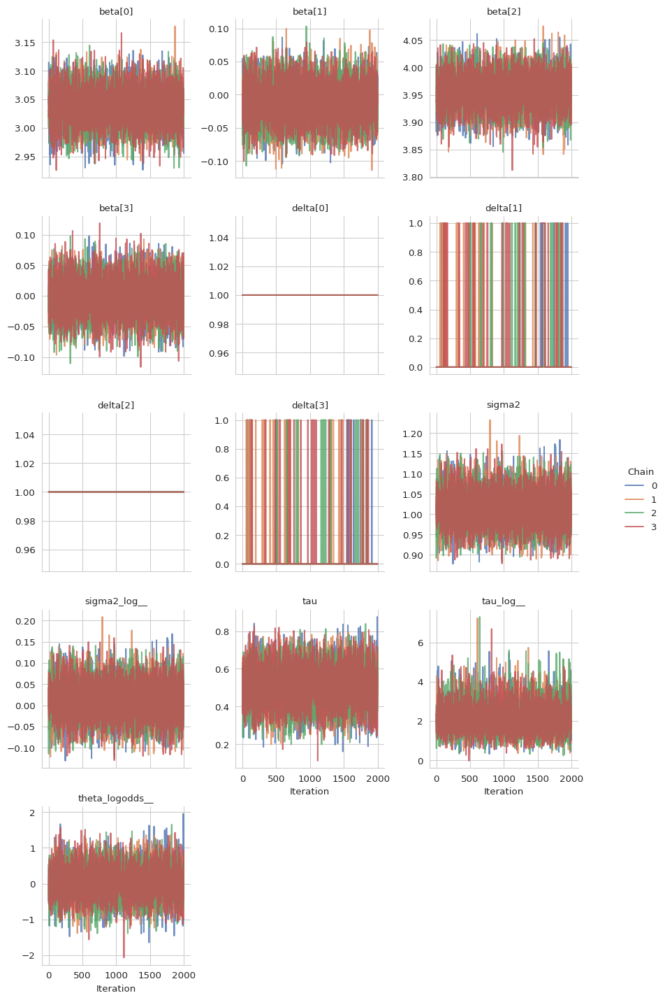

# PyMC and Liesel: Spike and Slab


Liesel provides an interface for
[PyMC](https://www.pymc.io/welcome.html), a popular Python library for
Bayesian Models. In this tutorial, we see how to specify a model in PyMC
and then fit it using Liesel.

Be sure that you have `pymc` installed. If that’s not the case, you can
install Liesel with the optional dependency PyMC.

``` bash
pip install liesel[pymc]
```

We will build a Spike and Slab model, a Bayesian approach that allows
for variable selection by assuming a mixture of two distributions for
the prior distribution of the regression coefficients: a point mass at
zero (the “spike”) and a continuous distribution centered around zero
(the “slab”). The model assumes that each coefficient $\beta_j$ has a
corresponding indicator variable $\delta_j$ that takes a value of either
0 or 1, indicating whether the variable is included in the model or not.
The prior distribution of the indicator variables is a Bernoulli
distribution, with a parameter $\theta$ that controls the sparsity of
the model. When the parameter is close to 1, the model is more likely to
include all variables, while when it is close to 0, the model is more
likely to select only a few variables. In our case, we assign a Beta
hyperprior to $\theta$:

$$\begin{aligned}
\mathbf{y} &\sim \mathcal{N} \left( \mathbf{X}\boldsymbol{\beta}, \sigma^2 \mathbf{I} \right)\\
\boldsymbol{\beta}_j &\sim \mathcal{N}\left(0, (1 - \delta_j)\nu + \delta_j\tau^2_j / \sigma^2 \right)\\
\tau^2_j &\sim \mathcal{IG}(\text{a}_{\tau}, \text{b}_{\tau})\\
\delta_j &\sim\text{Bernoulli}(\theta)\\
\theta &\sim\text{Beta}(\text{a}_\theta, \text{b}_\theta)\\
\sigma^2 &\sim \mathcal{IG}(\text{a}_{\sigma^2}, \text{b}_{\sigma^2})
\end{aligned}.$$

where $\nu$ is a hyperparameter that we set to a fixed small value. That
way, when $\delta_j = 0$, the prior variance for $\beta_j$ is extremely
small, practically forcing it to be close to zero.

First, we generate the data. We use a model with four coefficients but
assume that only two variables are relevant, namely the first and the
third one.

``` python
RANDOM_SEED = 123
rng = np.random.RandomState(RANDOM_SEED)

n = 1000
p = 4

sigma_scalar = 1.0
beta_vec = np.array([3.0, 0.0, 4.0, 0.0])

X = rng.randn(n, p).astype(np.float32)

errors = rng.normal(size=n).astype(np.float32)

y = X @ beta_vec + sigma_scalar * errors
```

Then, we can specify the model using PyMC.

``` python
spike_and_slab_model = pm.Model()

mu = 0.0

alpha_tau = 1.0
beta_tau = 1.0

alpha_sigma = 1.0
beta_sigma = 1.0

alpha_theta = 8.0
beta_theta = 8.0

nu = 0.1

with spike_and_slab_model:
    # priors
    sigma2 = pm.InverseGamma("sigma2", alpha=alpha_sigma, beta=beta_sigma)

    theta = pm.Beta("theta", alpha=alpha_theta, beta=beta_theta)
    delta = pm.Bernoulli("delta", p=theta, size=p)
    tau = pm.InverseGamma("tau", alpha=alpha_tau, beta=beta_tau)

    beta = pm.Normal(
        "beta",
        mu=0.0,
        sigma=nu * (1 - delta) + delta * pm.math.sqrt(tau / sigma2),
        shape=p,
    )

    # make a data node
    Xx = pm.Data("X", X)

    # likelihood
    pm.Normal("y", mu=Xx @ beta, sigma=pm.math.sqrt(sigma2), observed=y)
```

Let’s take a look at our model:

``` python
spike_and_slab_model
```

$$            \begin{array}{rcl}
            \text{X} &= &\operatorname{Data}(\text{<shared>})\\\text{sigma2} &\sim & \operatorname{InverseGamma}(1,~1)\\\text{theta} &\sim & \operatorname{Beta}(8,~8)\\\text{delta} &\sim & \operatorname{Bernoulli}(\text{theta})\\\text{tau} &\sim & \operatorname{InverseGamma}(1,~1)\\\text{beta} &\sim & \operatorname{Normal}(0,~f(\text{delta},~\text{sigma2},~\text{tau}))\\\text{y} &\sim & \operatorname{Normal}(f(\text{X},~\text{beta}),~f(\text{sigma2}))
            \end{array}
            $$

The class {class}`.PyMCInterface` offers an interface between PyMC and
Goose. By default, the constructor of {class}`.PyMCInterface` keeps
track only of a representation of random variables that can be used in
sampling. For example, `theta` is transformed to the real-numbers space
with a log-odds transformation, and therefore the model only keeps track
of `theta_log_odds__`. However, we would like to access the
untransformed samples as well. We can do this by including them in the
`additional_vars` argument of the constructor of the interface.

The initial position can be extracted with {meth}`.get_initial_state`.
The model state is represented as a `Position`.

``` python
interface = PyMCInterface(
    spike_and_slab_model, additional_vars=["sigma2", "tau", "theta"]
)
state = interface.get_initial_state()
```

Since $\delta_j$ is a discrete variable, we need to use a Gibbs sampler
to draw samples for it. Unfortunately, we cannot derive the posterior
analytically, but what we can do is use a Metropolis-Hastings step as a
transition function:

``` python
def delta_transition_fn(prng_key, model_state):
    draw_key, mh_key = jax.random.split(prng_key)
    theta_logodds = model_state["theta_logodds__"]
    p = jax.numpy.exp(theta_logodds) / (1 + jax.numpy.exp(theta_logodds))
    draw = jax.random.bernoulli(draw_key, p=p, shape=(4,))
    proposal = {"delta": jax.numpy.asarray(draw, dtype=np.int64)}
    _, state = gs.mh.mh_step(
        prng_key=mh_key, model=interface, proposal=proposal, model_state=model_state
    )
    return state
```

Finally, we can sample from the posterior as we do for any other Liesel
model. In this case, we use a {class}`~.goose.GibbsKernel` for
$\boldsymbol{\delta}$ and a {class}`~.goose.NUTSKernel` both for the
remaining parameters.

``` python
builder = gs.EngineBuilder(seed=13, num_chains=4)
builder.set_model(interface)
builder.set_initial_values(state)
builder.set_duration(warmup_duration=1000, posterior_duration=2000)

builder.add_kernel(
    gs.NUTSKernel(
        position_keys=["beta", "sigma2_log__", "tau_log__", "theta_logodds__"]
    )
)
builder.add_kernel(gs.GibbsKernel(["delta"], transition_fn=delta_transition_fn))

builder.positions_included = ["sigma2", "tau"]

engine = builder.build()

engine.sample_all_epochs()
```

    liesel.goose.builder - WARNING - No jitter functions provided. The initial values won't be jittered
    liesel.goose.engine - INFO - Initializing kernels...
    /home/runner/work/liesel/liesel/.venv/lib/python3.13/site-packages/jax/_src/numpy/array_methods.py:125: UserWarning: Explicitly requested dtype float64 requested in astype is not available, and will be truncated to dtype float32. To enable more dtypes, set the jax_enable_x64 configuration option or the JAX_ENABLE_X64 shell environment variable. See https://github.com/jax-ml/jax#current-gotchas for more.
      return lax_numpy.astype(self, dtype, copy=copy, device=device)
    liesel.goose.engine - INFO - Done
    liesel.goose.engine - INFO - Starting epoch: FAST_ADAPTATION, 75 transitions, 25 jitted together

      0%|                                                  | 0/3 [00:00<?, ?chunk/s]/tmp/ipykernel_6775/3265445119.py:6: UserWarning: Explicitly requested dtype int64 requested in asarray is not available, and will be truncated to dtype int32. To enable more dtypes, set the jax_enable_x64 configuration option or the JAX_ENABLE_X64 shell environment variable. See https://github.com/jax-ml/jax#current-gotchas for more.
      proposal = {"delta": jax.numpy.asarray(draw, dtype=np.int64)}

     33%|██████████████                            | 1/3 [00:04<00:09,  4.98s/chunk]
    100%|██████████████████████████████████████████| 3/3 [00:04<00:00,  1.66s/chunk]
    liesel.goose.engine - WARNING - Errors per chain for kernel_00: 3, 2, 2, 4 / 75 transitions
    liesel.goose.engine - INFO - Finished epoch
    liesel.goose.engine - INFO - Starting epoch: SLOW_ADAPTATION, 25 transitions, 25 jitted together

      0%|                                                  | 0/1 [00:00<?, ?chunk/s]
    100%|█████████████████████████████████████████| 1/1 [00:00<00:00, 843.58chunk/s]
    liesel.goose.engine - WARNING - Errors per chain for kernel_00: 1, 1, 1, 1 / 25 transitions
    liesel.goose.engine - INFO - Finished epoch
    liesel.goose.engine - INFO - Starting epoch: SLOW_ADAPTATION, 50 transitions, 25 jitted together

      0%|                                                  | 0/2 [00:00<?, ?chunk/s]
    100%|████████████████████████████████████████| 2/2 [00:00<00:00, 1395.78chunk/s]
    liesel.goose.engine - INFO - Finished epoch
    liesel.goose.engine - INFO - Starting epoch: SLOW_ADAPTATION, 100 transitions, 25 jitted together

      0%|                                                  | 0/4 [00:00<?, ?chunk/s]
    100%|████████████████████████████████████████| 4/4 [00:00<00:00, 1858.97chunk/s]
    liesel.goose.engine - WARNING - Errors per chain for kernel_00: 2, 1, 2, 1 / 100 transitions
    liesel.goose.engine - INFO - Finished epoch
    liesel.goose.engine - INFO - Starting epoch: SLOW_ADAPTATION, 200 transitions, 25 jitted together

      0%|                                                  | 0/8 [00:00<?, ?chunk/s]
    100%|█████████████████████████████████████████| 8/8 [00:00<00:00, 688.65chunk/s]
    liesel.goose.engine - WARNING - Errors per chain for kernel_00: 1, 1, 1, 1 / 200 transitions
    liesel.goose.engine - INFO - Finished epoch
    liesel.goose.engine - INFO - Starting epoch: SLOW_ADAPTATION, 500 transitions, 25 jitted together

      0%|                                                 | 0/20 [00:00<?, ?chunk/s]
    100%|███████████████████████████████████████| 20/20 [00:00<00:00, 244.10chunk/s]
    liesel.goose.engine - WARNING - Errors per chain for kernel_00: 1, 1, 1, 1 / 500 transitions
    liesel.goose.engine - INFO - Finished epoch
    liesel.goose.engine - INFO - Starting epoch: FAST_ADAPTATION, 50 transitions, 25 jitted together

      0%|                                                  | 0/2 [00:00<?, ?chunk/s]
    100%|████████████████████████████████████████| 2/2 [00:00<00:00, 1183.83chunk/s]
    liesel.goose.engine - WARNING - Errors per chain for kernel_00: 1, 1, 1, 1 / 50 transitions
    liesel.goose.engine - INFO - Finished epoch
    liesel.goose.engine - INFO - Finished warmup
    liesel.goose.engine - INFO - Starting epoch: POSTERIOR, 2000 transitions, 25 jitted together

      0%|                                                 | 0/80 [00:00<?, ?chunk/s]
     31%|████████████▏                          | 25/80 [00:00<00:00, 245.78chunk/s]
     62%|████████████████████████▍              | 50/80 [00:00<00:00, 203.08chunk/s]
     89%|██████████████████████████████████▌    | 71/80 [00:00<00:00, 193.26chunk/s]
    100%|███████████████████████████████████████| 80/80 [00:00<00:00, 196.45chunk/s]
    liesel.goose.engine - INFO - Finished epoch

Now, we can take a look at the summary of the results and at the trace
plots.

``` python
results = engine.get_results()
print(gs.Summary(results))
```

    /home/runner/work/liesel/liesel/.venv/lib/python3.13/site-packages/arviz_stats/base/diagnostics.py:313: RuntimeWarning: invalid value encountered in scalar divide
      varsd = varvar / evar / 4
    /home/runner/work/liesel/liesel/.venv/lib/python3.13/site-packages/arviz_stats/base/diagnostics.py:313: RuntimeWarning: invalid value encountered in scalar divide
      varsd = varvar / evar / 4
    /home/runner/work/liesel/liesel/.venv/lib/python3.13/site-packages/arviz_stats/base/diagnostics.py:90: RuntimeWarning: invalid value encountered in scalar divide
      (between_chain_variance / within_chain_variance + num_samples - 1) / (num_samples)

                             var_fqn     kernel var_index  sample_size      mean  \
    variable                                                                       
    beta                     beta[0]  kernel_00      (0,)         8000  3.037727   
    beta                     beta[1]  kernel_00      (1,)         8000 -0.010908   
    beta                     beta[2]  kernel_00      (2,)         8000  3.955964   
    beta                     beta[3]  kernel_00      (3,)         8000 -0.001761   
    delta                   delta[0]  kernel_01      (0,)         8000  1.000000   
    delta                   delta[1]  kernel_01      (1,)         8000  0.085125   
    delta                   delta[2]  kernel_01      (2,)         8000  1.000000   
    delta                   delta[3]  kernel_01      (3,)         8000  0.063125   
    sigma2                    sigma2          -        ()         8000  1.014129   
    sigma2_log__        sigma2_log__  kernel_00        ()         8000  0.013033   
    tau                          tau          -        ()         8000  0.508712   
    tau_log__              tau_log__  kernel_00        ()         8000  2.156108   
    theta_logodds__  theta_logodds__  kernel_00        ()         8000  0.036925   

                          var        sd      ess_bulk     ess_tail  mcse_mean  \
    variable                                                                    
    beta             0.001047  0.032364  12350.724123  6256.921075   0.000292   
    beta             0.000906  0.030099  13113.375119  6451.783328   0.000263   
    beta             0.000982  0.031343  14087.219211  5872.803421   0.000265   
    beta             0.000956  0.030924  13099.915481  5619.069861   0.000270   
    delta            0.000000  0.000000   8000.000000  8000.000000   0.000000   
    delta            0.077879  0.279068    373.017695   373.017695   0.014450   
    delta            0.000000  0.000000   8000.000000  8000.000000   0.000000   
    delta            0.059140  0.243188    511.668790   511.668790   0.010752   
    sigma2           0.002056  0.045342  12679.989600  6471.143078   0.000404   
    sigma2_log__     0.001993  0.044640  12680.000414  6471.143078   0.000397   
    tau              0.012407  0.111386   6499.235557  4334.338046   0.001376   
    tau_log__        0.627498  0.792148   7418.998540  4600.136996   0.009974   
    theta_logodds__  0.219882  0.468916   6499.234703  4334.338046   0.005823   

                      mcse_sd      rhat    q_0.05     q_0.5    q_0.95   hdi_low  \
    variable                                                                      
    beta             0.000207  1.002090  2.984296  3.037531  3.090531  2.985247   
    beta             0.000183  1.001970 -0.060500 -0.011142  0.038715 -0.060222   
    beta             0.000192  1.001343  3.904705  3.956123  4.007814  3.901984   
    beta             0.000192  1.001467 -0.052818 -0.001802  0.049597 -0.050066   
    delta                 NaN       NaN  1.000000  1.000000  1.000000  1.000000   
    delta            0.021481  1.013259  0.000000  0.000000  1.000000  0.000000   
    delta                 NaN       NaN  1.000000  1.000000  1.000000  1.000000   
    delta            0.019314  1.007246  0.000000  0.000000  1.000000  0.000000   
    sigma2           0.000291  0.999936  0.941998  1.012915  1.090738  0.942568   
    sigma2_log__     0.000281  0.999939 -0.059752  0.012833  0.086855 -0.056601   
    tau              0.000891  1.000694  0.325165  0.508691  0.692288  0.324628   
    tau_log__        0.009165  1.000442  1.041645  2.055873  3.599275  0.932972   
    theta_logodds__  0.004166  1.000686 -0.730136  0.034769  0.810836 -0.732583   

                     hdi_high  
    variable                   
    beta             3.091338  
    beta             0.038947  
    beta             4.004807  
    beta             0.051560  
    delta            1.000000  
    delta            0.000000  
    delta            1.000000  
    delta            0.000000  
    sigma2           1.090913  
    sigma2_log__     0.089524  
    tau              0.691743  
    tau_log__        3.418921  
    theta_logodds__  0.808280  

As we can see from the posterior means of the $\boldsymbol{\delta}$
parameters, the model was able to recognize those variable with no
influence on the respose $\mathbf{y}$:

1.  $\delta_1$ and $\delta_3$ (`delta[0]` and `delta[2]` in the table)
    have a posterior mean of $1$, indicating inclusion.
2.  $\delta_2$ and $\delta_4$ (`delta[1]` and `delta[3]` in the table)
    have a posterior mean of $0.06$, indicating exclusion.

``` python
gs.plot_trace(results)
```


