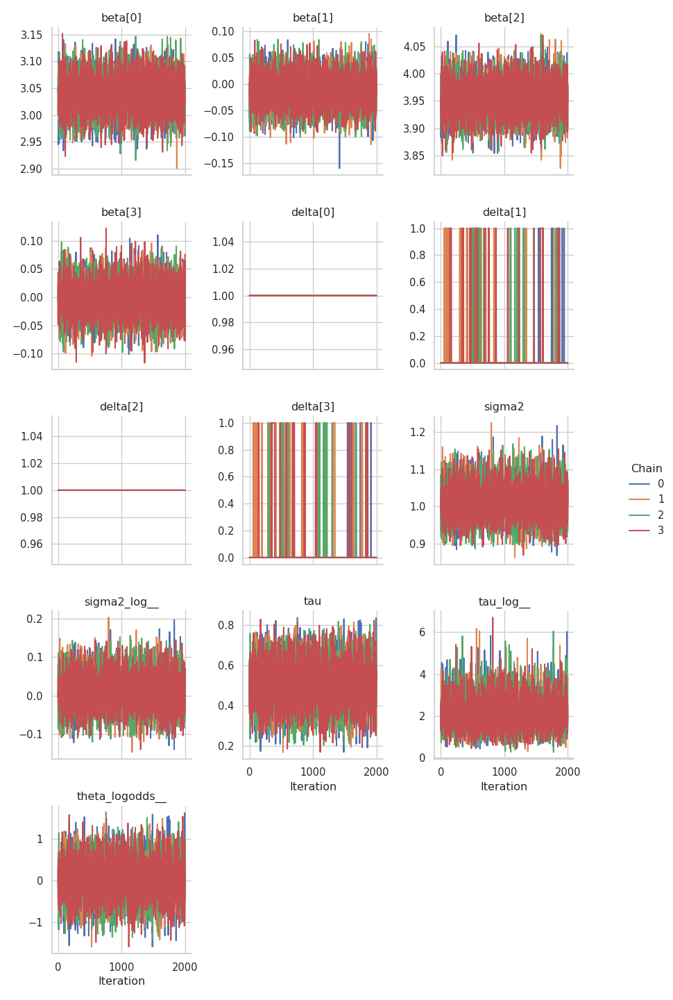
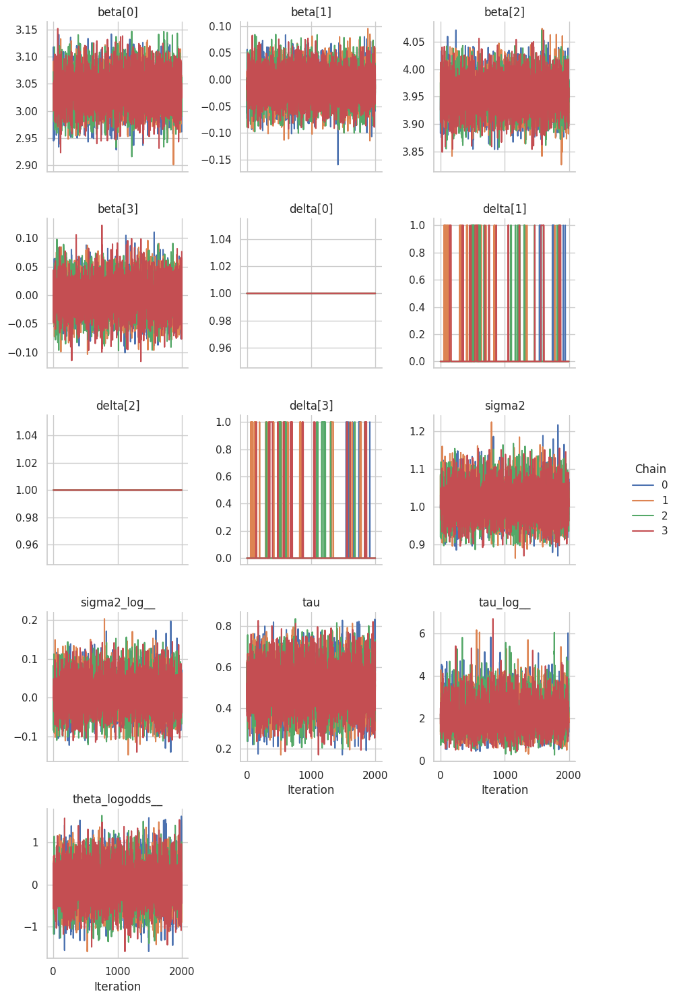

# PyMC and Liesel: Spike and Slab

Liesel provides an interface for
[PyMC](https://www.pymc.io/welcome.html), a popular Python library for
Bayesian Models. In this tutorial, we see how to specify a model in PyMC
and then fit it using Liesel.

Be sure that you have `pymc` installed. If that’s not the case, you can
install Liesel with the optional dependency PyMC.

``` bash
pip install liesel[pymc]
```

We will build a Spike and Slab model, a Bayesian approach that allows
for variable selection by assuming a mixture of two distributions for
the prior distribution of the regression coefficients: a point mass at
zero (the “spike”) and a continuous distribution centered around zero
(the “slab”). The model assumes that each coefficient $\beta_j$ has a
corresponding indicator variable $\delta_j$ that takes a value of either
0 or 1, indicating whether the variable is included in the model or not.
The prior distribution of the indicator variables is a Bernoulli
distribution, with a parameter $\theta$ that controls the sparsity of
the model. When the parameter is close to 1, the model is more likely to
include all variables, while when it is close to 0, the model is more
likely to select only a few variables. In our case, we assign a Beta
hyperprior to $\theta$:

$$
\begin{eqnarray}
\mathbf{y} &\sim& \mathcal{N} \left( \mathbf{X}\boldsymbol{\beta}, \sigma^2 \mathbf{I} \right)\\
\boldsymbol{\beta}_j &\sim& \mathbfcal{N}\left(0, (1 - \delta_j)\nu + \delta_j\tau^2_j / \sigma^2 \right)\\
\tau^2_j &\sim& \mathcal{IG}(\text{a}_{\tau}, \text{b}_{\tau})\\
\delta_j &\sim& \text{Bernoulli}(\theta)\\
\theta &\sim& \text{Beta}(\text{a}_\theta, \text{b}_\theta)\\
\sigma^2 &\sim& \mathcal{IG}(\text{a}_{\sigma^2}, \text{b}_{\sigma^2})
\end{eqnarray}.
$$

where $\nu$ is a hyperparameter that we set to a fixed small value. That
way, when $\delta_j = 0$, the prior variance for $\beta_j$ is extremely
small, practically forcing it to be close to zero.

First, we generate the data. We use a model with four coefficients but
assume that only two variables are relevant, namely the first and the
third one.

``` python
RANDOM_SEED = 123
rng = np.random.RandomState(RANDOM_SEED)

n = 1000
p = 4

sigma_scalar = 1.0
beta_vec = np.array([3.0, 0.0, 4.0, 0.0])

X = rng.randn(n, p).astype(np.float32)

errors = rng.normal(size=n).astype(np.float32)

y = X @ beta_vec + sigma_scalar * errors
```

Then, we can specify the model using PyMC.

``` python
spike_and_slab_model = pm.Model()

mu = 0.

alpha_tau = 1.0
beta_tau = 1.0

alpha_sigma = 1.0
beta_sigma = 1.0

alpha_theta = 8.0
beta_theta = 8.0

nu = 0.1

with spike_and_slab_model:
    # priors
    sigma2 = pm.InverseGamma(
        "sigma2", alpha=alpha_sigma, beta=beta_sigma
    )

    theta = pm.Beta("theta", alpha=alpha_theta, beta=beta_theta)
    delta = pm.Bernoulli("delta", p=theta, size=p)
    tau = pm.InverseGamma("tau", alpha=alpha_tau, beta=beta_tau)

    beta = pm.Normal("beta", mu=0.0, sigma=nu * (1 - delta) + delta * pm.math.sqrt(tau / sigma2), shape=p)

    # make a data node
    Xx = pm.Data("X", X)

    # likelihood
    pm.Normal("y", mu=Xx @ beta, sigma=pm.math.sqrt(sigma2), observed=y)
```

    y

Let’s take a look at our model:

``` python
spike_and_slab_model
```

    <pymc.model.core.Model object at 0x7f82aaefb770>

The class {class}`.PyMCInterface` offers an interface between PyMC and
Goose. By default, the constructor of {class}`.PyMCInterface` keeps
track only of a representation of random variables that can be used in
sampling. For example, `theta` is transformed to the real-numbers space
with a log-odds transformation, and therefore the model only keeps track
of `theta_log_odds__`. However, we would like to access the
untransformed samples as well. We can do this by including them in the
`additional_vars` argument of the constructor of the interface.

The initial position can be extracted with {meth}`.get_initial_state`.
The model state is represented as a `Position`.

``` python
interface = PyMCInterface(spike_and_slab_model, additional_vars=["sigma2", "tau", "theta"])
state = interface.get_initial_state()
```

Since $\delta_j$ is a discrete variable, we need to use a Gibbs sampler
to draw samples for it. Unfortunately, we cannot derive the posterior
analytically, but what we can do is use a Metropolis-Hastings step as a
transition function:

``` python
def delta_transition_fn(prng_key, model_state):
    draw_key, mh_key = jax.random.split(prng_key)
    theta_logodds = model_state["theta_logodds__"]
    p = jax.numpy.exp(theta_logodds) / (1 + jax.numpy.exp(theta_logodds))
    draw = jax.random.bernoulli(draw_key, p=p, shape=(4,))
    proposal = {"delta": jax.numpy.asarray(draw,dtype=np.int64)}
    _, state = gs.mh.mh_step(prng_key=mh_key, model=interface, proposal=proposal, model_state=model_state)
    return state
```

Finally, we can sample from the posterior as we do for any other Liesel
model. In this case, we use a {class}`~.goose.GibbsKernel` for
$\boldsymbol{\delta}$ and a {class}`~.goose.NUTSKernel` both for the
remaining parameters.

``` python
builder = gs.EngineBuilder(seed=13, num_chains=4)
builder.set_model(interface)
builder.set_initial_values(state)
builder.set_duration(warmup_duration=1000, posterior_duration=2000)

builder.add_kernel(gs.NUTSKernel(position_keys=["beta", "sigma2_log__", "tau_log__", "theta_logodds__"]))
builder.add_kernel(gs.GibbsKernel(["delta"], transition_fn=delta_transition_fn))

builder.positions_included = ["sigma2", "tau"]

engine = builder.build()
```

    /home/runner/work/liesel/liesel/.venv/lib/python3.13/site-packages/jax/_src/numpy/array_methods.py:125: UserWarning: Explicitly requested dtype float64 requested in astype is not available, and will be truncated to dtype float32. To enable more dtypes, set the jax_enable_x64 configuration option or the JAX_ENABLE_X64 shell environment variable. See https://github.com/jax-ml/jax#current-gotchas for more.
      return lax_numpy.astype(self, dtype, copy=copy, device=device)

``` python
engine.sample_all_epochs()
```


      0%|                                                  | 0/3 [00:00<?, ?chunk/s]<string>:6: UserWarning: Explicitly requested dtype <class 'numpy.int64'> requested in asarray is not available, and will be truncated to dtype int32. To enable more dtypes, set the jax_enable_x64 configuration option or the JAX_ENABLE_X64 shell environment variable. See https://github.com/jax-ml/jax#current-gotchas for more.

     33%|##############                            | 1/3 [00:05<00:11,  5.86s/chunk]
    100%|##########################################| 3/3 [00:05<00:00,  1.95s/chunk]

      0%|                                                  | 0/1 [00:00<?, ?chunk/s]
    100%|########################################| 1/1 [00:00<00:00, 1596.61chunk/s]

      0%|                                                  | 0/2 [00:00<?, ?chunk/s]
    100%|########################################| 2/2 [00:00<00:00, 1841.22chunk/s]

      0%|                                                  | 0/4 [00:00<?, ?chunk/s]
    100%|########################################| 4/4 [00:00<00:00, 2239.35chunk/s]

      0%|                                                  | 0/8 [00:00<?, ?chunk/s]
    100%|#########################################| 8/8 [00:00<00:00, 561.29chunk/s]

      0%|                                                 | 0/20 [00:00<?, ?chunk/s]
     95%|#####################################  | 19/20 [00:00<00:00, 178.07chunk/s]
    100%|#######################################| 20/20 [00:00<00:00, 174.93chunk/s]

      0%|                                                  | 0/2 [00:00<?, ?chunk/s]
    100%|########################################| 2/2 [00:00<00:00, 1705.00chunk/s]

      0%|                                                 | 0/80 [00:00<?, ?chunk/s]
     25%|#########7                             | 20/80 [00:00<00:00, 199.90chunk/s]
     50%|###################5                   | 40/80 [00:00<00:00, 152.89chunk/s]
     70%|###########################3           | 56/80 [00:00<00:00, 143.76chunk/s]
     89%|##################################6    | 71/80 [00:00<00:00, 139.11chunk/s]
    100%|#######################################| 80/80 [00:00<00:00, 143.62chunk/s]

Now, we can take a look at the summary of the results and at the trace
plots.

``` python
results = engine.get_results()
print(gs.Summary(results))
```

    /home/runner/work/liesel/liesel/.venv/lib/python3.13/site-packages/arviz/stats/diagnostics.py:845: RuntimeWarning: invalid value encountered in scalar divide
      varsd = varvar / evar / 4
    /home/runner/work/liesel/liesel/.venv/lib/python3.13/site-packages/arviz/stats/diagnostics.py:845: RuntimeWarning: invalid value encountered in scalar divide
      varsd = varvar / evar / 4
    /home/runner/work/liesel/liesel/.venv/lib/python3.13/site-packages/arviz/stats/diagnostics.py:596: RuntimeWarning: invalid value encountered in scalar divide
      (between_chain_variance / within_chain_variance + num_samples - 1) / (num_samples)
                             var_fqn     kernel  ...   hdi_low  hdi_high
    variable                                     ...                    
    beta                     beta[0]  kernel_00  ...  2.987183  3.094505
    beta                     beta[1]  kernel_00  ... -0.062750  0.036496
    beta                     beta[2]  kernel_00  ...  3.902568  4.006413
    beta                     beta[3]  kernel_00  ... -0.052731  0.049545
    delta                   delta[0]  kernel_01  ...  1.000000  1.000000
    delta                   delta[1]  kernel_01  ...  0.000000  0.000000
    delta                   delta[2]  kernel_01  ...  1.000000  1.000000
    delta                   delta[3]  kernel_01  ...  0.000000  0.000000
    sigma2                    sigma2          -  ...  0.940337  1.093573
    sigma2_log__        sigma2_log__  kernel_00  ... -0.060735  0.090180
    tau                          tau          -  ...  0.315877  0.677774
    tau_log__              tau_log__  kernel_00  ...  0.982661  3.391420
    theta_logodds__  theta_logodds__  kernel_00  ... -0.772785  0.743561

    [13 rows x 17 columns]

As we can see from the posterior means of the $\boldsymbol{\delta}$
parameters, the model was able to recognize those variable with no
influence on the respose $\mathbf{y}$:

1.  $\delta_1$ and $\delta_3$ (`delta[0]` and `delta[2]` in the table)
    have a posterior mean of $1$, indicating inclusion.
2.  $\delta_2$ and $\delta_4$ (`delta[1]` and `delta[3]` in the table)
    have a posterior mean of $0.06$, indicating exclusion.

``` python
gs.plot_trace(results)
```




