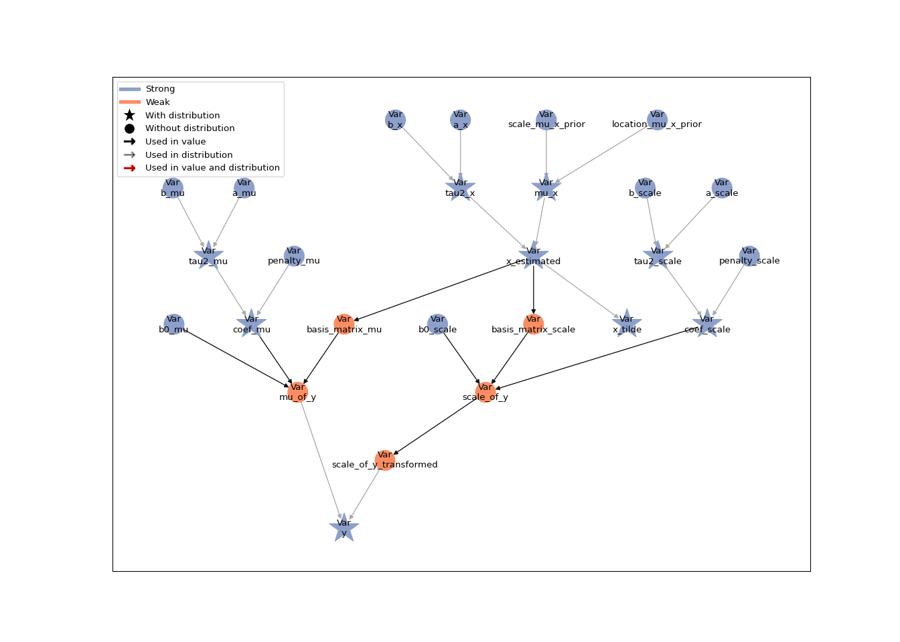
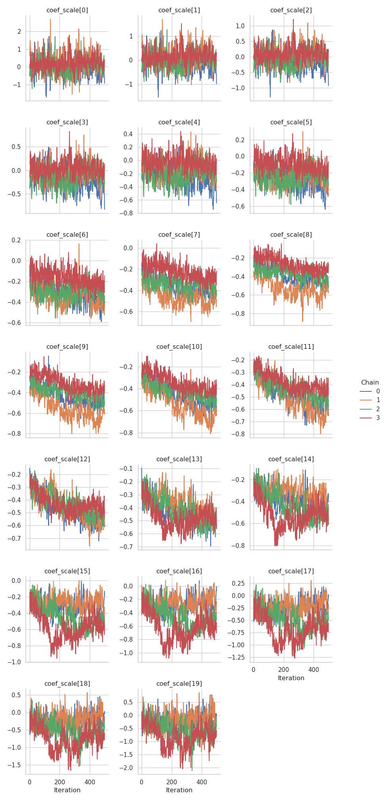
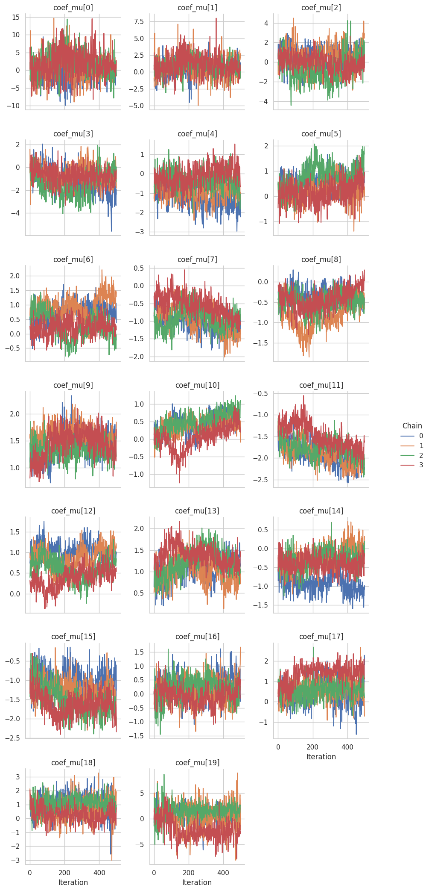
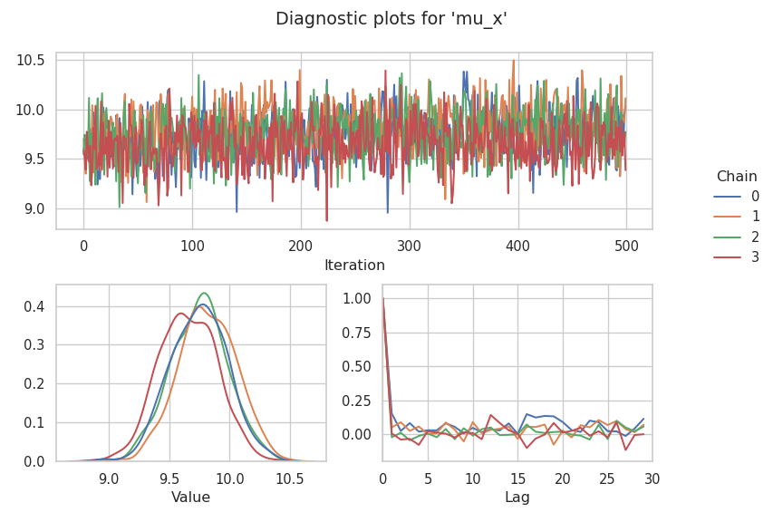

# Bayesian Measurement Error Correction

In this tutorial, we implement a flexible distributional regression
model with Bayesian measurement error correction in Liesel. The model
should capture the (potentially) non-linear effect of a continuous
covariate $x$, which is assumed to be suspect of a measurement error.

## Measurement Error

Assuming a total number of $M$ replicates of the covariate $x$ affected
by measurement error we can write the measurement error model as

$$
\tilde{x}_i^{(m)} = x_i + u_i^{(m)}, \quad m = 1, \ldots, M.
$$

The measurement error is assumed to follow a multivariate Gaussian
model, such that

$$
\mathbf{u}_i \sim N_M(\mathbf{0}, \mathbf{\Sigma}_{u,i})
$$

The fundamental concept behind Bayesian measurement error correction is
to treat the true, unknown covariate values $x_i$ as additional latent
variables. These values are then imputed using MCMC simulations while
simultaneously estimating all other parameters of the model. To achieve
this, a prior distribution is assigned to $x_i$. Additional flexibility
is achieved by adding hyperpriors with assigned prior distributions to
the distribution parameters of $x_i$. $$
x_i \sim N(\mu_x,\tau^2_x), \quad \mu_x \sim N(0, \tau^2_{\mu}), \quad \tau^2_x \sim IG(a_x,b_x)
$$

``` python
import jax
import jax.numpy as jnp
import liesel.model as lsl
import liesel.goose as gs
import liesel.contrib.splines as splines
import tensorflow_probability.substrates.jax as tfp
import tensorflow_probability.substrates.jax.bijectors as tfb
import numpy as np
import pandas as pd

import matplotlib.pyplot as plt
import seaborn as sns

from liesel.contrib.splines import equidistant_knots, basis_matrix
from liesel.distributions.mvn_degen import MultivariateNormalDegenerate

tfd = tfp.distributions
```

## Data

We will start by simulating some data with replicates. To introduce
heteroscedasticity we scale the first half of the covarinace matrices by
one and the second by two.

``` python
# Define the number of samples and replicates
n = 500  # Number of data points
M = 3    # Number of replicates per sample
c_u = 0.75 # define measurement error covariance

np.random.seed(123)

x = np.random.normal(loc=10, scale=5, size=n)

# Generate covariance matrices
def create_sigma_me(dim_sigma_me, c_u):
    Sigma_me = np.zeros((dim_sigma_me, dim_sigma_me))
    for i in range(dim_sigma_me):
        for j in range(dim_sigma_me):
            if i == j:
                Sigma_me[i, j] = 1
            else:
                Sigma_me[i, j] = c_u
    return Sigma_me

# Scale the Sigma_me matrices by individual variance factor
sigma_matrices = []
for i in range(n):
    sigma_sq_ui = 1 if i < n // 2 else 2  # First half scaled by 1, second half by 2
    Sigma_me = create_sigma_me(M, c_u)
    scaled_matrix = sigma_sq_ui * Sigma_me
    sigma_matrices.append(scaled_matrix)

    sigma_matrices_array = jnp.array(np.stack(sigma_matrices))

# Create M replicates of true variable x
replicates = []
for i in range(n):
    mean_vector = np.repeat(x[i], M)
    Sigma_me = sigma_matrices[i]
    samples = np.random.multivariate_normal(mean_vector, Sigma_me)
    replicates.append(samples)

# Generate response variable y
variances = np.random.choice([0.3, 0.5], size=n)
y_true = np.sin(x)
y = np.random.normal(loc=np.sin(x), scale=np.sqrt(variances))

# Convert to JAX arrays
x = jnp.array(x)
x_tilde = jnp.array(np.array(replicates))
y = jnp.array(y)
sigma = jnp.array(np.stack(sigma_matrices))
```

## Implementing the Model in Liesel

Now that we have our data we can define our distributions from above in
Liesel setting $\tau^2_{\mu} = 1000^2$ and $a_x = b_x = 0.001$. We will
initialize $x$ using the mean of our observed measurements. We also need
to assign a distribution to the observed measurements, where we chose a
[`multivariate normal distribution`](https://www.tensorflow.org/probability/api_docs/python/tfp/distributions/MultivariateNormalFullCovariance?hl=en).
Note that we are building a hierarchical model by providing a
{class}`.Var` instance for the `loc` and `scale` arguments of the
different distributions.

``` python
# Define hyperparameters for variance of x
a_x = lsl.Var.new_param(0.001, name = "a_x")
b_x = lsl.Var.new_param(0.001, name = "b_x")

# Define prior for tau2_x using an Inverse Gamma distribution
tau2_x_prior = lsl.Dist(tfd.InverseGamma, concentration = a_x, scale = b_x)
tau2_x = lsl.Var.new_param(10.0, distribution = tau2_x_prior, name = "tau2_x")

# Define hyperparameters for mu_x (mean of x)
location_mu_x_prior = lsl.Var.new_param(0.0, name = "location_mu_x_prior")
scale_mu_x_prior = lsl.Var.new_param(1000.0, name= "scale_mu_x_prior")

# Define prior for mu_x using a Normal distribution
mu_x_prior = lsl.Dist(tfd.Normal, loc = location_mu_x_prior, scale = scale_mu_x_prior)

# Define mu_x as a parameter with the prior distribution
mu_x= lsl.Var.new_param(0.0, distribution = mu_x_prior, name = "mu_x")

# Define prior distribution for x
x_prior_dist = lsl.Dist(tfd.Normal, loc = mu_x, scale = tau2_x)

# Estimate x using the mean of replicates and assign a prior distribution
x_estimated = lsl.Var.new_param(jnp.expand_dims(x_tilde.mean(axis=1), -1), # initial estimation is the mean of the replicates
                                distribution = x_prior_dist,
                                name="x_estimated")

# Define likelihood model for measurement error
measurement_dist = lsl.Dist(
    tfd.MultivariateNormalFullCovariance,
    loc = x_estimated,
    covariance_matrix = sigma
    )

# Define x_tilde (observed replicates) as observed data in the probabilistic model
x_tilde_var = lsl.Var.new_obs(
    value = x_tilde,
    distribution=measurement_dist,
    name="x_tilde"
)
```

## The Distributional Regression Model

Following that we will set up our distributional regression model using
P-splines. Assuming a Gaussian with $N(\mu_i, \sigma_i^{2})$ for the
response, the regression parameters are linked to the model parameters
by $\mu_i = \eta^{\mu}(x_i)$ and
$\sigma_i^{2} = exp(\eta^{\sigma^{2}}(x_i))$, where $exp(\cdot)$ ensures
positivity of the scale parameter. The predictors are then given by:

$$
\eta^{\mu}(x_i) = \beta_{0}^{\mu} + f^{\mu}(x_i)
$$

and

$$
\eta^{\sigma^{2}}(x_i) = \beta_{0}^{\sigma^{2}} + f^{\sigma^{2}}(x_i),
$$

$\beta_{0}$ being an intercept term, and

$$
f(\cdot) = \mathbf{b}_i'\boldsymbol{\beta}.
$$

where $\mathbf{b}_i'$ is defined as the vector of the evaluations of the
basis function and $\boldsymbol{\beta}$ represents the corresponding
vector of the basis coefficients. In our implementation we set
$\beta_0 = 0$. We generate equidistant knots based on the observed
x-values and construct cubic B-spline basis matrices for both functions
using the Liesel {func}`.basis_matrix()` implementation. The number of
knots is set to 20.

``` python
# Define Number of knots/spline parameters to use
n_param_splines = 20

# Generate equidistant knots for spline basis functions based on the mean of replicates (x_tilde)
knots = equidistant_knots(jnp.expand_dims(x_tilde.mean(axis=1), -1), n_param=n_param_splines, order=3)

# Compute spline basis matrix for modeling the mean function
basis_matrix_var_mu = lsl.Var.new_calc(
    lambda x: splines.basis_matrix(
        x.squeeze(),
        knots=knots,    # Use precomputed knots
        order=3,        # Cubic spline basis
        outer_ok=True),
    x = x_estimated,
    name="basis_matrix_mu"
)

# Compute spline basis matrix for modeling the scale
basis_matrix_var_scale = lsl.Var.new_calc(
    lambda x: splines.basis_matrix(
        x.squeeze(),
        knots=knots,
        order=3,
        outer_ok=True),
    x = x_estimated,
    name="basis_matrix_scale"
)

# Define intercept parameters for the mean and scale functions in the spline model
b0_mu = lsl.Var.new_param(0.0, name="b0_mu")
b0_scale = lsl.Var.new_param(0.0, name="b0_scale")

# Predictive function for the spline model
# Computes the linear predictor: intercept + basis function expansion
def pred_fn(beta0, spline_coef, basis_matrix):
    return beta0 + jnp.dot(basis_matrix, spline_coef)
```

To facilitate a large number of basis functions, we assign informative
multivariate Gaussian priors to the vector of spline coefficients,
enforcing certain properties of function estimates, such as smoothness
and shrinkage. To achieve those properties, each parameter vector
$\boldsymbol{\beta}$ is assigned a prior distribution $$\begin{equation}
f(\boldsymbol{\beta}|\tau^2) \propto (\tau^2)^{-\frac{\textrm{rk}(K)}{2}} \exp \left( -\frac{1}{2\tau^2}\boldsymbol{\beta}'K\boldsymbol{\beta} \right),
\end{equation}
$$ with prior variance $\tau^2$ and a positive semi-definite prior
precision matrix $K$.
To enforce smoothness in the spline models, second-order difference
penalties in the prior precision matrices are implemented

``` python
# Define hyperparameters for the variance of the mean function
a_var_mu = lsl.Var(0.001, name = "a_mu")
b_var_mu = lsl.Var(0.001, name = "b_mu")

# Define hyperparameters for the variance of the scale function
a_var_scale = lsl.Var(0.001, name = "a_scale")
b_var_scale = lsl.Var(0.001, name = "b_scale")

# Define prior tau2_mu distributions using Inverse Gamma
prior_tau2_mu = lsl.Dist(tfd.InverseGamma, concentration=a_var_mu, scale=b_var_mu)
tau2_mu = lsl.Var.new_param(10.0, distribution = prior_tau2_mu, name= "tau2_mu")

# Define prior tau2_scale distributions using Inverse Gamma
prior_tau2_scale = lsl.Dist(tfd.InverseGamma, concentration = a_var_scale, scale = b_var_scale)
tau2_scale = lsl.Var.new_param(10.0, distribution = prior_tau2_scale, name= "tau2_scale")

# Compute P-spline penalty matrix (2nd-order difference for smoothness)
penalty = splines.pspline_penalty(d=n_param_splines,diff=2)

# Define penalty matrices for scale and mean functions
penalty_scale = lsl.Var(penalty, name= "penalty_scale")
penalty_mu = lsl.Var(penalty, name= "penalty_mu")

# Compute eigenvalues of the penalty matrix
evals = jax.numpy.linalg.eigvalsh(penalty)

# Compute rank of the penalty matrix (number of positive eigenvalues)
rank_scale = lsl.Value(jnp.sum(evals > 0.0), _name= "rank_scale")
rank_mu = lsl.Value(jnp.sum(evals > 0.0), _name= "rank_mu")

# Compute log determinant of the penalty matrix (ignoring zero eigenvalues)
log_pdet = jnp.log(jnp.where(evals > 0.0, evals, 1.0)).sum()
log_pdet_mu = lsl.Value(log_pdet, _name= "log_pdet_mu")
log_pdet_scale = lsl.Value(log_pdet, _name= "log_pdet_scale")

# Define prior distribution for spline coefficients (scale function)
prior_coef_scale  = lsl.Dist(
    MultivariateNormalDegenerate.from_penalty,
    loc= jnp.zeros(shape=(n_param_splines,)),
    var= tau2_scale,
    pen= penalty_scale,
    rank = rank_scale,
    log_pdet=log_pdet_scale
    )

# Initialize spline coefficients for scale function
start_value_scale = np.zeros(np.shape(penalty)[-1], np.float32)
coef_scale = lsl.Var.new_param(start_value_scale, distribution= prior_coef_scale, name= "coef_scale")

# Define prior distribution for spline coefficients (mean function)
prior_coef_mu  = lsl.Dist(
    MultivariateNormalDegenerate.from_penalty,
    loc= jnp.zeros(shape=(n_param_splines,)),
    var=tau2_mu,
    pen= penalty_mu,
    rank = rank_mu,
    log_pdet=log_pdet_mu
    )

# Initialize spline coefficients for mean function
start_value_mu = np.zeros(np.shape(penalty)[-1], np.float32)
coef_mu = lsl.Var.new_param(start_value_mu, distribution= prior_coef_mu, name= "coef_mu")
```

Then we can implement functions to calculate the the standard deviation
and mean of our response, using {class}`.new_calc`.

``` python
# Compute the scale (standard deviation) of y using the spline model
scale_of_y = lsl.Var.new_calc(
    pred_fn,
    beta0=b0_scale,                       # Intercept for scale function
    spline_coef=coef_scale,               # Spline coefficients for scale
    basis_matrix=basis_matrix_var_scale,  # Basis matrix for scale
    name="scale_of_y"
)

# Transform scale_of_y to ensure positivity (exponential transformation)
scale_of_y_transformed = lsl.Var.new_calc(jnp.exp, scale_of_y, name = "scale_of_y_transformed")

# Compute the mean (mu) of y using the spline model
mu_of_y = lsl.Var.new_calc(
    pred_fn,
    beta0= b0_mu,
    spline_coef = coef_mu,
    basis_matrix = basis_matrix_var_mu,
    name="mu_of_y"
)

# Define the likelihood distribution of y (Normal with estimated mean and scale)
y_dist = lsl.Dist(
    tfd.Normal,
    loc=mu_of_y,
    scale= scale_of_y_transformed
  )

# Define y as an observed variable with the specified distribution
y_var = lsl.Var.new_obs(
    value=y,
    distribution=y_dist,
    name="y"
)
```

And take a look at our model

``` python
# create joint model for x and y
model = lsl.Model([y_var, x_tilde_var])

# Plot tree
model.plot_vars()
```



## MCMC Inference

We choose {class}`~.goose.IWLSKernel` Kernels for generating posterior
samples of the scale and mean coefficients. To draw from $\mu_x$,
$\tau^2_x$, $\tau^2_{\mu}$ and $\tau^2_{\sigma}$ we use Gibbs kernels
({class}`~.goose.GibbsKernel`) kernels, as this allows us to use custom
transition functions for our parameters. The full conditionals are:

$$
\begin{eqnarray}
\mu_x | \cdot \sim N \left(\frac{n\bar{x}\tau^2_\mu}{n\tau^2_\mu+\tau^2_x},\frac{\tau^2_x\tau^2_\mu}{n\tau^2_\mu+\tau^2_x}\right)\\
\tau^2_x | \cdot \sim IG \left( a_x + \frac{n}{2}, b_x + \frac{1}{2}\sum_{i=1}^{n}(x_i - \mu_x)^2   \right)\\
\tau^2|\cdot \sim IG\left(a + \frac{rk(\mathbf{K})}{2}, b + \frac{1}{2} \boldsymbol{\beta'K\beta}\right)\\
\end{eqnarray}.
$$

``` python
def transition_tau_mu(prng_key, model_state):
    """
    Sample tau2_mu from its posterior distribution using Gibbs sampling.

    Args:
        prng_key: The random number generator key for sampling.
        model_state: A dictionary containing the model parameters and state.

    Returns:
        dict: A dictionary containing the sampled tau2_mu.
    """
    # Extract relevant parameters from model state
    pos = interface.extract_position(
        position_keys=["a_mu", "b_mu", "rank_mu", "penalty_mu", "coef_mu"],
        model_state=model_state
    )
    # Extract values from position
    a_prior = pos["a_mu"]
    b_prior = pos["b_mu"]
    rank = pos["rank_mu"]
    K = pos["penalty_mu"]
    beta = pos["coef_mu"]

    # Compute the Gibbs sampling parameters
    a_gibbs = jnp.squeeze(a_prior + 0.5 * rank)
    b_gibbs = jnp.squeeze(b_prior + 0.5 * (beta @ K @ beta))

    # Draw a sample from the gamma distribution
    draw = b_gibbs / jax.random.gamma(prng_key, a_gibbs)

    return {"tau2_mu": draw}


def transition_tau_scale(prng_key, model_state):
    """
    Sample tau_scale from its posterior distribution using Gibbs sampling.

    Args:
        prng_key: The random number generator key for sampling.
        model_state: A dictionary containing the model parameters and state.

    Returns:
        dict: A dictionary containing the sampled tau_scale.
    """
    # Extract relevant parameters from model state
    pos = interface.extract_position(
        position_keys=["a_scale", "b_scale", "rank_scale", "penalty_scale", "coef_scale"],
        model_state=model_state
    )
    # Extract values from position
    a_prior = pos["a_scale"]
    b_prior = pos["b_scale"]
    rank = pos["rank_scale"]
    K = pos["penalty_scale"]
    beta = pos["coef_scale"]

    # Compute the Gibbs sampling parameters
    a_gibbs = jnp.squeeze(a_prior + 0.5 * rank)
    b_gibbs = jnp.squeeze(b_prior + 0.5 * (beta @ K @ beta))

    # Draw a sample from the gamma distribution
    draw = b_gibbs / jax.random.gamma(prng_key, a_gibbs)

    return {"tau2_scale" : draw}

def transition_mu_x(prng_key, model_state):
    """
    Sample mu_x from its posterior distribution conditioned on the data.

    Args:
        prng_key: The random number generator key for sampling.
        model_state: A dictionary containing the model parameters and state.

    Returns:
        dict: A dictionary containing the sampled mu_x.
    """
    # Extract relevant parameters from model state
    pos = interface.extract_position(
        position_keys=["x_estimated", "tau2_mu", "tau2_x", "a_x", "b_x"],
        model_state=model_state
    )
    x = pos["x_estimated"]
    n = len(x)
    tau2_mu = pos["tau2_mu"]
    tau2_x = pos["tau2_x"]
    a_x = pos["a_x"]
    b_x = pos["b_x"]

    # Compute the posterior mean and standard deviation for mu_x
    normal_sample = jax.random.normal(prng_key, (1,))
    mu_mean = (n * jnp.mean(x) * tau2_mu) / (n * tau2_mu + tau2_x)
    mu_std = jnp.sqrt(tau2_x * tau2_mu / (n * tau2_mu + tau2_x))

    # Sample mu_x from a normal distribution
    mu_x = jnp.squeeze(mu_mean + mu_std * normal_sample)

    return {"mu_x": mu_x}


def transition_tau2_x(prng_key, model_state):
    """
    Sample tau2_x from its posterior distribution using the inverse gamma distribution.

    Args:
        prng_key: The random number generator key for sampling.
        model_state: A dictionary containing the model parameters and state.

    Returns:
        dict: A dictionary containing the sampled tau2_x.
    """
    # Extract relevant parameters from model state
    pos = interface.extract_position(
        position_keys=["a_x", "b_x", "x_estimated", "mu_x", "b_x"],
        model_state=model_state
    )
    a_x = pos["a_x"]
    b_x = pos["b_x"]
    x = pos["x_estimated"]
    n = len(x)
    mu_x = pos["mu_x"]

    # Compute the new alpha and beta for the inverse gamma distribution
    alpha_new = a_x + n / 2
    beta_new = b_x + ((x - mu_x)**2).sum() / 2

    # Sample tau2_x from the inverse gamma distribution
    tau2_x = jnp.squeeze(tfd.InverseGamma(concentration=alpha_new, scale=beta_new).sample(seed=prng_key))

    return {"tau2_x" : tau2_x}
```

Further we utilize a random walk kernel ({class}`~.goose.RWKernel`) to
sample the $x$ values. We set up our engine and draw 5000 posterior
samples.

``` python
#add kernels and return engine
interface = gs.LieselInterface(model)
eb_sample = gs.EngineBuilder(seed = 2 , num_chains=4)
eb_sample.set_model(gs.LieselInterface(model))
eb_sample.set_initial_values(model.state)

eb_sample.add_kernel(gs.IWLSKernel(["coef_scale"]))
eb_sample.add_kernel(gs.IWLSKernel(["coef_mu"]))
eb_sample.add_kernel(gs.GibbsKernel(["tau2_mu"], transition_tau_mu))
eb_sample.add_kernel(gs.GibbsKernel(["tau2_scale"], transition_tau_scale))
eb_sample.add_kernel(gs.GibbsKernel(["mu_x"], transition_mu_x))
eb_sample.add_kernel(gs.RWKernel(["x_estimated"]))
eb_sample.add_kernel(gs.GibbsKernel(["tau2_x"], transition_tau2_x))


eb_sample.set_duration(warmup_duration = 1000, posterior_duration = 5000, thinning_posterior=10)

eb_sample.positions_included = ["mu_of_y", "scale_of_y_transformed"]

engine = eb_sample.build()
engine.sample_all_epochs()
```


      0%|                                                  | 0/3 [00:00<?, ?chunk/s]
     33%|##############                            | 1/3 [00:07<00:14,  7.00s/chunk]
    100%|##########################################| 3/3 [00:07<00:00,  1.85s/chunk]
    100%|##########################################| 3/3 [00:07<00:00,  2.37s/chunk]

      0%|                                                  | 0/1 [00:00<?, ?chunk/s]
    100%|##########################################| 1/1 [00:00<00:00, 20.88chunk/s]

      0%|                                                  | 0/2 [00:00<?, ?chunk/s]
    100%|##########################################| 2/2 [00:00<00:00, 19.90chunk/s]
    100%|##########################################| 2/2 [00:00<00:00, 19.87chunk/s]

      0%|                                                  | 0/4 [00:00<?, ?chunk/s]
     50%|#####################                     | 2/4 [00:00<00:00, 18.96chunk/s]
    100%|##########################################| 4/4 [00:00<00:00, 19.03chunk/s]
    100%|##########################################| 4/4 [00:00<00:00, 19.00chunk/s]

      0%|                                                  | 0/8 [00:00<?, ?chunk/s]
     25%|##########5                               | 2/8 [00:00<00:00, 18.48chunk/s]
     50%|#####################                     | 4/8 [00:00<00:00, 18.64chunk/s]
     75%|###############################5          | 6/8 [00:00<00:00, 18.80chunk/s]
    100%|##########################################| 8/8 [00:00<00:00, 18.90chunk/s]
    100%|##########################################| 8/8 [00:00<00:00, 18.81chunk/s]

      0%|                                                 | 0/20 [00:00<?, ?chunk/s]
     10%|####1                                    | 2/20 [00:00<00:00, 19.14chunk/s]
     20%|########2                                | 4/20 [00:00<00:00, 18.90chunk/s]
     30%|############2                            | 6/20 [00:00<00:00, 19.09chunk/s]
     40%|################4                        | 8/20 [00:00<00:00, 19.38chunk/s]
     50%|####################                    | 10/20 [00:00<00:00, 19.50chunk/s]
     60%|########################                | 12/20 [00:00<00:00, 19.49chunk/s]
     70%|############################            | 14/20 [00:00<00:00, 19.27chunk/s]
     80%|################################        | 16/20 [00:00<00:00, 19.25chunk/s]
     90%|####################################    | 18/20 [00:00<00:00, 19.18chunk/s]
    100%|########################################| 20/20 [00:01<00:00, 19.02chunk/s]
    100%|########################################| 20/20 [00:01<00:00, 19.19chunk/s]

      0%|                                                  | 0/2 [00:00<?, ?chunk/s]
    100%|##########################################| 2/2 [00:00<00:00, 19.44chunk/s]
    100%|##########################################| 2/2 [00:00<00:00, 19.40chunk/s]

      0%|                                                | 0/200 [00:00<?, ?chunk/s]
      0%|2                                       | 1/200 [00:00<00:47,  4.21chunk/s]
      1%|4                                       | 2/200 [00:00<00:46,  4.27chunk/s]
      2%|8                                       | 4/200 [00:00<00:24,  8.06chunk/s]
      3%|#2                                      | 6/200 [00:00<00:17, 10.81chunk/s]
      4%|#6                                      | 8/200 [00:00<00:15, 12.67chunk/s]
      5%|#9                                     | 10/200 [00:00<00:13, 14.01chunk/s]
      6%|##3                                    | 12/200 [00:01<00:12, 15.03chunk/s]
      7%|##7                                    | 14/200 [00:01<00:11, 15.91chunk/s]
      8%|###1                                   | 16/200 [00:01<00:11, 16.32chunk/s]
      9%|###5                                   | 18/200 [00:01<00:10, 16.69chunk/s]
     10%|###9                                   | 20/200 [00:01<00:10, 16.75chunk/s]
     11%|####2                                  | 22/200 [00:01<00:10, 16.84chunk/s]
     12%|####6                                  | 24/200 [00:01<00:10, 17.00chunk/s]
     13%|#####                                  | 26/200 [00:01<00:10, 17.08chunk/s]
     14%|#####4                                 | 28/200 [00:01<00:10, 16.79chunk/s]
     15%|#####8                                 | 30/200 [00:02<00:10, 16.59chunk/s]
     16%|######2                                | 32/200 [00:02<00:10, 16.65chunk/s]
     17%|######6                                | 34/200 [00:02<00:09, 16.65chunk/s]
     18%|#######                                | 36/200 [00:02<00:09, 16.80chunk/s]
     19%|#######4                               | 38/200 [00:02<00:09, 16.32chunk/s]
     20%|#######8                               | 40/200 [00:02<00:09, 16.13chunk/s]
     21%|########1                              | 42/200 [00:02<00:09, 16.45chunk/s]
     22%|########5                              | 44/200 [00:02<00:09, 16.48chunk/s]
     23%|########9                              | 46/200 [00:03<00:09, 16.48chunk/s]
     24%|#########3                             | 48/200 [00:03<00:09, 16.33chunk/s]
     25%|#########7                             | 50/200 [00:03<00:09, 16.30chunk/s]
     26%|##########1                            | 52/200 [00:03<00:08, 16.53chunk/s]
     27%|##########5                            | 54/200 [00:03<00:08, 16.52chunk/s]
     28%|##########9                            | 56/200 [00:03<00:08, 16.46chunk/s]
     29%|###########3                           | 58/200 [00:03<00:08, 16.56chunk/s]
     30%|###########7                           | 60/200 [00:03<00:08, 16.63chunk/s]
     31%|############                           | 62/200 [00:04<00:08, 16.73chunk/s]
     32%|############4                          | 64/200 [00:04<00:08, 16.73chunk/s]
     33%|############8                          | 66/200 [00:04<00:08, 16.58chunk/s]
     34%|#############2                         | 68/200 [00:04<00:07, 16.73chunk/s]
     35%|#############6                         | 70/200 [00:04<00:07, 16.60chunk/s]
     36%|##############                         | 72/200 [00:04<00:07, 16.61chunk/s]
     37%|##############4                        | 74/200 [00:04<00:07, 16.69chunk/s]
     38%|##############8                        | 76/200 [00:04<00:07, 16.97chunk/s]
     39%|###############2                       | 78/200 [00:04<00:07, 16.92chunk/s]
     40%|###############6                       | 80/200 [00:05<00:07, 16.90chunk/s]
     41%|###############9                       | 82/200 [00:05<00:06, 17.03chunk/s]
     42%|################3                      | 84/200 [00:05<00:06, 16.87chunk/s]
     43%|################7                      | 86/200 [00:05<00:06, 16.98chunk/s]
     44%|#################1                     | 88/200 [00:05<00:06, 17.15chunk/s]
     45%|#################5                     | 90/200 [00:05<00:06, 17.18chunk/s]
     46%|#################9                     | 92/200 [00:05<00:06, 16.95chunk/s]
     47%|##################3                    | 94/200 [00:05<00:06, 16.92chunk/s]
     48%|##################7                    | 96/200 [00:06<00:06, 16.84chunk/s]
     49%|###################1                   | 98/200 [00:06<00:06, 16.89chunk/s]
     50%|###################                   | 100/200 [00:06<00:05, 16.84chunk/s]
     51%|###################3                  | 102/200 [00:06<00:05, 16.93chunk/s]
     52%|###################7                  | 104/200 [00:06<00:05, 17.02chunk/s]
     53%|####################1                 | 106/200 [00:06<00:05, 17.07chunk/s]
     54%|####################5                 | 108/200 [00:06<00:05, 17.15chunk/s]
     55%|####################9                 | 110/200 [00:06<00:05, 17.22chunk/s]
     56%|#####################2                | 112/200 [00:06<00:05, 17.37chunk/s]
     57%|#####################6                | 114/200 [00:07<00:04, 17.34chunk/s]
     58%|######################                | 116/200 [00:07<00:04, 17.61chunk/s]
     59%|######################4               | 118/200 [00:07<00:04, 17.50chunk/s]
     60%|######################8               | 120/200 [00:07<00:04, 17.55chunk/s]
     61%|#######################1              | 122/200 [00:07<00:04, 17.58chunk/s]
     62%|#######################5              | 124/200 [00:07<00:04, 17.55chunk/s]
     63%|#######################9              | 126/200 [00:07<00:04, 17.54chunk/s]
     64%|########################3             | 128/200 [00:07<00:04, 17.72chunk/s]
     65%|########################7             | 130/200 [00:08<00:03, 17.70chunk/s]
     66%|#########################             | 132/200 [00:08<00:03, 17.37chunk/s]
     67%|#########################4            | 134/200 [00:08<00:03, 17.40chunk/s]
     68%|#########################8            | 136/200 [00:08<00:03, 17.27chunk/s]
     69%|##########################2           | 138/200 [00:08<00:03, 17.01chunk/s]
     70%|##########################6           | 140/200 [00:08<00:03, 17.16chunk/s]
     71%|##########################9           | 142/200 [00:08<00:03, 17.04chunk/s]
     72%|###########################3          | 144/200 [00:08<00:03, 17.12chunk/s]
     73%|###########################7          | 146/200 [00:08<00:03, 17.31chunk/s]
     74%|############################1         | 148/200 [00:09<00:02, 17.40chunk/s]
     75%|############################5         | 150/200 [00:09<00:02, 17.25chunk/s]
     76%|############################8         | 152/200 [00:09<00:02, 17.25chunk/s]
     77%|#############################2        | 154/200 [00:09<00:02, 17.12chunk/s]
     78%|#############################6        | 156/200 [00:09<00:02, 17.17chunk/s]
     79%|##############################        | 158/200 [00:09<00:02, 17.28chunk/s]
     80%|##############################4       | 160/200 [00:09<00:02, 17.34chunk/s]
     81%|##############################7       | 162/200 [00:09<00:02, 17.16chunk/s]
     82%|###############################1      | 164/200 [00:09<00:02, 17.10chunk/s]
     83%|###############################5      | 166/200 [00:10<00:01, 17.03chunk/s]
     84%|###############################9      | 168/200 [00:10<00:01, 17.09chunk/s]
     85%|################################3     | 170/200 [00:10<00:01, 17.16chunk/s]
     86%|################################6     | 172/200 [00:10<00:01, 17.17chunk/s]
     87%|#################################     | 174/200 [00:10<00:01, 17.27chunk/s]
     88%|#################################4    | 176/200 [00:10<00:01, 17.33chunk/s]
     89%|#################################8    | 178/200 [00:10<00:01, 17.27chunk/s]
     90%|##################################2   | 180/200 [00:10<00:01, 17.27chunk/s]
     91%|##################################5   | 182/200 [00:11<00:01, 17.14chunk/s]
     92%|##################################9   | 184/200 [00:11<00:00, 17.00chunk/s]
     93%|###################################3  | 186/200 [00:11<00:00, 16.99chunk/s]
     94%|###################################7  | 188/200 [00:11<00:00, 17.01chunk/s]
     95%|####################################1 | 190/200 [00:11<00:00, 16.93chunk/s]
     96%|####################################4 | 192/200 [00:11<00:00, 16.90chunk/s]
     97%|####################################8 | 194/200 [00:11<00:00, 16.96chunk/s]
     98%|#####################################2| 196/200 [00:11<00:00, 17.10chunk/s]
     99%|#####################################6| 198/200 [00:11<00:00, 16.86chunk/s]
    100%|######################################| 200/200 [00:12<00:00, 16.85chunk/s]
    100%|######################################| 200/200 [00:12<00:00, 16.53chunk/s]

Now we can take a look at our results of our parameters

``` python
results = engine.get_results()
summary = gs.Summary(results)

summary
```

<p>

<strong>Parameter summary:</strong>
</p>

<table border="0" class="dataframe">

<thead>

<tr style="text-align: right;">

<th>

</th>

<th>

</th>

<th>

kernel
</th>

<th>

mean
</th>

<th>

sd
</th>

<th>

q_0.05
</th>

<th>

q_0.5
</th>

<th>

q_0.95
</th>

<th>

sample_size
</th>

<th>

ess_bulk
</th>

<th>

ess_tail
</th>

<th>

rhat
</th>

</tr>

<tr>

<th>

parameter
</th>

<th>

index
</th>

<th>

</th>

<th>

</th>

<th>

</th>

<th>

</th>

<th>

</th>

<th>

</th>

<th>

</th>

<th>

</th>

<th>

</th>

<th>

</th>

</tr>

</thead>

<tbody>

<tr>

<th rowspan="20" valign="top">

coef_mu
</th>

<th>

(0,)
</th>

<td>

kernel_01
</td>

<td>

1.008
</td>

<td>

3.481
</td>

<td>

-4.514
</td>

<td>

0.648
</td>

<td>

7.071
</td>

<td>

2000
</td>

<td>

38.911
</td>

<td>

440.432
</td>

<td>

1.072
</td>

</tr>

<tr>

<th>

(1,)
</th>

<td>

kernel_01
</td>

<td>

0.730
</td>

<td>

1.343
</td>

<td>

-1.433
</td>

<td>

0.685
</td>

<td>

2.970
</td>

<td>

2000
</td>

<td>

115.592
</td>

<td>

474.139
</td>

<td>

1.031
</td>

</tr>

<tr>

<th>

(2,)
</th>

<td>

kernel_01
</td>

<td>

0.112
</td>

<td>

1.211
</td>

<td>

-2.046
</td>

<td>

0.175
</td>

<td>

2.059
</td>

<td>

2000
</td>

<td>

21.085
</td>

<td>

94.198
</td>

<td>

1.128
</td>

</tr>

<tr>

<th>

(3,)
</th>

<td>

kernel_01
</td>

<td>

-0.992
</td>

<td>

0.994
</td>

<td>

-2.672
</td>

<td>

-0.926
</td>

<td>

0.562
</td>

<td>

2000
</td>

<td>

19.735
</td>

<td>

72.933
</td>

<td>

1.136
</td>

</tr>

<tr>

<th>

(4,)
</th>

<td>

kernel_01
</td>

<td>

-0.612
</td>

<td>

0.687
</td>

<td>

-1.769
</td>

<td>

-0.592
</td>

<td>

0.523
</td>

<td>

2000
</td>

<td>

8.311
</td>

<td>

37.637
</td>

<td>

1.421
</td>

</tr>

<tr>

<th>

(5,)
</th>

<td>

kernel_01
</td>

<td>

0.421
</td>

<td>

0.506
</td>

<td>

-0.374
</td>

<td>

0.427
</td>

<td>

1.289
</td>

<td>

2000
</td>

<td>

12.066
</td>

<td>

54.590
</td>

<td>

1.246
</td>

</tr>

<tr>

<th>

(6,)
</th>

<td>

kernel_01
</td>

<td>

0.530
</td>

<td>

0.471
</td>

<td>

-0.212
</td>

<td>

0.529
</td>

<td>

1.319
</td>

<td>

2000
</td>

<td>

9.296
</td>

<td>

31.168
</td>

<td>

1.361
</td>

</tr>

<tr>

<th>

(7,)
</th>

<td>

kernel_01
</td>

<td>

-0.874
</td>

<td>

0.373
</td>

<td>

-1.464
</td>

<td>

-0.895
</td>

<td>

-0.221
</td>

<td>

2000
</td>

<td>

9.606
</td>

<td>

27.261
</td>

<td>

1.339
</td>

</tr>

<tr>

<th>

(8,)
</th>

<td>

kernel_01
</td>

<td>

-0.518
</td>

<td>

0.319
</td>

<td>

-1.112
</td>

<td>

-0.488
</td>

<td>

-0.054
</td>

<td>

2000
</td>

<td>

10.642
</td>

<td>

23.551
</td>

<td>

1.290
</td>

</tr>

<tr>

<th>

(9,)
</th>

<td>

kernel_01
</td>

<td>

1.454
</td>

<td>

0.240
</td>

<td>

1.056
</td>

<td>

1.465
</td>

<td>

1.833
</td>

<td>

2000
</td>

<td>

18.203
</td>

<td>

82.877
</td>

<td>

1.149
</td>

</tr>

<tr>

<th>

(10,)
</th>

<td>

kernel_01
</td>

<td>

0.338
</td>

<td>

0.332
</td>

<td>

-0.285
</td>

<td>

0.367
</td>

<td>

0.826
</td>

<td>

2000
</td>

<td>

8.408
</td>

<td>

19.378
</td>

<td>

1.410
</td>

</tr>

<tr>

<th>

(11,)
</th>

<td>

kernel_01
</td>

<td>

-1.771
</td>

<td>

0.317
</td>

<td>

-2.262
</td>

<td>

-1.794
</td>

<td>

-1.190
</td>

<td>

2000
</td>

<td>

7.191
</td>

<td>

16.006
</td>

<td>

1.533
</td>

</tr>

<tr>

<th>

(12,)
</th>

<td>

kernel_01
</td>

<td>

0.709
</td>

<td>

0.350
</td>

<td>

0.122
</td>

<td>

0.712
</td>

<td>

1.258
</td>

<td>

2000
</td>

<td>

6.987
</td>

<td>

29.834
</td>

<td>

1.580
</td>

</tr>

<tr>

<th>

(13,)
</th>

<td>

kernel_01
</td>

<td>

1.167
</td>

<td>

0.319
</td>

<td>

0.620
</td>

<td>

1.166
</td>

<td>

1.686
</td>

<td>

2000
</td>

<td>

12.346
</td>

<td>

60.646
</td>

<td>

1.244
</td>

</tr>

<tr>

<th>

(14,)
</th>

<td>

kernel_01
</td>

<td>

-0.458
</td>

<td>

0.375
</td>

<td>

-1.158
</td>

<td>

-0.417
</td>

<td>

0.119
</td>

<td>

2000
</td>

<td>

7.615
</td>

<td>

28.601
</td>

<td>

1.484
</td>

</tr>

<tr>

<th>

(15,)
</th>

<td>

kernel_01
</td>

<td>

-1.359
</td>

<td>

0.412
</td>

<td>

-2.010
</td>

<td>

-1.364
</td>

<td>

-0.663
</td>

<td>

2000
</td>

<td>

9.856
</td>

<td>

80.176
</td>

<td>

1.319
</td>

</tr>

<tr>

<th>

(16,)
</th>

<td>

kernel_01
</td>

<td>

0.119
</td>

<td>

0.427
</td>

<td>

-0.567
</td>

<td>

0.116
</td>

<td>

0.832
</td>

<td>

2000
</td>

<td>

53.231
</td>

<td>

642.809
</td>

<td>

1.050
</td>

</tr>

<tr>

<th>

(17,)
</th>

<td>

kernel_01
</td>

<td>

0.715
</td>

<td>

0.632
</td>

<td>

-0.258
</td>

<td>

0.683
</td>

<td>

1.765
</td>

<td>

2000
</td>

<td>

10.418
</td>

<td>

45.037
</td>

<td>

1.294
</td>

</tr>

<tr>

<th>

(18,)
</th>

<td>

kernel_01
</td>

<td>

0.766
</td>

<td>

0.726
</td>

<td>

-0.415
</td>

<td>

0.767
</td>

<td>

1.942
</td>

<td>

2000
</td>

<td>

21.274
</td>

<td>

762.919
</td>

<td>

1.132
</td>

</tr>

<tr>

<th>

(19,)
</th>

<td>

kernel_01
</td>

<td>

0.174
</td>

<td>

2.334
</td>

<td>

-4.075
</td>

<td>

0.538
</td>

<td>

3.435
</td>

<td>

2000
</td>

<td>

11.424
</td>

<td>

91.515
</td>

<td>

1.264
</td>

</tr>

<tr>

<th rowspan="20" valign="top">

coef_scale
</th>

<th>

(0,)
</th>

<td>

kernel_00
</td>

<td>

0.129
</td>

<td>

0.497
</td>

<td>

-0.680
</td>

<td>

0.113
</td>

<td>

0.947
</td>

<td>

2000
</td>

<td>

49.386
</td>

<td>

627.506
</td>

<td>

1.067
</td>

</tr>

<tr>

<th>

(1,)
</th>

<td>

kernel_00
</td>

<td>

0.060
</td>

<td>

0.389
</td>

<td>

-0.589
</td>

<td>

0.049
</td>

<td>

0.690
</td>

<td>

2000
</td>

<td>

35.351
</td>

<td>

462.071
</td>

<td>

1.085
</td>

</tr>

<tr>

<th>

(2,)
</th>

<td>

kernel_00
</td>

<td>

-0.010
</td>

<td>

0.301
</td>

<td>

-0.517
</td>

<td>

-0.006
</td>

<td>

0.468
</td>

<td>

2000
</td>

<td>

26.116
</td>

<td>

207.476
</td>

<td>

1.110
</td>

</tr>

<tr>

<th>

(3,)
</th>

<td>

kernel_00
</td>

<td>

-0.081
</td>

<td>

0.226
</td>

<td>

-0.460
</td>

<td>

-0.073
</td>

<td>

0.270
</td>

<td>

2000
</td>

<td>

18.980
</td>

<td>

98.574
</td>

<td>

1.148
</td>

</tr>

<tr>

<th>

(4,)
</th>

<td>

kernel_00
</td>

<td>

-0.151
</td>

<td>

0.170
</td>

<td>

-0.435
</td>

<td>

-0.144
</td>

<td>

0.117
</td>

<td>

2000
</td>

<td>

13.765
</td>

<td>

65.313
</td>

<td>

1.214
</td>

</tr>

<tr>

<th>

(5,)
</th>

<td>

kernel_00
</td>

<td>

-0.215
</td>

<td>

0.132
</td>

<td>

-0.426
</td>

<td>

-0.217
</td>

<td>

0.002
</td>

<td>

2000
</td>

<td>

10.365
</td>

<td>

43.493
</td>

<td>

1.304
</td>

</tr>

<tr>

<th>

(6,)
</th>

<td>

kernel_00
</td>

<td>

-0.279
</td>

<td>

0.116
</td>

<td>

-0.462
</td>

<td>

-0.288
</td>

<td>

-0.080
</td>

<td>

2000
</td>

<td>

8.392
</td>

<td>

34.532
</td>

<td>

1.409
</td>

</tr>

<tr>

<th>

(7,)
</th>

<td>

kernel_00
</td>

<td>

-0.339
</td>

<td>

0.118
</td>

<td>

-0.534
</td>

<td>

-0.340
</td>

<td>

-0.140
</td>

<td>

2000
</td>

<td>

6.273
</td>

<td>

16.067
</td>

<td>

1.704
</td>

</tr>

<tr>

<th>

(8,)
</th>

<td>

kernel_00
</td>

<td>

-0.386
</td>

<td>

0.126
</td>

<td>

-0.607
</td>

<td>

-0.380
</td>

<td>

-0.189
</td>

<td>

2000
</td>

<td>

5.694
</td>

<td>

13.870
</td>

<td>

1.885
</td>

</tr>

<tr>

<th>

(9,)
</th>

<td>

kernel_00
</td>

<td>

-0.419
</td>

<td>

0.128
</td>

<td>

-0.645
</td>

<td>

-0.409
</td>

<td>

-0.215
</td>

<td>

2000
</td>

<td>

5.591
</td>

<td>

14.606
</td>

<td>

1.930
</td>

</tr>

<tr>

<th>

(10,)
</th>

<td>

kernel_00
</td>

<td>

-0.436
</td>

<td>

0.121
</td>

<td>

-0.648
</td>

<td>

-0.423
</td>

<td>

-0.248
</td>

<td>

2000
</td>

<td>

6.060
</td>

<td>

15.439
</td>

<td>

1.765
</td>

</tr>

<tr>

<th>

(11,)
</th>

<td>

kernel_00
</td>

<td>

-0.446
</td>

<td>

0.107
</td>

<td>

-0.637
</td>

<td>

-0.438
</td>

<td>

-0.280
</td>

<td>

2000
</td>

<td>

7.006
</td>

<td>

22.050
</td>

<td>

1.553
</td>

</tr>

<tr>

<th>

(12,)
</th>

<td>

kernel_00
</td>

<td>

-0.443
</td>

<td>

0.094
</td>

<td>

-0.591
</td>

<td>

-0.448
</td>

<td>

-0.277
</td>

<td>

2000
</td>

<td>

9.811
</td>

<td>

57.226
</td>

<td>

1.317
</td>

</tr>

<tr>

<th>

(13,)
</th>

<td>

kernel_00
</td>

<td>

-0.429
</td>

<td>

0.099
</td>

<td>

-0.576
</td>

<td>

-0.437
</td>

<td>

-0.254
</td>

<td>

2000
</td>

<td>

11.472
</td>

<td>

86.184
</td>

<td>

1.258
</td>

</tr>

<tr>

<th>

(14,)
</th>

<td>

kernel_00
</td>

<td>

-0.413
</td>

<td>

0.129
</td>

<td>

-0.631
</td>

<td>

-0.407
</td>

<td>

-0.218
</td>

<td>

2000
</td>

<td>

8.952
</td>

<td>

36.979
</td>

<td>

1.375
</td>

</tr>

<tr>

<th>

(15,)
</th>

<td>

kernel_00
</td>

<td>

-0.405
</td>

<td>

0.171
</td>

<td>

-0.711
</td>

<td>

-0.382
</td>

<td>

-0.152
</td>

<td>

2000
</td>

<td>

8.279
</td>

<td>

28.519
</td>

<td>

1.424
</td>

</tr>

<tr>

<th>

(16,)
</th>

<td>

kernel_00
</td>

<td>

-0.408
</td>

<td>

0.219
</td>

<td>

-0.816
</td>

<td>

-0.368
</td>

<td>

-0.091
</td>

<td>

2000
</td>

<td>

8.225
</td>

<td>

28.303
</td>

<td>

1.429
</td>

</tr>

<tr>

<th>

(17,)
</th>

<td>

kernel_00
</td>

<td>

-0.418
</td>

<td>

0.279
</td>

<td>

-0.949
</td>

<td>

-0.377
</td>

<td>

-0.004
</td>

<td>

2000
</td>

<td>

8.633
</td>

<td>

42.389
</td>

<td>

1.397
</td>

</tr>

<tr>

<th>

(18,)
</th>

<td>

kernel_00
</td>

<td>

-0.432
</td>

<td>

0.354
</td>

<td>

-1.064
</td>

<td>

-0.395
</td>

<td>

0.096
</td>

<td>

2000
</td>

<td>

9.520
</td>

<td>

60.994
</td>

<td>

1.343
</td>

</tr>

<tr>

<th>

(19,)
</th>

<td>

kernel_00
</td>

<td>

-0.445
</td>

<td>

0.440
</td>

<td>

-1.225
</td>

<td>

-0.414
</td>

<td>

0.236
</td>

<td>

2000
</td>

<td>

10.988
</td>

<td>

70.626
</td>

<td>

1.282
</td>

</tr>

<tr>

<th rowspan="500" valign="top">

mu_of_y
</th>

<th>

(0,)
</th>

<td>

\-
</td>

<td>

-0.433
</td>

<td>

0.297
</td>

<td>

-0.843
</td>

<td>

-0.484
</td>

<td>

0.096
</td>

<td>

2000
</td>

<td>

7.878
</td>

<td>

31.679
</td>

<td>

1.507
</td>

</tr>

<tr>

<th>

(1,)
</th>

<td>

\-
</td>

<td>

0.771
</td>

<td>

0.202
</td>

<td>

0.405
</td>

<td>

0.794
</td>

<td>

1.065
</td>

<td>

2000
</td>

<td>

23.098
</td>

<td>

84.388
</td>

<td>

1.122
</td>

</tr>

<tr>

<th>

(2,)
</th>

<td>

\-
</td>

<td>

-0.776
</td>

<td>

0.281
</td>

<td>

-1.143
</td>

<td>

-0.834
</td>

<td>

-0.221
</td>

<td>

2000
</td>

<td>

15.126
</td>

<td>

51.949
</td>

<td>

1.199
</td>

</tr>

<tr>

<th>

(3,)
</th>

<td>

\-
</td>

<td>

0.077
</td>

<td>

0.332
</td>

<td>

-0.537
</td>

<td>

0.110
</td>

<td>

0.572
</td>

<td>

2000
</td>

<td>

8.919
</td>

<td>

32.658
</td>

<td>

1.366
</td>

</tr>

<tr>

<th>

(4,)
</th>

<td>

\-
</td>

<td>

-0.320
</td>

<td>

0.403
</td>

<td>

-0.806
</td>

<td>

-0.405
</td>

<td>

0.543
</td>

<td>

2000
</td>

<td>

15.024
</td>

<td>

12.922
</td>

<td>

1.195
</td>

</tr>

<tr>

<th>

(5,)
</th>

<td>

\-
</td>

<td>

-0.745
</td>

<td>

0.373
</td>

<td>

-1.255
</td>

<td>

-0.803
</td>

<td>

0.053
</td>

<td>

2000
</td>

<td>

9.929
</td>

<td>

17.851
</td>

<td>

1.321
</td>

</tr>

<tr>

<th>

(6,)
</th>

<td>

\-
</td>

<td>

-0.795
</td>

<td>

0.579
</td>

<td>

-1.816
</td>

<td>

-0.733
</td>

<td>

0.063
</td>

<td>

2000
</td>

<td>

21.655
</td>

<td>

124.222
</td>

<td>

1.122
</td>

</tr>

<tr>

<th>

(7,)
</th>

<td>

\-
</td>

<td>

0.728
</td>

<td>

0.239
</td>

<td>

0.276
</td>

<td>

0.756
</td>

<td>

1.065
</td>

<td>

2000
</td>

<td>

15.057
</td>

<td>

103.475
</td>

<td>

1.262
</td>

</tr>

<tr>

<th>

(8,)
</th>

<td>

\-
</td>

<td>

-0.102
</td>

<td>

0.443
</td>

<td>

-0.856
</td>

<td>

-0.052
</td>

<td>

0.613
</td>

<td>

2000
</td>

<td>

8.032
</td>

<td>

20.734
</td>

<td>

1.445
</td>

</tr>

<tr>

<th>

(9,)
</th>

<td>

\-
</td>

<td>

-0.391
</td>

<td>

0.415
</td>

<td>

-0.890
</td>

<td>

-0.539
</td>

<td>

0.386
</td>

<td>

2000
</td>

<td>

7.529
</td>

<td>

52.741
</td>

<td>

1.499
</td>

</tr>

<tr>

<th>

(10,)
</th>

<td>

\-
</td>

<td>

-0.091
</td>

<td>

0.462
</td>

<td>

-0.804
</td>

<td>

-0.046
</td>

<td>

0.623
</td>

<td>

2000
</td>

<td>

10.709
</td>

<td>

56.163
</td>

<td>

1.314
</td>

</tr>

<tr>

<th>

(11,)
</th>

<td>

\-
</td>

<td>

-0.591
</td>

<td>

0.413
</td>

<td>

-1.139
</td>

<td>

-0.625
</td>

<td>

0.240
</td>

<td>

2000
</td>

<td>

6.978
</td>

<td>

22.752
</td>

<td>

1.597
</td>

</tr>

<tr>

<th>

(12,)
</th>

<td>

\-
</td>

<td>

-0.526
</td>

<td>

0.423
</td>

<td>

-1.107
</td>

<td>

-0.616
</td>

<td>

0.285
</td>

<td>

2000
</td>

<td>

9.086
</td>

<td>

24.564
</td>

<td>

1.391
</td>

</tr>

<tr>

<th>

(13,)
</th>

<td>

\-
</td>

<td>

0.188
</td>

<td>

0.452
</td>

<td>

-0.520
</td>

<td>

0.144
</td>

<td>

0.920
</td>

<td>

2000
</td>

<td>

10.557
</td>

<td>

50.707
</td>

<td>

1.333
</td>

</tr>

<tr>

<th>

(14,)
</th>

<td>

\-
</td>

<td>

0.847
</td>

<td>

0.179
</td>

<td>

0.541
</td>

<td>

0.865
</td>

<td>

1.106
</td>

<td>

2000
</td>

<td>

13.463
</td>

<td>

77.150
</td>

<td>

1.212
</td>

</tr>

<tr>

<th>

(15,)
</th>

<td>

\-
</td>

<td>

0.554
</td>

<td>

0.355
</td>

<td>

-0.100
</td>

<td>

0.613
</td>

<td>

1.039
</td>

<td>

2000
</td>

<td>

10.358
</td>

<td>

19.802
</td>

<td>

1.342
</td>

</tr>

<tr>

<th>

(16,)
</th>

<td>

\-
</td>

<td>

0.288
</td>

<td>

0.373
</td>

<td>

-0.352
</td>

<td>

0.290
</td>

<td>

0.877
</td>

<td>

2000
</td>

<td>

11.005
</td>

<td>

100.887
</td>

<td>

1.284
</td>

</tr>

<tr>

<th>

(17,)
</th>

<td>

\-
</td>

<td>

0.473
</td>

<td>

0.377
</td>

<td>

-0.089
</td>

<td>

0.427
</td>

<td>

1.117
</td>

<td>

2000
</td>

<td>

9.438
</td>

<td>

38.478
</td>

<td>

1.345
</td>

</tr>

<tr>

<th>

(18,)
</th>

<td>

\-
</td>

<td>

0.617
</td>

<td>

0.361
</td>

<td>

-0.122
</td>

<td>

0.736
</td>

<td>

1.018
</td>

<td>

2000
</td>

<td>

13.671
</td>

<td>

32.485
</td>

<td>

1.204
</td>

</tr>

<tr>

<th>

(19,)
</th>

<td>

\-
</td>

<td>

-0.571
</td>

<td>

0.433
</td>

<td>

-1.105
</td>

<td>

-0.657
</td>

<td>

0.256
</td>

<td>

2000
</td>

<td>

11.460
</td>

<td>

51.141
</td>

<td>

1.253
</td>

</tr>

<tr>

<th>

(20,)
</th>

<td>

\-
</td>

<td>

0.655
</td>

<td>

0.318
</td>

<td>

0.054
</td>

<td>

0.741
</td>

<td>

1.055
</td>

<td>

2000
</td>

<td>

9.783
</td>

<td>

93.721
</td>

<td>

1.364
</td>

</tr>

<tr>

<th>

(21,)
</th>

<td>

\-
</td>

<td>

-0.791
</td>

<td>

0.310
</td>

<td>

-1.249
</td>

<td>

-0.810
</td>

<td>

-0.253
</td>

<td>

2000
</td>

<td>

9.097
</td>

<td>

48.348
</td>

<td>

1.374
</td>

</tr>

<tr>

<th>

(22,)
</th>

<td>

\-
</td>

<td>

-0.221
</td>

<td>

0.407
</td>

<td>

-0.786
</td>

<td>

-0.285
</td>

<td>

0.597
</td>

<td>

2000
</td>

<td>

9.143
</td>

<td>

22.077
</td>

<td>

1.387
</td>

</tr>

<tr>

<th>

(23,)
</th>

<td>

\-
</td>

<td>

0.639
</td>

<td>

0.297
</td>

<td>

0.032
</td>

<td>

0.708
</td>

<td>

1.009
</td>

<td>

2000
</td>

<td>

12.699
</td>

<td>

49.363
</td>

<td>

1.255
</td>

</tr>

<tr>

<th>

(24,)
</th>

<td>

\-
</td>

<td>

0.180
</td>

<td>

0.369
</td>

<td>

-0.533
</td>

<td>

0.248
</td>

<td>

0.696
</td>

<td>

2000
</td>

<td>

6.335
</td>

<td>

11.579
</td>

<td>

1.700
</td>

</tr>

<tr>

<th>

(25,)
</th>

<td>

\-
</td>

<td>

0.358
</td>

<td>

0.431
</td>

<td>

-0.330
</td>

<td>

0.357
</td>

<td>

1.054
</td>

<td>

2000
</td>

<td>

8.083
</td>

<td>

41.410
</td>

<td>

1.472
</td>

</tr>

<tr>

<th>

(26,)
</th>

<td>

\-
</td>

<td>

0.748
</td>

<td>

0.223
</td>

<td>

0.301
</td>

<td>

0.788
</td>

<td>

1.033
</td>

<td>

2000
</td>

<td>

9.900
</td>

<td>

36.034
</td>

<td>

1.332
</td>

</tr>

<tr>

<th>

(27,)
</th>

<td>

\-
</td>

<td>

-0.073
</td>

<td>

0.370
</td>

<td>

-0.600
</td>

<td>

-0.143
</td>

<td>

0.532
</td>

<td>

2000
</td>

<td>

7.320
</td>

<td>

49.236
</td>

<td>

1.539
</td>

</tr>

<tr>

<th>

(28,)
</th>

<td>

\-
</td>

<td>

0.235
</td>

<td>

0.520
</td>

<td>

-0.714
</td>

<td>

0.299
</td>

<td>

0.928
</td>

<td>

2000
</td>

<td>

7.342
</td>

<td>

30.112
</td>

<td>

1.524
</td>

</tr>

<tr>

<th>

(29,)
</th>

<td>

\-
</td>

<td>

0.140
</td>

<td>

0.453
</td>

<td>

-0.595
</td>

<td>

0.155
</td>

<td>

0.849
</td>

<td>

2000
</td>

<td>

7.959
</td>

<td>

34.683
</td>

<td>

1.474
</td>

</tr>

<tr>

<th>

(30,)
</th>

<td>

\-
</td>

<td>

0.696
</td>

<td>

0.339
</td>

<td>

0.027
</td>

<td>

0.756
</td>

<td>

1.128
</td>

<td>

2000
</td>

<td>

7.916
</td>

<td>

49.239
</td>

<td>

1.478
</td>

</tr>

<tr>

<th>

(31,)
</th>

<td>

\-
</td>

<td>

0.476
</td>

<td>

0.840
</td>

<td>

-0.939
</td>

<td>

0.505
</td>

<td>

1.749
</td>

<td>

2000
</td>

<td>

311.557
</td>

<td>

724.206
</td>

<td>

1.021
</td>

</tr>

<tr>

<th>

(32,)
</th>

<td>

\-
</td>

<td>

0.196
</td>

<td>

0.325
</td>

<td>

-0.346
</td>

<td>

0.207
</td>

<td>

0.698
</td>

<td>

2000
</td>

<td>

18.566
</td>

<td>

42.727
</td>

<td>

1.144
</td>

</tr>

<tr>

<th>

(33,)
</th>

<td>

\-
</td>

<td>

0.704
</td>

<td>

0.302
</td>

<td>

0.077
</td>

<td>

0.773
</td>

<td>

1.073
</td>

<td>

2000
</td>

<td>

9.783
</td>

<td>

21.508
</td>

<td>

1.340
</td>

</tr>

<tr>

<th>

(34,)
</th>

<td>

\-
</td>

<td>

0.814
</td>

<td>

0.167
</td>

<td>

0.514
</td>

<td>

0.829
</td>

<td>

1.060
</td>

<td>

2000
</td>

<td>

67.916
</td>

<td>

126.980
</td>

<td>

1.067
</td>

</tr>

<tr>

<th>

(35,)
</th>

<td>

\-
</td>

<td>

0.630
</td>

<td>

0.345
</td>

<td>

-0.020
</td>

<td>

0.671
</td>

<td>

1.094
</td>

<td>

2000
</td>

<td>

9.434
</td>

<td>

40.557
</td>

<td>

1.346
</td>

</tr>

<tr>

<th>

(36,)
</th>

<td>

\-
</td>

<td>

-0.798
</td>

<td>

0.240
</td>

<td>

-1.137
</td>

<td>

-0.834
</td>

<td>

-0.347
</td>

<td>

2000
</td>

<td>

48.338
</td>

<td>

73.379
</td>

<td>

1.080
</td>

</tr>

<tr>

<th>

(37,)
</th>

<td>

\-
</td>

<td>

0.271
</td>

<td>

0.563
</td>

<td>

-0.812
</td>

<td>

0.338
</td>

<td>

1.005
</td>

<td>

2000
</td>

<td>

6.336
</td>

<td>

17.995
</td>

<td>

1.719
</td>

</tr>

<tr>

<th>

(38,)
</th>

<td>

\-
</td>

<td>

0.079
</td>

<td>

0.436
</td>

<td>

-0.576
</td>

<td>

0.095
</td>

<td>

0.779
</td>

<td>

2000
</td>

<td>

10.599
</td>

<td>

36.803
</td>

<td>

1.285
</td>

</tr>

<tr>

<th>

(39,)
</th>

<td>

\-
</td>

<td>

-0.588
</td>

<td>

0.329
</td>

<td>

-1.037
</td>

<td>

-0.626
</td>

<td>

0.009
</td>

<td>

2000
</td>

<td>

8.886
</td>

<td>

41.320
</td>

<td>

1.390
</td>

</tr>

<tr>

<th>

(40,)
</th>

<td>

\-
</td>

<td>

-0.406
</td>

<td>

0.330
</td>

<td>

-0.862
</td>

<td>

-0.453
</td>

<td>

0.179
</td>

<td>

2000
</td>

<td>

7.794
</td>

<td>

42.568
</td>

<td>

1.477
</td>

</tr>

<tr>

<th>

(41,)
</th>

<td>

\-
</td>

<td>

0.313
</td>

<td>

0.325
</td>

<td>

-0.280
</td>

<td>

0.364
</td>

<td>

0.774
</td>

<td>

2000
</td>

<td>

8.300
</td>

<td>

41.024
</td>

<td>

1.420
</td>

</tr>

<tr>

<th>

(42,)
</th>

<td>

\-
</td>

<td>

0.729
</td>

<td>

0.312
</td>

<td>

0.115
</td>

<td>

0.834
</td>

<td>

1.095
</td>

<td>

2000
</td>

<td>

8.085
</td>

<td>

30.534
</td>

<td>

1.435
</td>

</tr>

<tr>

<th>

(43,)
</th>

<td>

\-
</td>

<td>

-0.195
</td>

<td>

0.486
</td>

<td>

-0.921
</td>

<td>

-0.207
</td>

<td>

0.578
</td>

<td>

2000
</td>

<td>

12.235
</td>

<td>

43.502
</td>

<td>

1.257
</td>

</tr>

<tr>

<th>

(44,)
</th>

<td>

\-
</td>

<td>

0.657
</td>

<td>

0.338
</td>

<td>

-0.028
</td>

<td>

0.753
</td>

<td>

1.028
</td>

<td>

2000
</td>

<td>

18.396
</td>

<td>

38.578
</td>

<td>

1.168
</td>

</tr>

<tr>

<th>

(45,)
</th>

<td>

\-
</td>

<td>

-0.719
</td>

<td>

0.340
</td>

<td>

-1.125
</td>

<td>

-0.804
</td>

<td>

0.012
</td>

<td>

2000
</td>

<td>

13.697
</td>

<td>

30.314
</td>

<td>

1.234
</td>

</tr>

<tr>

<th>

(46,)
</th>

<td>

\-
</td>

<td>

0.683
</td>

<td>

0.410
</td>

<td>

-0.009
</td>

<td>

0.705
</td>

<td>

1.296
</td>

<td>

2000
</td>

<td>

10.278
</td>

<td>

69.524
</td>

<td>

1.304
</td>

</tr>

<tr>

<th>

(47,)
</th>

<td>

\-
</td>

<td>

0.295
</td>

<td>

0.505
</td>

<td>

-0.644
</td>

<td>

0.353
</td>

<td>

0.945
</td>

<td>

2000
</td>

<td>

12.777
</td>

<td>

32.338
</td>

<td>

1.268
</td>

</tr>

<tr>

<th>

(48,)
</th>

<td>

\-
</td>

<td>

0.698
</td>

<td>

0.273
</td>

<td>

0.205
</td>

<td>

0.742
</td>

<td>

1.075
</td>

<td>

2000
</td>

<td>

18.921
</td>

<td>

55.861
</td>

<td>

1.162
</td>

</tr>

<tr>

<th>

(49,)
</th>

<td>

\-
</td>

<td>

0.575
</td>

<td>

0.374
</td>

<td>

0.007
</td>

<td>

0.567
</td>

<td>

1.156
</td>

<td>

2000
</td>

<td>

18.106
</td>

<td>

138.421
</td>

<td>

1.148
</td>

</tr>

<tr>

<th>

(50,)
</th>

<td>

\-
</td>

<td>

0.115
</td>

<td>

0.301
</td>

<td>

-0.386
</td>

<td>

0.109
</td>

<td>

0.615
</td>

<td>

2000
</td>

<td>

42.030
</td>

<td>

56.235
</td>

<td>

1.148
</td>

</tr>

<tr>

<th>

(51,)
</th>

<td>

\-
</td>

<td>

-0.543
</td>

<td>

0.223
</td>

<td>

-0.885
</td>

<td>

-0.549
</td>

<td>

-0.152
</td>

<td>

2000
</td>

<td>

7.938
</td>

<td>

25.872
</td>

<td>

1.453
</td>

</tr>

<tr>

<th>

(52,)
</th>

<td>

\-
</td>

<td>

-0.867
</td>

<td>

0.254
</td>

<td>

-1.281
</td>

<td>

-0.869
</td>

<td>

-0.443
</td>

<td>

2000
</td>

<td>

13.715
</td>

<td>

49.888
</td>

<td>

1.217
</td>

</tr>

<tr>

<th>

(53,)
</th>

<td>

\-
</td>

<td>

0.034
</td>

<td>

0.492
</td>

<td>

-0.628
</td>

<td>

-0.078
</td>

<td>

0.946
</td>

<td>

2000
</td>

<td>

6.446
</td>

<td>

15.048
</td>

<td>

1.679
</td>

</tr>

<tr>

<th>

(54,)
</th>

<td>

\-
</td>

<td>

-0.788
</td>

<td>

0.299
</td>

<td>

-1.152
</td>

<td>

-0.848
</td>

<td>

-0.214
</td>

<td>

2000
</td>

<td>

13.950
</td>

<td>

15.512
</td>

<td>

1.208
</td>

</tr>

<tr>

<th>

(55,)
</th>

<td>

\-
</td>

<td>

0.075
</td>

<td>

0.428
</td>

<td>

-0.677
</td>

<td>

0.094
</td>

<td>

0.756
</td>

<td>

2000
</td>

<td>

11.276
</td>

<td>

61.799
</td>

<td>

1.291
</td>

</tr>

<tr>

<th>

(56,)
</th>

<td>

\-
</td>

<td>

0.712
</td>

<td>

0.264
</td>

<td>

0.196
</td>

<td>

0.781
</td>

<td>

1.035
</td>

<td>

2000
</td>

<td>

16.147
</td>

<td>

43.457
</td>

<td>

1.185
</td>

</tr>

<tr>

<th>

(57,)
</th>

<td>

\-
</td>

<td>

0.075
</td>

<td>

0.375
</td>

<td>

-0.590
</td>

<td>

0.095
</td>

<td>

0.701
</td>

<td>

2000
</td>

<td>

27.608
</td>

<td>

32.908
</td>

<td>

1.103
</td>

</tr>

<tr>

<th>

(58,)
</th>

<td>

\-
</td>

<td>

-0.762
</td>

<td>

0.294
</td>

<td>

-1.198
</td>

<td>

-0.791
</td>

<td>

-0.239
</td>

<td>

2000
</td>

<td>

10.408
</td>

<td>

32.562
</td>

<td>

1.318
</td>

</tr>

<tr>

<th>

(59,)
</th>

<td>

\-
</td>

<td>

0.601
</td>

<td>

0.342
</td>

<td>

-0.066
</td>

<td>

0.705
</td>

<td>

1.010
</td>

<td>

2000
</td>

<td>

11.174
</td>

<td>

63.209
</td>

<td>

1.333
</td>

</tr>

<tr>

<th>

(60,)
</th>

<td>

\-
</td>

<td>

-0.326
</td>

<td>

0.329
</td>

<td>

-0.801
</td>

<td>

-0.364
</td>

<td>

0.359
</td>

<td>

2000
</td>

<td>

11.361
</td>

<td>

19.077
</td>

<td>

1.303
</td>

</tr>

<tr>

<th>

(61,)
</th>

<td>

\-
</td>

<td>

0.799
</td>

<td>

0.201
</td>

<td>

0.403
</td>

<td>

0.828
</td>

<td>

1.075
</td>

<td>

2000
</td>

<td>

26.704
</td>

<td>

60.331
</td>

<td>

1.108
</td>

</tr>

<tr>

<th>

(62,)
</th>

<td>

\-
</td>

<td>

-0.781
</td>

<td>

0.266
</td>

<td>

-1.133
</td>

<td>

-0.830
</td>

<td>

-0.237
</td>

<td>

2000
</td>

<td>

34.512
</td>

<td>

47.931
</td>

<td>

1.094
</td>

</tr>

<tr>

<th>

(63,)
</th>

<td>

\-
</td>

<td>

-0.501
</td>

<td>

0.267
</td>

<td>

-0.862
</td>

<td>

-0.548
</td>

<td>

0.022
</td>

<td>

2000
</td>

<td>

14.896
</td>

<td>

26.067
</td>

<td>

1.195
</td>

</tr>

<tr>

<th>

(64,)
</th>

<td>

\-
</td>

<td>

-0.132
</td>

<td>

0.470
</td>

<td>

-0.851
</td>

<td>

-0.129
</td>

<td>

0.682
</td>

<td>

2000
</td>

<td>

10.969
</td>

<td>

29.130
</td>

<td>

1.309
</td>

</tr>

<tr>

<th>

(65,)
</th>

<td>

\-
</td>

<td>

0.792
</td>

<td>

0.174
</td>

<td>

0.470
</td>

<td>

0.812
</td>

<td>

1.040
</td>

<td>

2000
</td>

<td>

55.343
</td>

<td>

124.656
</td>

<td>

1.063
</td>

</tr>

<tr>

<th>

(66,)
</th>

<td>

\-
</td>

<td>

-0.376
</td>

<td>

0.397
</td>

<td>

-0.965
</td>

<td>

-0.416
</td>

<td>

0.379
</td>

<td>

2000
</td>

<td>

15.698
</td>

<td>

27.364
</td>

<td>

1.217
</td>

</tr>

<tr>

<th>

(67,)
</th>

<td>

\-
</td>

<td>

0.354
</td>

<td>

0.479
</td>

<td>

-0.552
</td>

<td>

0.435
</td>

<td>

1.005
</td>

<td>

2000
</td>

<td>

5.913
</td>

<td>

23.660
</td>

<td>

1.818
</td>

</tr>

<tr>

<th>

(68,)
</th>

<td>

\-
</td>

<td>

-0.480
</td>

<td>

0.250
</td>

<td>

-0.842
</td>

<td>

-0.519
</td>

<td>

-0.026
</td>

<td>

2000
</td>

<td>

11.804
</td>

<td>

84.121
</td>

<td>

1.268
</td>

</tr>

<tr>

<th>

(69,)
</th>

<td>

\-
</td>

<td>

-0.715
</td>

<td>

0.277
</td>

<td>

-1.082
</td>

<td>

-0.756
</td>

<td>

-0.174
</td>

<td>

2000
</td>

<td>

40.520
</td>

<td>

90.093
</td>

<td>

1.069
</td>

</tr>

<tr>

<th>

(70,)
</th>

<td>

\-
</td>

<td>

-0.000
</td>

<td>

0.508
</td>

<td>

-0.788
</td>

<td>

-0.007
</td>

<td>

0.798
</td>

<td>

2000
</td>

<td>

8.999
</td>

<td>

60.763
</td>

<td>

1.401
</td>

</tr>

<tr>

<th>

(71,)
</th>

<td>

\-
</td>

<td>

-0.069
</td>

<td>

0.506
</td>

<td>

-0.761
</td>

<td>

-0.161
</td>

<td>

0.835
</td>

<td>

2000
</td>

<td>

6.282
</td>

<td>

18.390
</td>

<td>

1.737
</td>

</tr>

<tr>

<th>

(72,)
</th>

<td>

\-
</td>

<td>

-0.082
</td>

<td>

0.515
</td>

<td>

-0.884
</td>

<td>

-0.114
</td>

<td>

0.806
</td>

<td>

2000
</td>

<td>

8.030
</td>

<td>

36.754
</td>

<td>

1.451
</td>

</tr>

<tr>

<th>

(73,)
</th>

<td>

\-
</td>

<td>

-0.525
</td>

<td>

0.234
</td>

<td>

-0.891
</td>

<td>

-0.527
</td>

<td>

-0.116
</td>

<td>

2000
</td>

<td>

15.182
</td>

<td>

72.348
</td>

<td>

1.214
</td>

</tr>

<tr>

<th>

(74,)
</th>

<td>

\-
</td>

<td>

-0.443
</td>

<td>

0.448
</td>

<td>

-1.162
</td>

<td>

-0.443
</td>

<td>

0.294
</td>

<td>

2000
</td>

<td>

20.464
</td>

<td>

30.764
</td>

<td>

1.131
</td>

</tr>

<tr>

<th>

(75,)
</th>

<td>

\-
</td>

<td>

0.171
</td>

<td>

0.486
</td>

<td>

-0.722
</td>

<td>

0.226
</td>

<td>

0.841
</td>

<td>

2000
</td>

<td>

19.914
</td>

<td>

35.438
</td>

<td>

1.161
</td>

</tr>

<tr>

<th>

(76,)
</th>

<td>

\-
</td>

<td>

0.786
</td>

<td>

0.347
</td>

<td>

-0.081
</td>

<td>

0.877
</td>

<td>

1.127
</td>

<td>

2000
</td>

<td>

7.212
</td>

<td>

16.717
</td>

<td>

1.543
</td>

</tr>

<tr>

<th>

(77,)
</th>

<td>

\-
</td>

<td>

-0.135
</td>

<td>

0.371
</td>

<td>

-0.738
</td>

<td>

-0.169
</td>

<td>

0.514
</td>

<td>

2000
</td>

<td>

9.029
</td>

<td>

32.759
</td>

<td>

1.406
</td>

</tr>

<tr>

<th>

(78,)
</th>

<td>

\-
</td>

<td>

0.648
</td>

<td>

0.275
</td>

<td>

0.113
</td>

<td>

0.699
</td>

<td>

1.001
</td>

<td>

2000
</td>

<td>

16.739
</td>

<td>

71.420
</td>

<td>

1.204
</td>

</tr>

<tr>

<th>

(79,)
</th>

<td>

\-
</td>

<td>

0.141
</td>

<td>

0.325
</td>

<td>

-0.383
</td>

<td>

0.141
</td>

<td>

0.671
</td>

<td>

2000
</td>

<td>

8.400
</td>

<td>

23.297
</td>

<td>

1.434
</td>

</tr>

<tr>

<th>

(80,)
</th>

<td>

\-
</td>

<td>

0.011
</td>

<td>

0.447
</td>

<td>

-0.768
</td>

<td>

0.034
</td>

<td>

0.746
</td>

<td>

2000
</td>

<td>

9.761
</td>

<td>

30.680
</td>

<td>

1.389
</td>

</tr>

<tr>

<th>

(81,)
</th>

<td>

\-
</td>

<td>

0.212
</td>

<td>

0.491
</td>

<td>

-0.610
</td>

<td>

0.245
</td>

<td>

0.911
</td>

<td>

2000
</td>

<td>

14.190
</td>

<td>

21.578
</td>

<td>

1.206
</td>

</tr>

<tr>

<th>

(82,)
</th>

<td>

\-
</td>

<td>

-0.821
</td>

<td>

0.278
</td>

<td>

-1.238
</td>

<td>

-0.840
</td>

<td>

-0.329
</td>

<td>

2000
</td>

<td>

15.790
</td>

<td>

63.084
</td>

<td>

1.182
</td>

</tr>

<tr>

<th>

(83,)
</th>

<td>

\-
</td>

<td>

0.636
</td>

<td>

0.260
</td>

<td>

0.140
</td>

<td>

0.689
</td>

<td>

0.990
</td>

<td>

2000
</td>

<td>

12.148
</td>

<td>

62.913
</td>

<td>

1.238
</td>

</tr>

<tr>

<th>

(84,)
</th>

<td>

\-
</td>

<td>

0.647
</td>

<td>

0.295
</td>

<td>

0.112
</td>

<td>

0.679
</td>

<td>

1.063
</td>

<td>

2000
</td>

<td>

9.549
</td>

<td>

38.512
</td>

<td>

1.364
</td>

</tr>

<tr>

<th>

(85,)
</th>

<td>

\-
</td>

<td>

-0.519
</td>

<td>

0.251
</td>

<td>

-0.859
</td>

<td>

-0.560
</td>

<td>

-0.037
</td>

<td>

2000
</td>

<td>

9.298
</td>

<td>

18.098
</td>

<td>

1.364
</td>

</tr>

<tr>

<th>

(86,)
</th>

<td>

\-
</td>

<td>

0.303
</td>

<td>

0.315
</td>

<td>

-0.203
</td>

<td>

0.309
</td>

<td>

0.800
</td>

<td>

2000
</td>

<td>

21.233
</td>

<td>

76.586
</td>

<td>

1.141
</td>

</tr>

<tr>

<th>

(87,)
</th>

<td>

\-
</td>

<td>

-0.352
</td>

<td>

0.381
</td>

<td>

-0.823
</td>

<td>

-0.440
</td>

<td>

0.461
</td>

<td>

2000
</td>

<td>

7.135
</td>

<td>

25.916
</td>

<td>

1.554
</td>

</tr>

<tr>

<th>

(88,)
</th>

<td>

\-
</td>

<td>

0.797
</td>

<td>

0.445
</td>

<td>

0.057
</td>

<td>

0.824
</td>

<td>

1.483
</td>

<td>

2000
</td>

<td>

47.665
</td>

<td>

575.540
</td>

<td>

1.061
</td>

</tr>

<tr>

<th>

(89,)
</th>

<td>

\-
</td>

<td>

-0.422
</td>

<td>

0.424
</td>

<td>

-1.016
</td>

<td>

-0.467
</td>

<td>

0.345
</td>

<td>

2000
</td>

<td>

22.695
</td>

<td>

28.544
</td>

<td>

1.113
</td>

</tr>

<tr>

<th>

(90,)
</th>

<td>

\-
</td>

<td>

0.232
</td>

<td>

0.542
</td>

<td>

-0.914
</td>

<td>

0.376
</td>

<td>

0.882
</td>

<td>

2000
</td>

<td>

8.444
</td>

<td>

27.597
</td>

<td>

1.451
</td>

</tr>

<tr>

<th>

(91,)
</th>

<td>

\-
</td>

<td>

-0.439
</td>

<td>

0.269
</td>

<td>

-0.847
</td>

<td>

-0.451
</td>

<td>

0.020
</td>

<td>

2000
</td>

<td>

11.842
</td>

<td>

45.037
</td>

<td>

1.251
</td>

</tr>

<tr>

<th>

(92,)
</th>

<td>

\-
</td>

<td>

-0.570
</td>

<td>

0.382
</td>

<td>

-1.063
</td>

<td>

-0.644
</td>

<td>

0.197
</td>

<td>

2000
</td>

<td>

22.885
</td>

<td>

51.877
</td>

<td>

1.159
</td>

</tr>

<tr>

<th>

(93,)
</th>

<td>

\-
</td>

<td>

-0.319
</td>

<td>

0.440
</td>

<td>

-1.016
</td>

<td>

-0.313
</td>

<td>

0.383
</td>

<td>

2000
</td>

<td>

6.530
</td>

<td>

35.273
</td>

<td>

1.672
</td>

</tr>

<tr>

<th>

(94,)
</th>

<td>

\-
</td>

<td>

0.487
</td>

<td>

0.431
</td>

<td>

-0.242
</td>

<td>

0.491
</td>

<td>

1.106
</td>

<td>

2000
</td>

<td>

7.619
</td>

<td>

32.722
</td>

<td>

1.501
</td>

</tr>

<tr>

<th>

(95,)
</th>

<td>

\-
</td>

<td>

-0.076
</td>

<td>

0.496
</td>

<td>

-0.874
</td>

<td>

-0.061
</td>

<td>

0.709
</td>

<td>

2000
</td>

<td>

7.533
</td>

<td>

16.140
</td>

<td>

1.516
</td>

</tr>

<tr>

<th>

(96,)
</th>

<td>

\-
</td>

<td>

-0.478
</td>

<td>

0.292
</td>

<td>

-0.878
</td>

<td>

-0.522
</td>

<td>

0.081
</td>

<td>

2000
</td>

<td>

9.145
</td>

<td>

46.746
</td>

<td>

1.360
</td>

</tr>

<tr>

<th>

(97,)
</th>

<td>

\-
</td>

<td>

0.175
</td>

<td>

0.364
</td>

<td>

-0.432
</td>

<td>

0.201
</td>

<td>

0.723
</td>

<td>

2000
</td>

<td>

7.622
</td>

<td>

28.249
</td>

<td>

1.496
</td>

</tr>

<tr>

<th>

(98,)
</th>

<td>

\-
</td>

<td>

0.045
</td>

<td>

0.469
</td>

<td>

-0.716
</td>

<td>

0.037
</td>

<td>

0.956
</td>

<td>

2000
</td>

<td>

10.938
</td>

<td>

11.425
</td>

<td>

1.305
</td>

</tr>

<tr>

<th>

(99,)
</th>

<td>

\-
</td>

<td>

0.622
</td>

<td>

0.428
</td>

<td>

-0.168
</td>

<td>

0.763
</td>

<td>

1.121
</td>

<td>

2000
</td>

<td>

6.653
</td>

<td>

44.366
</td>

<td>

1.619
</td>

</tr>

<tr>

<th>

(100,)
</th>

<td>

\-
</td>

<td>

0.759
</td>

<td>

0.242
</td>

<td>

0.285
</td>

<td>

0.803
</td>

<td>

1.078
</td>

<td>

2000
</td>

<td>

26.886
</td>

<td>

79.476
</td>

<td>

1.103
</td>

</tr>

<tr>

<th>

(101,)
</th>

<td>

\-
</td>

<td>

0.233
</td>

<td>

0.337
</td>

<td>

-0.348
</td>

<td>

0.263
</td>

<td>

0.735
</td>

<td>

2000
</td>

<td>

14.577
</td>

<td>

67.667
</td>

<td>

1.191
</td>

</tr>

<tr>

<th>

(102,)
</th>

<td>

\-
</td>

<td>

0.098
</td>

<td>

0.557
</td>

<td>

-0.959
</td>

<td>

0.097
</td>

<td>

0.896
</td>

<td>

2000
</td>

<td>

6.572
</td>

<td>

11.402
</td>

<td>

1.678
</td>

</tr>

<tr>

<th>

(103,)
</th>

<td>

\-
</td>

<td>

0.068
</td>

<td>

0.545
</td>

<td>

-0.900
</td>

<td>

0.190
</td>

<td>

0.812
</td>

<td>

2000
</td>

<td>

8.494
</td>

<td>

65.992
</td>

<td>

1.411
</td>

</tr>

<tr>

<th>

(104,)
</th>

<td>

\-
</td>

<td>

-0.700
</td>

<td>

0.317
</td>

<td>

-1.097
</td>

<td>

-0.783
</td>

<td>

-0.060
</td>

<td>

2000
</td>

<td>

12.128
</td>

<td>

60.731
</td>

<td>

1.252
</td>

</tr>

<tr>

<th>

(105,)
</th>

<td>

\-
</td>

<td>

-0.778
</td>

<td>

0.306
</td>

<td>

-1.180
</td>

<td>

-0.817
</td>

<td>

-0.185
</td>

<td>

2000
</td>

<td>

9.017
</td>

<td>

34.060
</td>

<td>

1.401
</td>

</tr>

<tr>

<th>

(106,)
</th>

<td>

\-
</td>

<td>

-0.661
</td>

<td>

0.361
</td>

<td>

-1.099
</td>

<td>

-0.761
</td>

<td>

0.084
</td>

<td>

2000
</td>

<td>

9.823
</td>

<td>

21.910
</td>

<td>

1.340
</td>

</tr>

<tr>

<th>

(107,)
</th>

<td>

\-
</td>

<td>

-0.088
</td>

<td>

0.353
</td>

<td>

-0.669
</td>

<td>

-0.096
</td>

<td>

0.492
</td>

<td>

2000
</td>

<td>

10.152
</td>

<td>

67.770
</td>

<td>

1.310
</td>

</tr>

<tr>

<th>

(108,)
</th>

<td>

\-
</td>

<td>

-0.089
</td>

<td>

0.601
</td>

<td>

-0.985
</td>

<td>

-0.085
</td>

<td>

0.863
</td>

<td>

2000
</td>

<td>

6.367
</td>

<td>

19.537
</td>

<td>

1.718
</td>

</tr>

<tr>

<th>

(109,)
</th>

<td>

\-
</td>

<td>

0.270
</td>

<td>

0.282
</td>

<td>

-0.185
</td>

<td>

0.276
</td>

<td>

0.721
</td>

<td>

2000
</td>

<td>

8.927
</td>

<td>

54.239
</td>

<td>

1.403
</td>

</tr>

<tr>

<th>

(110,)
</th>

<td>

\-
</td>

<td>

0.320
</td>

<td>

0.438
</td>

<td>

-0.448
</td>

<td>

0.343
</td>

<td>

0.957
</td>

<td>

2000
</td>

<td>

9.476
</td>

<td>

21.545
</td>

<td>

1.342
</td>

</tr>

<tr>

<th>

(111,)
</th>

<td>

\-
</td>

<td>

-0.654
</td>

<td>

0.319
</td>

<td>

-1.074
</td>

<td>

-0.720
</td>

<td>

-0.007
</td>

<td>

2000
</td>

<td>

18.211
</td>

<td>

66.205
</td>

<td>

1.178
</td>

</tr>

<tr>

<th>

(112,)
</th>

<td>

\-
</td>

<td>

-0.531
</td>

<td>

0.261
</td>

<td>

-0.886
</td>

<td>

-0.577
</td>

<td>

-0.025
</td>

<td>

2000
</td>

<td>

9.331
</td>

<td>

31.325
</td>

<td>

1.378
</td>

</tr>

<tr>

<th>

(113,)
</th>

<td>

\-
</td>

<td>

0.557
</td>

<td>

0.364
</td>

<td>

-0.061
</td>

<td>

0.619
</td>

<td>

1.006
</td>

<td>

2000
</td>

<td>

10.418
</td>

<td>

32.442
</td>

<td>

1.322
</td>

</tr>

<tr>

<th>

(114,)
</th>

<td>

\-
</td>

<td>

0.501
</td>

<td>

0.336
</td>

<td>

-0.112
</td>

<td>

0.566
</td>

<td>

0.946
</td>

<td>

2000
</td>

<td>

10.894
</td>

<td>

39.275
</td>

<td>

1.313
</td>

</tr>

<tr>

<th>

(115,)
</th>

<td>

\-
</td>

<td>

-0.668
</td>

<td>

0.356
</td>

<td>

-1.131
</td>

<td>

-0.745
</td>

<td>

0.040
</td>

<td>

2000
</td>

<td>

12.325
</td>

<td>

30.182
</td>

<td>

1.307
</td>

</tr>

<tr>

<th>

(116,)
</th>

<td>

\-
</td>

<td>

-0.166
</td>

<td>

0.359
</td>

<td>

-0.719
</td>

<td>

-0.168
</td>

<td>

0.432
</td>

<td>

2000
</td>

<td>

7.195
</td>

<td>

28.057
</td>

<td>

1.557
</td>

</tr>

<tr>

<th>

(117,)
</th>

<td>

\-
</td>

<td>

0.790
</td>

<td>

0.259
</td>

<td>

0.256
</td>

<td>

0.851
</td>

<td>

1.105
</td>

<td>

2000
</td>

<td>

13.031
</td>

<td>

76.176
</td>

<td>

1.232
</td>

</tr>

<tr>

<th>

(118,)
</th>

<td>

\-
</td>

<td>

0.155
</td>

<td>

0.478
</td>

<td>

-0.598
</td>

<td>

0.133
</td>

<td>

0.991
</td>

<td>

2000
</td>

<td>

7.391
</td>

<td>

37.265
</td>

<td>

1.523
</td>

</tr>

<tr>

<th>

(119,)
</th>

<td>

\-
</td>

<td>

0.077
</td>

<td>

0.412
</td>

<td>

-0.646
</td>

<td>

0.114
</td>

<td>

0.665
</td>

<td>

2000
</td>

<td>

8.612
</td>

<td>

39.603
</td>

<td>

1.400
</td>

</tr>

<tr>

<th>

(120,)
</th>

<td>

\-
</td>

<td>

0.655
</td>

<td>

0.298
</td>

<td>

0.083
</td>

<td>

0.688
</td>

<td>

1.064
</td>

<td>

2000
</td>

<td>

10.784
</td>

<td>

75.427
</td>

<td>

1.338
</td>

</tr>

<tr>

<th>

(121,)
</th>

<td>

\-
</td>

<td>

0.694
</td>

<td>

0.305
</td>

<td>

0.095
</td>

<td>

0.764
</td>

<td>

1.082
</td>

<td>

2000
</td>

<td>

10.350
</td>

<td>

26.259
</td>

<td>

1.308
</td>

</tr>

<tr>

<th>

(122,)
</th>

<td>

\-
</td>

<td>

-0.470
</td>

<td>

0.408
</td>

<td>

-1.075
</td>

<td>

-0.515
</td>

<td>

0.264
</td>

<td>

2000
</td>

<td>

9.928
</td>

<td>

40.355
</td>

<td>

1.321
</td>

</tr>

<tr>

<th>

(123,)
</th>

<td>

\-
</td>

<td>

0.566
</td>

<td>

0.314
</td>

<td>

-0.082
</td>

<td>

0.641
</td>

<td>

0.947
</td>

<td>

2000
</td>

<td>

18.275
</td>

<td>

70.406
</td>

<td>

1.149
</td>

</tr>

<tr>

<th>

(124,)
</th>

<td>

\-
</td>

<td>

-0.856
</td>

<td>

0.272
</td>

<td>

-1.269
</td>

<td>

-0.865
</td>

<td>

-0.412
</td>

<td>

2000
</td>

<td>

9.702
</td>

<td>

88.270
</td>

<td>

1.327
</td>

</tr>

<tr>

<th>

(125,)
</th>

<td>

\-
</td>

<td>

0.560
</td>

<td>

0.347
</td>

<td>

-0.046
</td>

<td>

0.597
</td>

<td>

1.056
</td>

<td>

2000
</td>

<td>

11.307
</td>

<td>

23.996
</td>

<td>

1.275
</td>

</tr>

<tr>

<th>

(126,)
</th>

<td>

\-
</td>

<td>

0.589
</td>

<td>

0.324
</td>

<td>

-0.087
</td>

<td>

0.648
</td>

<td>

1.009
</td>

<td>

2000
</td>

<td>

12.263
</td>

<td>

59.016
</td>

<td>

1.246
</td>

</tr>

<tr>

<th>

(127,)
</th>

<td>

\-
</td>

<td>

0.351
</td>

<td>

0.531
</td>

<td>

-0.585
</td>

<td>

0.484
</td>

<td>

1.044
</td>

<td>

2000
</td>

<td>

5.946
</td>

<td>

34.306
</td>

<td>

1.795
</td>

</tr>

<tr>

<th>

(128,)
</th>

<td>

\-
</td>

<td>

0.503
</td>

<td>

0.302
</td>

<td>

-0.070
</td>

<td>

0.563
</td>

<td>

0.881
</td>

<td>

2000
</td>

<td>

13.577
</td>

<td>

24.368
</td>

<td>

1.227
</td>

</tr>

<tr>

<th>

(129,)
</th>

<td>

\-
</td>

<td>

0.604
</td>

<td>

0.433
</td>

<td>

-0.240
</td>

<td>

0.755
</td>

<td>

1.091
</td>

<td>

2000
</td>

<td>

6.831
</td>

<td>

25.933
</td>

<td>

1.631
</td>

</tr>

<tr>

<th>

(130,)
</th>

<td>

\-
</td>

<td>

-0.481
</td>

<td>

0.257
</td>

<td>

-0.838
</td>

<td>

-0.507
</td>

<td>

0.003
</td>

<td>

2000
</td>

<td>

13.795
</td>

<td>

22.121
</td>

<td>

1.212
</td>

</tr>

<tr>

<th>

(131,)
</th>

<td>

\-
</td>

<td>

-0.573
</td>

<td>

0.196
</td>

<td>

-0.878
</td>

<td>

-0.587
</td>

<td>

-0.222
</td>

<td>

2000
</td>

<td>

20.377
</td>

<td>

51.853
</td>

<td>

1.162
</td>

</tr>

<tr>

<th>

(132,)
</th>

<td>

\-
</td>

<td>

0.739
</td>

<td>

0.262
</td>

<td>

0.256
</td>

<td>

0.791
</td>

<td>

1.068
</td>

<td>

2000
</td>

<td>

17.414
</td>

<td>

70.532
</td>

<td>

1.170
</td>

</tr>

<tr>

<th>

(133,)
</th>

<td>

\-
</td>

<td>

-0.678
</td>

<td>

0.332
</td>

<td>

-1.089
</td>

<td>

-0.771
</td>

<td>

-0.045
</td>

<td>

2000
</td>

<td>

16.090
</td>

<td>

40.107
</td>

<td>

1.261
</td>

</tr>

<tr>

<th>

(134,)
</th>

<td>

\-
</td>

<td>

0.343
</td>

<td>

0.582
</td>

<td>

-0.894
</td>

<td>

0.519
</td>

<td>

0.999
</td>

<td>

2000
</td>

<td>

7.996
</td>

<td>

20.743
</td>

<td>

1.458
</td>

</tr>

<tr>

<th>

(135,)
</th>

<td>

\-
</td>

<td>

-0.695
</td>

<td>

0.277
</td>

<td>

-1.051
</td>

<td>

-0.746
</td>

<td>

-0.122
</td>

<td>

2000
</td>

<td>

31.999
</td>

<td>

63.737
</td>

<td>

1.106
</td>

</tr>

<tr>

<th>

(136,)
</th>

<td>

\-
</td>

<td>

0.806
</td>

<td>

0.203
</td>

<td>

0.435
</td>

<td>

0.827
</td>

<td>

1.103
</td>

<td>

2000
</td>

<td>

23.361
</td>

<td>

240.841
</td>

<td>

1.124
</td>

</tr>

<tr>

<th>

(137,)
</th>

<td>

\-
</td>

<td>

0.087
</td>

<td>

0.348
</td>

<td>

-0.475
</td>

<td>

0.088
</td>

<td>

0.670
</td>

<td>

2000
</td>

<td>

12.050
</td>

<td>

21.656
</td>

<td>

1.248
</td>

</tr>

<tr>

<th>

(138,)
</th>

<td>

\-
</td>

<td>

-0.635
</td>

<td>

0.376
</td>

<td>

-1.099
</td>

<td>

-0.745
</td>

<td>

0.135
</td>

<td>

2000
</td>

<td>

33.429
</td>

<td>

52.285
</td>

<td>

1.104
</td>

</tr>

<tr>

<th>

(139,)
</th>

<td>

\-
</td>

<td>

0.680
</td>

<td>

0.336
</td>

<td>

0.028
</td>

<td>

0.758
</td>

<td>

1.099
</td>

<td>

2000
</td>

<td>

10.950
</td>

<td>

72.379
</td>

<td>

1.288
</td>

</tr>

<tr>

<th>

(140,)
</th>

<td>

\-
</td>

<td>

-0.220
</td>

<td>

0.376
</td>

<td>

-0.729
</td>

<td>

-0.294
</td>

<td>

0.473
</td>

<td>

2000
</td>

<td>

8.471
</td>

<td>

31.336
</td>

<td>

1.448
</td>

</tr>

<tr>

<th>

(141,)
</th>

<td>

\-
</td>

<td>

-0.697
</td>

<td>

0.311
</td>

<td>

-1.109
</td>

<td>

-0.751
</td>

<td>

-0.118
</td>

<td>

2000
</td>

<td>

15.998
</td>

<td>

40.638
</td>

<td>

1.172
</td>

</tr>

<tr>

<th>

(142,)
</th>

<td>

\-
</td>

<td>

-0.722
</td>

<td>

0.374
</td>

<td>

-1.258
</td>

<td>

-0.775
</td>

<td>

-0.053
</td>

<td>

2000
</td>

<td>

11.735
</td>

<td>

36.853
</td>

<td>

1.273
</td>

</tr>

<tr>

<th>

(143,)
</th>

<td>

\-
</td>

<td>

-0.806
</td>

<td>

0.292
</td>

<td>

-1.156
</td>

<td>

-0.879
</td>

<td>

-0.213
</td>

<td>

2000
</td>

<td>

14.485
</td>

<td>

30.672
</td>

<td>

1.205
</td>

</tr>

<tr>

<th>

(144,)
</th>

<td>

\-
</td>

<td>

0.673
</td>

<td>

0.294
</td>

<td>

0.100
</td>

<td>

0.746
</td>

<td>

1.030
</td>

<td>

2000
</td>

<td>

7.295
</td>

<td>

30.652
</td>

<td>

1.532
</td>

</tr>

<tr>

<th>

(145,)
</th>

<td>

\-
</td>

<td>

0.372
</td>

<td>

0.365
</td>

<td>

-0.228
</td>

<td>

0.372
</td>

<td>

0.923
</td>

<td>

2000
</td>

<td>

10.000
</td>

<td>

27.701
</td>

<td>

1.316
</td>

</tr>

<tr>

<th>

(146,)
</th>

<td>

\-
</td>

<td>

-0.664
</td>

<td>

0.359
</td>

<td>

-1.131
</td>

<td>

-0.743
</td>

<td>

0.011
</td>

<td>

2000
</td>

<td>

8.780
</td>

<td>

30.136
</td>

<td>

1.401
</td>

</tr>

<tr>

<th>

(147,)
</th>

<td>

\-
</td>

<td>

-0.888
</td>

<td>

0.275
</td>

<td>

-1.317
</td>

<td>

-0.898
</td>

<td>

-0.405
</td>

<td>

2000
</td>

<td>

8.835
</td>

<td>

61.990
</td>

<td>

1.385
</td>

</tr>

<tr>

<th>

(148,)
</th>

<td>

\-
</td>

<td>

0.633
</td>

<td>

0.380
</td>

<td>

-0.168
</td>

<td>

0.702
</td>

<td>

1.101
</td>

<td>

2000
</td>

<td>

10.706
</td>

<td>

34.596
</td>

<td>

1.300
</td>

</tr>

<tr>

<th>

(149,)
</th>

<td>

\-
</td>

<td>

-0.618
</td>

<td>

0.353
</td>

<td>

-1.092
</td>

<td>

-0.666
</td>

<td>

0.059
</td>

<td>

2000
</td>

<td>

7.955
</td>

<td>

31.111
</td>

<td>

1.448
</td>

</tr>

<tr>

<th>

(150,)
</th>

<td>

\-
</td>

<td>

-0.432
</td>

<td>

0.392
</td>

<td>

-1.007
</td>

<td>

-0.472
</td>

<td>

0.285
</td>

<td>

2000
</td>

<td>

12.763
</td>

<td>

30.478
</td>

<td>

1.235
</td>

</tr>

<tr>

<th>

(151,)
</th>

<td>

\-
</td>

<td>

-0.829
</td>

<td>

0.248
</td>

<td>

-1.137
</td>

<td>

-0.886
</td>

<td>

-0.320
</td>

<td>

2000
</td>

<td>

17.307
</td>

<td>

37.307
</td>

<td>

1.166
</td>

</tr>

<tr>

<th>

(152,)
</th>

<td>

\-
</td>

<td>

0.073
</td>

<td>

0.361
</td>

<td>

-0.490
</td>

<td>

0.075
</td>

<td>

0.658
</td>

<td>

2000
</td>

<td>

7.082
</td>

<td>

25.873
</td>

<td>

1.591
</td>

</tr>

<tr>

<th>

(153,)
</th>

<td>

\-
</td>

<td>

0.247
</td>

<td>

0.286
</td>

<td>

-0.232
</td>

<td>

0.251
</td>

<td>

0.710
</td>

<td>

2000
</td>

<td>

13.090
</td>

<td>

75.043
</td>

<td>

1.217
</td>

</tr>

<tr>

<th>

(154,)
</th>

<td>

\-
</td>

<td>

-0.522
</td>

<td>

0.218
</td>

<td>

-0.872
</td>

<td>

-0.526
</td>

<td>

-0.148
</td>

<td>

2000
</td>

<td>

8.815
</td>

<td>

31.724
</td>

<td>

1.389
</td>

</tr>

<tr>

<th>

(155,)
</th>

<td>

\-
</td>

<td>

-0.762
</td>

<td>

0.274
</td>

<td>

-1.095
</td>

<td>

-0.821
</td>

<td>

-0.246
</td>

<td>

2000
</td>

<td>

37.165
</td>

<td>

75.085
</td>

<td>

1.064
</td>

</tr>

<tr>

<th>

(156,)
</th>

<td>

\-
</td>

<td>

0.031
</td>

<td>

0.530
</td>

<td>

-0.938
</td>

<td>

0.065
</td>

<td>

0.804
</td>

<td>

2000
</td>

<td>

5.676
</td>

<td>

11.805
</td>

<td>

1.915
</td>

</tr>

<tr>

<th>

(157,)
</th>

<td>

\-
</td>

<td>

0.800
</td>

<td>

0.218
</td>

<td>

0.363
</td>

<td>

0.843
</td>

<td>

1.091
</td>

<td>

2000
</td>

<td>

14.094
</td>

<td>

136.520
</td>

<td>

1.233
</td>

</tr>

<tr>

<th>

(158,)
</th>

<td>

\-
</td>

<td>

-0.598
</td>

<td>

0.245
</td>

<td>

-0.989
</td>

<td>

-0.597
</td>

<td>

-0.206
</td>

<td>

2000
</td>

<td>

23.406
</td>

<td>

79.495
</td>

<td>

1.131
</td>

</tr>

<tr>

<th>

(159,)
</th>

<td>

\-
</td>

<td>

-0.015
</td>

<td>

0.574
</td>

<td>

-0.988
</td>

<td>

-0.023
</td>

<td>

0.866
</td>

<td>

2000
</td>

<td>

8.465
</td>

<td>

61.382
</td>

<td>

1.437
</td>

</tr>

<tr>

<th>

(160,)
</th>

<td>

\-
</td>

<td>

-0.712
</td>

<td>

0.272
</td>

<td>

-1.103
</td>

<td>

-0.740
</td>

<td>

-0.244
</td>

<td>

2000
</td>

<td>

20.664
</td>

<td>

53.587
</td>

<td>

1.134
</td>

</tr>

<tr>

<th>

(161,)
</th>

<td>

\-
</td>

<td>

0.573
</td>

<td>

0.402
</td>

<td>

-0.185
</td>

<td>

0.631
</td>

<td>

1.092
</td>

<td>

2000
</td>

<td>

8.832
</td>

<td>

30.623
</td>

<td>

1.390
</td>

</tr>

<tr>

<th>

(162,)
</th>

<td>

\-
</td>

<td>

-0.709
</td>

<td>

0.327
</td>

<td>

-1.096
</td>

<td>

-0.785
</td>

<td>

-0.027
</td>

<td>

2000
</td>

<td>

20.954
</td>

<td>

60.249
</td>

<td>

1.133
</td>

</tr>

<tr>

<th>

(163,)
</th>

<td>

\-
</td>

<td>

0.758
</td>

<td>

0.212
</td>

<td>

0.361
</td>

<td>

0.785
</td>

<td>

1.071
</td>

<td>

2000
</td>

<td>

17.915
</td>

<td>

34.602
</td>

<td>

1.184
</td>

</tr>

<tr>

<th>

(164,)
</th>

<td>

\-
</td>

<td>

0.798
</td>

<td>

0.207
</td>

<td>

0.364
</td>

<td>

0.834
</td>

<td>

1.070
</td>

<td>

2000
</td>

<td>

14.736
</td>

<td>

26.737
</td>

<td>

1.195
</td>

</tr>

<tr>

<th>

(165,)
</th>

<td>

\-
</td>

<td>

-0.568
</td>

<td>

0.218
</td>

<td>

-0.879
</td>

<td>

-0.591
</td>

<td>

-0.169
</td>

<td>

2000
</td>

<td>

9.667
</td>

<td>

46.770
</td>

<td>

1.344
</td>

</tr>

<tr>

<th>

(166,)
</th>

<td>

\-
</td>

<td>

-0.866
</td>

<td>

0.268
</td>

<td>

-1.275
</td>

<td>

-0.889
</td>

<td>

-0.390
</td>

<td>

2000
</td>

<td>

14.191
</td>

<td>

62.320
</td>

<td>

1.197
</td>

</tr>

<tr>

<th>

(167,)
</th>

<td>

\-
</td>

<td>

-0.584
</td>

<td>

0.218
</td>

<td>

-0.907
</td>

<td>

-0.603
</td>

<td>

-0.193
</td>

<td>

2000
</td>

<td>

8.322
</td>

<td>

52.129
</td>

<td>

1.442
</td>

</tr>

<tr>

<th>

(168,)
</th>

<td>

\-
</td>

<td>

-0.413
</td>

<td>

0.420
</td>

<td>

-1.023
</td>

<td>

-0.443
</td>

<td>

0.336
</td>

<td>

2000
</td>

<td>

12.786
</td>

<td>

42.450
</td>

<td>

1.250
</td>

</tr>

<tr>

<th>

(169,)
</th>

<td>

\-
</td>

<td>

0.675
</td>

<td>

0.333
</td>

<td>

0.052
</td>

<td>

0.720
</td>

<td>

1.103
</td>

<td>

2000
</td>

<td>

12.517
</td>

<td>

71.260
</td>

<td>

1.233
</td>

</tr>

<tr>

<th>

(170,)
</th>

<td>

\-
</td>

<td>

-0.569
</td>

<td>

0.237
</td>

<td>

-0.923
</td>

<td>

-0.593
</td>

<td>

-0.143
</td>

<td>

2000
</td>

<td>

6.707
</td>

<td>

24.740
</td>

<td>

1.622
</td>

</tr>

<tr>

<th>

(171,)
</th>

<td>

\-
</td>

<td>

-0.469
</td>

<td>

0.338
</td>

<td>

-0.950
</td>

<td>

-0.522
</td>

<td>

0.187
</td>

<td>

2000
</td>

<td>

15.313
</td>

<td>

51.430
</td>

<td>

1.192
</td>

</tr>

<tr>

<th>

(172,)
</th>

<td>

\-
</td>

<td>

-0.296
</td>

<td>

0.325
</td>

<td>

-0.721
</td>

<td>

-0.354
</td>

<td>

0.380
</td>

<td>

2000
</td>

<td>

13.235
</td>

<td>

42.734
</td>

<td>

1.241
</td>

</tr>

<tr>

<th>

(173,)
</th>

<td>

\-
</td>

<td>

-0.582
</td>

<td>

0.398
</td>

<td>

-1.081
</td>

<td>

-0.670
</td>

<td>

0.226
</td>

<td>

2000
</td>

<td>

10.246
</td>

<td>

40.705
</td>

<td>

1.322
</td>

</tr>

<tr>

<th>

(174,)
</th>

<td>

\-
</td>

<td>

0.107
</td>

<td>

0.429
</td>

<td>

-0.691
</td>

<td>

0.130
</td>

<td>

0.783
</td>

<td>

2000
</td>

<td>

8.525
</td>

<td>

21.617
</td>

<td>

1.404
</td>

</tr>

<tr>

<th>

(175,)
</th>

<td>

\-
</td>

<td>

-0.460
</td>

<td>

0.394
</td>

<td>

-1.008
</td>

<td>

-0.517
</td>

<td>

0.302
</td>

<td>

2000
</td>

<td>

33.800
</td>

<td>

41.290
</td>

<td>

1.083
</td>

</tr>

<tr>

<th>

(176,)
</th>

<td>

\-
</td>

<td>

-0.695
</td>

<td>

0.287
</td>

<td>

-1.070
</td>

<td>

-0.741
</td>

<td>

-0.148
</td>

<td>

2000
</td>

<td>

44.660
</td>

<td>

81.329
</td>

<td>

1.083
</td>

</tr>

<tr>

<th>

(177,)
</th>

<td>

\-
</td>

<td>

-0.366
</td>

<td>

0.308
</td>

<td>

-0.793
</td>

<td>

-0.401
</td>

<td>

0.189
</td>

<td>

2000
</td>

<td>

14.230
</td>

<td>

40.096
</td>

<td>

1.209
</td>

</tr>

<tr>

<th>

(178,)
</th>

<td>

\-
</td>

<td>

0.765
</td>

<td>

0.270
</td>

<td>

0.250
</td>

<td>

0.826
</td>

<td>

1.112
</td>

<td>

2000
</td>

<td>

11.854
</td>

<td>

65.272
</td>

<td>

1.255
</td>

</tr>

<tr>

<th>

(179,)
</th>

<td>

\-
</td>

<td>

-0.517
</td>

<td>

0.349
</td>

<td>

-1.010
</td>

<td>

-0.559
</td>

<td>

0.140
</td>

<td>

2000
</td>

<td>

21.979
</td>

<td>

116.096
</td>

<td>

1.117
</td>

</tr>

<tr>

<th>

(180,)
</th>

<td>

\-
</td>

<td>

-0.545
</td>

<td>

0.491
</td>

<td>

-1.078
</td>

<td>

-0.715
</td>

<td>

0.511
</td>

<td>

2000
</td>

<td>

11.577
</td>

<td>

44.083
</td>

<td>

1.290
</td>

</tr>

<tr>

<th>

(181,)
</th>

<td>

\-
</td>

<td>

-0.780
</td>

<td>

0.280
</td>

<td>

-1.239
</td>

<td>

-0.790
</td>

<td>

-0.309
</td>

<td>

2000
</td>

<td>

13.120
</td>

<td>

80.725
</td>

<td>

1.226
</td>

</tr>

<tr>

<th>

(182,)
</th>

<td>

\-
</td>

<td>

-0.825
</td>

<td>

0.241
</td>

<td>

-1.213
</td>

<td>

-0.831
</td>

<td>

-0.421
</td>

<td>

2000
</td>

<td>

23.062
</td>

<td>

138.501
</td>

<td>

1.142
</td>

</tr>

<tr>

<th>

(183,)
</th>

<td>

\-
</td>

<td>

0.529
</td>

<td>

0.467
</td>

<td>

-0.368
</td>

<td>

0.666
</td>

<td>

1.078
</td>

<td>

2000
</td>

<td>

7.347
</td>

<td>

25.601
</td>

<td>

1.514
</td>

</tr>

<tr>

<th>

(184,)
</th>

<td>

\-
</td>

<td>

0.602
</td>

<td>

0.395
</td>

<td>

-0.131
</td>

<td>

0.676
</td>

<td>

1.090
</td>

<td>

2000
</td>

<td>

10.020
</td>

<td>

26.173
</td>

<td>

1.315
</td>

</tr>

<tr>

<th>

(185,)
</th>

<td>

\-
</td>

<td>

-0.140
</td>

<td>

0.398
</td>

<td>

-0.824
</td>

<td>

-0.120
</td>

<td>

0.475
</td>

<td>

2000
</td>

<td>

14.957
</td>

<td>

90.997
</td>

<td>

1.191
</td>

</tr>

<tr>

<th>

(186,)
</th>

<td>

\-
</td>

<td>

0.867
</td>

<td>

0.205
</td>

<td>

0.476
</td>

<td>

0.910
</td>

<td>

1.133
</td>

<td>

2000
</td>

<td>

12.371
</td>

<td>

106.106
</td>

<td>

1.240
</td>

</tr>

<tr>

<th>

(187,)
</th>

<td>

\-
</td>

<td>

-0.428
</td>

<td>

0.300
</td>

<td>

-0.840
</td>

<td>

-0.478
</td>

<td>

0.154
</td>

<td>

2000
</td>

<td>

6.058
</td>

<td>

39.065
</td>

<td>

1.772
</td>

</tr>

<tr>

<th>

(188,)
</th>

<td>

\-
</td>

<td>

0.453
</td>

<td>

0.444
</td>

<td>

-0.302
</td>

<td>

0.455
</td>

<td>

1.072
</td>

<td>

2000
</td>

<td>

9.330
</td>

<td>

42.931
</td>

<td>

1.366
</td>

</tr>

<tr>

<th>

(189,)
</th>

<td>

\-
</td>

<td>

-0.746
</td>

<td>

0.273
</td>

<td>

-1.098
</td>

<td>

-0.794
</td>

<td>

-0.229
</td>

<td>

2000
</td>

<td>

35.462
</td>

<td>

59.711
</td>

<td>

1.107
</td>

</tr>

<tr>

<th>

(190,)
</th>

<td>

\-
</td>

<td>

-0.230
</td>

<td>

0.456
</td>

<td>

-0.942
</td>

<td>

-0.241
</td>

<td>

0.682
</td>

<td>

2000
</td>

<td>

10.628
</td>

<td>

20.188
</td>

<td>

1.299
</td>

</tr>

<tr>

<th>

(191,)
</th>

<td>

\-
</td>

<td>

-0.233
</td>

<td>

0.466
</td>

<td>

-0.875
</td>

<td>

-0.309
</td>

<td>

0.633
</td>

<td>

2000
</td>

<td>

22.623
</td>

<td>

24.927
</td>

<td>

1.124
</td>

</tr>

<tr>

<th>

(192,)
</th>

<td>

\-
</td>

<td>

-0.854
</td>

<td>

0.241
</td>

<td>

-1.187
</td>

<td>

-0.891
</td>

<td>

-0.399
</td>

<td>

2000
</td>

<td>

8.841
</td>

<td>

34.685
</td>

<td>

1.417
</td>

</tr>

<tr>

<th>

(193,)
</th>

<td>

\-
</td>

<td>

0.711
</td>

<td>

0.255
</td>

<td>

0.198
</td>

<td>

0.751
</td>

<td>

1.054
</td>

<td>

2000
</td>

<td>

10.676
</td>

<td>

24.720
</td>

<td>

1.311
</td>

</tr>

<tr>

<th>

(194,)
</th>

<td>

\-
</td>

<td>

-0.773
</td>

<td>

0.338
</td>

<td>

-1.152
</td>

<td>

-0.855
</td>

<td>

-0.107
</td>

<td>

2000
</td>

<td>

14.489
</td>

<td>

30.440
</td>

<td>

1.189
</td>

</tr>

<tr>

<th>

(195,)
</th>

<td>

\-
</td>

<td>

0.340
</td>

<td>

1.002
</td>

<td>

-1.235
</td>

<td>

0.315
</td>

<td>

1.862
</td>

<td>

2000
</td>

<td>

1171.729
</td>

<td>

1370.198
</td>

<td>

1.013
</td>

</tr>

<tr>

<th>

(196,)
</th>

<td>

\-
</td>

<td>

0.840
</td>

<td>

0.227
</td>

<td>

0.409
</td>

<td>

0.876
</td>

<td>

1.122
</td>

<td>

2000
</td>

<td>

13.159
</td>

<td>

44.011
</td>

<td>

1.237
</td>

</tr>

<tr>

<th>

(197,)
</th>

<td>

\-
</td>

<td>

0.630
</td>

<td>

0.295
</td>

<td>

0.132
</td>

<td>

0.645
</td>

<td>

1.058
</td>

<td>

2000
</td>

<td>

8.422
</td>

<td>

36.467
</td>

<td>

1.434
</td>

</tr>

<tr>

<th>

(198,)
</th>

<td>

\-
</td>

<td>

0.623
</td>

<td>

0.354
</td>

<td>

-0.089
</td>

<td>

0.702
</td>

<td>

1.057
</td>

<td>

2000
</td>

<td>

34.360
</td>

<td>

41.834
</td>

<td>

1.093
</td>

</tr>

<tr>

<th>

(199,)
</th>

<td>

\-
</td>

<td>

0.783
</td>

<td>

0.224
</td>

<td>

0.373
</td>

<td>

0.810
</td>

<td>

1.097
</td>

<td>

2000
</td>

<td>

14.182
</td>

<td>

77.572
</td>

<td>

1.259
</td>

</tr>

<tr>

<th>

(200,)
</th>

<td>

\-
</td>

<td>

0.496
</td>

<td>

0.361
</td>

<td>

-0.137
</td>

<td>

0.568
</td>

<td>

0.976
</td>

<td>

2000
</td>

<td>

10.497
</td>

<td>

39.379
</td>

<td>

1.314
</td>

</tr>

<tr>

<th>

(201,)
</th>

<td>

\-
</td>

<td>

0.510
</td>

<td>

0.343
</td>

<td>

-0.137
</td>

<td>

0.540
</td>

<td>

1.004
</td>

<td>

2000
</td>

<td>

23.937
</td>

<td>

35.787
</td>

<td>

1.139
</td>

</tr>

<tr>

<th>

(202,)
</th>

<td>

\-
</td>

<td>

-0.015
</td>

<td>

0.404
</td>

<td>

-0.762
</td>

<td>

0.056
</td>

<td>

0.552
</td>

<td>

2000
</td>

<td>

9.755
</td>

<td>

23.300
</td>

<td>

1.327
</td>

</tr>

<tr>

<th>

(203,)
</th>

<td>

\-
</td>

<td>

0.423
</td>

<td>

0.429
</td>

<td>

-0.416
</td>

<td>

0.567
</td>

<td>

0.926
</td>

<td>

2000
</td>

<td>

9.047
</td>

<td>

53.661
</td>

<td>

1.415
</td>

</tr>

<tr>

<th>

(204,)
</th>

<td>

\-
</td>

<td>

-0.578
</td>

<td>

0.337
</td>

<td>

-1.023
</td>

<td>

-0.642
</td>

<td>

0.075
</td>

<td>

2000
</td>

<td>

12.850
</td>

<td>

132.064
</td>

<td>

1.252
</td>

</tr>

<tr>

<th>

(205,)
</th>

<td>

\-
</td>

<td>

0.620
</td>

<td>

0.397
</td>

<td>

-0.145
</td>

<td>

0.740
</td>

<td>

1.096
</td>

<td>

2000
</td>

<td>

10.117
</td>

<td>

49.908
</td>

<td>

1.338
</td>

</tr>

<tr>

<th>

(206,)
</th>

<td>

\-
</td>

<td>

-0.749
</td>

<td>

0.315
</td>

<td>

-1.097
</td>

<td>

-0.830
</td>

<td>

-0.125
</td>

<td>

2000
</td>

<td>

22.439
</td>

<td>

78.496
</td>

<td>

1.122
</td>

</tr>

<tr>

<th>

(207,)
</th>

<td>

\-
</td>

<td>

-0.484
</td>

<td>

0.240
</td>

<td>

-0.837
</td>

<td>

-0.514
</td>

<td>

-0.065
</td>

<td>

2000
</td>

<td>

9.710
</td>

<td>

45.658
</td>

<td>

1.335
</td>

</tr>

<tr>

<th>

(208,)
</th>

<td>

\-
</td>

<td>

0.681
</td>

<td>

0.319
</td>

<td>

0.038
</td>

<td>

0.749
</td>

<td>

1.076
</td>

<td>

2000
</td>

<td>

12.708
</td>

<td>

21.934
</td>

<td>

1.243
</td>

</tr>

<tr>

<th>

(209,)
</th>

<td>

\-
</td>

<td>

-0.883
</td>

<td>

0.222
</td>

<td>

-1.177
</td>

<td>

-0.917
</td>

<td>

-0.469
</td>

<td>

2000
</td>

<td>

11.637
</td>

<td>

42.171
</td>

<td>

1.271
</td>

</tr>

<tr>

<th>

(210,)
</th>

<td>

\-
</td>

<td>

0.440
</td>

<td>

0.402
</td>

<td>

-0.356
</td>

<td>

0.517
</td>

<td>

0.924
</td>

<td>

2000
</td>

<td>

15.494
</td>

<td>

21.999
</td>

<td>

1.203
</td>

</tr>

<tr>

<th>

(211,)
</th>

<td>

\-
</td>

<td>

0.302
</td>

<td>

0.461
</td>

<td>

-0.610
</td>

<td>

0.409
</td>

<td>

0.878
</td>

<td>

2000
</td>

<td>

8.717
</td>

<td>

15.607
</td>

<td>

1.397
</td>

</tr>

<tr>

<th>

(212,)
</th>

<td>

\-
</td>

<td>

0.433
</td>

<td>

0.566
</td>

<td>

-0.707
</td>

<td>

0.633
</td>

<td>

1.059
</td>

<td>

2000
</td>

<td>

8.823
</td>

<td>

23.018
</td>

<td>

1.380
</td>

</tr>

<tr>

<th>

(213,)
</th>

<td>

\-
</td>

<td>

0.055
</td>

<td>

0.333
</td>

<td>

-0.467
</td>

<td>

0.025
</td>

<td>

0.629
</td>

<td>

2000
</td>

<td>

13.900
</td>

<td>

64.243
</td>

<td>

1.209
</td>

</tr>

<tr>

<th>

(214,)
</th>

<td>

\-
</td>

<td>

-0.302
</td>

<td>

0.623
</td>

<td>

-1.098
</td>

<td>

-0.440
</td>

<td>

0.827
</td>

<td>

2000
</td>

<td>

8.398
</td>

<td>

22.336
</td>

<td>

1.479
</td>

</tr>

<tr>

<th>

(215,)
</th>

<td>

\-
</td>

<td>

-0.877
</td>

<td>

0.264
</td>

<td>

-1.292
</td>

<td>

-0.881
</td>

<td>

-0.413
</td>

<td>

2000
</td>

<td>

10.273
</td>

<td>

44.880
</td>

<td>

1.306
</td>

</tr>

<tr>

<th>

(216,)
</th>

<td>

\-
</td>

<td>

0.690
</td>

<td>

0.267
</td>

<td>

0.183
</td>

<td>

0.745
</td>

<td>

1.024
</td>

<td>

2000
</td>

<td>

12.041
</td>

<td>

23.249
</td>

<td>

1.259
</td>

</tr>

<tr>

<th>

(217,)
</th>

<td>

\-
</td>

<td>

-0.467
</td>

<td>

0.459
</td>

<td>

-1.101
</td>

<td>

-0.558
</td>

<td>

0.415
</td>

<td>

2000
</td>

<td>

11.110
</td>

<td>

34.128
</td>

<td>

1.292
</td>

</tr>

<tr>

<th>

(218,)
</th>

<td>

\-
</td>

<td>

0.090
</td>

<td>

0.473
</td>

<td>

-0.684
</td>

<td>

0.052
</td>

<td>

0.864
</td>

<td>

2000
</td>

<td>

12.481
</td>

<td>

34.874
</td>

<td>

1.287
</td>

</tr>

<tr>

<th>

(219,)
</th>

<td>

\-
</td>

<td>

-0.346
</td>

<td>

0.583
</td>

<td>

-1.071
</td>

<td>

-0.521
</td>

<td>

0.742
</td>

<td>

2000
</td>

<td>

9.117
</td>

<td>

12.462
</td>

<td>

1.366
</td>

</tr>

<tr>

<th>

(220,)
</th>

<td>

\-
</td>

<td>

-0.230
</td>

<td>

0.348
</td>

<td>

-0.724
</td>

<td>

-0.273
</td>

<td>

0.392
</td>

<td>

2000
</td>

<td>

8.701
</td>

<td>

47.891
</td>

<td>

1.410
</td>

</tr>

<tr>

<th>

(221,)
</th>

<td>

\-
</td>

<td>

0.784
</td>

<td>

0.258
</td>

<td>

0.249
</td>

<td>

0.828
</td>

<td>

1.109
</td>

<td>

2000
</td>

<td>

12.306
</td>

<td>

38.584
</td>

<td>

1.249
</td>

</tr>

<tr>

<th>

(222,)
</th>

<td>

\-
</td>

<td>

0.748
</td>

<td>

0.269
</td>

<td>

0.175
</td>

<td>

0.803
</td>

<td>

1.093
</td>

<td>

2000
</td>

<td>

8.656
</td>

<td>

18.182
</td>

<td>

1.396
</td>

</tr>

<tr>

<th>

(223,)
</th>

<td>

\-
</td>

<td>

0.702
</td>

<td>

0.270
</td>

<td>

0.203
</td>

<td>

0.727
</td>

<td>

1.080
</td>

<td>

2000
</td>

<td>

9.681
</td>

<td>

25.964
</td>

<td>

1.349
</td>

</tr>

<tr>

<th>

(224,)
</th>

<td>

\-
</td>

<td>

0.193
</td>

<td>

0.532
</td>

<td>

-0.671
</td>

<td>

0.164
</td>

<td>

0.999
</td>

<td>

2000
</td>

<td>

6.319
</td>

<td>

14.601
</td>

<td>

1.755
</td>

</tr>

<tr>

<th>

(225,)
</th>

<td>

\-
</td>

<td>

0.180
</td>

<td>

0.283
</td>

<td>

-0.269
</td>

<td>

0.177
</td>

<td>

0.643
</td>

<td>

2000
</td>

<td>

17.133
</td>

<td>

140.733
</td>

<td>

1.172
</td>

</tr>

<tr>

<th>

(226,)
</th>

<td>

\-
</td>

<td>

0.519
</td>

<td>

0.395
</td>

<td>

-0.181
</td>

<td>

0.590
</td>

<td>

1.063
</td>

<td>

2000
</td>

<td>

9.704
</td>

<td>

51.186
</td>

<td>

1.375
</td>

</tr>

<tr>

<th>

(227,)
</th>

<td>

\-
</td>

<td>

-0.406
</td>

<td>

0.288
</td>

<td>

-0.857
</td>

<td>

-0.422
</td>

<td>

0.075
</td>

<td>

2000
</td>

<td>

8.916
</td>

<td>

43.014
</td>

<td>

1.406
</td>

</tr>

<tr>

<th>

(228,)
</th>

<td>

\-
</td>

<td>

-0.413
</td>

<td>

0.298
</td>

<td>

-0.831
</td>

<td>

-0.461
</td>

<td>

0.132
</td>

<td>

2000
</td>

<td>

11.584
</td>

<td>

79.246
</td>

<td>

1.312
</td>

</tr>

<tr>

<th>

(229,)
</th>

<td>

\-
</td>

<td>

-0.882
</td>

<td>

0.204
</td>

<td>

-1.168
</td>

<td>

-0.910
</td>

<td>

-0.517
</td>

<td>

2000
</td>

<td>

15.830
</td>

<td>

52.115
</td>

<td>

1.169
</td>

</tr>

<tr>

<th>

(230,)
</th>

<td>

\-
</td>

<td>

0.283
</td>

<td>

0.330
</td>

<td>

-0.293
</td>

<td>

0.345
</td>

<td>

0.742
</td>

<td>

2000
</td>

<td>

6.503
</td>

<td>

18.625
</td>

<td>

1.665
</td>

</tr>

<tr>

<th>

(231,)
</th>

<td>

\-
</td>

<td>

0.309
</td>

<td>

0.480
</td>

<td>

-0.516
</td>

<td>

0.350
</td>

<td>

0.984
</td>

<td>

2000
</td>

<td>

6.939
</td>

<td>

15.766
</td>

<td>

1.627
</td>

</tr>

<tr>

<th>

(232,)
</th>

<td>

\-
</td>

<td>

0.756
</td>

<td>

0.275
</td>

<td>

0.208
</td>

<td>

0.806
</td>

<td>

1.112
</td>

<td>

2000
</td>

<td>

11.773
</td>

<td>

50.693
</td>

<td>

1.259
</td>

</tr>

<tr>

<th>

(233,)
</th>

<td>

\-
</td>

<td>

-0.849
</td>

<td>

0.233
</td>

<td>

-1.166
</td>

<td>

-0.893
</td>

<td>

-0.430
</td>

<td>

2000
</td>

<td>

11.393
</td>

<td>

34.584
</td>

<td>

1.276
</td>

</tr>

<tr>

<th>

(234,)
</th>

<td>

\-
</td>

<td>

-0.360
</td>

<td>

0.455
</td>

<td>

-1.021
</td>

<td>

-0.377
</td>

<td>

0.396
</td>

<td>

2000
</td>

<td>

9.678
</td>

<td>

33.362
</td>

<td>

1.335
</td>

</tr>

<tr>

<th>

(235,)
</th>

<td>

\-
</td>

<td>

0.578
</td>

<td>

0.352
</td>

<td>

-0.108
</td>

<td>

0.629
</td>

<td>

1.057
</td>

<td>

2000
</td>

<td>

9.539
</td>

<td>

21.388
</td>

<td>

1.355
</td>

</tr>

<tr>

<th>

(236,)
</th>

<td>

\-
</td>

<td>

0.636
</td>

<td>

0.325
</td>

<td>

-0.042
</td>

<td>

0.720
</td>

<td>

1.014
</td>

<td>

2000
</td>

<td>

11.130
</td>

<td>

26.243
</td>

<td>

1.302
</td>

</tr>

<tr>

<th>

(237,)
</th>

<td>

\-
</td>

<td>

0.038
</td>

<td>

0.510
</td>

<td>

-0.718
</td>

<td>

-0.021
</td>

<td>

0.872
</td>

<td>

2000
</td>

<td>

8.370
</td>

<td>

31.171
</td>

<td>

1.470
</td>

</tr>

<tr>

<th>

(238,)
</th>

<td>

\-
</td>

<td>

-0.686
</td>

<td>

0.415
</td>

<td>

-1.113
</td>

<td>

-0.814
</td>

<td>

0.274
</td>

<td>

2000
</td>

<td>

15.751
</td>

<td>

28.369
</td>

<td>

1.179
</td>

</tr>

<tr>

<th>

(239,)
</th>

<td>

\-
</td>

<td>

0.643
</td>

<td>

0.340
</td>

<td>

0.003
</td>

<td>

0.718
</td>

<td>

1.080
</td>

<td>

2000
</td>

<td>

10.915
</td>

<td>

49.754
</td>

<td>

1.272
</td>

</tr>

<tr>

<th>

(240,)
</th>

<td>

\-
</td>

<td>

-0.268
</td>

<td>

0.488
</td>

<td>

-0.971
</td>

<td>

-0.310
</td>

<td>

0.663
</td>

<td>

2000
</td>

<td>

9.201
</td>

<td>

18.536
</td>

<td>

1.386
</td>

</tr>

<tr>

<th>

(241,)
</th>

<td>

\-
</td>

<td>

-0.700
</td>

<td>

0.315
</td>

<td>

-1.114
</td>

<td>

-0.763
</td>

<td>

-0.086
</td>

<td>

2000
</td>

<td>

13.232
</td>

<td>

53.513
</td>

<td>

1.240
</td>

</tr>

<tr>

<th>

(242,)
</th>

<td>

\-
</td>

<td>

-0.788
</td>

<td>

0.312
</td>

<td>

-1.183
</td>

<td>

-0.837
</td>

<td>

-0.220
</td>

<td>

2000
</td>

<td>

13.598
</td>

<td>

17.150
</td>

<td>

1.214
</td>

</tr>

<tr>

<th>

(243,)
</th>

<td>

\-
</td>

<td>

-0.377
</td>

<td>

0.364
</td>

<td>

-0.841
</td>

<td>

-0.465
</td>

<td>

0.356
</td>

<td>

2000
</td>

<td>

8.261
</td>

<td>

24.625
</td>

<td>

1.442
</td>

</tr>

<tr>

<th>

(244,)
</th>

<td>

\-
</td>

<td>

-0.081
</td>

<td>

0.493
</td>

<td>

-0.989
</td>

<td>

-0.022
</td>

<td>

0.678
</td>

<td>

2000
</td>

<td>

8.077
</td>

<td>

21.018
</td>

<td>

1.451
</td>

</tr>

<tr>

<th>

(245,)
</th>

<td>

\-
</td>

<td>

0.726
</td>

<td>

0.350
</td>

<td>

-0.035
</td>

<td>

0.805
</td>

<td>

1.127
</td>

<td>

2000
</td>

<td>

6.745
</td>

<td>

12.928
</td>

<td>

1.638
</td>

</tr>

<tr>

<th>

(246,)
</th>

<td>

\-
</td>

<td>

0.044
</td>

<td>

0.397
</td>

<td>

-0.619
</td>

<td>

0.054
</td>

<td>

0.680
</td>

<td>

2000
</td>

<td>

37.886
</td>

<td>

91.994
</td>

<td>

1.058
</td>

</tr>

<tr>

<th>

(247,)
</th>

<td>

\-
</td>

<td>

0.004
</td>

<td>

0.351
</td>

<td>

-0.602
</td>

<td>

0.029
</td>

<td>

0.523
</td>

<td>

2000
</td>

<td>

18.346
</td>

<td>

64.927
</td>

<td>

1.158
</td>

</tr>

<tr>

<th>

(248,)
</th>

<td>

\-
</td>

<td>

0.012
</td>

<td>

0.373
</td>

<td>

-0.551
</td>

<td>

-0.025
</td>

<td>

0.617
</td>

<td>

2000
</td>

<td>

7.311
</td>

<td>

23.109
</td>

<td>

1.551
</td>

</tr>

<tr>

<th>

(249,)
</th>

<td>

\-
</td>

<td>

-0.767
</td>

<td>

0.280
</td>

<td>

-1.130
</td>

<td>

-0.814
</td>

<td>

-0.233
</td>

<td>

2000
</td>

<td>

11.500
</td>

<td>

28.003
</td>

<td>

1.274
</td>

</tr>

<tr>

<th>

(250,)
</th>

<td>

\-
</td>

<td>

-0.156
</td>

<td>

0.568
</td>

<td>

-0.886
</td>

<td>

-0.269
</td>

<td>

0.971
</td>

<td>

2000
</td>

<td>

9.464
</td>

<td>

27.095
</td>

<td>

1.360
</td>

</tr>

<tr>

<th>

(251,)
</th>

<td>

\-
</td>

<td>

-0.416
</td>

<td>

0.538
</td>

<td>

-1.213
</td>

<td>

-0.472
</td>

<td>

0.487
</td>

<td>

2000
</td>

<td>

5.781
</td>

<td>

29.559
</td>

<td>

1.862
</td>

</tr>

<tr>

<th>

(252,)
</th>

<td>

\-
</td>

<td>

-0.213
</td>

<td>

0.439
</td>

<td>

-0.736
</td>

<td>

-0.356
</td>

<td>

0.612
</td>

<td>

2000
</td>

<td>

8.891
</td>

<td>

56.773
</td>

<td>

1.444
</td>

</tr>

<tr>

<th>

(253,)
</th>

<td>

\-
</td>

<td>

0.391
</td>

<td>

0.276
</td>

<td>

-0.099
</td>

<td>

0.420
</td>

<td>

0.809
</td>

<td>

2000
</td>

<td>

11.680
</td>

<td>

46.533
</td>

<td>

1.259
</td>

</tr>

<tr>

<th>

(254,)
</th>

<td>

\-
</td>

<td>

0.587
</td>

<td>

0.343
</td>

<td>

-0.046
</td>

<td>

0.678
</td>

<td>

1.024
</td>

<td>

2000
</td>

<td>

7.138
</td>

<td>

54.100
</td>

<td>

1.560
</td>

</tr>

<tr>

<th>

(255,)
</th>

<td>

\-
</td>

<td>

0.089
</td>

<td>

0.559
</td>

<td>

-0.840
</td>

<td>

0.198
</td>

<td>

0.836
</td>

<td>

2000
</td>

<td>

8.387
</td>

<td>

21.399
</td>

<td>

1.413
</td>

</tr>

<tr>

<th>

(256,)
</th>

<td>

\-
</td>

<td>

0.410
</td>

<td>

0.386
</td>

<td>

-0.268
</td>

<td>

0.493
</td>

<td>

0.933
</td>

<td>

2000
</td>

<td>

12.832
</td>

<td>

39.235
</td>

<td>

1.248
</td>

</tr>

<tr>

<th>

(257,)
</th>

<td>

\-
</td>

<td>

-0.456
</td>

<td>

0.595
</td>

<td>

-1.061
</td>

<td>

-0.698
</td>

<td>

0.862
</td>

<td>

2000
</td>

<td>

6.913
</td>

<td>

12.005
</td>

<td>

1.588
</td>

</tr>

<tr>

<th>

(258,)
</th>

<td>

\-
</td>

<td>

0.296
</td>

<td>

0.468
</td>

<td>

-0.708
</td>

<td>

0.369
</td>

<td>

0.910
</td>

<td>

2000
</td>

<td>

15.493
</td>

<td>

33.261
</td>

<td>

1.195
</td>

</tr>

<tr>

<th>

(259,)
</th>

<td>

\-
</td>

<td>

0.577
</td>

<td>

0.527
</td>

<td>

-0.262
</td>

<td>

0.555
</td>

<td>

1.464
</td>

<td>

2000
</td>

<td>

30.285
</td>

<td>

404.202
</td>

<td>

1.093
</td>

</tr>

<tr>

<th>

(260,)
</th>

<td>

\-
</td>

<td>

-0.344
</td>

<td>

0.646
</td>

<td>

-1.108
</td>

<td>

-0.579
</td>

<td>

0.809
</td>

<td>

2000
</td>

<td>

7.456
</td>

<td>

22.753
</td>

<td>

1.524
</td>

</tr>

<tr>

<th>

(261,)
</th>

<td>

\-
</td>

<td>

0.266
</td>

<td>

0.511
</td>

<td>

-0.755
</td>

<td>

0.387
</td>

<td>

0.920
</td>

<td>

2000
</td>

<td>

7.932
</td>

<td>

18.765
</td>

<td>

1.467
</td>

</tr>

<tr>

<th>

(262,)
</th>

<td>

\-
</td>

<td>

-0.252
</td>

<td>

0.488
</td>

<td>

-0.945
</td>

<td>

-0.322
</td>

<td>

0.573
</td>

<td>

2000
</td>

<td>

10.961
</td>

<td>

53.698
</td>

<td>

1.309
</td>

</tr>

<tr>

<th>

(263,)
</th>

<td>

\-
</td>

<td>

0.845
</td>

<td>

0.191
</td>

<td>

0.504
</td>

<td>

0.865
</td>

<td>

1.116
</td>

<td>

2000
</td>

<td>

12.813
</td>

<td>

46.987
</td>

<td>

1.234
</td>

</tr>

<tr>

<th>

(264,)
</th>

<td>

\-
</td>

<td>

0.850
</td>

<td>

0.174
</td>

<td>

0.519
</td>

<td>

0.872
</td>

<td>

1.098
</td>

<td>

2000
</td>

<td>

16.942
</td>

<td>

31.565
</td>

<td>

1.173
</td>

</tr>

<tr>

<th>

(265,)
</th>

<td>

\-
</td>

<td>

0.626
</td>

<td>

0.395
</td>

<td>

-0.239
</td>

<td>

0.730
</td>

<td>

1.063
</td>

<td>

2000
</td>

<td>

10.406
</td>

<td>

25.406
</td>

<td>

1.331
</td>

</tr>

<tr>

<th>

(266,)
</th>

<td>

\-
</td>

<td>

0.729
</td>

<td>

0.246
</td>

<td>

0.275
</td>

<td>

0.772
</td>

<td>

1.058
</td>

<td>

2000
</td>

<td>

10.624
</td>

<td>

59.495
</td>

<td>

1.295
</td>

</tr>

<tr>

<th>

(267,)
</th>

<td>

\-
</td>

<td>

-0.884
</td>

<td>

0.218
</td>

<td>

-1.172
</td>

<td>

-0.920
</td>

<td>

-0.468
</td>

<td>

2000
</td>

<td>

13.678
</td>

<td>

60.641
</td>

<td>

1.222
</td>

</tr>

<tr>

<th>

(268,)
</th>

<td>

\-
</td>

<td>

-0.152
</td>

<td>

0.594
</td>

<td>

-0.986
</td>

<td>

-0.209
</td>

<td>

0.904
</td>

<td>

2000
</td>

<td>

7.410
</td>

<td>

28.882
</td>

<td>

1.540
</td>

</tr>

<tr>

<th>

(269,)
</th>

<td>

\-
</td>

<td>

0.325
</td>

<td>

0.473
</td>

<td>

-0.538
</td>

<td>

0.367
</td>

<td>

0.978
</td>

<td>

2000
</td>

<td>

11.200
</td>

<td>

24.907
</td>

<td>

1.303
</td>

</tr>

<tr>

<th>

(270,)
</th>

<td>

\-
</td>

<td>

-0.151
</td>

<td>

0.413
</td>

<td>

-0.726
</td>

<td>

-0.238
</td>

<td>

0.587
</td>

<td>

2000
</td>

<td>

6.186
</td>

<td>

20.325
</td>

<td>

1.761
</td>

</tr>

<tr>

<th>

(271,)
</th>

<td>

\-
</td>

<td>

-0.230
</td>

<td>

0.382
</td>

<td>

-0.763
</td>

<td>

-0.284
</td>

<td>

0.395
</td>

<td>

2000
</td>

<td>

7.013
</td>

<td>

33.257
</td>

<td>

1.567
</td>

</tr>

<tr>

<th>

(272,)
</th>

<td>

\-
</td>

<td>

-0.331
</td>

<td>

0.397
</td>

<td>

-1.016
</td>

<td>

-0.328
</td>

<td>

0.330
</td>

<td>

2000
</td>

<td>

11.067
</td>

<td>

25.281
</td>

<td>

1.286
</td>

</tr>

<tr>

<th>

(273,)
</th>

<td>

\-
</td>

<td>

-0.086
</td>

<td>

0.529
</td>

<td>

-0.969
</td>

<td>

-0.067
</td>

<td>

0.723
</td>

<td>

2000
</td>

<td>

9.198
</td>

<td>

15.086
</td>

<td>

1.361
</td>

</tr>

<tr>

<th>

(274,)
</th>

<td>

\-
</td>

<td>

-0.419
</td>

<td>

0.286
</td>

<td>

-0.840
</td>

<td>

-0.445
</td>

<td>

0.054
</td>

<td>

2000
</td>

<td>

12.745
</td>

<td>

70.755
</td>

<td>

1.223
</td>

</tr>

<tr>

<th>

(275,)
</th>

<td>

\-
</td>

<td>

0.429
</td>

<td>

0.403
</td>

<td>

-0.372
</td>

<td>

0.482
</td>

<td>

0.980
</td>

<td>

2000
</td>

<td>

9.298
</td>

<td>

13.319
</td>

<td>

1.363
</td>

</tr>

<tr>

<th>

(276,)
</th>

<td>

\-
</td>

<td>

-0.137
</td>

<td>

0.486
</td>

<td>

-0.862
</td>

<td>

-0.174
</td>

<td>

0.726
</td>

<td>

2000
</td>

<td>

11.803
</td>

<td>

42.535
</td>

<td>

1.256
</td>

</tr>

<tr>

<th>

(277,)
</th>

<td>

\-
</td>

<td>

0.272
</td>

<td>

0.355
</td>

<td>

-0.403
</td>

<td>

0.345
</td>

<td>

0.753
</td>

<td>

2000
</td>

<td>

8.835
</td>

<td>

29.140
</td>

<td>

1.386
</td>

</tr>

<tr>

<th>

(278,)
</th>

<td>

\-
</td>

<td>

-0.326
</td>

<td>

0.435
</td>

<td>

-1.024
</td>

<td>

-0.354
</td>

<td>

0.412
</td>

<td>

2000
</td>

<td>

9.087
</td>

<td>

24.645
</td>

<td>

1.386
</td>

</tr>

<tr>

<th>

(279,)
</th>

<td>

\-
</td>

<td>

0.288
</td>

<td>

0.426
</td>

<td>

-0.479
</td>

<td>

0.314
</td>

<td>

0.974
</td>

<td>

2000
</td>

<td>

10.614
</td>

<td>

38.266
</td>

<td>

1.346
</td>

</tr>

<tr>

<th>

(280,)
</th>

<td>

\-
</td>

<td>

-0.567
</td>

<td>

0.229
</td>

<td>

-0.886
</td>

<td>

-0.593
</td>

<td>

-0.138
</td>

<td>

2000
</td>

<td>

13.422
</td>

<td>

105.231
</td>

<td>

1.216
</td>

</tr>

<tr>

<th>

(281,)
</th>

<td>

\-
</td>

<td>

-0.525
</td>

<td>

0.247
</td>

<td>

-0.866
</td>

<td>

-0.557
</td>

<td>

-0.068
</td>

<td>

2000
</td>

<td>

19.168
</td>

<td>

49.046
</td>

<td>

1.174
</td>

</tr>

<tr>

<th>

(282,)
</th>

<td>

\-
</td>

<td>

0.321
</td>

<td>

0.258
</td>

<td>

-0.127
</td>

<td>

0.340
</td>

<td>

0.722
</td>

<td>

2000
</td>

<td>

18.877
</td>

<td>

161.609
</td>

<td>

1.148
</td>

</tr>

<tr>

<th>

(283,)
</th>

<td>

\-
</td>

<td>

0.796
</td>

<td>

0.232
</td>

<td>

0.369
</td>

<td>

0.835
</td>

<td>

1.107
</td>

<td>

2000
</td>

<td>

11.364
</td>

<td>

63.194
</td>

<td>

1.264
</td>

</tr>

<tr>

<th>

(284,)
</th>

<td>

\-
</td>

<td>

-0.078
</td>

<td>

0.562
</td>

<td>

-0.912
</td>

<td>

-0.131
</td>

<td>

0.865
</td>

<td>

2000
</td>

<td>

7.322
</td>

<td>

34.955
</td>

<td>

1.537
</td>

</tr>

<tr>

<th>

(285,)
</th>

<td>

\-
</td>

<td>

-0.340
</td>

<td>

0.359
</td>

<td>

-0.791
</td>

<td>

-0.437
</td>

<td>

0.367
</td>

<td>

2000
</td>

<td>

8.275
</td>

<td>

24.501
</td>

<td>

1.427
</td>

</tr>

<tr>

<th>

(286,)
</th>

<td>

\-
</td>

<td>

0.174
</td>

<td>

0.390
</td>

<td>

-0.566
</td>

<td>

0.209
</td>

<td>

0.719
</td>

<td>

2000
</td>

<td>

12.128
</td>

<td>

32.547
</td>

<td>

1.254
</td>

</tr>

<tr>

<th>

(287,)
</th>

<td>

\-
</td>

<td>

-0.529
</td>

<td>

0.388
</td>

<td>

-1.059
</td>

<td>

-0.611
</td>

<td>

0.131
</td>

<td>

2000
</td>

<td>

8.256
</td>

<td>

35.145
</td>

<td>

1.438
</td>

</tr>

<tr>

<th>

(288,)
</th>

<td>

\-
</td>

<td>

-0.104
</td>

<td>

0.395
</td>

<td>

-0.840
</td>

<td>

-0.058
</td>

<td>

0.460
</td>

<td>

2000
</td>

<td>

11.500
</td>

<td>

47.064
</td>

<td>

1.270
</td>

</tr>

<tr>

<th>

(289,)
</th>

<td>

\-
</td>

<td>

-0.527
</td>

<td>

0.343
</td>

<td>

-1.027
</td>

<td>

-0.573
</td>

<td>

0.092
</td>

<td>

2000
</td>

<td>

14.828
</td>

<td>

62.803
</td>

<td>

1.187
</td>

</tr>

<tr>

<th>

(290,)
</th>

<td>

\-
</td>

<td>

-0.352
</td>

<td>

0.360
</td>

<td>

-0.852
</td>

<td>

-0.401
</td>

<td>

0.300
</td>

<td>

2000
</td>

<td>

6.002
</td>

<td>

16.887
</td>

<td>

1.784
</td>

</tr>

<tr>

<th>

(291,)
</th>

<td>

\-
</td>

<td>

0.382
</td>

<td>

0.442
</td>

<td>

-0.391
</td>

<td>

0.455
</td>

<td>

0.968
</td>

<td>

2000
</td>

<td>

9.133
</td>

<td>

29.239
</td>

<td>

1.390
</td>

</tr>

<tr>

<th>

(292,)
</th>

<td>

\-
</td>

<td>

0.696
</td>

<td>

0.256
</td>

<td>

0.184
</td>

<td>

0.748
</td>

<td>

1.030
</td>

<td>

2000
</td>

<td>

37.895
</td>

<td>

46.413
</td>

<td>

1.067
</td>

</tr>

<tr>

<th>

(293,)
</th>

<td>

\-
</td>

<td>

-0.509
</td>

<td>

0.213
</td>

<td>

-0.821
</td>

<td>

-0.519
</td>

<td>

-0.161
</td>

<td>

2000
</td>

<td>

39.212
</td>

<td>

138.324
</td>

<td>

1.088
</td>

</tr>

<tr>

<th>

(294,)
</th>

<td>

\-
</td>

<td>

0.197
</td>

<td>

0.313
</td>

<td>

-0.338
</td>

<td>

0.217
</td>

<td>

0.672
</td>

<td>

2000
</td>

<td>

13.990
</td>

<td>

51.246
</td>

<td>

1.203
</td>

</tr>

<tr>

<th>

(295,)
</th>

<td>

\-
</td>

<td>

0.695
</td>

<td>

0.278
</td>

<td>

0.160
</td>

<td>

0.761
</td>

<td>

1.060
</td>

<td>

2000
</td>

<td>

9.840
</td>

<td>

33.387
</td>

<td>

1.330
</td>

</tr>

<tr>

<th>

(296,)
</th>

<td>

\-
</td>

<td>

0.006
</td>

<td>

0.358
</td>

<td>

-0.589
</td>

<td>

0.026
</td>

<td>

0.566
</td>

<td>

2000
</td>

<td>

15.627
</td>

<td>

79.367
</td>

<td>

1.191
</td>

</tr>

<tr>

<th>

(297,)
</th>

<td>

\-
</td>

<td>

-0.114
</td>

<td>

0.531
</td>

<td>

-0.917
</td>

<td>

-0.122
</td>

<td>

0.691
</td>

<td>

2000
</td>

<td>

7.138
</td>

<td>

45.518
</td>

<td>

1.557
</td>

</tr>

<tr>

<th>

(298,)
</th>

<td>

\-
</td>

<td>

-0.771
</td>

<td>

0.324
</td>

<td>

-1.121
</td>

<td>

-0.845
</td>

<td>

-0.030
</td>

<td>

2000
</td>

<td>

17.584
</td>

<td>

37.137
</td>

<td>

1.167
</td>

</tr>

<tr>

<th>

(299,)
</th>

<td>

\-
</td>

<td>

0.648
</td>

<td>

0.305
</td>

<td>

0.042
</td>

<td>

0.706
</td>

<td>

1.058
</td>

<td>

2000
</td>

<td>

9.089
</td>

<td>

24.618
</td>

<td>

1.382
</td>

</tr>

<tr>

<th>

(300,)
</th>

<td>

\-
</td>

<td>

0.678
</td>

<td>

0.308
</td>

<td>

0.169
</td>

<td>

0.731
</td>

<td>

1.048
</td>

<td>

2000
</td>

<td>

19.434
</td>

<td>

24.001
</td>

<td>

1.136
</td>

</tr>

<tr>

<th>

(301,)
</th>

<td>

\-
</td>

<td>

-0.452
</td>

<td>

0.277
</td>

<td>

-0.841
</td>

<td>

-0.480
</td>

<td>

0.090
</td>

<td>

2000
</td>

<td>

16.085
</td>

<td>

48.907
</td>

<td>

1.188
</td>

</tr>

<tr>

<th>

(302,)
</th>

<td>

\-
</td>

<td>

0.812
</td>

<td>

0.257
</td>

<td>

0.342
</td>

<td>

0.869
</td>

<td>

1.121
</td>

<td>

2000
</td>

<td>

13.295
</td>

<td>

35.870
</td>

<td>

1.223
</td>

</tr>

<tr>

<th>

(303,)
</th>

<td>

\-
</td>

<td>

0.069
</td>

<td>

0.612
</td>

<td>

-0.944
</td>

<td>

0.154
</td>

<td>

0.951
</td>

<td>

2000
</td>

<td>

5.236
</td>

<td>

18.515
</td>

<td>

2.180
</td>

</tr>

<tr>

<th>

(304,)
</th>

<td>

\-
</td>

<td>

0.647
</td>

<td>

0.409
</td>

<td>

-0.150
</td>

<td>

0.765
</td>

<td>

1.078
</td>

<td>

2000
</td>

<td>

8.104
</td>

<td>

45.849
</td>

<td>

1.483
</td>

</tr>

<tr>

<th>

(305,)
</th>

<td>

\-
</td>

<td>

-0.744
</td>

<td>

0.318
</td>

<td>

-1.191
</td>

<td>

-0.784
</td>

<td>

-0.145
</td>

<td>

2000
</td>

<td>

8.430
</td>

<td>

21.181
</td>

<td>

1.427
</td>

</tr>

<tr>

<th>

(306,)
</th>

<td>

\-
</td>

<td>

-0.229
</td>

<td>

0.350
</td>

<td>

-0.712
</td>

<td>

-0.314
</td>

<td>

0.434
</td>

<td>

2000
</td>

<td>

15.397
</td>

<td>

23.010
</td>

<td>

1.208
</td>

</tr>

<tr>

<th>

(307,)
</th>

<td>

\-
</td>

<td>

0.646
</td>

<td>

0.272
</td>

<td>

0.124
</td>

<td>

0.697
</td>

<td>

1.013
</td>

<td>

2000
</td>

<td>

12.873
</td>

<td>

130.715
</td>

<td>

1.267
</td>

</tr>

<tr>

<th>

(308,)
</th>

<td>

\-
</td>

<td>

-0.743
</td>

<td>

0.277
</td>

<td>

-1.079
</td>

<td>

-0.806
</td>

<td>

-0.182
</td>

<td>

2000
</td>

<td>

20.575
</td>

<td>

49.753
</td>

<td>

1.147
</td>

</tr>

<tr>

<th>

(309,)
</th>

<td>

\-
</td>

<td>

-0.155
</td>

<td>

0.634
</td>

<td>

-1.008
</td>

<td>

-0.258
</td>

<td>

0.951
</td>

<td>

2000
</td>

<td>

6.491
</td>

<td>

17.163
</td>

<td>

1.663
</td>

</tr>

<tr>

<th>

(310,)
</th>

<td>

\-
</td>

<td>

0.251
</td>

<td>

0.413
</td>

<td>

-0.413
</td>

<td>

0.230
</td>

<td>

0.921
</td>

<td>

2000
</td>

<td>

7.191
</td>

<td>

39.532
</td>

<td>

1.560
</td>

</tr>

<tr>

<th>

(311,)
</th>

<td>

\-
</td>

<td>

0.206
</td>

<td>

0.488
</td>

<td>

-0.621
</td>

<td>

0.272
</td>

<td>

0.908
</td>

<td>

2000
</td>

<td>

7.361
</td>

<td>

27.287
</td>

<td>

1.534
</td>

</tr>

<tr>

<th>

(312,)
</th>

<td>

\-
</td>

<td>

-0.335
</td>

<td>

0.377
</td>

<td>

-0.872
</td>

<td>

-0.364
</td>

<td>

0.401
</td>

<td>

2000
</td>

<td>

6.994
</td>

<td>

16.008
</td>

<td>

1.595
</td>

</tr>

<tr>

<th>

(313,)
</th>

<td>

\-
</td>

<td>

0.816
</td>

<td>

0.189
</td>

<td>

0.478
</td>

<td>

0.840
</td>

<td>

1.068
</td>

<td>

2000
</td>

<td>

13.016
</td>

<td>

61.205
</td>

<td>

1.239
</td>

</tr>

<tr>

<th>

(314,)
</th>

<td>

\-
</td>

<td>

-0.895
</td>

<td>

0.233
</td>

<td>

-1.281
</td>

<td>

-0.892
</td>

<td>

-0.499
</td>

<td>

2000
</td>

<td>

13.351
</td>

<td>

57.554
</td>

<td>

1.218
</td>

</tr>

<tr>

<th>

(315,)
</th>

<td>

\-
</td>

<td>

-0.715
</td>

<td>

0.375
</td>

<td>

-1.162
</td>

<td>

-0.824
</td>

<td>

0.012
</td>

<td>

2000
</td>

<td>

9.083
</td>

<td>

35.049
</td>

<td>

1.381
</td>

</tr>

<tr>

<th>

(316,)
</th>

<td>

\-
</td>

<td>

0.058
</td>

<td>

0.508
</td>

<td>

-0.764
</td>

<td>

0.099
</td>

<td>

0.852
</td>

<td>

2000
</td>

<td>

9.746
</td>

<td>

22.134
</td>

<td>

1.338
</td>

</tr>

<tr>

<th>

(317,)
</th>

<td>

\-
</td>

<td>

0.578
</td>

<td>

0.332
</td>

<td>

-0.035
</td>

<td>

0.603
</td>

<td>

1.065
</td>

<td>

2000
</td>

<td>

14.018
</td>

<td>

32.198
</td>

<td>

1.220
</td>

</tr>

<tr>

<th>

(318,)
</th>

<td>

\-
</td>

<td>

-0.091
</td>

<td>

0.540
</td>

<td>

-0.863
</td>

<td>

-0.126
</td>

<td>

0.841
</td>

<td>

2000
</td>

<td>

6.110
</td>

<td>

14.433
</td>

<td>

1.788
</td>

</tr>

<tr>

<th>

(319,)
</th>

<td>

\-
</td>

<td>

0.763
</td>

<td>

0.224
</td>

<td>

0.334
</td>

<td>

0.814
</td>

<td>

1.058
</td>

<td>

2000
</td>

<td>

21.515
</td>

<td>

138.002
</td>

<td>

1.134
</td>

</tr>

<tr>

<th>

(320,)
</th>

<td>

\-
</td>

<td>

-0.354
</td>

<td>

0.373
</td>

<td>

-0.848
</td>

<td>

-0.430
</td>

<td>

0.409
</td>

<td>

2000
</td>

<td>

6.485
</td>

<td>

12.578
</td>

<td>

1.657
</td>

</tr>

<tr>

<th>

(321,)
</th>

<td>

\-
</td>

<td>

-0.174
</td>

<td>

0.380
</td>

<td>

-0.730
</td>

<td>

-0.223
</td>

<td>

0.518
</td>

<td>

2000
</td>

<td>

8.691
</td>

<td>

23.489
</td>

<td>

1.428
</td>

</tr>

<tr>

<th>

(322,)
</th>

<td>

\-
</td>

<td>

0.817
</td>

<td>

0.255
</td>

<td>

0.284
</td>

<td>

0.868
</td>

<td>

1.120
</td>

<td>

2000
</td>

<td>

23.145
</td>

<td>

29.135
</td>

<td>

1.121
</td>

</tr>

<tr>

<th>

(323,)
</th>

<td>

\-
</td>

<td>

-0.444
</td>

<td>

0.355
</td>

<td>

-0.875
</td>

<td>

-0.555
</td>

<td>

0.242
</td>

<td>

2000
</td>

<td>

6.696
</td>

<td>

32.397
</td>

<td>

1.621
</td>

</tr>

<tr>

<th>

(324,)
</th>

<td>

\-
</td>

<td>

0.086
</td>

<td>

0.540
</td>

<td>

-0.790
</td>

<td>

0.156
</td>

<td>

0.886
</td>

<td>

2000
</td>

<td>

7.617
</td>

<td>

45.853
</td>

<td>

1.483
</td>

</tr>

<tr>

<th>

(325,)
</th>

<td>

\-
</td>

<td>

0.804
</td>

<td>

0.224
</td>

<td>

0.371
</td>

<td>

0.847
</td>

<td>

1.105
</td>

<td>

2000
</td>

<td>

20.024
</td>

<td>

74.666
</td>

<td>

1.151
</td>

</tr>

<tr>

<th>

(326,)
</th>

<td>

\-
</td>

<td>

0.140
</td>

<td>

0.342
</td>

<td>

-0.426
</td>

<td>

0.162
</td>

<td>

0.658
</td>

<td>

2000
</td>

<td>

12.473
</td>

<td>

122.216
</td>

<td>

1.234
</td>

</tr>

<tr>

<th>

(327,)
</th>

<td>

\-
</td>

<td>

0.778
</td>

<td>

0.237
</td>

<td>

0.358
</td>

<td>

0.805
</td>

<td>

1.114
</td>

<td>

2000
</td>

<td>

17.322
</td>

<td>

71.012
</td>

<td>

1.156
</td>

</tr>

<tr>

<th>

(328,)
</th>

<td>

\-
</td>

<td>

0.614
</td>

<td>

0.351
</td>

<td>

-0.050
</td>

<td>

0.698
</td>

<td>

1.061
</td>

<td>

2000
</td>

<td>

9.935
</td>

<td>

44.069
</td>

<td>

1.333
</td>

</tr>

<tr>

<th>

(329,)
</th>

<td>

\-
</td>

<td>

0.220
</td>

<td>

0.462
</td>

<td>

-0.557
</td>

<td>

0.214
</td>

<td>

0.950
</td>

<td>

2000
</td>

<td>

7.517
</td>

<td>

15.972
</td>

<td>

1.541
</td>

</tr>

<tr>

<th>

(330,)
</th>

<td>

\-
</td>

<td>

0.625
</td>

<td>

0.365
</td>

<td>

-0.113
</td>

<td>

0.724
</td>

<td>

1.069
</td>

<td>

2000
</td>

<td>

6.279
</td>

<td>

15.637
</td>

<td>

1.744
</td>

</tr>

<tr>

<th>

(331,)
</th>

<td>

\-
</td>

<td>

-0.161
</td>

<td>

0.390
</td>

<td>

-0.871
</td>

<td>

-0.108
</td>

<td>

0.402
</td>

<td>

2000
</td>

<td>

12.213
</td>

<td>

41.842
</td>

<td>

1.267
</td>

</tr>

<tr>

<th>

(332,)
</th>

<td>

\-
</td>

<td>

0.531
</td>

<td>

0.470
</td>

<td>

-0.385
</td>

<td>

0.674
</td>

<td>

1.081
</td>

<td>

2000
</td>

<td>

7.875
</td>

<td>

44.784
</td>

<td>

1.488
</td>

</tr>

<tr>

<th>

(333,)
</th>

<td>

\-
</td>

<td>

0.369
</td>

<td>

0.606
</td>

<td>

-0.780
</td>

<td>

0.560
</td>

<td>

1.038
</td>

<td>

2000
</td>

<td>

5.820
</td>

<td>

18.372
</td>

<td>

1.849
</td>

</tr>

<tr>

<th>

(334,)
</th>

<td>

\-
</td>

<td>

-0.835
</td>

<td>

0.264
</td>

<td>

-1.134
</td>

<td>

-0.893
</td>

<td>

-0.330
</td>

<td>

2000
</td>

<td>

14.256
</td>

<td>

15.482
</td>

<td>

1.204
</td>

</tr>

<tr>

<th>

(335,)
</th>

<td>

\-
</td>

<td>

0.654
</td>

<td>

0.353
</td>

<td>

-0.134
</td>

<td>

0.760
</td>

<td>

1.043
</td>

<td>

2000
</td>

<td>

7.906
</td>

<td>

20.823
</td>

<td>

1.477
</td>

</tr>

<tr>

<th>

(336,)
</th>

<td>

\-
</td>

<td>

0.286
</td>

<td>

0.567
</td>

<td>

-0.788
</td>

<td>

0.472
</td>

<td>

0.959
</td>

<td>

2000
</td>

<td>

8.831
</td>

<td>

41.969
</td>

<td>

1.377
</td>

</tr>

<tr>

<th>

(337,)
</th>

<td>

\-
</td>

<td>

0.596
</td>

<td>

0.309
</td>

<td>

0.004
</td>

<td>

0.655
</td>

<td>

1.018
</td>

<td>

2000
</td>

<td>

10.041
</td>

<td>

24.451
</td>

<td>

1.321
</td>

</tr>

<tr>

<th>

(338,)
</th>

<td>

\-
</td>

<td>

-0.875
</td>

<td>

0.252
</td>

<td>

-1.278
</td>

<td>

-0.881
</td>

<td>

-0.453
</td>

<td>

2000
</td>

<td>

13.005
</td>

<td>

107.676
</td>

<td>

1.227
</td>

</tr>

<tr>

<th>

(339,)
</th>

<td>

\-
</td>

<td>

0.333
</td>

<td>

0.279
</td>

<td>

-0.170
</td>

<td>

0.369
</td>

<td>

0.734
</td>

<td>

2000
</td>

<td>

14.992
</td>

<td>

31.683
</td>

<td>

1.194
</td>

</tr>

<tr>

<th>

(340,)
</th>

<td>

\-
</td>

<td>

0.544
</td>

<td>

0.497
</td>

<td>

-0.409
</td>

<td>

0.730
</td>

<td>

1.103
</td>

<td>

2000
</td>

<td>

6.549
</td>

<td>

24.955
</td>

<td>

1.664
</td>

</tr>

<tr>

<th>

(341,)
</th>

<td>

\-
</td>

<td>

0.762
</td>

<td>

0.264
</td>

<td>

0.261
</td>

<td>

0.812
</td>

<td>

1.096
</td>

<td>

2000
</td>

<td>

10.261
</td>

<td>

62.447
</td>

<td>

1.299
</td>

</tr>

<tr>

<th>

(342,)
</th>

<td>

\-
</td>

<td>

0.632
</td>

<td>

0.368
</td>

<td>

-0.238
</td>

<td>

0.722
</td>

<td>

1.036
</td>

<td>

2000
</td>

<td>

10.516
</td>

<td>

13.302
</td>

<td>

1.304
</td>

</tr>

<tr>

<th>

(343,)
</th>

<td>

\-
</td>

<td>

0.670
</td>

<td>

0.322
</td>

<td>

0.029
</td>

<td>

0.731
</td>

<td>

1.080
</td>

<td>

2000
</td>

<td>

9.786
</td>

<td>

47.475
</td>

<td>

1.328
</td>

</tr>

<tr>

<th>

(344,)
</th>

<td>

\-
</td>

<td>

-0.042
</td>

<td>

0.423
</td>

<td>

-0.745
</td>

<td>

-0.033
</td>

<td>

0.633
</td>

<td>

2000
</td>

<td>

10.800
</td>

<td>

100.548
</td>

<td>

1.279
</td>

</tr>

<tr>

<th>

(345,)
</th>

<td>

\-
</td>

<td>

-0.472
</td>

<td>

0.560
</td>

<td>

-1.088
</td>

<td>

-0.630
</td>

<td>

0.698
</td>

<td>

2000
</td>

<td>

6.548
</td>

<td>

16.163
</td>

<td>

1.656
</td>

</tr>

<tr>

<th>

(346,)
</th>

<td>

\-
</td>

<td>

-0.813
</td>

<td>

0.231
</td>

<td>

-1.135
</td>

<td>

-0.851
</td>

<td>

-0.395
</td>

<td>

2000
</td>

<td>

13.002
</td>

<td>

51.472
</td>

<td>

1.282
</td>

</tr>

<tr>

<th>

(347,)
</th>

<td>

\-
</td>

<td>

-0.500
</td>

<td>

0.442
</td>

<td>

-1.098
</td>

<td>

-0.579
</td>

<td>

0.345
</td>

<td>

2000
</td>

<td>

12.210
</td>

<td>

27.602
</td>

<td>

1.245
</td>

</tr>

<tr>

<th>

(348,)
</th>

<td>

\-
</td>

<td>

-0.328
</td>

<td>

0.357
</td>

<td>

-0.815
</td>

<td>

-0.396
</td>

<td>

0.401
</td>

<td>

2000
</td>

<td>

9.191
</td>

<td>

28.681
</td>

<td>

1.369
</td>

</tr>

<tr>

<th>

(349,)
</th>

<td>

\-
</td>

<td>

-0.853
</td>

<td>

0.214
</td>

<td>

-1.215
</td>

<td>

-0.849
</td>

<td>

-0.501
</td>

<td>

2000
</td>

<td>

17.247
</td>

<td>

46.714
</td>

<td>

1.160
</td>

</tr>

<tr>

<th>

(350,)
</th>

<td>

\-
</td>

<td>

0.722
</td>

<td>

0.316
</td>

<td>

0.055
</td>

<td>

0.796
</td>

<td>

1.100
</td>

<td>

2000
</td>

<td>

15.690
</td>

<td>

89.761
</td>

<td>

1.202
</td>

</tr>

<tr>

<th>

(351,)
</th>

<td>

\-
</td>

<td>

0.513
</td>

<td>

0.465
</td>

<td>

-0.424
</td>

<td>

0.667
</td>

<td>

1.054
</td>

<td>

2000
</td>

<td>

7.747
</td>

<td>

45.144
</td>

<td>

1.472
</td>

</tr>

<tr>

<th>

(352,)
</th>

<td>

\-
</td>

<td>

-0.489
</td>

<td>

0.289
</td>

<td>

-0.875
</td>

<td>

-0.533
</td>

<td>

0.111
</td>

<td>

2000
</td>

<td>

8.392
</td>

<td>

15.478
</td>

<td>

1.416
</td>

</tr>

<tr>

<th>

(353,)
</th>

<td>

\-
</td>

<td>

-0.485
</td>

<td>

0.302
</td>

<td>

-0.889
</td>

<td>

-0.533
</td>

<td>

0.124
</td>

<td>

2000
</td>

<td>

7.263
</td>

<td>

13.963
</td>

<td>

1.552
</td>

</tr>

<tr>

<th>

(354,)
</th>

<td>

\-
</td>

<td>

-0.050
</td>

<td>

0.287
</td>

<td>

-0.519
</td>

<td>

-0.052
</td>

<td>

0.417
</td>

<td>

2000
</td>

<td>

24.894
</td>

<td>

57.914
</td>

<td>

1.132
</td>

</tr>

<tr>

<th>

(355,)
</th>

<td>

\-
</td>

<td>

0.692
</td>

<td>

0.344
</td>

<td>

0.031
</td>

<td>

0.812
</td>

<td>

1.088
</td>

<td>

2000
</td>

<td>

8.969
</td>

<td>

42.462
</td>

<td>

1.371
</td>

</tr>

<tr>

<th>

(356,)
</th>

<td>

\-
</td>

<td>

-0.411
</td>

<td>

0.433
</td>

<td>

-0.894
</td>

<td>

-0.514
</td>

<td>

0.695
</td>

<td>

2000
</td>

<td>

7.889
</td>

<td>

18.146
</td>

<td>

1.479
</td>

</tr>

<tr>

<th>

(357,)
</th>

<td>

\-
</td>

<td>

-0.038
</td>

<td>

0.439
</td>

<td>

-0.837
</td>

<td>

0.010
</td>

<td>

0.625
</td>

<td>

2000
</td>

<td>

9.086
</td>

<td>

56.667
</td>

<td>

1.370
</td>

</tr>

<tr>

<th>

(358,)
</th>

<td>

\-
</td>

<td>

0.202
</td>

<td>

0.290
</td>

<td>

-0.267
</td>

<td>

0.208
</td>

<td>

0.652
</td>

<td>

2000
</td>

<td>

16.755
</td>

<td>

103.811
</td>

<td>

1.166
</td>

</tr>

<tr>

<th>

(359,)
</th>

<td>

\-
</td>

<td>

0.063
</td>

<td>

0.359
</td>

<td>

-0.538
</td>

<td>

0.095
</td>

<td>

0.611
</td>

<td>

2000
</td>

<td>

8.752
</td>

<td>

23.498
</td>

<td>

1.384
</td>

</tr>

<tr>

<th>

(360,)
</th>

<td>

\-
</td>

<td>

0.641
</td>

<td>

0.309
</td>

<td>

0.010
</td>

<td>

0.721
</td>

<td>

1.021
</td>

<td>

2000
</td>

<td>

17.785
</td>

<td>

116.062
</td>

<td>

1.184
</td>

</tr>

<tr>

<th>

(361,)
</th>

<td>

\-
</td>

<td>

0.401
</td>

<td>

0.425
</td>

<td>

-0.468
</td>

<td>

0.485
</td>

<td>

0.926
</td>

<td>

2000
</td>

<td>

7.625
</td>

<td>

21.602
</td>

<td>

1.501
</td>

</tr>

<tr>

<th>

(362,)
</th>

<td>

\-
</td>

<td>

0.498
</td>

<td>

0.471
</td>

<td>

-0.445
</td>

<td>

0.627
</td>

<td>

1.022
</td>

<td>

2000
</td>

<td>

9.191
</td>

<td>

20.296
</td>

<td>

1.365
</td>

</tr>

<tr>

<th>

(363,)
</th>

<td>

\-
</td>

<td>

0.516
</td>

<td>

0.466
</td>

<td>

-0.599
</td>

<td>

0.678
</td>

<td>

1.013
</td>

<td>

2000
</td>

<td>

7.849
</td>

<td>

12.670
</td>

<td>

1.461
</td>

</tr>

<tr>

<th>

(364,)
</th>

<td>

\-
</td>

<td>

-0.390
</td>

<td>

0.326
</td>

<td>

-0.838
</td>

<td>

-0.433
</td>

<td>

0.346
</td>

<td>

2000
</td>

<td>

24.235
</td>

<td>

43.567
</td>

<td>

1.120
</td>

</tr>

<tr>

<th>

(365,)
</th>

<td>

\-
</td>

<td>

-0.816
</td>

<td>

0.240
</td>

<td>

-1.121
</td>

<td>

-0.854
</td>

<td>

-0.378
</td>

<td>

2000
</td>

<td>

11.916
</td>

<td>

29.473
</td>

<td>

1.292
</td>

</tr>

<tr>

<th>

(366,)
</th>

<td>

\-
</td>

<td>

-0.150
</td>

<td>

0.361
</td>

<td>

-0.775
</td>

<td>

-0.137
</td>

<td>

0.430
</td>

<td>

2000
</td>

<td>

8.941
</td>

<td>

17.481
</td>

<td>

1.394
</td>

</tr>

<tr>

<th>

(367,)
</th>

<td>

\-
</td>

<td>

-0.383
</td>

<td>

0.328
</td>

<td>

-0.800
</td>

<td>

-0.456
</td>

<td>

0.307
</td>

<td>

2000
</td>

<td>

6.873
</td>

<td>

26.153
</td>

<td>

1.593
</td>

</tr>

<tr>

<th>

(368,)
</th>

<td>

\-
</td>

<td>

-0.059
</td>

<td>

0.614
</td>

<td>

-1.022
</td>

<td>

-0.092
</td>

<td>

0.878
</td>

<td>

2000
</td>

<td>

5.722
</td>

<td>

32.577
</td>

<td>

1.901
</td>

</tr>

<tr>

<th>

(369,)
</th>

<td>

\-
</td>

<td>

-0.610
</td>

<td>

0.414
</td>

<td>

-1.118
</td>

<td>

-0.700
</td>

<td>

0.231
</td>

<td>

2000
</td>

<td>

8.366
</td>

<td>

31.307
</td>

<td>

1.458
</td>

</tr>

<tr>

<th>

(370,)
</th>

<td>

\-
</td>

<td>

-0.656
</td>

<td>

0.574
</td>

<td>

-1.663
</td>

<td>

-0.588
</td>

<td>

0.193
</td>

<td>

2000
</td>

<td>

8.917
</td>

<td>

58.672
</td>

<td>

1.369
</td>

</tr>

<tr>

<th>

(371,)
</th>

<td>

\-
</td>

<td>

0.696
</td>

<td>

0.324
</td>

<td>

0.060
</td>

<td>

0.781
</td>

<td>

1.097
</td>

<td>

2000
</td>

<td>

22.365
</td>

<td>

42.388
</td>

<td>

1.149
</td>

</tr>

<tr>

<th>

(372,)
</th>

<td>

\-
</td>

<td>

-0.589
</td>

<td>

0.386
</td>

<td>

-1.166
</td>

<td>

-0.607
</td>

<td>

0.054
</td>

<td>

2000
</td>

<td>

6.937
</td>

<td>

33.843
</td>

<td>

1.615
</td>

</tr>

<tr>

<th>

(373,)
</th>

<td>

\-
</td>

<td>

-0.856
</td>

<td>

0.235
</td>

<td>

-1.157
</td>

<td>

-0.904
</td>

<td>

-0.377
</td>

<td>

2000
</td>

<td>

22.181
</td>

<td>

44.868
</td>

<td>

1.120
</td>

</tr>

<tr>

<th>

(374,)
</th>

<td>

\-
</td>

<td>

-0.522
</td>

<td>

0.242
</td>

<td>

-0.852
</td>

<td>

-0.564
</td>

<td>

-0.077
</td>

<td>

2000
</td>

<td>

10.020
</td>

<td>

64.669
</td>

<td>

1.352
</td>

</tr>

<tr>

<th>

(375,)
</th>

<td>

\-
</td>

<td>

0.780
</td>

<td>

0.234
</td>

<td>

0.313
</td>

<td>

0.828
</td>

<td>

1.067
</td>

<td>

2000
</td>

<td>

17.692
</td>

<td>

106.781
</td>

<td>

1.185
</td>

</tr>

<tr>

<th>

(376,)
</th>

<td>

\-
</td>

<td>

0.267
</td>

<td>

0.546
</td>

<td>

-0.544
</td>

<td>

0.262
</td>

<td>

1.066
</td>

<td>

2000
</td>

<td>

6.791
</td>

<td>

36.054
</td>

<td>

1.605
</td>

</tr>

<tr>

<th>

(377,)
</th>

<td>

\-
</td>

<td>

-0.569
</td>

<td>

0.417
</td>

<td>

-1.055
</td>

<td>

-0.665
</td>

<td>

0.382
</td>

<td>

2000
</td>

<td>

16.196
</td>

<td>

24.961
</td>

<td>

1.213
</td>

</tr>

<tr>

<th>

(378,)
</th>

<td>

\-
</td>

<td>

-0.009
</td>

<td>

0.545
</td>

<td>

-0.927
</td>

<td>

0.063
</td>

<td>

0.769
</td>

<td>

2000
</td>

<td>

7.334
</td>

<td>

32.163
</td>

<td>

1.568
</td>

</tr>

<tr>

<th>

(379,)
</th>

<td>

\-
</td>

<td>

-0.212
</td>

<td>

0.356
</td>

<td>

-0.720
</td>

<td>

-0.263
</td>

<td>

0.448
</td>

<td>

2000
</td>

<td>

8.349
</td>

<td>

32.148
</td>

<td>

1.468
</td>

</tr>

<tr>

<th>

(380,)
</th>

<td>

\-
</td>

<td>

0.187
</td>

<td>

0.631
</td>

<td>

-0.936
</td>

<td>

0.399
</td>

<td>

0.948
</td>

<td>

2000
</td>

<td>

5.827
</td>

<td>

33.915
</td>

<td>

1.852
</td>

</tr>

<tr>

<th>

(381,)
</th>

<td>

\-
</td>

<td>

-0.416
</td>

<td>

0.367
</td>

<td>

-0.870
</td>

<td>

-0.502
</td>

<td>

0.340
</td>

<td>

2000
</td>

<td>

7.987
</td>

<td>

16.795
</td>

<td>

1.463
</td>

</tr>

<tr>

<th>

(382,)
</th>

<td>

\-
</td>

<td>

-0.033
</td>

<td>

0.410
</td>

<td>

-0.677
</td>

<td>

-0.076
</td>

<td>

0.635
</td>

<td>

2000
</td>

<td>

6.147
</td>

<td>

27.905
</td>

<td>

1.775
</td>

</tr>

<tr>

<th>

(383,)
</th>

<td>

\-
</td>

<td>

-0.212
</td>

<td>

0.389
</td>

<td>

-0.734
</td>

<td>

-0.308
</td>

<td>

0.468
</td>

<td>

2000
</td>

<td>

12.219
</td>

<td>

64.171
</td>

<td>

1.250
</td>

</tr>

<tr>

<th>

(384,)
</th>

<td>

\-
</td>

<td>

0.655
</td>

<td>

0.421
</td>

<td>

-0.293
</td>

<td>

0.799
</td>

<td>

1.102
</td>

<td>

2000
</td>

<td>

7.329
</td>

<td>

26.870
</td>

<td>

1.537
</td>

</tr>

<tr>

<th>

(385,)
</th>

<td>

\-
</td>

<td>

-0.119
</td>

<td>

0.650
</td>

<td>

-0.979
</td>

<td>

-0.236
</td>

<td>

0.919
</td>

<td>

2000
</td>

<td>

7.610
</td>

<td>

63.675
</td>

<td>

1.496
</td>

</tr>

<tr>

<th>

(386,)
</th>

<td>

\-
</td>

<td>

-0.314
</td>

<td>

0.474
</td>

<td>

-0.837
</td>

<td>

-0.453
</td>

<td>

0.748
</td>

<td>

2000
</td>

<td>

6.615
</td>

<td>

14.485
</td>

<td>

1.682
</td>

</tr>

<tr>

<th>

(387,)
</th>

<td>

\-
</td>

<td>

0.761
</td>

<td>

0.238
</td>

<td>

0.327
</td>

<td>

0.808
</td>

<td>

1.051
</td>

<td>

2000
</td>

<td>

13.635
</td>

<td>

94.163
</td>

<td>

1.231
</td>

</tr>

<tr>

<th>

(388,)
</th>

<td>

\-
</td>

<td>

-0.229
</td>

<td>

0.438
</td>

<td>

-0.941
</td>

<td>

-0.245
</td>

<td>

0.498
</td>

<td>

2000
</td>

<td>

6.553
</td>

<td>

11.856
</td>

<td>

1.638
</td>

</tr>

<tr>

<th>

(389,)
</th>

<td>

\-
</td>

<td>

-0.017
</td>

<td>

0.377
</td>

<td>

-0.660
</td>

<td>

-0.010
</td>

<td>

0.614
</td>

<td>

2000
</td>

<td>

16.149
</td>

<td>

17.998
</td>

<td>

1.191
</td>

</tr>

<tr>

<th>

(390,)
</th>

<td>

\-
</td>

<td>

0.077
</td>

<td>

0.446
</td>

<td>

-0.758
</td>

<td>

0.133
</td>

<td>

0.728
</td>

<td>

2000
</td>

<td>

9.359
</td>

<td>

41.900
</td>

<td>

1.353
</td>

</tr>

<tr>

<th>

(391,)
</th>

<td>

\-
</td>

<td>

0.047
</td>

<td>

0.540
</td>

<td>

-0.836
</td>

<td>

0.056
</td>

<td>

0.865
</td>

<td>

2000
</td>

<td>

6.323
</td>

<td>

16.193
</td>

<td>

1.745
</td>

</tr>

<tr>

<th>

(392,)
</th>

<td>

\-
</td>

<td>

-0.441
</td>

<td>

0.469
</td>

<td>

-1.026
</td>

<td>

-0.533
</td>

<td>

0.488
</td>

<td>

2000
</td>

<td>

14.410
</td>

<td>

30.978
</td>

<td>

1.228
</td>

</tr>

<tr>

<th>

(393,)
</th>

<td>

\-
</td>

<td>

0.824
</td>

<td>

0.239
</td>

<td>

0.291
</td>

<td>

0.872
</td>

<td>

1.114
</td>

<td>

2000
</td>

<td>

15.710
</td>

<td>

64.076
</td>

<td>

1.182
</td>

</tr>

<tr>

<th>

(394,)
</th>

<td>

\-
</td>

<td>

0.114
</td>

<td>

0.338
</td>

<td>

-0.428
</td>

<td>

0.094
</td>

<td>

0.655
</td>

<td>

2000
</td>

<td>

11.543
</td>

<td>

37.260
</td>

<td>

1.269
</td>

</tr>

<tr>

<th>

(395,)
</th>

<td>

\-
</td>

<td>

0.034
</td>

<td>

0.422
</td>

<td>

-0.517
</td>

<td>

-0.077
</td>

<td>

0.852
</td>

<td>

2000
</td>

<td>

6.267
</td>

<td>

23.821
</td>

<td>

1.717
</td>

</tr>

<tr>

<th>

(396,)
</th>

<td>

\-
</td>

<td>

0.215
</td>

<td>

0.638
</td>

<td>

-0.805
</td>

<td>

0.269
</td>

<td>

1.051
</td>

<td>

2000
</td>

<td>

7.780
</td>

<td>

21.204
</td>

<td>

1.471
</td>

</tr>

<tr>

<th>

(397,)
</th>

<td>

\-
</td>

<td>

-0.335
</td>

<td>

0.598
</td>

<td>

-1.151
</td>

<td>

-0.425
</td>

<td>

0.741
</td>

<td>

2000
</td>

<td>

6.022
</td>

<td>

16.993
</td>

<td>

1.803
</td>

</tr>

<tr>

<th>

(398,)
</th>

<td>

\-
</td>

<td>

0.627
</td>

<td>

0.341
</td>

<td>

-0.039
</td>

<td>

0.740
</td>

<td>

1.018
</td>

<td>

2000
</td>

<td>

9.099
</td>

<td>

21.708
</td>

<td>

1.387
</td>

</tr>

<tr>

<th>

(399,)
</th>

<td>

\-
</td>

<td>

0.314
</td>

<td>

0.411
</td>

<td>

-0.385
</td>

<td>

0.352
</td>

<td>

0.901
</td>

<td>

2000
</td>

<td>

9.245
</td>

<td>

104.064
</td>

<td>

1.377
</td>

</tr>

<tr>

<th>

(400,)
</th>

<td>

\-
</td>

<td>

-0.521
</td>

<td>

0.395
</td>

<td>

-0.992
</td>

<td>

-0.634
</td>

<td>

0.300
</td>

<td>

2000
</td>

<td>

7.801
</td>

<td>

28.763
</td>

<td>

1.498
</td>

</tr>

<tr>

<th>

(401,)
</th>

<td>

\-
</td>

<td>

0.847
</td>

<td>

0.236
</td>

<td>

0.391
</td>

<td>

0.889
</td>

<td>

1.144
</td>

<td>

2000
</td>

<td>

8.849
</td>

<td>

27.248
</td>

<td>

1.377
</td>

</tr>

<tr>

<th>

(402,)
</th>

<td>

\-
</td>

<td>

0.511
</td>

<td>

0.469
</td>

<td>

-0.338
</td>

<td>

0.658
</td>

<td>

1.097
</td>

<td>

2000
</td>

<td>

6.624
</td>

<td>

40.129
</td>

<td>

1.666
</td>

</tr>

<tr>

<th>

(403,)
</th>

<td>

\-
</td>

<td>

-0.422
</td>

<td>

0.386
</td>

<td>

-0.899
</td>

<td>

-0.505
</td>

<td>

0.472
</td>

<td>

2000
</td>

<td>

8.295
</td>

<td>

19.100
</td>

<td>

1.435
</td>

</tr>

<tr>

<th>

(404,)
</th>

<td>

\-
</td>

<td>

-0.604
</td>

<td>

0.371
</td>

<td>

-1.095
</td>

<td>

-0.646
</td>

<td>

0.154
</td>

<td>

2000
</td>

<td>

28.983
</td>

<td>

16.580
</td>

<td>

1.117
</td>

</tr>

<tr>

<th>

(405,)
</th>

<td>

\-
</td>

<td>

0.518
</td>

<td>

0.347
</td>

<td>

-0.099
</td>

<td>

0.539
</td>

<td>

1.013
</td>

<td>

2000
</td>

<td>

11.205
</td>

<td>

54.578
</td>

<td>

1.285
</td>

</tr>

<tr>

<th>

(406,)
</th>

<td>

\-
</td>

<td>

0.354
</td>

<td>

0.323
</td>

<td>

-0.232
</td>

<td>

0.404
</td>

<td>

0.830
</td>

<td>

2000
</td>

<td>

7.332
</td>

<td>

23.507
</td>

<td>

1.513
</td>

</tr>

<tr>

<th>

(407,)
</th>

<td>

\-
</td>

<td>

-0.186
</td>

<td>

0.459
</td>

<td>

-0.731
</td>

<td>

-0.284
</td>

<td>

0.799
</td>

<td>

2000
</td>

<td>

7.576
</td>

<td>

14.471
</td>

<td>

1.501
</td>

</tr>

<tr>

<th>

(408,)
</th>

<td>

\-
</td>

<td>

-0.769
</td>

<td>

0.324
</td>

<td>

-1.153
</td>

<td>

-0.836
</td>

<td>

-0.061
</td>

<td>

2000
</td>

<td>

28.088
</td>

<td>

22.997
</td>

<td>

1.108
</td>

</tr>

<tr>

<th>

(409,)
</th>

<td>

\-
</td>

<td>

0.539
</td>

<td>

0.393
</td>

<td>

-0.445
</td>

<td>

0.633
</td>

<td>

0.969
</td>

<td>

2000
</td>

<td>

23.598
</td>

<td>

21.840
</td>

<td>

1.127
</td>

</tr>

<tr>

<th>

(410,)
</th>

<td>

\-
</td>

<td>

-0.614
</td>

<td>

0.462
</td>

<td>

-1.058
</td>

<td>

-0.777
</td>

<td>

0.566
</td>

<td>

2000
</td>

<td>

23.142
</td>

<td>

19.164
</td>

<td>

1.119
</td>

</tr>

<tr>

<th>

(411,)
</th>

<td>

\-
</td>

<td>

-0.444
</td>

<td>

0.535
</td>

<td>

-1.099
</td>

<td>

-0.570
</td>

<td>

0.659
</td>

<td>

2000
</td>

<td>

10.622
</td>

<td>

30.046
</td>

<td>

1.300
</td>

</tr>

<tr>

<th>

(412,)
</th>

<td>

\-
</td>

<td>

-0.432
</td>

<td>

0.535
</td>

<td>

-1.114
</td>

<td>

-0.567
</td>

<td>

0.546
</td>

<td>

2000
</td>

<td>

7.332
</td>

<td>

16.911
</td>

<td>

1.532
</td>

</tr>

<tr>

<th>

(413,)
</th>

<td>

\-
</td>

<td>

-0.682
</td>

<td>

0.385
</td>

<td>

-1.142
</td>

<td>

-0.782
</td>

<td>

0.111
</td>

<td>

2000
</td>

<td>

10.012
</td>

<td>

32.155
</td>

<td>

1.320
</td>

</tr>

<tr>

<th>

(414,)
</th>

<td>

\-
</td>

<td>

0.432
</td>

<td>

0.470
</td>

<td>

-0.489
</td>

<td>

0.574
</td>

<td>

0.980
</td>

<td>

2000
</td>

<td>

7.072
</td>

<td>

17.507
</td>

<td>

1.556
</td>

</tr>

<tr>

<th>

(415,)
</th>

<td>

\-
</td>

<td>

0.261
</td>

<td>

0.261
</td>

<td>

-0.188
</td>

<td>

0.271
</td>

<td>

0.659
</td>

<td>

2000
</td>

<td>

14.341
</td>

<td>

68.991
</td>

<td>

1.228
</td>

</tr>

<tr>

<th>

(416,)
</th>

<td>

\-
</td>

<td>

0.320
</td>

<td>

0.423
</td>

<td>

-0.450
</td>

<td>

0.364
</td>

<td>

0.906
</td>

<td>

2000
</td>

<td>

7.261
</td>

<td>

24.230
</td>

<td>

1.521
</td>

</tr>

<tr>

<th>

(417,)
</th>

<td>

\-
</td>

<td>

0.067
</td>

<td>

0.382
</td>

<td>

-0.629
</td>

<td>

0.095
</td>

<td>

0.660
</td>

<td>

2000
</td>

<td>

20.160
</td>

<td>

30.374
</td>

<td>

1.156
</td>

</tr>

<tr>

<th>

(418,)
</th>

<td>

\-
</td>

<td>

0.685
</td>

<td>

0.363
</td>

<td>

-0.059
</td>

<td>

0.817
</td>

<td>

1.082
</td>

<td>

2000
</td>

<td>

8.093
</td>

<td>

27.122
</td>

<td>

1.432
</td>

</tr>

<tr>

<th>

(419,)
</th>

<td>

\-
</td>

<td>

-0.282
</td>

<td>

0.494
</td>

<td>

-1.147
</td>

<td>

-0.254
</td>

<td>

0.474
</td>

<td>

2000
</td>

<td>

9.834
</td>

<td>

38.179
</td>

<td>

1.325
</td>

</tr>

<tr>

<th>

(420,)
</th>

<td>

\-
</td>

<td>

-0.459
</td>

<td>

0.280
</td>

<td>

-0.865
</td>

<td>

-0.480
</td>

<td>

0.023
</td>

<td>

2000
</td>

<td>

14.483
</td>

<td>

19.122
</td>

<td>

1.209
</td>

</tr>

<tr>

<th>

(421,)
</th>

<td>

\-
</td>

<td>

-0.754
</td>

<td>

0.346
</td>

<td>

-1.250
</td>

<td>

-0.791
</td>

<td>

-0.070
</td>

<td>

2000
</td>

<td>

9.733
</td>

<td>

39.653
</td>

<td>

1.343
</td>

</tr>

<tr>

<th>

(422,)
</th>

<td>

\-
</td>

<td>

0.582
</td>

<td>

0.345
</td>

<td>

-0.131
</td>

<td>

0.639
</td>

<td>

1.013
</td>

<td>

2000
</td>

<td>

7.546
</td>

<td>

28.289
</td>

<td>

1.492
</td>

</tr>

<tr>

<th>

(423,)
</th>

<td>

\-
</td>

<td>

-0.458
</td>

<td>

0.283
</td>

<td>

-0.841
</td>

<td>

-0.501
</td>

<td>

0.121
</td>

<td>

2000
</td>

<td>

8.949
</td>

<td>

25.535
</td>

<td>

1.398
</td>

</tr>

<tr>

<th>

(424,)
</th>

<td>

\-
</td>

<td>

0.819
</td>

<td>

0.237
</td>

<td>

0.379
</td>

<td>

0.854
</td>

<td>

1.129
</td>

<td>

2000
</td>

<td>

12.696
</td>

<td>

46.134
</td>

<td>

1.231
</td>

</tr>

<tr>

<th>

(425,)
</th>

<td>

\-
</td>

<td>

0.347
</td>

<td>

0.427
</td>

<td>

-0.317
</td>

<td>

0.321
</td>

<td>

1.045
</td>

<td>

2000
</td>

<td>

6.621
</td>

<td>

22.610
</td>

<td>

1.646
</td>

</tr>

<tr>

<th>

(426,)
</th>

<td>

\-
</td>

<td>

-0.858
</td>

<td>

0.240
</td>

<td>

-1.176
</td>

<td>

-0.895
</td>

<td>

-0.350
</td>

<td>

2000
</td>

<td>

10.540
</td>

<td>

25.333
</td>

<td>

1.288
</td>

</tr>

<tr>

<th>

(427,)
</th>

<td>

\-
</td>

<td>

-0.307
</td>

<td>

0.495
</td>

<td>

-1.024
</td>

<td>

-0.319
</td>

<td>

0.470
</td>

<td>

2000
</td>

<td>

7.110
</td>

<td>

45.021
</td>

<td>

1.561
</td>

</tr>

<tr>

<th>

(428,)
</th>

<td>

\-
</td>

<td>

0.677
</td>

<td>

0.352
</td>

<td>

0.009
</td>

<td>

0.767
</td>

<td>

1.108
</td>

<td>

2000
</td>

<td>

9.478
</td>

<td>

33.442
</td>

<td>

1.341
</td>

</tr>

<tr>

<th>

(429,)
</th>

<td>

\-
</td>

<td>

-0.752
</td>

<td>

0.363
</td>

<td>

-1.171
</td>

<td>

-0.841
</td>

<td>

-0.017
</td>

<td>

2000
</td>

<td>

8.518
</td>

<td>

15.469
</td>

<td>

1.417
</td>

</tr>

<tr>

<th>

(430,)
</th>

<td>

\-
</td>

<td>

-0.586
</td>

<td>

0.224
</td>

<td>

-0.921
</td>

<td>

-0.611
</td>

<td>

-0.198
</td>

<td>

2000
</td>

<td>

8.298
</td>

<td>

45.520
</td>

<td>

1.421
</td>

</tr>

<tr>

<th>

(431,)
</th>

<td>

\-
</td>

<td>

-0.779
</td>

<td>

0.346
</td>

<td>

-1.232
</td>

<td>

-0.825
</td>

<td>

-0.126
</td>

<td>

2000
</td>

<td>

18.853
</td>

<td>

15.632
</td>

<td>

1.156
</td>

</tr>

<tr>

<th>

(432,)
</th>

<td>

\-
</td>

<td>

-0.779
</td>

<td>

0.271
</td>

<td>

-1.127
</td>

<td>

-0.835
</td>

<td>

-0.235
</td>

<td>

2000
</td>

<td>

14.446
</td>

<td>

37.516
</td>

<td>

1.211
</td>

</tr>

<tr>

<th>

(433,)
</th>

<td>

\-
</td>

<td>

-0.440
</td>

<td>

0.262
</td>

<td>

-0.864
</td>

<td>

-0.436
</td>

<td>

0.017
</td>

<td>

2000
</td>

<td>

22.588
</td>

<td>

68.136
</td>

<td>

1.156
</td>

</tr>

<tr>

<th>

(434,)
</th>

<td>

\-
</td>

<td>

0.489
</td>

<td>

0.477
</td>

<td>

-0.430
</td>

<td>

0.634
</td>

<td>

1.041
</td>

<td>

2000
</td>

<td>

6.986
</td>

<td>

17.653
</td>

<td>

1.569
</td>

</tr>

<tr>

<th>

(435,)
</th>

<td>

\-
</td>

<td>

-0.649
</td>

<td>

0.329
</td>

<td>

-1.125
</td>

<td>

-0.700
</td>

<td>

-0.018
</td>

<td>

2000
</td>

<td>

12.745
</td>

<td>

42.852
</td>

<td>

1.250
</td>

</tr>

<tr>

<th>

(436,)
</th>

<td>

\-
</td>

<td>

-0.839
</td>

<td>

0.227
</td>

<td>

-1.160
</td>

<td>

-0.868
</td>

<td>

-0.408
</td>

<td>

2000
</td>

<td>

38.955
</td>

<td>

57.436
</td>

<td>

1.097
</td>

</tr>

<tr>

<th>

(437,)
</th>

<td>

\-
</td>

<td>

0.351
</td>

<td>

0.322
</td>

<td>

-0.232
</td>

<td>

0.394
</td>

<td>

0.812
</td>

<td>

2000
</td>

<td>

9.158
</td>

<td>

27.701
</td>

<td>

1.368
</td>

</tr>

<tr>

<th>

(438,)
</th>

<td>

\-
</td>

<td>

-0.162
</td>

<td>

0.403
</td>

<td>

-0.811
</td>

<td>

-0.169
</td>

<td>

0.490
</td>

<td>

2000
</td>

<td>

21.510
</td>

<td>

85.790
</td>

<td>

1.148
</td>

</tr>

<tr>

<th>

(439,)
</th>

<td>

\-
</td>

<td>

-0.740
</td>

<td>

0.351
</td>

<td>

-1.158
</td>

<td>

-0.844
</td>

<td>

-0.012
</td>

<td>

2000
</td>

<td>

9.364
</td>

<td>

21.109
</td>

<td>

1.363
</td>

</tr>

<tr>

<th>

(440,)
</th>

<td>

\-
</td>

<td>

-0.121
</td>

<td>

0.403
</td>

<td>

-0.749
</td>

<td>

-0.128
</td>

<td>

0.553
</td>

<td>

2000
</td>

<td>

13.435
</td>

<td>

32.646
</td>

<td>

1.244
</td>

</tr>

<tr>

<th>

(441,)
</th>

<td>

\-
</td>

<td>

0.176
</td>

<td>

0.450
</td>

<td>

-0.611
</td>

<td>

0.209
</td>

<td>

0.847
</td>

<td>

2000
</td>

<td>

12.741
</td>

<td>

34.406
</td>

<td>

1.238
</td>

</tr>

<tr>

<th>

(442,)
</th>

<td>

\-
</td>

<td>

-0.209
</td>

<td>

0.469
</td>

<td>

-0.813
</td>

<td>

-0.285
</td>

<td>

0.656
</td>

<td>

2000
</td>

<td>

6.942
</td>

<td>

26.819
</td>

<td>

1.608
</td>

</tr>

<tr>

<th>

(443,)
</th>

<td>

\-
</td>

<td>

-0.793
</td>

<td>

0.276
</td>

<td>

-1.152
</td>

<td>

-0.848
</td>

<td>

-0.264
</td>

<td>

2000
</td>

<td>

14.147
</td>

<td>

38.706
</td>

<td>

1.243
</td>

</tr>

<tr>

<th>

(444,)
</th>

<td>

\-
</td>

<td>

0.146
</td>

<td>

0.459
</td>

<td>

-0.563
</td>

<td>

0.142
</td>

<td>

0.909
</td>

<td>

2000
</td>

<td>

8.820
</td>

<td>

28.268
</td>

<td>

1.411
</td>

</tr>

<tr>

<th>

(445,)
</th>

<td>

\-
</td>

<td>

-0.411
</td>

<td>

0.571
</td>

<td>

-1.130
</td>

<td>

-0.539
</td>

<td>

0.573
</td>

<td>

2000
</td>

<td>

7.377
</td>

<td>

33.076
</td>

<td>

1.519
</td>

</tr>

<tr>

<th>

(446,)
</th>

<td>

\-
</td>

<td>

0.028
</td>

<td>

0.445
</td>

<td>

-0.772
</td>

<td>

0.086
</td>

<td>

0.677
</td>

<td>

2000
</td>

<td>

8.612
</td>

<td>

26.834
</td>

<td>

1.410
</td>

</tr>

<tr>

<th>

(447,)
</th>

<td>

\-
</td>

<td>

-0.375
</td>

<td>

0.638
</td>

<td>

-1.090
</td>

<td>

-0.575
</td>

<td>

0.924
</td>

<td>

2000
</td>

<td>

6.328
</td>

<td>

17.421
</td>

<td>

1.690
</td>

</tr>

<tr>

<th>

(448,)
</th>

<td>

\-
</td>

<td>

-0.233
</td>

<td>

0.517
</td>

<td>

-1.165
</td>

<td>

-0.167
</td>

<td>

0.525
</td>

<td>

2000
</td>

<td>

8.720
</td>

<td>

27.798
</td>

<td>

1.396
</td>

</tr>

<tr>

<th>

(449,)
</th>

<td>

\-
</td>

<td>

-0.307
</td>

<td>

0.468
</td>

<td>

-0.936
</td>

<td>

-0.370
</td>

<td>

0.599
</td>

<td>

2000
</td>

<td>

8.803
</td>

<td>

31.620
</td>

<td>

1.419
</td>

</tr>

<tr>

<th>

(450,)
</th>

<td>

\-
</td>

<td>

-0.556
</td>

<td>

0.478
</td>

<td>

-1.116
</td>

<td>

-0.688
</td>

<td>

0.499
</td>

<td>

2000
</td>

<td>

8.607
</td>

<td>

25.561
</td>

<td>

1.417
</td>

</tr>

<tr>

<th>

(451,)
</th>

<td>

\-
</td>

<td>

-0.433
</td>

<td>

0.317
</td>

<td>

-0.856
</td>

<td>

-0.511
</td>

<td>

0.160
</td>

<td>

2000
</td>

<td>

8.051
</td>

<td>

34.353
</td>

<td>

1.437
</td>

</tr>

<tr>

<th>

(452,)
</th>

<td>

\-
</td>

<td>

-0.142
</td>

<td>

0.372
</td>

<td>

-0.749
</td>

<td>

-0.167
</td>

<td>

0.509
</td>

<td>

2000
</td>

<td>

6.685
</td>

<td>

35.252
</td>

<td>

1.650
</td>

</tr>

<tr>

<th>

(453,)
</th>

<td>

\-
</td>

<td>

0.846
</td>

<td>

0.193
</td>

<td>

0.468
</td>

<td>

0.877
</td>

<td>

1.108
</td>

<td>

2000
</td>

<td>

15.142
</td>

<td>

64.912
</td>

<td>

1.204
</td>

</tr>

<tr>

<th>

(454,)
</th>

<td>

\-
</td>

<td>

0.744
</td>

<td>

0.305
</td>

<td>

0.044
</td>

<td>

0.822
</td>

<td>

1.081
</td>

<td>

2000
</td>

<td>

13.062
</td>

<td>

64.248
</td>

<td>

1.250
</td>

</tr>

<tr>

<th>

(455,)
</th>

<td>

\-
</td>

<td>

-0.268
</td>

<td>

0.573
</td>

<td>

-1.114
</td>

<td>

-0.296
</td>

<td>

0.657
</td>

<td>

2000
</td>

<td>

5.426
</td>

<td>

19.324
</td>

<td>

2.046
</td>

</tr>

<tr>

<th>

(456,)
</th>

<td>

\-
</td>

<td>

-0.900
</td>

<td>

0.197
</td>

<td>

-1.175
</td>

<td>

-0.932
</td>

<td>

-0.530
</td>

<td>

2000
</td>

<td>

15.447
</td>

<td>

62.059
</td>

<td>

1.210
</td>

</tr>

<tr>

<th>

(457,)
</th>

<td>

\-
</td>

<td>

-0.844
</td>

<td>

0.264
</td>

<td>

-1.258
</td>

<td>

-0.850
</td>

<td>

-0.392
</td>

<td>

2000
</td>

<td>

22.270
</td>

<td>

72.001
</td>

<td>

1.126
</td>

</tr>

<tr>

<th>

(458,)
</th>

<td>

\-
</td>

<td>

-0.604
</td>

<td>

0.374
</td>

<td>

-1.120
</td>

<td>

-0.628
</td>

<td>

0.065
</td>

<td>

2000
</td>

<td>

9.199
</td>

<td>

42.336
</td>

<td>

1.363
</td>

</tr>

<tr>

<th>

(459,)
</th>

<td>

\-
</td>

<td>

0.202
</td>

<td>

0.569
</td>

<td>

-0.856
</td>

<td>

0.328
</td>

<td>

0.949
</td>

<td>

2000
</td>

<td>

6.043
</td>

<td>

13.059
</td>

<td>

1.782
</td>

</tr>

<tr>

<th>

(460,)
</th>

<td>

\-
</td>

<td>

-0.447
</td>

<td>

0.377
</td>

<td>

-0.994
</td>

<td>

-0.491
</td>

<td>

0.209
</td>

<td>

2000
</td>

<td>

11.912
</td>

<td>

121.928
</td>

<td>

1.267
</td>

</tr>

<tr>

<th>

(461,)
</th>

<td>

\-
</td>

<td>

-0.644
</td>

<td>

0.487
</td>

<td>

-1.243
</td>

<td>

-0.782
</td>

<td>

0.382
</td>

<td>

2000
</td>

<td>

5.670
</td>

<td>

19.087
</td>

<td>

1.897
</td>

</tr>

<tr>

<th>

(462,)
</th>

<td>

\-
</td>

<td>

-0.218
</td>

<td>

0.532
</td>

<td>

-1.161
</td>

<td>

-0.203
</td>

<td>

0.566
</td>

<td>

2000
</td>

<td>

15.205
</td>

<td>

85.828
</td>

<td>

1.188
</td>

</tr>

<tr>

<th>

(463,)
</th>

<td>

\-
</td>

<td>

-0.121
</td>

<td>

0.401
</td>

<td>

-0.698
</td>

<td>

-0.177
</td>

<td>

0.616
</td>

<td>

2000
</td>

<td>

6.808
</td>

<td>

15.295
</td>

<td>

1.611
</td>

</tr>

<tr>

<th>

(464,)
</th>

<td>

\-
</td>

<td>

0.237
</td>

<td>

0.490
</td>

<td>

-0.672
</td>

<td>

0.295
</td>

<td>

0.919
</td>

<td>

2000
</td>

<td>

6.684
</td>

<td>

42.496
</td>

<td>

1.690
</td>

</tr>

<tr>

<th>

(465,)
</th>

<td>

\-
</td>

<td>

-0.696
</td>

<td>

0.380
</td>

<td>

-1.127
</td>

<td>

-0.790
</td>

<td>

0.141
</td>

<td>

2000
</td>

<td>

10.332
</td>

<td>

11.888
</td>

<td>

1.334
</td>

</tr>

<tr>

<th>

(466,)
</th>

<td>

\-
</td>

<td>

0.780
</td>

<td>

0.191
</td>

<td>

0.440
</td>

<td>

0.803
</td>

<td>

1.041
</td>

<td>

2000
</td>

<td>

67.784
</td>

<td>

96.388
</td>

<td>

1.042
</td>

</tr>

<tr>

<th>

(467,)
</th>

<td>

\-
</td>

<td>

0.428
</td>

<td>

0.507
</td>

<td>

-0.714
</td>

<td>

0.609
</td>

<td>

0.985
</td>

<td>

2000
</td>

<td>

9.524
</td>

<td>

17.463
</td>

<td>

1.360
</td>

</tr>

<tr>

<th>

(468,)
</th>

<td>

\-
</td>

<td>

0.739
</td>

<td>

0.226
</td>

<td>

0.313
</td>

<td>

0.779
</td>

<td>

1.044
</td>

<td>

2000
</td>

<td>

37.247
</td>

<td>

117.774
</td>

<td>

1.080
</td>

</tr>

<tr>

<th>

(469,)
</th>

<td>

\-
</td>

<td>

0.764
</td>

<td>

0.208
</td>

<td>

0.352
</td>

<td>

0.794
</td>

<td>

1.050
</td>

<td>

2000
</td>

<td>

26.400
</td>

<td>

89.277
</td>

<td>

1.126
</td>

</tr>

<tr>

<th>

(470,)
</th>

<td>

\-
</td>

<td>

0.734
</td>

<td>

0.303
</td>

<td>

0.085
</td>

<td>

0.798
</td>

<td>

1.058
</td>

<td>

2000
</td>

<td>

18.616
</td>

<td>

16.747
</td>

<td>

1.159
</td>

</tr>

<tr>

<th>

(471,)
</th>

<td>

\-
</td>

<td>

-0.123
</td>

<td>

0.449
</td>

<td>

-0.900
</td>

<td>

-0.059
</td>

<td>

0.556
</td>

<td>

2000
</td>

<td>

6.717
</td>

<td>

22.697
</td>

<td>

1.623
</td>

</tr>

<tr>

<th>

(472,)
</th>

<td>

\-
</td>

<td>

0.306
</td>

<td>

0.533
</td>

<td>

-0.671
</td>

<td>

0.403
</td>

<td>

1.003
</td>

<td>

2000
</td>

<td>

7.446
</td>

<td>

30.889
</td>

<td>

1.528
</td>

</tr>

<tr>

<th>

(473,)
</th>

<td>

\-
</td>

<td>

0.548
</td>

<td>

0.301
</td>

<td>

0.032
</td>

<td>

0.566
</td>

<td>

0.977
</td>

<td>

2000
</td>

<td>

11.693
</td>

<td>

19.831
</td>

<td>

1.265
</td>

</tr>

<tr>

<th>

(474,)
</th>

<td>

\-
</td>

<td>

-0.793
</td>

<td>

0.319
</td>

<td>

-1.144
</td>

<td>

-0.897
</td>

<td>

-0.133
</td>

<td>

2000
</td>

<td>

13.643
</td>

<td>

63.981
</td>

<td>

1.208
</td>

</tr>

<tr>

<th>

(475,)
</th>

<td>

\-
</td>

<td>

0.427
</td>

<td>

0.455
</td>

<td>

-0.404
</td>

<td>

0.522
</td>

<td>

1.009
</td>

<td>

2000
</td>

<td>

7.079
</td>

<td>

32.815
</td>

<td>

1.568
</td>

</tr>

<tr>

<th>

(476,)
</th>

<td>

\-
</td>

<td>

0.552
</td>

<td>

0.379
</td>

<td>

-0.156
</td>

<td>

0.628
</td>

<td>

1.054
</td>

<td>

2000
</td>

<td>

10.757
</td>

<td>

42.095
</td>

<td>

1.279
</td>

</tr>

<tr>

<th>

(477,)
</th>

<td>

\-
</td>

<td>

0.337
</td>

<td>

0.459
</td>

<td>

-0.520
</td>

<td>

0.401
</td>

<td>

0.974
</td>

<td>

2000
</td>

<td>

8.122
</td>

<td>

28.820
</td>

<td>

1.437
</td>

</tr>

<tr>

<th>

(478,)
</th>

<td>

\-
</td>

<td>

-0.115
</td>

<td>

0.417
</td>

<td>

-0.833
</td>

<td>

-0.098
</td>

<td>

0.511
</td>

<td>

2000
</td>

<td>

10.100
</td>

<td>

64.124
</td>

<td>

1.313
</td>

</tr>

<tr>

<th>

(479,)
</th>

<td>

\-
</td>

<td>

0.187
</td>

<td>

0.316
</td>

<td>

-0.347
</td>

<td>

0.194
</td>

<td>

0.687
</td>

<td>

2000
</td>

<td>

16.389
</td>

<td>

37.416
</td>

<td>

1.168
</td>

</tr>

<tr>

<th>

(480,)
</th>

<td>

\-
</td>

<td>

-0.244
</td>

<td>

0.314
</td>

<td>

-0.681
</td>

<td>

-0.295
</td>

<td>

0.312
</td>

<td>

2000
</td>

<td>

25.865
</td>

<td>

56.548
</td>

<td>

1.097
</td>

</tr>

<tr>

<th>

(481,)
</th>

<td>

\-
</td>

<td>

0.835
</td>

<td>

0.265
</td>

<td>

0.434
</td>

<td>

0.882
</td>

<td>

1.135
</td>

<td>

2000
</td>

<td>

11.211
</td>

<td>

33.228
</td>

<td>

1.270
</td>

</tr>

<tr>

<th>

(482,)
</th>

<td>

\-
</td>

<td>

-0.344
</td>

<td>

0.535
</td>

<td>

-1.178
</td>

<td>

-0.344
</td>

<td>

0.538
</td>

<td>

2000
</td>

<td>

29.818
</td>

<td>

90.133
</td>

<td>

1.100
</td>

</tr>

<tr>

<th>

(483,)
</th>

<td>

\-
</td>

<td>

-0.429
</td>

<td>

0.463
</td>

<td>

-1.029
</td>

<td>

-0.536
</td>

<td>

0.518
</td>

<td>

2000
</td>

<td>

8.419
</td>

<td>

21.905
</td>

<td>

1.415
</td>

</tr>

<tr>

<th>

(484,)
</th>

<td>

\-
</td>

<td>

0.388
</td>

<td>

0.472
</td>

<td>

-0.642
</td>

<td>

0.540
</td>

<td>

0.917
</td>

<td>

2000
</td>

<td>

10.698
</td>

<td>

36.628
</td>

<td>

1.309
</td>

</tr>

<tr>

<th>

(485,)
</th>

<td>

\-
</td>

<td>

0.702
</td>

<td>

0.488
</td>

<td>

-0.003
</td>

<td>

0.673
</td>

<td>

1.567
</td>

<td>

2000
</td>

<td>

7.911
</td>

<td>

35.214
</td>

<td>

1.450
</td>

</tr>

<tr>

<th>

(486,)
</th>

<td>

\-
</td>

<td>

-0.176
</td>

<td>

0.430
</td>

<td>

-0.890
</td>

<td>

-0.155
</td>

<td>

0.489
</td>

<td>

2000
</td>

<td>

6.707
</td>

<td>

47.552
</td>

<td>

1.635
</td>

</tr>

<tr>

<th>

(487,)
</th>

<td>

\-
</td>

<td>

0.593
</td>

<td>

0.364
</td>

<td>

-0.074
</td>

<td>

0.664
</td>

<td>

1.048
</td>

<td>

2000
</td>

<td>

9.037
</td>

<td>

42.959
</td>

<td>

1.472
</td>

</tr>

<tr>

<th>

(488,)
</th>

<td>

\-
</td>

<td>

0.789
</td>

<td>

0.460
</td>

<td>

0.070
</td>

<td>

0.807
</td>

<td>

1.508
</td>

<td>

2000
</td>

<td>

16.690
</td>

<td>

125.385
</td>

<td>

1.169
</td>

</tr>

<tr>

<th>

(489,)
</th>

<td>

\-
</td>

<td>

0.173
</td>

<td>

0.624
</td>

<td>

-0.699
</td>

<td>

0.126
</td>

<td>

1.077
</td>

<td>

2000
</td>

<td>

5.615
</td>

<td>

18.578
</td>

<td>

1.959
</td>

</tr>

<tr>

<th>

(490,)
</th>

<td>

\-
</td>

<td>

-0.258
</td>

<td>

0.351
</td>

<td>

-0.741
</td>

<td>

-0.303
</td>

<td>

0.339
</td>

<td>

2000
</td>

<td>

13.130
</td>

<td>

110.401
</td>

<td>

1.263
</td>

</tr>

<tr>

<th>

(491,)
</th>

<td>

\-
</td>

<td>

0.286
</td>

<td>

0.418
</td>

<td>

-0.460
</td>

<td>

0.304
</td>

<td>

0.934
</td>

<td>

2000
</td>

<td>

11.135
</td>

<td>

46.780
</td>

<td>

1.321
</td>

</tr>

<tr>

<th>

(492,)
</th>

<td>

\-
</td>

<td>

-0.099
</td>

<td>

0.400
</td>

<td>

-0.740
</td>

<td>

-0.115
</td>

<td>

0.565
</td>

<td>

2000
</td>

<td>

7.054
</td>

<td>

29.990
</td>

<td>

1.563
</td>

</tr>

<tr>

<th>

(493,)
</th>

<td>

\-
</td>

<td>

0.442
</td>

<td>

0.425
</td>

<td>

-0.297
</td>

<td>

0.499
</td>

<td>

1.015
</td>

<td>

2000
</td>

<td>

7.810
</td>

<td>

40.633
</td>

<td>

1.475
</td>

</tr>

<tr>

<th>

(494,)
</th>

<td>

\-
</td>

<td>

-0.302
</td>

<td>

0.355
</td>

<td>

-0.812
</td>

<td>

-0.335
</td>

<td>

0.332
</td>

<td>

2000
</td>

<td>

9.269
</td>

<td>

36.715
</td>

<td>

1.422
</td>

</tr>

<tr>

<th>

(495,)
</th>

<td>

\-
</td>

<td>

0.647
</td>

<td>

0.305
</td>

<td>

0.022
</td>

<td>

0.723
</td>

<td>

1.016
</td>

<td>

2000
</td>

<td>

9.714
</td>

<td>

43.898
</td>

<td>

1.322
</td>

</tr>

<tr>

<th>

(496,)
</th>

<td>

\-
</td>

<td>

0.368
</td>

<td>

0.409
</td>

<td>

-0.358
</td>

<td>

0.409
</td>

<td>

0.952
</td>

<td>

2000
</td>

<td>

8.185
</td>

<td>

19.019
</td>

<td>

1.461
</td>

</tr>

<tr>

<th>

(497,)
</th>

<td>

\-
</td>

<td>

-0.801
</td>

<td>

0.324
</td>

<td>

-1.146
</td>

<td>

-0.891
</td>

<td>

-0.201
</td>

<td>

2000
</td>

<td>

16.064
</td>

<td>

28.314
</td>

<td>

1.179
</td>

</tr>

<tr>

<th>

(498,)
</th>

<td>

\-
</td>

<td>

-0.708
</td>

<td>

0.316
</td>

<td>

-1.151
</td>

<td>

-0.768
</td>

<td>

-0.169
</td>

<td>

2000
</td>

<td>

11.732
</td>

<td>

26.622
</td>

<td>

1.264
</td>

</tr>

<tr>

<th>

(499,)
</th>

<td>

\-
</td>

<td>

0.185
</td>

<td>

0.538
</td>

<td>

-0.627
</td>

<td>

0.098
</td>

<td>

1.075
</td>

<td>

2000
</td>

<td>

6.760
</td>

<td>

17.872
</td>

<td>

1.637
</td>

</tr>

<tr>

<th>

mu_x
</th>

<th>

()
</th>

<td>

kernel_04
</td>

<td>

9.742
</td>

<td>

0.241
</td>

<td>

9.343
</td>

<td>

9.749
</td>

<td>

10.135
</td>

<td>

2000
</td>

<td>

59.293
</td>

<td>

1743.532
</td>

<td>

1.047
</td>

</tr>

<tr>

<th rowspan="500" valign="top">

scale_of_y_transformed
</th>

<th>

(0,)
</th>

<td>

\-
</td>

<td>

0.719
</td>

<td>

0.097
</td>

<td>

0.578
</td>

<td>

0.705
</td>

<td>

0.895
</td>

<td>

2000
</td>

<td>

5.886
</td>

<td>

19.833
</td>

<td>

1.819
</td>

</tr>

<tr>

<th>

(1,)
</th>

<td>

\-
</td>

<td>

0.648
</td>

<td>

0.063
</td>

<td>

0.560
</td>

<td>

0.639
</td>

<td>

0.766
</td>

<td>

2000
</td>

<td>

11.555
</td>

<td>

119.989
</td>

<td>

1.256
</td>

</tr>

<tr>

<th>

(2,)
</th>

<td>

\-
</td>

<td>

0.646
</td>

<td>

0.064
</td>

<td>

0.545
</td>

<td>

0.644
</td>

<td>

0.755
</td>

<td>

2000
</td>

<td>

7.480
</td>

<td>

28.969
</td>

<td>

1.490
</td>

</tr>

<tr>

<th>

(3,)
</th>

<td>

\-
</td>

<td>

0.749
</td>

<td>

0.094
</td>

<td>

0.603
</td>

<td>

0.744
</td>

<td>

0.908
</td>

<td>

2000
</td>

<td>

6.931
</td>

<td>

42.347
</td>

<td>

1.572
</td>

</tr>

<tr>

<th>

(4,)
</th>

<td>

\-
</td>

<td>

0.702
</td>

<td>

0.088
</td>

<td>

0.555
</td>

<td>

0.702
</td>

<td>

0.847
</td>

<td>

2000
</td>

<td>

5.649
</td>

<td>

12.311
</td>

<td>

1.908
</td>

</tr>

<tr>

<th>

(5,)
</th>

<td>

\-
</td>

<td>

0.671
</td>

<td>

0.101
</td>

<td>

0.504
</td>

<td>

0.674
</td>

<td>

0.839
</td>

<td>

2000
</td>

<td>

8.654
</td>

<td>

27.986
</td>

<td>

1.394
</td>

</tr>

<tr>

<th>

(6,)
</th>

<td>

\-
</td>

<td>

0.916
</td>

<td>

0.187
</td>

<td>

0.641
</td>

<td>

0.903
</td>

<td>

1.252
</td>

<td>

2000
</td>

<td>

15.582
</td>

<td>

82.640
</td>

<td>

1.185
</td>

</tr>

<tr>

<th>

(7,)
</th>

<td>

\-
</td>

<td>

0.657
</td>

<td>

0.080
</td>

<td>

0.529
</td>

<td>

0.659
</td>

<td>

0.794
</td>

<td>

2000
</td>

<td>

5.676
</td>

<td>

15.954
</td>

<td>

1.899
</td>

</tr>

<tr>

<th>

(8,)
</th>

<td>

\-
</td>

<td>

0.669
</td>

<td>

0.085
</td>

<td>

0.546
</td>

<td>

0.662
</td>

<td>

0.816
</td>

<td>

2000
</td>

<td>

8.282
</td>

<td>

61.733
</td>

<td>

1.420
</td>

</tr>

<tr>

<th>

(9,)
</th>

<td>

\-
</td>

<td>

0.695
</td>

<td>

0.078
</td>

<td>

0.569
</td>

<td>

0.692
</td>

<td>

0.830
</td>

<td>

2000
</td>

<td>

5.977
</td>

<td>

20.905
</td>

<td>

1.783
</td>

</tr>

<tr>

<th>

(10,)
</th>

<td>

\-
</td>

<td>

0.686
</td>

<td>

0.078
</td>

<td>

0.557
</td>

<td>

0.687
</td>

<td>

0.816
</td>

<td>

2000
</td>

<td>

5.852
</td>

<td>

16.002
</td>

<td>

1.826
</td>

</tr>

<tr>

<th>

(11,)
</th>

<td>

\-
</td>

<td>

0.649
</td>

<td>

0.073
</td>

<td>

0.530
</td>

<td>

0.651
</td>

<td>

0.772
</td>

<td>

2000
</td>

<td>

6.041
</td>

<td>

17.676
</td>

<td>

1.763
</td>

</tr>

<tr>

<th>

(12,)
</th>

<td>

\-
</td>

<td>

0.670
</td>

<td>

0.092
</td>

<td>

0.518
</td>

<td>

0.673
</td>

<td>

0.820
</td>

<td>

2000
</td>

<td>

8.970
</td>

<td>

23.376
</td>

<td>

1.377
</td>

</tr>

<tr>

<th>

(13,)
</th>

<td>

\-
</td>

<td>

0.681
</td>

<td>

0.083
</td>

<td>

0.543
</td>

<td>

0.680
</td>

<td>

0.822
</td>

<td>

2000
</td>

<td>

5.601
</td>

<td>

19.166
</td>

<td>

1.924
</td>

</tr>

<tr>

<th>

(14,)
</th>

<td>

\-
</td>

<td>

0.663
</td>

<td>

0.080
</td>

<td>

0.528
</td>

<td>

0.668
</td>

<td>

0.797
</td>

<td>

2000
</td>

<td>

5.582
</td>

<td>

15.091
</td>

<td>

1.934
</td>

</tr>

<tr>

<th>

(15,)
</th>

<td>

\-
</td>

<td>

0.672
</td>

<td>

0.081
</td>

<td>

0.533
</td>

<td>

0.672
</td>

<td>

0.807
</td>

<td>

2000
</td>

<td>

5.579
</td>

<td>

15.886
</td>

<td>

1.934
</td>

</tr>

<tr>

<th>

(16,)
</th>

<td>

\-
</td>

<td>

0.684
</td>

<td>

0.162
</td>

<td>

0.429
</td>

<td>

0.688
</td>

<td>

0.968
</td>

<td>

2000
</td>

<td>

8.587
</td>

<td>

46.406
</td>

<td>

1.398
</td>

</tr>

<tr>

<th>

(17,)
</th>

<td>

\-
</td>

<td>

0.677
</td>

<td>

0.166
</td>

<td>

0.392
</td>

<td>

0.690
</td>

<td>

0.945
</td>

<td>

2000
</td>

<td>

8.333
</td>

<td>

45.099
</td>

<td>

1.421
</td>

</tr>

<tr>

<th>

(18,)
</th>

<td>

\-
</td>

<td>

0.646
</td>

<td>

0.061
</td>

<td>

0.561
</td>

<td>

0.637
</td>

<td>

0.760
</td>

<td>

2000
</td>

<td>

11.492
</td>

<td>

73.119
</td>

<td>

1.260
</td>

</tr>

<tr>

<th>

(19,)
</th>

<td>

\-
</td>

<td>

0.641
</td>

<td>

0.062
</td>

<td>

0.544
</td>

<td>

0.639
</td>

<td>

0.748
</td>

<td>

2000
</td>

<td>

8.010
</td>

<td>

35.376
</td>

<td>

1.435
</td>

</tr>

<tr>

<th>

(20,)
</th>

<td>

\-
</td>

<td>

0.655
</td>

<td>

0.059
</td>

<td>

0.572
</td>

<td>

0.648
</td>

<td>

0.762
</td>

<td>

2000
</td>

<td>

11.684
</td>

<td>

101.266
</td>

<td>

1.250
</td>

</tr>

<tr>

<th>

(21,)
</th>

<td>

\-
</td>

<td>

0.678
</td>

<td>

0.107
</td>

<td>

0.503
</td>

<td>

0.684
</td>

<td>

0.853
</td>

<td>

2000
</td>

<td>

7.998
</td>

<td>

35.174
</td>

<td>

1.452
</td>

</tr>

<tr>

<th>

(22,)
</th>

<td>

\-
</td>

<td>

0.688
</td>

<td>

0.085
</td>

<td>

0.553
</td>

<td>

0.689
</td>

<td>

0.827
</td>

<td>

2000
</td>

<td>

5.672
</td>

<td>

15.828
</td>

<td>

1.898
</td>

</tr>

<tr>

<th>

(23,)
</th>

<td>

\-
</td>

<td>

0.656
</td>

<td>

0.063
</td>

<td>

0.566
</td>

<td>

0.648
</td>

<td>

0.773
</td>

<td>

2000
</td>

<td>

11.558
</td>

<td>

69.832
</td>

<td>

1.252
</td>

</tr>

<tr>

<th>

(24,)
</th>

<td>

\-
</td>

<td>

0.757
</td>

<td>

0.081
</td>

<td>

0.638
</td>

<td>

0.749
</td>

<td>

0.905
</td>

<td>

2000
</td>

<td>

10.210
</td>

<td>

24.902
</td>

<td>

1.306
</td>

</tr>

<tr>

<th>

(25,)
</th>

<td>

\-
</td>

<td>

0.677
</td>

<td>

0.088
</td>

<td>

0.529
</td>

<td>

0.677
</td>

<td>

0.825
</td>

<td>

2000
</td>

<td>

5.377
</td>

<td>

13.169
</td>

<td>

2.039
</td>

</tr>

<tr>

<th>

(26,)
</th>

<td>

\-
</td>

<td>

0.646
</td>

<td>

0.061
</td>

<td>

0.561
</td>

<td>

0.636
</td>

<td>

0.761
</td>

<td>

2000
</td>

<td>

10.252
</td>

<td>

78.058
</td>

<td>

1.298
</td>

</tr>

<tr>

<th>

(27,)
</th>

<td>

\-
</td>

<td>

0.719
</td>

<td>

0.078
</td>

<td>

0.610
</td>

<td>

0.709
</td>

<td>

0.860
</td>

<td>

2000
</td>

<td>

7.340
</td>

<td>

17.145
</td>

<td>

1.515
</td>

</tr>

<tr>

<th>

(28,)
</th>

<td>

\-
</td>

<td>

0.654
</td>

<td>

0.079
</td>

<td>

0.527
</td>

<td>

0.657
</td>

<td>

0.791
</td>

<td>

2000
</td>

<td>

5.618
</td>

<td>

15.396
</td>

<td>

1.931
</td>

</tr>

<tr>

<th>

(29,)
</th>

<td>

\-
</td>

<td>

0.679
</td>

<td>

0.077
</td>

<td>

0.549
</td>

<td>

0.678
</td>

<td>

0.806
</td>

<td>

2000
</td>

<td>

5.796
</td>

<td>

19.052
</td>

<td>

1.848
</td>

</tr>

<tr>

<th>

(30,)
</th>

<td>

\-
</td>

<td>

0.670
</td>

<td>

0.086
</td>

<td>

0.531
</td>

<td>

0.670
</td>

<td>

0.816
</td>

<td>

2000
</td>

<td>

5.409
</td>

<td>

14.428
</td>

<td>

2.022
</td>

</tr>

<tr>

<th>

(31,)
</th>

<td>

\-
</td>

<td>

1.068
</td>

<td>

0.378
</td>

<td>

0.576
</td>

<td>

1.009
</td>

<td>

1.729
</td>

<td>

2000
</td>

<td>

30.401
</td>

<td>

197.005
</td>

<td>

1.096
</td>

</tr>

<tr>

<th>

(32,)
</th>

<td>

\-
</td>

<td>

0.781
</td>

<td>

0.092
</td>

<td>

0.646
</td>

<td>

0.770
</td>

<td>

0.941
</td>

<td>

2000
</td>

<td>

8.925
</td>

<td>

34.204
</td>

<td>

1.372
</td>

</tr>

<tr>

<th>

(33,)
</th>

<td>

\-
</td>

<td>

0.662
</td>

<td>

0.083
</td>

<td>

0.529
</td>

<td>

0.666
</td>

<td>

0.802
</td>

<td>

2000
</td>

<td>

5.579
</td>

<td>

14.990
</td>

<td>

1.939
</td>

</tr>

<tr>

<th>

(34,)
</th>

<td>

\-
</td>

<td>

0.648
</td>

<td>

0.066
</td>

<td>

0.555
</td>

<td>

0.637
</td>

<td>

0.768
</td>

<td>

2000
</td>

<td>

11.302
</td>

<td>

107.628
</td>

<td>

1.265
</td>

</tr>

<tr>

<th>

(35,)
</th>

<td>

\-
</td>

<td>

0.658
</td>

<td>

0.079
</td>

<td>

0.528
</td>

<td>

0.660
</td>

<td>

0.794
</td>

<td>

2000
</td>

<td>

5.635
</td>

<td>

14.441
</td>

<td>

1.910
</td>

</tr>

<tr>

<th>

(36,)
</th>

<td>

\-
</td>

<td>

0.647
</td>

<td>

0.070
</td>

<td>

0.532
</td>

<td>

0.649
</td>

<td>

0.762
</td>

<td>

2000
</td>

<td>

6.507
</td>

<td>

19.040
</td>

<td>

1.643
</td>

</tr>

<tr>

<th>

(37,)
</th>

<td>

\-
</td>

<td>

0.653
</td>

<td>

0.057
</td>

<td>

0.567
</td>

<td>

0.650
</td>

<td>

0.755
</td>

<td>

2000
</td>

<td>

9.524
</td>

<td>

59.643
</td>

<td>

1.330
</td>

</tr>

<tr>

<th>

(38,)
</th>

<td>

\-
</td>

<td>

0.683
</td>

<td>

0.089
</td>

<td>

0.543
</td>

<td>

0.681
</td>

<td>

0.834
</td>

<td>

2000
</td>

<td>

5.496
</td>

<td>

16.475
</td>

<td>

1.977
</td>

</tr>

<tr>

<th>

(39,)
</th>

<td>

\-
</td>

<td>

0.644
</td>

<td>

0.069
</td>

<td>

0.529
</td>

<td>

0.646
</td>

<td>

0.757
</td>

<td>

2000
</td>

<td>

6.748
</td>

<td>

16.245
</td>

<td>

1.599
</td>

</tr>

<tr>

<th>

(40,)
</th>

<td>

\-
</td>

<td>

0.692
</td>

<td>

0.081
</td>

<td>

0.552
</td>

<td>

0.694
</td>

<td>

0.826
</td>

<td>

2000
</td>

<td>

5.765
</td>

<td>

15.159
</td>

<td>

1.857
</td>

</tr>

<tr>

<th>

(41,)
</th>

<td>

\-
</td>

<td>

0.773
</td>

<td>

0.088
</td>

<td>

0.638
</td>

<td>

0.768
</td>

<td>

0.922
</td>

<td>

2000
</td>

<td>

11.578
</td>

<td>

62.828
</td>

<td>

1.261
</td>

</tr>

<tr>

<th>

(42,)
</th>

<td>

\-
</td>

<td>

0.661
</td>

<td>

0.081
</td>

<td>

0.529
</td>

<td>

0.664
</td>

<td>

0.795
</td>

<td>

2000
</td>

<td>

5.499
</td>

<td>

15.558
</td>

<td>

1.988
</td>

</tr>

<tr>

<th>

(43,)
</th>

<td>

\-
</td>

<td>

0.638
</td>

<td>

0.066
</td>

<td>

0.528
</td>

<td>

0.639
</td>

<td>

0.749
</td>

<td>

2000
</td>

<td>

7.804
</td>

<td>

16.757
</td>

<td>

1.454
</td>

</tr>

<tr>

<th>

(44,)
</th>

<td>

\-
</td>

<td>

0.648
</td>

<td>

0.059
</td>

<td>

0.567
</td>

<td>

0.639
</td>

<td>

0.758
</td>

<td>

2000
</td>

<td>

13.883
</td>

<td>

126.890
</td>

<td>

1.200
</td>

</tr>

<tr>

<th>

(45,)
</th>

<td>

\-
</td>

<td>

0.645
</td>

<td>

0.068
</td>

<td>

0.533
</td>

<td>

0.642
</td>

<td>

0.762
</td>

<td>

2000
</td>

<td>

6.784
</td>

<td>

23.156
</td>

<td>

1.591
</td>

</tr>

<tr>

<th>

(46,)
</th>

<td>

\-
</td>

<td>

0.678
</td>

<td>

0.184
</td>

<td>

0.372
</td>

<td>

0.685
</td>

<td>

0.980
</td>

<td>

2000
</td>

<td>

9.227
</td>

<td>

63.530
</td>

<td>

1.362
</td>

</tr>

<tr>

<th>

(47,)
</th>

<td>

\-
</td>

<td>

0.648
</td>

<td>

0.061
</td>

<td>

0.561
</td>

<td>

0.640
</td>

<td>

0.763
</td>

<td>

2000
</td>

<td>

9.102
</td>

<td>

68.619
</td>

<td>

1.354
</td>

</tr>

<tr>

<th>

(48,)
</th>

<td>

\-
</td>

<td>

0.657
</td>

<td>

0.067
</td>

<td>

0.563
</td>

<td>

0.648
</td>

<td>

0.779
</td>

<td>

2000
</td>

<td>

10.649
</td>

<td>

71.402
</td>

<td>

1.289
</td>

</tr>

<tr>

<th>

(49,)
</th>

<td>

\-
</td>

<td>

0.683
</td>

<td>

0.186
</td>

<td>

0.387
</td>

<td>

0.678
</td>

<td>

1.004
</td>

<td>

2000
</td>

<td>

8.953
</td>

<td>

33.735
</td>

<td>

1.378
</td>

</tr>

<tr>

<th>

(50,)
</th>

<td>

\-
</td>

<td>

0.752
</td>

<td>

0.090
</td>

<td>

0.625
</td>

<td>

0.740
</td>

<td>

0.916
</td>

<td>

2000
</td>

<td>

7.092
</td>

<td>

23.681
</td>

<td>

1.553
</td>

</tr>

<tr>

<th>

(51,)
</th>

<td>

\-
</td>

<td>

0.700
</td>

<td>

0.086
</td>

<td>

0.564
</td>

<td>

0.694
</td>

<td>

0.853
</td>

<td>

2000
</td>

<td>

5.721
</td>

<td>

14.234
</td>

<td>

1.881
</td>

</tr>

<tr>

<th>

(52,)
</th>

<td>

\-
</td>

<td>

0.673
</td>

<td>

0.113
</td>

<td>

0.475
</td>

<td>

0.685
</td>

<td>

0.849
</td>

<td>

2000
</td>

<td>

8.225
</td>

<td>

28.677
</td>

<td>

1.429
</td>

</tr>

<tr>

<th>

(53,)
</th>

<td>

\-
</td>

<td>

0.682
</td>

<td>

0.085
</td>

<td>

0.542
</td>

<td>

0.680
</td>

<td>

0.826
</td>

<td>

2000
</td>

<td>

5.601
</td>

<td>

17.877
</td>

<td>

1.923
</td>

</tr>

<tr>

<th>

(54,)
</th>

<td>

\-
</td>

<td>

0.645
</td>

<td>

0.067
</td>

<td>

0.538
</td>

<td>

0.643
</td>

<td>

0.761
</td>

<td>

2000
</td>

<td>

6.915
</td>

<td>

21.235
</td>

<td>

1.570
</td>

</tr>

<tr>

<th>

(55,)
</th>

<td>

\-
</td>

<td>

0.657
</td>

<td>

0.078
</td>

<td>

0.533
</td>

<td>

0.654
</td>

<td>

0.787
</td>

<td>

2000
</td>

<td>

9.608
</td>

<td>

25.907
</td>

<td>

1.338
</td>

</tr>

<tr>

<th>

(56,)
</th>

<td>

\-
</td>

<td>

0.652
</td>

<td>

0.062
</td>

<td>

0.567
</td>

<td>

0.643
</td>

<td>

0.768
</td>

<td>

2000
</td>

<td>

11.069
</td>

<td>

74.632
</td>

<td>

1.271
</td>

</tr>

<tr>

<th>

(57,)
</th>

<td>

\-
</td>

<td>

0.684
</td>

<td>

0.148
</td>

<td>

0.442
</td>

<td>

0.690
</td>

<td>

0.930
</td>

<td>

2000
</td>

<td>

8.234
</td>

<td>

34.715
</td>

<td>

1.429
</td>

</tr>

<tr>

<th>

(58,)
</th>

<td>

\-
</td>

<td>

0.673
</td>

<td>

0.112
</td>

<td>

0.484
</td>

<td>

0.684
</td>

<td>

0.849
</td>

<td>

2000
</td>

<td>

8.583
</td>

<td>

24.823
</td>

<td>

1.404
</td>

</tr>

<tr>

<th>

(59,)
</th>

<td>

\-
</td>

<td>

0.650
</td>

<td>

0.062
</td>

<td>

0.564
</td>

<td>

0.642
</td>

<td>

0.768
</td>

<td>

2000
</td>

<td>

10.264
</td>

<td>

70.039
</td>

<td>

1.296
</td>

</tr>

<tr>

<th>

(60,)
</th>

<td>

\-
</td>

<td>

0.695
</td>

<td>

0.085
</td>

<td>

0.559
</td>

<td>

0.691
</td>

<td>

0.845
</td>

<td>

2000
</td>

<td>

5.685
</td>

<td>

12.816
</td>

<td>

1.893
</td>

</tr>

<tr>

<th>

(61,)
</th>

<td>

\-
</td>

<td>

0.650
</td>

<td>

0.061
</td>

<td>

0.569
</td>

<td>

0.638
</td>

<td>

0.770
</td>

<td>

2000
</td>

<td>

11.252
</td>

<td>

73.831
</td>

<td>

1.261
</td>

</tr>

<tr>

<th>

(62,)
</th>

<td>

\-
</td>

<td>

0.646
</td>

<td>

0.068
</td>

<td>

0.531
</td>

<td>

0.650
</td>

<td>

0.756
</td>

<td>

2000
</td>

<td>

6.736
</td>

<td>

17.849
</td>

<td>

1.597
</td>

</tr>

<tr>

<th>

(63,)
</th>

<td>

\-
</td>

<td>

0.715
</td>

<td>

0.086
</td>

<td>

0.592
</td>

<td>

0.704
</td>

<td>

0.876
</td>

<td>

2000
</td>

<td>

6.236
</td>

<td>

14.322
</td>

<td>

1.714
</td>

</tr>

<tr>

<th>

(64,)
</th>

<td>

\-
</td>

<td>

0.680
</td>

<td>

0.089
</td>

<td>

0.544
</td>

<td>

0.679
</td>

<td>

0.827
</td>

<td>

2000
</td>

<td>

8.579
</td>

<td>

48.447
</td>

<td>

1.400
</td>

</tr>

<tr>

<th>

(65,)
</th>

<td>

\-
</td>

<td>

0.643
</td>

<td>

0.064
</td>

<td>

0.553
</td>

<td>

0.635
</td>

<td>

0.760
</td>

<td>

2000
</td>

<td>

11.668
</td>

<td>

103.949
</td>

<td>

1.255
</td>

</tr>

<tr>

<th>

(66,)
</th>

<td>

\-
</td>

<td>

0.648
</td>

<td>

0.072
</td>

<td>

0.529
</td>

<td>

0.652
</td>

<td>

0.767
</td>

<td>

2000
</td>

<td>

6.189
</td>

<td>

15.468
</td>

<td>

1.719
</td>

</tr>

<tr>

<th>

(67,)
</th>

<td>

\-
</td>

<td>

0.651
</td>

<td>

0.073
</td>

<td>

0.527
</td>

<td>

0.655
</td>

<td>

0.770
</td>

<td>

2000
</td>

<td>

5.963
</td>

<td>

15.271
</td>

<td>

1.790
</td>

</tr>

<tr>

<th>

(68,)
</th>

<td>

\-
</td>

<td>

0.720
</td>

<td>

0.085
</td>

<td>

0.592
</td>

<td>

0.709
</td>

<td>

0.878
</td>

<td>

2000
</td>

<td>

6.258
</td>

<td>

20.152
</td>

<td>

1.708
</td>

</tr>

<tr>

<th>

(69,)
</th>

<td>

\-
</td>

<td>

0.644
</td>

<td>

0.066
</td>

<td>

0.535
</td>

<td>

0.644
</td>

<td>

0.753
</td>

<td>

2000
</td>

<td>

7.077
</td>

<td>

16.468
</td>

<td>

1.545
</td>

</tr>

<tr>

<th>

(70,)
</th>

<td>

\-
</td>

<td>

0.651
</td>

<td>

0.060
</td>

<td>

0.557
</td>

<td>

0.647
</td>

<td>

0.758
</td>

<td>

2000
</td>

<td>

9.965
</td>

<td>

18.281
</td>

<td>

1.315
</td>

</tr>

<tr>

<th>

(71,)
</th>

<td>

\-
</td>

<td>

0.690
</td>

<td>

0.085
</td>

<td>

0.545
</td>

<td>

0.689
</td>

<td>

0.833
</td>

<td>

2000
</td>

<td>

5.449
</td>

<td>

17.823
</td>

<td>

2.000
</td>

</tr>

<tr>

<th>

(72,)
</th>

<td>

\-
</td>

<td>

0.668
</td>

<td>

0.086
</td>

<td>

0.542
</td>

<td>

0.657
</td>

<td>

0.821
</td>

<td>

2000
</td>

<td>

8.517
</td>

<td>

46.916
</td>

<td>

1.403
</td>

</tr>

<tr>

<th>

(73,)
</th>

<td>

\-
</td>

<td>

0.709
</td>

<td>

0.082
</td>

<td>

0.582
</td>

<td>

0.701
</td>

<td>

0.861
</td>

<td>

2000
</td>

<td>

6.532
</td>

<td>

16.560
</td>

<td>

1.648
</td>

</tr>

<tr>

<th>

(74,)
</th>

<td>

\-
</td>

<td>

0.887
</td>

<td>

0.178
</td>

<td>

0.650
</td>

<td>

0.864
</td>

<td>

1.193
</td>

<td>

2000
</td>

<td>

9.996
</td>

<td>

47.271
</td>

<td>

1.319
</td>

</tr>

<tr>

<th>

(75,)
</th>

<td>

\-
</td>

<td>

0.644
</td>

<td>

0.063
</td>

<td>

0.546
</td>

<td>

0.640
</td>

<td>

0.757
</td>

<td>

2000
</td>

<td>

8.455
</td>

<td>

31.771
</td>

<td>

1.397
</td>

</tr>

<tr>

<th>

(76,)
</th>

<td>

\-
</td>

<td>

0.665
</td>

<td>

0.087
</td>

<td>

0.527
</td>

<td>

0.663
</td>

<td>

0.824
</td>

<td>

2000
</td>

<td>

5.352
</td>

<td>

13.154
</td>

<td>

2.064
</td>

</tr>

<tr>

<th>

(77,)
</th>

<td>

\-
</td>

<td>

0.686
</td>

<td>

0.087
</td>

<td>

0.538
</td>

<td>

0.685
</td>

<td>

0.832
</td>

<td>

2000
</td>

<td>

5.473
</td>

<td>

12.684
</td>

<td>

1.987
</td>

</tr>

<tr>

<th>

(78,)
</th>

<td>

\-
</td>

<td>

0.659
</td>

<td>

0.080
</td>

<td>

0.530
</td>

<td>

0.660
</td>

<td>

0.799
</td>

<td>

2000
</td>

<td>

5.557
</td>

<td>

14.430
</td>

<td>

1.956
</td>

</tr>

<tr>

<th>

(79,)
</th>

<td>

\-
</td>

<td>

0.766
</td>

<td>

0.085
</td>

<td>

0.634
</td>

<td>

0.760
</td>

<td>

0.909
</td>

<td>

2000
</td>

<td>

9.862
</td>

<td>

50.902
</td>

<td>

1.323
</td>

</tr>

<tr>

<th>

(80,)
</th>

<td>

\-
</td>

<td>

0.659
</td>

<td>

0.081
</td>

<td>

0.534
</td>

<td>

0.653
</td>

<td>

0.798
</td>

<td>

2000
</td>

<td>

8.840
</td>

<td>

42.294
</td>

<td>

1.386
</td>

</tr>

<tr>

<th>

(81,)
</th>

<td>

\-
</td>

<td>

0.678
</td>

<td>

0.084
</td>

<td>

0.537
</td>

<td>

0.678
</td>

<td>

0.822
</td>

<td>

2000
</td>

<td>

5.496
</td>

<td>

14.792
</td>

<td>

1.973
</td>

</tr>

<tr>

<th>

(82,)
</th>

<td>

\-
</td>

<td>

0.670
</td>

<td>

0.101
</td>

<td>

0.501
</td>

<td>

0.680
</td>

<td>

0.828
</td>

<td>

2000
</td>

<td>

8.270
</td>

<td>

36.323
</td>

<td>

1.423
</td>

</tr>

<tr>

<th>

(83,)
</th>

<td>

\-
</td>

<td>

0.652
</td>

<td>

0.060
</td>

<td>

0.570
</td>

<td>

0.644
</td>

<td>

0.763
</td>

<td>

2000
</td>

<td>

11.324
</td>

<td>

50.520
</td>

<td>

1.263
</td>

</tr>

<tr>

<th>

(84,)
</th>

<td>

\-
</td>

<td>

0.670
</td>

<td>

0.084
</td>

<td>

0.530
</td>

<td>

0.669
</td>

<td>

0.807
</td>

<td>

2000
</td>

<td>

5.348
</td>

<td>

13.857
</td>

<td>

2.056
</td>

</tr>

<tr>

<th>

(85,)
</th>

<td>

\-
</td>

<td>

0.721
</td>

<td>

0.091
</td>

<td>

0.586
</td>

<td>

0.710
</td>

<td>

0.888
</td>

<td>

2000
</td>

<td>

5.959
</td>

<td>

14.162
</td>

<td>

1.797
</td>

</tr>

<tr>

<th>

(86,)
</th>

<td>

\-
</td>

<td>

0.678
</td>

<td>

0.084
</td>

<td>

0.538
</td>

<td>

0.678
</td>

<td>

0.818
</td>

<td>

2000
</td>

<td>

5.527
</td>

<td>

14.949
</td>

<td>

1.960
</td>

</tr>

<tr>

<th>

(87,)
</th>

<td>

\-
</td>

<td>

0.700
</td>

<td>

0.089
</td>

<td>

0.557
</td>

<td>

0.700
</td>

<td>

0.845
</td>

<td>

2000
</td>

<td>

5.792
</td>

<td>

21.509
</td>

<td>

1.849
</td>

</tr>

<tr>

<th>

(88,)
</th>

<td>

\-
</td>

<td>

0.687
</td>

<td>

0.216
</td>

<td>

0.369
</td>

<td>

0.674
</td>

<td>

1.077
</td>

<td>

2000
</td>

<td>

9.538
</td>

<td>

70.931
</td>

<td>

1.343
</td>

</tr>

<tr>

<th>

(89,)
</th>

<td>

\-
</td>

<td>

0.638
</td>

<td>

0.064
</td>

<td>

0.530
</td>

<td>

0.642
</td>

<td>

0.740
</td>

<td>

2000
</td>

<td>

7.286
</td>

<td>

17.322
</td>

<td>

1.518
</td>

</tr>

<tr>

<th>

(90,)
</th>

<td>

\-
</td>

<td>

0.650
</td>

<td>

0.062
</td>

<td>

0.557
</td>

<td>

0.645
</td>

<td>

0.763
</td>

<td>

2000
</td>

<td>

9.502
</td>

<td>

16.916
</td>

<td>

1.336
</td>

</tr>

<tr>

<th>

(91,)
</th>

<td>

\-
</td>

<td>

0.701
</td>

<td>

0.086
</td>

<td>

0.558
</td>

<td>

0.699
</td>

<td>

0.851
</td>

<td>

2000
</td>

<td>

5.781
</td>

<td>

15.215
</td>

<td>

1.853
</td>

</tr>

<tr>

<th>

(92,)
</th>

<td>

\-
</td>

<td>

0.644
</td>

<td>

0.065
</td>

<td>

0.541
</td>

<td>

0.642
</td>

<td>

0.758
</td>

<td>

2000
</td>

<td>

7.513
</td>

<td>

25.413
</td>

<td>

1.486
</td>

</tr>

<tr>

<th>

(93,)
</th>

<td>

\-
</td>

<td>

0.667
</td>

<td>

0.082
</td>

<td>

0.539
</td>

<td>

0.664
</td>

<td>

0.801
</td>

<td>

2000
</td>

<td>

9.036
</td>

<td>

55.699
</td>

<td>

1.367
</td>

</tr>

<tr>

<th>

(94,)
</th>

<td>

\-
</td>

<td>

0.654
</td>

<td>

0.076
</td>

<td>

0.527
</td>

<td>

0.656
</td>

<td>

0.787
</td>

<td>

2000
</td>

<td>

5.721
</td>

<td>

13.971
</td>

<td>

1.875
</td>

</tr>

<tr>

<th>

(95,)
</th>

<td>

\-
</td>

<td>

0.668
</td>

<td>

0.080
</td>

<td>

0.540
</td>

<td>

0.669
</td>

<td>

0.799
</td>

<td>

2000
</td>

<td>

9.167
</td>

<td>

36.645
</td>

<td>

1.363
</td>

</tr>

<tr>

<th>

(96,)
</th>

<td>

\-
</td>

<td>

0.697
</td>

<td>

0.082
</td>

<td>

0.561
</td>

<td>

0.695
</td>

<td>

0.837
</td>

<td>

2000
</td>

<td>

5.836
</td>

<td>

20.237
</td>

<td>

1.834
</td>

</tr>

<tr>

<th>

(97,)
</th>

<td>

\-
</td>

<td>

0.763
</td>

<td>

0.099
</td>

<td>

0.624
</td>

<td>

0.746
</td>

<td>

0.946
</td>

<td>

2000
</td>

<td>

6.790
</td>

<td>

37.178
</td>

<td>

1.598
</td>

</tr>

<tr>

<th>

(98,)
</th>

<td>

\-
</td>

<td>

0.646
</td>

<td>

0.059
</td>

<td>

0.557
</td>

<td>

0.642
</td>

<td>

0.755
</td>

<td>

2000
</td>

<td>

8.462
</td>

<td>

30.781
</td>

<td>

1.396
</td>

</tr>

<tr>

<th>

(99,)
</th>

<td>

\-
</td>

<td>

0.657
</td>

<td>

0.075
</td>

<td>

0.531
</td>

<td>

0.658
</td>

<td>

0.781
</td>

<td>

2000
</td>

<td>

5.760
</td>

<td>

16.007
</td>

<td>

1.859
</td>

</tr>

<tr>

<th>

(100,)
</th>

<td>

\-
</td>

<td>

0.646
</td>

<td>

0.061
</td>

<td>

0.562
</td>

<td>

0.637
</td>

<td>

0.759
</td>

<td>

2000
</td>

<td>

12.304
</td>

<td>

92.206
</td>

<td>

1.239
</td>

</tr>

<tr>

<th>

(101,)
</th>

<td>

\-
</td>

<td>

0.818
</td>

<td>

0.131
</td>

<td>

0.643
</td>

<td>

0.799
</td>

<td>

1.048
</td>

<td>

2000
</td>

<td>

8.572
</td>

<td>

40.043
</td>

<td>

1.402
</td>

</tr>

<tr>

<th>

(102,)
</th>

<td>

\-
</td>

<td>

0.648
</td>

<td>

0.060
</td>

<td>

0.559
</td>

<td>

0.642
</td>

<td>

0.759
</td>

<td>

2000
</td>

<td>

8.468
</td>

<td>

51.725
</td>

<td>

1.396
</td>

</tr>

<tr>

<th>

(103,)
</th>

<td>

\-
</td>

<td>

0.677
</td>

<td>

0.181
</td>

<td>

0.345
</td>

<td>

0.686
</td>

<td>

0.972
</td>

<td>

2000
</td>

<td>

8.406
</td>

<td>

35.739
</td>

<td>

1.414
</td>

</tr>

<tr>

<th>

(104,)
</th>

<td>

\-
</td>

<td>

0.649
</td>

<td>

0.066
</td>

<td>

0.541
</td>

<td>

0.649
</td>

<td>

0.758
</td>

<td>

2000
</td>

<td>

7.094
</td>

<td>

19.155
</td>

<td>

1.542
</td>

</tr>

<tr>

<th>

(105,)
</th>

<td>

\-
</td>

<td>

0.647
</td>

<td>

0.069
</td>

<td>

0.533
</td>

<td>

0.648
</td>

<td>

0.765
</td>

<td>

2000
</td>

<td>

6.323
</td>

<td>

20.768
</td>

<td>

1.686
</td>

</tr>

<tr>

<th>

(106,)
</th>

<td>

\-
</td>

<td>

0.646
</td>

<td>

0.062
</td>

<td>

0.546
</td>

<td>

0.645
</td>

<td>

0.750
</td>

<td>

2000
</td>

<td>

7.584
</td>

<td>

30.914
</td>

<td>

1.478
</td>

</tr>

<tr>

<th>

(107,)
</th>

<td>

\-
</td>

<td>

0.742
</td>

<td>

0.087
</td>

<td>

0.608
</td>

<td>

0.736
</td>

<td>

0.895
</td>

<td>

2000
</td>

<td>

7.175
</td>

<td>

22.009
</td>

<td>

1.530
</td>

</tr>

<tr>

<th>

(108,)
</th>

<td>

\-
</td>

<td>

0.653
</td>

<td>

0.061
</td>

<td>

0.557
</td>

<td>

0.649
</td>

<td>

0.759
</td>

<td>

2000
</td>

<td>

8.249
</td>

<td>

41.603
</td>

<td>

1.414
</td>

</tr>

<tr>

<th>

(109,)
</th>

<td>

\-
</td>

<td>

0.780
</td>

<td>

0.089
</td>

<td>

0.647
</td>

<td>

0.773
</td>

<td>

0.933
</td>

<td>

2000
</td>

<td>

10.300
</td>

<td>

36.865
</td>

<td>

1.302
</td>

</tr>

<tr>

<th>

(110,)
</th>

<td>

\-
</td>

<td>

0.660
</td>

<td>

0.083
</td>

<td>

0.530
</td>

<td>

0.662
</td>

<td>

0.800
</td>

<td>

2000
</td>

<td>

5.554
</td>

<td>

14.632
</td>

<td>

1.957
</td>

</tr>

<tr>

<th>

(111,)
</th>

<td>

\-
</td>

<td>

0.673
</td>

<td>

0.093
</td>

<td>

0.524
</td>

<td>

0.673
</td>

<td>

0.833
</td>

<td>

2000
</td>

<td>

8.529
</td>

<td>

38.453
</td>

<td>

1.403
</td>

</tr>

<tr>

<th>

(112,)
</th>

<td>

\-
</td>

<td>

0.707
</td>

<td>

0.091
</td>

<td>

0.568
</td>

<td>

0.700
</td>

<td>

0.879
</td>

<td>

2000
</td>

<td>

5.707
</td>

<td>

13.812
</td>

<td>

1.882
</td>

</tr>

<tr>

<th>

(113,)
</th>

<td>

\-
</td>

<td>

0.644
</td>

<td>

0.060
</td>

<td>

0.558
</td>

<td>

0.638
</td>

<td>

0.757
</td>

<td>

2000
</td>

<td>

11.038
</td>

<td>

62.085
</td>

<td>

1.270
</td>

</tr>

<tr>

<th>

(114,)
</th>

<td>

\-
</td>

<td>

0.653
</td>

<td>

0.069
</td>

<td>

0.553
</td>

<td>

0.643
</td>

<td>

0.780
</td>

<td>

2000
</td>

<td>

10.789
</td>

<td>

76.376
</td>

<td>

1.286
</td>

</tr>

<tr>

<th>

(115,)
</th>

<td>

\-
</td>

<td>

0.644
</td>

<td>

0.066
</td>

<td>

0.536
</td>

<td>

0.643
</td>

<td>

0.755
</td>

<td>

2000
</td>

<td>

7.397
</td>

<td>

21.412
</td>

<td>

1.500
</td>

</tr>

<tr>

<th>

(116,)
</th>

<td>

\-
</td>

<td>

0.738
</td>

<td>

0.082
</td>

<td>

0.618
</td>

<td>

0.728
</td>

<td>

0.884
</td>

<td>

2000
</td>

<td>

7.635
</td>

<td>

23.076
</td>

<td>

1.483
</td>

</tr>

<tr>

<th>

(117,)
</th>

<td>

\-
</td>

<td>

0.664
</td>

<td>

0.081
</td>

<td>

0.529
</td>

<td>

0.668
</td>

<td>

0.801
</td>

<td>

2000
</td>

<td>

5.474
</td>

<td>

14.993
</td>

<td>

1.989
</td>

</tr>

<tr>

<th>

(118,)
</th>

<td>

\-
</td>

<td>

0.672
</td>

<td>

0.148
</td>

<td>

0.403
</td>

<td>

0.686
</td>

<td>

0.909
</td>

<td>

2000
</td>

<td>

8.435
</td>

<td>

32.513
</td>

<td>

1.412
</td>

</tr>

<tr>

<th>

(119,)
</th>

<td>

\-
</td>

<td>

0.826
</td>

<td>

0.123
</td>

<td>

0.653
</td>

<td>

0.814
</td>

<td>

1.044
</td>

<td>

2000
</td>

<td>

9.984
</td>

<td>

45.963
</td>

<td>

1.316
</td>

</tr>

<tr>

<th>

(120,)
</th>

<td>

\-
</td>

<td>

0.664
</td>

<td>

0.077
</td>

<td>

0.530
</td>

<td>

0.664
</td>

<td>

0.798
</td>

<td>

2000
</td>

<td>

5.706
</td>

<td>

13.826
</td>

<td>

1.881
</td>

</tr>

<tr>

<th>

(121,)
</th>

<td>

\-
</td>

<td>

0.658
</td>

<td>

0.079
</td>

<td>

0.525
</td>

<td>

0.660
</td>

<td>

0.791
</td>

<td>

2000
</td>

<td>

5.588
</td>

<td>

13.607
</td>

<td>

1.932
</td>

</tr>

<tr>

<th>

(122,)
</th>

<td>

\-
</td>

<td>

0.638
</td>

<td>

0.066
</td>

<td>

0.531
</td>

<td>

0.637
</td>

<td>

0.750
</td>

<td>

2000
</td>

<td>

7.063
</td>

<td>

18.915
</td>

<td>

1.550
</td>

</tr>

<tr>

<th>

(123,)
</th>

<td>

\-
</td>

<td>

0.653
</td>

<td>

0.058
</td>

<td>

0.574
</td>

<td>

0.644
</td>

<td>

0.767
</td>

<td>

2000
</td>

<td>

11.671
</td>

<td>

100.153
</td>

<td>

1.249
</td>

</tr>

<tr>

<th>

(124,)
</th>

<td>

\-
</td>

<td>

0.676
</td>

<td>

0.113
</td>

<td>

0.485
</td>

<td>

0.685
</td>

<td>

0.854
</td>

<td>

2000
</td>

<td>

8.169
</td>

<td>

23.792
</td>

<td>

1.438
</td>

</tr>

<tr>

<th>

(125,)
</th>

<td>

\-
</td>

<td>

0.667
</td>

<td>

0.086
</td>

<td>

0.528
</td>

<td>

0.671
</td>

<td>

0.809
</td>

<td>

2000
</td>

<td>

5.349
</td>

<td>

13.300
</td>

<td>

2.061
</td>

</tr>

<tr>

<th>

(126,)
</th>

<td>

\-
</td>

<td>

0.643
</td>

<td>

0.063
</td>

<td>

0.556
</td>

<td>

0.634
</td>

<td>

0.763
</td>

<td>

2000
</td>

<td>

11.294
</td>

<td>

93.614
</td>

<td>

1.266
</td>

</tr>

<tr>

<th>

(127,)
</th>

<td>

\-
</td>

<td>

0.655
</td>

<td>

0.062
</td>

<td>

0.564
</td>

<td>

0.648
</td>

<td>

0.768
</td>

<td>

2000
</td>

<td>

8.626
</td>

<td>

47.505
</td>

<td>

1.385
</td>

</tr>

<tr>

<th>

(128,)
</th>

<td>

\-
</td>

<td>

0.646
</td>

<td>

0.058
</td>

<td>

0.564
</td>

<td>

0.639
</td>

<td>

0.755
</td>

<td>

2000
</td>

<td>

9.626
</td>

<td>

97.051
</td>

<td>

1.326
</td>

</tr>

<tr>

<th>

(129,)
</th>

<td>

\-
</td>

<td>

0.669
</td>

<td>

0.079
</td>

<td>

0.533
</td>

<td>

0.669
</td>

<td>

0.805
</td>

<td>

2000
</td>

<td>

5.601
</td>

<td>

15.150
</td>

<td>

1.922
</td>

</tr>

<tr>

<th>

(130,)
</th>

<td>

\-
</td>

<td>

0.708
</td>

<td>

0.090
</td>

<td>

0.570
</td>

<td>

0.697
</td>

<td>

0.866
</td>

<td>

2000
</td>

<td>

5.946
</td>

<td>

22.583
</td>

<td>

1.797
</td>

</tr>

<tr>

<th>

(131,)
</th>

<td>

\-
</td>

<td>

0.714
</td>

<td>

0.081
</td>

<td>

0.590
</td>

<td>

0.708
</td>

<td>

0.860
</td>

<td>

2000
</td>

<td>

6.728
</td>

<td>

16.988
</td>

<td>

1.609
</td>

</tr>

<tr>

<th>

(132,)
</th>

<td>

\-
</td>

<td>

0.663
</td>

<td>

0.078
</td>

<td>

0.536
</td>

<td>

0.665
</td>

<td>

0.800
</td>

<td>

2000
</td>

<td>

5.615
</td>

<td>

14.956
</td>

<td>

1.920
</td>

</tr>

<tr>

<th>

(133,)
</th>

<td>

\-
</td>

<td>

0.644
</td>

<td>

0.062
</td>

<td>

0.542
</td>

<td>

0.645
</td>

<td>

0.752
</td>

<td>

2000
</td>

<td>

8.487
</td>

<td>

27.383
</td>

<td>

1.397
</td>

</tr>

<tr>

<th>

(134,)
</th>

<td>

\-
</td>

<td>

0.653
</td>

<td>

0.060
</td>

<td>

0.563
</td>

<td>

0.647
</td>

<td>

0.761
</td>

<td>

2000
</td>

<td>

8.692
</td>

<td>

58.354
</td>

<td>

1.380
</td>

</tr>

<tr>

<th>

(135,)
</th>

<td>

\-
</td>

<td>

0.644
</td>

<td>

0.065
</td>

<td>

0.540
</td>

<td>

0.642
</td>

<td>

0.755
</td>

<td>

2000
</td>

<td>

7.226
</td>

<td>

24.758
</td>

<td>

1.522
</td>

</tr>

<tr>

<th>

(136,)
</th>

<td>

\-
</td>

<td>

0.660
</td>

<td>

0.081
</td>

<td>

0.525
</td>

<td>

0.661
</td>

<td>

0.795
</td>

<td>

2000
</td>

<td>

5.569
</td>

<td>

14.427
</td>

<td>

1.941
</td>

</tr>

<tr>

<th>

(137,)
</th>

<td>

\-
</td>

<td>

0.680
</td>

<td>

0.149
</td>

<td>

0.420
</td>

<td>

0.693
</td>

<td>

0.922
</td>

<td>

2000
</td>

<td>

8.079
</td>

<td>

30.434
</td>

<td>

1.441
</td>

</tr>

<tr>

<th>

(138,)
</th>

<td>

\-
</td>

<td>

0.677
</td>

<td>

0.096
</td>

<td>

0.533
</td>

<td>

0.673
</td>

<td>

0.841
</td>

<td>

2000
</td>

<td>

8.678
</td>

<td>

48.083
</td>

<td>

1.396
</td>

</tr>

<tr>

<th>

(139,)
</th>

<td>

\-
</td>

<td>

0.665
</td>

<td>

0.081
</td>

<td>

0.527
</td>

<td>

0.665
</td>

<td>

0.802
</td>

<td>

2000
</td>

<td>

5.582
</td>

<td>

14.849
</td>

<td>

1.934
</td>

</tr>

<tr>

<th>

(140,)
</th>

<td>

\-
</td>

<td>

0.695
</td>

<td>

0.097
</td>

<td>

0.544
</td>

<td>

0.691
</td>

<td>

0.869
</td>

<td>

2000
</td>

<td>

5.223
</td>

<td>

13.488
</td>

<td>

2.145
</td>

</tr>

<tr>

<th>

(141,)
</th>

<td>

\-
</td>

<td>

0.647
</td>

<td>

0.064
</td>

<td>

0.545
</td>

<td>

0.648
</td>

<td>

0.753
</td>

<td>

2000
</td>

<td>

7.111
</td>

<td>

27.182
</td>

<td>

1.537
</td>

</tr>

<tr>

<th>

(142,)
</th>

<td>

\-
</td>

<td>

0.664
</td>

<td>

0.095
</td>

<td>

0.503
</td>

<td>

0.669
</td>

<td>

0.814
</td>

<td>

2000
</td>

<td>

8.502
</td>

<td>

28.307
</td>

<td>

1.409
</td>

</tr>

<tr>

<th>

(143,)
</th>

<td>

\-
</td>

<td>

0.648
</td>

<td>

0.068
</td>

<td>

0.537
</td>

<td>

0.648
</td>

<td>

0.761
</td>

<td>

2000
</td>

<td>

6.611
</td>

<td>

19.973
</td>

<td>

1.621
</td>

</tr>

<tr>

<th>

(144,)
</th>

<td>

\-
</td>

<td>

0.645
</td>

<td>

0.061
</td>

<td>

0.561
</td>

<td>

0.637
</td>

<td>

0.762
</td>

<td>

2000
</td>

<td>

11.426
</td>

<td>

52.741
</td>

<td>

1.260
</td>

</tr>

<tr>

<th>

(145,)
</th>

<td>

\-
</td>

<td>

0.659
</td>

<td>

0.075
</td>

<td>

0.530
</td>

<td>

0.659
</td>

<td>

0.788
</td>

<td>

2000
</td>

<td>

5.879
</td>

<td>

13.088
</td>

<td>

1.815
</td>

</tr>

<tr>

<th>

(146,)
</th>

<td>

\-
</td>

<td>

0.645
</td>

<td>

0.065
</td>

<td>

0.535
</td>

<td>

0.645
</td>

<td>

0.758
</td>

<td>

2000
</td>

<td>

7.291
</td>

<td>

19.153
</td>

<td>

1.515
</td>

</tr>

<tr>

<th>

(147,)
</th>

<td>

\-
</td>

<td>

0.677
</td>

<td>

0.112
</td>

<td>

0.490
</td>

<td>

0.686
</td>

<td>

0.856
</td>

<td>

2000
</td>

<td>

8.326
</td>

<td>

25.061
</td>

<td>

1.421
</td>

</tr>

<tr>

<th>

(148,)
</th>

<td>

\-
</td>

<td>

0.662
</td>

<td>

0.077
</td>

<td>

0.529
</td>

<td>

0.663
</td>

<td>

0.798
</td>

<td>

2000
</td>

<td>

5.828
</td>

<td>

14.169
</td>

<td>

1.836
</td>

</tr>

<tr>

<th>

(149,)
</th>

<td>

\-
</td>

<td>

0.651
</td>

<td>

0.072
</td>

<td>

0.533
</td>

<td>

0.653
</td>

<td>

0.773
</td>

<td>

2000
</td>

<td>

6.187
</td>

<td>

17.375
</td>

<td>

1.719
</td>

</tr>

<tr>

<th>

(150,)
</th>

<td>

\-
</td>

<td>

0.647
</td>

<td>

0.061
</td>

<td>

0.548
</td>

<td>

0.645
</td>

<td>

0.753
</td>

<td>

2000
</td>

<td>

8.310
</td>

<td>

28.530
</td>

<td>

1.410
</td>

</tr>

<tr>

<th>

(151,)
</th>

<td>

\-
</td>

<td>

0.645
</td>

<td>

0.066
</td>

<td>

0.536
</td>

<td>

0.645
</td>

<td>

0.754
</td>

<td>

2000
</td>

<td>

6.777
</td>

<td>

21.007
</td>

<td>

1.591
</td>

</tr>

<tr>

<th>

(152,)
</th>

<td>

\-
</td>

<td>

0.753
</td>

<td>

0.086
</td>

<td>

0.617
</td>

<td>

0.749
</td>

<td>

0.905
</td>

<td>

2000
</td>

<td>

7.999
</td>

<td>

40.723
</td>

<td>

1.445
</td>

</tr>

<tr>

<th>

(153,)
</th>

<td>

\-
</td>

<td>

0.805
</td>

<td>

0.104
</td>

<td>

0.649
</td>

<td>

0.797
</td>

<td>

0.995
</td>

<td>

2000
</td>

<td>

11.719
</td>

<td>

96.861
</td>

<td>

1.257
</td>

</tr>

<tr>

<th>

(154,)
</th>

<td>

\-
</td>

<td>

0.707
</td>

<td>

0.087
</td>

<td>

0.570
</td>

<td>

0.708
</td>

<td>

0.852
</td>

<td>

2000
</td>

<td>

5.828
</td>

<td>

18.419
</td>

<td>

1.836
</td>

</tr>

<tr>

<th>

(155,)
</th>

<td>

\-
</td>

<td>

0.646
</td>

<td>

0.065
</td>

<td>

0.533
</td>

<td>

0.648
</td>

<td>

0.752
</td>

<td>

2000
</td>

<td>

7.094
</td>

<td>

19.457
</td>

<td>

1.541
</td>

</tr>

<tr>

<th>

(156,)
</th>

<td>

\-
</td>

<td>

0.648
</td>

<td>

0.059
</td>

<td>

0.559
</td>

<td>

0.643
</td>

<td>

0.758
</td>

<td>

2000
</td>

<td>

9.615
</td>

<td>

54.687
</td>

<td>

1.327
</td>

</tr>

<tr>

<th>

(157,)
</th>

<td>

\-
</td>

<td>

0.660
</td>

<td>

0.078
</td>

<td>

0.528
</td>

<td>

0.662
</td>

<td>

0.795
</td>

<td>

2000
</td>

<td>

5.665
</td>

<td>

14.783
</td>

<td>

1.900
</td>

</tr>

<tr>

<th>

(158,)
</th>

<td>

\-
</td>

<td>

0.670
</td>

<td>

0.092
</td>

<td>

0.524
</td>

<td>

0.672
</td>

<td>

0.821
</td>

<td>

2000
</td>

<td>

8.488
</td>

<td>

35.140
</td>

<td>

1.407
</td>

</tr>

<tr>

<th>

(159,)
</th>

<td>

\-
</td>

<td>

0.656
</td>

<td>

0.078
</td>

<td>

0.528
</td>

<td>

0.657
</td>

<td>

0.792
</td>

<td>

2000
</td>

<td>

5.718
</td>

<td>

14.298
</td>

<td>

1.887
</td>

</tr>

<tr>

<th>

(160,)
</th>

<td>

\-
</td>

<td>

0.647
</td>

<td>

0.071
</td>

<td>

0.528
</td>

<td>

0.648
</td>

<td>

0.769
</td>

<td>

2000
</td>

<td>

6.226
</td>

<td>

17.393
</td>

<td>

1.710
</td>

</tr>

<tr>

<th>

(161,)
</th>

<td>

\-
</td>

<td>

0.658
</td>

<td>

0.075
</td>

<td>

0.529
</td>

<td>

0.659
</td>

<td>

0.787
</td>

<td>

2000
</td>

<td>

5.727
</td>

<td>

14.044
</td>

<td>

1.874
</td>

</tr>

<tr>

<th>

(162,)
</th>

<td>

\-
</td>

<td>

0.646
</td>

<td>

0.065
</td>

<td>

0.541
</td>

<td>

0.644
</td>

<td>

0.753
</td>

<td>

2000
</td>

<td>

7.330
</td>

<td>

25.001
</td>

<td>

1.508
</td>

</tr>

<tr>

<th>

(163,)
</th>

<td>

\-
</td>

<td>

0.656
</td>

<td>

0.062
</td>

<td>

0.570
</td>

<td>

0.646
</td>

<td>

0.773
</td>

<td>

2000
</td>

<td>

11.697
</td>

<td>

84.143
</td>

<td>

1.255
</td>

</tr>

<tr>

<th>

(164,)
</th>

<td>

\-
</td>

<td>

0.656
</td>

<td>

0.061
</td>

<td>

0.570
</td>

<td>

0.648
</td>

<td>

0.769
</td>

<td>

2000
</td>

<td>

11.232
</td>

<td>

110.790
</td>

<td>

1.263
</td>

</tr>

<tr>

<th>

(165,)
</th>

<td>

\-
</td>

<td>

0.705
</td>

<td>

0.084
</td>

<td>

0.571
</td>

<td>

0.702
</td>

<td>

0.850
</td>

<td>

2000
</td>

<td>

5.864
</td>

<td>

18.839
</td>

<td>

1.824
</td>

</tr>

<tr>

<th>

(166,)
</th>

<td>

\-
</td>

<td>

0.672
</td>

<td>

0.101
</td>

<td>

0.501
</td>

<td>

0.680
</td>

<td>

0.829
</td>

<td>

2000
</td>

<td>

8.482
</td>

<td>

29.527
</td>

<td>

1.409
</td>

</tr>

<tr>

<th>

(167,)
</th>

<td>

\-
</td>

<td>

0.713
</td>

<td>

0.083
</td>

<td>

0.577
</td>

<td>

0.714
</td>

<td>

0.852
</td>

<td>

2000
</td>

<td>

6.189
</td>

<td>

22.774
</td>

<td>

1.723
</td>

</tr>

<tr>

<th>

(168,)
</th>

<td>

\-
</td>

<td>

0.650
</td>

<td>

0.072
</td>

<td>

0.530
</td>

<td>

0.653
</td>

<td>

0.768
</td>

<td>

2000
</td>

<td>

6.221
</td>

<td>

16.579
</td>

<td>

1.717
</td>

</tr>

<tr>

<th>

(169,)
</th>

<td>

\-
</td>

<td>

0.658
</td>

<td>

0.079
</td>

<td>

0.531
</td>

<td>

0.660
</td>

<td>

0.795
</td>

<td>

2000
</td>

<td>

5.681
</td>

<td>

14.781
</td>

<td>

1.892
</td>

</tr>

<tr>

<th>

(170,)
</th>

<td>

\-
</td>

<td>

0.713
</td>

<td>

0.091
</td>

<td>

0.569
</td>

<td>

0.708
</td>

<td>

0.873
</td>

<td>

2000
</td>

<td>

5.787
</td>

<td>

17.695
</td>

<td>

1.861
</td>

</tr>

<tr>

<th>

(171,)
</th>

<td>

\-
</td>

<td>

0.650
</td>

<td>

0.074
</td>

<td>

0.529
</td>

<td>

0.652
</td>

<td>

0.774
</td>

<td>

2000
</td>

<td>

5.988
</td>

<td>

15.830
</td>

<td>

1.778
</td>

</tr>

<tr>

<th>

(172,)
</th>

<td>

\-
</td>

<td>

0.720
</td>

<td>

0.077
</td>

<td>

0.612
</td>

<td>

0.710
</td>

<td>

0.864
</td>

<td>

2000
</td>

<td>

6.961
</td>

<td>

20.422
</td>

<td>

1.568
</td>

</tr>

<tr>

<th>

(173,)
</th>

<td>

\-
</td>

<td>

0.649
</td>

<td>

0.070
</td>

<td>

0.532
</td>

<td>

0.652
</td>

<td>

0.764
</td>

<td>

2000
</td>

<td>

6.486
</td>

<td>

18.418
</td>

<td>

1.648
</td>

</tr>

<tr>

<th>

(174,)
</th>

<td>

\-
</td>

<td>

0.640
</td>

<td>

0.060
</td>

<td>

0.552
</td>

<td>

0.634
</td>

<td>

0.749
</td>

<td>

2000
</td>

<td>

9.218
</td>

<td>

35.297
</td>

<td>

1.349
</td>

</tr>

<tr>

<th>

(175,)
</th>

<td>

\-
</td>

<td>

0.667
</td>

<td>

0.090
</td>

<td>

0.517
</td>

<td>

0.667
</td>

<td>

0.814
</td>

<td>

2000
</td>

<td>

8.524
</td>

<td>

28.511
</td>

<td>

1.403
</td>

</tr>

<tr>

<th>

(176,)
</th>

<td>

\-
</td>

<td>

0.645
</td>

<td>

0.063
</td>

<td>

0.545
</td>

<td>

0.643
</td>

<td>

0.752
</td>

<td>

2000
</td>

<td>

7.707
</td>

<td>

27.521
</td>

<td>

1.465
</td>

</tr>

<tr>

<th>

(177,)
</th>

<td>

\-
</td>

<td>

0.693
</td>

<td>

0.086
</td>

<td>

0.548
</td>

<td>

0.696
</td>

<td>

0.833
</td>

<td>

2000
</td>

<td>

5.821
</td>

<td>

16.564
</td>

<td>

1.833
</td>

</tr>

<tr>

<th>

(178,)
</th>

<td>

\-
</td>

<td>

0.661
</td>

<td>

0.077
</td>

<td>

0.532
</td>

<td>

0.663
</td>

<td>

0.792
</td>

<td>

2000
</td>

<td>

5.799
</td>

<td>

13.879
</td>

<td>

1.844
</td>

</tr>

<tr>

<th>

(179,)
</th>

<td>

\-
</td>

<td>

0.645
</td>

<td>

0.060
</td>

<td>

0.550
</td>

<td>

0.643
</td>

<td>

0.751
</td>

<td>

2000
</td>

<td>

8.082
</td>

<td>

35.151
</td>

<td>

1.430
</td>

</tr>

<tr>

<th>

(180,)
</th>

<td>

\-
</td>

<td>

0.651
</td>

<td>

0.068
</td>

<td>

0.539
</td>

<td>

0.653
</td>

<td>

0.762
</td>

<td>

2000
</td>

<td>

6.347
</td>

<td>

16.848
</td>

<td>

1.682
</td>

</tr>

<tr>

<th>

(181,)
</th>

<td>

\-
</td>

<td>

0.668
</td>

<td>

0.109
</td>

<td>

0.471
</td>

<td>

0.675
</td>

<td>

0.843
</td>

<td>

2000
</td>

<td>

8.032
</td>

<td>

27.514
</td>

<td>

1.447
</td>

</tr>

<tr>

<th>

(182,)
</th>

<td>

\-
</td>

<td>

0.668
</td>

<td>

0.106
</td>

<td>

0.496
</td>

<td>

0.672
</td>

<td>

0.842
</td>

<td>

2000
</td>

<td>

7.979
</td>

<td>

46.838
</td>

<td>

1.449
</td>

</tr>

<tr>

<th>

(183,)
</th>

<td>

\-
</td>

<td>

0.657
</td>

<td>

0.075
</td>

<td>

0.530
</td>

<td>

0.661
</td>

<td>

0.778
</td>

<td>

2000
</td>

<td>

5.925
</td>

<td>

14.892
</td>

<td>

1.802
</td>

</tr>

<tr>

<th>

(184,)
</th>

<td>

\-
</td>

<td>

0.671
</td>

<td>

0.084
</td>

<td>

0.527
</td>

<td>

0.673
</td>

<td>

0.815
</td>

<td>

2000
</td>

<td>

5.479
</td>

<td>

13.282
</td>

<td>

1.983
</td>

</tr>

<tr>

<th>

(185,)
</th>

<td>

\-
</td>

<td>

0.849
</td>

<td>

0.132
</td>

<td>

0.655
</td>

<td>

0.840
</td>

<td>

1.075
</td>

<td>

2000
</td>

<td>

12.414
</td>

<td>

53.378
</td>

<td>

1.238
</td>

</tr>

<tr>

<th>

(186,)
</th>

<td>

\-
</td>

<td>

0.661
</td>

<td>

0.078
</td>

<td>

0.531
</td>

<td>

0.663
</td>

<td>

0.796
</td>

<td>

2000
</td>

<td>

5.548
</td>

<td>

14.282
</td>

<td>

1.952
</td>

</tr>

<tr>

<th>

(187,)
</th>

<td>

\-
</td>

<td>

0.695
</td>

<td>

0.082
</td>

<td>

0.561
</td>

<td>

0.697
</td>

<td>

0.828
</td>

<td>

2000
</td>

<td>

5.856
</td>

<td>

18.689
</td>

<td>

1.824
</td>

</tr>

<tr>

<th>

(188,)
</th>

<td>

\-
</td>

<td>

0.671
</td>

<td>

0.089
</td>

<td>

0.526
</td>

<td>

0.674
</td>

<td>

0.822
</td>

<td>

2000
</td>

<td>

5.319
</td>

<td>

13.321
</td>

<td>

2.083
</td>

</tr>

<tr>

<th>

(189,)
</th>

<td>

\-
</td>

<td>

0.646
</td>

<td>

0.067
</td>

<td>

0.538
</td>

<td>

0.646
</td>

<td>

0.758
</td>

<td>

2000
</td>

<td>

6.767
</td>

<td>

31.687
</td>

<td>

1.590
</td>

</tr>

<tr>

<th>

(190,)
</th>

<td>

\-
</td>

<td>

0.652
</td>

<td>

0.073
</td>

<td>

0.529
</td>

<td>

0.657
</td>

<td>

0.769
</td>

<td>

2000
</td>

<td>

6.173
</td>

<td>

15.155
</td>

<td>

1.723
</td>

</tr>

<tr>

<th>

(191,)
</th>

<td>

\-
</td>

<td>

0.649
</td>

<td>

0.072
</td>

<td>

0.528
</td>

<td>

0.653
</td>

<td>

0.767
</td>

<td>

2000
</td>

<td>

6.175
</td>

<td>

17.115
</td>

<td>

1.724
</td>

</tr>

<tr>

<th>

(192,)
</th>

<td>

\-
</td>

<td>

0.645
</td>

<td>

0.067
</td>

<td>

0.536
</td>

<td>

0.644
</td>

<td>

0.757
</td>

<td>

2000
</td>

<td>

6.566
</td>

<td>

20.566
</td>

<td>

1.631
</td>

</tr>

<tr>

<th>

(193,)
</th>

<td>

\-
</td>

<td>

0.669
</td>

<td>

0.081
</td>

<td>

0.529
</td>

<td>

0.671
</td>

<td>

0.805
</td>

<td>

2000
</td>

<td>

5.515
</td>

<td>

14.497
</td>

<td>

1.964
</td>

</tr>

<tr>

<th>

(194,)
</th>

<td>

\-
</td>

<td>

0.648
</td>

<td>

0.072
</td>

<td>

0.533
</td>

<td>

0.646
</td>

<td>

0.772
</td>

<td>

2000
</td>

<td>

6.326
</td>

<td>

18.278
</td>

<td>

1.684
</td>

</tr>

<tr>

<th>

(195,)
</th>

<td>

\-
</td>

<td>

1.131
</td>

<td>

0.454
</td>

<td>

0.563
</td>

<td>

1.046
</td>

<td>

1.915
</td>

<td>

2000
</td>

<td>

37.003
</td>

<td>

378.756
</td>

<td>

1.083
</td>

</tr>

<tr>

<th>

(196,)
</th>

<td>

\-
</td>

<td>

0.661
</td>

<td>

0.080
</td>

<td>

0.530
</td>

<td>

0.664
</td>

<td>

0.795
</td>

<td>

2000
</td>

<td>

5.630
</td>

<td>

14.739
</td>

<td>

1.919
</td>

</tr>

<tr>

<th>

(197,)
</th>

<td>

\-
</td>

<td>

0.665
</td>

<td>

0.078
</td>

<td>

0.528
</td>

<td>

0.665
</td>

<td>

0.797
</td>

<td>

2000
</td>

<td>

5.733
</td>

<td>

14.096
</td>

<td>

1.868
</td>

</tr>

<tr>

<th>

(198,)
</th>

<td>

\-
</td>

<td>

0.661
</td>

<td>

0.081
</td>

<td>

0.530
</td>

<td>

0.663
</td>

<td>

0.801
</td>

<td>

2000
</td>

<td>

5.582
</td>

<td>

14.972
</td>

<td>

1.943
</td>

</tr>

<tr>

<th>

(199,)
</th>

<td>

\-
</td>

<td>

0.664
</td>

<td>

0.079
</td>

<td>

0.528
</td>

<td>

0.666
</td>

<td>

0.796
</td>

<td>

2000
</td>

<td>

5.698
</td>

<td>

13.602
</td>

<td>

1.883
</td>

</tr>

<tr>

<th>

(200,)
</th>

<td>

\-
</td>

<td>

0.663
</td>

<td>

0.063
</td>

<td>

0.572
</td>

<td>

0.657
</td>

<td>

0.776
</td>

<td>

2000
</td>

<td>

11.433
</td>

<td>

93.536
</td>

<td>

1.261
</td>

</tr>

<tr>

<th>

(201,)
</th>

<td>

\-
</td>

<td>

0.674
</td>

<td>

0.083
</td>

<td>

0.543
</td>

<td>

0.673
</td>

<td>

0.812
</td>

<td>

2000
</td>

<td>

5.525
</td>

<td>

18.924
</td>

<td>

1.962
</td>

</tr>

<tr>

<th>

(202,)
</th>

<td>

\-
</td>

<td>

0.684
</td>

<td>

0.148
</td>

<td>

0.434
</td>

<td>

0.692
</td>

<td>

0.927
</td>

<td>

2000
</td>

<td>

8.020
</td>

<td>

29.701
</td>

<td>

1.449
</td>

</tr>

<tr>

<th>

(203,)
</th>

<td>

\-
</td>

<td>

0.647
</td>

<td>

0.058
</td>

<td>

0.565
</td>

<td>

0.638
</td>

<td>

0.759
</td>

<td>

2000
</td>

<td>

10.526
</td>

<td>

44.975
</td>

<td>

1.287
</td>

</tr>

<tr>

<th>

(204,)
</th>

<td>

\-
</td>

<td>

0.647
</td>

<td>

0.071
</td>

<td>

0.529
</td>

<td>

0.648
</td>

<td>

0.764
</td>

<td>

2000
</td>

<td>

6.338
</td>

<td>

16.675
</td>

<td>

1.681
</td>

</tr>

<tr>

<th>

(205,)
</th>

<td>

\-
</td>

<td>

0.659
</td>

<td>

0.082
</td>

<td>

0.528
</td>

<td>

0.660
</td>

<td>

0.799
</td>

<td>

2000
</td>

<td>

5.443
</td>

<td>

14.946
</td>

<td>

2.011
</td>

</tr>

<tr>

<th>

(206,)
</th>

<td>

\-
</td>

<td>

0.646
</td>

<td>

0.065
</td>

<td>

0.544
</td>

<td>

0.644
</td>

<td>

0.758
</td>

<td>

2000
</td>

<td>

6.966
</td>

<td>

36.590
</td>

<td>

1.559
</td>

</tr>

<tr>

<th>

(207,)
</th>

<td>

\-
</td>

<td>

0.704
</td>

<td>

0.093
</td>

<td>

0.552
</td>

<td>

0.699
</td>

<td>

0.872
</td>

<td>

2000
</td>

<td>

5.422
</td>

<td>

13.866
</td>

<td>

2.020
</td>

</tr>

<tr>

<th>

(208,)
</th>

<td>

\-
</td>

<td>

0.657
</td>

<td>

0.077
</td>

<td>

0.526
</td>

<td>

0.661
</td>

<td>

0.785
</td>

<td>

2000
</td>

<td>

5.752
</td>

<td>

14.212
</td>

<td>

1.865
</td>

</tr>

<tr>

<th>

(209,)
</th>

<td>

\-
</td>

<td>

0.646
</td>

<td>

0.067
</td>

<td>

0.532
</td>

<td>

0.647
</td>

<td>

0.753
</td>

<td>

2000
</td>

<td>

6.769
</td>

<td>

20.661
</td>

<td>

1.592
</td>

</tr>

<tr>

<th>

(210,)
</th>

<td>

\-
</td>

<td>

0.649
</td>

<td>

0.059
</td>

<td>

0.564
</td>

<td>

0.641
</td>

<td>

0.760
</td>

<td>

2000
</td>

<td>

10.036
</td>

<td>

53.597
</td>

<td>

1.307
</td>

</tr>

<tr>

<th>

(211,)
</th>

<td>

\-
</td>

<td>

0.646
</td>

<td>

0.058
</td>

<td>

0.560
</td>

<td>

0.639
</td>

<td>

0.751
</td>

<td>

2000
</td>

<td>

11.713
</td>

<td>

66.190
</td>

<td>

1.250
</td>

</tr>

<tr>

<th>

(212,)
</th>

<td>

\-
</td>

<td>

0.655
</td>

<td>

0.080
</td>

<td>

0.525
</td>

<td>

0.655
</td>

<td>

0.793
</td>

<td>

2000
</td>

<td>

5.686
</td>

<td>

14.707
</td>

<td>

1.889
</td>

</tr>

<tr>

<th>

(213,)
</th>

<td>

\-
</td>

<td>

0.749
</td>

<td>

0.088
</td>

<td>

0.617
</td>

<td>

0.739
</td>

<td>

0.909
</td>

<td>

2000
</td>

<td>

7.271
</td>

<td>

25.808
</td>

<td>

1.523
</td>

</tr>

<tr>

<th>

(214,)
</th>

<td>

\-
</td>

<td>

0.653
</td>

<td>

0.077
</td>

<td>

0.528
</td>

<td>

0.655
</td>

<td>

0.785
</td>

<td>

2000
</td>

<td>

5.928
</td>

<td>

17.504
</td>

<td>

1.797
</td>

</tr>

<tr>

<th>

(215,)
</th>

<td>

\-
</td>

<td>

0.668
</td>

<td>

0.101
</td>

<td>

0.496
</td>

<td>

0.675
</td>

<td>

0.829
</td>

<td>

2000
</td>

<td>

8.352
</td>

<td>

28.537
</td>

<td>

1.418
</td>

</tr>

<tr>

<th>

(216,)
</th>

<td>

\-
</td>

<td>

0.650
</td>

<td>

0.060
</td>

<td>

0.567
</td>

<td>

0.642
</td>

<td>

0.763
</td>

<td>

2000
</td>

<td>

11.100
</td>

<td>

81.719
</td>

<td>

1.267
</td>

</tr>

<tr>

<th>

(217,)
</th>

<td>

\-
</td>

<td>

0.651
</td>

<td>

0.073
</td>

<td>

0.531
</td>

<td>

0.652
</td>

<td>

0.774
</td>

<td>

2000
</td>

<td>

5.983
</td>

<td>

17.163
</td>

<td>

1.780
</td>

</tr>

<tr>

<th>

(218,)
</th>

<td>

\-
</td>

<td>

0.681
</td>

<td>

0.079
</td>

<td>

0.553
</td>

<td>

0.681
</td>

<td>

0.807
</td>

<td>

2000
</td>

<td>

5.649
</td>

<td>

20.546
</td>

<td>

1.905
</td>

</tr>

<tr>

<th>

(219,)
</th>

<td>

\-
</td>

<td>

0.651
</td>

<td>

0.076
</td>

<td>

0.529
</td>

<td>

0.653
</td>

<td>

0.779
</td>

<td>

2000
</td>

<td>

6.050
</td>

<td>

18.236
</td>

<td>

1.759
</td>

</tr>

<tr>

<th>

(220,)
</th>

<td>

\-
</td>

<td>

0.734
</td>

<td>

0.087
</td>

<td>

0.611
</td>

<td>

0.723
</td>

<td>

0.900
</td>

<td>

2000
</td>

<td>

6.647
</td>

<td>

16.354
</td>

<td>

1.623
</td>

</tr>

<tr>

<th>

(221,)
</th>

<td>

\-
</td>

<td>

0.667
</td>

<td>

0.081
</td>

<td>

0.533
</td>

<td>

0.668
</td>

<td>

0.809
</td>

<td>

2000
</td>

<td>

5.577
</td>

<td>

15.343
</td>

<td>

1.935
</td>

</tr>

<tr>

<th>

(222,)
</th>

<td>

\-
</td>

<td>

0.667
</td>

<td>

0.082
</td>

<td>

0.534
</td>

<td>

0.671
</td>

<td>

0.802
</td>

<td>

2000
</td>

<td>

5.542
</td>

<td>

15.945
</td>

<td>

1.954
</td>

</tr>

<tr>

<th>

(223,)
</th>

<td>

\-
</td>

<td>

0.661
</td>

<td>

0.079
</td>

<td>

0.534
</td>

<td>

0.659
</td>

<td>

0.803
</td>

<td>

2000
</td>

<td>

5.751
</td>

<td>

16.772
</td>

<td>

1.863
</td>

</tr>

<tr>

<th>

(224,)
</th>

<td>

\-
</td>

<td>

0.666
</td>

<td>

0.078
</td>

<td>

0.546
</td>

<td>

0.662
</td>

<td>

0.796
</td>

<td>

2000
</td>

<td>

9.142
</td>

<td>

28.683
</td>

<td>

1.369
</td>

</tr>

<tr>

<th>

(225,)
</th>

<td>

\-
</td>

<td>

0.756
</td>

<td>

0.089
</td>

<td>

0.628
</td>

<td>

0.745
</td>

<td>

0.916
</td>

<td>

2000
</td>

<td>

7.314
</td>

<td>

39.310
</td>

<td>

1.521
</td>

</tr>

<tr>

<th>

(226,)
</th>

<td>

\-
</td>

<td>

0.669
</td>

<td>

0.081
</td>

<td>

0.532
</td>

<td>

0.670
</td>

<td>

0.807
</td>

<td>

2000
</td>

<td>

5.604
</td>

<td>

14.938
</td>

<td>

1.924
</td>

</tr>

<tr>

<th>

(227,)
</th>

<td>

\-
</td>

<td>

0.720
</td>

<td>

0.097
</td>

<td>

0.564
</td>

<td>

0.716
</td>

<td>

0.889
</td>

<td>

2000
</td>

<td>

5.844
</td>

<td>

17.319
</td>

<td>

1.831
</td>

</tr>

<tr>

<th>

(228,)
</th>

<td>

\-
</td>

<td>

0.697
</td>

<td>

0.085
</td>

<td>

0.554
</td>

<td>

0.700
</td>

<td>

0.836
</td>

<td>

2000
</td>

<td>

5.865
</td>

<td>

19.071
</td>

<td>

1.818
</td>

</tr>

<tr>

<th>

(229,)
</th>

<td>

\-
</td>

<td>

0.645
</td>

<td>

0.066
</td>

<td>

0.538
</td>

<td>

0.644
</td>

<td>

0.754
</td>

<td>

2000
</td>

<td>

7.128
</td>

<td>

22.481
</td>

<td>

1.539
</td>

</tr>

<tr>

<th>

(230,)
</th>

<td>

\-
</td>

<td>

0.763
</td>

<td>

0.082
</td>

<td>

0.637
</td>

<td>

0.756
</td>

<td>

0.905
</td>

<td>

2000
</td>

<td>

9.755
</td>

<td>

64.284
</td>

<td>

1.329
</td>

</tr>

<tr>

<th>

(231,)
</th>

<td>

\-
</td>

<td>

0.654
</td>

<td>

0.056
</td>

<td>

0.577
</td>

<td>

0.648
</td>

<td>

0.760
</td>

<td>

2000
</td>

<td>

11.015
</td>

<td>

97.253
</td>

<td>

1.267
</td>

</tr>

<tr>

<th>

(232,)
</th>

<td>

\-
</td>

<td>

0.663
</td>

<td>

0.080
</td>

<td>

0.529
</td>

<td>

0.663
</td>

<td>

0.803
</td>

<td>

2000
</td>

<td>

5.546
</td>

<td>

14.408
</td>

<td>

1.954
</td>

</tr>

<tr>

<th>

(233,)
</th>

<td>

\-
</td>

<td>

0.644
</td>

<td>

0.064
</td>

<td>

0.537
</td>

<td>

0.645
</td>

<td>

0.750
</td>

<td>

2000
</td>

<td>

7.276
</td>

<td>

21.891
</td>

<td>

1.515
</td>

</tr>

<tr>

<th>

(234,)
</th>

<td>

\-
</td>

<td>

0.644
</td>

<td>

0.069
</td>

<td>

0.529
</td>

<td>

0.647
</td>

<td>

0.760
</td>

<td>

2000
</td>

<td>

6.606
</td>

<td>

17.428
</td>

<td>

1.629
</td>

</tr>

<tr>

<th>

(235,)
</th>

<td>

\-
</td>

<td>

0.657
</td>

<td>

0.077
</td>

<td>

0.526
</td>

<td>

0.660
</td>

<td>

0.789
</td>

<td>

2000
</td>

<td>

5.786
</td>

<td>

14.772
</td>

<td>

1.850
</td>

</tr>

<tr>

<th>

(236,)
</th>

<td>

\-
</td>

<td>

0.659
</td>

<td>

0.066
</td>

<td>

0.568
</td>

<td>

0.649
</td>

<td>

0.780
</td>

<td>

2000
</td>

<td>

11.267
</td>

<td>

77.329
</td>

<td>

1.272
</td>

</tr>

<tr>

<th>

(237,)
</th>

<td>

\-
</td>

<td>

0.654
</td>

<td>

0.075
</td>

<td>

0.528
</td>

<td>

0.659
</td>

<td>

0.779
</td>

<td>

2000
</td>

<td>

6.142
</td>

<td>

16.764
</td>

<td>

1.739
</td>

</tr>

<tr>

<th>

(238,)
</th>

<td>

\-
</td>

<td>

0.648
</td>

<td>

0.062
</td>

<td>

0.550
</td>

<td>

0.646
</td>

<td>

0.754
</td>

<td>

2000
</td>

<td>

7.724
</td>

<td>

47.708
</td>

<td>

1.462
</td>

</tr>

<tr>

<th>

(239,)
</th>

<td>

\-
</td>

<td>

0.658
</td>

<td>

0.077
</td>

<td>

0.531
</td>

<td>

0.659
</td>

<td>

0.794
</td>

<td>

2000
</td>

<td>

5.700
</td>

<td>

15.086
</td>

<td>

1.885
</td>

</tr>

<tr>

<th>

(240,)
</th>

<td>

\-
</td>

<td>

0.644
</td>

<td>

0.062
</td>

<td>

0.547
</td>

<td>

0.640
</td>

<td>

0.755
</td>

<td>

2000
</td>

<td>

7.928
</td>

<td>

30.754
</td>

<td>

1.442
</td>

</tr>

<tr>

<th>

(241,)
</th>

<td>

\-
</td>

<td>

0.642
</td>

<td>

0.062
</td>

<td>

0.543
</td>

<td>

0.641
</td>

<td>

0.750
</td>

<td>

2000
</td>

<td>

7.941
</td>

<td>

32.313
</td>

<td>

1.440
</td>

</tr>

<tr>

<th>

(242,)
</th>

<td>

\-
</td>

<td>

0.646
</td>

<td>

0.066
</td>

<td>

0.536
</td>

<td>

0.646
</td>

<td>

0.755
</td>

<td>

2000
</td>

<td>

7.185
</td>

<td>

19.712
</td>

<td>

1.529
</td>

</tr>

<tr>

<th>

(243,)
</th>

<td>

\-
</td>

<td>

0.695
</td>

<td>

0.086
</td>

<td>

0.558
</td>

<td>

0.692
</td>

<td>

0.835
</td>

<td>

2000
</td>

<td>

5.712
</td>

<td>

25.175
</td>

<td>

1.884
</td>

</tr>

<tr>

<th>

(244,)
</th>

<td>

\-
</td>

<td>

0.640
</td>

<td>

0.064
</td>

<td>

0.542
</td>

<td>

0.635
</td>

<td>

0.755
</td>

<td>

2000
</td>

<td>

8.809
</td>

<td>

23.786
</td>

<td>

1.377
</td>

</tr>

<tr>

<th>

(245,)
</th>

<td>

\-
</td>

<td>

0.668
</td>

<td>

0.082
</td>

<td>

0.532
</td>

<td>

0.672
</td>

<td>

0.804
</td>

<td>

2000
</td>

<td>

5.495
</td>

<td>

15.459
</td>

<td>

1.980
</td>

</tr>

<tr>

<th>

(246,)
</th>

<td>

\-
</td>

<td>

0.645
</td>

<td>

0.061
</td>

<td>

0.554
</td>

<td>

0.639
</td>

<td>

0.757
</td>

<td>

2000
</td>

<td>

9.351
</td>

<td>

43.680
</td>

<td>

1.345
</td>

</tr>

<tr>

<th>

(247,)
</th>

<td>

\-
</td>

<td>

0.822
</td>

<td>

0.112
</td>

<td>

0.653
</td>

<td>

0.815
</td>

<td>

1.022
</td>

<td>

2000
</td>

<td>

13.280
</td>

<td>

65.547
</td>

<td>

1.223
</td>

</tr>

<tr>

<th>

(248,)
</th>

<td>

\-
</td>

<td>

0.751
</td>

<td>

0.081
</td>

<td>

0.626
</td>

<td>

0.746
</td>

<td>

0.892
</td>

<td>

2000
</td>

<td>

8.338
</td>

<td>

30.827
</td>

<td>

1.413
</td>

</tr>

<tr>

<th>

(249,)
</th>

<td>

\-
</td>

<td>

0.644
</td>

<td>

0.066
</td>

<td>

0.536
</td>

<td>

0.643
</td>

<td>

0.756
</td>

<td>

2000
</td>

<td>

7.178
</td>

<td>

22.226
</td>

<td>

1.527
</td>

</tr>

<tr>

<th>

(250,)
</th>

<td>

\-
</td>

<td>

0.667
</td>

<td>

0.128
</td>

<td>

0.412
</td>

<td>

0.686
</td>

<td>

0.851
</td>

<td>

2000
</td>

<td>

8.321
</td>

<td>

30.422
</td>

<td>

1.424
</td>

</tr>

<tr>

<th>

(251,)
</th>

<td>

\-
</td>

<td>

0.660
</td>

<td>

0.092
</td>

<td>

0.500
</td>

<td>

0.662
</td>

<td>

0.803
</td>

<td>

2000
</td>

<td>

8.679
</td>

<td>

28.315
</td>

<td>

1.391
</td>

</tr>

<tr>

<th>

(252,)
</th>

<td>

\-
</td>

<td>

0.698
</td>

<td>

0.089
</td>

<td>

0.553
</td>

<td>

0.693
</td>

<td>

0.847
</td>

<td>

2000
</td>

<td>

5.534
</td>

<td>

22.162
</td>

<td>

1.955
</td>

</tr>

<tr>

<th>

(253,)
</th>

<td>

\-
</td>

<td>

0.793
</td>

<td>

0.108
</td>

<td>

0.643
</td>

<td>

0.777
</td>

<td>

0.986
</td>

<td>

2000
</td>

<td>

8.561
</td>

<td>

44.227
</td>

<td>

1.401
</td>

</tr>

<tr>

<th>

(254,)
</th>

<td>

\-
</td>

<td>

0.641
</td>

<td>

0.066
</td>

<td>

0.543
</td>

<td>

0.632
</td>

<td>

0.761
</td>

<td>

2000
</td>

<td>

11.441
</td>

<td>

42.645
</td>

<td>

1.264
</td>

</tr>

<tr>

<th>

(255,)
</th>

<td>

\-
</td>

<td>

0.653
</td>

<td>

0.076
</td>

<td>

0.530
</td>

<td>

0.655
</td>

<td>

0.786
</td>

<td>

2000
</td>

<td>

5.821
</td>

<td>

14.277
</td>

<td>

1.852
</td>

</tr>

<tr>

<th>

(256,)
</th>

<td>

\-
</td>

<td>

0.649
</td>

<td>

0.073
</td>

<td>

0.541
</td>

<td>

0.641
</td>

<td>

0.780
</td>

<td>

2000
</td>

<td>

8.961
</td>

<td>

59.791
</td>

<td>

1.375
</td>

</tr>

<tr>

<th>

(257,)
</th>

<td>

\-
</td>

<td>

0.649
</td>

<td>

0.073
</td>

<td>

0.530
</td>

<td>

0.649
</td>

<td>

0.770
</td>

<td>

2000
</td>

<td>

6.251
</td>

<td>

16.675
</td>

<td>

1.702
</td>

</tr>

<tr>

<th>

(258,)
</th>

<td>

\-
</td>

<td>

0.656
</td>

<td>

0.077
</td>

<td>

0.528
</td>

<td>

0.659
</td>

<td>

0.785
</td>

<td>

2000
</td>

<td>

5.866
</td>

<td>

15.767
</td>

<td>

1.819
</td>

</tr>

<tr>

<th>

(259,)
</th>

<td>

\-
</td>

<td>

0.698
</td>

<td>

0.234
</td>

<td>

0.359
</td>

<td>

0.672
</td>

<td>

1.117
</td>

<td>

2000
</td>

<td>

9.099
</td>

<td>

35.366
</td>

<td>

1.370
</td>

</tr>

<tr>

<th>

(260,)
</th>

<td>

\-
</td>

<td>

0.653
</td>

<td>

0.077
</td>

<td>

0.534
</td>

<td>

0.650
</td>

<td>

0.798
</td>

<td>

2000
</td>

<td>

5.925
</td>

<td>

13.554
</td>

<td>

1.796
</td>

</tr>

<tr>

<th>

(261,)
</th>

<td>

\-
</td>

<td>

0.679
</td>

<td>

0.079
</td>

<td>

0.547
</td>

<td>

0.676
</td>

<td>

0.813
</td>

<td>

2000
</td>

<td>

5.816
</td>

<td>

16.297
</td>

<td>

1.836
</td>

</tr>

<tr>

<th>

(262,)
</th>

<td>

\-
</td>

<td>

0.635
</td>

<td>

0.067
</td>

<td>

0.528
</td>

<td>

0.633
</td>

<td>

0.747
</td>

<td>

2000
</td>

<td>

6.869
</td>

<td>

15.204
</td>

<td>

1.576
</td>

</tr>

<tr>

<th>

(263,)
</th>

<td>

\-
</td>

<td>

0.665
</td>

<td>

0.083
</td>

<td>

0.525
</td>

<td>

0.669
</td>

<td>

0.805
</td>

<td>

2000
</td>

<td>

5.460
</td>

<td>

14.119
</td>

<td>

1.996
</td>

</tr>

<tr>

<th>

(264,)
</th>

<td>

\-
</td>

<td>

0.653
</td>

<td>

0.062
</td>

<td>

0.566
</td>

<td>

0.645
</td>

<td>

0.767
</td>

<td>

2000
</td>

<td>

10.999
</td>

<td>

93.638
</td>

<td>

1.270
</td>

</tr>

<tr>

<th>

(265,)
</th>

<td>

\-
</td>

<td>

0.664
</td>

<td>

0.082
</td>

<td>

0.529
</td>

<td>

0.664
</td>

<td>

0.807
</td>

<td>

2000
</td>

<td>

5.447
</td>

<td>

14.171
</td>

<td>

2.002
</td>

</tr>

<tr>

<th>

(266,)
</th>

<td>

\-
</td>

<td>

0.644
</td>

<td>

0.062
</td>

<td>

0.559
</td>

<td>

0.636
</td>

<td>

0.762
</td>

<td>

2000
</td>

<td>

11.969
</td>

<td>

73.477
</td>

<td>

1.245
</td>

</tr>

<tr>

<th>

(267,)
</th>

<td>

\-
</td>

<td>

0.644
</td>

<td>

0.066
</td>

<td>

0.532
</td>

<td>

0.644
</td>

<td>

0.752
</td>

<td>

2000
</td>

<td>

6.747
</td>

<td>

18.960
</td>

<td>

1.597
</td>

</tr>

<tr>

<th>

(268,)
</th>

<td>

\-
</td>

<td>

0.655
</td>

<td>

0.079
</td>

<td>

0.535
</td>

<td>

0.647
</td>

<td>

0.795
</td>

<td>

2000
</td>

<td>

10.288
</td>

<td>

45.043
</td>

<td>

1.308
</td>

</tr>

<tr>

<th>

(269,)
</th>

<td>

\-
</td>

<td>

0.659
</td>

<td>

0.071
</td>

<td>

0.556
</td>

<td>

0.651
</td>

<td>

0.783
</td>

<td>

2000
</td>

<td>

10.573
</td>

<td>

85.354
</td>

<td>

1.291
</td>

</tr>

<tr>

<th>

(270,)
</th>

<td>

\-
</td>

<td>

0.734
</td>

<td>

0.076
</td>

<td>

0.619
</td>

<td>

0.727
</td>

<td>

0.866
</td>

<td>

2000
</td>

<td>

7.873
</td>

<td>

36.945
</td>

<td>

1.452
</td>

</tr>

<tr>

<th>

(271,)
</th>

<td>

\-
</td>

<td>

0.773
</td>

<td>

0.101
</td>

<td>

0.628
</td>

<td>

0.762
</td>

<td>

0.951
</td>

<td>

2000
</td>

<td>

6.819
</td>

<td>

16.274
</td>

<td>

1.591
</td>

</tr>

<tr>

<th>

(272,)
</th>

<td>

\-
</td>

<td>

0.663
</td>

<td>

0.084
</td>

<td>

0.532
</td>

<td>

0.661
</td>

<td>

0.802
</td>

<td>

2000
</td>

<td>

8.647
</td>

<td>

42.658
</td>

<td>

1.393
</td>

</tr>

<tr>

<th>

(273,)
</th>

<td>

\-
</td>

<td>

0.660
</td>

<td>

0.076
</td>

<td>

0.540
</td>

<td>

0.661
</td>

<td>

0.786
</td>

<td>

2000
</td>

<td>

6.331
</td>

<td>

24.847
</td>

<td>

1.686
</td>

</tr>

<tr>

<th>

(274,)
</th>

<td>

\-
</td>

<td>

0.720
</td>

<td>

0.094
</td>

<td>

0.577
</td>

<td>

0.710
</td>

<td>

0.885
</td>

<td>

2000
</td>

<td>

5.958
</td>

<td>

23.454
</td>

<td>

1.790
</td>

</tr>

<tr>

<th>

(275,)
</th>

<td>

\-
</td>

<td>

0.675
</td>

<td>

0.082
</td>

<td>

0.538
</td>

<td>

0.676
</td>

<td>

0.812
</td>

<td>

2000
</td>

<td>

5.409
</td>

<td>

15.331
</td>

<td>

2.021
</td>

</tr>

<tr>

<th>

(276,)
</th>

<td>

\-
</td>

<td>

0.669
</td>

<td>

0.082
</td>

<td>

0.536
</td>

<td>

0.667
</td>

<td>

0.806
</td>

<td>

2000
</td>

<td>

9.106
</td>

<td>

30.917
</td>

<td>

1.365
</td>

</tr>

<tr>

<th>

(277,)
</th>

<td>

\-
</td>

<td>

0.754
</td>

<td>

0.084
</td>

<td>

0.626
</td>

<td>

0.746
</td>

<td>

0.902
</td>

<td>

2000
</td>

<td>

10.625
</td>

<td>

100.217
</td>

<td>

1.297
</td>

</tr>

<tr>

<th>

(278,)
</th>

<td>

\-
</td>

<td>

0.658
</td>

<td>

0.076
</td>

<td>

0.528
</td>

<td>

0.667
</td>

<td>

0.779
</td>

<td>

2000
</td>

<td>

5.988
</td>

<td>

18.127
</td>

<td>

1.780
</td>

</tr>

<tr>

<th>

(279,)
</th>

<td>

\-
</td>

<td>

0.677
</td>

<td>

0.085
</td>

<td>

0.530
</td>

<td>

0.679
</td>

<td>

0.813
</td>

<td>

2000
</td>

<td>

5.451
</td>

<td>

14.492
</td>

<td>

2.000
</td>

</tr>

<tr>

<th>

(280,)
</th>

<td>

\-
</td>

<td>

0.712
</td>

<td>

0.082
</td>

<td>

0.584
</td>

<td>

0.707
</td>

<td>

0.856
</td>

<td>

2000
</td>

<td>

6.662
</td>

<td>

22.369
</td>

<td>

1.618
</td>

</tr>

<tr>

<th>

(281,)
</th>

<td>

\-
</td>

<td>

0.716
</td>

<td>

0.081
</td>

<td>

0.586
</td>

<td>

0.709
</td>

<td>

0.860
</td>

<td>

2000
</td>

<td>

7.227
</td>

<td>

24.561
</td>

<td>

1.541
</td>

</tr>

<tr>

<th>

(282,)
</th>

<td>

\-
</td>

<td>

0.787
</td>

<td>

0.098
</td>

<td>

0.647
</td>

<td>

0.776
</td>

<td>

0.964
</td>

<td>

2000
</td>

<td>

9.275
</td>

<td>

40.820
</td>

<td>

1.354
</td>

</tr>

<tr>

<th>

(283,)
</th>

<td>

\-
</td>

<td>

0.662
</td>

<td>

0.079
</td>

<td>

0.530
</td>

<td>

0.662
</td>

<td>

0.799
</td>

<td>

2000
</td>

<td>

5.624
</td>

<td>

13.904
</td>

<td>

1.914
</td>

</tr>

<tr>

<th>

(284,)
</th>

<td>

\-
</td>

<td>

0.644
</td>

<td>

0.067
</td>

<td>

0.528
</td>

<td>

0.646
</td>

<td>

0.748
</td>

<td>

2000
</td>

<td>

7.235
</td>

<td>

16.411
</td>

<td>

1.528
</td>

</tr>

<tr>

<th>

(285,)
</th>

<td>

\-
</td>

<td>

0.690
</td>

<td>

0.079
</td>

<td>

0.557
</td>

<td>

0.692
</td>

<td>

0.817
</td>

<td>

2000
</td>

<td>

5.871
</td>

<td>

17.980
</td>

<td>

1.819
</td>

</tr>

<tr>

<th>

(286,)
</th>

<td>

\-
</td>

<td>

0.788
</td>

<td>

0.125
</td>

<td>

0.619
</td>

<td>

0.769
</td>

<td>

1.018
</td>

<td>

2000
</td>

<td>

6.646
</td>

<td>

51.186
</td>

<td>

1.631
</td>

</tr>

<tr>

<th>

(287,)
</th>

<td>

\-
</td>

<td>

0.673
</td>

<td>

0.094
</td>

<td>

0.529
</td>

<td>

0.667
</td>

<td>

0.837
</td>

<td>

2000
</td>

<td>

8.077
</td>

<td>

37.028
</td>

<td>

1.442
</td>

</tr>

<tr>

<th>

(288,)
</th>

<td>

\-
</td>

<td>

0.809
</td>

<td>

0.108
</td>

<td>

0.657
</td>

<td>

0.798
</td>

<td>

1.005
</td>

<td>

2000
</td>

<td>

10.927
</td>

<td>

51.160
</td>

<td>

1.285
</td>

</tr>

<tr>

<th>

(289,)
</th>

<td>

\-
</td>

<td>

0.648
</td>

<td>

0.065
</td>

<td>

0.544
</td>

<td>

0.646
</td>

<td>

0.758
</td>

<td>

2000
</td>

<td>

7.370
</td>

<td>

31.036
</td>

<td>

1.503
</td>

</tr>

<tr>

<th>

(290,)
</th>

<td>

\-
</td>

<td>

0.736
</td>

<td>

0.114
</td>

<td>

0.584
</td>

<td>

0.710
</td>

<td>

0.954
</td>

<td>

2000
</td>

<td>

5.668
</td>

<td>

27.079
</td>

<td>

1.899
</td>

</tr>

<tr>

<th>

(291,)
</th>

<td>

\-
</td>

<td>

0.642
</td>

<td>

0.061
</td>

<td>

0.556
</td>

<td>

0.633
</td>

<td>

0.759
</td>

<td>

2000
</td>

<td>

10.532
</td>

<td>

77.982
</td>

<td>

1.292
</td>

</tr>

<tr>

<th>

(292,)
</th>

<td>

\-
</td>

<td>

0.654
</td>

<td>

0.063
</td>

<td>

0.566
</td>

<td>

0.644
</td>

<td>

0.773
</td>

<td>

2000
</td>

<td>

11.072
</td>

<td>

72.434
</td>

<td>

1.269
</td>

</tr>

<tr>

<th>

(293,)
</th>

<td>

\-
</td>

<td>

0.702
</td>

<td>

0.088
</td>

<td>

0.560
</td>

<td>

0.699
</td>

<td>

0.850
</td>

<td>

2000
</td>

<td>

5.943
</td>

<td>

16.985
</td>

<td>

1.799
</td>

</tr>

<tr>

<th>

(294,)
</th>

<td>

\-
</td>

<td>

0.808
</td>

<td>

0.122
</td>

<td>

0.650
</td>

<td>

0.788
</td>

<td>

1.026
</td>

<td>

2000
</td>

<td>

8.582
</td>

<td>

30.254
</td>

<td>

1.398
</td>

</tr>

<tr>

<th>

(295,)
</th>

<td>

\-
</td>

<td>

0.643
</td>

<td>

0.067
</td>

<td>

0.547
</td>

<td>

0.634
</td>

<td>

0.769
</td>

<td>

2000
</td>

<td>

11.117
</td>

<td>

55.492
</td>

<td>

1.277
</td>

</tr>

<tr>

<th>

(296,)
</th>

<td>

\-
</td>

<td>

0.678
</td>

<td>

0.144
</td>

<td>

0.428
</td>

<td>

0.693
</td>

<td>

0.913
</td>

<td>

2000
</td>

<td>

8.341
</td>

<td>

32.309
</td>

<td>

1.416
</td>

</tr>

<tr>

<th>

(297,)
</th>

<td>

\-
</td>

<td>

0.646
</td>

<td>

0.073
</td>

<td>

0.527
</td>

<td>

0.646
</td>

<td>

0.764
</td>

<td>

2000
</td>

<td>

6.310
</td>

<td>

15.357
</td>

<td>

1.687
</td>

</tr>

<tr>

<th>

(298,)
</th>

<td>

\-
</td>

<td>

0.644
</td>

<td>

0.070
</td>

<td>

0.529
</td>

<td>

0.644
</td>

<td>

0.761
</td>

<td>

2000
</td>

<td>

6.466
</td>

<td>

19.092
</td>

<td>

1.649
</td>

</tr>

<tr>

<th>

(299,)
</th>

<td>

\-
</td>

<td>

0.663
</td>

<td>

0.064
</td>

<td>

0.573
</td>

<td>

0.656
</td>

<td>

0.780
</td>

<td>

2000
</td>

<td>

10.264
</td>

<td>

101.526
</td>

<td>

1.301
</td>

</tr>

<tr>

<th>

(300,)
</th>

<td>

\-
</td>

<td>

0.648
</td>

<td>

0.061
</td>

<td>

0.565
</td>

<td>

0.638
</td>

<td>

0.761
</td>

<td>

2000
</td>

<td>

11.316
</td>

<td>

84.046
</td>

<td>

1.261
</td>

</tr>

<tr>

<th>

(301,)
</th>

<td>

\-
</td>

<td>

0.707
</td>

<td>

0.090
</td>

<td>

0.554
</td>

<td>

0.708
</td>

<td>

0.862
</td>

<td>

2000
</td>

<td>

5.688
</td>

<td>

19.386
</td>

<td>

1.887
</td>

</tr>

<tr>

<th>

(302,)
</th>

<td>

\-
</td>

<td>

0.663
</td>

<td>

0.081
</td>

<td>

0.529
</td>

<td>

0.666
</td>

<td>

0.797
</td>

<td>

2000
</td>

<td>

5.568
</td>

<td>

14.675
</td>

<td>

1.941
</td>

</tr>

<tr>

<th>

(303,)
</th>

<td>

\-
</td>

<td>

0.683
</td>

<td>

0.072
</td>

<td>

0.579
</td>

<td>

0.674
</td>

<td>

0.812
</td>

<td>

2000
</td>

<td>

9.688
</td>

<td>

36.054
</td>

<td>

1.329
</td>

</tr>

<tr>

<th>

(304,)
</th>

<td>

\-
</td>

<td>

0.662
</td>

<td>

0.081
</td>

<td>

0.529
</td>

<td>

0.667
</td>

<td>

0.800
</td>

<td>

2000
</td>

<td>

5.569
</td>

<td>

14.728
</td>

<td>

1.949
</td>

</tr>

<tr>

<th>

(305,)
</th>

<td>

\-
</td>

<td>

0.676
</td>

<td>

0.117
</td>

<td>

0.476
</td>

<td>

0.685
</td>

<td>

0.859
</td>

<td>

2000
</td>

<td>

8.056
</td>

<td>

23.725
</td>

<td>

1.446
</td>

</tr>

<tr>

<th>

(306,)
</th>

<td>

\-
</td>

<td>

0.697
</td>

<td>

0.081
</td>

<td>

0.579
</td>

<td>

0.689
</td>

<td>

0.847
</td>

<td>

2000
</td>

<td>

5.707
</td>

<td>

14.172
</td>

<td>

1.886
</td>

</tr>

<tr>

<th>

(307,)
</th>

<td>

\-
</td>

<td>

0.639
</td>

<td>

0.065
</td>

<td>

0.545
</td>

<td>

0.630
</td>

<td>

0.763
</td>

<td>

2000
</td>

<td>

11.317
</td>

<td>

81.255
</td>

<td>

1.269
</td>

</tr>

<tr>

<th>

(308,)
</th>

<td>

\-
</td>

<td>

0.651
</td>

<td>

0.067
</td>

<td>

0.543
</td>

<td>

0.650
</td>

<td>

0.765
</td>

<td>

2000
</td>

<td>

6.683
</td>

<td>

23.745
</td>

<td>

1.609
</td>

</tr>

<tr>

<th>

(309,)
</th>

<td>

\-
</td>

<td>

0.644
</td>

<td>

0.064
</td>

<td>

0.534
</td>

<td>

0.648
</td>

<td>

0.745
</td>

<td>

2000
</td>

<td>

7.339
</td>

<td>

18.116
</td>

<td>

1.507
</td>

</tr>

<tr>

<th>

(310,)
</th>

<td>

\-
</td>

<td>

0.674
</td>

<td>

0.063
</td>

<td>

0.587
</td>

<td>

0.665
</td>

<td>

0.789
</td>

<td>

2000
</td>

<td>

10.174
</td>

<td>

40.308
</td>

<td>

1.304
</td>

</tr>

<tr>

<th>

(311,)
</th>

<td>

\-
</td>

<td>

0.639
</td>

<td>

0.060
</td>

<td>

0.554
</td>

<td>

0.631
</td>

<td>

0.752
</td>

<td>

2000
</td>

<td>

9.985
</td>

<td>

52.635
</td>

<td>

1.312
</td>

</tr>

<tr>

<th>

(312,)
</th>

<td>

\-
</td>

<td>

0.693
</td>

<td>

0.078
</td>

<td>

0.561
</td>

<td>

0.692
</td>

<td>

0.822
</td>

<td>

2000
</td>

<td>

6.277
</td>

<td>

16.444
</td>

<td>

1.698
</td>

</tr>

<tr>

<th>

(313,)
</th>

<td>

\-
</td>

<td>

0.643
</td>

<td>

0.064
</td>

<td>

0.556
</td>

<td>

0.634
</td>

<td>

0.767
</td>

<td>

2000
</td>

<td>

12.384
</td>

<td>

92.913
</td>

<td>

1.235
</td>

</tr>

<tr>

<th>

(314,)
</th>

<td>

\-
</td>

<td>

0.677
</td>

<td>

0.108
</td>

<td>

0.499
</td>

<td>

0.684
</td>

<td>

0.851
</td>

<td>

2000
</td>

<td>

8.251
</td>

<td>

22.653
</td>

<td>

1.425
</td>

</tr>

<tr>

<th>

(315,)
</th>

<td>

\-
</td>

<td>

0.648
</td>

<td>

0.067
</td>

<td>

0.538
</td>

<td>

0.650
</td>

<td>

0.760
</td>

<td>

2000
</td>

<td>

6.521
</td>

<td>

21.686
</td>

<td>

1.641
</td>

</tr>

<tr>

<th>

(316,)
</th>

<td>

\-
</td>

<td>

0.650
</td>

<td>

0.077
</td>

<td>

0.529
</td>

<td>

0.650
</td>

<td>

0.793
</td>

<td>

2000
</td>

<td>

5.800
</td>

<td>

14.739
</td>

<td>

1.854
</td>

</tr>

<tr>

<th>

(317,)
</th>

<td>

\-
</td>

<td>

0.669
</td>

<td>

0.082
</td>

<td>

0.533
</td>

<td>

0.669
</td>

<td>

0.811
</td>

<td>

2000
</td>

<td>

5.671
</td>

<td>

15.067
</td>

<td>

1.896
</td>

</tr>

<tr>

<th>

(318,)
</th>

<td>

\-
</td>

<td>

0.674
</td>

<td>

0.074
</td>

<td>

0.555
</td>

<td>

0.668
</td>

<td>

0.806
</td>

<td>

2000
</td>

<td>

6.478
</td>

<td>

26.082
</td>

<td>

1.651
</td>

</tr>

<tr>

<th>

(319,)
</th>

<td>

\-
</td>

<td>

0.652
</td>

<td>

0.065
</td>

<td>

0.562
</td>

<td>

0.642
</td>

<td>

0.773
</td>

<td>

2000
</td>

<td>

10.565
</td>

<td>

106.312
</td>

<td>

1.294
</td>

</tr>

<tr>

<th>

(320,)
</th>

<td>

\-
</td>

<td>

0.705
</td>

<td>

0.080
</td>

<td>

0.567
</td>

<td>

0.707
</td>

<td>

0.841
</td>

<td>

2000
</td>

<td>

6.482
</td>

<td>

22.233
</td>

<td>

1.652
</td>

</tr>

<tr>

<th>

(321,)
</th>

<td>

\-
</td>

<td>

0.725
</td>

<td>

0.074
</td>

<td>

0.606
</td>

<td>

0.722
</td>

<td>

0.852
</td>

<td>

2000
</td>

<td>

8.076
</td>

<td>

39.720
</td>

<td>

1.432
</td>

</tr>

<tr>

<th>

(322,)
</th>

<td>

\-
</td>

<td>

0.662
</td>

<td>

0.081
</td>

<td>

0.534
</td>

<td>

0.663
</td>

<td>

0.805
</td>

<td>

2000
</td>

<td>

5.481
</td>

<td>

15.148
</td>

<td>

1.987
</td>

</tr>

<tr>

<th>

(323,)
</th>

<td>

\-
</td>

<td>

0.730
</td>

<td>

0.106
</td>

<td>

0.586
</td>

<td>

0.713
</td>

<td>

0.936
</td>

<td>

2000
</td>

<td>

5.741
</td>

<td>

22.845
</td>

<td>

1.868
</td>

</tr>

<tr>

<th>

(324,)
</th>

<td>

\-
</td>

<td>

0.633
</td>

<td>

0.066
</td>

<td>

0.524
</td>

<td>

0.631
</td>

<td>

0.745
</td>

<td>

2000
</td>

<td>

7.547
</td>

<td>

15.948
</td>

<td>

1.481
</td>

</tr>

<tr>

<th>

(325,)
</th>

<td>

\-
</td>

<td>

0.665
</td>

<td>

0.079
</td>

<td>

0.532
</td>

<td>

0.668
</td>

<td>

0.799
</td>

<td>

2000
</td>

<td>

5.488
</td>

<td>

14.737
</td>

<td>

1.979
</td>

</tr>

<tr>

<th>

(326,)
</th>

<td>

\-
</td>

<td>

0.828
</td>

<td>

0.121
</td>

<td>

0.653
</td>

<td>

0.818
</td>

<td>

1.048
</td>

<td>

2000
</td>

<td>

10.171
</td>

<td>

58.214
</td>

<td>

1.312
</td>

</tr>

<tr>

<th>

(327,)
</th>

<td>

\-
</td>

<td>

0.667
</td>

<td>

0.082
</td>

<td>

0.532
</td>

<td>

0.668
</td>

<td>

0.804
</td>

<td>

2000
</td>

<td>

5.499
</td>

<td>

13.736
</td>

<td>

1.972
</td>

</tr>

<tr>

<th>

(328,)
</th>

<td>

\-
</td>

<td>

0.659
</td>

<td>

0.076
</td>

<td>

0.529
</td>

<td>

0.660
</td>

<td>

0.791
</td>

<td>

2000
</td>

<td>

5.766
</td>

<td>

14.541
</td>

<td>

1.859
</td>

</tr>

<tr>

<th>

(329,)
</th>

<td>

\-
</td>

<td>

0.653
</td>

<td>

0.075
</td>

<td>

0.529
</td>

<td>

0.657
</td>

<td>

0.779
</td>

<td>

2000
</td>

<td>

5.875
</td>

<td>

15.748
</td>

<td>

1.820
</td>

</tr>

<tr>

<th>

(330,)
</th>

<td>

\-
</td>

<td>

0.656
</td>

<td>

0.075
</td>

<td>

0.528
</td>

<td>

0.660
</td>

<td>

0.779
</td>

<td>

2000
</td>

<td>

5.864
</td>

<td>

14.617
</td>

<td>

1.821
</td>

</tr>

<tr>

<th>

(331,)
</th>

<td>

\-
</td>

<td>

0.675
</td>

<td>

0.092
</td>

<td>

0.535
</td>

<td>

0.676
</td>

<td>

0.827
</td>

<td>

2000
</td>

<td>

8.758
</td>

<td>

36.463
</td>

<td>

1.388
</td>

</tr>

<tr>

<th>

(332,)
</th>

<td>

\-
</td>

<td>

0.654
</td>

<td>

0.077
</td>

<td>

0.528
</td>

<td>

0.657
</td>

<td>

0.779
</td>

<td>

2000
</td>

<td>

5.793
</td>

<td>

14.331
</td>

<td>

1.847
</td>

</tr>

<tr>

<th>

(333,)
</th>

<td>

\-
</td>

<td>

0.673
</td>

<td>

0.078
</td>

<td>

0.529
</td>

<td>

0.677
</td>

<td>

0.800
</td>

<td>

2000
</td>

<td>

5.688
</td>

<td>

13.476
</td>

<td>

1.888
</td>

</tr>

<tr>

<th>

(334,)
</th>

<td>

\-
</td>

<td>

0.648
</td>

<td>

0.071
</td>

<td>

0.535
</td>

<td>

0.648
</td>

<td>

0.769
</td>

<td>

2000
</td>

<td>

6.397
</td>

<td>

21.198
</td>

<td>

1.667
</td>

</tr>

<tr>

<th>

(335,)
</th>

<td>

\-
</td>

<td>

0.655
</td>

<td>

0.080
</td>

<td>

0.524
</td>

<td>

0.660
</td>

<td>

0.791
</td>

<td>

2000
</td>

<td>

5.565
</td>

<td>

15.281
</td>

<td>

1.953
</td>

</tr>

<tr>

<th>

(336,)
</th>

<td>

\-
</td>

<td>

0.645
</td>

<td>

0.071
</td>

<td>

0.527
</td>

<td>

0.646
</td>

<td>

0.757
</td>

<td>

2000
</td>

<td>

6.648
</td>

<td>

15.187
</td>

<td>

1.613
</td>

</tr>

<tr>

<th>

(337,)
</th>

<td>

\-
</td>

<td>

0.661
</td>

<td>

0.062
</td>

<td>

0.576
</td>

<td>

0.652
</td>

<td>

0.776
</td>

<td>

2000
</td>

<td>

11.263
</td>

<td>

78.419
</td>

<td>

1.261
</td>

</tr>

<tr>

<th>

(338,)
</th>

<td>

\-
</td>

<td>

0.674
</td>

<td>

0.112
</td>

<td>

0.475
</td>

<td>

0.685
</td>

<td>

0.848
</td>

<td>

2000
</td>

<td>

8.321
</td>

<td>

25.100
</td>

<td>

1.419
</td>

</tr>

<tr>

<th>

(339,)
</th>

<td>

\-
</td>

<td>

0.779
</td>

<td>

0.101
</td>

<td>

0.626
</td>

<td>

0.773
</td>

<td>

0.952
</td>

<td>

2000
</td>

<td>

8.453
</td>

<td>

70.026
</td>

<td>

1.407
</td>

</tr>

<tr>

<th>

(340,)
</th>

<td>

\-
</td>

<td>

0.675
</td>

<td>

0.095
</td>

<td>

0.526
</td>

<td>

0.669
</td>

<td>

0.851
</td>

<td>

2000
</td>

<td>

5.150
</td>

<td>

12.278
</td>

<td>

2.214
</td>

</tr>

<tr>

<th>

(341,)
</th>

<td>

\-
</td>

<td>

0.657
</td>

<td>

0.080
</td>

<td>

0.526
</td>

<td>

0.663
</td>

<td>

0.792
</td>

<td>

2000
</td>

<td>

5.624
</td>

<td>

15.358
</td>

<td>

1.920
</td>

</tr>

<tr>

<th>

(342,)
</th>

<td>

\-
</td>

<td>

0.647
</td>

<td>

0.068
</td>

<td>

0.552
</td>

<td>

0.636
</td>

<td>

0.772
</td>

<td>

2000
</td>

<td>

10.567
</td>

<td>

62.796
</td>

<td>

1.287
</td>

</tr>

<tr>

<th>

(343,)
</th>

<td>

\-
</td>

<td>

0.660
</td>

<td>

0.079
</td>

<td>

0.531
</td>

<td>

0.659
</td>

<td>

0.801
</td>

<td>

2000
</td>

<td>

5.620
</td>

<td>

13.948
</td>

<td>

1.917
</td>

</tr>

<tr>

<th>

(344,)
</th>

<td>

\-
</td>

<td>

0.846
</td>

<td>

0.129
</td>

<td>

0.652
</td>

<td>

0.840
</td>

<td>

1.065
</td>

<td>

2000
</td>

<td>

12.900
</td>

<td>

49.340
</td>

<td>

1.232
</td>

</tr>

<tr>

<th>

(345,)
</th>

<td>

\-
</td>

<td>

0.656
</td>

<td>

0.073
</td>

<td>

0.543
</td>

<td>

0.653
</td>

<td>

0.786
</td>

<td>

2000
</td>

<td>

6.242
</td>

<td>

16.837
</td>

<td>

1.708
</td>

</tr>

<tr>

<th>

(346,)
</th>

<td>

\-
</td>

<td>

0.640
</td>

<td>

0.065
</td>

<td>

0.531
</td>

<td>

0.640
</td>

<td>

0.747
</td>

<td>

2000
</td>

<td>

7.281
</td>

<td>

19.028
</td>

<td>

1.516
</td>

</tr>

<tr>

<th>

(347,)
</th>

<td>

\-
</td>

<td>

0.644
</td>

<td>

0.062
</td>

<td>

0.547
</td>

<td>

0.642
</td>

<td>

0.750
</td>

<td>

2000
</td>

<td>

7.598
</td>

<td>

27.496
</td>

<td>

1.476
</td>

</tr>

<tr>

<th>

(348,)
</th>

<td>

\-
</td>

<td>

0.692
</td>

<td>

0.086
</td>

<td>

0.556
</td>

<td>

0.690
</td>

<td>

0.839
</td>

<td>

2000
</td>

<td>

5.707
</td>

<td>

14.928
</td>

<td>

1.885
</td>

</tr>

<tr>

<th>

(349,)
</th>

<td>

\-
</td>

<td>

0.677
</td>

<td>

0.106
</td>

<td>

0.503
</td>

<td>

0.685
</td>

<td>

0.846
</td>

<td>

2000
</td>

<td>

8.271
</td>

<td>

33.599
</td>

<td>

1.423
</td>

</tr>

<tr>

<th>

(350,)
</th>

<td>

\-
</td>

<td>

0.669
</td>

<td>

0.083
</td>

<td>

0.534
</td>

<td>

0.668
</td>

<td>

0.813
</td>

<td>

2000
</td>

<td>

5.450
</td>

<td>

16.024
</td>

<td>

1.998
</td>

</tr>

<tr>

<th>

(351,)
</th>

<td>

\-
</td>

<td>

0.673
</td>

<td>

0.080
</td>

<td>

0.536
</td>

<td>

0.674
</td>

<td>

0.805
</td>

<td>

2000
</td>

<td>

5.553
</td>

<td>

15.874
</td>

<td>

1.945
</td>

</tr>

<tr>

<th>

(352,)
</th>

<td>

\-
</td>

<td>

0.704
</td>

<td>

0.080
</td>

<td>

0.585
</td>

<td>

0.696
</td>

<td>

0.844
</td>

<td>

2000
</td>

<td>

6.091
</td>

<td>

14.979
</td>

<td>

1.751
</td>

</tr>

<tr>

<th>

(353,)
</th>

<td>

\-
</td>

<td>

0.717
</td>

<td>

0.084
</td>

<td>

0.586
</td>

<td>

0.716
</td>

<td>

0.859
</td>

<td>

2000
</td>

<td>

6.144
</td>

<td>

21.396
</td>

<td>

1.751
</td>

</tr>

<tr>

<th>

(354,)
</th>

<td>

\-
</td>

<td>

0.747
</td>

<td>

0.095
</td>

<td>

0.608
</td>

<td>

0.737
</td>

<td>

0.921
</td>

<td>

2000
</td>

<td>

6.820
</td>

<td>

29.868
</td>

<td>

1.597
</td>

</tr>

<tr>

<th>

(355,)
</th>

<td>

\-
</td>

<td>

0.667
</td>

<td>

0.079
</td>

<td>

0.529
</td>

<td>

0.669
</td>

<td>

0.797
</td>

<td>

2000
</td>

<td>

5.600
</td>

<td>

14.409
</td>

<td>

1.924
</td>

</tr>

<tr>

<th>

(356,)
</th>

<td>

\-
</td>

<td>

0.700
</td>

<td>

0.085
</td>

<td>

0.567
</td>

<td>

0.692
</td>

<td>

0.852
</td>

<td>

2000
</td>

<td>

5.685
</td>

<td>

12.965
</td>

<td>

1.891
</td>

</tr>

<tr>

<th>

(357,)
</th>

<td>

\-
</td>

<td>

0.681
</td>

<td>

0.146
</td>

<td>

0.441
</td>

<td>

0.690
</td>

<td>

0.918
</td>

<td>

2000
</td>

<td>

8.417
</td>

<td>

27.373
</td>

<td>

1.415
</td>

</tr>

<tr>

<th>

(358,)
</th>

<td>

\-
</td>

<td>

0.792
</td>

<td>

0.091
</td>

<td>

0.648
</td>

<td>

0.789
</td>

<td>

0.944
</td>

<td>

2000
</td>

<td>

15.998
</td>

<td>

67.439
</td>

<td>

1.178
</td>

</tr>

<tr>

<th>

(359,)
</th>

<td>

\-
</td>

<td>

0.748
</td>

<td>

0.086
</td>

<td>

0.618
</td>

<td>

0.741
</td>

<td>

0.901
</td>

<td>

2000
</td>

<td>

8.793
</td>

<td>

20.590
</td>

<td>

1.387
</td>

</tr>

<tr>

<th>

(360,)
</th>

<td>

\-
</td>

<td>

0.646
</td>

<td>

0.059
</td>

<td>

0.564
</td>

<td>

0.639
</td>

<td>

0.753
</td>

<td>

2000
</td>

<td>

11.346
</td>

<td>

88.948
</td>

<td>

1.260
</td>

</tr>

<tr>

<th>

(361,)
</th>

<td>

\-
</td>

<td>

0.646
</td>

<td>

0.060
</td>

<td>

0.560
</td>

<td>

0.639
</td>

<td>

0.757
</td>

<td>

2000
</td>

<td>

10.495
</td>

<td>

47.128
</td>

<td>

1.287
</td>

</tr>

<tr>

<th>

(362,)
</th>

<td>

\-
</td>

<td>

0.658
</td>

<td>

0.077
</td>

<td>

0.528
</td>

<td>

0.662
</td>

<td>

0.787
</td>

<td>

2000
</td>

<td>

5.622
</td>

<td>

14.901
</td>

<td>

1.919
</td>

</tr>

<tr>

<th>

(363,)
</th>

<td>

\-
</td>

<td>

0.652
</td>

<td>

0.059
</td>

<td>

0.571
</td>

<td>

0.644
</td>

<td>

0.766
</td>

<td>

2000
</td>

<td>

10.617
</td>

<td>

83.438
</td>

<td>

1.283
</td>

</tr>

<tr>

<th>

(364,)
</th>

<td>

\-
</td>

<td>

0.693
</td>

<td>

0.085
</td>

<td>

0.555
</td>

<td>

0.690
</td>

<td>

0.840
</td>

<td>

2000
</td>

<td>

5.526
</td>

<td>

12.792
</td>

<td>

1.969
</td>

</tr>

<tr>

<th>

(365,)
</th>

<td>

\-
</td>

<td>

0.645
</td>

<td>

0.068
</td>

<td>

0.533
</td>

<td>

0.645
</td>

<td>

0.756
</td>

<td>

2000
</td>

<td>

6.476
</td>

<td>

18.554
</td>

<td>

1.649
</td>

</tr>

<tr>

<th>

(366,)
</th>

<td>

\-
</td>

<td>

0.679
</td>

<td>

0.139
</td>

<td>

0.441
</td>

<td>

0.688
</td>

<td>

0.901
</td>

<td>

2000
</td>

<td>

8.137
</td>

<td>

27.119
</td>

<td>

1.439
</td>

</tr>

<tr>

<th>

(367,)
</th>

<td>

\-
</td>

<td>

0.729
</td>

<td>

0.077
</td>

<td>

0.615
</td>

<td>

0.722
</td>

<td>

0.867
</td>

<td>

2000
</td>

<td>

7.874
</td>

<td>

21.572
</td>

<td>

1.457
</td>

</tr>

<tr>

<th>

(368,)
</th>

<td>

\-
</td>

<td>

0.645
</td>

<td>

0.065
</td>

<td>

0.548
</td>

<td>

0.640
</td>

<td>

0.760
</td>

<td>

2000
</td>

<td>

7.957
</td>

<td>

47.435
</td>

<td>

1.440
</td>

</tr>

<tr>

<th>

(369,)
</th>

<td>

\-
</td>

<td>

0.650
</td>

<td>

0.071
</td>

<td>

0.537
</td>

<td>

0.650
</td>

<td>

0.770
</td>

<td>

2000
</td>

<td>

6.373
</td>

<td>

21.470
</td>

<td>

1.672
</td>

</tr>

<tr>

<th>

(370,)
</th>

<td>

\-
</td>

<td>

0.884
</td>

<td>

0.154
</td>

<td>

0.643
</td>

<td>

0.879
</td>

<td>

1.145
</td>

<td>

2000
</td>

<td>

19.760
</td>

<td>

59.979
</td>

<td>

1.144
</td>

</tr>

<tr>

<th>

(371,)
</th>

<td>

\-
</td>

<td>

0.668
</td>

<td>

0.082
</td>

<td>

0.532
</td>

<td>

0.665
</td>

<td>

0.817
</td>

<td>

2000
</td>

<td>

5.524
</td>

<td>

13.428
</td>

<td>

1.960
</td>

</tr>

<tr>

<th>

(372,)
</th>

<td>

\-
</td>

<td>

0.668
</td>

<td>

0.098
</td>

<td>

0.513
</td>

<td>

0.667
</td>

<td>

0.831
</td>

<td>

2000
</td>

<td>

7.711
</td>

<td>

37.817
</td>

<td>

1.481
</td>

</tr>

<tr>

<th>

(373,)
</th>

<td>

\-
</td>

<td>

0.646
</td>

<td>

0.070
</td>

<td>

0.531
</td>

<td>

0.646
</td>

<td>

0.761
</td>

<td>

2000
</td>

<td>

6.482
</td>

<td>

19.912
</td>

<td>

1.650
</td>

</tr>

<tr>

<th>

(374,)
</th>

<td>

\-
</td>

<td>

0.704
</td>

<td>

0.085
</td>

<td>

0.568
</td>

<td>

0.701
</td>

<td>

0.853
</td>

<td>

2000
</td>

<td>

5.772
</td>

<td>

14.147
</td>

<td>

1.862
</td>

</tr>

<tr>

<th>

(375,)
</th>

<td>

\-
</td>

<td>

0.649
</td>

<td>

0.066
</td>

<td>

0.558
</td>

<td>

0.638
</td>

<td>

0.773
</td>

<td>

2000
</td>

<td>

9.585
</td>

<td>

70.942
</td>

<td>

1.329
</td>

</tr>

<tr>

<th>

(376,)
</th>

<td>

\-
</td>

<td>

0.679
</td>

<td>

0.091
</td>

<td>

0.532
</td>

<td>

0.680
</td>

<td>

0.833
</td>

<td>

2000
</td>

<td>

5.371
</td>

<td>

14.609
</td>

<td>

2.044
</td>

</tr>

<tr>

<th>

(377,)
</th>

<td>

\-
</td>

<td>

0.652
</td>

<td>

0.064
</td>

<td>

0.548
</td>

<td>

0.650
</td>

<td>

0.763
</td>

<td>

2000
</td>

<td>

7.243
</td>

<td>

30.306
</td>

<td>

1.523
</td>

</tr>

<tr>

<th>

(378,)
</th>

<td>

\-
</td>

<td>

0.662
</td>

<td>

0.065
</td>

<td>

0.560
</td>

<td>

0.657
</td>

<td>

0.778
</td>

<td>

2000
</td>

<td>

7.367
</td>

<td>

34.509
</td>

<td>

1.503
</td>

</tr>

<tr>

<th>

(379,)
</th>

<td>

\-
</td>

<td>

0.722
</td>

<td>

0.089
</td>

<td>

0.577
</td>

<td>

0.716
</td>

<td>

0.880
</td>

<td>

2000
</td>

<td>

6.195
</td>

<td>

15.813
</td>

<td>

1.728
</td>

</tr>

<tr>

<th>

(380,)
</th>

<td>

\-
</td>

<td>

0.672
</td>

<td>

0.069
</td>

<td>

0.569
</td>

<td>

0.666
</td>

<td>

0.794
</td>

<td>

2000
</td>

<td>

10.300
</td>

<td>

31.538
</td>

<td>

1.300
</td>

</tr>

<tr>

<th>

(381,)
</th>

<td>

\-
</td>

<td>

0.694
</td>

<td>

0.080
</td>

<td>

0.562
</td>

<td>

0.692
</td>

<td>

0.827
</td>

<td>

2000
</td>

<td>

5.971
</td>

<td>

16.205
</td>

<td>

1.787
</td>

</tr>

<tr>

<th>

(382,)
</th>

<td>

\-
</td>

<td>

0.742
</td>

<td>

0.090
</td>

<td>

0.605
</td>

<td>

0.737
</td>

<td>

0.906
</td>

<td>

2000
</td>

<td>

7.139
</td>

<td>

53.645
</td>

<td>

1.543
</td>

</tr>

<tr>

<th>

(383,)
</th>

<td>

\-
</td>

<td>

0.700
</td>

<td>

0.081
</td>

<td>

0.582
</td>

<td>

0.688
</td>

<td>

0.848
</td>

<td>

2000
</td>

<td>

6.046
</td>

<td>

16.571
</td>

<td>

1.772
</td>

</tr>

<tr>

<th>

(384,)
</th>

<td>

\-
</td>

<td>

0.658
</td>

<td>

0.077
</td>

<td>

0.526
</td>

<td>

0.663
</td>

<td>

0.784
</td>

<td>

2000
</td>

<td>

5.894
</td>

<td>

14.112
</td>

<td>

1.810
</td>

</tr>

<tr>

<th>

(385,)
</th>

<td>

\-
</td>

<td>

0.662
</td>

<td>

0.058
</td>

<td>

0.567
</td>

<td>

0.660
</td>

<td>

0.759
</td>

<td>

2000
</td>

<td>

8.688
</td>

<td>

19.879
</td>

<td>

1.381
</td>

</tr>

<tr>

<th>

(386,)
</th>

<td>

\-
</td>

<td>

0.696
</td>

<td>

0.077
</td>

<td>

0.576
</td>

<td>

0.692
</td>

<td>

0.835
</td>

<td>

2000
</td>

<td>

6.682
</td>

<td>

20.957
</td>

<td>

1.610
</td>

</tr>

<tr>

<th>

(387,)
</th>

<td>

\-
</td>

<td>

0.654
</td>

<td>

0.059
</td>

<td>

0.569
</td>

<td>

0.646
</td>

<td>

0.763
</td>

<td>

2000
</td>

<td>

11.503
</td>

<td>

129.444
</td>

<td>

1.256
</td>

</tr>

<tr>

<th>

(388,)
</th>

<td>

\-
</td>

<td>

0.679
</td>

<td>

0.068
</td>

<td>

0.573
</td>

<td>

0.674
</td>

<td>

0.793
</td>

<td>

2000
</td>

<td>

9.502
</td>

<td>

16.346
</td>

<td>

1.335
</td>

</tr>

<tr>

<th>

(389,)
</th>

<td>

\-
</td>

<td>

0.726
</td>

<td>

0.106
</td>

<td>

0.550
</td>

<td>

0.728
</td>

<td>

0.903
</td>

<td>

2000
</td>

<td>

5.521
</td>

<td>

24.355
</td>

<td>

1.969
</td>

</tr>

<tr>

<th>

(390,)
</th>

<td>

\-
</td>

<td>

0.657
</td>

<td>

0.086
</td>

<td>

0.525
</td>

<td>

0.652
</td>

<td>

0.803
</td>

<td>

2000
</td>

<td>

9.462
</td>

<td>

38.318
</td>

<td>

1.338
</td>

</tr>

<tr>

<th>

(391,)
</th>

<td>

\-
</td>

<td>

0.670
</td>

<td>

0.076
</td>

<td>

0.554
</td>

<td>

0.665
</td>

<td>

0.799
</td>

<td>

2000
</td>

<td>

9.264
</td>

<td>

63.343
</td>

<td>

1.350
</td>

</tr>

<tr>

<th>

(392,)
</th>

<td>

\-
</td>

<td>

0.649
</td>

<td>

0.063
</td>

<td>

0.549
</td>

<td>

0.646
</td>

<td>

0.762
</td>

<td>

2000
</td>

<td>

7.492
</td>

<td>

32.866
</td>

<td>

1.490
</td>

</tr>

<tr>

<th>

(393,)
</th>

<td>

\-
</td>

<td>

0.664
</td>

<td>

0.083
</td>

<td>

0.528
</td>

<td>

0.668
</td>

<td>

0.802
</td>

<td>

2000
</td>

<td>

5.484
</td>

<td>

15.815
</td>

<td>

1.985
</td>

</tr>

<tr>

<th>

(394,)
</th>

<td>

\-
</td>

<td>

0.753
</td>

<td>

0.082
</td>

<td>

0.632
</td>

<td>

0.746
</td>

<td>

0.899
</td>

<td>

2000
</td>

<td>

8.464
</td>

<td>

55.720
</td>

<td>

1.405
</td>

</tr>

<tr>

<th>

(395,)
</th>

<td>

\-
</td>

<td>

0.685
</td>

<td>

0.088
</td>

<td>

0.538
</td>

<td>

0.685
</td>

<td>

0.830
</td>

<td>

2000
</td>

<td>

5.303
</td>

<td>

15.136
</td>

<td>

2.084
</td>

</tr>

<tr>

<th>

(396,)
</th>

<td>

\-
</td>

<td>

0.675
</td>

<td>

0.086
</td>

<td>

0.544
</td>

<td>

0.669
</td>

<td>

0.821
</td>

<td>

2000
</td>

<td>

5.533
</td>

<td>

14.436
</td>

<td>

1.960
</td>

</tr>

<tr>

<th>

(397,)
</th>

<td>

\-
</td>

<td>

0.657
</td>

<td>

0.069
</td>

<td>

0.540
</td>

<td>

0.660
</td>

<td>

0.771
</td>

<td>

2000
</td>

<td>

6.568
</td>

<td>

22.461
</td>

<td>

1.631
</td>

</tr>

<tr>

<th>

(398,)
</th>

<td>

\-
</td>

<td>

0.652
</td>

<td>

0.063
</td>

<td>

0.562
</td>

<td>

0.644
</td>

<td>

0.772
</td>

<td>

2000
</td>

<td>

10.679
</td>

<td>

63.260
</td>

<td>

1.281
</td>

</tr>

<tr>

<th>

(399,)
</th>

<td>

\-
</td>

<td>

0.659
</td>

<td>

0.077
</td>

<td>

0.529
</td>

<td>

0.666
</td>

<td>

0.782
</td>

<td>

2000
</td>

<td>

5.860
</td>

<td>

17.053
</td>

<td>

1.827
</td>

</tr>

<tr>

<th>

(400,)
</th>

<td>

\-
</td>

<td>

0.682
</td>

<td>

0.097
</td>

<td>

0.533
</td>

<td>

0.682
</td>

<td>

0.842
</td>

<td>

2000
</td>

<td>

8.260
</td>

<td>

25.450
</td>

<td>

1.428
</td>

</tr>

<tr>

<th>

(401,)
</th>

<td>

\-
</td>

<td>

0.660
</td>

<td>

0.080
</td>

<td>

0.527
</td>

<td>

0.662
</td>

<td>

0.797
</td>

<td>

2000
</td>

<td>

5.560
</td>

<td>

14.176
</td>

<td>

1.945
</td>

</tr>

<tr>

<th>

(402,)
</th>

<td>

\-
</td>

<td>

0.672
</td>

<td>

0.091
</td>

<td>

0.533
</td>

<td>

0.674
</td>

<td>

0.833
</td>

<td>

2000
</td>

<td>

5.340
</td>

<td>

12.445
</td>

<td>

2.073
</td>

</tr>

<tr>

<th>

(403,)
</th>

<td>

\-
</td>

<td>

0.700
</td>

<td>

0.085
</td>

<td>

0.564
</td>

<td>

0.698
</td>

<td>

0.843
</td>

<td>

2000
</td>

<td>

5.762
</td>

<td>

26.020
</td>

<td>

1.860
</td>

</tr>

<tr>

<th>

(404,)
</th>

<td>

\-
</td>

<td>

0.642
</td>

<td>

0.066
</td>

<td>

0.530
</td>

<td>

0.643
</td>

<td>

0.749
</td>

<td>

2000
</td>

<td>

7.231
</td>

<td>

18.161
</td>

<td>

1.523
</td>

</tr>

<tr>

<th>

(405,)
</th>

<td>

\-
</td>

<td>

0.661
</td>

<td>

0.069
</td>

<td>

0.563
</td>

<td>

0.653
</td>

<td>

0.786
</td>

<td>

2000
</td>

<td>

9.438
</td>

<td>

69.352
</td>

<td>

1.339
</td>

</tr>

<tr>

<th>

(406,)
</th>

<td>

\-
</td>

<td>

0.771
</td>

<td>

0.083
</td>

<td>

0.639
</td>

<td>

0.769
</td>

<td>

0.910
</td>

<td>

2000
</td>

<td>

11.237
</td>

<td>

75.321
</td>

<td>

1.268
</td>

</tr>

<tr>

<th>

(407,)
</th>

<td>

\-
</td>

<td>

0.709
</td>

<td>

0.101
</td>

<td>

0.537
</td>

<td>

0.711
</td>

<td>

0.874
</td>

<td>

2000
</td>

<td>

5.509
</td>

<td>

15.400
</td>

<td>

1.971
</td>

</tr>

<tr>

<th>

(408,)
</th>

<td>

\-
</td>

<td>

0.645
</td>

<td>

0.063
</td>

<td>

0.539
</td>

<td>

0.647
</td>

<td>

0.746
</td>

<td>

2000
</td>

<td>

7.747
</td>

<td>

23.732
</td>

<td>

1.462
</td>

</tr>

<tr>

<th>

(409,)
</th>

<td>

\-
</td>

<td>

0.661
</td>

<td>

0.070
</td>

<td>

0.566
</td>

<td>

0.648
</td>

<td>

0.789
</td>

<td>

2000
</td>

<td>

10.588
</td>

<td>

92.077
</td>

<td>

1.293
</td>

</tr>

<tr>

<th>

(410,)
</th>

<td>

\-
</td>

<td>

0.647
</td>

<td>

0.062
</td>

<td>

0.545
</td>

<td>

0.646
</td>

<td>

0.751
</td>

<td>

2000
</td>

<td>

7.512
</td>

<td>

25.784
</td>

<td>

1.486
</td>

</tr>

<tr>

<th>

(411,)
</th>

<td>

\-
</td>

<td>

0.652
</td>

<td>

0.066
</td>

<td>

0.542
</td>

<td>

0.652
</td>

<td>

0.759
</td>

<td>

2000
</td>

<td>

7.526
</td>

<td>

26.097
</td>

<td>

1.486
</td>

</tr>

<tr>

<th>

(412,)
</th>

<td>

\-
</td>

<td>

0.647
</td>

<td>

0.066
</td>

<td>

0.539
</td>

<td>

0.649
</td>

<td>

0.755
</td>

<td>

2000
</td>

<td>

6.600
</td>

<td>

18.534
</td>

<td>

1.625
</td>

</tr>

<tr>

<th>

(413,)
</th>

<td>

\-
</td>

<td>

0.640
</td>

<td>

0.063
</td>

<td>

0.536
</td>

<td>

0.640
</td>

<td>

0.743
</td>

<td>

2000
</td>

<td>

7.271
</td>

<td>

22.243
</td>

<td>

1.517
</td>

</tr>

<tr>

<th>

(414,)
</th>

<td>

\-
</td>

<td>

0.663
</td>

<td>

0.074
</td>

<td>

0.557
</td>

<td>

0.653
</td>

<td>

0.796
</td>

<td>

2000
</td>

<td>

9.415
</td>

<td>

66.188
</td>

<td>

1.345
</td>

</tr>

<tr>

<th>

(415,)
</th>

<td>

\-
</td>

<td>

0.772
</td>

<td>

0.095
</td>

<td>

0.631
</td>

<td>

0.759
</td>

<td>

0.941
</td>

<td>

2000
</td>

<td>

8.169
</td>

<td>

39.221
</td>

<td>

1.432
</td>

</tr>

<tr>

<th>

(416,)
</th>

<td>

\-
</td>

<td>

0.670
</td>

<td>

0.070
</td>

<td>

0.570
</td>

<td>

0.661
</td>

<td>

0.795
</td>

<td>

2000
</td>

<td>

8.972
</td>

<td>

55.930
</td>

<td>

1.365
</td>

</tr>

<tr>

<th>

(417,)
</th>

<td>

\-
</td>

<td>

0.653
</td>

<td>

0.075
</td>

<td>

0.529
</td>

<td>

0.655
</td>

<td>

0.781
</td>

<td>

2000
</td>

<td>

5.757
</td>

<td>

14.510
</td>

<td>

1.865
</td>

</tr>

<tr>

<th>

(418,)
</th>

<td>

\-
</td>

<td>

0.657
</td>

<td>

0.077
</td>

<td>

0.527
</td>

<td>

0.661
</td>

<td>

0.785
</td>

<td>

2000
</td>

<td>

5.692
</td>

<td>

15.232
</td>

<td>

1.894
</td>

</tr>

<tr>

<th>

(419,)
</th>

<td>

\-
</td>

<td>

0.852
</td>

<td>

0.145
</td>

<td>

0.643
</td>

<td>

0.840
</td>

<td>

1.099
</td>

<td>

2000
</td>

<td>

10.955
</td>

<td>

86.660
</td>

<td>

1.285
</td>

</tr>

<tr>

<th>

(420,)
</th>

<td>

\-
</td>

<td>

0.711
</td>

<td>

0.081
</td>

<td>

0.573
</td>

<td>

0.715
</td>

<td>

0.843
</td>

<td>

2000
</td>

<td>

6.468
</td>

<td>

19.952
</td>

<td>

1.657
</td>

</tr>

<tr>

<th>

(421,)
</th>

<td>

\-
</td>

<td>

0.671
</td>

<td>

0.102
</td>

<td>

0.508
</td>

<td>

0.672
</td>

<td>

0.839
</td>

<td>

2000
</td>

<td>

8.327
</td>

<td>

28.579
</td>

<td>

1.422
</td>

</tr>

<tr>

<th>

(422,)
</th>

<td>

\-
</td>

<td>

0.671
</td>

<td>

0.082
</td>

<td>

0.539
</td>

<td>

0.669
</td>

<td>

0.811
</td>

<td>

2000
</td>

<td>

5.595
</td>

<td>

20.146
</td>

<td>

1.928
</td>

</tr>

<tr>

<th>

(423,)
</th>

<td>

\-
</td>

<td>

0.702
</td>

<td>

0.082
</td>

<td>

0.581
</td>

<td>

0.697
</td>

<td>

0.850
</td>

<td>

2000
</td>

<td>

6.155
</td>

<td>

13.645
</td>

<td>

1.734
</td>

</tr>

<tr>

<th>

(424,)
</th>

<td>

\-
</td>

<td>

0.667
</td>

<td>

0.081
</td>

<td>

0.530
</td>

<td>

0.668
</td>

<td>

0.802
</td>

<td>

2000
</td>

<td>

5.484
</td>

<td>

14.270
</td>

<td>

1.982
</td>

</tr>

<tr>

<th>

(425,)
</th>

<td>

\-
</td>

<td>

0.676
</td>

<td>

0.087
</td>

<td>

0.527
</td>

<td>

0.676
</td>

<td>

0.825
</td>

<td>

2000
</td>

<td>

5.348
</td>

<td>

13.310
</td>

<td>

2.058
</td>

</tr>

<tr>

<th>

(426,)
</th>

<td>

\-
</td>

<td>

0.647
</td>

<td>

0.067
</td>

<td>

0.537
</td>

<td>

0.647
</td>

<td>

0.759
</td>

<td>

2000
</td>

<td>

6.686
</td>

<td>

20.539
</td>

<td>

1.607
</td>

</tr>

<tr>

<th>

(427,)
</th>

<td>

\-
</td>

<td>

0.680
</td>

<td>

0.134
</td>

<td>

0.457
</td>

<td>

0.691
</td>

<td>

0.894
</td>

<td>

2000
</td>

<td>

8.603
</td>

<td>

31.816
</td>

<td>

1.406
</td>

</tr>

<tr>

<th>

(428,)
</th>

<td>

\-
</td>

<td>

0.670
</td>

<td>

0.080
</td>

<td>

0.537
</td>

<td>

0.673
</td>

<td>

0.807
</td>

<td>

2000
</td>

<td>

5.600
</td>

<td>

15.268
</td>

<td>

1.923
</td>

</tr>

<tr>

<th>

(429,)
</th>

<td>

\-
</td>

<td>

0.646
</td>

<td>

0.067
</td>

<td>

0.536
</td>

<td>

0.647
</td>

<td>

0.759
</td>

<td>

2000
</td>

<td>

6.624
</td>

<td>

23.905
</td>

<td>

1.619
</td>

</tr>

<tr>

<th>

(430,)
</th>

<td>

\-
</td>

<td>

0.713
</td>

<td>

0.089
</td>

<td>

0.574
</td>

<td>

0.708
</td>

<td>

0.868
</td>

<td>

2000
</td>

<td>

5.806
</td>

<td>

17.694
</td>

<td>

1.846
</td>

</tr>

<tr>

<th>

(431,)
</th>

<td>

\-
</td>

<td>

0.672
</td>

<td>

0.111
</td>

<td>

0.491
</td>

<td>

0.679
</td>

<td>

0.847
</td>

<td>

2000
</td>

<td>

7.837
</td>

<td>

41.678
</td>

<td>

1.462
</td>

</tr>

<tr>

<th>

(432,)
</th>

<td>

\-
</td>

<td>

0.646
</td>

<td>

0.066
</td>

<td>

0.539
</td>

<td>

0.645
</td>

<td>

0.756
</td>

<td>

2000
</td>

<td>

7.166
</td>

<td>

21.494
</td>

<td>

1.532
</td>

</tr>

<tr>

<th>

(433,)
</th>

<td>

\-
</td>

<td>

0.716
</td>

<td>

0.078
</td>

<td>

0.591
</td>

<td>

0.711
</td>

<td>

0.854
</td>

<td>

2000
</td>

<td>

6.982
</td>

<td>

25.839
</td>

<td>

1.569
</td>

</tr>

<tr>

<th>

(434,)
</th>

<td>

\-
</td>

<td>

0.656
</td>

<td>

0.068
</td>

<td>

0.559
</td>

<td>

0.646
</td>

<td>

0.777
</td>

<td>

2000
</td>

<td>

10.897
</td>

<td>

79.716
</td>

<td>

1.279
</td>

</tr>

<tr>

<th>

(435,)
</th>

<td>

\-
</td>

<td>

0.669
</td>

<td>

0.119
</td>

<td>

0.455
</td>

<td>

0.680
</td>

<td>

0.850
</td>

<td>

2000
</td>

<td>

8.067
</td>

<td>

28.083
</td>

<td>

1.441
</td>

</tr>

<tr>

<th>

(436,)
</th>

<td>

\-
</td>

<td>

0.648
</td>

<td>

0.069
</td>

<td>

0.532
</td>

<td>

0.650
</td>

<td>

0.762
</td>

<td>

2000
</td>

<td>

6.453
</td>

<td>

19.178
</td>

<td>

1.653
</td>

</tr>

<tr>

<th>

(437,)
</th>

<td>

\-
</td>

<td>

0.794
</td>

<td>

0.120
</td>

<td>

0.636
</td>

<td>

0.770
</td>

<td>

1.022
</td>

<td>

2000
</td>

<td>

7.491
</td>

<td>

35.848
</td>

<td>

1.497
</td>

</tr>

<tr>

<th>

(438,)
</th>

<td>

\-
</td>

<td>

0.689
</td>

<td>

0.117
</td>

<td>

0.516
</td>

<td>

0.686
</td>

<td>

0.890
</td>

<td>

2000
</td>

<td>

8.591
</td>

<td>

46.192
</td>

<td>

1.396
</td>

</tr>

<tr>

<th>

(439,)
</th>

<td>

\-
</td>

<td>

0.642
</td>

<td>

0.064
</td>

<td>

0.540
</td>

<td>

0.640
</td>

<td>

0.749
</td>

<td>

2000
</td>

<td>

7.499
</td>

<td>

25.655
</td>

<td>

1.490
</td>

</tr>

<tr>

<th>

(440,)
</th>

<td>

\-
</td>

<td>

0.660
</td>

<td>

0.082
</td>

<td>

0.531
</td>

<td>

0.659
</td>

<td>

0.799
</td>

<td>

2000
</td>

<td>

8.782
</td>

<td>

39.460
</td>

<td>

1.386
</td>

</tr>

<tr>

<th>

(441,)
</th>

<td>

\-
</td>

<td>

0.659
</td>

<td>

0.077
</td>

<td>

0.530
</td>

<td>

0.663
</td>

<td>

0.783
</td>

<td>

2000
</td>

<td>

5.782
</td>

<td>

15.035
</td>

<td>

1.851
</td>

</tr>

<tr>

<th>

(442,)
</th>

<td>

\-
</td>

<td>

0.690
</td>

<td>

0.075
</td>

<td>

0.567
</td>

<td>

0.691
</td>

<td>

0.811
</td>

<td>

2000
</td>

<td>

6.396
</td>

<td>

18.894
</td>

<td>

1.670
</td>

</tr>

<tr>

<th>

(443,)
</th>

<td>

\-
</td>

<td>

0.645
</td>

<td>

0.064
</td>

<td>

0.541
</td>

<td>

0.646
</td>

<td>

0.756
</td>

<td>

2000
</td>

<td>

7.297
</td>

<td>

24.865
</td>

<td>

1.513
</td>

</tr>

<tr>

<th>

(444,)
</th>

<td>

\-
</td>

<td>

0.667
</td>

<td>

0.077
</td>

<td>

0.546
</td>

<td>

0.664
</td>

<td>

0.797
</td>

<td>

2000
</td>

<td>

9.337
</td>

<td>

35.537
</td>

<td>

1.354
</td>

</tr>

<tr>

<th>

(445,)
</th>

<td>

\-
</td>

<td>

0.652
</td>

<td>

0.077
</td>

<td>

0.530
</td>

<td>

0.649
</td>

<td>

0.786
</td>

<td>

2000
</td>

<td>

5.873
</td>

<td>

14.975
</td>

<td>

1.818
</td>

</tr>

<tr>

<th>

(446,)
</th>

<td>

\-
</td>

<td>

0.768
</td>

<td>

0.106
</td>

<td>

0.616
</td>

<td>

0.754
</td>

<td>

0.961
</td>

<td>

2000
</td>

<td>

7.220
</td>

<td>

23.286
</td>

<td>

1.538
</td>

</tr>

<tr>

<th>

(447,)
</th>

<td>

\-
</td>

<td>

0.646
</td>

<td>

0.065
</td>

<td>

0.538
</td>

<td>

0.645
</td>

<td>

0.757
</td>

<td>

2000
</td>

<td>

7.482
</td>

<td>

19.426
</td>

<td>

1.488
</td>

</tr>

<tr>

<th>

(448,)
</th>

<td>

\-
</td>

<td>

0.686
</td>

<td>

0.137
</td>

<td>

0.470
</td>

<td>

0.689
</td>

<td>

0.922
</td>

<td>

2000
</td>

<td>

8.395
</td>

<td>

35.800
</td>

<td>

1.418
</td>

</tr>

<tr>

<th>

(449,)
</th>

<td>

\-
</td>

<td>

0.655
</td>

<td>

0.064
</td>

<td>

0.551
</td>

<td>

0.655
</td>

<td>

0.763
</td>

<td>

2000
</td>

<td>

7.793
</td>

<td>

31.576
</td>

<td>

1.460
</td>

</tr>

<tr>

<th>

(450,)
</th>

<td>

\-
</td>

<td>

0.650
</td>

<td>

0.074
</td>

<td>

0.533
</td>

<td>

0.649
</td>

<td>

0.784
</td>

<td>

2000
</td>

<td>

6.102
</td>

<td>

15.850
</td>

<td>

1.743
</td>

</tr>

<tr>

<th>

(451,)
</th>

<td>

\-
</td>

<td>

0.725
</td>

<td>

0.094
</td>

<td>

0.596
</td>

<td>

0.707
</td>

<td>

0.904
</td>

<td>

2000
</td>

<td>

6.235
</td>

<td>

25.102
</td>

<td>

1.716
</td>

</tr>

<tr>

<th>

(452,)
</th>

<td>

\-
</td>

<td>

0.767
</td>

<td>

0.091
</td>

<td>

0.641
</td>

<td>

0.755
</td>

<td>

0.933
</td>

<td>

2000
</td>

<td>

7.696
</td>

<td>

37.672
</td>

<td>

1.474
</td>

</tr>

<tr>

<th>

(453,)
</th>

<td>

\-
</td>

<td>

0.661
</td>

<td>

0.081
</td>

<td>

0.529
</td>

<td>

0.663
</td>

<td>

0.799
</td>

<td>

2000
</td>

<td>

5.580
</td>

<td>

15.726
</td>

<td>

1.940
</td>

</tr>

<tr>

<th>

(454,)
</th>

<td>

\-
</td>

<td>

0.659
</td>

<td>

0.080
</td>

<td>

0.526
</td>

<td>

0.661
</td>

<td>

0.800
</td>

<td>

2000
</td>

<td>

5.536
</td>

<td>

13.787
</td>

<td>

1.961
</td>

</tr>

<tr>

<th>

(455,)
</th>

<td>

\-
</td>

<td>

0.687
</td>

<td>

0.077
</td>

<td>

0.546
</td>

<td>

0.689
</td>

<td>

0.813
</td>

<td>

2000
</td>

<td>

5.799
</td>

<td>

12.229
</td>

<td>

1.845
</td>

</tr>

<tr>

<th>

(456,)
</th>

<td>

\-
</td>

<td>

0.648
</td>

<td>

0.068
</td>

<td>

0.535
</td>

<td>

0.648
</td>

<td>

0.761
</td>

<td>

2000
</td>

<td>

6.727
</td>

<td>

20.112
</td>

<td>

1.602
</td>

</tr>

<tr>

<th>

(457,)
</th>

<td>

\-
</td>

<td>

0.676
</td>

<td>

0.111
</td>

<td>

0.492
</td>

<td>

0.685
</td>

<td>

0.851
</td>

<td>

2000
</td>

<td>

8.007
</td>

<td>

32.120
</td>

<td>

1.445
</td>

</tr>

<tr>

<th>

(458,)
</th>

<td>

\-
</td>

<td>

0.644
</td>

<td>

0.064
</td>

<td>

0.537
</td>

<td>

0.645
</td>

<td>

0.752
</td>

<td>

2000
</td>

<td>

7.409
</td>

<td>

21.248
</td>

<td>

1.499
</td>

</tr>

<tr>

<th>

(459,)
</th>

<td>

\-
</td>

<td>

0.669
</td>

<td>

0.063
</td>

<td>

0.577
</td>

<td>

0.665
</td>

<td>

0.780
</td>

<td>

2000
</td>

<td>

11.185
</td>

<td>

47.458
</td>

<td>

1.268
</td>

</tr>

<tr>

<th>

(460,)
</th>

<td>

\-
</td>

<td>

0.645
</td>

<td>

0.063
</td>

<td>

0.547
</td>

<td>

0.641
</td>

<td>

0.753
</td>

<td>

2000
</td>

<td>

7.626
</td>

<td>

27.195
</td>

<td>

1.474
</td>

</tr>

<tr>

<th>

(461,)
</th>

<td>

\-
</td>

<td>

0.662
</td>

<td>

0.093
</td>

<td>

0.501
</td>

<td>

0.669
</td>

<td>

0.808
</td>

<td>

2000
</td>

<td>

8.874
</td>

<td>

27.524
</td>

<td>

1.383
</td>

</tr>

<tr>

<th>

(462,)
</th>

<td>

\-
</td>

<td>

0.896
</td>

<td>

0.200
</td>

<td>

0.649
</td>

<td>

0.857
</td>

<td>

1.256
</td>

<td>

2000
</td>

<td>

9.823
</td>

<td>

59.528
</td>

<td>

1.327
</td>

</tr>

<tr>

<th>

(463,)
</th>

<td>

\-
</td>

<td>

0.688
</td>

<td>

0.086
</td>

<td>

0.541
</td>

<td>

0.688
</td>

<td>

0.828
</td>

<td>

2000
</td>

<td>

5.651
</td>

<td>

15.571
</td>

<td>

1.903
</td>

</tr>

<tr>

<th>

(464,)
</th>

<td>

\-
</td>

<td>

0.667
</td>

<td>

0.066
</td>

<td>

0.571
</td>

<td>

0.659
</td>

<td>

0.787
</td>

<td>

2000
</td>

<td>

9.896
</td>

<td>

42.841
</td>

<td>

1.312
</td>

</tr>

<tr>

<th>

(465,)
</th>

<td>

\-
</td>

<td>

0.646
</td>

<td>

0.067
</td>

<td>

0.538
</td>

<td>

0.645
</td>

<td>

0.761
</td>

<td>

2000
</td>

<td>

6.916
</td>

<td>

25.818
</td>

<td>

1.569
</td>

</tr>

<tr>

<th>

(466,)
</th>

<td>

\-
</td>

<td>

0.656
</td>

<td>

0.062
</td>

<td>

0.571
</td>

<td>

0.645
</td>

<td>

0.772
</td>

<td>

2000
</td>

<td>

10.199
</td>

<td>

75.707
</td>

<td>

1.300
</td>

</tr>

<tr>

<th>

(467,)
</th>

<td>

\-
</td>

<td>

0.649
</td>

<td>

0.061
</td>

<td>

0.559
</td>

<td>

0.641
</td>

<td>

0.761
</td>

<td>

2000
</td>

<td>

9.739
</td>

<td>

69.968
</td>

<td>

1.324
</td>

</tr>

<tr>

<th>

(468,)
</th>

<td>

\-
</td>

<td>

0.646
</td>

<td>

0.064
</td>

<td>

0.556
</td>

<td>

0.637
</td>

<td>

0.765
</td>

<td>

2000
</td>

<td>

10.698
</td>

<td>

86.051
</td>

<td>

1.290
</td>

</tr>

<tr>

<th>

(469,)
</th>

<td>

\-
</td>

<td>

0.654
</td>

<td>

0.062
</td>

<td>

0.569
</td>

<td>

0.644
</td>

<td>

0.768
</td>

<td>

2000
</td>

<td>

10.786
</td>

<td>

134.096
</td>

<td>

1.278
</td>

</tr>

<tr>

<th>

(470,)
</th>

<td>

\-
</td>

<td>

0.652
</td>

<td>

0.060
</td>

<td>

0.569
</td>

<td>

0.643
</td>

<td>

0.764
</td>

<td>

2000
</td>

<td>

11.643
</td>

<td>

71.070
</td>

<td>

1.251
</td>

</tr>

<tr>

<th>

(471,)
</th>

<td>

\-
</td>

<td>

0.666
</td>

<td>

0.082
</td>

<td>

0.545
</td>

<td>

0.659
</td>

<td>

0.811
</td>

<td>

2000
</td>

<td>

8.585
</td>

<td>

61.620
</td>

<td>

1.398
</td>

</tr>

<tr>

<th>

(472,)
</th>

<td>

\-
</td>

<td>

0.642
</td>

<td>

0.077
</td>

<td>

0.533
</td>

<td>

0.630
</td>

<td>

0.781
</td>

<td>

2000
</td>

<td>

10.240
</td>

<td>

40.823
</td>

<td>

1.309
</td>

</tr>

<tr>

<th>

(473,)
</th>

<td>

\-
</td>

<td>

0.665
</td>

<td>

0.064
</td>

<td>

0.576
</td>

<td>

0.656
</td>

<td>

0.780
</td>

<td>

2000
</td>

<td>

10.744
</td>

<td>

107.984
</td>

<td>

1.282
</td>

</tr>

<tr>

<th>

(474,)
</th>

<td>

\-
</td>

<td>

0.643
</td>

<td>

0.066
</td>

<td>

0.530
</td>

<td>

0.645
</td>

<td>

0.750
</td>

<td>

2000
</td>

<td>

6.774
</td>

<td>

17.952
</td>

<td>

1.593
</td>

</tr>

<tr>

<th>

(475,)
</th>

<td>

\-
</td>

<td>

0.676
</td>

<td>

0.088
</td>

<td>

0.528
</td>

<td>

0.675
</td>

<td>

0.829
</td>

<td>

2000
</td>

<td>

5.304
</td>

<td>

14.005
</td>

<td>

2.093
</td>

</tr>

<tr>

<th>

(476,)
</th>

<td>

\-
</td>

<td>

0.668
</td>

<td>

0.085
</td>

<td>

0.527
</td>

<td>

0.667
</td>

<td>

0.811
</td>

<td>

2000
</td>

<td>

5.338
</td>

<td>

14.252
</td>

<td>

2.064
</td>

</tr>

<tr>

<th>

(477,)
</th>

<td>

\-
</td>

<td>

0.649
</td>

<td>

0.057
</td>

<td>

0.568
</td>

<td>

0.642
</td>

<td>

0.754
</td>

<td>

2000
</td>

<td>

11.302
</td>

<td>

48.809
</td>

<td>

1.261
</td>

</tr>

<tr>

<th>

(478,)
</th>

<td>

\-
</td>

<td>

0.838
</td>

<td>

0.134
</td>

<td>

0.656
</td>

<td>

0.818
</td>

<td>

1.076
</td>

<td>

2000
</td>

<td>

8.762
</td>

<td>

41.337
</td>

<td>

1.393
</td>

</tr>

<tr>

<th>

(479,)
</th>

<td>

\-
</td>

<td>

0.790
</td>

<td>

0.106
</td>

<td>

0.629
</td>

<td>

0.786
</td>

<td>

0.976
</td>

<td>

2000
</td>

<td>

11.752
</td>

<td>

88.164
</td>

<td>

1.265
</td>

</tr>

<tr>

<th>

(480,)
</th>

<td>

\-
</td>

<td>

0.728
</td>

<td>

0.074
</td>

<td>

0.613
</td>

<td>

0.723
</td>

<td>

0.858
</td>

<td>

2000
</td>

<td>

8.675
</td>

<td>

19.513
</td>

<td>

1.391
</td>

</tr>

<tr>

<th>

(481,)
</th>

<td>

\-
</td>

<td>

0.662
</td>

<td>

0.081
</td>

<td>

0.527
</td>

<td>

0.664
</td>

<td>

0.799
</td>

<td>

2000
</td>

<td>

5.553
</td>

<td>

14.551
</td>

<td>

1.950
</td>

</tr>

<tr>

<th>

(482,)
</th>

<td>

\-
</td>

<td>

0.929
</td>

<td>

0.217
</td>

<td>

0.634
</td>

<td>

0.904
</td>

<td>

1.297
</td>

<td>

2000
</td>

<td>

18.279
</td>

<td>

87.511
</td>

<td>

1.156
</td>

</tr>

<tr>

<th>

(483,)
</th>

<td>

\-
</td>

<td>

0.670
</td>

<td>

0.094
</td>

<td>

0.535
</td>

<td>

0.663
</td>

<td>

0.833
</td>

<td>

2000
</td>

<td>

7.731
</td>

<td>

62.414
</td>

<td>

1.473
</td>

</tr>

<tr>

<th>

(484,)
</th>

<td>

\-
</td>

<td>

0.656
</td>

<td>

0.059
</td>

<td>

0.575
</td>

<td>

0.647
</td>

<td>

0.764
</td>

<td>

2000
</td>

<td>

12.554
</td>

<td>

76.893
</td>

<td>

1.231
</td>

</tr>

<tr>

<th>

(485,)
</th>

<td>

\-
</td>

<td>

0.679
</td>

<td>

0.183
</td>

<td>

0.387
</td>

<td>

0.687
</td>

<td>

0.989
</td>

<td>

2000
</td>

<td>

9.569
</td>

<td>

90.305
</td>

<td>

1.340
</td>

</tr>

<tr>

<th>

(486,)
</th>

<td>

\-
</td>

<td>

0.683
</td>

<td>

0.073
</td>

<td>

0.575
</td>

<td>

0.675
</td>

<td>

0.813
</td>

<td>

2000
</td>

<td>

8.825
</td>

<td>

19.688
</td>

<td>

1.374
</td>

</tr>

<tr>

<th>

(487,)
</th>

<td>

\-
</td>

<td>

0.657
</td>

<td>

0.071
</td>

<td>

0.555
</td>

<td>

0.648
</td>

<td>

0.785
</td>

<td>

2000
</td>

<td>

9.551
</td>

<td>

76.430
</td>

<td>

1.332
</td>

</tr>

<tr>

<th>

(488,)
</th>

<td>

\-
</td>

<td>

0.690
</td>

<td>

0.216
</td>

<td>

0.368
</td>

<td>

0.688
</td>

<td>

1.051
</td>

<td>

2000
</td>

<td>

8.975
</td>

<td>

72.272
</td>

<td>

1.377
</td>

</tr>

<tr>

<th>

(489,)
</th>

<td>

\-
</td>

<td>

0.677
</td>

<td>

0.086
</td>

<td>

0.525
</td>

<td>

0.677
</td>

<td>

0.820
</td>

<td>

2000
</td>

<td>

5.626
</td>

<td>

13.011
</td>

<td>

1.912
</td>

</tr>

<tr>

<th>

(490,)
</th>

<td>

\-
</td>

<td>

0.724
</td>

<td>

0.095
</td>

<td>

0.601
</td>

<td>

0.702
</td>

<td>

0.900
</td>

<td>

2000
</td>

<td>

6.071
</td>

<td>

21.790
</td>

<td>

1.759
</td>

</tr>

<tr>

<th>

(491,)
</th>

<td>

\-
</td>

<td>

0.658
</td>

<td>

0.077
</td>

<td>

0.528
</td>

<td>

0.665
</td>

<td>

0.787
</td>

<td>

2000
</td>

<td>

5.886
</td>

<td>

16.163
</td>

<td>

1.818
</td>

</tr>

<tr>

<th>

(492,)
</th>

<td>

\-
</td>

<td>

0.746
</td>

<td>

0.090
</td>

<td>

0.618
</td>

<td>

0.734
</td>

<td>

0.910
</td>

<td>

2000
</td>

<td>

7.694
</td>

<td>

38.387
</td>

<td>

1.477
</td>

</tr>

<tr>

<th>

(493,)
</th>

<td>

\-
</td>

<td>

0.664
</td>

<td>

0.078
</td>

<td>

0.531
</td>

<td>

0.663
</td>

<td>

0.802
</td>

<td>

2000
</td>

<td>

5.690
</td>

<td>

14.826
</td>

<td>

1.887
</td>

</tr>

<tr>

<th>

(494,)
</th>

<td>

\-
</td>

<td>

0.712
</td>

<td>

0.084
</td>

<td>

0.590
</td>

<td>

0.703
</td>

<td>

0.865
</td>

<td>

2000
</td>

<td>

6.242
</td>

<td>

20.189
</td>

<td>

1.714
</td>

</tr>

<tr>

<th>

(495,)
</th>

<td>

\-
</td>

<td>

0.651
</td>

<td>

0.058
</td>

<td>

0.571
</td>

<td>

0.642
</td>

<td>

0.758
</td>

<td>

2000
</td>

<td>

10.266
</td>

<td>

113.306
</td>

<td>

1.295
</td>

</tr>

<tr>

<th>

(496,)
</th>

<td>

\-
</td>

<td>

0.646
</td>

<td>

0.062
</td>

<td>

0.555
</td>

<td>

0.640
</td>

<td>

0.761
</td>

<td>

2000
</td>

<td>

8.657
</td>

<td>

51.389
</td>

<td>

1.384
</td>

</tr>

<tr>

<th>

(497,)
</th>

<td>

\-
</td>

<td>

0.648
</td>

<td>

0.070
</td>

<td>

0.534
</td>

<td>

0.647
</td>

<td>

0.765
</td>

<td>

2000
</td>

<td>

6.519
</td>

<td>

19.259
</td>

<td>

1.640
</td>

</tr>

<tr>

<th>

(498,)
</th>

<td>

\-
</td>

<td>

0.649
</td>

<td>

0.070
</td>

<td>

0.535
</td>

<td>

0.649
</td>

<td>

0.769
</td>

<td>

2000
</td>

<td>

6.254
</td>

<td>

17.980
</td>

<td>

1.704
</td>

</tr>

<tr>

<th>

(499,)
</th>

<td>

\-
</td>

<td>

0.637
</td>

<td>

0.068
</td>

<td>

0.526
</td>

<td>

0.638
</td>

<td>

0.749
</td>

<td>

2000
</td>

<td>

6.812
</td>

<td>

14.347
</td>

<td>

1.598
</td>

</tr>

<tr>

<th>

tau2_mu
</th>

<th>

()
</th>

<td>

kernel_02
</td>

<td>

6.187
</td>

<td>

3.164
</td>

<td>

2.614
</td>

<td>

5.522
</td>

<td>

12.113
</td>

<td>

2000
</td>

<td>

29.589
</td>

<td>

66.142
</td>

<td>

1.087
</td>

</tr>

<tr>

<th>

tau2_scale
</th>

<th>

()
</th>

<td>

kernel_03
</td>

<td>

0.004
</td>

<td>

0.008
</td>

<td>

0.000
</td>

<td>

0.002
</td>

<td>

0.012
</td>

<td>

2000
</td>

<td>

36.830
</td>

<td>

283.693
</td>

<td>

1.102
</td>

</tr>

<tr>

<th>

tau2_x
</th>

<th>

()
</th>

<td>

kernel_06
</td>

<td>

27.458
</td>

<td>

1.785
</td>

<td>

24.729
</td>

<td>

27.363
</td>

<td>

30.593
</td>

<td>

2000
</td>

<td>

1105.283
</td>

<td>

1852.076
</td>

<td>

1.016
</td>

</tr>

<tr>

<th rowspan="500" valign="top">

x_estimated
</th>

<th>

(0, 0)
</th>

<td>

kernel_05
</td>

<td>

4.211
</td>

<td>

1.020
</td>

<td>

2.469
</td>

<td>

4.292
</td>

<td>

5.691
</td>

<td>

2000
</td>

<td>

5.624
</td>

<td>

38.115
</td>

<td>

2.028
</td>

</tr>

<tr>

<th>

(1, 0)
</th>

<td>

kernel_05
</td>

<td>

13.851
</td>

<td>

0.628
</td>

<td>

12.885
</td>

<td>

13.839
</td>

<td>

14.864
</td>

<td>

2000
</td>

<td>

21.929
</td>

<td>

47.816
</td>

<td>

1.165
</td>

</tr>

<tr>

<th>

(2, 0)
</th>

<td>

kernel_05
</td>

<td>

11.426
</td>

<td>

0.472
</td>

<td>

10.683
</td>

<td>

11.415
</td>

<td>

12.166
</td>

<td>

2000
</td>

<td>

11.792
</td>

<td>

95.148
</td>

<td>

1.293
</td>

</tr>

<tr>

<th>

(3, 0)
</th>

<td>

kernel_05
</td>

<td>

2.599
</td>

<td>

0.869
</td>

<td>

1.078
</td>

<td>

2.625
</td>

<td>

3.930
</td>

<td>

2000
</td>

<td>

5.940
</td>

<td>

31.204
</td>

<td>

1.830
</td>

</tr>

<tr>

<th>

(4, 0)
</th>

<td>

kernel_05
</td>

<td>

5.068
</td>

<td>

1.035
</td>

<td>

3.577
</td>

<td>

5.019
</td>

<td>

6.785
</td>

<td>

2000
</td>

<td>

7.101
</td>

<td>

13.001
</td>

<td>

1.566
</td>

</tr>

<tr>

<th>

(5, 0)
</th>

<td>

kernel_05
</td>

<td>

17.622
</td>

<td>

0.853
</td>

<td>

15.969
</td>

<td>

17.726
</td>

<td>

18.901
</td>

<td>

2000
</td>

<td>

7.306
</td>

<td>

14.174
</td>

<td>

1.552
</td>

</tr>

<tr>

<th>

(6, 0)
</th>

<td>

kernel_05
</td>

<td>

-2.355
</td>

<td>

0.768
</td>

<td>

-3.629
</td>

<td>

-2.343
</td>

<td>

-1.169
</td>

<td>

2000
</td>

<td>

6.614
</td>

<td>

13.010
</td>

<td>

1.676
</td>

</tr>

<tr>

<th>

(7, 0)
</th>

<td>

kernel_05
</td>

<td>

8.334
</td>

<td>

0.615
</td>

<td>

7.191
</td>

<td>

8.405
</td>

<td>

9.185
</td>

<td>

2000
</td>

<td>

7.544
</td>

<td>

22.480
</td>

<td>

1.516
</td>

</tr>

<tr>

<th>

(8, 0)
</th>

<td>

kernel_05
</td>

<td>

16.223
</td>

<td>

0.841
</td>

<td>

15.021
</td>

<td>

16.053
</td>

<td>

18.074
</td>

<td>

2000
</td>

<td>

6.238
</td>

<td>

11.727
</td>

<td>

1.729
</td>

</tr>

<tr>

<th>

(9, 0)
</th>

<td>

kernel_05
</td>

<td>

5.411
</td>

<td>

0.698
</td>

<td>

4.326
</td>

<td>

5.236
</td>

<td>

6.574
</td>

<td>

2000
</td>

<td>

7.197
</td>

<td>

37.464
</td>

<td>

1.538
</td>

</tr>

<tr>

<th>

(10, 0)
</th>

<td>

kernel_05
</td>

<td>

5.970
</td>

<td>

0.703
</td>

<td>

4.798
</td>

<td>

6.123
</td>

<td>

7.088
</td>

<td>

2000
</td>

<td>

12.864
</td>

<td>

41.623
</td>

<td>

1.285
</td>

</tr>

<tr>

<th>

(11, 0)
</th>

<td>

kernel_05
</td>

<td>

10.314
</td>

<td>

0.678
</td>

<td>

9.027
</td>

<td>

10.297
</td>

<td>

11.402
</td>

<td>

2000
</td>

<td>

5.924
</td>

<td>

47.364
</td>

<td>

1.834
</td>

</tr>

<tr>

<th>

(12, 0)
</th>

<td>

kernel_05
</td>

<td>

16.818
</td>

<td>

0.683
</td>

<td>

15.664
</td>

<td>

16.827
</td>

<td>

17.839
</td>

<td>

2000
</td>

<td>

8.919
</td>

<td>

17.139
</td>

<td>

1.385
</td>

</tr>

<tr>

<th>

(13, 0)
</th>

<td>

kernel_05
</td>

<td>

6.358
</td>

<td>

0.784
</td>

<td>

4.952
</td>

<td>

6.344
</td>

<td>

7.560
</td>

<td>

2000
</td>

<td>

8.754
</td>

<td>

40.135
</td>

<td>

1.447
</td>

</tr>

<tr>

<th>

(14, 0)
</th>

<td>

kernel_05
</td>

<td>

7.897
</td>

<td>

0.530
</td>

<td>

6.965
</td>

<td>

7.895
</td>

<td>

8.716
</td>

<td>

2000
</td>

<td>

9.991
</td>

<td>

44.318
</td>

<td>

1.370
</td>

</tr>

<tr>

<th>

(15, 0)
</th>

<td>

kernel_05
</td>

<td>

6.987
</td>

<td>

0.622
</td>

<td>

5.916
</td>

<td>

7.027
</td>

<td>

7.988
</td>

<td>

2000
</td>

<td>

10.109
</td>

<td>

14.197
</td>

<td>

1.342
</td>

</tr>

<tr>

<th>

(16, 0)
</th>

<td>

kernel_05
</td>

<td>

20.865
</td>

<td>

0.792
</td>

<td>

19.491
</td>

<td>

20.972
</td>

<td>

22.015
</td>

<td>

2000
</td>

<td>

6.240
</td>

<td>

30.639
</td>

<td>

1.788
</td>

</tr>

<tr>

<th>

(17, 0)
</th>

<td>

kernel_05
</td>

<td>

21.063
</td>

<td>

0.634
</td>

<td>

20.118
</td>

<td>

21.020
</td>

<td>

22.105
</td>

<td>

2000
</td>

<td>

8.789
</td>

<td>

55.623
</td>

<td>

1.409
</td>

</tr>

<tr>

<th>

(18, 0)
</th>

<td>

kernel_05
</td>

<td>

13.848
</td>

<td>

0.892
</td>

<td>

12.516
</td>

<td>

13.783
</td>

<td>

15.365
</td>

<td>

2000
</td>

<td>

6.452
</td>

<td>

11.575
</td>

<td>

1.673
</td>

</tr>

<tr>

<th>

(19, 0)
</th>

<td>

kernel_05
</td>

<td>

11.735
</td>

<td>

0.685
</td>

<td>

10.605
</td>

<td>

11.794
</td>

<td>

12.785
</td>

<td>

2000
</td>

<td>

8.954
</td>

<td>

29.465
</td>

<td>

1.375
</td>

</tr>

<tr>

<th>

(20, 0)
</th>

<td>

kernel_05
</td>

<td>

13.805
</td>

<td>

0.821
</td>

<td>

12.665
</td>

<td>

13.799
</td>

<td>

15.557
</td>

<td>

2000
</td>

<td>

6.056
</td>

<td>

16.249
</td>

<td>

1.796
</td>

</tr>

<tr>

<th>

(21, 0)
</th>

<td>

kernel_05
</td>

<td>

17.819
</td>

<td>

0.800
</td>

<td>

16.422
</td>

<td>

17.850
</td>

<td>

19.090
</td>

<td>

2000
</td>

<td>

7.688
</td>

<td>

34.903
</td>

<td>

1.496
</td>

</tr>

<tr>

<th>

(22, 0)
</th>

<td>

kernel_05
</td>

<td>

5.731
</td>

<td>

0.649
</td>

<td>

4.719
</td>

<td>

5.700
</td>

<td>

6.816
</td>

<td>

2000
</td>

<td>

8.910
</td>

<td>

16.585
</td>

<td>

1.393
</td>

</tr>

<tr>

<th>

(23, 0)
</th>

<td>

kernel_05
</td>

<td>

14.672
</td>

<td>

0.797
</td>

<td>

13.336
</td>

<td>

14.712
</td>

<td>

15.848
</td>

<td>

2000
</td>

<td>

7.062
</td>

<td>

31.325
</td>

<td>

1.609
</td>

</tr>

<tr>

<th>

(24, 0)
</th>

<td>

kernel_05
</td>

<td>

2.521
</td>

<td>

0.903
</td>

<td>

1.357
</td>

<td>

2.420
</td>

<td>

4.474
</td>

<td>

2000
</td>

<td>

5.639
</td>

<td>

21.248
</td>

<td>

1.940
</td>

</tr>

<tr>

<th>

(25, 0)
</th>

<td>

kernel_05
</td>

<td>

6.632
</td>

<td>

0.681
</td>

<td>

5.665
</td>

<td>

6.537
</td>

<td>

7.929
</td>

<td>

2000
</td>

<td>

7.716
</td>

<td>

53.015
</td>

<td>

1.519
</td>

</tr>

<tr>

<th>

(26, 0)
</th>

<td>

kernel_05
</td>

<td>

13.638
</td>

<td>

0.516
</td>

<td>

12.800
</td>

<td>

13.655
</td>

<td>

14.527
</td>

<td>

2000
</td>

<td>

7.492
</td>

<td>

15.497
</td>

<td>

1.508
</td>

</tr>

<tr>

<th>

(27, 0)
</th>

<td>

kernel_05
</td>

<td>

4.707
</td>

<td>

1.467
</td>

<td>

2.172
</td>

<td>

5.029
</td>

<td>

6.609
</td>

<td>

2000
</td>

<td>

5.063
</td>

<td>

16.521
</td>

<td>

2.313
</td>

</tr>

<tr>

<th>

(28, 0)
</th>

<td>

kernel_05
</td>

<td>

9.211
</td>

<td>

0.723
</td>

<td>

8.011
</td>

<td>

9.244
</td>

<td>

10.393
</td>

<td>

2000
</td>

<td>

6.343
</td>

<td>

31.887
</td>

<td>

1.699
</td>

</tr>

<tr>

<th>

(29, 0)
</th>

<td>

kernel_05
</td>

<td>

6.433
</td>

<td>

0.688
</td>

<td>

5.491
</td>

<td>

6.341
</td>

<td>

7.742
</td>

<td>

2000
</td>

<td>

10.208
</td>

<td>

27.292
</td>

<td>

1.327
</td>

</tr>

<tr>

<th>

(30, 0)
</th>

<td>

kernel_05
</td>

<td>

7.169
</td>

<td>

0.533
</td>

<td>

6.213
</td>

<td>

7.195
</td>

<td>

8.038
</td>

<td>

2000
</td>

<td>

8.929
</td>

<td>

45.517
</td>

<td>

1.401
</td>

</tr>

<tr>

<th>

(31, 0)
</th>

<td>

kernel_05
</td>

<td>

-5.376
</td>

<td>

0.737
</td>

<td>

-6.468
</td>

<td>

-5.474
</td>

<td>

-4.166
</td>

<td>

2000
</td>

<td>

6.934
</td>

<td>

15.909
</td>

<td>

1.607
</td>

</tr>

<tr>

<th>

(32, 0)
</th>

<td>

kernel_05
</td>

<td>

1.865
</td>

<td>

0.871
</td>

<td>

0.392
</td>

<td>

1.981
</td>

<td>

3.174
</td>

<td>

2000
</td>

<td>

6.701
</td>

<td>

12.534
</td>

<td>

1.610
</td>

</tr>

<tr>

<th>

(33, 0)
</th>

<td>

kernel_05
</td>

<td>

7.989
</td>

<td>

0.831
</td>

<td>

6.729
</td>

<td>

7.877
</td>

<td>

9.493
</td>

<td>

2000
</td>

<td>

6.821
</td>

<td>

17.332
</td>

<td>

1.622
</td>

</tr>

<tr>

<th>

(34, 0)
</th>

<td>

kernel_05
</td>

<td>

14.364
</td>

<td>

0.603
</td>

<td>

13.370
</td>

<td>

14.410
</td>

<td>

15.296
</td>

<td>

2000
</td>

<td>

10.665
</td>

<td>

37.363
</td>

<td>

1.332
</td>

</tr>

<tr>

<th>

(35, 0)
</th>

<td>

kernel_05
</td>

<td>

8.557
</td>

<td>

0.694
</td>

<td>

7.328
</td>

<td>

8.620
</td>

<td>

9.554
</td>

<td>

2000
</td>

<td>

6.027
</td>

<td>

15.812
</td>

<td>

1.789
</td>

</tr>

<tr>

<th>

(36, 0)
</th>

<td>

kernel_05
</td>

<td>

10.667
</td>

<td>

0.508
</td>

<td>

9.886
</td>

<td>

10.632
</td>

<td>

11.607
</td>

<td>

2000
</td>

<td>

20.003
</td>

<td>

56.594
</td>

<td>

1.175
</td>

</tr>

<tr>

<th>

(37, 0)
</th>

<td>

kernel_05
</td>

<td>

12.664
</td>

<td>

1.196
</td>

<td>

9.640
</td>

<td>

12.764
</td>

<td>

14.241
</td>

<td>

2000
</td>

<td>

5.222
</td>

<td>

11.350
</td>

<td>

2.218
</td>

</tr>

<tr>

<th>

(38, 0)
</th>

<td>

kernel_05
</td>

<td>

6.167
</td>

<td>

0.692
</td>

<td>

4.934
</td>

<td>

6.303
</td>

<td>

7.109
</td>

<td>

2000
</td>

<td>

8.240
</td>

<td>

38.199
</td>

<td>

1.416
</td>

</tr>

<tr>

<th>

(39, 0)
</th>

<td>

kernel_05
</td>

<td>

10.603
</td>

<td>

0.720
</td>

<td>

9.685
</td>

<td>

10.451
</td>

<td>

11.856
</td>

<td>

2000
</td>

<td>

8.305
</td>

<td>

27.888
</td>

<td>

1.439
</td>

</tr>

<tr>

<th>

(40, 0)
</th>

<td>

kernel_05
</td>

<td>

5.459
</td>

<td>

0.595
</td>

<td>

4.523
</td>

<td>

5.450
</td>

<td>

6.339
</td>

<td>

2000
</td>

<td>

7.031
</td>

<td>

57.639
</td>

<td>

1.586
</td>

</tr>

<tr>

<th>

(41, 0)
</th>

<td>

kernel_05
</td>

<td>

1.894
</td>

<td>

0.875
</td>

<td>

0.504
</td>

<td>

1.880
</td>

<td>

3.408
</td>

<td>

2000
</td>

<td>

7.137
</td>

<td>

12.622
</td>

<td>

1.595
</td>

</tr>

<tr>

<th>

(42, 0)
</th>

<td>

kernel_05
</td>

<td>

8.192
</td>

<td>

0.750
</td>

<td>

7.009
</td>

<td>

8.168
</td>

<td>

9.352
</td>

<td>

2000
</td>

<td>

7.369
</td>

<td>

20.955
</td>

<td>

1.541
</td>

</tr>

<tr>

<th>

(43, 0)
</th>

<td>

kernel_05
</td>

<td>

11.625
</td>

<td>

1.171
</td>

<td>

9.371
</td>

<td>

11.976
</td>

<td>

13.020
</td>

<td>

2000
</td>

<td>

6.614
</td>

<td>

50.976
</td>

<td>

1.640
</td>

</tr>

<tr>

<th>

(44, 0)
</th>

<td>

kernel_05
</td>

<td>

13.890
</td>

<td>

0.805
</td>

<td>

12.583
</td>

<td>

13.950
</td>

<td>

15.232
</td>

<td>

2000
</td>

<td>

6.652
</td>

<td>

33.597
</td>

<td>

1.648
</td>

</tr>

<tr>

<th>

(45, 0)
</th>

<td>

kernel_05
</td>

<td>

11.161
</td>

<td>

0.772
</td>

<td>

9.745
</td>

<td>

11.243
</td>

<td>

12.411
</td>

<td>

2000
</td>

<td>

12.097
</td>

<td>

26.948
</td>

<td>

1.277
</td>

</tr>

<tr>

<th>

(46, 0)
</th>

<td>

kernel_05
</td>

<td>

22.087
</td>

<td>

0.789
</td>

<td>

20.589
</td>

<td>

22.103
</td>

<td>

23.317
</td>

<td>

2000
</td>

<td>

5.737
</td>

<td>

11.115
</td>

<td>

1.893
</td>

</tr>

<tr>

<th>

(47, 0)
</th>

<td>

kernel_05
</td>

<td>

12.989
</td>

<td>

0.726
</td>

<td>

11.875
</td>

<td>

12.856
</td>

<td>

14.177
</td>

<td>

2000
</td>

<td>

11.175
</td>

<td>

37.163
</td>

<td>

1.313
</td>

</tr>

<tr>

<th>

(48, 0)
</th>

<td>

kernel_05
</td>

<td>

14.859
</td>

<td>

0.475
</td>

<td>

14.111
</td>

<td>

14.839
</td>

<td>

15.602
</td>

<td>

2000
</td>

<td>

21.610
</td>

<td>

35.689
</td>

<td>

1.155
</td>

</tr>

<tr>

<th>

(49, 0)
</th>

<td>

kernel_05
</td>

<td>

21.810
</td>

<td>

0.840
</td>

<td>

20.763
</td>

<td>

21.612
</td>

<td>

23.722
</td>

<td>

2000
</td>

<td>

8.365
</td>

<td>

13.755
</td>

<td>

1.441
</td>

</tr>

<tr>

<th>

(50, 0)
</th>

<td>

kernel_05
</td>

<td>

2.584
</td>

<td>

0.490
</td>

<td>

1.810
</td>

<td>

2.583
</td>

<td>

3.461
</td>

<td>

2000
</td>

<td>

31.487
</td>

<td>

20.183
</td>

<td>

1.104
</td>

</tr>

<tr>

<th>

(51, 0)
</th>

<td>

kernel_05
</td>

<td>

4.988
</td>

<td>

0.475
</td>

<td>

4.214
</td>

<td>

4.959
</td>

<td>

5.777
</td>

<td>

2000
</td>

<td>

9.792
</td>

<td>

41.600
</td>

<td>

1.352
</td>

</tr>

<tr>

<th>

(52, 0)
</th>

<td>

kernel_05
</td>

<td>

18.250
</td>

<td>

0.526
</td>

<td>

17.403
</td>

<td>

18.259
</td>

<td>

19.178
</td>

<td>

2000
</td>

<td>

10.762
</td>

<td>

53.803
</td>

<td>

1.309
</td>

</tr>

<tr>

<th>

(53, 0)
</th>

<td>

kernel_05
</td>

<td>

6.243
</td>

<td>

0.866
</td>

<td>

5.027
</td>

<td>

6.055
</td>

<td>

8.013
</td>

<td>

2000
</td>

<td>

6.101
</td>

<td>

18.159
</td>

<td>

1.765
</td>

</tr>

<tr>

<th>

(54, 0)
</th>

<td>

kernel_05
</td>

<td>

10.994
</td>

<td>

0.655
</td>

<td>

9.829
</td>

<td>

11.099
</td>

<td>

11.947
</td>

<td>

2000
</td>

<td>

6.853
</td>

<td>

15.257
</td>

<td>

1.613
</td>

</tr>

<tr>

<th>

(55, 0)
</th>

<td>

kernel_05
</td>

<td>

15.808
</td>

<td>

0.586
</td>

<td>

14.789
</td>

<td>

15.827
</td>

<td>

16.839
</td>

<td>

2000
</td>

<td>

13.962
</td>

<td>

45.227
</td>

<td>

1.240
</td>

</tr>

<tr>

<th>

(56, 0)
</th>

<td>

kernel_05
</td>

<td>

13.674
</td>

<td>

0.579
</td>

<td>

12.785
</td>

<td>

13.651
</td>

<td>

14.697
</td>

<td>

2000
</td>

<td>

18.207
</td>

<td>

81.013
</td>

<td>

1.193
</td>

</tr>

<tr>

<th>

(57, 0)
</th>

<td>

kernel_05
</td>

<td>

20.333
</td>

<td>

0.625
</td>

<td>

19.401
</td>

<td>

20.345
</td>

<td>

21.329
</td>

<td>

2000
</td>

<td>

15.728
</td>

<td>

76.897
</td>

<td>

1.193
</td>

</tr>

<tr>

<th>

(58, 0)
</th>

<td>

kernel_05
</td>

<td>

18.239
</td>

<td>

0.734
</td>

<td>

17.204
</td>

<td>

18.093
</td>

<td>

19.492
</td>

<td>

2000
</td>

<td>

12.416
</td>

<td>

44.328
</td>

<td>

1.266
</td>

</tr>

<tr>

<th>

(59, 0)
</th>

<td>

kernel_05
</td>

<td>

14.166
</td>

<td>

0.985
</td>

<td>

12.726
</td>

<td>

14.042
</td>

<td>

15.947
</td>

<td>

2000
</td>

<td>

5.526
</td>

<td>

33.355
</td>

<td>

2.040
</td>

</tr>

<tr>

<th>

(60, 0)
</th>

<td>

kernel_05
</td>

<td>

5.390
</td>

<td>

0.689
</td>

<td>

4.158
</td>

<td>

5.440
</td>

<td>

6.514
</td>

<td>

2000
</td>

<td>

7.005
</td>

<td>

19.662
</td>

<td>

1.609
</td>

</tr>

<tr>

<th>

(61, 0)
</th>

<td>

kernel_05
</td>

<td>

14.082
</td>

<td>

0.597
</td>

<td>

13.067
</td>

<td>

14.038
</td>

<td>

15.091
</td>

<td>

2000
</td>

<td>

7.002
</td>

<td>

27.609
</td>

<td>

1.574
</td>

</tr>

<tr>

<th>

(62, 0)
</th>

<td>

kernel_05
</td>

<td>

10.770
</td>

<td>

0.544
</td>

<td>

9.823
</td>

<td>

10.757
</td>

<td>

11.659
</td>

<td>

2000
</td>

<td>

9.378
</td>

<td>

15.374
</td>

<td>

1.362
</td>

</tr>

<tr>

<th>

(63, 0)
</th>

<td>

kernel_05
</td>

<td>

4.439
</td>

<td>

0.788
</td>

<td>

3.281
</td>

<td>

4.344
</td>

<td>

5.800
</td>

<td>

2000
</td>

<td>

6.841
</td>

<td>

16.004
</td>

<td>

1.604
</td>

</tr>

<tr>

<th>

(64, 0)
</th>

<td>

kernel_05
</td>

<td>

16.699
</td>

<td>

1.217
</td>

<td>

15.247
</td>

<td>

16.290
</td>

<td>

18.941
</td>

<td>

2000
</td>

<td>

6.636
</td>

<td>

18.842
</td>

<td>

1.677
</td>

</tr>

<tr>

<th>

(65, 0)
</th>

<td>

kernel_05
</td>

<td>

13.801
</td>

<td>

0.602
</td>

<td>

12.983
</td>

<td>

13.667
</td>

<td>

14.992
</td>

<td>

2000
</td>

<td>

8.516
</td>

<td>

27.328
</td>

<td>

1.404
</td>

</tr>

<tr>

<th>

(66, 0)
</th>

<td>

kernel_05
</td>

<td>

10.004
</td>

<td>

0.527
</td>

<td>

9.211
</td>

<td>

9.961
</td>

<td>

10.947
</td>

<td>

2000
</td>

<td>

15.838
</td>

<td>

57.869
</td>

<td>

1.231
</td>

</tr>

<tr>

<th>

(67, 0)
</th>

<td>

kernel_05
</td>

<td>

9.116
</td>

<td>

0.569
</td>

<td>

8.232
</td>

<td>

9.124
</td>

<td>

10.061
</td>

<td>

2000
</td>

<td>

6.056
</td>

<td>

22.158
</td>

<td>

1.769
</td>

</tr>

<tr>

<th>

(68, 0)
</th>

<td>

kernel_05
</td>

<td>

4.074
</td>

<td>

0.632
</td>

<td>

3.162
</td>

<td>

4.024
</td>

<td>

5.237
</td>

<td>

2000
</td>

<td>

8.501
</td>

<td>

29.949
</td>

<td>

1.429
</td>

</tr>

<tr>

<th>

(69, 0)
</th>

<td>

kernel_05
</td>

<td>

11.017
</td>

<td>

0.706
</td>

<td>

9.889
</td>

<td>

11.061
</td>

<td>

12.014
</td>

<td>

2000
</td>

<td>

9.887
</td>

<td>

33.249
</td>

<td>

1.335
</td>

</tr>

<tr>

<th>

(70, 0)
</th>

<td>

kernel_05
</td>

<td>

13.028
</td>

<td>

1.195
</td>

<td>

11.717
</td>

<td>

12.565
</td>

<td>

15.198
</td>

<td>

2000
</td>

<td>

6.359
</td>

<td>

35.278
</td>

<td>

1.720
</td>

</tr>

<tr>

<th>

(71, 0)
</th>

<td>

kernel_05
</td>

<td>

5.808
</td>

<td>

1.061
</td>

<td>

4.006
</td>

<td>

5.935
</td>

<td>

7.418
</td>

<td>

2000
</td>

<td>

5.535
</td>

<td>

16.563
</td>

<td>

1.987
</td>

</tr>

<tr>

<th>

(72, 0)
</th>

<td>

kernel_05
</td>

<td>

16.173
</td>

<td>

0.954
</td>

<td>

14.564
</td>

<td>

16.093
</td>

<td>

18.092
</td>

<td>

2000
</td>

<td>

6.112
</td>

<td>

17.583
</td>

<td>

1.749
</td>

</tr>

<tr>

<th>

(73, 0)
</th>

<td>

kernel_05
</td>

<td>

4.669
</td>

<td>

0.718
</td>

<td>

3.528
</td>

<td>

4.688
</td>

<td>

5.821
</td>

<td>

2000
</td>

<td>

8.528
</td>

<td>

27.096
</td>

<td>

1.444
</td>

</tr>

<tr>

<th>

(74, 0)
</th>

<td>

kernel_05
</td>

<td>

-1.427
</td>

<td>

1.038
</td>

<td>

-3.360
</td>

<td>

-1.232
</td>

<td>

-0.042
</td>

<td>

2000
</td>

<td>

5.947
</td>

<td>

18.485
</td>

<td>

1.804
</td>

</tr>

<tr>

<th>

(75, 0)
</th>

<td>

kernel_05
</td>

<td>

12.788
</td>

<td>

0.670
</td>

<td>

11.777
</td>

<td>

12.802
</td>

<td>

14.035
</td>

<td>

2000
</td>

<td>

12.801
</td>

<td>

37.778
</td>

<td>

1.253
</td>

</tr>

<tr>

<th>

(76, 0)
</th>

<td>

kernel_05
</td>

<td>

7.711
</td>

<td>

0.759
</td>

<td>

5.999
</td>

<td>

7.860
</td>

<td>

8.626
</td>

<td>

2000
</td>

<td>

7.768
</td>

<td>

22.424
</td>

<td>

1.480
</td>

</tr>

<tr>

<th>

(77, 0)
</th>

<td>

kernel_05
</td>

<td>

5.887
</td>

<td>

0.611
</td>

<td>

4.838
</td>

<td>

5.931
</td>

<td>

6.837
</td>

<td>

2000
</td>

<td>

7.201
</td>

<td>

27.671
</td>

<td>

1.542
</td>

</tr>

<tr>

<th>

(78, 0)
</th>

<td>

kernel_05
</td>

<td>

8.599
</td>

<td>

0.590
</td>

<td>

7.433
</td>

<td>

8.664
</td>

<td>

9.464
</td>

<td>

2000
</td>

<td>

8.154
</td>

<td>

29.330
</td>

<td>

1.493
</td>

</tr>

<tr>

<th>

(79, 0)
</th>

<td>

kernel_05
</td>

<td>

2.338
</td>

<td>

0.826
</td>

<td>

0.916
</td>

<td>

2.373
</td>

<td>

3.516
</td>

<td>

2000
</td>

<td>

6.166
</td>

<td>

50.248
</td>

<td>

1.765
</td>

</tr>

<tr>

<th>

(80, 0)
</th>

<td>

kernel_05
</td>

<td>

15.945
</td>

<td>

0.674
</td>

<td>

14.640
</td>

<td>

15.971
</td>

<td>

17.094
</td>

<td>

2000
</td>

<td>

7.669
</td>

<td>

21.461
</td>

<td>

1.555
</td>

</tr>

<tr>

<th>

(81, 0)
</th>

<td>

kernel_05
</td>

<td>

6.469
</td>

<td>

0.785
</td>

<td>

5.151
</td>

<td>

6.469
</td>

<td>

7.748
</td>

<td>

2000
</td>

<td>

10.079
</td>

<td>

15.057
</td>

<td>

1.311
</td>

</tr>

<tr>

<th>

(82, 0)
</th>

<td>

kernel_05
</td>

<td>

17.582
</td>

<td>

0.666
</td>

<td>

16.479
</td>

<td>

17.588
</td>

<td>

19.024
</td>

<td>

2000
</td>

<td>

7.572
</td>

<td>

12.122
</td>

<td>

1.504
</td>

</tr>

<tr>

<th>

(83, 0)
</th>

<td>

kernel_05
</td>

<td>

13.592
</td>

<td>

0.608
</td>

<td>

12.723
</td>

<td>

13.510
</td>

<td>

14.658
</td>

<td>

2000
</td>

<td>

7.602
</td>

<td>

54.851
</td>

<td>

1.493
</td>

</tr>

<tr>

<th>

(84, 0)
</th>

<td>

kernel_05
</td>

<td>

7.189
</td>

<td>

0.675
</td>

<td>

6.161
</td>

<td>

7.133
</td>

<td>

8.373
</td>

<td>

2000
</td>

<td>

6.153
</td>

<td>

17.332
</td>

<td>

1.753
</td>

</tr>

<tr>

<th>

(85, 0)
</th>

<td>

kernel_05
</td>

<td>

3.997
</td>

<td>

0.676
</td>

<td>

3.018
</td>

<td>

3.930
</td>

<td>

5.423
</td>

<td>

2000
</td>

<td>

6.066
</td>

<td>

17.335
</td>

<td>

1.805
</td>

</tr>

<tr>

<th>

(86, 0)
</th>

<td>

kernel_05
</td>

<td>

6.543
</td>

<td>

0.413
</td>

<td>

5.925
</td>

<td>

6.542
</td>

<td>

7.267
</td>

<td>

2000
</td>

<td>

12.517
</td>

<td>

95.456
</td>

<td>

1.247
</td>

</tr>

<tr>

<th>

(87, 0)
</th>

<td>

kernel_05
</td>

<td>

5.206
</td>

<td>

0.904
</td>

<td>

3.787
</td>

<td>

5.283
</td>

<td>

6.738
</td>

<td>

2000
</td>

<td>

6.781
</td>

<td>

32.597
</td>

<td>

1.605
</td>

</tr>

<tr>

<th>

(88, 0)
</th>

<td>

kernel_05
</td>

<td>

23.039
</td>

<td>

0.565
</td>

<td>

22.024
</td>

<td>

23.071
</td>

<td>

23.949
</td>

<td>

2000
</td>

<td>

7.488
</td>

<td>

20.310
</td>

<td>

1.521
</td>

</tr>

<tr>

<th>

(89, 0)
</th>

<td>

kernel_05
</td>

<td>

10.739
</td>

<td>

1.063
</td>

<td>

9.346
</td>

<td>

10.415
</td>

<td>

12.651
</td>

<td>

2000
</td>

<td>

6.309
</td>

<td>

14.997
</td>

<td>

1.695
</td>

</tr>

<tr>

<th>

(90, 0)
</th>

<td>

kernel_05
</td>

<td>

13.215
</td>

<td>

1.045
</td>

<td>

11.573
</td>

<td>

13.054
</td>

<td>

15.022
</td>

<td>

2000
</td>

<td>

5.702
</td>

<td>

25.778
</td>

<td>

1.948
</td>

</tr>

<tr>

<th>

(91, 0)
</th>

<td>

kernel_05
</td>

<td>

4.930
</td>

<td>

0.864
</td>

<td>

3.247
</td>

<td>

4.958
</td>

<td>

6.201
</td>

<td>

2000
</td>

<td>

6.259
</td>

<td>

10.412
</td>

<td>

1.711
</td>

</tr>

<tr>

<th>

(92, 0)
</th>

<td>

kernel_05
</td>

<td>

11.788
</td>

<td>

0.538
</td>

<td>

10.787
</td>

<td>

11.810
</td>

<td>

12.699
</td>

<td>

2000
</td>

<td>

16.962
</td>

<td>

37.509
</td>

<td>

1.192
</td>

</tr>

<tr>

<th>

(93, 0)
</th>

<td>

kernel_05
</td>

<td>

16.457
</td>

<td>

0.569
</td>

<td>

15.657
</td>

<td>

16.380
</td>

<td>

17.501
</td>

<td>

2000
</td>

<td>

8.078
</td>

<td>

20.081
</td>

<td>

1.491
</td>

</tr>

<tr>

<th>

(94, 0)
</th>

<td>

kernel_05
</td>

<td>

8.906
</td>

<td>

0.584
</td>

<td>

7.940
</td>

<td>

8.953
</td>

<td>

9.815
</td>

<td>

2000
</td>

<td>

8.055
</td>

<td>

27.220
</td>

<td>

1.481
</td>

</tr>

<tr>

<th>

(95, 0)
</th>

<td>

kernel_05
</td>

<td>

16.134
</td>

<td>

0.672
</td>

<td>

15.067
</td>

<td>

16.080
</td>

<td>

17.231
</td>

<td>

2000
</td>

<td>

9.289
</td>

<td>

17.698
</td>

<td>

1.375
</td>

</tr>

<tr>

<th>

(96, 0)
</th>

<td>

kernel_05
</td>

<td>

5.195
</td>

<td>

0.666
</td>

<td>

4.143
</td>

<td>

5.223
</td>

<td>

6.280
</td>

<td>

2000
</td>

<td>

10.611
</td>

<td>

36.943
</td>

<td>

1.313
</td>

</tr>

<tr>

<th>

(97, 0)
</th>

<td>

kernel_05
</td>

<td>

2.237
</td>

<td>

0.800
</td>

<td>

1.104
</td>

<td>

2.146
</td>

<td>

3.554
</td>

<td>

2000
</td>

<td>

6.430
</td>

<td>

19.111
</td>

<td>

1.710
</td>

</tr>

<tr>

<th>

(98, 0)
</th>

<td>

kernel_05
</td>

<td>

12.559
</td>

<td>

0.548
</td>

<td>

11.689
</td>

<td>

12.552
</td>

<td>

13.693
</td>

<td>

2000
</td>

<td>

12.517
</td>

<td>

11.746
</td>

<td>

1.260
</td>

</tr>

<tr>

<th>

(99, 0)
</th>

<td>

kernel_05
</td>

<td>

8.543
</td>

<td>

0.709
</td>

<td>

7.352
</td>

<td>

8.608
</td>

<td>

9.656
</td>

<td>

2000
</td>

<td>

7.905
</td>

<td>

64.685
</td>

<td>

1.489
</td>

</tr>

<tr>

<th>

(100, 0)
</th>

<td>

kernel_05
</td>

<td>

13.761
</td>

<td>

0.624
</td>

<td>

12.785
</td>

<td>

13.730
</td>

<td>

14.779
</td>

<td>

2000
</td>

<td>

12.423
</td>

<td>

22.953
</td>

<td>

1.243
</td>

</tr>

<tr>

<th>

(101, 0)
</th>

<td>

kernel_05
</td>

<td>

0.351
</td>

<td>

1.031
</td>

<td>

-1.260
</td>

<td>

0.288
</td>

<td>

2.255
</td>

<td>

2000
</td>

<td>

5.323
</td>

<td>

14.026
</td>

<td>

2.111
</td>

</tr>

<tr>

<th>

(102, 0)
</th>

<td>

kernel_05
</td>

<td>

12.692
</td>

<td>

0.874
</td>

<td>

11.034
</td>

<td>

12.570
</td>

<td>

14.114
</td>

<td>

2000
</td>

<td>

5.887
</td>

<td>

16.778
</td>

<td>

1.868
</td>

</tr>

<tr>

<th>

(103, 0)
</th>

<td>

kernel_05
</td>

<td>

21.488
</td>

<td>

1.435
</td>

<td>

19.075
</td>

<td>

21.202
</td>

<td>

24.047
</td>

<td>

2000
</td>

<td>

4.944
</td>

<td>

13.017
</td>

<td>

2.445
</td>

</tr>

<tr>

<th>

(104, 0)
</th>

<td>

kernel_05
</td>

<td>

10.970
</td>

<td>

0.735
</td>

<td>

9.726
</td>

<td>

11.003
</td>

<td>

12.179
</td>

<td>

2000
</td>

<td>

6.154
</td>

<td>

15.770
</td>

<td>

1.763
</td>

</tr>

<tr>

<th>

(105, 0)
</th>

<td>

kernel_05
</td>

<td>

10.550
</td>

<td>

0.525
</td>

<td>

9.677
</td>

<td>

10.506
</td>

<td>

11.371
</td>

<td>

2000
</td>

<td>

15.910
</td>

<td>

66.677
</td>

<td>

1.225
</td>

</tr>

<tr>

<th>

(106, 0)
</th>

<td>

kernel_05
</td>

<td>

11.685
</td>

<td>

0.531
</td>

<td>

10.794
</td>

<td>

11.677
</td>

<td>

12.633
</td>

<td>

2000
</td>

<td>

13.947
</td>

<td>

39.167
</td>

<td>

1.213
</td>

</tr>

<tr>

<th>

(107, 0)
</th>

<td>

kernel_05
</td>

<td>

2.986
</td>

<td>

0.768
</td>

<td>

1.631
</td>

<td>

3.091
</td>

<td>

4.150
</td>

<td>

2000
</td>

<td>

7.389
</td>

<td>

34.794
</td>

<td>

1.533
</td>

</tr>

<tr>

<th>

(108, 0)
</th>

<td>

kernel_05
</td>

<td>

12.279
</td>

<td>

0.828
</td>

<td>

10.708
</td>

<td>

12.395
</td>

<td>

13.519
</td>

<td>

2000
</td>

<td>

6.442
</td>

<td>

22.109
</td>

<td>

1.695
</td>

</tr>

<tr>

<th>

(109, 0)
</th>

<td>

kernel_05
</td>

<td>

1.739
</td>

<td>

0.898
</td>

<td>

0.250
</td>

<td>

1.727
</td>

<td>

2.957
</td>

<td>

2000
</td>

<td>

6.540
</td>

<td>

29.961
</td>

<td>

1.649
</td>

</tr>

<tr>

<th>

(110, 0)
</th>

<td>

kernel_05
</td>

<td>

8.603
</td>

<td>

1.190
</td>

<td>

6.300
</td>

<td>

9.057
</td>

<td>

9.959
</td>

<td>

2000
</td>

<td>

5.922
</td>

<td>

11.029
</td>

<td>

1.835
</td>

</tr>

<tr>

<th>

(111, 0)
</th>

<td>

kernel_05
</td>

<td>

17.141
</td>

<td>

0.655
</td>

<td>

16.091
</td>

<td>

17.164
</td>

<td>

18.399
</td>

<td>

2000
</td>

<td>

10.111
</td>

<td>

68.516
</td>

<td>

1.344
</td>

</tr>

<tr>

<th>

(112, 0)
</th>

<td>

kernel_05
</td>

<td>

4.669
</td>

<td>

0.788
</td>

<td>

3.180
</td>

<td>

4.707
</td>

<td>

5.941
</td>

<td>

2000
</td>

<td>

7.357
</td>

<td>

14.831
</td>

<td>

1.535
</td>

</tr>

<tr>

<th>

(113, 0)
</th>

<td>

kernel_05
</td>

<td>

13.244
</td>

<td>

0.573
</td>

<td>

12.331
</td>

<td>

13.224
</td>

<td>

14.238
</td>

<td>

2000
</td>

<td>

10.129
</td>

<td>

19.643
</td>

<td>

1.373
</td>

</tr>

<tr>

<th>

(114, 0)
</th>

<td>

kernel_05
</td>

<td>

15.111
</td>

<td>

0.634
</td>

<td>

13.777
</td>

<td>

15.232
</td>

<td>

15.959
</td>

<td>

2000
</td>

<td>

9.672
</td>

<td>

16.148
</td>

<td>

1.350
</td>

</tr>

<tr>

<th>

(115, 0)
</th>

<td>

kernel_05
</td>

<td>

11.603
</td>

<td>

0.639
</td>

<td>

10.457
</td>

<td>

11.636
</td>

<td>

12.623
</td>

<td>

2000
</td>

<td>

7.690
</td>

<td>

22.677
</td>

<td>

1.533
</td>

</tr>

<tr>

<th>

(116, 0)
</th>

<td>

kernel_05
</td>

<td>

3.348
</td>

<td>

0.658
</td>

<td>

2.433
</td>

<td>

3.227
</td>

<td>

4.427
</td>

<td>

2000
</td>

<td>

7.639
</td>

<td>

32.119
</td>

<td>

1.525
</td>

</tr>

<tr>

<th>

(117, 0)
</th>

<td>

kernel_05
</td>

<td>

8.025
</td>

<td>

0.685
</td>

<td>

6.932
</td>

<td>

8.058
</td>

<td>

9.211
</td>

<td>

2000
</td>

<td>

7.229
</td>

<td>

37.038
</td>

<td>

1.549
</td>

</tr>

<tr>

<th>

(118, 0)
</th>

<td>

kernel_05
</td>

<td>

20.242
</td>

<td>

0.804
</td>

<td>

18.757
</td>

<td>

20.225
</td>

<td>

21.522
</td>

<td>

2000
</td>

<td>

6.460
</td>

<td>

11.922
</td>

<td>

1.686
</td>

</tr>

<tr>

<th>

(119, 0)
</th>

<td>

kernel_05
</td>

<td>

0.080
</td>

<td>

0.988
</td>

<td>

-1.733
</td>

<td>

0.241
</td>

<td>

1.562
</td>

<td>

2000
</td>

<td>

6.222
</td>

<td>

16.351
</td>

<td>

1.746
</td>

</tr>

<tr>

<th>

(120, 0)
</th>

<td>

kernel_05
</td>

<td>

8.177
</td>

<td>

0.879
</td>

<td>

6.498
</td>

<td>

8.337
</td>

<td>

9.351
</td>

<td>

2000
</td>

<td>

6.788
</td>

<td>

12.447
</td>

<td>

1.680
</td>

</tr>

<tr>

<th>

(121, 0)
</th>

<td>

kernel_05
</td>

<td>

8.551
</td>

<td>

0.543
</td>

<td>

7.737
</td>

<td>

8.505
</td>

<td>

9.631
</td>

<td>

2000
</td>

<td>

12.932
</td>

<td>

14.070
</td>

<td>

1.228
</td>

</tr>

<tr>

<th>

(122, 0)
</th>

<td>

kernel_05
</td>

<td>

10.826
</td>

<td>

1.053
</td>

<td>

9.310
</td>

<td>

10.743
</td>

<td>

12.475
</td>

<td>

2000
</td>

<td>

5.364
</td>

<td>

18.481
</td>

<td>

2.067
</td>

</tr>

<tr>

<th>

(123, 0)
</th>

<td>

kernel_05
</td>

<td>

13.627
</td>

<td>

0.792
</td>

<td>

12.605
</td>

<td>

13.450
</td>

<td>

15.417
</td>

<td>

2000
</td>

<td>

7.431
</td>

<td>

13.760
</td>

<td>

1.516
</td>

</tr>

<tr>

<th>

(124, 0)
</th>

<td>

kernel_05
</td>

<td>

18.267
</td>

<td>

0.541
</td>

<td>

17.367
</td>

<td>

18.269
</td>

<td>

19.143
</td>

<td>

2000
</td>

<td>

13.370
</td>

<td>

34.987
</td>

<td>

1.269
</td>

</tr>

<tr>

<th>

(125, 0)
</th>

<td>

kernel_05
</td>

<td>

7.455
</td>

<td>

1.014
</td>

<td>

5.941
</td>

<td>

7.232
</td>

<td>

9.044
</td>

<td>

2000
</td>

<td>

6.120
</td>

<td>

10.710
</td>

<td>

1.779
</td>

</tr>

<tr>

<th>

(126, 0)
</th>

<td>

kernel_05
</td>

<td>

13.450
</td>

<td>

0.688
</td>

<td>

12.447
</td>

<td>

13.325
</td>

<td>

14.674
</td>

<td>

2000
</td>

<td>

9.372
</td>

<td>

27.909
</td>

<td>

1.345
</td>

</tr>

<tr>

<th>

(127, 0)
</th>

<td>

kernel_05
</td>

<td>

13.269
</td>

<td>

1.022
</td>

<td>

11.806
</td>

<td>

13.111
</td>

<td>

14.874
</td>

<td>

2000
</td>

<td>

5.555
</td>

<td>

54.355
</td>

<td>

1.982
</td>

</tr>

<tr>

<th>

(128, 0)
</th>

<td>

kernel_05
</td>

<td>

13.118
</td>

<td>

0.421
</td>

<td>

12.413
</td>

<td>

13.144
</td>

<td>

13.773
</td>

<td>

2000
</td>

<td>

15.919
</td>

<td>

20.667
</td>

<td>

1.202
</td>

</tr>

<tr>

<th>

(129, 0)
</th>

<td>

kernel_05
</td>

<td>

7.324
</td>

<td>

0.926
</td>

<td>

5.686
</td>

<td>

7.537
</td>

<td>

8.661
</td>

<td>

2000
</td>

<td>

6.737
</td>

<td>

23.697
</td>

<td>

1.686
</td>

</tr>

<tr>

<th>

(130, 0)
</th>

<td>

kernel_05
</td>

<td>

4.811
</td>

<td>

0.862
</td>

<td>

3.510
</td>

<td>

4.848
</td>

<td>

6.395
</td>

<td>

2000
</td>

<td>

5.802
</td>

<td>

15.235
</td>

<td>

1.869
</td>

</tr>

<tr>

<th>

(131, 0)
</th>

<td>

kernel_05
</td>

<td>

4.425
</td>

<td>

0.497
</td>

<td>

3.606
</td>

<td>

4.473
</td>

<td>

5.198
</td>

<td>

2000
</td>

<td>

28.199
</td>

<td>

28.436
</td>

<td>

1.114
</td>

</tr>

<tr>

<th>

(132, 0)
</th>

<td>

kernel_05
</td>

<td>

7.825
</td>

<td>

0.729
</td>

<td>

6.631
</td>

<td>

7.902
</td>

<td>

8.929
</td>

<td>

2000
</td>

<td>

7.219
</td>

<td>

40.129
</td>

<td>

1.570
</td>

</tr>

<tr>

<th>

(133, 0)
</th>

<td>

kernel_05
</td>

<td>

11.483
</td>

<td>

0.673
</td>

<td>

10.342
</td>

<td>

11.553
</td>

<td>

12.496
</td>

<td>

2000
</td>

<td>

6.232
</td>

<td>

34.463
</td>

<td>

1.718
</td>

</tr>

<tr>

<th>

(134, 0)
</th>

<td>

kernel_05
</td>

<td>

12.955
</td>

<td>

0.819
</td>

<td>

11.294
</td>

<td>

13.036
</td>

<td>

14.144
</td>

<td>

2000
</td>

<td>

7.977
</td>

<td>

42.998
</td>

<td>

1.475
</td>

</tr>

<tr>

<th>

(135, 0)
</th>

<td>

kernel_05
</td>

<td>

11.239
</td>

<td>

0.741
</td>

<td>

9.882
</td>

<td>

11.442
</td>

<td>

12.276
</td>

<td>

2000
</td>

<td>

6.743
</td>

<td>

21.574
</td>

<td>

1.628
</td>

</tr>

<tr>

<th>

(136, 0)
</th>

<td>

kernel_05
</td>

<td>

8.078
</td>

<td>

0.619
</td>

<td>

6.837
</td>

<td>

8.192
</td>

<td>

8.993
</td>

<td>

2000
</td>

<td>

14.002
</td>

<td>

49.497
</td>

<td>

1.225
</td>

</tr>

<tr>

<th>

(137, 0)
</th>

<td>

kernel_05
</td>

<td>

20.146
</td>

<td>

0.498
</td>

<td>

19.306
</td>

<td>

20.167
</td>

<td>

20.921
</td>

<td>

2000
</td>

<td>

11.360
</td>

<td>

30.768
</td>

<td>

1.279
</td>

</tr>

<tr>

<th>

(138, 0)
</th>

<td>

kernel_05
</td>

<td>

17.345
</td>

<td>

0.875
</td>

<td>

15.946
</td>

<td>

17.299
</td>

<td>

18.877
</td>

<td>

2000
</td>

<td>

9.139
</td>

<td>

18.697
</td>

<td>

1.377
</td>

</tr>

<tr>

<th>

(139, 0)
</th>

<td>

kernel_05
</td>

<td>

7.580
</td>

<td>

0.834
</td>

<td>

6.365
</td>

<td>

7.497
</td>

<td>

9.237
</td>

<td>

2000
</td>

<td>

6.202
</td>

<td>

11.702
</td>

<td>

1.770
</td>

</tr>

<tr>

<th>

(140, 0)
</th>

<td>

kernel_05
</td>

<td>

5.379
</td>

<td>

0.996
</td>

<td>

3.271
</td>

<td>

5.597
</td>

<td>

6.641
</td>

<td>

2000
</td>

<td>

5.721
</td>

<td>

17.634
</td>

<td>

1.948
</td>

</tr>

<tr>

<th>

(141, 0)
</th>

<td>

kernel_05
</td>

<td>

10.917
</td>

<td>

0.737
</td>

<td>

9.867
</td>

<td>

10.801
</td>

<td>

12.251
</td>

<td>

2000
</td>

<td>

8.350
</td>

<td>

50.163
</td>

<td>

1.432
</td>

</tr>

<tr>

<th>

(142, 0)
</th>

<td>

kernel_05
</td>

<td>

17.075
</td>

<td>

0.619
</td>

<td>

15.897
</td>

<td>

17.130
</td>

<td>

18.010
</td>

<td>

2000
</td>

<td>

12.074
</td>

<td>

37.796
</td>

<td>

1.277
</td>

</tr>

<tr>

<th>

(143, 0)
</th>

<td>

kernel_05
</td>

<td>

11.080
</td>

<td>

0.667
</td>

<td>

9.569
</td>

<td>

11.183
</td>

<td>

12.028
</td>

<td>

2000
</td>

<td>

16.146
</td>

<td>

12.228
</td>

<td>

1.192
</td>

</tr>

<tr>

<th>

(144, 0)
</th>

<td>

kernel_05
</td>

<td>

13.612
</td>

<td>

0.637
</td>

<td>

12.583
</td>

<td>

13.631
</td>

<td>

14.668
</td>

<td>

2000
</td>

<td>

5.612
</td>

<td>

28.217
</td>

<td>

1.940
</td>

</tr>

<tr>

<th>

(145, 0)
</th>

<td>

kernel_05
</td>

<td>

8.716
</td>

<td>

0.980
</td>

<td>

6.675
</td>

<td>

9.016
</td>

<td>

9.820
</td>

<td>

2000
</td>

<td>

5.479
</td>

<td>

16.203
</td>

<td>

2.013
</td>

</tr>

<tr>

<th>

(146, 0)
</th>

<td>

kernel_05
</td>

<td>

11.518
</td>

<td>

0.652
</td>

<td>

10.344
</td>

<td>

11.556
</td>

<td>

12.482
</td>

<td>

2000
</td>

<td>

6.683
</td>

<td>

21.130
</td>

<td>

1.657
</td>

</tr>

<tr>

<th>

(147, 0)
</th>

<td>

kernel_05
</td>

<td>

18.261
</td>

<td>

0.450
</td>

<td>

17.524
</td>

<td>

18.296
</td>

<td>

18.978
</td>

<td>

2000
</td>

<td>

30.233
</td>

<td>

34.902
</td>

<td>

1.111
</td>

</tr>

<tr>

<th>

(148, 0)
</th>

<td>

kernel_05
</td>

<td>

8.273
</td>

<td>

0.841
</td>

<td>

6.897
</td>

<td>

8.210
</td>

<td>

9.696
</td>

<td>

2000
</td>

<td>

6.688
</td>

<td>

13.239
</td>

<td>

1.647
</td>

</tr>

<tr>

<th>

(149, 0)
</th>

<td>

kernel_05
</td>

<td>

10.228
</td>

<td>

0.472
</td>

<td>

9.294
</td>

<td>

10.272
</td>

<td>

10.932
</td>

<td>

2000
</td>

<td>

7.487
</td>

<td>

24.365
</td>

<td>

1.500
</td>

</tr>

<tr>

<th>

(150, 0)
</th>

<td>

kernel_05
</td>

<td>

11.983
</td>

<td>

0.517
</td>

<td>

11.132
</td>

<td>

12.020
</td>

<td>

12.769
</td>

<td>

2000
</td>

<td>

14.673
</td>

<td>

49.436
</td>

<td>

1.216
</td>

</tr>

<tr>

<th>

(151, 0)
</th>

<td>

kernel_05
</td>

<td>

11.102
</td>

<td>

0.569
</td>

<td>

10.064
</td>

<td>

11.173
</td>

<td>

12.010
</td>

<td>

2000
</td>

<td>

15.136
</td>

<td>

29.327
</td>

<td>

1.217
</td>

</tr>

<tr>

<th>

(152, 0)
</th>

<td>

kernel_05
</td>

<td>

2.481
</td>

<td>

1.038
</td>

<td>

0.448
</td>

<td>

2.619
</td>

<td>

3.862
</td>

<td>

2000
</td>

<td>

5.513
</td>

<td>

14.163
</td>

<td>

1.992
</td>

</tr>

<tr>

<th>

(153, 0)
</th>

<td>

kernel_05
</td>

<td>

0.686
</td>

<td>

0.636
</td>

<td>

-0.248
</td>

<td>

0.651
</td>

<td>

1.745
</td>

<td>

2000
</td>

<td>

6.877
</td>

<td>

91.364
</td>

<td>

1.642
</td>

</tr>

<tr>

<th>

(154, 0)
</th>

<td>

kernel_05
</td>

<td>

4.713
</td>

<td>

0.721
</td>

<td>

3.409
</td>

<td>

4.742
</td>

<td>

5.740
</td>

<td>

2000
</td>

<td>

6.830
</td>

<td>

16.476
</td>

<td>

1.589
</td>

</tr>

<tr>

<th>

(155, 0)
</th>

<td>

kernel_05
</td>

<td>

11.463
</td>

<td>

0.487
</td>

<td>

10.640
</td>

<td>

11.441
</td>

<td>

12.245
</td>

<td>

2000
</td>

<td>

25.329
</td>

<td>

18.398
</td>

<td>

1.100
</td>

</tr>

<tr>

<th>

(156, 0)
</th>

<td>

kernel_05
</td>

<td>

12.598
</td>

<td>

0.663
</td>

<td>

11.436
</td>

<td>

12.582
</td>

<td>

13.647
</td>

<td>

2000
</td>

<td>

6.287
</td>

<td>

10.867
</td>

<td>

1.736
</td>

</tr>

<tr>

<th>

(157, 0)
</th>

<td>

kernel_05
</td>

<td>

8.202
</td>

<td>

0.511
</td>

<td>

7.266
</td>

<td>

8.260
</td>

<td>

9.048
</td>

<td>

2000
</td>

<td>

13.324
</td>

<td>

59.476
</td>

<td>

1.241
</td>

</tr>

<tr>

<th>

(158, 0)
</th>

<td>

kernel_05
</td>

<td>

16.955
</td>

<td>

0.528
</td>

<td>

16.186
</td>

<td>

16.880
</td>

<td>

17.918
</td>

<td>

2000
</td>

<td>

15.984
</td>

<td>

32.646
</td>

<td>

1.193
</td>

</tr>

<tr>

<th>

(159, 0)
</th>

<td>

kernel_05
</td>

<td>

9.477
</td>

<td>

0.808
</td>

<td>

7.931
</td>

<td>

9.555
</td>

<td>

10.750
</td>

<td>

2000
</td>

<td>

7.675
</td>

<td>

50.110
</td>

<td>

1.531
</td>

</tr>

<tr>

<th>

(160, 0)
</th>

<td>

kernel_05
</td>

<td>

10.529
</td>

<td>

0.571
</td>

<td>

9.734
</td>

<td>

10.435
</td>

<td>

11.621
</td>

<td>

2000
</td>

<td>

10.990
</td>

<td>

33.093
</td>

<td>

1.338
</td>

</tr>

<tr>

<th>

(161, 0)
</th>

<td>

kernel_05
</td>

<td>

8.342
</td>

<td>

0.930
</td>

<td>

6.544
</td>

<td>

8.454
</td>

<td>

9.675
</td>

<td>

2000
</td>

<td>

5.521
</td>

<td>

19.363
</td>

<td>

1.993
</td>

</tr>

<tr>

<th>

(162, 0)
</th>

<td>

kernel_05
</td>

<td>

11.327
</td>

<td>

0.707
</td>

<td>

10.264
</td>

<td>

11.321
</td>

<td>

12.477
</td>

<td>

2000
</td>

<td>

8.306
</td>

<td>

22.010
</td>

<td>

1.435
</td>

</tr>

<tr>

<th>

(163, 0)
</th>

<td>

kernel_05
</td>

<td>

14.304
</td>

<td>

0.627
</td>

<td>

13.123
</td>

<td>

14.443
</td>

<td>

15.131
</td>

<td>

2000
</td>

<td>

7.901
</td>

<td>

11.692
</td>

<td>

1.489
</td>

</tr>

<tr>

<th>

(164, 0)
</th>

<td>

kernel_05
</td>

<td>

14.199
</td>

<td>

0.576
</td>

<td>

13.228
</td>

<td>

14.208
</td>

<td>

15.261
</td>

<td>

2000
</td>

<td>

10.355
</td>

<td>

14.889
</td>

<td>

1.320
</td>

</tr>

<tr>

<th>

(165, 0)
</th>

<td>

kernel_05
</td>

<td>

4.728
</td>

<td>

0.586
</td>

<td>

3.727
</td>

<td>

4.710
</td>

<td>

5.667
</td>

<td>

2000
</td>

<td>

9.008
</td>

<td>

12.458
</td>

<td>

1.393
</td>

</tr>

<tr>

<th>

(166, 0)
</th>

<td>

kernel_05
</td>

<td>

17.548
</td>

<td>

0.500
</td>

<td>

16.739
</td>

<td>

17.523
</td>

<td>

18.436
</td>

<td>

2000
</td>

<td>

20.906
</td>

<td>

31.180
</td>

<td>

1.147
</td>

</tr>

<tr>

<th>

(167, 0)
</th>

<td>

kernel_05
</td>

<td>

4.341
</td>

<td>

0.633
</td>

<td>

3.319
</td>

<td>

4.314
</td>

<td>

5.445
</td>

<td>

2000
</td>

<td>

6.837
</td>

<td>

24.708
</td>

<td>

1.613
</td>

</tr>

<tr>

<th>

(168, 0)
</th>

<td>

kernel_05
</td>

<td>

10.054
</td>

<td>

0.598
</td>

<td>

9.051
</td>

<td>

10.026
</td>

<td>

11.073
</td>

<td>

2000
</td>

<td>

8.800
</td>

<td>

23.546
</td>

<td>

1.413
</td>

</tr>

<tr>

<th>

(169, 0)
</th>

<td>

kernel_05
</td>

<td>

8.559
</td>

<td>

0.595
</td>

<td>

7.547
</td>

<td>

8.541
</td>

<td>

9.468
</td>

<td>

2000
</td>

<td>

11.725
</td>

<td>

58.104
</td>

<td>

1.272
</td>

</tr>

<tr>

<th>

(170, 0)
</th>

<td>

kernel_05
</td>

<td>

4.320
</td>

<td>

0.652
</td>

<td>

3.416
</td>

<td>

4.347
</td>

<td>

5.496
</td>

<td>

2000
</td>

<td>

6.190
</td>

<td>

15.169
</td>

<td>

1.753
</td>

</tr>

<tr>

<th>

(171, 0)
</th>

<td>

kernel_05
</td>

<td>

10.069
</td>

<td>

0.496
</td>

<td>

9.144
</td>

<td>

10.107
</td>

<td>

10.941
</td>

<td>

2000
</td>

<td>

9.495
</td>

<td>

18.998
</td>

<td>

1.354
</td>

</tr>

<tr>

<th>

(172, 0)
</th>

<td>

kernel_05
</td>

<td>

4.251
</td>

<td>

1.036
</td>

<td>

2.841
</td>

<td>

4.095
</td>

<td>

6.429
</td>

<td>

2000
</td>

<td>

5.548
</td>

<td>

11.355
</td>

<td>

1.993
</td>

</tr>

<tr>

<th>

(173, 0)
</th>

<td>

kernel_05
</td>

<td>

11.030
</td>

<td>

0.967
</td>

<td>

9.496
</td>

<td>

10.884
</td>

<td>

12.601
</td>

<td>

2000
</td>

<td>

6.172
</td>

<td>

19.750
</td>

<td>

1.747
</td>

</tr>

<tr>

<th>

(174, 0)
</th>

<td>

kernel_05
</td>

<td>

12.656
</td>

<td>

0.621
</td>

<td>

11.614
</td>

<td>

12.576
</td>

<td>

13.695
</td>

<td>

2000
</td>

<td>

7.055
</td>

<td>

14.318
</td>

<td>

1.554
</td>

</tr>

<tr>

<th>

(175, 0)
</th>

<td>

kernel_05
</td>

<td>

16.682
</td>

<td>

0.678
</td>

<td>

15.711
</td>

<td>

16.605
</td>

<td>

18.005
</td>

<td>

2000
</td>

<td>

19.202
</td>

<td>

23.771
</td>

<td>

1.148
</td>

</tr>

<tr>

<th>

(176, 0)
</th>

<td>

kernel_05
</td>

<td>

11.661
</td>

<td>

0.443
</td>

<td>

10.807
</td>

<td>

11.724
</td>

<td>

12.334
</td>

<td>

2000
</td>

<td>

15.384
</td>

<td>

17.464
</td>

<td>

1.210
</td>

</tr>

<tr>

<th>

(177, 0)
</th>

<td>

kernel_05
</td>

<td>

5.334
</td>

<td>

0.714
</td>

<td>

3.929
</td>

<td>

5.435
</td>

<td>

6.344
</td>

<td>

2000
</td>

<td>

13.444
</td>

<td>

44.291
</td>

<td>

1.232
</td>

</tr>

<tr>

<th>

(178, 0)
</th>

<td>

kernel_05
</td>

<td>

7.912
</td>

<td>

0.682
</td>

<td>

6.911
</td>

<td>

7.854
</td>

<td>

9.047
</td>

<td>

2000
</td>

<td>

7.198
</td>

<td>

68.060
</td>

<td>

1.552
</td>

</tr>

<tr>

<th>

(179, 0)
</th>

<td>

kernel_05
</td>

<td>

11.848
</td>

<td>

0.550
</td>

<td>

10.825
</td>

<td>

11.916
</td>

<td>

12.627
</td>

<td>

2000
</td>

<td>

13.139
</td>

<td>

55.307
</td>

<td>

1.214
</td>

</tr>

<tr>

<th>

(180, 0)
</th>

<td>

kernel_05
</td>

<td>

10.628
</td>

<td>

0.930
</td>

<td>

8.853
</td>

<td>

10.774
</td>

<td>

12.094
</td>

<td>

2000
</td>

<td>

7.423
</td>

<td>

17.736
</td>

<td>

1.508
</td>

</tr>

<tr>

<th>

(181, 0)
</th>

<td>

kernel_05
</td>

<td>

17.818
</td>

<td>

0.903
</td>

<td>

16.467
</td>

<td>

17.732
</td>

<td>

19.270
</td>

<td>

2000
</td>

<td>

6.500
</td>

<td>

38.665
</td>

<td>

1.662
</td>

</tr>

<tr>

<th>

(182, 0)
</th>

<td>

kernel_05
</td>

<td>

17.803
</td>

<td>

0.875
</td>

<td>

16.277
</td>

<td>

17.963
</td>

<td>

19.036
</td>

<td>

2000
</td>

<td>

6.737
</td>

<td>

46.588
</td>

<td>

1.674
</td>

</tr>

<tr>

<th>

(183, 0)
</th>

<td>

kernel_05
</td>

<td>

8.087
</td>

<td>

1.098
</td>

<td>

6.381
</td>

<td>

7.998
</td>

<td>

9.880
</td>

<td>

2000
</td>

<td>

5.957
</td>

<td>

18.265
</td>

<td>

1.819
</td>

</tr>

<tr>

<th>

(184, 0)
</th>

<td>

kernel_05
</td>

<td>

7.066
</td>

<td>

0.686
</td>

<td>

5.953
</td>

<td>

7.065
</td>

<td>

8.104
</td>

<td>

2000
</td>

<td>

9.844
</td>

<td>

48.689
</td>

<td>

1.335
</td>

</tr>

<tr>

<th>

(185, 0)
</th>

<td>

kernel_05
</td>

<td>

-0.529
</td>

<td>

0.637
</td>

<td>

-1.601
</td>

<td>

-0.501
</td>

<td>

0.410
</td>

<td>

2000
</td>

<td>

8.696
</td>

<td>

15.703
</td>

<td>

1.406
</td>

</tr>

<tr>

<th>

(186, 0)
</th>

<td>

kernel_05
</td>

<td>

8.098
</td>

<td>

0.442
</td>

<td>

7.406
</td>

<td>

8.075
</td>

<td>

8.864
</td>

<td>

2000
</td>

<td>

15.299
</td>

<td>

104.962
</td>

<td>

1.198
</td>

</tr>

<tr>

<th>

(187, 0)
</th>

<td>

kernel_05
</td>

<td>

5.252
</td>

<td>

0.613
</td>

<td>

4.320
</td>

<td>

5.278
</td>

<td>

6.288
</td>

<td>

2000
</td>

<td>

5.466
</td>

<td>

27.155
</td>

<td>

2.035
</td>

</tr>

<tr>

<th>

(188, 0)
</th>

<td>

kernel_05
</td>

<td>

7.180
</td>

<td>

1.059
</td>

<td>

5.679
</td>

<td>

7.005
</td>

<td>

9.109
</td>

<td>

2000
</td>

<td>

6.055
</td>

<td>

23.867
</td>

<td>

1.784
</td>

</tr>

<tr>

<th>

(189, 0)
</th>

<td>

kernel_05
</td>

<td>

11.317
</td>

<td>

0.617
</td>

<td>

10.348
</td>

<td>

11.356
</td>

<td>

12.250
</td>

<td>

2000
</td>

<td>

12.610
</td>

<td>

65.041
</td>

<td>

1.241
</td>

</tr>

<tr>

<th>

(190, 0)
</th>

<td>

kernel_05
</td>

<td>

9.831
</td>

<td>

0.607
</td>

<td>

8.774
</td>

<td>

9.810
</td>

<td>

10.974
</td>

<td>

2000
</td>

<td>

9.158
</td>

<td>

13.574
</td>

<td>

1.370
</td>

</tr>

<tr>

<th>

(191, 0)
</th>

<td>

kernel_05
</td>

<td>

9.811
</td>

<td>

0.531
</td>

<td>

8.895
</td>

<td>

9.875
</td>

<td>

10.576
</td>

<td>

2000
</td>

<td>

17.352
</td>

<td>

39.285
</td>

<td>

1.173
</td>

</tr>

<tr>

<th>

(192, 0)
</th>

<td>

kernel_05
</td>

<td>

11.067
</td>

<td>

0.582
</td>

<td>

10.172
</td>

<td>

11.027
</td>

<td>

12.164
</td>

<td>

2000
</td>

<td>

18.545
</td>

<td>

23.586
</td>

<td>

1.191
</td>

</tr>

<tr>

<th>

(193, 0)
</th>

<td>

kernel_05
</td>

<td>

7.389
</td>

<td>

0.680
</td>

<td>

6.388
</td>

<td>

7.292
</td>

<td>

8.557
</td>

<td>

2000
</td>

<td>

6.592
</td>

<td>

17.847
</td>

<td>

1.687
</td>

</tr>

<tr>

<th>

(194, 0)
</th>

<td>

kernel_05
</td>

<td>

10.794
</td>

<td>

0.726
</td>

<td>

9.663
</td>

<td>

10.849
</td>

<td>

11.866
</td>

<td>

2000
</td>

<td>

8.233
</td>

<td>

19.927
</td>

<td>

1.435
</td>

</tr>

<tr>

<th>

(195, 0)
</th>

<td>

kernel_05
</td>

<td>

-6.286
</td>

<td>

0.784
</td>

<td>

-7.704
</td>

<td>

-6.332
</td>

<td>

-4.988
</td>

<td>

2000
</td>

<td>

7.385
</td>

<td>

11.911
</td>

<td>

1.535
</td>

</tr>

<tr>

<th>

(196, 0)
</th>

<td>

kernel_05
</td>

<td>

8.088
</td>

<td>

0.507
</td>

<td>

7.198
</td>

<td>

8.060
</td>

<td>

8.925
</td>

<td>

2000
</td>

<td>

22.558
</td>

<td>

43.360
</td>

<td>

1.136
</td>

</tr>

<tr>

<th>

(197, 0)
</th>

<td>

kernel_05
</td>

<td>

7.951
</td>

<td>

0.968
</td>

<td>

6.333
</td>

<td>

8.100
</td>

<td>

9.299
</td>

<td>

2000
</td>

<td>

5.689
</td>

<td>

11.430
</td>

<td>

1.935
</td>

</tr>

<tr>

<th>

(198, 0)
</th>

<td>

kernel_05
</td>

<td>

8.470
</td>

<td>

0.796
</td>

<td>

6.839
</td>

<td>

8.549
</td>

<td>

9.609
</td>

<td>

2000
</td>

<td>

9.411
</td>

<td>

12.305
</td>

<td>

1.373
</td>

</tr>

<tr>

<th>

(199, 0)
</th>

<td>

kernel_05
</td>

<td>

7.713
</td>

<td>

0.633
</td>

<td>

6.719
</td>

<td>

7.679
</td>

<td>

8.753
</td>

<td>

2000
</td>

<td>

6.796
</td>

<td>

40.650
</td>

<td>

1.628
</td>

</tr>

<tr>

<th>

(200, 0)
</th>

<td>

kernel_05
</td>

<td>

14.396
</td>

<td>

1.042
</td>

<td>

12.614
</td>

<td>

14.388
</td>

<td>

15.839
</td>

<td>

2000
</td>

<td>

6.795
</td>

<td>

17.457
</td>

<td>

1.611
</td>

</tr>

<tr>

<th>

(201, 0)
</th>

<td>

kernel_05
</td>

<td>

6.864
</td>

<td>

0.537
</td>

<td>

6.026
</td>

<td>

6.823
</td>

<td>

7.756
</td>

<td>

2000
</td>

<td>

23.515
</td>

<td>

39.585
</td>

<td>

1.131
</td>

</tr>

<tr>

<th>

(202, 0)
</th>

<td>

kernel_05
</td>

<td>

20.139
</td>

<td>

0.694
</td>

<td>

18.967
</td>

<td>

20.193
</td>

<td>

21.188
</td>

<td>

2000
</td>

<td>

7.274
</td>

<td>

28.660
</td>

<td>

1.542
</td>

</tr>

<tr>

<th>

(203, 0)
</th>

<td>

kernel_05
</td>

<td>

13.163
</td>

<td>

0.706
</td>

<td>

12.102
</td>

<td>

13.194
</td>

<td>

14.392
</td>

<td>

2000
</td>

<td>

7.810
</td>

<td>

49.934
</td>

<td>

1.533
</td>

</tr>

<tr>

<th>

(204, 0)
</th>

<td>

kernel_05
</td>

<td>

10.257
</td>

<td>

0.455
</td>

<td>

9.524
</td>

<td>

10.226
</td>

<td>

11.105
</td>

<td>

2000
</td>

<td>

16.316
</td>

<td>

95.421
</td>

<td>

1.201
</td>

</tr>

<tr>

<th>

(205, 0)
</th>

<td>

kernel_05
</td>

<td>

8.451
</td>

<td>

0.875
</td>

<td>

7.106
</td>

<td>

8.462
</td>

<td>

9.752
</td>

<td>

2000
</td>

<td>

5.998
</td>

<td>

23.292
</td>

<td>

1.844
</td>

</tr>

<tr>

<th>

(206, 0)
</th>

<td>

kernel_05
</td>

<td>

11.022
</td>

<td>

0.715
</td>

<td>

9.957
</td>

<td>

10.944
</td>

<td>

12.344
</td>

<td>

2000
</td>

<td>

7.053
</td>

<td>

22.998
</td>

<td>

1.575
</td>

</tr>

<tr>

<th>

(207, 0)
</th>

<td>

kernel_05
</td>

<td>

4.720
</td>

<td>

0.804
</td>

<td>

3.567
</td>

<td>

4.588
</td>

<td>

5.993
</td>

<td>

2000
</td>

<td>

6.633
</td>

<td>

18.973
</td>

<td>

1.626
</td>

</tr>

<tr>

<th>

(208, 0)
</th>

<td>

kernel_05
</td>

<td>

8.611
</td>

<td>

0.452
</td>

<td>

7.744
</td>

<td>

8.625
</td>

<td>

9.360
</td>

<td>

2000
</td>

<td>

16.719
</td>

<td>

50.815
</td>

<td>

1.187
</td>

</tr>

<tr>

<th>

(209, 0)
</th>

<td>

kernel_05
</td>

<td>

10.922
</td>

<td>

0.437
</td>

<td>

10.159
</td>

<td>

10.951
</td>

<td>

11.566
</td>

<td>

2000
</td>

<td>

29.089
</td>

<td>

59.861
</td>

<td>

1.101
</td>

</tr>

<tr>

<th>

(210, 0)
</th>

<td>

kernel_05
</td>

<td>

13.166
</td>

<td>

0.608
</td>

<td>

12.131
</td>

<td>

13.083
</td>

<td>

14.172
</td>

<td>

2000
</td>

<td>

10.377
</td>

<td>

18.811
</td>

<td>

1.310
</td>

</tr>

<tr>

<th>

(211, 0)
</th>

<td>

kernel_05
</td>

<td>

12.829
</td>

<td>

0.785
</td>

<td>

11.317
</td>

<td>

12.909
</td>

<td>

13.935
</td>

<td>

2000
</td>

<td>

8.231
</td>

<td>

11.436
</td>

<td>

1.422
</td>

</tr>

<tr>

<th>

(212, 0)
</th>

<td>

kernel_05
</td>

<td>

8.894
</td>

<td>

0.822
</td>

<td>

7.689
</td>

<td>

8.699
</td>

<td>

10.410
</td>

<td>

2000
</td>

<td>

8.163
</td>

<td>

24.503
</td>

<td>

1.430
</td>

</tr>

<tr>

<th>

(213, 0)
</th>

<td>

kernel_05
</td>

<td>

2.746
</td>

<td>

0.473
</td>

<td>

2.045
</td>

<td>

2.691
</td>

<td>

3.457
</td>

<td>

2000
</td>

<td>

19.034
</td>

<td>

62.065
</td>

<td>

1.162
</td>

</tr>

<tr>

<th>

(214, 0)
</th>

<td>

kernel_05
</td>

<td>

9.894
</td>

<td>

1.026
</td>

<td>

7.810
</td>

<td>

9.991
</td>

<td>

11.502
</td>

<td>

2000
</td>

<td>

6.806
</td>

<td>

14.385
</td>

<td>

1.696
</td>

</tr>

<tr>

<th>

(215, 0)
</th>

<td>

kernel_05
</td>

<td>

17.482
</td>

<td>

0.506
</td>

<td>

16.581
</td>

<td>

17.481
</td>

<td>

18.284
</td>

<td>

2000
</td>

<td>

14.154
</td>

<td>

100.865
</td>

<td>

1.274
</td>

</tr>

<tr>

<th>

(216, 0)
</th>

<td>

kernel_05
</td>

<td>

13.631
</td>

<td>

0.642
</td>

<td>

12.628
</td>

<td>

13.562
</td>

<td>

14.649
</td>

<td>

2000
</td>

<td>

6.248
</td>

<td>

41.296
</td>

<td>

1.752
</td>

</tr>

<tr>

<th>

(217, 0)
</th>

<td>

kernel_05
</td>

<td>

10.079
</td>

<td>

0.629
</td>

<td>

8.953
</td>

<td>

10.185
</td>

<td>

11.011
</td>

<td>

2000
</td>

<td>

10.195
</td>

<td>

36.257
</td>

<td>

1.326
</td>

</tr>

<tr>

<th>

(218, 0)
</th>

<td>

kernel_05
</td>

<td>

6.324
</td>

<td>

0.759
</td>

<td>

5.245
</td>

<td>

6.221
</td>

<td>

7.726
</td>

<td>

2000
</td>

<td>

12.672
</td>

<td>

33.223
</td>

<td>

1.275
</td>

</tr>

<tr>

<th>

(219, 0)
</th>

<td>

kernel_05
</td>

<td>

9.898
</td>

<td>

0.822
</td>

<td>

8.259
</td>

<td>

10.135
</td>

<td>

10.954
</td>

<td>

2000
</td>

<td>

8.885
</td>

<td>

10.689
</td>

<td>

1.377
</td>

</tr>

<tr>

<th>

(220, 0)
</th>

<td>

kernel_05
</td>

<td>

3.417
</td>

<td>

0.922
</td>

<td>

2.089
</td>

<td>

3.404
</td>

<td>

5.253
</td>

<td>

2000
</td>

<td>

6.246
</td>

<td>

26.931
</td>

<td>

1.737
</td>

</tr>

<tr>

<th>

(221, 0)
</th>

<td>

kernel_05
</td>

<td>

7.501
</td>

<td>

0.601
</td>

<td>

6.470
</td>

<td>

7.479
</td>

<td>

8.520
</td>

<td>

2000
</td>

<td>

15.497
</td>

<td>

45.625
</td>

<td>

1.179
</td>

</tr>

<tr>

<th>

(222, 0)
</th>

<td>

kernel_05
</td>

<td>

7.517
</td>

<td>

0.685
</td>

<td>

6.477
</td>

<td>

7.467
</td>

<td>

8.718
</td>

<td>

2000
</td>

<td>

9.503
</td>

<td>

13.257
</td>

<td>

1.353
</td>

</tr>

<tr>

<th>

(223, 0)
</th>

<td>

kernel_05
</td>

<td>

7.853
</td>

<td>

0.785
</td>

<td>

6.755
</td>

<td>

7.712
</td>

<td>

9.077
</td>

<td>

2000
</td>

<td>

6.437
</td>

<td>

31.310
</td>

<td>

1.681
</td>

</tr>

<tr>

<th>

(224, 0)
</th>

<td>

kernel_05
</td>

<td>

15.553
</td>

<td>

0.938
</td>

<td>

13.868
</td>

<td>

15.674
</td>

<td>

16.987
</td>

<td>

2000
</td>

<td>

5.794
</td>

<td>

19.870
</td>

<td>

1.924
</td>

</tr>

<tr>

<th>

(225, 0)
</th>

<td>

kernel_05
</td>

<td>

2.445
</td>

<td>

0.602
</td>

<td>

1.416
</td>

<td>

2.549
</td>

<td>

3.285
</td>

<td>

2000
</td>

<td>

9.245
</td>

<td>

59.648
</td>

<td>

1.372
</td>

</tr>

<tr>

<th>

(226, 0)
</th>

<td>

kernel_05
</td>

<td>

7.097
</td>

<td>

0.794
</td>

<td>

6.030
</td>

<td>

6.965
</td>

<td>

8.625
</td>

<td>

2000
</td>

<td>

5.963
</td>

<td>

15.900
</td>

<td>

1.898
</td>

</tr>

<tr>

<th>

(227, 0)
</th>

<td>

kernel_05
</td>

<td>

3.833
</td>

<td>

0.810
</td>

<td>

2.836
</td>

<td>

3.585
</td>

<td>

5.374
</td>

<td>

2000
</td>

<td>

7.218
</td>

<td>

24.934
</td>

<td>

1.563
</td>

</tr>

<tr>

<th>

(228, 0)
</th>

<td>

kernel_05
</td>

<td>

5.080
</td>

<td>

0.854
</td>

<td>

3.566
</td>

<td>

5.229
</td>

<td>

6.272
</td>

<td>

2000
</td>

<td>

6.516
</td>

<td>

17.126
</td>

<td>

1.700
</td>

</tr>

<tr>

<th>

(229, 0)
</th>

<td>

kernel_05
</td>

<td>

11.041
</td>

<td>

0.484
</td>

<td>

10.196
</td>

<td>

11.106
</td>

<td>

11.712
</td>

<td>

2000
</td>

<td>

21.443
</td>

<td>

39.354
</td>

<td>

1.145
</td>

</tr>

<tr>

<th>

(230, 0)
</th>

<td>

kernel_05
</td>

<td>

2.252
</td>

<td>

0.675
</td>

<td>

1.298
</td>

<td>

2.136
</td>

<td>

3.385
</td>

<td>

2000
</td>

<td>

6.955
</td>

<td>

51.256
</td>

<td>

1.604
</td>

</tr>

<tr>

<th>

(231, 0)
</th>

<td>

kernel_05
</td>

<td>

13.010
</td>

<td>

0.723
</td>

<td>

11.999
</td>

<td>

12.870
</td>

<td>

14.350
</td>

<td>

2000
</td>

<td>

7.507
</td>

<td>

49.364
</td>

<td>

1.560
</td>

</tr>

<tr>

<th>

(232, 0)
</th>

<td>

kernel_05
</td>

<td>

8.107
</td>

<td>

0.708
</td>

<td>

7.069
</td>

<td>

7.975
</td>

<td>

9.243
</td>

<td>

2000
</td>

<td>

9.116
</td>

<td>

41.047
</td>

<td>

1.390
</td>

</tr>

<tr>

<th>

(233, 0)
</th>

<td>

kernel_05
</td>

<td>

11.316
</td>

<td>

0.492
</td>

<td>

10.503
</td>

<td>

11.353
</td>

<td>

12.142
</td>

<td>

2000
</td>

<td>

11.120
</td>

<td>

39.038
</td>

<td>

1.285
</td>

</tr>

<tr>

<th>

(234, 0)
</th>

<td>

kernel_05
</td>

<td>

10.171
</td>

<td>

0.786
</td>

<td>

9.086
</td>

<td>

9.943
</td>

<td>

11.634
</td>

<td>

2000
</td>

<td>

7.068
</td>

<td>

20.852
</td>

<td>

1.563
</td>

</tr>

<tr>

<th>

(235, 0)
</th>

<td>

kernel_05
</td>

<td>

8.657
</td>

<td>

0.623
</td>

<td>

7.544
</td>

<td>

8.734
</td>

<td>

9.651
</td>

<td>

2000
</td>

<td>

8.183
</td>

<td>

14.264
</td>

<td>

1.440
</td>

</tr>

<tr>

<th>

(236, 0)
</th>

<td>

kernel_05
</td>

<td>

14.496
</td>

<td>

0.767
</td>

<td>

13.285
</td>

<td>

14.532
</td>

<td>

15.706
</td>

<td>

2000
</td>

<td>

6.772
</td>

<td>

28.852
</td>

<td>

1.598
</td>

</tr>

<tr>

<th>

(237, 0)
</th>

<td>

kernel_05
</td>

<td>

9.265
</td>

<td>

0.903
</td>

<td>

7.046
</td>

<td>

9.563
</td>

<td>

10.231
</td>

<td>

2000
</td>

<td>

7.191
</td>

<td>

11.466
</td>

<td>

1.602
</td>

</tr>

<tr>

<th>

(238, 0)
</th>

<td>

kernel_05
</td>

<td>

11.219
</td>

<td>

0.755
</td>

<td>

10.194
</td>

<td>

11.127
</td>

<td>

12.785
</td>

<td>

2000
</td>

<td>

7.608
</td>

<td>

32.294
</td>

<td>

1.486
</td>

</tr>

<tr>

<th>

(239, 0)
</th>

<td>

kernel_05
</td>

<td>

8.599
</td>

<td>

0.590
</td>

<td>

7.600
</td>

<td>

8.655
</td>

<td>

9.506
</td>

<td>

2000
</td>

<td>

12.314
</td>

<td>

60.158
</td>

<td>

1.253
</td>

</tr>

<tr>

<th>

(240, 0)
</th>

<td>

kernel_05
</td>

<td>

12.247
</td>

<td>

0.594
</td>

<td>

11.393
</td>

<td>

12.240
</td>

<td>

13.312
</td>

<td>

2000
</td>

<td>

9.567
</td>

<td>

12.776
</td>

<td>

1.361
</td>

</tr>

<tr>

<th>

(241, 0)
</th>

<td>

kernel_05
</td>

<td>

11.621
</td>

<td>

0.520
</td>

<td>

10.733
</td>

<td>

11.615
</td>

<td>

12.429
</td>

<td>

2000
</td>

<td>

13.237
</td>

<td>

46.008
</td>

<td>

1.243
</td>

</tr>

<tr>

<th>

(242, 0)
</th>

<td>

kernel_05
</td>

<td>

11.209
</td>

<td>

0.579
</td>

<td>

10.308
</td>

<td>

11.178
</td>

<td>

12.155
</td>

<td>

2000
</td>

<td>

13.487
</td>

<td>

19.847
</td>

<td>

1.227
</td>

</tr>

<tr>

<th>

(243, 0)
</th>

<td>

kernel_05
</td>

<td>

5.377
</td>

<td>

0.782
</td>

<td>

3.995
</td>

<td>

5.399
</td>

<td>

6.618
</td>

<td>

2000
</td>

<td>

8.423
</td>

<td>

12.895
</td>

<td>

1.453
</td>

</tr>

<tr>

<th>

(244, 0)
</th>

<td>

kernel_05
</td>

<td>

12.463
</td>

<td>

0.563
</td>

<td>

11.470
</td>

<td>

12.491
</td>

<td>

13.365
</td>

<td>

2000
</td>

<td>

7.635
</td>

<td>

20.334
</td>

<td>

1.497
</td>

</tr>

<tr>

<th>

(245, 0)
</th>

<td>

kernel_05
</td>

<td>

7.373
</td>

<td>

0.666
</td>

<td>

6.133
</td>

<td>

7.351
</td>

<td>

8.419
</td>

<td>

2000
</td>

<td>

6.809
</td>

<td>

13.201
</td>

<td>

1.630
</td>

</tr>

<tr>

<th>

(246, 0)
</th>

<td>

kernel_05
</td>

<td>

12.560
</td>

<td>

0.454
</td>

<td>

11.873
</td>

<td>

12.526
</td>

<td>

13.381
</td>

<td>

2000
</td>

<td>

33.678
</td>

<td>

58.757
</td>

<td>

1.085
</td>

</tr>

<tr>

<th>

(247, 0)
</th>

<td>

kernel_05
</td>

<td>

0.144
</td>

<td>

0.863
</td>

<td>

-1.128
</td>

<td>

0.110
</td>

<td>

1.724
</td>

<td>

2000
</td>

<td>

5.707
</td>

<td>

14.563
</td>

<td>

1.921
</td>

</tr>

<tr>

<th>

(248, 0)
</th>

<td>

kernel_05
</td>

<td>

2.756
</td>

<td>

0.779
</td>

<td>

1.390
</td>

<td>

2.826
</td>

<td>

3.747
</td>

<td>

2000
</td>

<td>

6.316
</td>

<td>

50.519
</td>

<td>

1.709
</td>

</tr>

<tr>

<th>

(249, 0)
</th>

<td>

kernel_05
</td>

<td>

11.550
</td>

<td>

0.408
</td>

<td>

10.831
</td>

<td>

11.545
</td>

<td>

12.199
</td>

<td>

2000
</td>

<td>

14.181
</td>

<td>

51.848
</td>

<td>

1.215
</td>

</tr>

<tr>

<th>

(250, 0)
</th>

<td>

kernel_05
</td>

<td>

18.434
</td>

<td>

1.754
</td>

<td>

15.700
</td>

<td>

18.566
</td>

<td>

21.326
</td>

<td>

2000
</td>

<td>

5.199
</td>

<td>

16.069
</td>

<td>

2.217
</td>

</tr>

<tr>

<th>

(251, 0)
</th>

<td>

kernel_05
</td>

<td>

16.697
</td>

<td>

0.889
</td>

<td>

15.544
</td>

<td>

16.638
</td>

<td>

18.296
</td>

<td>

2000
</td>

<td>

5.990
</td>

<td>

15.796
</td>

<td>

1.791
</td>

</tr>

<tr>

<th>

(252, 0)
</th>

<td>

kernel_05
</td>

<td>

5.334
</td>

<td>

1.186
</td>

<td>

3.526
</td>

<td>

5.448
</td>

<td>

7.039
</td>

<td>

2000
</td>

<td>

5.109
</td>

<td>

39.938
</td>

<td>

2.273
</td>

</tr>

<tr>

<th>

(253, 0)
</th>

<td>

kernel_05
</td>

<td>

1.194
</td>

<td>

0.648
</td>

<td>

0.147
</td>

<td>

1.225
</td>

<td>

2.139
</td>

<td>

2000
</td>

<td>

10.260
</td>

<td>

81.327
</td>

<td>

1.350
</td>

</tr>

<tr>

<th>

(254, 0)
</th>

<td>

kernel_05
</td>

<td>

14.450
</td>

<td>

1.108
</td>

<td>

12.908
</td>

<td>

14.061
</td>

<td>

16.108
</td>

<td>

2000
</td>

<td>

6.171
</td>

<td>

14.895
</td>

<td>

1.750
</td>

</tr>

<tr>

<th>

(255, 0)
</th>

<td>

kernel_05
</td>

<td>

9.406
</td>

<td>

0.721
</td>

<td>

8.314
</td>

<td>

9.356
</td>

<td>

10.580
</td>

<td>

2000
</td>

<td>

7.592
</td>

<td>

24.186
</td>

<td>

1.495
</td>

</tr>

<tr>

<th>

(256, 0)
</th>

<td>

kernel_05
</td>

<td>

14.550
</td>

<td>

1.304
</td>

<td>

12.375
</td>

<td>

14.790
</td>

<td>

16.258
</td>

<td>

2000
</td>

<td>

5.299
</td>

<td>

26.757
</td>

<td>

2.137
</td>

</tr>

<tr>

<th>

(257, 0)
</th>

<td>

kernel_05
</td>

<td>

10.392
</td>

<td>

1.178
</td>

<td>

7.934
</td>

<td>

10.475
</td>

<td>

12.209
</td>

<td>

2000
</td>

<td>

5.051
</td>

<td>

12.813
</td>

<td>

2.286
</td>

</tr>

<tr>

<th>

(258, 0)
</th>

<td>

kernel_05
</td>

<td>

9.152
</td>

<td>

0.614
</td>

<td>

8.178
</td>

<td>

9.145
</td>

<td>

10.326
</td>

<td>

2000
</td>

<td>

12.141
</td>

<td>

24.859
</td>

<td>

1.270
</td>

</tr>

<tr>

<th>

(259, 0)
</th>

<td>

kernel_05
</td>

<td>

23.134
</td>

<td>

1.125
</td>

<td>

20.785
</td>

<td>

23.256
</td>

<td>

24.689
</td>

<td>

2000
</td>

<td>

5.468
</td>

<td>

12.780
</td>

<td>

2.086
</td>

</tr>

<tr>

<th>

(260, 0)
</th>

<td>

kernel_05
</td>

<td>

10.767
</td>

<td>

1.477
</td>

<td>

7.963
</td>

<td>

11.107
</td>

<td>

12.775
</td>

<td>

2000
</td>

<td>

5.216
</td>

<td>

11.659
</td>

<td>

2.171
</td>

</tr>

<tr>

<th>

(261, 0)
</th>

<td>

kernel_05
</td>

<td>

6.575
</td>

<td>

0.977
</td>

<td>

4.557
</td>

<td>

6.663
</td>

<td>

8.224
</td>

<td>

2000
</td>

<td>

6.251
</td>

<td>

11.494
</td>

<td>

1.729
</td>

</tr>

<tr>

<th>

(262, 0)
</th>

<td>

kernel_05
</td>

<td>

10.937
</td>

<td>

1.314
</td>

<td>

9.059
</td>

<td>

10.845
</td>

<td>

13.045
</td>

<td>

2000
</td>

<td>

5.643
</td>

<td>

24.568
</td>

<td>

1.967
</td>

</tr>

<tr>

<th>

(263, 0)
</th>

<td>

kernel_05
</td>

<td>

7.710
</td>

<td>

0.551
</td>

<td>

6.846
</td>

<td>

7.744
</td>

<td>

8.545
</td>

<td>

2000
</td>

<td>

9.164
</td>

<td>

13.143
</td>

<td>

1.379
</td>

</tr>

<tr>

<th>

(264, 0)
</th>

<td>

kernel_05
</td>

<td>

14.312
</td>

<td>

0.495
</td>

<td>

13.370
</td>

<td>

14.333
</td>

<td>

15.232
</td>

<td>

2000
</td>

<td>

9.243
</td>

<td>

22.117
</td>

<td>

1.385
</td>

</tr>

<tr>

<th>

(265, 0)
</th>

<td>

kernel_05
</td>

<td>

8.198
</td>

<td>

0.943
</td>

<td>

6.916
</td>

<td>

8.055
</td>

<td>

9.944
</td>

<td>

2000
</td>

<td>

6.149
</td>

<td>

21.591
</td>

<td>

1.784
</td>

</tr>

<tr>

<th>

(266, 0)
</th>

<td>

kernel_05
</td>

<td>

13.880
</td>

<td>

0.734
</td>

<td>

12.759
</td>

<td>

13.857
</td>

<td>

15.177
</td>

<td>

2000
</td>

<td>

7.435
</td>

<td>

22.379
</td>

<td>

1.570
</td>

</tr>

<tr>

<th>

(267, 0)
</th>

<td>

kernel_05
</td>

<td>

10.973
</td>

<td>

0.500
</td>

<td>

10.207
</td>

<td>

10.936
</td>

<td>

11.865
</td>

<td>

2000
</td>

<td>

10.888
</td>

<td>

33.210
</td>

<td>

1.305
</td>

</tr>

<tr>

<th>

(268, 0)
</th>

<td>

kernel_05
</td>

<td>

16.141
</td>

<td>

1.052
</td>

<td>

14.301
</td>

<td>

16.141
</td>

<td>

17.612
</td>

<td>

2000
</td>

<td>

6.368
</td>

<td>

17.543
</td>

<td>

1.725
</td>

</tr>

<tr>

<th>

(269, 0)
</th>

<td>

kernel_05
</td>

<td>

14.464
</td>

<td>

1.330
</td>

<td>

11.915
</td>

<td>

14.860
</td>

<td>

16.155
</td>

<td>

2000
</td>

<td>

6.622
</td>

<td>

33.213
</td>

<td>

1.633
</td>

</tr>

<tr>

<th>

(270, 0)
</th>

<td>

kernel_05
</td>

<td>

3.420
</td>

<td>

0.827
</td>

<td>

2.089
</td>

<td>

3.363
</td>

<td>

4.753
</td>

<td>

2000
</td>

<td>

5.436
</td>

<td>

25.473
</td>

<td>

2.096
</td>

</tr>

<tr>

<th>

(271, 0)
</th>

<td>

kernel_05
</td>

<td>

2.790
</td>

<td>

1.774
</td>

<td>

-0.259
</td>

<td>

2.635
</td>

<td>

5.328
</td>

<td>

2000
</td>

<td>

4.642
</td>

<td>

13.459
</td>

<td>

2.882
</td>

</tr>

<tr>

<th>

(272, 0)
</th>

<td>

kernel_05
</td>

<td>

16.426
</td>

<td>

0.644
</td>

<td>

15.256
</td>

<td>

16.481
</td>

<td>

17.518
</td>

<td>

2000
</td>

<td>

8.496
</td>

<td>

21.180
</td>

<td>

1.419
</td>

</tr>

<tr>

<th>

(273, 0)
</th>

<td>

kernel_05
</td>

<td>

7.789
</td>

<td>

1.802
</td>

<td>

5.641
</td>

<td>

6.956
</td>

<td>

10.717
</td>

<td>

2000
</td>

<td>

5.243
</td>

<td>

23.903
</td>

<td>

2.148
</td>

</tr>

<tr>

<th>

(274, 0)
</th>

<td>

kernel_05
</td>

<td>

3.933
</td>

<td>

0.778
</td>

<td>

2.900
</td>

<td>

3.855
</td>

<td>

5.362
</td>

<td>

2000
</td>

<td>

9.229
</td>

<td>

24.595
</td>

<td>

1.364
</td>

</tr>

<tr>

<th>

(275, 0)
</th>

<td>

kernel_05
</td>

<td>

7.238
</td>

<td>

1.174
</td>

<td>

5.634
</td>

<td>

6.988
</td>

<td>

9.306
</td>

<td>

2000
</td>

<td>

5.807
</td>

<td>

14.318
</td>

<td>

1.851
</td>

</tr>

<tr>

<th>

(276, 0)
</th>

<td>

kernel_05
</td>

<td>

16.032
</td>

<td>

1.027
</td>

<td>

13.619
</td>

<td>

16.268
</td>

<td>

17.371
</td>

<td>

2000
</td>

<td>

9.353
</td>

<td>

11.715
</td>

<td>

1.359
</td>

</tr>

<tr>

<th>

(277, 0)
</th>

<td>

kernel_05
</td>

<td>

2.475
</td>

<td>

1.534
</td>

<td>

0.347
</td>

<td>

2.246
</td>

<td>

5.877
</td>

<td>

2000
</td>

<td>

4.701
</td>

<td>

11.927
</td>

<td>

2.831
</td>

</tr>

<tr>

<th>

(278, 0)
</th>

<td>

kernel_05
</td>

<td>

8.836
</td>

<td>

1.905
</td>

<td>

5.288
</td>

<td>

9.532
</td>

<td>

10.840
</td>

<td>

2000
</td>

<td>

5.446
</td>

<td>

16.724
</td>

<td>

2.086
</td>

</tr>

<tr>

<th>

(279, 0)
</th>

<td>

kernel_05
</td>

<td>

6.895
</td>

<td>

1.151
</td>

<td>

5.213
</td>

<td>

6.675
</td>

<td>

9.798
</td>

<td>

2000
</td>

<td>

5.197
</td>

<td>

11.773
</td>

<td>

2.217
</td>

</tr>

<tr>

<th>

(280, 0)
</th>

<td>

kernel_05
</td>

<td>

4.457
</td>

<td>

0.567
</td>

<td>

3.412
</td>

<td>

4.492
</td>

<td>

5.425
</td>

<td>

2000
</td>

<td>

28.480
</td>

<td>

32.314
</td>

<td>

1.122
</td>

</tr>

<tr>

<th>

(281, 0)
</th>

<td>

kernel_05
</td>

<td>

4.438
</td>

<td>

0.735
</td>

<td>

2.982
</td>

<td>

4.633
</td>

<td>

5.399
</td>

<td>

2000
</td>

<td>

7.312
</td>

<td>

41.777
</td>

<td>

1.534
</td>

</tr>

<tr>

<th>

(282, 0)
</th>

<td>

kernel_05
</td>

<td>

1.537
</td>

<td>

0.650
</td>

<td>

0.368
</td>

<td>

1.585
</td>

<td>

2.524
</td>

<td>

2000
</td>

<td>

12.766
</td>

<td>

30.539
</td>

<td>

1.227
</td>

</tr>

<tr>

<th>

(283, 0)
</th>

<td>

kernel_05
</td>

<td>

7.956
</td>

<td>

0.676
</td>

<td>

6.656
</td>

<td>

8.068
</td>

<td>

8.948
</td>

<td>

2000
</td>

<td>

7.903
</td>

<td>

39.679
</td>

<td>

1.458
</td>

</tr>

<tr>

<th>

(284, 0)
</th>

<td>

kernel_05
</td>

<td>

9.842
</td>

<td>

1.677
</td>

<td>

7.021
</td>

<td>

9.829
</td>

<td>

12.570
</td>

<td>

2000
</td>

<td>

4.766
</td>

<td>

16.013
</td>

<td>

2.668
</td>

</tr>

<tr>

<th>

(285, 0)
</th>

<td>

kernel_05
</td>

<td>

5.609
</td>

<td>

0.578
</td>

<td>

4.832
</td>

<td>

5.501
</td>

<td>

6.705
</td>

<td>

2000
</td>

<td>

10.935
</td>

<td>

30.373
</td>

<td>

1.312
</td>

</tr>

<tr>

<th>

(286, 0)
</th>

<td>

kernel_05
</td>

<td>

1.229
</td>

<td>

1.374
</td>

<td>

-0.736
</td>

<td>

1.127
</td>

<td>

3.718
</td>

<td>

2000
</td>

<td>

5.251
</td>

<td>

15.749
</td>

<td>

2.153
</td>

</tr>

<tr>

<th>

(287, 0)
</th>

<td>

kernel_05
</td>

<td>

17.028
</td>

<td>

0.959
</td>

<td>

15.627
</td>

<td>

16.819
</td>

<td>

18.606
</td>

<td>

2000
</td>

<td>

6.164
</td>

<td>

45.716
</td>

<td>

1.756
</td>

</tr>

<tr>

<th>

(288, 0)
</th>

<td>

kernel_05
</td>

<td>

0.839
</td>

<td>

1.261
</td>

<td>

-0.807
</td>

<td>

0.585
</td>

<td>

2.949
</td>

<td>

2000
</td>

<td>

5.522
</td>

<td>

22.714
</td>

<td>

1.985
</td>

</tr>

<tr>

<th>

(289, 0)
</th>

<td>

kernel_05
</td>

<td>

11.674
</td>

<td>

0.684
</td>

<td>

10.163
</td>

<td>

11.852
</td>

<td>

12.543
</td>

<td>

2000
</td>

<td>

7.362
</td>

<td>

10.399
</td>

<td>

1.517
</td>

</tr>

<tr>

<th>

(290, 0)
</th>

<td>

kernel_05
</td>

<td>

3.563
</td>

<td>

1.526
</td>

<td>

0.539
</td>

<td>

3.823
</td>

<td>

5.586
</td>

<td>

2000
</td>

<td>

4.789
</td>

<td>

18.162
</td>

<td>

2.608
</td>

</tr>

<tr>

<th>

(291, 0)
</th>

<td>

kernel_05
</td>

<td>

13.091
</td>

<td>

0.783
</td>

<td>

12.046
</td>

<td>

12.942
</td>

<td>

14.627
</td>

<td>

2000
</td>

<td>

7.187
</td>

<td>

17.159
</td>

<td>

1.562
</td>

</tr>

<tr>

<th>

(292, 0)
</th>

<td>

kernel_05
</td>

<td>

14.017
</td>

<td>

0.710
</td>

<td>

12.871
</td>

<td>

13.998
</td>

<td>

15.218
</td>

<td>

2000
</td>

<td>

8.099
</td>

<td>

26.354
</td>

<td>

1.439
</td>

</tr>

<tr>

<th>

(293, 0)
</th>

<td>

kernel_05
</td>

<td>

4.917
</td>

<td>

0.683
</td>

<td>

3.725
</td>

<td>

5.011
</td>

<td>

5.937
</td>

<td>

2000
</td>

<td>

8.601
</td>

<td>

18.934
</td>

<td>

1.416
</td>

</tr>

<tr>

<th>

(294, 0)
</th>

<td>

kernel_05
</td>

<td>

0.849
</td>

<td>

0.996
</td>

<td>

-1.157
</td>

<td>

0.775
</td>

<td>

2.562
</td>

<td>

2000
</td>

<td>

5.419
</td>

<td>

11.864
</td>

<td>

2.056
</td>

</tr>

<tr>

<th>

(295, 0)
</th>

<td>

kernel_05
</td>

<td>

14.440
</td>

<td>

0.854
</td>

<td>

13.172
</td>

<td>

14.419
</td>

<td>

15.874
</td>

<td>

2000
</td>

<td>

5.763
</td>

<td>

25.175
</td>

<td>

1.916
</td>

</tr>

<tr>

<th>

(296, 0)
</th>

<td>

kernel_05
</td>

<td>

20.054
</td>

<td>

0.641
</td>

<td>

19.148
</td>

<td>

20.047
</td>

<td>

21.384
</td>

<td>

2000
</td>

<td>

17.316
</td>

<td>

35.551
</td>

<td>

1.189
</td>

</tr>

<tr>

<th>

(297, 0)
</th>

<td>

kernel_05
</td>

<td>

10.657
</td>

<td>

1.450
</td>

<td>

9.032
</td>

<td>

10.133
</td>

<td>

13.415
</td>

<td>

2000
</td>

<td>

5.441
</td>

<td>

60.283
</td>

<td>

2.030
</td>

</tr>

<tr>

<th>

(298, 0)
</th>

<td>

kernel_05
</td>

<td>

10.820
</td>

<td>

0.665
</td>

<td>

9.567
</td>

<td>

10.951
</td>

<td>

11.783
</td>

<td>

2000
</td>

<td>

8.235
</td>

<td>

22.734
</td>

<td>

1.425
</td>

</tr>

<tr>

<th>

(299, 0)
</th>

<td>

kernel_05
</td>

<td>

14.681
</td>

<td>

0.744
</td>

<td>

13.564
</td>

<td>

14.673
</td>

<td>

16.079
</td>

<td>

2000
</td>

<td>

6.912
</td>

<td>

13.747
</td>

<td>

1.619
</td>

</tr>

<tr>

<th>

(300, 0)
</th>

<td>

kernel_05
</td>

<td>

13.524
</td>

<td>

0.647
</td>

<td>

12.592
</td>

<td>

13.488
</td>

<td>

14.724
</td>

<td>

2000
</td>

<td>

12.919
</td>

<td>

27.457
</td>

<td>

1.224
</td>

</tr>

<tr>

<th>

(301, 0)
</th>

<td>

kernel_05
</td>

<td>

4.602
</td>

<td>

0.959
</td>

<td>

3.002
</td>

<td>

4.794
</td>

<td>

6.100
</td>

<td>

2000
</td>

<td>

5.998
</td>

<td>

19.447
</td>

<td>

1.778
</td>

</tr>

<tr>

<th>

(302, 0)
</th>

<td>

kernel_05
</td>

<td>

7.797
</td>

<td>

0.638
</td>

<td>

6.585
</td>

<td>

7.864
</td>

<td>

8.734
</td>

<td>

2000
</td>

<td>

7.814
</td>

<td>

16.403
</td>

<td>

1.485
</td>

</tr>

<tr>

<th>

(303, 0)
</th>

<td>

kernel_05
</td>

<td>

15.553
</td>

<td>

1.790
</td>

<td>

12.802
</td>

<td>

15.611
</td>

<td>

18.491
</td>

<td>

2000
</td>

<td>

4.713
</td>

<td>

17.476
</td>

<td>

2.723
</td>

</tr>

<tr>

<th>

(304, 0)
</th>

<td>

kernel_05
</td>

<td>

8.132
</td>

<td>

0.901
</td>

<td>

6.906
</td>

<td>

8.052
</td>

<td>

9.736
</td>

<td>

2000
</td>

<td>

5.245
</td>

<td>

17.368
</td>

<td>

2.237
</td>

</tr>

<tr>

<th>

(305, 0)
</th>

<td>

kernel_05
</td>

<td>

18.433
</td>

<td>

0.800
</td>

<td>

16.912
</td>

<td>

18.548
</td>

<td>

19.584
</td>

<td>

2000
</td>

<td>

7.953
</td>

<td>

39.264
</td>

<td>

1.458
</td>

</tr>

<tr>

<th>

(306, 0)
</th>

<td>

kernel_05
</td>

<td>

5.427
</td>

<td>

0.887
</td>

<td>

3.584
</td>

<td>

5.458
</td>

<td>

6.745
</td>

<td>

2000
</td>

<td>

10.157
</td>

<td>

20.812
</td>

<td>

1.310
</td>

</tr>

<tr>

<th>

(307, 0)
</th>

<td>

kernel_05
</td>

<td>

13.765
</td>

<td>

0.936
</td>

<td>

12.551
</td>

<td>

13.643
</td>

<td>

15.526
</td>

<td>

2000
</td>

<td>

5.824
</td>

<td>

55.352
</td>

<td>

1.935
</td>

</tr>

<tr>

<th>

(308, 0)
</th>

<td>

kernel_05
</td>

<td>

11.058
</td>

<td>

0.704
</td>

<td>

9.886
</td>

<td>

11.102
</td>

<td>

12.136
</td>

<td>

2000
</td>

<td>

7.697
</td>

<td>

28.484
</td>

<td>

1.498
</td>

</tr>

<tr>

<th>

(309, 0)
</th>

<td>

kernel_05
</td>

<td>

10.568
</td>

<td>

1.479
</td>

<td>

8.133
</td>

<td>

10.774
</td>

<td>

12.499
</td>

<td>

2000
</td>

<td>

5.647
</td>

<td>

39.471
</td>

<td>

1.930
</td>

</tr>

<tr>

<th>

(310, 0)
</th>

<td>

kernel_05
</td>

<td>

14.623
</td>

<td>

1.337
</td>

<td>

12.285
</td>

<td>

15.052
</td>

<td>

16.324
</td>

<td>

2000
</td>

<td>

4.946
</td>

<td>

14.849
</td>

<td>

2.427
</td>

</tr>

<tr>

<th>

(311, 0)
</th>

<td>

kernel_05
</td>

<td>

12.835
</td>

<td>

0.742
</td>

<td>

11.748
</td>

<td>

12.774
</td>

<td>

14.261
</td>

<td>

2000
</td>

<td>

6.299
</td>

<td>

28.114
</td>

<td>

1.739
</td>

</tr>

<tr>

<th>

(312, 0)
</th>

<td>

kernel_05
</td>

<td>

5.492
</td>

<td>

0.755
</td>

<td>

4.136
</td>

<td>

5.604
</td>

<td>

6.693
</td>

<td>

2000
</td>

<td>

7.920
</td>

<td>

17.353
</td>

<td>

1.467
</td>

</tr>

<tr>

<th>

(313, 0)
</th>

<td>

kernel_05
</td>

<td>

14.027
</td>

<td>

0.636
</td>

<td>

12.941
</td>

<td>

14.093
</td>

<td>

15.064
</td>

<td>

2000
</td>

<td>

7.678
</td>

<td>

31.522
</td>

<td>

1.486
</td>

</tr>

<tr>

<th>

(314, 0)
</th>

<td>

kernel_05
</td>

<td>

17.933
</td>

<td>

0.500
</td>

<td>

17.202
</td>

<td>

17.885
</td>

<td>

18.885
</td>

<td>

2000
</td>

<td>

20.044
</td>

<td>

16.962
</td>

<td>

1.152
</td>

</tr>

<tr>

<th>

(315, 0)
</th>

<td>

kernel_05
</td>

<td>

10.594
</td>

<td>

0.636
</td>

<td>

9.553
</td>

<td>

10.681
</td>

<td>

11.588
</td>

<td>

2000
</td>

<td>

7.569
</td>

<td>

34.098
</td>

<td>

1.493
</td>

</tr>

<tr>

<th>

(316, 0)
</th>

<td>

kernel_05
</td>

<td>

9.979
</td>

<td>

1.453
</td>

<td>

7.701
</td>

<td>

9.677
</td>

<td>

12.513
</td>

<td>

2000
</td>

<td>

5.280
</td>

<td>

24.062
</td>

<td>

2.157
</td>

</tr>

<tr>

<th>

(317, 0)
</th>

<td>

kernel_05
</td>

<td>

7.200
</td>

<td>

0.814
</td>

<td>

6.163
</td>

<td>

7.020
</td>

<td>

8.668
</td>

<td>

2000
</td>

<td>

9.744
</td>

<td>

30.881
</td>

<td>

1.332
</td>

</tr>

<tr>

<th>

(318, 0)
</th>

<td>

kernel_05
</td>

<td>

6.775
</td>

<td>

1.734
</td>

<td>

4.545
</td>

<td>

6.119
</td>

<td>

9.520
</td>

<td>

2000
</td>

<td>

5.186
</td>

<td>

20.638
</td>

<td>

2.234
</td>

</tr>

<tr>

<th>

(319, 0)
</th>

<td>

kernel_05
</td>

<td>

14.092
</td>

<td>

0.730
</td>

<td>

12.993
</td>

<td>

14.042
</td>

<td>

15.495
</td>

<td>

2000
</td>

<td>

6.552
</td>

<td>

29.359
</td>

<td>

1.639
</td>

</tr>

<tr>

<th>

(320, 0)
</th>

<td>

kernel_05
</td>

<td>

4.626
</td>

<td>

1.137
</td>

<td>

2.964
</td>

<td>

4.455
</td>

<td>

6.460
</td>

<td>

2000
</td>

<td>

5.094
</td>

<td>

15.798
</td>

<td>

2.273
</td>

</tr>

<tr>

<th>

(321, 0)
</th>

<td>

kernel_05
</td>

<td>

3.635
</td>

<td>

1.200
</td>

<td>

1.967
</td>

<td>

3.536
</td>

<td>

5.817
</td>

<td>

2000
</td>

<td>

5.206
</td>

<td>

13.380
</td>

<td>

2.219
</td>

</tr>

<tr>

<th>

(322, 0)
</th>

<td>

kernel_05
</td>

<td>

8.047
</td>

<td>

0.636
</td>

<td>

7.060
</td>

<td>

8.028
</td>

<td>

9.150
</td>

<td>

2000
</td>

<td>

13.779
</td>

<td>

24.466
</td>

<td>

1.215
</td>

</tr>

<tr>

<th>

(323, 0)
</th>

<td>

kernel_05
</td>

<td>

3.660
</td>

<td>

1.178
</td>

<td>

1.453
</td>

<td>

4.028
</td>

<td>

5.085
</td>

<td>

2000
</td>

<td>

4.936
</td>

<td>

14.238
</td>

<td>

2.486
</td>

</tr>

<tr>

<th>

(324, 0)
</th>

<td>

kernel_05
</td>

<td>

11.845
</td>

<td>

1.592
</td>

<td>

8.866
</td>

<td>

12.269
</td>

<td>

13.965
</td>

<td>

2000
</td>

<td>

4.986
</td>

<td>

16.851
</td>

<td>

2.374
</td>

</tr>

<tr>

<th>

(325, 0)
</th>

<td>

kernel_05
</td>

<td>

7.722
</td>

<td>

0.660
</td>

<td>

6.536
</td>

<td>

7.768
</td>

<td>

8.799
</td>

<td>

2000
</td>

<td>

11.199
</td>

<td>

40.531
</td>

<td>

1.283
</td>

</tr>

<tr>

<th>

(326, 0)
</th>

<td>

kernel_05
</td>

<td>

0.143
</td>

<td>

0.678
</td>

<td>

-0.883
</td>

<td>

0.132
</td>

<td>

1.426
</td>

<td>

2000
</td>

<td>

6.868
</td>

<td>

31.851
</td>

<td>

1.648
</td>

</tr>

<tr>

<th>

(327, 0)
</th>

<td>

kernel_05
</td>

<td>

7.642
</td>

<td>

0.721
</td>

<td>

6.532
</td>

<td>

7.526
</td>

<td>

9.100
</td>

<td>

2000
</td>

<td>

8.848
</td>

<td>

17.144
</td>

<td>

1.387
</td>

</tr>

<tr>

<th>

(328, 0)
</th>

<td>

kernel_05
</td>

<td>

8.552
</td>

<td>

0.680
</td>

<td>

7.307
</td>

<td>

8.628
</td>

<td>

9.507
</td>

<td>

2000
</td>

<td>

6.744
</td>

<td>

16.341
</td>

<td>

1.626
</td>

</tr>

<tr>

<th>

(329, 0)
</th>

<td>

kernel_05
</td>

<td>

9.254
</td>

<td>

0.554
</td>

<td>

8.319
</td>

<td>

9.328
</td>

<td>

10.096
</td>

<td>

2000
</td>

<td>

8.264
</td>

<td>

16.732
</td>

<td>

1.487
</td>

</tr>

<tr>

<th>

(330, 0)
</th>

<td>

kernel_05
</td>

<td>

8.607
</td>

<td>

0.583
</td>

<td>

7.429
</td>

<td>

8.681
</td>

<td>

9.408
</td>

<td>

2000
</td>

<td>

8.792
</td>

<td>

24.153
</td>

<td>

1.471
</td>

</tr>

<tr>

<th>

(331, 0)
</th>

<td>

kernel_05
</td>

<td>

16.986
</td>

<td>

1.448
</td>

<td>

15.542
</td>

<td>

16.337
</td>

<td>

20.096
</td>

<td>

2000
</td>

<td>

5.591
</td>

<td>

15.320
</td>

<td>

1.948
</td>

</tr>

<tr>

<th>

(332, 0)
</th>

<td>

kernel_05
</td>

<td>

8.604
</td>

<td>

0.793
</td>

<td>

7.217
</td>

<td>

8.599
</td>

<td>

9.821
</td>

<td>

2000
</td>

<td>

6.504
</td>

<td>

13.482
</td>

<td>

1.687
</td>

</tr>

<tr>

<th>

(333, 0)
</th>

<td>

kernel_05
</td>

<td>

7.383
</td>

<td>

1.500
</td>

<td>

4.629
</td>

<td>

7.578
</td>

<td>

9.661
</td>

<td>

2000
</td>

<td>

4.685
</td>

<td>

11.878
</td>

<td>

2.823
</td>

</tr>

<tr>

<th>

(334, 0)
</th>

<td>

kernel_05
</td>

<td>

10.731
</td>

<td>

0.544
</td>

<td>

9.807
</td>

<td>

10.822
</td>

<td>

11.472
</td>

<td>

2000
</td>

<td>

8.709
</td>

<td>

11.756
</td>

<td>

1.407
</td>

</tr>

<tr>

<th>

(335, 0)
</th>

<td>

kernel_05
</td>

<td>

8.454
</td>

<td>

0.686
</td>

<td>

7.221
</td>

<td>

8.378
</td>

<td>

9.711
</td>

<td>

2000
</td>

<td>

7.081
</td>

<td>

15.315
</td>

<td>

1.558
</td>

</tr>

<tr>

<th>

(336, 0)
</th>

<td>

kernel_05
</td>

<td>

11.509
</td>

<td>

1.944
</td>

<td>

8.704
</td>

<td>

11.964
</td>

<td>

14.212
</td>

<td>

2000
</td>

<td>

5.709
</td>

<td>

20.120
</td>

<td>

1.894
</td>

</tr>

<tr>

<th>

(337, 0)
</th>

<td>

kernel_05
</td>

<td>

14.376
</td>

<td>

0.871
</td>

<td>

12.720
</td>

<td>

14.611
</td>

<td>

15.467
</td>

<td>

2000
</td>

<td>

7.488
</td>

<td>

40.028
</td>

<td>

1.527
</td>

</tr>

<tr>

<th>

(338, 0)
</th>

<td>

kernel_05
</td>

<td>

18.120
</td>

<td>

0.539
</td>

<td>

17.207
</td>

<td>

18.150
</td>

<td>

19.010
</td>

<td>

2000
</td>

<td>

22.748
</td>

<td>

36.548
</td>

<td>

1.136
</td>

</tr>

<tr>

<th>

(339, 0)
</th>

<td>

kernel_05
</td>

<td>

1.573
</td>

<td>

1.016
</td>

<td>

-0.149
</td>

<td>

1.554
</td>

<td>

3.279
</td>

<td>

2000
</td>

<td>

5.526
</td>

<td>

17.590
</td>

<td>

1.976
</td>

</tr>

<tr>

<th>

(340, 0)
</th>

<td>

kernel_05
</td>

<td>

7.115
</td>

<td>

1.380
</td>

<td>

4.197
</td>

<td>

7.400
</td>

<td>

8.998
</td>

<td>

2000
</td>

<td>

5.272
</td>

<td>

13.755
</td>

<td>

2.164
</td>

</tr>

<tr>

<th>

(341, 0)
</th>

<td>

kernel_05
</td>

<td>

8.405
</td>

<td>

0.522
</td>

<td>

7.503
</td>

<td>

8.391
</td>

<td>

9.288
</td>

<td>

2000
</td>

<td>

9.158
</td>

<td>

17.654
</td>

<td>

1.379
</td>

</tr>

<tr>

<th>

(342, 0)
</th>

<td>

kernel_05
</td>

<td>

14.528
</td>

<td>

1.009
</td>

<td>

12.870
</td>

<td>

14.502
</td>

<td>

16.360
</td>

<td>

2000
</td>

<td>

5.309
</td>

<td>

10.881
</td>

<td>

2.126
</td>

</tr>

<tr>

<th>

(343, 0)
</th>

<td>

kernel_05
</td>

<td>

8.333
</td>

<td>

0.809
</td>

<td>

6.884
</td>

<td>

8.363
</td>

<td>

9.588
</td>

<td>

2000
</td>

<td>

6.318
</td>

<td>

12.335
</td>

<td>

1.689
</td>

</tr>

<tr>

<th>

(344, 0)
</th>

<td>

kernel_05
</td>

<td>

-0.300
</td>

<td>

0.945
</td>

<td>

-1.786
</td>

<td>

-0.308
</td>

<td>

1.171
</td>

<td>

2000
</td>

<td>

8.467
</td>

<td>

12.266
</td>

<td>

1.410
</td>

</tr>

<tr>

<th>

(345, 0)
</th>

<td>

kernel_05
</td>

<td>

10.206
</td>

<td>

0.962
</td>

<td>

8.368
</td>

<td>

10.343
</td>

<td>

11.606
</td>

<td>

2000
</td>

<td>

5.319
</td>

<td>

13.534
</td>

<td>

2.133
</td>

</tr>

<tr>

<th>

(346, 0)
</th>

<td>

kernel_05
</td>

<td>

11.132
</td>

<td>

0.592
</td>

<td>

10.171
</td>

<td>

11.195
</td>

<td>

12.032
</td>

<td>

2000
</td>

<td>

7.819
</td>

<td>

70.982
</td>

<td>

1.512
</td>

</tr>

<tr>

<th>

(347, 0)
</th>

<td>

kernel_05
</td>

<td>

11.842
</td>

<td>

0.680
</td>

<td>

10.506
</td>

<td>

11.884
</td>

<td>

12.982
</td>

<td>

2000
</td>

<td>

10.929
</td>

<td>

19.784
</td>

<td>

1.294
</td>

</tr>

<tr>

<th>

(348, 0)
</th>

<td>

kernel_05
</td>

<td>

5.498
</td>

<td>

0.603
</td>

<td>

4.665
</td>

<td>

5.378
</td>

<td>

6.501
</td>

<td>

2000
</td>

<td>

10.749
</td>

<td>

35.679
</td>

<td>

1.309
</td>

</tr>

<tr>

<th>

(349, 0)
</th>

<td>

kernel_05
</td>

<td>

17.928
</td>

<td>

0.558
</td>

<td>

17.058
</td>

<td>

17.958
</td>

<td>

18.871
</td>

<td>

2000
</td>

<td>

14.727
</td>

<td>

26.740
</td>

<td>

1.220
</td>

</tr>

<tr>

<th>

(350, 0)
</th>

<td>

kernel_05
</td>

<td>

7.261
</td>

<td>

0.595
</td>

<td>

6.216
</td>

<td>

7.247
</td>

<td>

8.225
</td>

<td>

2000
</td>

<td>

10.877
</td>

<td>

27.772
</td>

<td>

1.297
</td>

</tr>

<tr>

<th>

(351, 0)
</th>

<td>

kernel_05
</td>

<td>

7.113
</td>

<td>

0.993
</td>

<td>

5.416
</td>

<td>

7.161
</td>

<td>

8.669
</td>

<td>

2000
</td>

<td>

5.389
</td>

<td>

12.437
</td>

<td>

2.051
</td>

</tr>

<tr>

<th>

(352, 0)
</th>

<td>

kernel_05
</td>

<td>

4.936
</td>

<td>

0.705
</td>

<td>

3.897
</td>

<td>

4.888
</td>

<td>

6.225
</td>

<td>

2000
</td>

<td>

7.102
</td>

<td>

31.582
</td>

<td>

1.569
</td>

</tr>

<tr>

<th>

(353, 0)
</th>

<td>

kernel_05
</td>

<td>

4.161
</td>

<td>

0.884
</td>

<td>

2.288
</td>

<td>

4.307
</td>

<td>

5.292
</td>

<td>

2000
</td>

<td>

8.413
</td>

<td>

14.575
</td>

<td>

1.454
</td>

</tr>

<tr>

<th>

(354, 0)
</th>

<td>

kernel_05
</td>

<td>

2.846
</td>

<td>

0.596
</td>

<td>

1.770
</td>

<td>

2.879
</td>

<td>

3.807
</td>

<td>

2000
</td>

<td>

13.161
</td>

<td>

51.188
</td>

<td>

1.253
</td>

</tr>

<tr>

<th>

(355, 0)
</th>

<td>

kernel_05
</td>

<td>

7.412
</td>

<td>

0.752
</td>

<td>

6.062
</td>

<td>

7.495
</td>

<td>

8.578
</td>

<td>

2000
</td>

<td>

7.779
</td>

<td>

26.111
</td>

<td>

1.473
</td>

</tr>

<tr>

<th>

(356, 0)
</th>

<td>

kernel_05
</td>

<td>

5.188
</td>

<td>

0.920
</td>

<td>

3.891
</td>

<td>

5.096
</td>

<td>

7.124
</td>

<td>

2000
</td>

<td>

6.741
</td>

<td>

14.702
</td>

<td>

1.640
</td>

</tr>

<tr>

<th>

(357, 0)
</th>

<td>

kernel_05
</td>

<td>

20.180
</td>

<td>

0.915
</td>

<td>

18.812
</td>

<td>

20.021
</td>

<td>

22.061
</td>

<td>

2000
</td>

<td>

6.534
</td>

<td>

18.829
</td>

<td>

1.668
</td>

</tr>

<tr>

<th>

(358, 0)
</th>

<td>

kernel_05
</td>

<td>

1.136
</td>

<td>

1.027
</td>

<td>

-0.206
</td>

<td>

0.919
</td>

<td>

2.818
</td>

<td>

2000
</td>

<td>

6.090
</td>

<td>

49.981
</td>

<td>

1.780
</td>

</tr>

<tr>

<th>

(359, 0)
</th>

<td>

kernel_05
</td>

<td>

2.736
</td>

<td>

0.943
</td>

<td>

1.355
</td>

<td>

2.683
</td>

<td>

4.653
</td>

<td>

2000
</td>

<td>

6.123
</td>

<td>

11.910
</td>

<td>

1.781
</td>

</tr>

<tr>

<th>

(360, 0)
</th>

<td>

kernel_05
</td>

<td>

13.396
</td>

<td>

0.561
</td>

<td>

12.429
</td>

<td>

13.416
</td>

<td>

14.272
</td>

<td>

2000
</td>

<td>

10.887
</td>

<td>

31.841
</td>

<td>

1.293
</td>

</tr>

<tr>

<th>

(361, 0)
</th>

<td>

kernel_05
</td>

<td>

13.398
</td>

<td>

1.088
</td>

<td>

12.052
</td>

<td>

13.118
</td>

<td>

15.416
</td>

<td>

2000
</td>

<td>

5.523
</td>

<td>

16.164
</td>

<td>

2.007
</td>

</tr>

<tr>

<th>

(362, 0)
</th>

<td>

kernel_05
</td>

<td>

8.807
</td>

<td>

0.710
</td>

<td>

7.701
</td>

<td>

8.817
</td>

<td>

9.996
</td>

<td>

2000
</td>

<td>

9.116
</td>

<td>

22.853
</td>

<td>

1.384
</td>

</tr>

<tr>

<th>

(363, 0)
</th>

<td>

kernel_05
</td>

<td>

13.256
</td>

<td>

0.778
</td>

<td>

11.560
</td>

<td>

13.338
</td>

<td>

14.361
</td>

<td>

2000
</td>

<td>

9.014
</td>

<td>

11.566
</td>

<td>

1.374
</td>

</tr>

<tr>

<th>

(364, 0)
</th>

<td>

kernel_05
</td>

<td>

5.447
</td>

<td>

0.624
</td>

<td>

4.570
</td>

<td>

5.394
</td>

<td>

6.707
</td>

<td>

2000
</td>

<td>

11.949
</td>

<td>

36.693
</td>

<td>

1.256
</td>

</tr>

<tr>

<th>

(365, 0)
</th>

<td>

kernel_05
</td>

<td>

10.814
</td>

<td>

0.600
</td>

<td>

9.931
</td>

<td>

10.726
</td>

<td>

11.894
</td>

<td>

2000
</td>

<td>

25.069
</td>

<td>

32.098
</td>

<td>

1.266
</td>

</tr>

<tr>

<th>

(366, 0)
</th>

<td>

kernel_05
</td>

<td>

19.832
</td>

<td>

0.831
</td>

<td>

18.406
</td>

<td>

19.772
</td>

<td>

21.559
</td>

<td>

2000
</td>

<td>

5.892
</td>

<td>

11.621
</td>

<td>

1.843
</td>

</tr>

<tr>

<th>

(367, 0)
</th>

<td>

kernel_05
</td>

<td>

3.917
</td>

<td>

0.745
</td>

<td>

2.656
</td>

<td>

3.930
</td>

<td>

5.190
</td>

<td>

2000
</td>

<td>

6.735
</td>

<td>

28.280
</td>

<td>

1.635
</td>

</tr>

<tr>

<th>

(368, 0)
</th>

<td>

kernel_05
</td>

<td>

12.515
</td>

<td>

1.077
</td>

<td>

10.852
</td>

<td>

12.385
</td>

<td>

14.535
</td>

<td>

2000
</td>

<td>

5.172
</td>

<td>

16.951
</td>

<td>

2.204
</td>

</tr>

<tr>

<th>

(369, 0)
</th>

<td>

kernel_05
</td>

<td>

10.386
</td>

<td>

0.701
</td>

<td>

9.260
</td>

<td>

10.290
</td>

<td>

11.530
</td>

<td>

2000
</td>

<td>

6.870
</td>

<td>

50.666
</td>

<td>

1.629
</td>

</tr>

<tr>

<th>

(370, 0)
</th>

<td>

kernel_05
</td>

<td>

-1.520
</td>

<td>

0.789
</td>

<td>

-2.693
</td>

<td>

-1.632
</td>

<td>

0.018
</td>

<td>

2000
</td>

<td>

6.941
</td>

<td>

24.360
</td>

<td>

1.582
</td>

</tr>

<tr>

<th>

(371, 0)
</th>

<td>

kernel_05
</td>

<td>

7.593
</td>

<td>

0.841
</td>

<td>

6.227
</td>

<td>

7.683
</td>

<td>

9.060
</td>

<td>

2000
</td>

<td>

8.479
</td>

<td>

20.331
</td>

<td>

1.434
</td>

</tr>

<tr>

<th>

(372, 0)
</th>

<td>

kernel_05
</td>

<td>

16.989
</td>

<td>

0.950
</td>

<td>

15.696
</td>

<td>

16.848
</td>

<td>

18.874
</td>

<td>

2000
</td>

<td>

5.169
</td>

<td>

13.365
</td>

<td>

2.233
</td>

</tr>

<tr>

<th>

(373, 0)
</th>

<td>

kernel_05
</td>

<td>

10.799
</td>

<td>

0.495
</td>

<td>

10.061
</td>

<td>

10.775
</td>

<td>

11.702
</td>

<td>

2000
</td>

<td>

12.040
</td>

<td>

33.479
</td>

<td>

1.250
</td>

</tr>

<tr>

<th>

(374, 0)
</th>

<td>

kernel_05
</td>

<td>

4.741
</td>

<td>

0.711
</td>

<td>

3.624
</td>

<td>

4.750
</td>

<td>

5.930
</td>

<td>

2000
</td>

<td>

15.792
</td>

<td>

29.498
</td>

<td>

1.191
</td>

</tr>

<tr>

<th>

(375, 0)
</th>

<td>

kernel_05
</td>

<td>

14.166
</td>

<td>

0.710
</td>

<td>

12.995
</td>

<td>

14.168
</td>

<td>

15.231
</td>

<td>

2000
</td>

<td>

8.635
</td>

<td>

36.557
</td>

<td>

1.408
</td>

</tr>

<tr>

<th>

(376, 0)
</th>

<td>

kernel_05
</td>

<td>

6.452
</td>

<td>

0.838
</td>

<td>

5.227
</td>

<td>

6.481
</td>

<td>

7.730
</td>

<td>

2000
</td>

<td>

6.696
</td>

<td>

46.089
</td>

<td>

1.616
</td>

</tr>

<tr>

<th>

(377, 0)
</th>

<td>

kernel_05
</td>

<td>

11.343
</td>

<td>

0.894
</td>

<td>

9.850
</td>

<td>

11.387
</td>

<td>

12.872
</td>

<td>

2000
</td>

<td>

7.212
</td>

<td>

16.795
</td>

<td>

1.537
</td>

</tr>

<tr>

<th>

(378, 0)
</th>

<td>

kernel_05
</td>

<td>

11.742
</td>

<td>

1.386
</td>

<td>

9.562
</td>

<td>

12.452
</td>

<td>

13.353
</td>

<td>

2000
</td>

<td>

6.119
</td>

<td>

38.735
</td>

<td>

1.813
</td>

</tr>

<tr>

<th>

(379, 0)
</th>

<td>

kernel_05
</td>

<td>

3.919
</td>

<td>

1.107
</td>

<td>

2.357
</td>

<td>

3.763
</td>

<td>

6.151
</td>

<td>

2000
</td>

<td>

5.531
</td>

<td>

40.221
</td>

<td>

2.003
</td>

</tr>

<tr>

<th>

(380, 0)
</th>

<td>

kernel_05
</td>

<td>

15.461
</td>

<td>

1.464
</td>

<td>

13.285
</td>

<td>

15.554
</td>

<td>

17.957
</td>

<td>

2000
</td>

<td>

5.012
</td>

<td>

11.812
</td>

<td>

2.373
</td>

</tr>

<tr>

<th>

(381, 0)
</th>

<td>

kernel_05
</td>

<td>

5.360
</td>

<td>

0.724
</td>

<td>

4.215
</td>

<td>

5.349
</td>

<td>

6.645
</td>

<td>

2000
</td>

<td>

7.844
</td>

<td>

16.660
</td>

<td>

1.465
</td>

</tr>

<tr>

<th>

(382, 0)
</th>

<td>

kernel_05
</td>

<td>

2.751
</td>

<td>

1.219
</td>

<td>

0.475
</td>

<td>

3.000
</td>

<td>

4.523
</td>

<td>

2000
</td>

<td>

5.143
</td>

<td>

11.842
</td>

<td>

2.269
</td>

</tr>

<tr>

<th>

(383, 0)
</th>

<td>

kernel_05
</td>

<td>

5.455
</td>

<td>

0.997
</td>

<td>

3.699
</td>

<td>

5.568
</td>

<td>

6.748
</td>

<td>

2000
</td>

<td>

5.919
</td>

<td>

13.381
</td>

<td>

1.840
</td>

</tr>

<tr>

<th>

(384, 0)
</th>

<td>

kernel_05
</td>

<td>

8.550
</td>

<td>

0.599
</td>

<td>

7.638
</td>

<td>

8.513
</td>

<td>

9.661
</td>

<td>

2000
</td>

<td>

10.949
</td>

<td>

33.074
</td>

<td>

1.288
</td>

</tr>

<tr>

<th>

(385, 0)
</th>

<td>

kernel_05
</td>

<td>

12.002
</td>

<td>

1.805
</td>

<td>

9.729
</td>

<td>

11.874
</td>

<td>

15.282
</td>

<td>

2000
</td>

<td>

4.977
</td>

<td>

11.779
</td>

<td>

2.382
</td>

</tr>

<tr>

<th>

(386, 0)
</th>

<td>

kernel_05
</td>

<td>

5.280
</td>

<td>

0.921
</td>

<td>

3.871
</td>

<td>

5.157
</td>

<td>

6.993
</td>

<td>

2000
</td>

<td>

6.140
</td>

<td>

19.873
</td>

<td>

1.754
</td>

</tr>

<tr>

<th>

(387, 0)
</th>

<td>

kernel_05
</td>

<td>

13.895
</td>

<td>

0.620
</td>

<td>

12.934
</td>

<td>

13.934
</td>

<td>

14.943
</td>

<td>

2000
</td>

<td>

8.263
</td>

<td>

26.583
</td>

<td>

1.478
</td>

</tr>

<tr>

<th>

(388, 0)
</th>

<td>

kernel_05
</td>

<td>

15.306
</td>

<td>

1.781
</td>

<td>

11.958
</td>

<td>

16.083
</td>

<td>

17.343
</td>

<td>

2000
</td>

<td>

4.696
</td>

<td>

11.925
</td>

<td>

2.769
</td>

</tr>

<tr>

<th>

(389, 0)
</th>

<td>

kernel_05
</td>

<td>

3.565
</td>

<td>

1.587
</td>

<td>

1.932
</td>

<td>

2.882
</td>

<td>

6.765
</td>

<td>

2000
</td>

<td>

5.420
</td>

<td>

16.379
</td>

<td>

2.057
</td>

</tr>

<tr>

<th>

(390, 0)
</th>

<td>

kernel_05
</td>

<td>

16.613
</td>

<td>

1.683
</td>

<td>

14.923
</td>

<td>

15.792
</td>

<td>

19.841
</td>

<td>

2000
</td>

<td>

5.668
</td>

<td>

22.293
</td>

<td>

1.916
</td>

</tr>

<tr>

<th>

(391, 0)
</th>

<td>

kernel_05
</td>

<td>

15.924
</td>

<td>

0.689
</td>

<td>

14.831
</td>

<td>

15.936
</td>

<td>

16.991
</td>

<td>

2000
</td>

<td>

8.827
</td>

<td>

46.072
</td>

<td>

1.435
</td>

</tr>

<tr>

<th>

(392, 0)
</th>

<td>

kernel_05
</td>

<td>

11.105
</td>

<td>

1.139
</td>

<td>

8.920
</td>

<td>

11.357
</td>

<td>

12.491
</td>

<td>

2000
</td>

<td>

6.534
</td>

<td>

27.097
</td>

<td>

1.675
</td>

</tr>

<tr>

<th>

(393, 0)
</th>

<td>

kernel_05
</td>

<td>

7.761
</td>

<td>

0.612
</td>

<td>

6.614
</td>

<td>

7.800
</td>

<td>

8.760
</td>

<td>

2000
</td>

<td>

9.351
</td>

<td>

33.652
</td>

<td>

1.371
</td>

</tr>

<tr>

<th>

(394, 0)
</th>

<td>

kernel_05
</td>

<td>

2.621
</td>

<td>

0.644
</td>

<td>

1.382
</td>

<td>

2.600
</td>

<td>

3.596
</td>

<td>

2000
</td>

<td>

8.998
</td>

<td>

14.603
</td>

<td>

1.411
</td>

</tr>

<tr>

<th>

(395, 0)
</th>

<td>

kernel_05
</td>

<td>

6.111
</td>

<td>

0.660
</td>

<td>

5.213
</td>

<td>

6.014
</td>

<td>

7.376
</td>

<td>

2000
</td>

<td>

5.844
</td>

<td>

21.797
</td>

<td>

1.872
</td>

</tr>

<tr>

<th>

(396, 0)
</th>

<td>

kernel_05
</td>

<td>

6.940
</td>

<td>

1.476
</td>

<td>

4.699
</td>

<td>

6.827
</td>

<td>

9.845
</td>

<td>

2000
</td>

<td>

5.333
</td>

<td>

15.026
</td>

<td>

2.104
</td>

</tr>

<tr>

<th>

(397, 0)
</th>

<td>

kernel_05
</td>

<td>

10.517
</td>

<td>

1.195
</td>

<td>

8.746
</td>

<td>

10.673
</td>

<td>

12.332
</td>

<td>

2000
</td>

<td>

5.350
</td>

<td>

30.260
</td>

<td>

2.108
</td>

</tr>

<tr>

<th>

(398, 0)
</th>

<td>

kernel_05
</td>

<td>

14.355
</td>

<td>

0.963
</td>

<td>

12.962
</td>

<td>

14.153
</td>

<td>

16.118
</td>

<td>

2000
</td>

<td>

6.590
</td>

<td>

16.674
</td>

<td>

1.657
</td>

</tr>

<tr>

<th>

(399, 0)
</th>

<td>

kernel_05
</td>

<td>

8.663
</td>

<td>

1.044
</td>

<td>

6.869
</td>

<td>

9.046
</td>

<td>

9.867
</td>

<td>

2000
</td>

<td>

5.783
</td>

<td>

27.649
</td>

<td>

1.891
</td>

</tr>

<tr>

<th>

(400, 0)
</th>

<td>

kernel_05
</td>

<td>

17.134
</td>

<td>

0.947
</td>

<td>

15.801
</td>

<td>

17.003
</td>

<td>

18.927
</td>

<td>

2000
</td>

<td>

5.207
</td>

<td>

14.622
</td>

<td>

2.296
</td>

</tr>

<tr>

<th>

(401, 0)
</th>

<td>

kernel_05
</td>

<td>

8.135
</td>

<td>

0.532
</td>

<td>

7.378
</td>

<td>

8.088
</td>

<td>

9.088
</td>

<td>

2000
</td>

<td>

7.479
</td>

<td>

15.332
</td>

<td>

1.507
</td>

</tr>

<tr>

<th>

(402, 0)
</th>

<td>

kernel_05
</td>

<td>

7.138
</td>

<td>

1.151
</td>

<td>

4.763
</td>

<td>

7.203
</td>

<td>

8.941
</td>

<td>

2000
</td>

<td>

5.519
</td>

<td>

11.403
</td>

<td>

2.046
</td>

</tr>

<tr>

<th>

(403, 0)
</th>

<td>

kernel_05
</td>

<td>

5.188
</td>

<td>

0.875
</td>

<td>

3.740
</td>

<td>

5.152
</td>

<td>

6.687
</td>

<td>

2000
</td>

<td>

8.173
</td>

<td>

12.038
</td>

<td>

1.451
</td>

</tr>

<tr>

<th>

(404, 0)
</th>

<td>

kernel_05
</td>

<td>

10.646
</td>

<td>

0.804
</td>

<td>

9.517
</td>

<td>

10.557
</td>

<td>

12.087
</td>

<td>

2000
</td>

<td>

7.117
</td>

<td>

26.213
</td>

<td>

1.573
</td>

</tr>

<tr>

<th>

(405, 0)
</th>

<td>

kernel_05
</td>

<td>

15.191
</td>

<td>

0.656
</td>

<td>

14.275
</td>

<td>

15.127
</td>

<td>

16.278
</td>

<td>

2000
</td>

<td>

8.173
</td>

<td>

14.617
</td>

<td>

1.445
</td>

</tr>

<tr>

<th>

(406, 0)
</th>

<td>

kernel_05
</td>

<td>

1.908
</td>

<td>

0.948
</td>

<td>

0.489
</td>

<td>

1.830
</td>

<td>

3.524
</td>

<td>

2000
</td>

<td>

5.402
</td>

<td>

13.572
</td>

<td>

2.032
</td>

</tr>

<tr>

<th>

(407, 0)
</th>

<td>

kernel_05
</td>

<td>

4.490
</td>

<td>

1.454
</td>

<td>

2.783
</td>

<td>

4.026
</td>

<td>

7.204
</td>

<td>

2000
</td>

<td>

5.860
</td>

<td>

17.373
</td>

<td>

1.841
</td>

</tr>

<tr>

<th>

(408, 0)
</th>

<td>

kernel_05
</td>

<td>

11.443
</td>

<td>

0.559
</td>

<td>

10.540
</td>

<td>

11.448
</td>

<td>

12.399
</td>

<td>

2000
</td>

<td>

17.042
</td>

<td>

18.893
</td>

<td>

1.167
</td>

</tr>

<tr>

<th>

(409, 0)
</th>

<td>

kernel_05
</td>

<td>

14.929
</td>

<td>

0.921
</td>

<td>

13.344
</td>

<td>

14.896
</td>

<td>

16.845
</td>

<td>

2000
</td>

<td>

11.271
</td>

<td>

22.375
</td>

<td>

1.287
</td>

</tr>

<tr>

<th>

(410, 0)
</th>

<td>

kernel_05
</td>

<td>

11.668
</td>

<td>

0.646
</td>

<td>

10.700
</td>

<td>

11.591
</td>

<td>

12.950
</td>

<td>

2000
</td>

<td>

12.729
</td>

<td>

28.041
</td>

<td>

1.253
</td>

</tr>

<tr>

<th>

(411, 0)
</th>

<td>

kernel_05
</td>

<td>

11.794
</td>

<td>

0.895
</td>

<td>

10.221
</td>

<td>

11.829
</td>

<td>

13.311
</td>

<td>

2000
</td>

<td>

7.752
</td>

<td>

24.791
</td>

<td>

1.475
</td>

</tr>

<tr>

<th>

(412, 0)
</th>

<td>

kernel_05
</td>

<td>

10.312
</td>

<td>

0.897
</td>

<td>

9.008
</td>

<td>

10.315
</td>

<td>

11.833
</td>

<td>

2000
</td>

<td>

7.455
</td>

<td>

25.902
</td>

<td>

1.543
</td>

</tr>

<tr>

<th>

(413, 0)
</th>

<td>

kernel_05
</td>

<td>

11.362
</td>

<td>

0.772
</td>

<td>

9.629
</td>

<td>

11.492
</td>

<td>

12.386
</td>

<td>

2000
</td>

<td>

7.572
</td>

<td>

12.863
</td>

<td>

1.504
</td>

</tr>

<tr>

<th>

(414, 0)
</th>

<td>

kernel_05
</td>

<td>

15.362
</td>

<td>

0.720
</td>

<td>

14.432
</td>

<td>

15.245
</td>

<td>

16.771
</td>

<td>

2000
</td>

<td>

7.941
</td>

<td>

18.752
</td>

<td>

1.481
</td>

</tr>

<tr>

<th>

(415, 0)
</th>

<td>

kernel_05
</td>

<td>

2.043
</td>

<td>

0.635
</td>

<td>

0.965
</td>

<td>

2.087
</td>

<td>

3.077
</td>

<td>

2000
</td>

<td>

12.439
</td>

<td>

67.492
</td>

<td>

1.253
</td>

</tr>

<tr>

<th>

(416, 0)
</th>

<td>

kernel_05
</td>

<td>

15.290
</td>

<td>

0.935
</td>

<td>

13.497
</td>

<td>

15.424
</td>

<td>

16.769
</td>

<td>

2000
</td>

<td>

5.890
</td>

<td>

12.403
</td>

<td>

1.814
</td>

</tr>

<tr>

<th>

(417, 0)
</th>

<td>

kernel_05
</td>

<td>

9.459
</td>

<td>

0.433
</td>

<td>

8.775
</td>

<td>

9.442
</td>

<td>

10.241
</td>

<td>

2000
</td>

<td>

16.766
</td>

<td>

30.280
</td>

<td>

1.172
</td>

</tr>

<tr>

<th>

(418, 0)
</th>

<td>

kernel_05
</td>

<td>

8.484
</td>

<td>

0.598
</td>

<td>

7.582
</td>

<td>

8.463
</td>

<td>

9.594
</td>

<td>

2000
</td>

<td>

7.467
</td>

<td>

20.187
</td>

<td>

1.498
</td>

</tr>

<tr>

<th>

(419, 0)
</th>

<td>

kernel_05
</td>

<td>

-0.645
</td>

<td>

1.132
</td>

<td>

-1.836
</td>

<td>

-0.980
</td>

<td>

2.390
</td>

<td>

2000
</td>

<td>

8.276
</td>

<td>

19.425
</td>

<td>

1.426
</td>

</tr>

<tr>

<th>

(420, 0)
</th>

<td>

kernel_05
</td>

<td>

4.281
</td>

<td>

0.928
</td>

<td>

2.769
</td>

<td>

4.312
</td>

<td>

5.771
</td>

<td>

2000
</td>

<td>

6.755
</td>

<td>

28.893
</td>

<td>

1.636
</td>

</tr>

<tr>

<th>

(421, 0)
</th>

<td>

kernel_05
</td>

<td>

17.588
</td>

<td>

0.993
</td>

<td>

15.918
</td>

<td>

17.484
</td>

<td>

19.375
</td>

<td>

2000
</td>

<td>

5.761
</td>

<td>

15.015
</td>

<td>

1.885
</td>

</tr>

<tr>

<th>

(422, 0)
</th>

<td>

kernel_05
</td>

<td>

7.068
</td>

<td>

0.662
</td>

<td>

6.063
</td>

<td>

6.953
</td>

<td>

8.241
</td>

<td>

2000
</td>

<td>

6.709
</td>

<td>

42.389
</td>

<td>

1.641
</td>

</tr>

<tr>

<th>

(423, 0)
</th>

<td>

kernel_05
</td>

<td>

4.937
</td>

<td>

0.704
</td>

<td>

3.800
</td>

<td>

4.923
</td>

<td>

6.078
</td>

<td>

2000
</td>

<td>

8.645
</td>

<td>

46.149
</td>

<td>

1.409
</td>

</tr>

<tr>

<th>

(424, 0)
</th>

<td>

kernel_05
</td>

<td>

7.582
</td>

<td>

0.604
</td>

<td>

6.491
</td>

<td>

7.567
</td>

<td>

8.677
</td>

<td>

2000
</td>

<td>

16.402
</td>

<td>

26.232
</td>

<td>

1.182
</td>

</tr>

<tr>

<th>

(425, 0)
</th>

<td>

kernel_05
</td>

<td>

6.697
</td>

<td>

0.786
</td>

<td>

5.676
</td>

<td>

6.541
</td>

<td>

7.948
</td>

<td>

2000
</td>

<td>

6.168
</td>

<td>

11.262
</td>

<td>

1.766
</td>

</tr>

<tr>

<th>

(426, 0)
</th>

<td>

kernel_05
</td>

<td>

11.001
</td>

<td>

0.539
</td>

<td>

10.116
</td>

<td>

11.009
</td>

<td>

11.858
</td>

<td>

2000
</td>

<td>

14.721
</td>

<td>

13.789
</td>

<td>

1.197
</td>

</tr>

<tr>

<th>

(427, 0)
</th>

<td>

kernel_05
</td>

<td>

19.604
</td>

<td>

0.952
</td>

<td>

18.136
</td>

<td>

19.583
</td>

<td>

21.178
</td>

<td>

2000
</td>

<td>

6.547
</td>

<td>

21.838
</td>

<td>

1.664
</td>

</tr>

<tr>

<th>

(428, 0)
</th>

<td>

kernel_05
</td>

<td>

7.260
</td>

<td>

0.649
</td>

<td>

6.279
</td>

<td>

7.320
</td>

<td>

8.387
</td>

<td>

2000
</td>

<td>

7.253
</td>

<td>

16.734
</td>

<td>

1.568
</td>

</tr>

<tr>

<th>

(429, 0)
</th>

<td>

kernel_05
</td>

<td>

10.840
</td>

<td>

0.686
</td>

<td>

9.640
</td>

<td>

10.859
</td>

<td>

11.901
</td>

<td>

2000
</td>

<td>

6.017
</td>

<td>

19.608
</td>

<td>

1.804
</td>

</tr>

<tr>

<th>

(430, 0)
</th>

<td>

kernel_05
</td>

<td>

4.418
</td>

<td>

0.592
</td>

<td>

3.477
</td>

<td>

4.397
</td>

<td>

5.530
</td>

<td>

2000
</td>

<td>

8.222
</td>

<td>

11.436
</td>

<td>

1.425
</td>

</tr>

<tr>

<th>

(431, 0)
</th>

<td>

kernel_05
</td>

<td>

18.118
</td>

<td>

0.986
</td>

<td>

16.710
</td>

<td>

17.972
</td>

<td>

19.869
</td>

<td>

2000
</td>

<td>

6.558
</td>

<td>

13.844
</td>

<td>

1.663
</td>

</tr>

<tr>

<th>

(432, 0)
</th>

<td>

kernel_05
</td>

<td>

11.523
</td>

<td>

0.382
</td>

<td>

10.875
</td>

<td>

11.537
</td>

<td>

12.141
</td>

<td>

2000
</td>

<td>

13.849
</td>

<td>

53.682
</td>

<td>

1.257
</td>

</tr>

<tr>

<th>

(433, 0)
</th>

<td>

kernel_05
</td>

<td>

4.212
</td>

<td>

0.821
</td>

<td>

2.950
</td>

<td>

4.189
</td>

<td>

5.538
</td>

<td>

2000
</td>

<td>

7.354
</td>

<td>

30.922
</td>

<td>

1.538
</td>

</tr>

<tr>

<th>

(434, 0)
</th>

<td>

kernel_05
</td>

<td>

14.991
</td>

<td>

0.895
</td>

<td>

13.358
</td>

<td>

15.100
</td>

<td>

16.442
</td>

<td>

2000
</td>

<td>

5.668
</td>

<td>

26.890
</td>

<td>

1.905
</td>

</tr>

<tr>

<th>

(435, 0)
</th>

<td>

kernel_05
</td>

<td>

18.417
</td>

<td>

1.005
</td>

<td>

16.771
</td>

<td>

18.554
</td>

<td>

19.856
</td>

<td>

2000
</td>

<td>

5.949
</td>

<td>

21.148
</td>

<td>

1.830
</td>

</tr>

<tr>

<th>

(436, 0)
</th>

<td>

kernel_05
</td>

<td>

10.768
</td>

<td>

0.490
</td>

<td>

9.959
</td>

<td>

10.771
</td>

<td>

11.630
</td>

<td>

2000
</td>

<td>

13.595
</td>

<td>

14.921
</td>

<td>

1.248
</td>

</tr>

<tr>

<th>

(437, 0)
</th>

<td>

kernel_05
</td>

<td>

1.178
</td>

<td>

1.094
</td>

<td>

-0.493
</td>

<td>

1.407
</td>

<td>

2.724
</td>

<td>

2000
</td>

<td>

5.151
</td>

<td>

33.740
</td>

<td>

2.248
</td>

</tr>

<tr>

<th>

(438, 0)
</th>

<td>

kernel_05
</td>

<td>

18.936
</td>

<td>

1.581
</td>

<td>

15.751
</td>

<td>

19.340
</td>

<td>

20.765
</td>

<td>

2000
</td>

<td>

5.862
</td>

<td>

29.799
</td>

<td>

1.880
</td>

</tr>

<tr>

<th>

(439, 0)
</th>

<td>

kernel_05
</td>

<td>

11.150
</td>

<td>

0.738
</td>

<td>

9.858
</td>

<td>

11.163
</td>

<td>

12.498
</td>

<td>

2000
</td>

<td>

7.149
</td>

<td>

15.315
</td>

<td>

1.554
</td>

</tr>

<tr>

<th>

(440, 0)
</th>

<td>

kernel_05
</td>

<td>

16.122
</td>

<td>

0.571
</td>

<td>

15.174
</td>

<td>

16.126
</td>

<td>

16.968
</td>

<td>

2000
</td>

<td>

12.607
</td>

<td>

46.045
</td>

<td>

1.271
</td>

</tr>

<tr>

<th>

(441, 0)
</th>

<td>

kernel_05
</td>

<td>

8.763
</td>

<td>

1.197
</td>

<td>

6.463
</td>

<td>

9.126
</td>

<td>

10.158
</td>

<td>

2000
</td>

<td>

5.852
</td>

<td>

27.666
</td>

<td>

1.852
</td>

</tr>

<tr>

<th>

(442, 0)
</th>

<td>

kernel_05
</td>

<td>

5.641
</td>

<td>

1.008
</td>

<td>

3.939
</td>

<td>

5.660
</td>

<td>

7.405
</td>

<td>

2000
</td>

<td>

6.037
</td>

<td>

21.970
</td>

<td>

1.790
</td>

</tr>

<tr>

<th>

(443, 0)
</th>

<td>

kernel_05
</td>

<td>

11.449
</td>

<td>

0.481
</td>

<td>

10.631
</td>

<td>

11.457
</td>

<td>

12.229
</td>

<td>

2000
</td>

<td>

16.838
</td>

<td>

33.061
</td>

<td>

1.173
</td>

</tr>

<tr>

<th>

(444, 0)
</th>

<td>

kernel_05
</td>

<td>

15.538
</td>

<td>

1.013
</td>

<td>

13.433
</td>

<td>

15.772
</td>

<td>

16.916
</td>

<td>

2000
</td>

<td>

8.631
</td>

<td>

12.531
</td>

<td>

1.468
</td>

</tr>

<tr>

<th>

(445, 0)
</th>

<td>

kernel_05
</td>

<td>

10.021
</td>

<td>

0.828
</td>

<td>

8.574
</td>

<td>

10.137
</td>

<td>

11.202
</td>

<td>

2000
</td>

<td>

6.424
</td>

<td>

43.781
</td>

<td>

1.672
</td>

</tr>

<tr>

<th>

(446, 0)
</th>

<td>

kernel_05
</td>

<td>

2.228
</td>

<td>

1.136
</td>

<td>

0.629
</td>

<td>

1.908
</td>

<td>

4.138
</td>

<td>

2000
</td>

<td>

6.729
</td>

<td>

26.978
</td>

<td>

1.656
</td>

</tr>

<tr>

<th>

(447, 0)
</th>

<td>

kernel_05
</td>

<td>

11.936
</td>

<td>

0.907
</td>

<td>

10.442
</td>

<td>

11.902
</td>

<td>

13.645
</td>

<td>

2000
</td>

<td>

6.828
</td>

<td>

39.126
</td>

<td>

1.597
</td>

</tr>

<tr>

<th>

(448, 0)
</th>

<td>

kernel_05
</td>

<td>

19.801
</td>

<td>

0.823
</td>

<td>

18.613
</td>

<td>

19.816
</td>

<td>

21.446
</td>

<td>

2000
</td>

<td>

7.558
</td>

<td>

12.957
</td>

<td>

1.508
</td>

</tr>

<tr>

<th>

(449, 0)
</th>

<td>

kernel_05
</td>

<td>

11.505
</td>

<td>

1.097
</td>

<td>

9.665
</td>

<td>

11.796
</td>

<td>

13.033
</td>

<td>

2000
</td>

<td>

5.211
</td>

<td>

11.435
</td>

<td>

2.203
</td>

</tr>

<tr>

<th>

(450, 0)
</th>

<td>

kernel_05
</td>

<td>

10.364
</td>

<td>

0.890
</td>

<td>

8.621
</td>

<td>

10.415
</td>

<td>

11.854
</td>

<td>

2000
</td>

<td>

7.538
</td>

<td>

18.547
</td>

<td>

1.518
</td>

</tr>

<tr>

<th>

(451, 0)
</th>

<td>

kernel_05
</td>

<td>

4.116
</td>

<td>

1.040
</td>

<td>

2.366
</td>

<td>

4.172
</td>

<td>

5.734
</td>

<td>

2000
</td>

<td>

5.542
</td>

<td>

13.995
</td>

<td>

1.966
</td>

</tr>

<tr>

<th>

(452, 0)
</th>

<td>

kernel_05
</td>

<td>

2.653
</td>

<td>

1.430
</td>

<td>

0.090
</td>

<td>

3.062
</td>

<td>

4.846
</td>

<td>

2000
</td>

<td>

4.995
</td>

<td>

19.845
</td>

<td>

2.397
</td>

</tr>

<tr>

<th>

(453, 0)
</th>

<td>

kernel_05
</td>

<td>

8.131
</td>

<td>

0.527
</td>

<td>

7.207
</td>

<td>

8.177
</td>

<td>

8.944
</td>

<td>

2000
</td>

<td>

8.109
</td>

<td>

25.210
</td>

<td>

1.491
</td>

</tr>

<tr>

<th>

(454, 0)
</th>

<td>

kernel_05
</td>

<td>

8.425
</td>

<td>

0.565
</td>

<td>

7.499
</td>

<td>

8.454
</td>

<td>

9.496
</td>

<td>

2000
</td>

<td>

10.579
</td>

<td>

64.346
</td>

<td>

1.326
</td>

</tr>

<tr>

<th>

(455, 0)
</th>

<td>

kernel_05
</td>

<td>

7.217
</td>

<td>

2.214
</td>

<td>

4.775
</td>

<td>

6.402
</td>

<td>

11.234
</td>

<td>

2000
</td>

<td>

5.047
</td>

<td>

23.609
</td>

<td>

2.335
</td>

</tr>

<tr>

<th>

(456, 0)
</th>

<td>

kernel_05
</td>

<td>

10.950
</td>

<td>

0.427
</td>

<td>

10.238
</td>

<td>

10.941
</td>

<td>

11.688
</td>

<td>

2000
</td>

<td>

14.522
</td>

<td>

41.869
</td>

<td>

1.237
</td>

</tr>

<tr>

<th>

(457, 0)
</th>

<td>

kernel_05
</td>

<td>

18.100
</td>

<td>

0.663
</td>

<td>

16.896
</td>

<td>

18.152
</td>

<td>

19.118
</td>

<td>

2000
</td>

<td>

7.640
</td>

<td>

33.138
</td>

<td>

1.520
</td>

</tr>

<tr>

<th>

(458, 0)
</th>

<td>

kernel_05
</td>

<td>

11.273
</td>

<td>

0.890
</td>

<td>

9.939
</td>

<td>

11.282
</td>

<td>

12.575
</td>

<td>

2000
</td>

<td>

5.828
</td>

<td>

16.313
</td>

<td>

1.842
</td>

</tr>

<tr>

<th>

(459, 0)
</th>

<td>

kernel_05
</td>

<td>

14.501
</td>

<td>

1.447
</td>

<td>

11.596
</td>

<td>

14.933
</td>

<td>

16.266
</td>

<td>

2000
</td>

<td>

5.299
</td>

<td>

13.083
</td>

<td>

2.113
</td>

</tr>

<tr>

<th>

(460, 0)
</th>

<td>

kernel_05
</td>

<td>

11.788
</td>

<td>

0.794
</td>

<td>

10.066
</td>

<td>

11.953
</td>

<td>

12.801
</td>

<td>

2000
</td>

<td>

7.028
</td>

<td>

25.971
</td>

<td>

1.591
</td>

</tr>

<tr>

<th>

(461, 0)
</th>

<td>

kernel_05
</td>

<td>

16.958
</td>

<td>

0.775
</td>

<td>

15.393
</td>

<td>

17.056
</td>

<td>

18.099
</td>

<td>

2000
</td>

<td>

5.657
</td>

<td>

24.727
</td>

<td>

1.945
</td>

</tr>

<tr>

<th>

(462, 0)
</th>

<td>

kernel_05
</td>

<td>

-1.501
</td>

<td>

1.491
</td>

<td>

-3.967
</td>

<td>

-1.153
</td>

<td>

0.710
</td>

<td>

2000
</td>

<td>

5.242
</td>

<td>

16.738
</td>

<td>

2.162
</td>

</tr>

<tr>

<th>

(463, 0)
</th>

<td>

kernel_05
</td>

<td>

5.832
</td>

<td>

0.747
</td>

<td>

4.450
</td>

<td>

5.862
</td>

<td>

6.977
</td>

<td>

2000
</td>

<td>

6.036
</td>

<td>

13.251
</td>

<td>

1.806
</td>

</tr>

<tr>

<th>

(464, 0)
</th>

<td>

kernel_05
</td>

<td>

15.083
</td>

<td>

1.210
</td>

<td>

12.955
</td>

<td>

15.262
</td>

<td>

16.878
</td>

<td>

2000
</td>

<td>

5.354
</td>

<td>

21.572
</td>

<td>

2.187
</td>

</tr>

<tr>

<th>

(465, 0)
</th>

<td>

kernel_05
</td>

<td>

10.652
</td>

<td>

0.746
</td>

<td>

9.232
</td>

<td>

10.651
</td>

<td>

11.812
</td>

<td>

2000
</td>

<td>

8.641
</td>

<td>

11.512
</td>

<td>

1.397
</td>

</tr>

<tr>

<th>

(466, 0)
</th>

<td>

kernel_05
</td>

<td>

14.110
</td>

<td>

0.572
</td>

<td>

13.189
</td>

<td>

14.080
</td>

<td>

14.992
</td>

<td>

2000
</td>

<td>

13.453
</td>

<td>

32.575
</td>

<td>

1.228
</td>

</tr>

<tr>

<th>

(467, 0)
</th>

<td>

kernel_05
</td>

<td>

13.095
</td>

<td>

0.636
</td>

<td>

11.886
</td>

<td>

13.168
</td>

<td>

14.051
</td>

<td>

2000
</td>

<td>

9.584
</td>

<td>

14.522
</td>

<td>

1.357
</td>

</tr>

<tr>

<th>

(468, 0)
</th>

<td>

kernel_05
</td>

<td>

13.755
</td>

<td>

0.617
</td>

<td>

12.865
</td>

<td>

13.752
</td>

<td>

14.820
</td>

<td>

2000
</td>

<td>

10.036
</td>

<td>

25.341
</td>

<td>

1.318
</td>

</tr>

<tr>

<th>

(469, 0)
</th>

<td>

kernel_05
</td>

<td>

14.151
</td>

<td>

0.663
</td>

<td>

13.093
</td>

<td>

14.117
</td>

<td>

15.255
</td>

<td>

2000
</td>

<td>

8.981
</td>

<td>

29.001
</td>

<td>

1.406
</td>

</tr>

<tr>

<th>

(470, 0)
</th>

<td>

kernel_05
</td>

<td>

13.771
</td>

<td>

0.659
</td>

<td>

12.444
</td>

<td>

13.848
</td>

<td>

14.754
</td>

<td>

2000
</td>

<td>

9.796
</td>

<td>

12.989
</td>

<td>

1.353
</td>

</tr>

<tr>

<th>

(471, 0)
</th>

<td>

kernel_05
</td>

<td>

16.261
</td>

<td>

0.810
</td>

<td>

15.296
</td>

<td>

16.056
</td>

<td>

18.036
</td>

<td>

2000
</td>

<td>

5.773
</td>

<td>

15.257
</td>

<td>

1.880
</td>

</tr>

<tr>

<th>

(472, 0)
</th>

<td>

kernel_05
</td>

<td>

14.912
</td>

<td>

1.435
</td>

<td>

12.414
</td>

<td>

15.303
</td>

<td>

16.836
</td>

<td>

2000
</td>

<td>

5.430
</td>

<td>

13.523
</td>

<td>

2.083
</td>

</tr>

<tr>

<th>

(473, 0)
</th>

<td>

kernel_05
</td>

<td>

14.764
</td>

<td>

0.862
</td>

<td>

13.169
</td>

<td>

14.884
</td>

<td>

15.921
</td>

<td>

2000
</td>

<td>

8.559
</td>

<td>

12.282
</td>

<td>

1.407
</td>

</tr>

<tr>

<th>

(474, 0)
</th>

<td>

kernel_05
</td>

<td>

10.695
</td>

<td>

0.577
</td>

<td>

9.649
</td>

<td>

10.799
</td>

<td>

11.518
</td>

<td>

2000
</td>

<td>

10.289
</td>

<td>

39.144
</td>

<td>

1.311
</td>

</tr>

<tr>

<th>

(475, 0)
</th>

<td>

kernel_05
</td>

<td>

6.992
</td>

<td>

1.055
</td>

<td>

5.361
</td>

<td>

6.884
</td>

<td>

8.939
</td>

<td>

2000
</td>

<td>

5.498
</td>

<td>

13.694
</td>

<td>

2.012
</td>

</tr>

<tr>

<th>

(476, 0)
</th>

<td>

kernel_05
</td>

<td>

7.943
</td>

<td>

1.143
</td>

<td>

6.011
</td>

<td>

8.237
</td>

<td>

9.542
</td>

<td>

2000
</td>

<td>

5.839
</td>

<td>

32.590
</td>

<td>

1.839
</td>

</tr>

<tr>

<th>

(477, 0)
</th>

<td>

kernel_05
</td>

<td>

12.986
</td>

<td>

0.675
</td>

<td>

12.004
</td>

<td>

12.965
</td>

<td>

14.362
</td>

<td>

2000
</td>

<td>

8.192
</td>

<td>

14.476
</td>

<td>

1.434
</td>

</tr>

<tr>

<th>

(478, 0)
</th>

<td>

kernel_05
</td>

<td>

0.019
</td>

<td>

1.165
</td>

<td>

-1.259
</td>

<td>

-0.430
</td>

<td>

2.336
</td>

<td>

2000
</td>

<td>

5.857
</td>

<td>

28.547
</td>

<td>

1.878
</td>

</tr>

<tr>

<th>

(479, 0)
</th>

<td>

kernel_05
</td>

<td>

1.025
</td>

<td>

1.162
</td>

<td>

-0.699
</td>

<td>

0.895
</td>

<td>

3.043
</td>

<td>

2000
</td>

<td>

6.082
</td>

<td>

18.665
</td>

<td>

1.785
</td>

</tr>

<tr>

<th>

(480, 0)
</th>

<td>

kernel_05
</td>

<td>

3.725
</td>

<td>

1.022
</td>

<td>

2.298
</td>

<td>

3.545
</td>

<td>

5.493
</td>

<td>

2000
</td>

<td>

9.215
</td>

<td>

49.979
</td>

<td>

1.370
</td>

</tr>

<tr>

<th>

(481, 0)
</th>

<td>

kernel_05
</td>

<td>

8.001
</td>

<td>

0.575
</td>

<td>

7.046
</td>

<td>

8.003
</td>

<td>

8.855
</td>

<td>

2000
</td>

<td>

12.788
</td>

<td>

26.748
</td>

<td>

1.242
</td>

</tr>

<tr>

<th>

(482, 0)
</th>

<td>

kernel_05
</td>

<td>

-2.617
</td>

<td>

1.206
</td>

<td>

-4.451
</td>

<td>

-2.446
</td>

<td>

-0.652
</td>

<td>

2000
</td>

<td>

6.403
</td>

<td>

22.597
</td>

<td>

1.736
</td>

</tr>

<tr>

<th>

(483, 0)
</th>

<td>

kernel_05
</td>

<td>

16.934
</td>

<td>

1.130
</td>

<td>

15.201
</td>

<td>

16.741
</td>

<td>

18.855
</td>

<td>

2000
</td>

<td>

5.865
</td>

<td>

13.810
</td>

<td>

1.841
</td>

</tr>

<tr>

<th>

(484, 0)
</th>

<td>

kernel_05
</td>

<td>

13.348
</td>

<td>

0.992
</td>

<td>

11.697
</td>

<td>

13.240
</td>

<td>

14.956
</td>

<td>

2000
</td>

<td>

6.990
</td>

<td>

32.882
</td>

<td>

1.615
</td>

</tr>

<tr>

<th>

(485, 0)
</th>

<td>

kernel_05
</td>

<td>

21.938
</td>

<td>

1.373
</td>

<td>

20.216
</td>

<td>

21.446
</td>

<td>

24.397
</td>

<td>

2000
</td>

<td>

5.133
</td>

<td>

17.908
</td>

<td>

2.257
</td>

</tr>

<tr>

<th>

(486, 0)
</th>

<td>

kernel_05
</td>

<td>

15.520
</td>

<td>

1.744
</td>

<td>

12.508
</td>

<td>

15.983
</td>

<td>

17.818
</td>

<td>

2000
</td>

<td>

4.994
</td>

<td>

22.297
</td>

<td>

2.390
</td>

</tr>

<tr>

<th>

(487, 0)
</th>

<td>

kernel_05
</td>

<td>

14.943
</td>

<td>

0.864
</td>

<td>

13.497
</td>

<td>

15.171
</td>

<td>

16.174
</td>

<td>

2000
</td>

<td>

6.999
</td>

<td>

39.877
</td>

<td>

1.651
</td>

</tr>

<tr>

<th>

(488, 0)
</th>

<td>

kernel_05
</td>

<td>

22.742
</td>

<td>

1.213
</td>

<td>

20.889
</td>

<td>

22.420
</td>

<td>

24.571
</td>

<td>

2000
</td>

<td>

6.120
</td>

<td>

28.458
</td>

<td>

1.762
</td>

</tr>

<tr>

<th>

(489, 0)
</th>

<td>

kernel_05
</td>

<td>

6.394
</td>

<td>

1.183
</td>

<td>

4.604
</td>

<td>

6.350
</td>

<td>

8.305
</td>

<td>

2000
</td>

<td>

5.089
</td>

<td>

13.508
</td>

<td>

2.294
</td>

</tr>

<tr>

<th>

(490, 0)
</th>

<td>

kernel_05
</td>

<td>

4.187
</td>

<td>

1.290
</td>

<td>

2.214
</td>

<td>

4.269
</td>

<td>

6.448
</td>

<td>

2000
</td>

<td>

4.985
</td>

<td>

23.679
</td>

<td>

2.410
</td>

</tr>

<tr>

<th>

(491, 0)
</th>

<td>

kernel_05
</td>

<td>

8.929
</td>

<td>

0.887
</td>

<td>

7.047
</td>

<td>

9.132
</td>

<td>

10.040
</td>

<td>

2000
</td>

<td>

7.672
</td>

<td>

31.844
</td>

<td>

1.539
</td>

</tr>

<tr>

<th>

(492, 0)
</th>

<td>

kernel_05
</td>

<td>

3.194
</td>

<td>

1.063
</td>

<td>

1.754
</td>

<td>

3.087
</td>

<td>

5.147
</td>

<td>

2000
</td>

<td>

6.370
</td>

<td>

11.629
</td>

<td>

1.683
</td>

</tr>

<tr>

<th>

(493, 0)
</th>

<td>

kernel_05
</td>

<td>

8.003
</td>

<td>

1.292
</td>

<td>

5.611
</td>

<td>

8.381
</td>

<td>

9.614
</td>

<td>

2000
</td>

<td>

5.338
</td>

<td>

16.733
</td>

<td>

2.100
</td>

</tr>

<tr>

<th>

(494, 0)
</th>

<td>

kernel_05
</td>

<td>

4.781
</td>

<td>

1.076
</td>

<td>

2.995
</td>

<td>

4.711
</td>

<td>

6.413
</td>

<td>

2000
</td>

<td>

5.531
</td>

<td>

19.801
</td>

<td>

2.013
</td>

</tr>

<tr>

<th>

(495, 0)
</th>

<td>

kernel_05
</td>

<td>

13.449
</td>

<td>

0.559
</td>

<td>

12.532
</td>

<td>

13.440
</td>

<td>

14.330
</td>

<td>

2000
</td>

<td>

9.824
</td>

<td>

54.190
</td>

<td>

1.331
</td>

</tr>

<tr>

<th>

(496, 0)
</th>

<td>

kernel_05
</td>

<td>

13.094
</td>

<td>

0.776
</td>

<td>

12.066
</td>

<td>

12.942
</td>

<td>

14.763
</td>

<td>

2000
</td>

<td>

6.019
</td>

<td>

15.370
</td>

<td>

1.804
</td>

</tr>

<tr>

<th>

(497, 0)
</th>

<td>

kernel_05
</td>

<td>

10.856
</td>

<td>

0.698
</td>

<td>

9.721
</td>

<td>

10.917
</td>

<td>

11.824
</td>

<td>

2000
</td>

<td>

8.343
</td>

<td>

31.833
</td>

<td>

1.436
</td>

</tr>

<tr>

<th>

(498, 0)
</th>

<td>

kernel_05
</td>

<td>

10.410
</td>

<td>

0.517
</td>

<td>

9.617
</td>

<td>

10.427
</td>

<td>

11.276
</td>

<td>

2000
</td>

<td>

12.630
</td>

<td>

83.566
</td>

<td>

1.256
</td>

</tr>

<tr>

<th>

(499, 0)
</th>

<td>

kernel_05
</td>

<td>

9.760
</td>

<td>

1.724
</td>

<td>

7.151
</td>

<td>

9.604
</td>

<td>

12.888
</td>

<td>

2000
</td>

<td>

4.945
</td>

<td>

12.210
</td>

<td>

2.518
</td>

</tr>

</tbody>

</table>

And the traceplots for the first three $\mu$ and $\sigma$ coefficients

``` python
# Plot the treace of all scale coefficients
gs.plot_trace(results, "coef_scale")
```




``` python
# Plot the treace of all location coefficients
gs.plot_trace(results, "coef_mu")
```




And at $\mu$

``` python
gs.plot_param(results, "mu_x")
```


