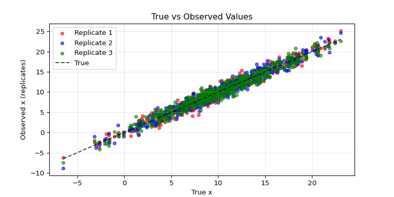
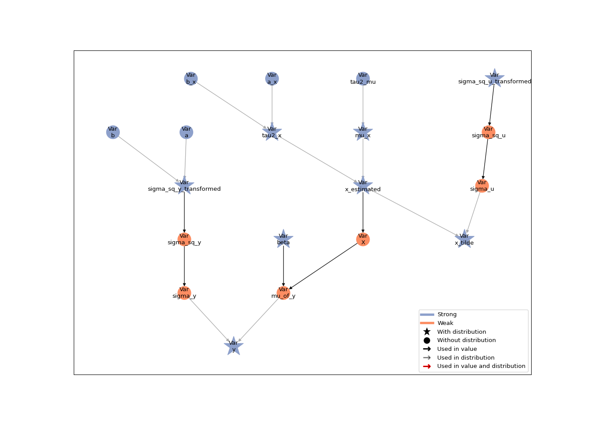
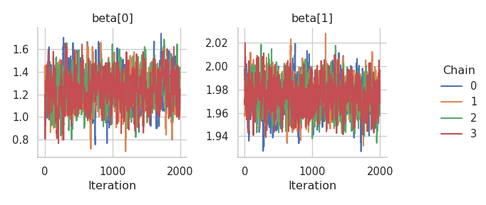
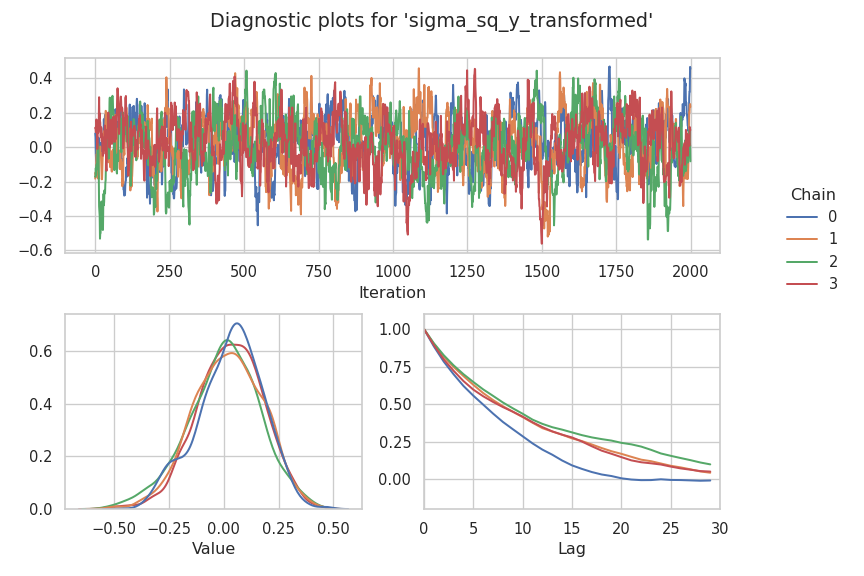
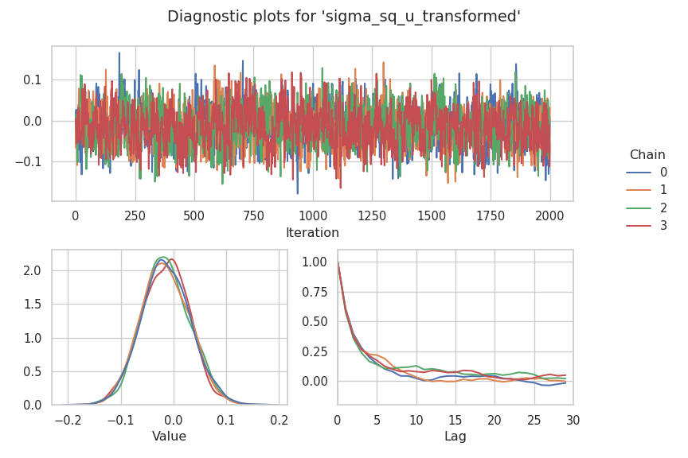
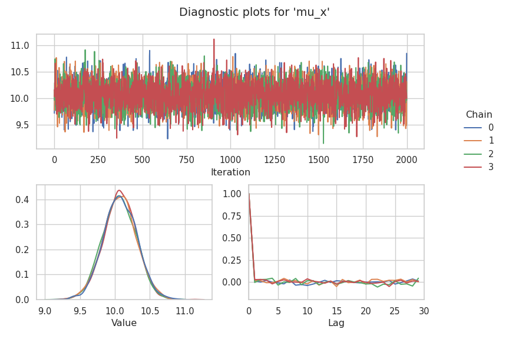
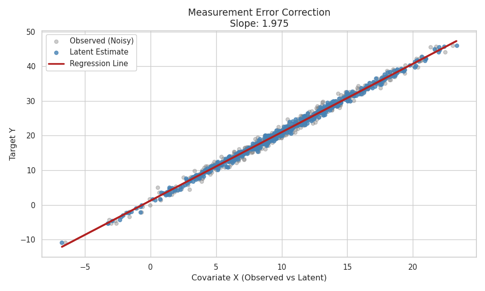

# Bayesian Measurement Error Correction

In this tutorial, we implement a regression model with Bayesian
measurement error correction in Liesel. The model should capture the
effect of a continuous covariate $x$, which is assumed to be affected by
measurement error. We further want to estimate the posterior
distribution of the response and the measurements.

## Measurement Error

Assuming a total number of $M$ replicates of the covariate $x$ affected
by measurement error, we can write the measurement error model as

$$
\tilde{x}_i^{(m)} = x_i + u_i^{(m)}, \quad m = 1, \ldots, M.
$$

The replicates are assumed to be independent with constant variance

$$
\mathbf{u}_i \sim N_M(\mathbf{0}, \mathbf{\sigma}^{2}_u\mathbf{I}_M).
$$

The fundamental concept behind Bayesian measurement error correction is
to treat the true, unknown covariate values $x_i$ as additional latent
variables. These values are then imputed using MCMC simulations while
simultaneously estimating all other parameters of the model. To achieve
this, a prior distribution is assigned to $x_i$. We further add
hyperpriors with assigned prior distributions to the distribution
parameters of $x_i$. $$
x_i \sim N(\mu_x,\tau^2_x), \quad \mu_x \sim N(0, \tau^2_{\mu}), \quad \tau^2_x \sim IG(a_x,b_x)
$$

``` python
import jax
import jax.numpy as jnp
import liesel.model as lsl
import liesel.goose as gs
import liesel.contrib.splines as splines
import tensorflow_probability.substrates.jax as tfp
import tensorflow_probability.substrates.jax.bijectors as tfb
import numpy as np
import matplotlib.pyplot as plt
import seaborn as sns

from liesel.contrib.splines import equidistant_knots, basis_matrix
from liesel.distributions.mvn_degen import MultivariateNormalDegenerate

tfd = tfp.distributions
```

## Data

We will start by simulating some data with replicates

``` python
# Define the number of samples and replicates
seed = 123

n = 500  # Number of data points
M = 3    # Number of replicates per sample
key = jax.random.PRNGKey(seed)
x = 10 + 5 * jax.random.normal(key, n) # create the true x

sigma_u_true = 1 # variance of the replicates

keys = jax.random.split(key, n)
x_tilde = jnp.array([x[i] + sigma_u_true * jax.random.normal(keys[i], (M,)) for i in range(n)]) # observed x-values
```

``` python
# Plot Data
fig, ax1 = plt.subplots(figsize=(8, 4))

# True x vs observed replicates
ax1.scatter(x, x_tilde[:, 0], alpha=0.6, s=20, label='Replicate 1', color='red')
ax1.scatter(x, x_tilde[:, 1], alpha=0.6, s=20, label='Replicate 2', color='blue')
ax1.scatter(x, x_tilde[:, 2], alpha=0.6, s=20, label='Replicate 3', color='green')
ax1.plot([x.min(), x.max()], [x.min(), x.max()], 'k--', alpha=0.7, label='True')
ax1.set_xlabel('True x')
ax1.set_ylabel('Observed x (replicates)')
ax1.set_title('True vs Observed Values')
ax1.legend()
ax1.grid(True, alpha=0.3)
```



And the response as done in the [linear regression
tutorial](01-lin-reg.md#linear-regression) from the model
$y_i \sim \mathcal{N}(\beta_0 + \beta_1 x_i, \;\sigma^{2}_y)$ given our
true covariate.

``` python
rng = np.random.default_rng(42)

sigma_y_true = 1.0 # variance of the response

true_beta = np.array([1.0, 2.0])

X_mat_true = np.column_stack([np.ones(n), x])

eps = rng.normal(scale=sigma_y_true, size=n)
y_vec = X_mat_true @ true_beta + eps
```

## Implementing the Model in Liesel

Now that we have our data we can define our distributions from above in
Liesel, setting $\tau^2_{\mu} = 1000$ and $a_x = b_x = 0.001$. We will
initialize $x$ using the mean of our observed measurements. We also need
to assign a normal distribution to the observed measurements and define
$\sigma^{2}_u$. Note that we are building a hierarchical model by
providing a {class}`.Var` instance for the `loc` and `scale` arguments
of the different distributions.

``` python
# Define hyperparameters for variance of x
a_x = lsl.Var.new_param(0.001, name = "a_x")
b_x = lsl.Var.new_param(0.001, name = "b_x")

# Define prior for tau2_x using an Inverse Gamma distribution
tau2_x_prior = lsl.Dist(tfd.InverseGamma, concentration = a_x, scale = b_x)
tau2_x = lsl.Var.new_param(10.0, distribution = tau2_x_prior, name = "tau2_x")

# Define the scales for mu_x (mean of x)
tau2_mu = lsl.Var.new_param(1000.0, name= "tau2_mu")

# Define prior for mu_x using a Normal distribution
mu_x_prior = lsl.Dist(tfd.Normal, loc = 0.0, scale = tau2_mu)

# Define mu_x as a parameter with the prior distribution
mu_x= lsl.Var.new_param(x_tilde.mean(), distribution = mu_x_prior, name = "mu_x")

# Define prior distribution for x
x_prior_dist = lsl.Dist(tfd.Normal, loc = mu_x, scale = tau2_x)

# Estimate x using the mean of replicates and assign a prior distribution
x_estimated = lsl.Var.new_param(x_tilde.mean(axis = 1), # initial estimation is the mean of the replicates
                                distribution = x_prior_dist,
                                name="x_estimated")

# Define the scale of the measurement distribution
sigma_u_prior = lsl.Dist(tfd.InverseGamma, concentration=0.01, scale=0.01)
sigma_sq_u = lsl.Var.new_param(value=10.0, distribution=sigma_u_prior, name="sigma_sq_u")
sigma_u = lsl.Var.new_calc(jnp.sqrt, sigma_sq_u, name="sigma_u").update()
log_sigma_u = sigma_sq_u.transform(tfb.Exp())


# Measurement distribution location
measurement_dist_loc = lsl.Calc(lambda x: jnp.expand_dims(x, -1), x_estimated)

# Define likelihood model for measurement error
measurement_dist = lsl.Dist(
    tfd.Normal,
    loc = measurement_dist_loc,
    scale = sigma_u
    )
# Measurements
x_tilde_var = lsl.Var(x_tilde, distribution = measurement_dist, name = "x_tilde")
```

Afterwards we define $\boldsymbol{\beta}$, our design matrix and
$\sigma^{2}_y$ (the variance of the response). Note that we have to
create the design matrix using {meth}`.Var.new_calc` as we continuously
update our x-values during the inference.

``` python
beta_prior = lsl.Dist(tfd.Normal, loc=0.0, scale=100.0)
beta = lsl.Var.new_param(np.array([0.0, 0.0]), name = "beta", distribution= beta_prior)

def create_x(x):
  return jnp.column_stack([np.ones(n), x])

X_mat = lsl.Var.new_calc(create_x, x_estimated,  name = "X") # design matrix

a = lsl.Var.new_param(0.01, name="a")
b = lsl.Var.new_param(0.01, name="b")

sigma_sq_prior = lsl.Dist(tfd.InverseGamma, concentration=a, scale=b)
sigma_sq_y = lsl.Var.new_param(value=10.0, distribution=sigma_sq_prior, name="sigma_sq_y")
sigma_y = lsl.Var.new_calc(jnp.sqrt, sigma_sq_y, name="sigma_y").update()
log_sigma = sigma_sq_y.transform(tfb.Exp())
```

We now can create the distribution for our response. Note that the
response is assumed to be distributed as
$y_i \sim \mathcal{N}(\beta_0 + \beta_1 \tilde{x_i}, \;\sigma^{2}_y)$ as
we are estimating the x-values as well. Both $\sigma^{2}_y$ (variance of
the response) and $\sigma^{2}_u$ (variance of the measurements) are
assumed to follow an $\text{InverseGamma}(a, b)$ distribution and are
log-transformed to ensure positivity.

``` python
# create joint model for x and y

mu_of_y = lsl.Var.new_calc( # compute the dot product
    jnp.dot,
    X_mat,
    beta,
    name="mu_of_y"
    )

# Define the likelihood distribution of y (Normal with estimated mean and scale)
y_dist = lsl.Dist(
    tfd.Normal,
    loc=mu_of_y,
    scale= sigma_y
  )

# Define y as an observed variable with the specified distribution
y_var = lsl.Var.new_obs(
    value=y_vec,
    distribution=y_dist,
    name="y"
)
```

Now we can take a look at our model

``` python
# create joint model for x and y
model = lsl.Model([y_var, x_tilde_var])

# Plot tree
model.plot_vars()
```



## MCMC Inference

We choose {class}`~.goose.NUTSKernel` kernels for generating posterior
samples of $\sigma_y$, $\sigma_u$, $\boldsymbol{\beta}$ and to sample
our x-values. To draw from $\mu_x$ and $\tau^2_x$ we use Gibbs kernels
({class}`~.goose.GibbsKernel`), as this allows us to use custom
transition functions for our parameters. The full conditionals are:

$$
\begin{eqnarray}
\mu_x | \cdot \sim N \left(\frac{n\bar{x}\tau^2_\mu}{n\tau^2_\mu+\tau^2_x},\frac{\tau^2_x\tau^2_\mu}{n\tau^2_\mu+\tau^2_x}\right)\\
\tau^2_x | \cdot \sim IG \left( a_x + \frac{n}{2}, b_x + \frac{1}{2}\sum_{i=1}^{n}(x_i - \mu_x)^2   \right)\\
\end{eqnarray}.
$$

``` python
def transition_mu_x(prng_key, model_state):
    """
    Sample mu_x from its posterior distribution conditioned on the data.

    Args:
        prng_key: The random number generator key for sampling.
        model_state: A dictionary containing the model parameters and state.

    Returns:
        dict: A dictionary containing the sampled mu_x.
    """
    # Extract relevant parameters from model state
    pos = interface.extract_position(
        position_keys=["x_estimated", "tau2_x", "a_x", "b_x"],
        model_state=model_state
    )
    x = pos["x_estimated"]
    n = len(x)
    tau2_mu = 1000**2
    tau2_x = pos["tau2_x"]
    a_x = pos["a_x"]
    b_x = pos["b_x"]

    # Compute the posterior mean and standard deviation for mu_x
    normal_sample = jax.random.normal(prng_key, (1,))
    mu_mean = (n * jnp.mean(x) * tau2_mu) / (n * tau2_mu + tau2_x)
    mu_std = jnp.sqrt(tau2_x * tau2_mu / (n * tau2_mu + tau2_x))

    # Sample mu_x from a normal distribution
    mu_x = jnp.squeeze(mu_mean + mu_std * normal_sample)

    return {"mu_x": mu_x}


def transition_tau2_x(prng_key, model_state):
    """
    Sample tau2_x from its posterior distribution using the inverse gamma distribution.

    Args:
        prng_key: The random number generator key for sampling.
        model_state: A dictionary containing the model parameters and state.

    Returns:
        dict: A dictionary containing the sampled tau2_x.
    """
    # Extract relevant parameters from model state
    pos = interface.extract_position(
        position_keys=["a_x", "b_x", "x_estimated", "mu_x", "b_x"],
        model_state=model_state
    )
    a_x = pos["a_x"]
    b_x = pos["b_x"]
    x = pos["x_estimated"]
    n = len(x)
    mu_x = pos["mu_x"]

    # Compute the new alpha and beta for the inverse gamma distribution
    alpha_new = a_x + n / 2
    beta_new = b_x + ((x - mu_x)**2).sum() / 2

    # Sample tau2_x from the inverse gamma distribution
    tau2_x = jnp.squeeze(tfd.InverseGamma(concentration=alpha_new, scale=beta_new).sample(seed=prng_key))

    return {"tau2_x" : tau2_x}
```

We set up our engine and draw 2000 posterior samples.

``` python
# #add kernels and return engine
interface = gs.LieselInterface(model)
eb_sample = gs.EngineBuilder(seed = 2 , num_chains=4)
eb_sample.set_model(gs.LieselInterface(model))
eb_sample.set_initial_values(model.state)


eb_sample.add_kernel(gs.NUTSKernel(["x_estimated"]))

eb_sample.add_kernel(gs.GibbsKernel(["mu_x"], transition_mu_x))
eb_sample.add_kernel(gs.GibbsKernel(["tau2_x"], transition_tau2_x))

eb_sample.add_kernel(gs.NUTSKernel(["beta"]))
eb_sample.add_kernel(gs.NUTSKernel(["sigma_sq_y_transformed"]))
eb_sample.add_kernel(gs.NUTSKernel(["sigma_sq_u_transformed"]))

eb_sample.set_duration(warmup_duration = 1000, posterior_duration = 2000, thinning_posterior=1, term_duration=200)

engine = eb_sample.build()
engine.sample_all_epochs()
```


      0%|                                                  | 0/3 [00:00<?, ?chunk/s]
     33%|##############                            | 1/3 [00:11<00:22, 11.27s/chunk]
    100%|##########################################| 3/3 [00:11<00:00,  3.76s/chunk]

      0%|                                                  | 0/1 [00:00<?, ?chunk/s]
    100%|#########################################| 1/1 [00:00<00:00, 407.29chunk/s]

      0%|                                                  | 0/2 [00:00<?, ?chunk/s]
    100%|########################################| 2/2 [00:00<00:00, 1580.37chunk/s]

      0%|                                                  | 0/4 [00:00<?, ?chunk/s]
    100%|########################################| 4/4 [00:00<00:00, 1007.88chunk/s]

      0%|                                                 | 0/22 [00:00<?, ?chunk/s]
     41%|################7                        | 9/22 [00:00<00:00, 85.23chunk/s]
     82%|################################7       | 18/22 [00:00<00:00, 31.96chunk/s]
    100%|########################################| 22/22 [00:00<00:00, 30.46chunk/s]

      0%|                                                  | 0/8 [00:00<?, ?chunk/s]
    100%|#########################################| 8/8 [00:00<00:00, 129.11chunk/s]

      0%|                                                 | 0/80 [00:00<?, ?chunk/s]
     12%|#####                                   | 10/80 [00:00<00:00, 90.39chunk/s]
     25%|##########                              | 20/80 [00:00<00:01, 41.52chunk/s]
     32%|#############                           | 26/80 [00:00<00:01, 35.63chunk/s]
     39%|###############5                        | 31/80 [00:00<00:01, 35.06chunk/s]
     44%|#################5                      | 35/80 [00:00<00:01, 34.39chunk/s]
     49%|###################5                    | 39/80 [00:01<00:01, 31.88chunk/s]
     54%|#####################5                  | 43/80 [00:01<00:01, 31.62chunk/s]
     59%|#######################5                | 47/80 [00:01<00:01, 31.04chunk/s]
     64%|#########################5              | 51/80 [00:01<00:00, 32.11chunk/s]
     69%|###########################5            | 55/80 [00:01<00:00, 31.89chunk/s]
     74%|#############################5          | 59/80 [00:01<00:00, 30.26chunk/s]
     79%|###############################5        | 63/80 [00:01<00:00, 29.01chunk/s]
     82%|#################################       | 66/80 [00:01<00:00, 28.74chunk/s]
     86%|##################################5     | 69/80 [00:02<00:00, 28.79chunk/s]
     91%|####################################5   | 73/80 [00:02<00:00, 27.71chunk/s]
     95%|######################################  | 76/80 [00:02<00:00, 27.76chunk/s]
    100%|########################################| 80/80 [00:02<00:00, 28.58chunk/s]
    100%|########################################| 80/80 [00:02<00:00, 32.09chunk/s]

Now we can take a look at the results for our parameters

``` python
results = engine.get_results()
summary = gs.Summary(results)
gs.Summary(results, deselected = ["x_estimated"])
```

<p>

<strong>Parameter summary:</strong>
</p>

<table border="0" class="dataframe">

<thead>

<tr style="text-align: right;">

<th>

</th>

<th>

</th>

<th>

kernel
</th>

<th>

mean
</th>

<th>

sd
</th>

<th>

q_0.05
</th>

<th>

q_0.5
</th>

<th>

q_0.95
</th>

<th>

sample_size
</th>

<th>

ess_bulk
</th>

<th>

ess_tail
</th>

<th>

rhat
</th>

</tr>

<tr>

<th>

parameter
</th>

<th>

index
</th>

<th>

</th>

<th>

</th>

<th>

</th>

<th>

</th>

<th>

</th>

<th>

</th>

<th>

</th>

<th>

</th>

<th>

</th>

<th>

</th>

</tr>

</thead>

<tbody>

<tr>

<th rowspan="2" valign="top">

beta
</th>

<th>

(0,)
</th>

<td>

kernel_03
</td>

<td>

1.245
</td>

<td>

0.150
</td>

<td>

1.002
</td>

<td>

1.246
</td>

<td>

1.489
</td>

<td>

8000
</td>

<td>

611.168
</td>

<td>

1041.860
</td>

<td>

1.006
</td>

</tr>

<tr>

<th>

(1,)
</th>

<td>

kernel_03
</td>

<td>

1.975
</td>

<td>

0.013
</td>

<td>

1.953
</td>

<td>

1.975
</td>

<td>

1.996
</td>

<td>

8000
</td>

<td>

705.453
</td>

<td>

1251.038
</td>

<td>

1.005
</td>

</tr>

<tr>

<th>

mu_x
</th>

<th>

()
</th>

<td>

kernel_01
</td>

<td>

10.070
</td>

<td>

0.235
</td>

<td>

9.684
</td>

<td>

10.070
</td>

<td>

10.449
</td>

<td>

8000
</td>

<td>

7392.478
</td>

<td>

7726.961
</td>

<td>

1.001
</td>

</tr>

<tr>

<th>

sigma_sq_u_transformed
</th>

<th>

()
</th>

<td>

kernel_05
</td>

<td>

-0.014
</td>

<td>

0.045
</td>

<td>

-0.089
</td>

<td>

-0.015
</td>

<td>

0.061
</td>

<td>

8000
</td>

<td>

1184.829
</td>

<td>

2714.505
</td>

<td>

1.002
</td>

</tr>

<tr>

<th>

sigma_sq_y_transformed
</th>

<th>

()
</th>

<td>

kernel_04
</td>

<td>

0.014
</td>

<td>

0.160
</td>

<td>

-0.266
</td>

<td>

0.027
</td>

<td>

0.256
</td>

<td>

8000
</td>

<td>

366.470
</td>

<td>

750.502
</td>

<td>

1.005
</td>

</tr>

<tr>

<th>

tau2_x
</th>

<th>

()
</th>

<td>

kernel_02
</td>

<td>

27.403
</td>

<td>

1.775
</td>

<td>

24.648
</td>

<td>

27.319
</td>

<td>

30.421
</td>

<td>

8000
</td>

<td>

7925.890
</td>

<td>

7868.557
</td>

<td>

1.000
</td>

</tr>

</tbody>

</table>

<p>

<strong>Error summary:</strong>
</p>

<table border="0" class="dataframe">

<thead>

<tr style="text-align: right;">

<th>

</th>

<th>

</th>

<th>

</th>

<th>

</th>

<th>

count
</th>

<th>

relative
</th>

</tr>

<tr>

<th>

kernel
</th>

<th>

error_code
</th>

<th>

error_msg
</th>

<th>

phase
</th>

<th>

</th>

<th>

</th>

</tr>

</thead>

<tbody>

<tr>

<th rowspan="2" valign="top">

kernel_00
</th>

<th rowspan="2" valign="top">

1
</th>

<th rowspan="2" valign="top">

divergent transition
</th>

<th>

warmup
</th>

<td>

22
</td>

<td>

0.005
</td>

</tr>

<tr>

<th>

posterior
</th>

<td>

0
</td>

<td>

0.000
</td>

</tr>

<tr>

<th rowspan="2" valign="top">

kernel_03
</th>

<th rowspan="2" valign="top">

1
</th>

<th rowspan="2" valign="top">

divergent transition
</th>

<th>

warmup
</th>

<td>

59
</td>

<td>

0.015
</td>

</tr>

<tr>

<th>

posterior
</th>

<td>

0
</td>

<td>

0.000
</td>

</tr>

<tr>

<th rowspan="2" valign="top">

kernel_04
</th>

<th rowspan="2" valign="top">

1
</th>

<th rowspan="2" valign="top">

divergent transition
</th>

<th>

warmup
</th>

<td>

59
</td>

<td>

0.015
</td>

</tr>

<tr>

<th>

posterior
</th>

<td>

0
</td>

<td>

0.000
</td>

</tr>

<tr>

<th rowspan="2" valign="top">

kernel_05
</th>

<th rowspan="2" valign="top">

1
</th>

<th rowspan="2" valign="top">

divergent transition
</th>

<th>

warmup
</th>

<td>

51
</td>

<td>

0.013
</td>

</tr>

<tr>

<th>

posterior
</th>

<td>

0
</td>

<td>

0.000
</td>

</tr>

</tbody>

</table>

And the traceplots for $\beta$, $\log(\sigma_y)$ and $\log(\sigma_u)$.

``` python
# Plot the trace of all location coefficients
fig = gs.plot_trace(results, "beta")
```



``` python
fig = gs.plot_param(results, "sigma_sq_y_transformed")
```



``` python
fig = gs.plot_param(results, "sigma_sq_u_transformed")
```



We further can also have a look at our first ten sampled x values and
the mean

``` python
fig = gs.plot_trace(results, "x_estimated", range(10))
```


``` python
fig = gs.plot_param(results, "mu_x")
```



To finally evaluate the model we can plot the regression line

``` python
# Extract quantities from the summary
x_means = summary.quantities["mean"]["x_estimated"]
beta_est = summary.quantities["mean"]["beta"]
y_pred = beta_est[0] + beta_est[1] * x_means

sns.set_theme(style="whitegrid")

fig, ax = plt.subplots(figsize=(10, 6))

# Plot Observed Data (Faint)
ax.scatter(x, y_vec, color='gray', alpha=0.4, s=30, label='Observed (Noisy)')

# Plot Estimated Latent Positions (Stronger)
ax.scatter(x_means, y_vec, color='steelblue', alpha=0.8, s=30, label='Latent Estimate')

# Plot Regression Line
ax.plot(x_means, y_pred, color='firebrick', lw=2.5, label='Regression Line')

# Labels and Title
ax.set_title(f"Measurement Error Correction\nSlope: {beta_est[1]:.3f}", fontsize=14)
ax.set_xlabel("Covariate X (Observed vs Latent)", fontsize=12)
ax.set_ylabel("Target Y", fontsize=12)
ax.legend(frameon=True, fancybox=True, framealpha=1, loc='best')

plt.tight_layout()
plt.show()
```


