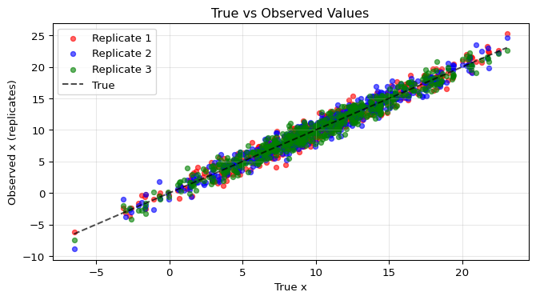
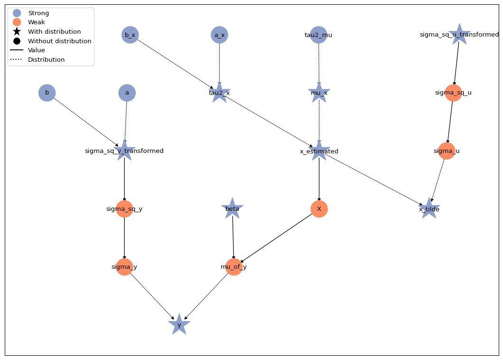
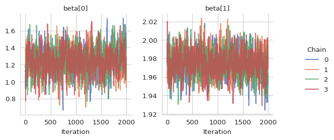
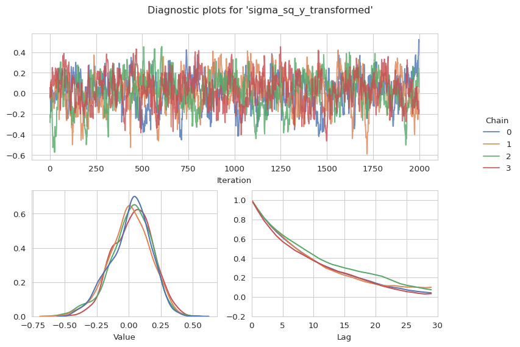
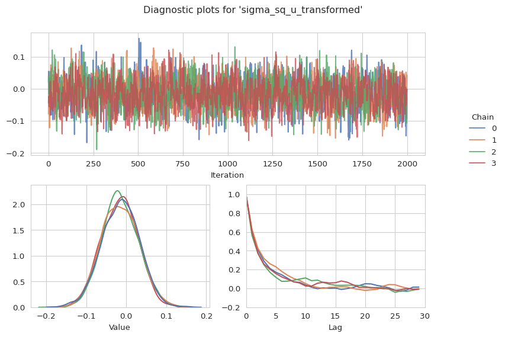
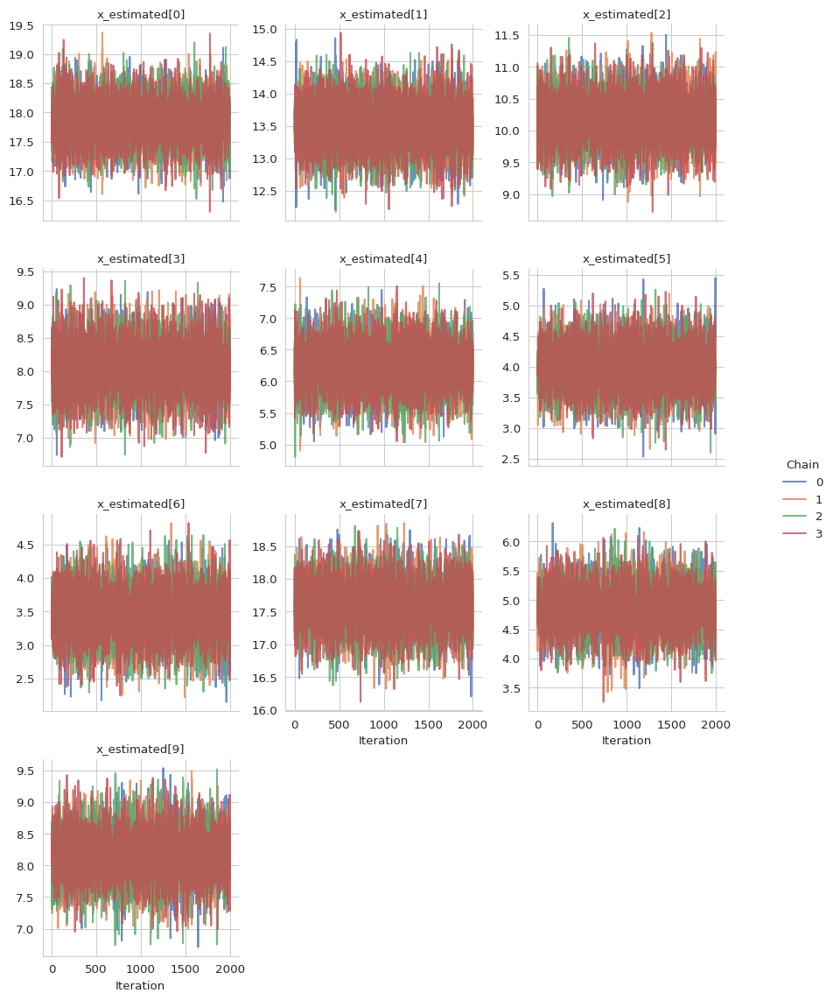
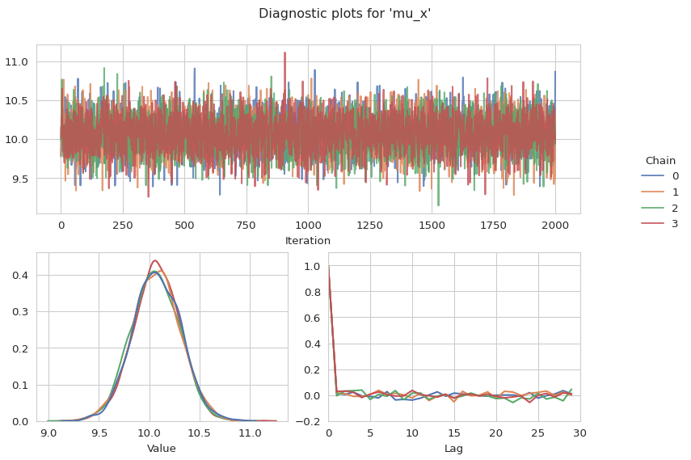
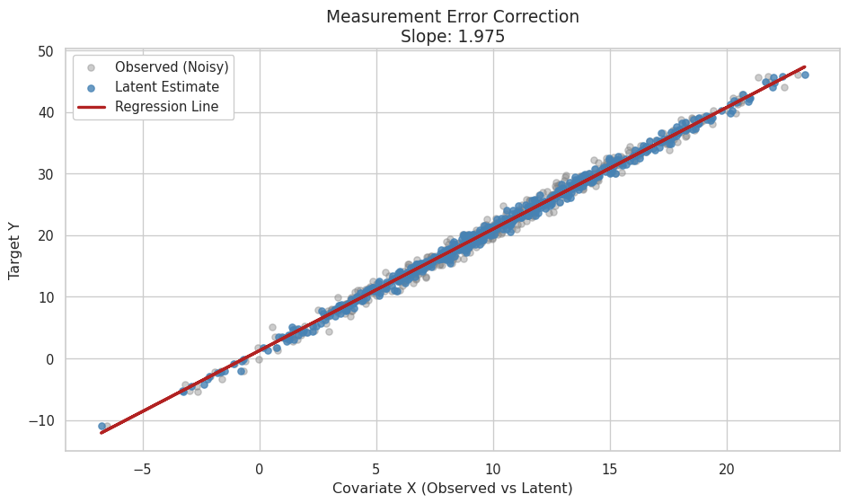

# Bayesian Measurement Error Correction


In this tutorial, we implement a regression model with Bayesian
measurement error correction in Liesel. The model should capture the
effect of a continuous covariate $x$, which is assumed to be affected by
measurement error. We further want to estimate the posterior
distribution of the model parameters and the latent covariate.

## Measurement Error

Assuming a total number of $M$ replicates of the covariate $x$ affected
by measurement error, we can write the measurement error model as

$$\tilde{x}_i^{(m)} = x_i + u_i^{(m)}, \quad m = 1, \ldots, M.$$

In this tutorial, the replicates are assumed to be independent with
constant variance

$$\mathbf{u}_i \sim N_M(\mathbf{0}, \mathbf{\sigma}^{2}_u\mathbf{I}_M).$$

The fundamental concept behind Bayesian measurement error correction is
to treat the true, unknown covariate values $x_i$ as additional latent
variables. These values are then imputed using MCMC simulations while
simultaneously estimating all other parameters of the model. To achieve
this, we assign a simple prior distribution to $x_i$. We further add
hyperpriors with assigned prior distributions to the distribution
parameters of $x_i$, to achieve further flexibility.
$$x_i \sim N(\mu_x,\tau^2_x), \quad \mu_x \sim N(0, \tau^2_{\mu}), \quad \tau^2_x \sim IG(a_x,b_x)$$
These priors correspond to being relatively uninformative about the
distribution of $x_i$.

## Imports

First, we import all of the required packages.

``` python
import jax
import jax.numpy as jnp
import liesel.model as lsl
import liesel.goose as gs
import liesel.contrib.splines as splines
import tensorflow_probability.substrates.jax as tfp
import tensorflow_probability.substrates.jax.bijectors as tfb
import numpy as np
import matplotlib.pyplot as plt
import seaborn as sns

from liesel.contrib.splines import equidistant_knots, basis_matrix
from liesel.distributions.mvn_degen import MultivariateNormalDegenerate

tfd = tfp.distributions
```

## Data

Afterwards we will start by simulating some data with replicates.

``` python
# Define the number of samples and replicates
seed = 123

n = 500  # Number of data points
M = 3  # Number of replicates per sample
key = jax.random.PRNGKey(seed)
x = 10 + 5 * jax.random.normal(key, n)  # create the true x

sigma_u_true = 1  # variance of the replicates

keys = jax.random.split(key, n)
x_tilde = jnp.array([
    x[i] + sigma_u_true * jax.random.normal(keys[i], (M,)) for i in range(n)
])  # observed x-values
```

``` python
# Plot Data
fig, ax1 = plt.subplots(figsize=(8, 4))

# True x vs observed replicates
ax1.scatter(x, x_tilde[:, 0], alpha=0.6, s=20, label="Replicate 1", color="red")
ax1.scatter(x, x_tilde[:, 1], alpha=0.6, s=20, label="Replicate 2", color="blue")
ax1.scatter(x, x_tilde[:, 2], alpha=0.6, s=20, label="Replicate 3", color="green")
ax1.plot([x.min(), x.max()], [x.min(), x.max()], "k--", alpha=0.7, label="True")
ax1.set_xlabel("True x")
ax1.set_ylabel("Observed x (replicates)")
ax1.set_title("True vs Observed Values")
ax1.legend()
ax1.grid(True, alpha=0.3)
```



We simulate the response as done in the [linear regression
tutorial](01a-lin-reg.md#linear-regression) from the model
$y_i | x_i \sim \mathcal{N}(\beta_0 + \beta_1 x_i, \;\sigma^{2}_y)$
given our true covariate.

``` python
rng = np.random.default_rng(42)

sigma_y_true = 1.0  # variance of the response

true_beta = np.array([1.0, 2.0])

X_mat_true = np.column_stack([np.ones(n), x])

eps = rng.normal(scale=sigma_y_true, size=n)
y_vec = X_mat_true @ true_beta + eps
```

## Implementing the Model in Liesel

Now that we have our data we can define our distributions from above in
Liesel, setting $\tau^2_{\mu} = 1000$ and $a_x = b_x = 0.001$. We will
initialize $x$ using the mean of our observed measurements. We also need
to assign a normal distribution to the observed measurements and define
$\sigma^{2}_u$ (the variance of the measurements). Note that we are
building a hierarchical model by providing a {class}`.Var` instance for
the `loc` and `scale` arguments of the different distributions.

We begin by establishing $\tau^2_{x}$.

``` python
# Define hyperparameters for variance of x
a_x = lsl.Var.new_param(0.001, name="a_x")
b_x = lsl.Var.new_param(0.001, name="b_x")

# Define prior for tau2_x using an Inverse Gamma distribution
tau2_x_prior = lsl.Dist(tfd.InverseGamma, concentration=a_x, scale=b_x)
tau2_x = lsl.Var.new_param(10.0, distribution=tau2_x_prior, name="tau2_x")
```

Following that we define $\tau^2_{\mu}$, so we can define $\mu_x$
afterwards.

``` python
# Define the scales for mu_x (mean of x)
tau2_mu = lsl.Var.new_param(1000.0, name="tau2_mu")

# Define prior for mu_x using a Normal distribution
mu_x_prior = lsl.Dist(tfd.Normal, loc=0.0, scale=tau2_mu)

# Define mu_x as a parameter with the prior distribution
mu_x = lsl.Var.new_param(x_tilde.mean(), distribution=mu_x_prior, name="mu_x")
```

With that we then can configure the prior distribution for $x_i$ and
construct our x-values as a model parameter.

``` python
# Define prior distribution for x
x_prior_dist = lsl.Dist(tfd.Normal, loc=mu_x, scale=tau2_x)

# Estimate x using the mean of replicates and assign a prior distribution
x_estimated = lsl.Var.new_param(
    x_tilde.mean(axis=1),  # initial estimation is the mean of the replicates
    distribution=x_prior_dist,
    name="x_estimated",
)
```

Now, we incorporate the variance and scale of our measurements and
formalize the likelihood.

``` python
# Define the scale of the measurement distribution
sigma_u_prior = lsl.Dist(tfd.InverseGamma, concentration=0.01, scale=0.01)
sigma_sq_u = lsl.Var.new_param(
    value=10.0, distribution=sigma_u_prior, name="sigma_sq_u"
)
sigma_u = lsl.Var.new_calc(jnp.sqrt, sigma_sq_u, name="sigma_u").update()
log_sigma_u = sigma_sq_u.transform(tfb.Exp())


# Measurement distribution location
measurement_dist_loc = lsl.Calc(lambda x: jnp.expand_dims(x, -1), x_estimated)

# Define likelihood model for measurement error
measurement_dist = lsl.Dist(tfd.Normal, loc=measurement_dist_loc, scale=sigma_u)
# Measurements
x_tilde_var = lsl.Var(x_tilde, distribution=measurement_dist, name="x_tilde")
```

Afterwards we define $\boldsymbol{\beta}$, our design matrix and
$\sigma^{2}_y$ (the variance of the response). Note that we have to
create the design matrix using {meth}`.Var.new_calc` as we continuously
update our x-values during the inference.

``` python
beta_prior = lsl.Dist(tfd.Normal, loc=0.0, scale=100.0)
beta = lsl.Var.new_param(np.array([0.0, 0.0]), name="beta", distribution=beta_prior)


def create_x(x):
    return jnp.column_stack([np.ones(n), x])


X_mat = lsl.Var.new_calc(create_x, x_estimated, name="X")  # design matrix

a = lsl.Var.new_param(0.01, name="a")
b = lsl.Var.new_param(0.01, name="b")

sigma_sq_prior = lsl.Dist(tfd.InverseGamma, concentration=a, scale=b)
sigma_sq_y = lsl.Var.new_param(
    value=10.0, distribution=sigma_sq_prior, name="sigma_sq_y"
)
sigma_y = lsl.Var.new_calc(jnp.sqrt, sigma_sq_y, name="sigma_y").update()
log_sigma = sigma_sq_y.transform(tfb.Exp())
```

We now can create the distribution for our response. Note that the
response is assumed to be distributed as
$y_i | \tilde{x}_i \sim \mathcal{N}(\beta_0 + \beta_1 x_i, \;\sigma^{2}_y)$
as we are estimating the x-values as well. Both $\sigma^{2}_y$ (variance
of the response) and $\sigma^{2}_u$ (variance of the measurements) are
assumed to follow an $\text{InverseGamma}(a, b)$ distribution and are
log-transformed to ensure positivity.

``` python
# create joint model for x and y

mu_of_y = lsl.Var.new_calc(  # compute the dot product
    jnp.dot, X_mat, beta, name="mu_of_y"
)

# Define the likelihood distribution of y (Normal with estimated mean and scale)
y_dist = lsl.Dist(tfd.Normal, loc=mu_of_y, scale=sigma_y)

# Define y as an observed variable with the specified distribution
y_var = lsl.Var.new_obs(value=y_vec, distribution=y_dist, name="y")
```

Now we can take a look at our model

``` python
# create joint model for x and y
model = lsl.Model([y_var, x_tilde_var])

# Plot tree
model.plot_vars()
```

    liesel.model.model - WARNING - Inconsistent log prob decomposition: Model.log_prob=-19741.52 ≠ (Model.log_lik=-14871.53 + Model.log_prior=-1715.54). 
    liesel.model.model - WARNING - Var(name="x_tilde") has a distribution but Var.parameter=False and Var.observed=False.



## MCMC Inference

We choose NUTS kernels ({class}`~.goose.NUTSKernel`) for generating
posterior samples of $\sigma_y$, $\sigma_u$, $\boldsymbol{\beta}$, and
to sample our x-values. To draw from $\mu_x$ and $\tau^2_x$ we use Gibbs
kernels ({class}`~.goose.GibbsKernel`), as this allows us to use custom
transition functions for our parameters. The full conditionals are:

$$\begin{aligned}
\mu_x \mid \cdot &\sim N \left(\frac{n\bar{x}\tau^2_\mu}{n\tau^2_\mu+\tau^2_x},\frac{\tau^2_x\tau^2_\mu}{n\tau^2_\mu+\tau^2_x}\right)\\
\tau^2_x \mid \cdot &\sim IG \left( a_x + \frac{n}{2}, b_x + \frac{1}{2}\sum_{i=1}^{n}(x_i - \mu_x)^2   \right)\\
\end{aligned}.$$

Let us implement these

``` python
def transition_mu_x(prng_key, model_state):
    """
    Sample mu_x from its posterior distribution conditioned on the data.

    Args:
        prng_key: The random number generator key for sampling.
        model_state: A dictionary containing the model parameters and state.

    Returns:
        dict: A dictionary containing the sampled mu_x.
    """
    # Extract relevant parameters from model state
    pos = interface.extract_position(
        position_keys=["x_estimated", "tau2_x", "tau2_mu", "a_x", "b_x"],
        model_state=model_state,
    )
    x = pos["x_estimated"]
    n = len(x)
    tau2_mu = pos["tau2_mu"]
    tau2_x = pos["tau2_x"]
    a_x = pos["a_x"]
    b_x = pos["b_x"]

    # Compute the posterior mean and standard deviation for mu_x
    normal_sample = jax.random.normal(prng_key, (1,))
    mu_mean = (n * jnp.mean(x) * tau2_mu) / (n * tau2_mu + tau2_x)
    mu_std = jnp.sqrt(tau2_x * tau2_mu / (n * tau2_mu + tau2_x))

    # Sample mu_x from a normal distribution
    mu_x = jnp.squeeze(mu_mean + mu_std * normal_sample)

    return {"mu_x": mu_x}


def transition_tau2_x(prng_key, model_state):
    """
    Sample tau2_x from its posterior distribution using the inverse gamma distribution.

    Args:
        prng_key: The random number generator key for sampling.
        model_state: A dictionary containing the model parameters and state.

    Returns:
        dict: A dictionary containing the sampled tau2_x.
    """
    # Extract relevant parameters from model state
    pos = interface.extract_position(
        position_keys=["a_x", "b_x", "x_estimated", "mu_x", "b_x"],
        model_state=model_state,
    )
    a_x = pos["a_x"]
    b_x = pos["b_x"]
    x = pos["x_estimated"]
    n = len(x)
    mu_x = pos["mu_x"]

    # Compute the new alpha and beta for the inverse gamma distribution
    alpha_new = a_x + n / 2
    beta_new = b_x + ((x - mu_x) ** 2).sum() / 2

    # Sample tau2_x from the inverse gamma distribution
    tau2_x = jnp.squeeze(
        tfd.InverseGamma(concentration=alpha_new, scale=beta_new).sample(seed=prng_key)
    )

    return {"tau2_x": tau2_x}
```

We set up our engine and draw 2000 posterior samples.

``` python
# #add kernels and return engine
interface = gs.LieselInterface(model)
eb_sample = gs.EngineBuilder(seed=2, num_chains=4)
eb_sample.set_model(gs.LieselInterface(model))
eb_sample.set_initial_values(model.state)


eb_sample.add_kernel(gs.NUTSKernel(["x_estimated"]))

eb_sample.add_kernel(gs.GibbsKernel(["mu_x"], transition_mu_x))
eb_sample.add_kernel(gs.GibbsKernel(["tau2_x"], transition_tau2_x))

eb_sample.add_kernel(gs.NUTSKernel(["beta"]))
eb_sample.add_kernel(gs.NUTSKernel(["sigma_sq_y_transformed"]))
eb_sample.add_kernel(gs.NUTSKernel(["sigma_sq_u_transformed"]))

eb_sample.set_duration(
    warmup_duration=1000,
    posterior_duration=2000,
    thinning_posterior=1,
    term_duration=200,
)

engine = eb_sample.build()
engine.sample_all_epochs()
```

    liesel.goose.builder - WARNING - No jitter functions provided. The initial values won't be jittered
    liesel.goose.engine - INFO - Initializing kernels...
    liesel.goose.engine - INFO - Done
    liesel.goose.engine - INFO - Starting epoch: FAST_ADAPTATION, 75 transitions, 25 jitted together

      0%|                                                  | 0/3 [00:00<?, ?chunk/s]
     33%|██████████████                            | 1/3 [00:11<00:22, 11.32s/chunk]
    100%|██████████████████████████████████████████| 3/3 [00:11<00:00,  3.78s/chunk]
    liesel.goose.engine - WARNING - Errors per chain for kernel_00: 0, 1, 1, 0 / 75 transitions
    liesel.goose.engine - WARNING - Errors per chain for kernel_03: 2, 6, 2, 3 / 75 transitions
    liesel.goose.engine - WARNING - Errors per chain for kernel_04: 4, 3, 6, 2 / 75 transitions
    liesel.goose.engine - WARNING - Errors per chain for kernel_05: 2, 2, 3, 4 / 75 transitions
    liesel.goose.engine - INFO - Finished epoch
    liesel.goose.engine - INFO - Starting epoch: SLOW_ADAPTATION, 25 transitions, 25 jitted together

      0%|                                                  | 0/1 [00:00<?, ?chunk/s]
    100%|█████████████████████████████████████████| 1/1 [00:00<00:00, 501.95chunk/s]
    liesel.goose.engine - WARNING - Errors per chain for kernel_00: 1, 2, 1, 1 / 25 transitions
    liesel.goose.engine - WARNING - Errors per chain for kernel_03: 1, 2, 1, 2 / 25 transitions
    liesel.goose.engine - WARNING - Errors per chain for kernel_04: 1, 2, 1, 1 / 25 transitions
    liesel.goose.engine - WARNING - Errors per chain for kernel_05: 1, 1, 2, 1 / 25 transitions
    liesel.goose.engine - INFO - Finished epoch
    liesel.goose.engine - INFO - Starting epoch: SLOW_ADAPTATION, 50 transitions, 25 jitted together

      0%|                                                  | 0/2 [00:00<?, ?chunk/s]
    100%|█████████████████████████████████████████| 2/2 [00:00<00:00, 664.39chunk/s]
    liesel.goose.engine - WARNING - Errors per chain for kernel_00: 1, 1, 1, 1 / 50 transitions
    liesel.goose.engine - WARNING - Errors per chain for kernel_03: 1, 2, 1, 3 / 50 transitions
    liesel.goose.engine - WARNING - Errors per chain for kernel_04: 3, 1, 2, 1 / 50 transitions
    liesel.goose.engine - WARNING - Errors per chain for kernel_05: 2, 1, 2, 1 / 50 transitions
    liesel.goose.engine - INFO - Finished epoch
    liesel.goose.engine - INFO - Starting epoch: SLOW_ADAPTATION, 100 transitions, 25 jitted together

      0%|                                                  | 0/4 [00:00<?, ?chunk/s]
    100%|████████████████████████████████████████| 4/4 [00:00<00:00, 1001.45chunk/s]
    liesel.goose.engine - WARNING - Errors per chain for kernel_00: 1, 1, 1, 1 / 100 transitions
    liesel.goose.engine - WARNING - Errors per chain for kernel_03: 3, 3, 3, 2 / 100 transitions
    liesel.goose.engine - WARNING - Errors per chain for kernel_04: 3, 3, 1, 1 / 100 transitions
    liesel.goose.engine - WARNING - Errors per chain for kernel_05: 2, 1, 2, 2 / 100 transitions
    liesel.goose.engine - INFO - Finished epoch
    liesel.goose.engine - INFO - Starting epoch: SLOW_ADAPTATION, 550 transitions, 25 jitted together

      0%|                                                 | 0/22 [00:00<?, ?chunk/s]
     41%|████████████████▊                        | 9/22 [00:00<00:00, 70.20chunk/s]
     77%|██████████████████████████████▉         | 17/22 [00:00<00:00, 31.30chunk/s]
    100%|████████████████████████████████████████| 22/22 [00:00<00:00, 27.77chunk/s]
    100%|████████████████████████████████████████| 22/22 [00:00<00:00, 30.68chunk/s]
    liesel.goose.engine - WARNING - Errors per chain for kernel_00: 1, 1, 1, 1 / 550 transitions
    liesel.goose.engine - WARNING - Errors per chain for kernel_03: 2, 3, 5, 6 / 550 transitions
    liesel.goose.engine - WARNING - Errors per chain for kernel_04: 3, 3, 3, 4 / 550 transitions
    liesel.goose.engine - WARNING - Errors per chain for kernel_05: 2, 4, 3, 1 / 550 transitions
    liesel.goose.engine - INFO - Finished epoch
    liesel.goose.engine - INFO - Starting epoch: FAST_ADAPTATION, 200 transitions, 25 jitted together

      0%|                                                  | 0/8 [00:00<?, ?chunk/s]
    100%|██████████████████████████████████████████| 8/8 [00:00<00:00, 98.67chunk/s]
    liesel.goose.engine - WARNING - Errors per chain for kernel_00: 1, 1, 1, 1 / 200 transitions
    liesel.goose.engine - WARNING - Errors per chain for kernel_03: 1, 3, 5, 3 / 200 transitions
    liesel.goose.engine - WARNING - Errors per chain for kernel_04: 1, 1, 0, 2 / 200 transitions
    liesel.goose.engine - WARNING - Errors per chain for kernel_05: 1, 2, 2, 2 / 200 transitions
    liesel.goose.engine - INFO - Finished epoch
    liesel.goose.engine - INFO - Finished warmup
    liesel.goose.engine - INFO - Starting epoch: POSTERIOR, 2000 transitions, 25 jitted together

      0%|                                                 | 0/80 [00:00<?, ?chunk/s]
     12%|█████                                   | 10/80 [00:00<00:00, 86.03chunk/s]
     24%|█████████▌                              | 19/80 [00:00<00:01, 38.29chunk/s]
     31%|████████████▌                           | 25/80 [00:00<00:01, 33.27chunk/s]
     38%|███████████████                         | 30/80 [00:00<00:01, 30.89chunk/s]
     42%|█████████████████                       | 34/80 [00:01<00:01, 29.61chunk/s]
     48%|███████████████████                     | 38/80 [00:01<00:01, 28.63chunk/s]
     51%|████████████████████▌                   | 41/80 [00:01<00:01, 28.11chunk/s]
     55%|██████████████████████                  | 44/80 [00:01<00:01, 27.65chunk/s]
     59%|███████████████████████▌                | 47/80 [00:01<00:01, 27.27chunk/s]
     62%|█████████████████████████               | 50/80 [00:01<00:01, 26.98chunk/s]
     66%|██████████████████████████▌             | 53/80 [00:01<00:01, 26.83chunk/s]
     70%|████████████████████████████            | 56/80 [00:01<00:00, 26.70chunk/s]
     74%|█████████████████████████████▌          | 59/80 [00:01<00:00, 26.51chunk/s]
     78%|███████████████████████████████         | 62/80 [00:02<00:00, 26.36chunk/s]
     81%|████████████████████████████████▌       | 65/80 [00:02<00:00, 26.41chunk/s]
     85%|██████████████████████████████████      | 68/80 [00:02<00:00, 25.89chunk/s]
     89%|███████████████████████████████████▌    | 71/80 [00:02<00:00, 25.91chunk/s]
     92%|█████████████████████████████████████   | 74/80 [00:02<00:00, 26.02chunk/s]
     96%|██████████████████████████████████████▌ | 77/80 [00:02<00:00, 25.15chunk/s]
    100%|████████████████████████████████████████| 80/80 [00:02<00:00, 25.54chunk/s]
    100%|████████████████████████████████████████| 80/80 [00:02<00:00, 28.65chunk/s]
    liesel.goose.engine - INFO - Finished epoch

Now we can take a look at the results for our parameters

``` python
results = engine.get_results()
summary = gs.Summary(results)
gs.Summary(results, deselected=["x_estimated"])
```

<p>

<strong>Parameter summary:</strong>
</p>

<table border="0" class="dataframe">

<thead>

<tr style="text-align: right;">

<th>

</th>

<th>

</th>

<th>

kernel
</th>

<th>

mean
</th>

<th>

sd
</th>

<th>

q_0.05
</th>

<th>

q_0.5
</th>

<th>

q_0.95
</th>

<th>

sample_size
</th>

<th>

ess_bulk
</th>

<th>

ess_tail
</th>

<th>

rhat
</th>

</tr>

<tr>

<th>

parameter
</th>

<th>

index
</th>

<th>

</th>

<th>

</th>

<th>

</th>

<th>

</th>

<th>

</th>

<th>

</th>

<th>

</th>

<th>

</th>

<th>

</th>

<th>

</th>

</tr>

</thead>

<tbody>

<tr>

<th rowspan="2" valign="top">

beta
</th>

<th>

(0,)
</th>

<td>

kernel_03
</td>

<td>

1.241
</td>

<td>

0.151
</td>

<td>

0.995
</td>

<td>

1.240
</td>

<td>

1.489
</td>

<td>

8000
</td>

<td>

569.091
</td>

<td>

933.972
</td>

<td>

1.007
</td>

</tr>

<tr>

<th>

(1,)
</th>

<td>

kernel_03
</td>

<td>

1.975
</td>

<td>

0.013
</td>

<td>

1.953
</td>

<td>

1.975
</td>

<td>

1.997
</td>

<td>

8000
</td>

<td>

649.981
</td>

<td>

1004.927
</td>

<td>

1.006
</td>

</tr>

<tr>

<th>

mu_x
</th>

<th>

()
</th>

<td>

kernel_01
</td>

<td>

10.070
</td>

<td>

0.235
</td>

<td>

9.686
</td>

<td>

10.071
</td>

<td>

10.457
</td>

<td>

8000
</td>

<td>

7337.531
</td>

<td>

7434.558
</td>

<td>

1.000
</td>

</tr>

<tr>

<th>

sigma_sq_u_transformed
</th>

<th>

()
</th>

<td>

kernel_05
</td>

<td>

-0.015
</td>

<td>

0.046
</td>

<td>

-0.089
</td>

<td>

-0.016
</td>

<td>

0.059
</td>

<td>

8000
</td>

<td>

1371.552
</td>

<td>

2384.836
</td>

<td>

1.001
</td>

</tr>

<tr>

<th>

sigma_sq_y_transformed
</th>

<th>

()
</th>

<td>

kernel_04
</td>

<td>

0.019
</td>

<td>

0.158
</td>

<td>

-0.254
</td>

<td>

0.029
</td>

<td>

0.262
</td>

<td>

8000
</td>

<td>

386.460
</td>

<td>

590.875
</td>

<td>

1.008
</td>

</tr>

<tr>

<th>

tau2_x
</th>

<th>

()
</th>

<td>

kernel_02
</td>

<td>

27.401
</td>

<td>

1.773
</td>

<td>

24.666
</td>

<td>

27.308
</td>

<td>

30.402
</td>

<td>

8000
</td>

<td>

7908.989
</td>

<td>

7676.281
</td>

<td>

1.000
</td>

</tr>

</tbody>

</table>

<p>

<strong>Acceptance probabilities:</strong>
</p>

<table border="0" class="dataframe">

<thead>

<tr style="text-align: right;">

<th>

</th>

<th>

</th>

<th>

</th>

<th>

acceptance_probability
</th>

<th>

position_moved
</th>

</tr>

<tr>

<th>

kernel
</th>

<th>

positions
</th>

<th>

phase
</th>

<th>

</th>

<th>

</th>

</tr>

</thead>

<tbody>

<tr>

<th rowspan="2" valign="top">

kernel_00
</th>

<th rowspan="2" valign="top">

x_estimated
</th>

<th>

posterior
</th>

<td>

0.811
</td>

<td>

NaN
</td>

</tr>

<tr>

<th>

warmup
</th>

<td>

0.791
</td>

<td>

NaN
</td>

</tr>

<tr>

<th rowspan="2" valign="top">

kernel_01
</th>

<th rowspan="2" valign="top">

mu_x
</th>

<th>

posterior
</th>

<td>

1.000
</td>

<td>

1.000
</td>

</tr>

<tr>

<th>

warmup
</th>

<td>

1.000
</td>

<td>

1.000
</td>

</tr>

<tr>

<th rowspan="2" valign="top">

kernel_02
</th>

<th rowspan="2" valign="top">

tau2_x
</th>

<th>

posterior
</th>

<td>

1.000
</td>

<td>

1.000
</td>

</tr>

<tr>

<th>

warmup
</th>

<td>

1.000
</td>

<td>

1.000
</td>

</tr>

<tr>

<th rowspan="2" valign="top">

kernel_03
</th>

<th rowspan="2" valign="top">

beta
</th>

<th>

posterior
</th>

<td>

0.887
</td>

<td>

NaN
</td>

</tr>

<tr>

<th>

warmup
</th>

<td>

0.791
</td>

<td>

NaN
</td>

</tr>

<tr>

<th rowspan="2" valign="top">

kernel_04
</th>

<th rowspan="2" valign="top">

sigma_sq_y_transformed
</th>

<th>

posterior
</th>

<td>

0.878
</td>

<td>

NaN
</td>

</tr>

<tr>

<th>

warmup
</th>

<td>

0.792
</td>

<td>

NaN
</td>

</tr>

<tr>

<th rowspan="2" valign="top">

kernel_05
</th>

<th rowspan="2" valign="top">

sigma_sq_u_transformed
</th>

<th>

posterior
</th>

<td>

0.882
</td>

<td>

NaN
</td>

</tr>

<tr>

<th>

warmup
</th>

<td>

0.791
</td>

<td>

NaN
</td>

</tr>

</tbody>

</table>

<p>

<strong>Error summary:</strong>
</p>

<table border="0" class="dataframe">

<thead>

<tr style="text-align: right;">

<th>

</th>

<th>

</th>

<th>

</th>

<th>

</th>

<th>

</th>

<th>

count
</th>

<th>

sample_size
</th>

<th>

sample_size_total
</th>

<th>

relative
</th>

</tr>

<tr>

<th>

kernel
</th>

<th>

positions
</th>

<th>

error_code
</th>

<th>

error_msg
</th>

<th>

phase
</th>

<th>

</th>

<th>

</th>

<th>

</th>

<th>

</th>

</tr>

</thead>

<tbody>

<tr>

<th rowspan="4" valign="top">

kernel_00
</th>

<th rowspan="4" valign="top">

x_estimated
</th>

<th rowspan="2" valign="top">

1
</th>

<th rowspan="2" valign="top">

divergent transition
</th>

<th>

warmup
</th>

<td>

22
</td>

<td>

4000
</td>

<td>

4000
</td>

<td>

0.005
</td>

</tr>

<tr>

<th>

posterior
</th>

<td>

0
</td>

<td>

8000
</td>

<td>

8000
</td>

<td>

0.000
</td>

</tr>

<tr>

<th rowspan="2" valign="top">

2
</th>

<th rowspan="2" valign="top">

maximum tree depth
</th>

<th>

warmup
</th>

<td>

1
</td>

<td>

4000
</td>

<td>

4000
</td>

<td>

0.000
</td>

</tr>

<tr>

<th>

posterior
</th>

<td>

0
</td>

<td>

8000
</td>

<td>

8000
</td>

<td>

0.000
</td>

</tr>

<tr>

<th rowspan="2" valign="top">

kernel_03
</th>

<th rowspan="2" valign="top">

beta
</th>

<th rowspan="2" valign="top">

1
</th>

<th rowspan="2" valign="top">

divergent transition
</th>

<th>

warmup
</th>

<td>

65
</td>

<td>

4000
</td>

<td>

4000
</td>

<td>

0.016
</td>

</tr>

<tr>

<th>

posterior
</th>

<td>

0
</td>

<td>

8000
</td>

<td>

8000
</td>

<td>

0.000
</td>

</tr>

<tr>

<th rowspan="2" valign="top">

kernel_04
</th>

<th rowspan="2" valign="top">

sigma_sq_y_transformed
</th>

<th rowspan="2" valign="top">

1
</th>

<th rowspan="2" valign="top">

divergent transition
</th>

<th>

warmup
</th>

<td>

52
</td>

<td>

4000
</td>

<td>

4000
</td>

<td>

0.013
</td>

</tr>

<tr>

<th>

posterior
</th>

<td>

0
</td>

<td>

8000
</td>

<td>

8000
</td>

<td>

0.000
</td>

</tr>

<tr>

<th rowspan="2" valign="top">

kernel_05
</th>

<th rowspan="2" valign="top">

sigma_sq_u_transformed
</th>

<th rowspan="2" valign="top">

1
</th>

<th rowspan="2" valign="top">

divergent transition
</th>

<th>

warmup
</th>

<td>

46
</td>

<td>

4000
</td>

<td>

4000
</td>

<td>

0.012
</td>

</tr>

<tr>

<th>

posterior
</th>

<td>

0
</td>

<td>

8000
</td>

<td>

8000
</td>

<td>

0.000
</td>

</tr>

</tbody>

</table>

And the traceplots for $\beta$, $\log(\sigma_y)$ and $\log(\sigma_u)$.

``` python
# Plot the trace of all location coefficients
gs.plot_trace(results, "beta")
```



``` python
gs.plot_param(results, "sigma_sq_y_transformed")
```



``` python
gs.plot_param(results, "sigma_sq_u_transformed")
```



We further can also have a look at our first ten sampled x values and
the mean

``` python
gs.plot_trace(results, "x_estimated", range(10))
```



``` python
gs.plot_param(results, "mu_x")
```



To finally evaluate the model we can plot the regression line

``` python
# Extract quantities from the summary
x_means = summary.quantities["mean"]["x_estimated"]
beta_est = summary.quantities["mean"]["beta"]
y_pred = beta_est[0] + beta_est[1] * x_means

sns.set_theme(style="whitegrid")

fig, ax = plt.subplots(figsize=(10, 6))

# Plot Observed Data (Faint)
ax.scatter(x, y_vec, color="gray", alpha=0.4, s=30, label="Observed (Noisy)")

# Plot Estimated Latent Positions (Stronger)
ax.scatter(x_means, y_vec, color="steelblue", alpha=0.8, s=30, label="Latent Estimate")

# Plot Regression Line
ax.plot(x_means, y_pred, color="firebrick", lw=2.5, label="Regression Line")

# Labels and Title
ax.set_title(f"Measurement Error Correction\nSlope: {beta_est[1]:.3f}", fontsize=14)
ax.set_xlabel("Covariate X (Observed vs Latent)", fontsize=12)
ax.set_ylabel("Target Y", fontsize=12)
ax.legend(frameon=True, fancybox=True, framealpha=1, loc="best")

plt.tight_layout()
plt.show()
```


