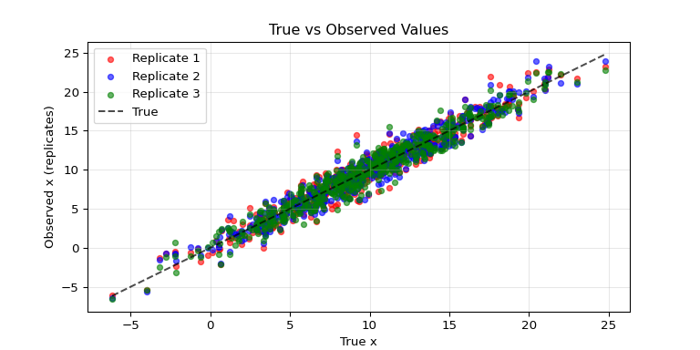

# Bayesian Measurement Error Correction

In this tutorial, we implement a flexible distributional regression
model with Bayesian measurement error correction in Liesel. The model
should capture the (potentially) non-linear effect of a continuous
covariate $x$, which is assumed to be suspect of a measurement error.

## Measurement Error

Assuming a total number of $M$ replicates of the covariate $x$ affected
by measurement error, we can write the measurement error model as

$$
\tilde{x}_i^{(m)} = x_i + u_i^{(m)}, \quad m = 1, \ldots, M.
$$

The measurement error is assumed to follow a multivariate Gaussian
model, such that

$$
\mathbf{u}_i \sim N_M(\mathbf{0}, \mathbf{\Sigma}_{u,i}).
$$

The fundamental concept behind Bayesian measurement error correction is
to treat the true, unknown covariate values $x_i$ as additional latent
variables. These values are then imputed using MCMC simulations while
simultaneously estimating all other parameters of the model. To achieve
this, a prior distribution is assigned to $x_i$. Additional flexibility
is achieved by adding hyperpriors with assigned prior distributions to
the distribution parameters of $x_i$. $$
x_i \sim N(\mu_x,\tau^2_x), \quad \mu_x \sim N(0, \tau^2_{\mu}), \quad \tau^2_x \sim IG(a_x,b_x)
$$

``` python
import jax
import jax.numpy as jnp
import liesel.model as lsl
import liesel.goose as gs
import liesel.contrib.splines as splines
import tensorflow_probability.substrates.jax as tfp
import tensorflow_probability.substrates.jax.bijectors as tfb
import numpy as np
import matplotlib.pyplot as plt

from liesel.contrib.splines import equidistant_knots, basis_matrix
from liesel.distributions.mvn_degen import MultivariateNormalDegenerate

tfd = tfp.distributions
```

## Data

We will start by simulating some data with replicates. To introduce
heteroscedasticity we scale the first half of the covariance matrices by
one and the second by two.

``` python
# Define the number of samples and replicates
n = 500  # Number of data points
M = 3    # Number of replicates per sample
c_u = 0.75 # define measurement error covariance

np.random.seed(123)

x = np.random.normal(loc = 10, scale = 5, size = n)

# Generate covariance matrices
def create_sigma_me(dim_sigma_me, c_u):
    Sigma_me = np.zeros((dim_sigma_me, dim_sigma_me))
    for i in range(dim_sigma_me):
        for j in range(dim_sigma_me):
            if i == j:
                Sigma_me[i, j] = 1
            else:
                Sigma_me[i, j] = c_u
    return Sigma_me

# Scale the Sigma_me matrices by individual variance factor
sigma_matrices = []
for i in range(n):
    sigma_sq_ui = 1 if i < n // 2 else 2  # First half scaled by 1, second half by 2
    Sigma_me = create_sigma_me(M, c_u)
    scaled_matrix = sigma_sq_ui * Sigma_me
    sigma_matrices.append(scaled_matrix)

    sigma_matrices_array = jnp.array(np.stack(sigma_matrices))

# Create M replicates of true variable x
replicates = []
for i in range(n):
    mean_vector = np.repeat(x[i], M)
    Sigma_me = sigma_matrices[i]
    samples = np.random.multivariate_normal(mean_vector, Sigma_me)
    replicates.append(samples)

# Generate response variable y
variances = np.random.choice([0.3, 0.5], size = n)
y_true = np.sin(x)
y = np.random.normal(loc = np.sin(x), scale = np.sqrt(variances))

# Convert to JAX arrays
x = jnp.array(x)
x_tilde = jnp.array(np.array(replicates))
y = jnp.array(y)
sigma = jnp.array(np.stack(sigma_matrices))
```

``` python
# Plot Data
fig, ax1 = plt.subplots(figsize=(8, 4))

# True x vs observed replicates
ax1.scatter(x, x_tilde[:, 0], alpha=0.6, s=20, label='Replicate 1', color='red')
ax1.scatter(x, x_tilde[:, 1], alpha=0.6, s=20, label='Replicate 2', color='blue')
ax1.scatter(x, x_tilde[:, 2], alpha=0.6, s=20, label='Replicate 3', color='green')
ax1.plot([x.min(), x.max()], [x.min(), x.max()], 'k--', alpha=0.7, label='True')
ax1.set_xlabel('True x')
ax1.set_ylabel('Observed x (replicates)')
ax1.set_title('True vs Observed Values')
ax1.legend()
ax1.grid(True, alpha=0.3)
```



## Implementing the Model in Liesel

Now that we have our data we can define our distributions from above in
Liesel, setting $\tau^2_{\mu} = 1000$ and $a_x = b_x = 0.001$. We will
initialize $x$ using the mean of our observed measurements. We also need
to assign a distribution to the observed measurements, where we choose a
[`multivariate normal distribution`](https://www.tensorflow.org/probability/api_docs/python/tfp/distributions/MultivariateNormalFullCovariance?hl=en).
Note that we are building a hierarchical model by providing a
{class}`.Var` instance for the `loc` and `scale` arguments of the
different distributions.

``` python
# Define hyperparameters for variance of x
a_x = lsl.Var.new_param(0.001, name = "a_x")
b_x = lsl.Var.new_param(0.001, name = "b_x")

# Define prior for tau2_x using an Inverse Gamma distribution
tau2_x_prior = lsl.Dist(tfd.InverseGamma, concentration = a_x, scale = b_x)
tau2_x = lsl.Var.new_param(10.0, distribution = tau2_x_prior, name = "tau2_x")

# Define hyperparameters for mu_x (mean of x)
location_mu_x_prior = lsl.Var.new_param(0.0, name = "location_mu_x_prior")
scale_mu_x_prior = lsl.Var.new_param(1000.0, name = "scale_mu_x_prior")

# Define prior for mu_x using a Normal distribution
mu_x_prior = lsl.Dist(tfd.Normal, loc = location_mu_x_prior, scale = scale_mu_x_prior)

# Define mu_x as a parameter with the prior distribution
mu_x = lsl.Var.new_param(0.0, distribution = mu_x_prior, name = "mu_x")

# Define prior distribution for x
x_prior_dist = lsl.Dist(tfd.Normal, loc = mu_x, scale = tau2_x)

# Estimate x using the mean of replicates and assign a prior distribution
x_estimated = lsl.Var.new_param(jnp.expand_dims(x_tilde.mean(axis = 1), -1), # initial estimation is the mean of the replicates
                                distribution = x_prior_dist,
                                name = "x_estimated")

# Define likelihood model for measurement error
measurement_dist = lsl.Dist(
    tfd.MultivariateNormalFullCovariance,
    loc = x_estimated,
    covariance_matrix = sigma
    )

# Define x_tilde (observed replicates) as observed data in the probabilistic model
x_tilde_var = lsl.Var.new_obs(
    value = x_tilde,
    distribution = measurement_dist,
    name = "x_tilde"
)
```

## The Distributional Regression Model

Following that we will set up our distributional regression model using
P-splines. Assuming a Gaussian with $N(\mu_i, \sigma_i^{2})$ for the
response, the regression parameters are linked to the model parameters
by $\mu_i = \eta^{\mu}(x_i)$ and
$\sigma_i^{2} = exp(\eta^{\sigma^{2}}(x_i))$, where $exp(\cdot)$ ensures
positivity of the scale parameter. The predictors are then given by:

$$
\eta^{\mu}(x_i) = \beta_{0}^{\mu} + f^{\mu}(x_i)
$$

and

$$
\eta^{\sigma^{2}}(x_i) = \beta_{0}^{\sigma^{2}} + f^{\sigma^{2}}(x_i),
$$

$\beta_{0}$ being an intercept term, and

$$
f(\cdot) = \mathbf{b}_i'\boldsymbol{\beta}.
$$

$\mathbf{b}_i'$ is defined as the vector of the evaluations of the basis
function and $\boldsymbol{\beta}$ represents the corresponding vector of
the basis coefficients. In our implementation we set $\beta_0 = 0$. We
generate equidistant knots based on the observed $x$-values and
construct cubic B-spline basis matrices for both functions using the
Liesel {func}`.basis_matrix()` implementation. The number of knots is
set to 20.

``` python
# Define Number of knots/spline parameters to use
n_param_splines = 20

# Generate equidistant knots for spline basis functions based on the mean of replicates (x_tilde)
knots = equidistant_knots(jnp.expand_dims(x_tilde.mean(axis = 1), -1), n_param = n_param_splines, order = 3)

# Compute spline basis matrix for modeling the mean function
basis_matrix_var_mu = lsl.Var.new_calc(
    lambda x: splines.basis_matrix(
        x.squeeze(),
        knots = knots,    # Use precomputed knots
        order = 3,        # Cubic spline basis
        outer_ok = True),
    x = x_estimated,
    name = "basis_matrix_mu"
)

# Compute spline basis matrix for modeling the scale
basis_matrix_var_scale = lsl.Var.new_calc(
    lambda x: splines.basis_matrix(
        x.squeeze(),
        knots = knots,
        order = 3,
        outer_ok = True),
    x = x_estimated,
    name = "basis_matrix_scale"
)

# Define intercept parameters for the mean and scale functions in the spline model
b0_mu = lsl.Var.new_param(0.0, name = "b0_mu")
b0_scale = lsl.Var.new_param(0.0, name = "b0_scale")

# Predictive function for the spline model
# Computes the linear predictor: intercept + basis function expansion
def pred_fn(beta0, spline_coef, basis_matrix):
    return beta0 + jnp.dot(basis_matrix, spline_coef)
```

To facilitate a large number of basis functions, we assign informative
multivariate Gaussian priors to the vector of spline coefficients,
enforcing certain properties of function estimates, such as smoothness
and shrinkage. To achieve those properties, each parameter vector
$\boldsymbol{\beta}$ is assigned a prior distribution $$\begin{equation}
f(\boldsymbol{\beta}|\tau^2) \propto (\tau^2)^{-\frac{\textrm{rk}(K)}{2}} \exp \left( -\frac{1}{2\tau^2}\boldsymbol{\beta}'K\boldsymbol{\beta} \right),
\end{equation}
$$ with prior variance $\tau^2$ and a positive semi-definite prior
precision matrix $K$.
To enforce smoothness in the spline models, we use second-order
difference penalties for the prior precision matrices.

``` python
# Define hyperparameters for the variance of the mean function
a_var_mu = lsl.Var(0.001, name = "a_mu")
b_var_mu = lsl.Var(0.001, name = "b_mu")

# Define hyperparameters for the variance of the scale function
a_var_scale = lsl.Var(0.001, name = "a_scale")
b_var_scale = lsl.Var(0.001, name = "b_scale")

# Define prior tau2_mu distributions using Inverse Gamma
prior_tau2_mu = lsl.Dist(tfd.InverseGamma, concentration = a_var_mu, scale = b_var_mu)
tau2_mu = lsl.Var.new_param(10.0, distribution = prior_tau2_mu, name = "tau2_mu")

# Define prior tau2_scale distributions using Inverse Gamma
prior_tau2_scale = lsl.Dist(tfd.InverseGamma, concentration = a_var_scale, scale = b_var_scale)
tau2_scale = lsl.Var.new_param(10.0, distribution = prior_tau2_scale, name = "tau2_scale")

# Compute P-spline penalty matrix (2nd-order difference for smoothness)
penalty = splines.pspline_penalty(d = n_param_splines, diff = 2)

# Define penalty matrices for scale and mean functions
penalty_scale = lsl.Var(penalty, name = "penalty_scale")
penalty_mu = lsl.Var(penalty, name = "penalty_mu")

# Compute eigenvalues of the penalty matrix
evals = jax.numpy.linalg.eigvalsh(penalty)

# Compute rank of the penalty matrix (number of positive eigenvalues)
rank_scale = lsl.Value(jnp.sum(evals > 0.0), _name = "rank_scale")
rank_mu = lsl.Value(jnp.sum(evals > 0.0), _name = "rank_mu")

# Compute log determinant of the penalty matrix (ignoring zero eigenvalues)
log_pdet = jnp.log(jnp.where(evals > 0.0, evals, 1.0)).sum()
log_pdet_mu = lsl.Value(log_pdet, _name = "log_pdet_mu")
log_pdet_scale = lsl.Value(log_pdet, _name = "log_pdet_scale")

# Define prior distribution for spline coefficients (scale function)
prior_coef_scale  = lsl.Dist(
    MultivariateNormalDegenerate.from_penalty,
    loc = jnp.zeros(shape = (n_param_splines,)),
    var = tau2_scale,
    pen = penalty_scale,
    rank = rank_scale,
    log_pdet = log_pdet_scale
    )

# Initialize spline coefficients for scale function
start_value_scale = np.zeros(np.shape(penalty)[-1], np.float32)
coef_scale = lsl.Var.new_param(start_value_scale, distribution = prior_coef_scale, name = "coef_scale")

# Define prior distribution for spline coefficients (mean function)
prior_coef_mu = lsl.Dist(
    MultivariateNormalDegenerate.from_penalty,
    loc = jnp.zeros(shape = (n_param_splines,)),
    var = tau2_mu,
    pen = penalty_mu,
    rank = rank_mu,
    log_pdet = log_pdet_mu
    )

# Initialize spline coefficients for mean function
start_value_mu = np.zeros(np.shape(penalty)[-1], np.float32)
coef_mu = lsl.Var.new_param(start_value_mu, distribution = prior_coef_mu, name = "coef_mu")
```

Then we can implement functions to calculate the the standard deviation
and mean of our response, using {meth}`~.model.Var.new_calc`.

``` python
# Compute the scale (standard deviation) of y using the spline model
scale_of_y = lsl.Var.new_calc(
    pred_fn,
    beta0 = b0_scale,                       # Intercept for scale function
    spline_coef = coef_scale,               # Spline coefficients for scale
    basis_matrix = basis_matrix_var_scale,  # Basis matrix for scale
    name = "scale_of_y"
)

# Transform scale_of_y to ensure positivity (exponential transformation)
scale_of_y_transformed = lsl.Var.new_calc(jnp.exp, scale_of_y, name = "scale_of_y_transformed")

# Compute the mean (mu) of y using the spline model
mu_of_y = lsl.Var.new_calc(
    pred_fn,
    beta0 = b0_mu,
    spline_coef = coef_mu,
    basis_matrix = basis_matrix_var_mu,
    name = "mu_of_y"
)

# Define the likelihood distribution of y (Normal with estimated mean and scale)
y_dist = lsl.Dist(
    tfd.Normal,
    loc = mu_of_y,
    scale = scale_of_y_transformed
  )

# Define y as an observed variable with the specified distribution
y_var = lsl.Var.new_obs(
    value = y,
    distribution = y_dist,
    name = "y"
)
```

And take a look at our model

``` python
# create joint model for x and y
model = lsl.Model([y_var, x_tilde_var])

# Plot tree
model.plot_vars()
```


## MCMC Inference

We choose {class}`~.goose.IWLSKernel` kernels for generating posterior
samples of the scale and mean coefficients. To draw from $\mu_x$,
$\tau^2_x$, $\tau^2_{\mu}$ and $\tau^2_{\sigma}$ we use Gibbs kernels
({class}`~.goose.GibbsKernel`), as this allows us to use custom
transition functions for our parameters. The full conditionals are:

$$
\begin{eqnarray}
\mu_x | \cdot \sim N \left(\frac{n\bar{x}\tau^2_\mu}{n\tau^2_\mu+\tau^2_x},\frac{\tau^2_x\tau^2_\mu}{n\tau^2_\mu+\tau^2_x}\right)\\
\tau^2_x | \cdot \sim IG \left( a_x + \frac{n}{2}, b_x + \frac{1}{2}\sum_{i=1}^{n}(x_i - \mu_x)^2   \right)\\
\tau^2|\cdot \sim IG\left(a + \frac{rk(\mathbf{K})}{2}, b + \frac{1}{2} \boldsymbol{\beta'K\beta}\right)\\
\end{eqnarray}.
$$

Further we utilize a Metropolis-Hastings kernel
({class}`~.goose.MHKernel`) to sample the $x$ values. This also allows
us to implement our own transition function.

``` python
def transition_tau_mu(prng_key, model_state):
    """
    Sample tau2_mu from its posterior distribution using Gibbs sampling.

    Args:
        prng_key: The random number generator key for sampling.
        model_state: A dictionary containing the model parameters and state.

    Returns:
        dict: A dictionary containing the sampled tau2_mu.
    """
    # Extract relevant parameters from model state
    pos = interface.extract_position(
        position_keys=["a_mu", "b_mu", "rank_mu", "penalty_mu", "coef_mu"],
        model_state = model_state
    )
    # Extract values from position
    a_prior = pos["a_mu"]
    b_prior = pos["b_mu"]
    rank = pos["rank_mu"]
    K = pos["penalty_mu"]
    beta = pos["coef_mu"]

    # Compute the Gibbs sampling parameters
    a_gibbs = jnp.squeeze(a_prior + 0.5 * rank)
    b_gibbs = jnp.squeeze(b_prior + 0.5 * (beta @ K @ beta))

    # Draw a sample from the gamma distribution
    draw = b_gibbs / jax.random.gamma(prng_key, a_gibbs)

    return {"tau2_mu": draw}


def transition_tau_scale(prng_key, model_state):
    """
    Sample tau_scale from its posterior distribution using Gibbs sampling.

    Args:
        prng_key: The random number generator key for sampling.
        model_state: A dictionary containing the model parameters and state.

    Returns:
        dict: A dictionary containing the sampled tau_scale.
    """
    # Extract relevant parameters from model state
    pos = interface.extract_position(
        position_keys = ["a_scale", "b_scale", "rank_scale", "penalty_scale", "coef_scale"],
        model_state = model_state
    )
    # Extract values from position
    a_prior = pos["a_scale"]
    b_prior = pos["b_scale"]
    rank = pos["rank_scale"]
    K = pos["penalty_scale"]
    beta = pos["coef_scale"]

    # Compute the Gibbs sampling parameters
    a_gibbs = jnp.squeeze(a_prior + 0.5 * rank)
    b_gibbs = jnp.squeeze(b_prior + 0.5 * (beta @ K @ beta))

    # Draw a sample from the gamma distribution
    draw = b_gibbs / jax.random.gamma(prng_key, a_gibbs)

    return {"tau2_scale" : draw}

def transition_mu_x(prng_key, model_state):
    """
    Sample mu_x from its posterior distribution conditioned on the data.

    Args:
        prng_key: The random number generator key for sampling.
        model_state: A dictionary containing the model parameters and state.

    Returns:
        dict: A dictionary containing the sampled mu_x.
    """
    # Extract relevant parameters from model state
    pos = interface.extract_position(
        position_keys = ["x_estimated", "tau2_mu", "tau2_x", "a_x", "b_x"],
        model_state = model_state
    )
    x = pos["x_estimated"]
    n = len(x)
    tau2_mu = pos["tau2_mu"]
    tau2_x = pos["tau2_x"]
    a_x = pos["a_x"]
    b_x = pos["b_x"]

    # Compute the posterior mean and standard deviation for mu_x
    normal_sample = jax.random.normal(prng_key, (1,))
    mu_mean = (n * jnp.mean(x) * tau2_mu) / (n * tau2_mu + tau2_x)
    mu_std = jnp.sqrt(tau2_x * tau2_mu / (n * tau2_mu + tau2_x))

    # Sample mu_x from a normal distribution
    mu_x = jnp.squeeze(mu_mean + mu_std * normal_sample)

    return {"mu_x": mu_x}


def transition_tau2_x(prng_key, model_state):
    """
    Sample tau2_x from its posterior distribution using the inverse gamma distribution.

    Args:
        prng_key: The random number generator key for sampling.
        model_state: A dictionary containing the model parameters and state.

    Returns:
        dict: A dictionary containing the sampled tau2_x.
    """
    # Extract relevant parameters from model state
    pos = interface.extract_position(
        position_keys = ["a_x", "b_x", "x_estimated", "mu_x", "b_x"],
        model_state = model_state
    )
    a_x = pos["a_x"]
    b_x = pos["b_x"]
    x = pos["x_estimated"]
    n = len(x)
    mu_x = pos["mu_x"]

    # Compute the new alpha and beta for the inverse gamma distribution
    alpha_new = a_x + n / 2
    beta_new = b_x + ((x - mu_x)**2).sum() / 2

    # Sample tau2_x from the inverse gamma distribution
    tau2_x = jnp.squeeze(tfd.InverseGamma(concentration = alpha_new, scale = beta_new).sample(seed = prng_key))

    return {"tau2_x" : tau2_x}

def x_proposal(key, model_state, step_size):
    """
    Propose a new value for x using a Metropolis-Hastings proposal distribution.

    Args:
        key: The random number generator key for sampling.
        model_state: A dictionary containing the model parameters and state.
        step_size: A scaling factor for the proposal distribution.

    Returns:
        gs.MHProposal: A Metropolis-Hastings proposal object containing the proposed x values and the log correction.
    """
    # Extract current values of x_estimated and x_tilde from model state
    pos = interface.extract_position(
        position_keys=["x_estimated", "x_tilde"],
        model_state = model_state
    )
    x_current = pos["x_estimated"].squeeze()  # Turn from (n, 1) into (n,)
    n, m = pos["x_tilde"].shape

    # Initialize the step size scaling factor and covariance matrix
    g = 1.0
    M = m
    eye_matrices = jnp.eye(m, dtype = jnp.float32)

    # Create a stack of identity matrices and draw normal samples
    sigma = jnp.stack([eye_matrices for _ in range(n)])  # (n, m, m)
    normal_samples = jax.random.normal(key, (n,))  # (n,)

    # Compute the scale factor for the proposal
    trace_values = jnp.trace(sigma, axis1=1, axis2=2)  # (n,)
    scale_factor = (g * trace_values / (M**2))  # (n,)

    # Propose new x values
    x_proposed = x_current + scale_factor * normal_samples * step_size  # (n,)
    pos = {"x_estimated": jnp.expand_dims(x_proposed, -1)}  # Turn back into (n, 1)

    return gs.MHProposal(pos, log_correction = 0.0)
```

We set up our engine and draw 10.000 posterior samples.

``` python
#add kernels and return engine
interface = gs.LieselInterface(model)
eb_sample = gs.EngineBuilder(seed = 2 , num_chains=4)
eb_sample.set_model(gs.LieselInterface(model))
eb_sample.set_initial_values(model.state)
eb_sample.show_progress = False

eb_sample.add_kernel(gs.IWLSKernel(["coef_scale"]))
eb_sample.add_kernel(gs.IWLSKernel(["coef_mu"]))
eb_sample.add_kernel(gs.GibbsKernel(["tau2_mu"], transition_tau_mu))
eb_sample.add_kernel(gs.GibbsKernel(["tau2_scale"], transition_tau_scale))
eb_sample.add_kernel(gs.GibbsKernel(["mu_x"], transition_mu_x))
eb_sample.add_kernel(gs.MHKernel(["x_estimated"], x_proposal))
eb_sample.add_kernel(gs.GibbsKernel(["tau2_x"], transition_tau2_x))


eb_sample.set_duration(warmup_duration = 5000, posterior_duration = 10000, thinning_posterior = 10)

eb_sample.positions_included = ["mu_of_y", "scale_of_y_transformed"]

engine = eb_sample.build()
engine.sample_all_epochs()
```

Now we can take a look at the results for our parameters

``` python
results = engine.get_results()
gs.Summary(results, deselected = ["x_estimated", "scale_of_y_transformed", "mu_of_y", "mu_x", "tau2_mu", "tau2_scale", "tau2_x"])
```

<p>

<strong>Parameter summary:</strong>
</p>

<table border="0" class="dataframe">

<thead>

<tr style="text-align: right;">

<th>

</th>

<th>

</th>

<th>

kernel
</th>

<th>

mean
</th>

<th>

sd
</th>

<th>

q_0.05
</th>

<th>

q_0.5
</th>

<th>

q_0.95
</th>

<th>

sample_size
</th>

<th>

ess_bulk
</th>

<th>

ess_tail
</th>

<th>

rhat
</th>

</tr>

<tr>

<th>

parameter
</th>

<th>

index
</th>

<th>

</th>

<th>

</th>

<th>

</th>

<th>

</th>

<th>

</th>

<th>

</th>

<th>

</th>

<th>

</th>

<th>

</th>

<th>

</th>

</tr>

</thead>

<tbody>

<tr>

<th rowspan="20" valign="top">

coef_mu
</th>

<th>

(0,)
</th>

<td>

kernel_01
</td>

<td>

0.849
</td>

<td>

2.307
</td>

<td>

-2.934
</td>

<td>

0.829
</td>

<td>

4.647
</td>

<td>

4000
</td>

<td>

2771.564
</td>

<td>

3055.442
</td>

<td>

1.002
</td>

</tr>

<tr>

<th>

(1,)
</th>

<td>

kernel_01
</td>

<td>

0.536
</td>

<td>

0.950
</td>

<td>

-1.000
</td>

<td>

0.536
</td>

<td>

2.066
</td>

<td>

4000
</td>

<td>

2446.637
</td>

<td>

3025.848
</td>

<td>

1.004
</td>

</tr>

<tr>

<th>

(2,)
</th>

<td>

kernel_01
</td>

<td>

0.033
</td>

<td>

0.849
</td>

<td>

-1.347
</td>

<td>

0.024
</td>

<td>

1.424
</td>

<td>

4000
</td>

<td>

2443.155
</td>

<td>

3274.088
</td>

<td>

1.002
</td>

</tr>

<tr>

<th>

(3,)
</th>

<td>

kernel_01
</td>

<td>

-0.727
</td>

<td>

0.680
</td>

<td>

-1.856
</td>

<td>

-0.711
</td>

<td>

0.373
</td>

<td>

4000
</td>

<td>

2427.146
</td>

<td>

2965.745
</td>

<td>

1.002
</td>

</tr>

<tr>

<th>

(4,)
</th>

<td>

kernel_01
</td>

<td>

-0.549
</td>

<td>

0.407
</td>

<td>

-1.228
</td>

<td>

-0.546
</td>

<td>

0.118
</td>

<td>

4000
</td>

<td>

2522.317
</td>

<td>

3552.401
</td>

<td>

1.000
</td>

</tr>

<tr>

<th>

(5,)
</th>

<td>

kernel_01
</td>

<td>

0.343
</td>

<td>

0.337
</td>

<td>

-0.203
</td>

<td>

0.336
</td>

<td>

0.894
</td>

<td>

4000
</td>

<td>

2966.451
</td>

<td>

3627.570
</td>

<td>

1.001
</td>

</tr>

<tr>

<th>

(6,)
</th>

<td>

kernel_01
</td>

<td>

0.369
</td>

<td>

0.261
</td>

<td>

-0.065
</td>

<td>

0.366
</td>

<td>

0.798
</td>

<td>

4000
</td>

<td>

2564.764
</td>

<td>

3216.641
</td>

<td>

1.001
</td>

</tr>

<tr>

<th>

(7,)
</th>

<td>

kernel_01
</td>

<td>

-0.688
</td>

<td>

0.223
</td>

<td>

-1.062
</td>

<td>

-0.686
</td>

<td>

-0.326
</td>

<td>

4000
</td>

<td>

2602.543
</td>

<td>

3465.360
</td>

<td>

1.000
</td>

</tr>

<tr>

<th>

(8,)
</th>

<td>

kernel_01
</td>

<td>

-0.258
</td>

<td>

0.200
</td>

<td>

-0.585
</td>

<td>

-0.255
</td>

<td>

0.069
</td>

<td>

4000
</td>

<td>

2395.252
</td>

<td>

3635.617
</td>

<td>

1.001
</td>

</tr>

<tr>

<th>

(9,)
</th>

<td>

kernel_01
</td>

<td>

0.980
</td>

<td>

0.191
</td>

<td>

0.662
</td>

<td>

0.979
</td>

<td>

1.296
</td>

<td>

4000
</td>

<td>

2706.864
</td>

<td>

3326.515
</td>

<td>

1.000
</td>

</tr>

<tr>

<th>

(10,)
</th>

<td>

kernel_01
</td>

<td>

0.139
</td>

<td>

0.184
</td>

<td>

-0.162
</td>

<td>

0.136
</td>

<td>

0.445
</td>

<td>

4000
</td>

<td>

2512.734
</td>

<td>

3425.752
</td>

<td>

1.002
</td>

</tr>

<tr>

<th>

(11,)
</th>

<td>

kernel_01
</td>

<td>

-1.146
</td>

<td>

0.208
</td>

<td>

-1.498
</td>

<td>

-1.145
</td>

<td>

-0.808
</td>

<td>

4000
</td>

<td>

1986.164
</td>

<td>

3101.412
</td>

<td>

1.003
</td>

</tr>

<tr>

<th>

(12,)
</th>

<td>

kernel_01
</td>

<td>

0.601
</td>

<td>

0.206
</td>

<td>

0.273
</td>

<td>

0.596
</td>

<td>

0.948
</td>

<td>

4000
</td>

<td>

2490.803
</td>

<td>

3481.033
</td>

<td>

1.002
</td>

</tr>

<tr>

<th>

(13,)
</th>

<td>

kernel_01
</td>

<td>

0.683
</td>

<td>

0.213
</td>

<td>

0.332
</td>

<td>

0.681
</td>

<td>

1.035
</td>

<td>

4000
</td>

<td>

2649.282
</td>

<td>

3636.594
</td>

<td>

1.001
</td>

</tr>

<tr>

<th>

(14,)
</th>

<td>

kernel_01
</td>

<td>

-0.369
</td>

<td>

0.248
</td>

<td>

-0.769
</td>

<td>

-0.365
</td>

<td>

0.040
</td>

<td>

4000
</td>

<td>

2920.125
</td>

<td>

3352.577
</td>

<td>

1.000
</td>

</tr>

<tr>

<th>

(15,)
</th>

<td>

kernel_01
</td>

<td>

-0.894
</td>

<td>

0.277
</td>

<td>

-1.366
</td>

<td>

-0.894
</td>

<td>

-0.443
</td>

<td>

4000
</td>

<td>

2808.765
</td>

<td>

3505.475
</td>

<td>

1.000
</td>

</tr>

<tr>

<th>

(16,)
</th>

<td>

kernel_01
</td>

<td>

-0.079
</td>

<td>

0.348
</td>

<td>

-0.647
</td>

<td>

-0.077
</td>

<td>

0.494
</td>

<td>

4000
</td>

<td>

2704.241
</td>

<td>

3187.044
</td>

<td>

1.001
</td>

</tr>

<tr>

<th>

(17,)
</th>

<td>

kernel_01
</td>

<td>

0.498
</td>

<td>

0.399
</td>

<td>

-0.143
</td>

<td>

0.501
</td>

<td>

1.155
</td>

<td>

4000
</td>

<td>

2244.525
</td>

<td>

3399.337
</td>

<td>

1.001
</td>

</tr>

<tr>

<th>

(18,)
</th>

<td>

kernel_01
</td>

<td>

0.971
</td>

<td>

0.568
</td>

<td>

0.048
</td>

<td>

0.966
</td>

<td>

1.900
</td>

<td>

4000
</td>

<td>

2622.571
</td>

<td>

3114.176
</td>

<td>

1.001
</td>

</tr>

<tr>

<th>

(19,)
</th>

<td>

kernel_01
</td>

<td>

1.269
</td>

<td>

1.783
</td>

<td>

-1.647
</td>

<td>

1.273
</td>

<td>

4.162
</td>

<td>

4000
</td>

<td>

2430.759
</td>

<td>

3409.399
</td>

<td>

1.001
</td>

</tr>

<tr>

<th rowspan="20" valign="top">

coef_scale
</th>

<th>

(0,)
</th>

<td>

kernel_00
</td>

<td>

0.063
</td>

<td>

0.375
</td>

<td>

-0.491
</td>

<td>

0.032
</td>

<td>

0.702
</td>

<td>

4000
</td>

<td>

1117.032
</td>

<td>

1460.748
</td>

<td>

1.003
</td>

</tr>

<tr>

<th>

(1,)
</th>

<td>

kernel_00
</td>

<td>

0.019
</td>

<td>

0.298
</td>

<td>

-0.422
</td>

<td>

-0.005
</td>

<td>

0.532
</td>

<td>

4000
</td>

<td>

1115.083
</td>

<td>

1640.652
</td>

<td>

1.004
</td>

</tr>

<tr>

<th>

(2,)
</th>

<td>

kernel_00
</td>

<td>

-0.024
</td>

<td>

0.230
</td>

<td>

-0.364
</td>

<td>

-0.043
</td>

<td>

0.367
</td>

<td>

4000
</td>

<td>

1164.802
</td>

<td>

1592.451
</td>

<td>

1.005
</td>

</tr>

<tr>

<th>

(3,)
</th>

<td>

kernel_00
</td>

<td>

-0.067
</td>

<td>

0.170
</td>

<td>

-0.325
</td>

<td>

-0.080
</td>

<td>

0.227
</td>

<td>

4000
</td>

<td>

1267.156
</td>

<td>

2115.607
</td>

<td>

1.005
</td>

</tr>

<tr>

<th>

(4,)
</th>

<td>

kernel_00
</td>

<td>

-0.106
</td>

<td>

0.124
</td>

<td>

-0.299
</td>

<td>

-0.111
</td>

<td>

0.106
</td>

<td>

4000
</td>

<td>

1442.652
</td>

<td>

2703.564
</td>

<td>

1.005
</td>

</tr>

<tr>

<th>

(5,)
</th>

<td>

kernel_00
</td>

<td>

-0.139
</td>

<td>

0.092
</td>

<td>

-0.285
</td>

<td>

-0.141
</td>

<td>

0.016
</td>

<td>

4000
</td>

<td>

1825.762
</td>

<td>

2750.323
</td>

<td>

1.003
</td>

</tr>

<tr>

<th>

(6,)
</th>

<td>

kernel_00
</td>

<td>

-0.164
</td>

<td>

0.071
</td>

<td>

-0.276
</td>

<td>

-0.166
</td>

<td>

-0.046
</td>

<td>

4000
</td>

<td>

1957.110
</td>

<td>

2788.265
</td>

<td>

1.002
</td>

</tr>

<tr>

<th>

(7,)
</th>

<td>

kernel_00
</td>

<td>

-0.181
</td>

<td>

0.060
</td>

<td>

-0.278
</td>

<td>

-0.180
</td>

<td>

-0.082
</td>

<td>

4000
</td>

<td>

1979.305
</td>

<td>

2765.185
</td>

<td>

1.001
</td>

</tr>

<tr>

<th>

(8,)
</th>

<td>

kernel_00
</td>

<td>

-0.187
</td>

<td>

0.053
</td>

<td>

-0.275
</td>

<td>

-0.186
</td>

<td>

-0.099
</td>

<td>

4000
</td>

<td>

1950.776
</td>

<td>

2713.431
</td>

<td>

1.001
</td>

</tr>

<tr>

<th>

(9,)
</th>

<td>

kernel_00
</td>

<td>

-0.181
</td>

<td>

0.048
</td>

<td>

-0.262
</td>

<td>

-0.181
</td>

<td>

-0.102
</td>

<td>

4000
</td>

<td>

1957.561
</td>

<td>

3059.560
</td>

<td>

1.001
</td>

</tr>

<tr>

<th>

(10,)
</th>

<td>

kernel_00
</td>

<td>

-0.174
</td>

<td>

0.047
</td>

<td>

-0.250
</td>

<td>

-0.174
</td>

<td>

-0.093
</td>

<td>

4000
</td>

<td>

1838.137
</td>

<td>

2621.291
</td>

<td>

1.000
</td>

</tr>

<tr>

<th>

(11,)
</th>

<td>

kernel_00
</td>

<td>

-0.174
</td>

<td>

0.047
</td>

<td>

-0.251
</td>

<td>

-0.175
</td>

<td>

-0.097
</td>

<td>

4000
</td>

<td>

2017.119
</td>

<td>

2918.301
</td>

<td>

1.000
</td>

</tr>

<tr>

<th>

(12,)
</th>

<td>

kernel_00
</td>

<td>

-0.179
</td>

<td>

0.050
</td>

<td>

-0.261
</td>

<td>

-0.179
</td>

<td>

-0.097
</td>

<td>

4000
</td>

<td>

2181.699
</td>

<td>

2714.185
</td>

<td>

1.001
</td>

</tr>

<tr>

<th>

(13,)
</th>

<td>

kernel_00
</td>

<td>

-0.183
</td>

<td>

0.056
</td>

<td>

-0.273
</td>

<td>

-0.184
</td>

<td>

-0.088
</td>

<td>

4000
</td>

<td>

1937.471
</td>

<td>

3034.611
</td>

<td>

1.000
</td>

</tr>

<tr>

<th>

(14,)
</th>

<td>

kernel_00
</td>

<td>

-0.186
</td>

<td>

0.066
</td>

<td>

-0.292
</td>

<td>

-0.187
</td>

<td>

-0.074
</td>

<td>

4000
</td>

<td>

1698.052
</td>

<td>

2690.562
</td>

<td>

1.000
</td>

</tr>

<tr>

<th>

(15,)
</th>

<td>

kernel_00
</td>

<td>

-0.195
</td>

<td>

0.082
</td>

<td>

-0.325
</td>

<td>

-0.198
</td>

<td>

-0.055
</td>

<td>

4000
</td>

<td>

1725.580
</td>

<td>

2897.959
</td>

<td>

1.000
</td>

</tr>

<tr>

<th>

(16,)
</th>

<td>

kernel_00
</td>

<td>

-0.210
</td>

<td>

0.108
</td>

<td>

-0.384
</td>

<td>

-0.213
</td>

<td>

-0.027
</td>

<td>

4000
</td>

<td>

1922.870
</td>

<td>

2638.076
</td>

<td>

1.000
</td>

</tr>

<tr>

<th>

(17,)
</th>

<td>

kernel_00
</td>

<td>

-0.227
</td>

<td>

0.147
</td>

<td>

-0.470
</td>

<td>

-0.228
</td>

<td>

0.022
</td>

<td>

4000
</td>

<td>

1894.015
</td>

<td>

2620.885
</td>

<td>

1.000
</td>

</tr>

<tr>

<th>

(18,)
</th>

<td>

kernel_00
</td>

<td>

-0.248
</td>

<td>

0.201
</td>

<td>

-0.574
</td>

<td>

-0.247
</td>

<td>

0.084
</td>

<td>

4000
</td>

<td>

1844.003
</td>

<td>

2414.133
</td>

<td>

1.001
</td>

</tr>

<tr>

<th>

(19,)
</th>

<td>

kernel_00
</td>

<td>

-0.267
</td>

<td>

0.268
</td>

<td>

-0.704
</td>

<td>

-0.265
</td>

<td>

0.177
</td>

<td>

4000
</td>

<td>

1824.848
</td>

<td>

2100.493
</td>

<td>

1.001
</td>

</tr>

</tbody>

</table>

<p>

<strong>Error summary:</strong>
</p>

<table border="0" class="dataframe">

<thead>

<tr style="text-align: right;">

<th>

</th>

<th>

</th>

<th>

</th>

<th>

</th>

<th>

count
</th>

<th>

relative
</th>

</tr>

<tr>

<th>

kernel
</th>

<th>

error_code
</th>

<th>

error_msg
</th>

<th>

phase
</th>

<th>

</th>

<th>

</th>

</tr>

</thead>

<tbody>

<tr>

<th rowspan="2" valign="top">

kernel_00
</th>

<th rowspan="2" valign="top">

90
</th>

<th rowspan="2" valign="top">

nan acceptance prob
</th>

<th>

warmup
</th>

<td>

2
</td>

<td>

0.000
</td>

</tr>

<tr>

<th>

posterior
</th>

<td>

0
</td>

<td>

0.000
</td>

</tr>

</tbody>

</table>

And the traceplots for the first three $\mu$ and $\sigma$ coefficients

``` python
# Plot the trace of all scale coefficients
fig = gs.plot_trace(results, "coef_mu", range(3))
```


``` python
# Plot the trace of all location coefficients
fig = gs.plot_trace(results, "coef_scale", range(3))
```


And at $\mu_x$

``` python
gs.plot_param(results, "mu_x")
```


