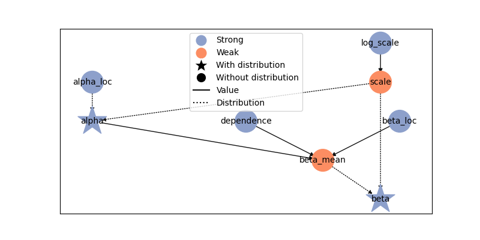

Build a variational model
=========================

Use a Liesel :class:`.Model` as the variational distribution when its parameters
or conditional dependencies are easier to express as a graph. The Gaussian
builders are optional: :class:`.NegElboLoss` accepts a target model and a
variational model directly.

Define conditional draws
------------------------

This example assumes an existing target ``model`` with scalar real-valued
parameters named ``alpha`` and ``beta`` and observed training data. The
variational model first draws ``alpha``, then draws ``beta`` conditionally on it.
A learned coefficient controls their dependence.

.. code-block:: python

   import jax
   import jax.numpy as jnp
   import optax
   import tensorflow_probability.substrates.jax.distributions as tfd

   import liesel.model as lsl
   import liesel.optim as opt

   alpha_loc = lsl.Var.new_param(0.0, name="alpha_loc")
   beta_loc = lsl.Var.new_param(0.0, name="beta_loc")
   log_scale = lsl.Var.new_param(-0.7, name="log_scale")
   scale = lsl.Var.new_calc(jnp.exp, log_scale, name="scale")
   dependence = lsl.Var.new_param(0.0, name="dependence")

   alpha = lsl.Var.new_obs(
       0.0, lsl.Dist(tfd.Normal, alpha_loc, scale), name="alpha"
   )
   beta_mean = lsl.Var.new_calc(
       lambda loc, coefficient, parent: loc + coefficient * parent,
       beta_loc, dependence, alpha, name="beta_mean",
   )
   beta = lsl.Var.new_obs(
       0.0, lsl.Dist(tfd.Normal, beta_mean, scale), name="beta"
   )
   q = lsl.Model(beta)
   q.plot(width=8, height=4)

The observed variables in ``q`` are placeholders for variational draws; they are
not training observations from the target model. Mark the strong inputs to
optimize as parameters. Derived scales and conditional means stay computed
variables. Optimizing ``log_scale`` keeps ``scale`` positive.

Every distribution sampled after fixing the variational parameters must support
reparameterized draws with differentiable paths from those parameters. Discrete distributions need a different
gradient estimator. Priors on variational parameters, if present, are optional
regularization terms; they do not cause those parameters to be sampled.

Fit and sample
--------------

Here the observed names and shapes in ``q`` already match the target parameters,
so the default identity mapping suffices.

.. code-block:: python

   loss = opt.NegElboLoss(model, q, nsamples=16, scale=True)
   result = opt.LieselVI(
       model,
       loss=loss,
       optimizers=optax.adam(0.01),
       loss_monitor=opt.EmaTrainLossMonitor(2.0),
       stopper=opt.Stopper(epochs=500, patience=50),
       seed=42,
   ).fit()
   posterior = loss.approximate_joint_posterior(result)
   draws = posterior.sample(1_000, seed=jax.random.key(43))
   {name: value.shape for name, value in draws.items()}

.. code-block:: text

   {'alpha': (1000,), 'beta': (1000,)}

Inspect the loss and parameter paths before using the approximation. A finite
fit and a decreasing monitored loss do not establish posterior accuracy.
:math:`\operatorname{E}[\mathrm{beta}\mid\mathrm{alpha}]` in this family equals
``beta_loc + dependence * alpha``. The shared positive conditional scale is a
modeling choice; use separate scale parameters when that restriction is unsuitable.

``entropy="auto"`` adds conditional entropies and averages over sampled parents.
``entropy="mc"`` uses sampled negative log densities. An explicit loss keeps its
own settings when passed to ``LieselVI``. See :doc:`variational-inference` for
monitoring and :doc:`optimizer-customization` for separate optimizer blocks.

Map names and shapes
--------------------

For different names or a flattened block, supply ``q_to_p`` to ``NegElboLoss``.
The mapping operates on one draw; Liesel applies it across sample axes. Return a
parameter dictionary with the names and original shapes used by the target model.
The :class:`.VDist` builders already provide this unflattening step.

The ELBO does not add a change-of-variables Jacobian for ``q_to_p``. Use it for
renaming and reshaping, preserving the probability density. Put distributional
transformations inside ``q`` so their density and entropy describe the actual
draws. Custom transformed families remain subject to the TFP/JAX cache limitation
tracked in `issue #418 <https://github.com/liesel-devs/liesel/issues/418>`_.

Use another objective
---------------------

``LieselVI`` configures ELBO optimization. For a different variational objective,
use :class:`.OptimEngine` with an implementation of the public :class:`.Loss`
interface. :class:`.LossMixin` supplies the gradient helpers. The custom loss owns
its variational model, maps optimizer keys to initial values through ``position``,
and returns ``(value, proposed_state)`` from ``loss_train_batched``. A stateless
loss uses ``None`` as the proposed state. It must also implement
``loss_train`` to use full-data monitoring.

Choose explicit :class:`.Optimizer` blocks over the custom loss's parameter keys
and supply the evaluation state expected by that loss. Keep inference-specific
sampling and density calculations in the loss; the engine manages batches,
optimizer steps, monitoring, and checkpoints. This route does not require a new
variational-distribution builder or changes to the existing ELBO implementation.
